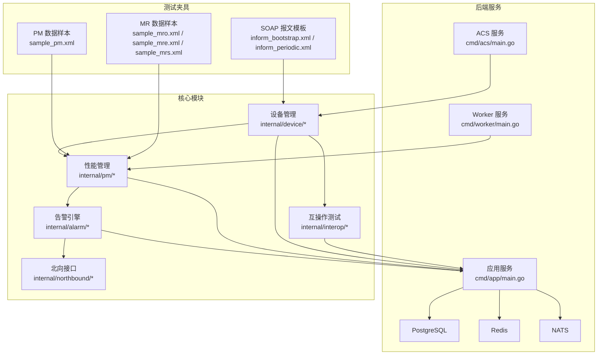
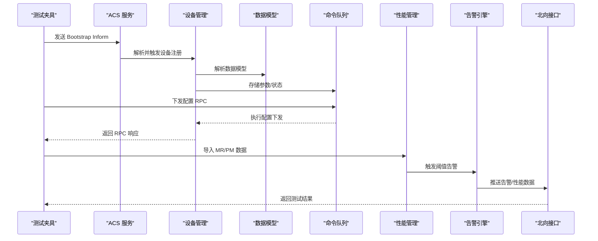
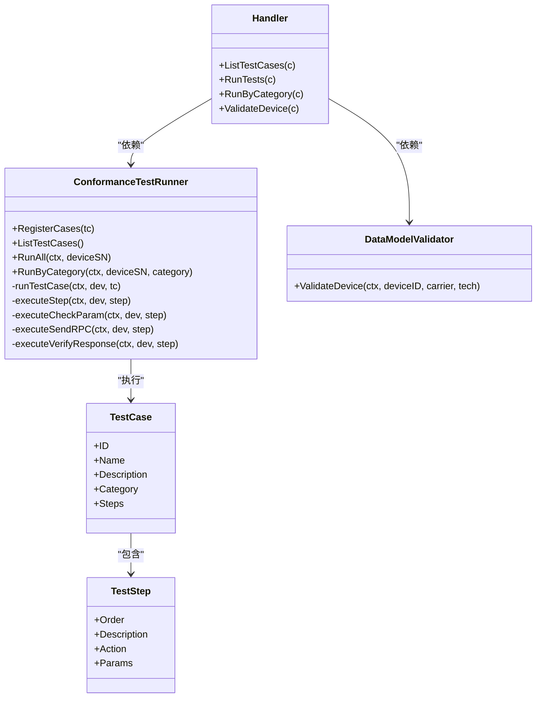
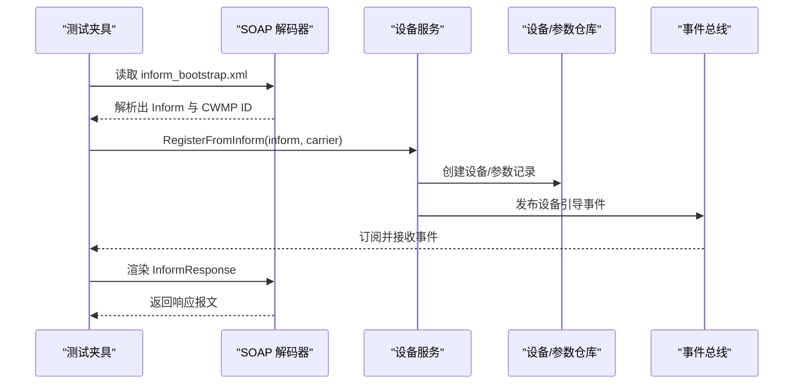
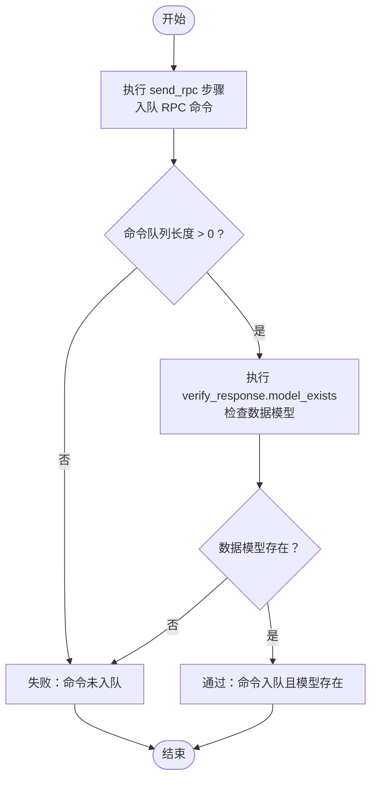
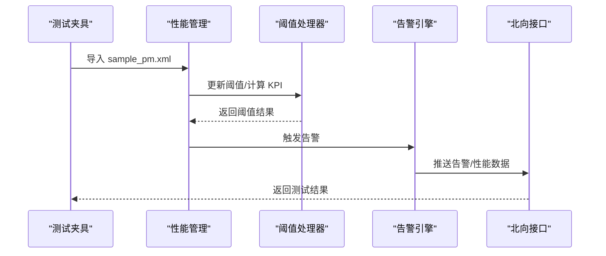
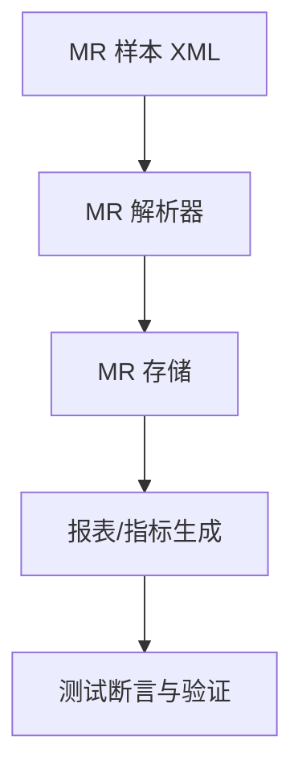
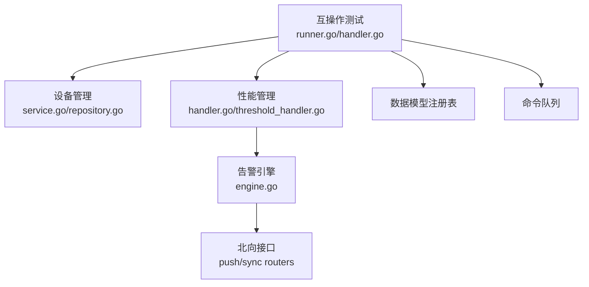

# 端到端测试

<cite>
**本文引用的文件**
- [18-互操作测试.md](file://omcgo/docs/detailed-design/18-interop-testing.md)
- [handler.go](file://omcgo/internal/interop/handler.go)
- [runner.go](file://omcgo/internal/interop/runner.go)
- [model.go](file://omcgo/internal/interop/model.go)
- [validator.go](file://omcgo/internal/interop/validator.go)
- [report.go](file://omcgo/internal/interop/report.go)
- [cases/datamodel_cases.go](file://omcgo/internal/interop/cases/datamodel_cases.go)
- [cases/protocol_cases.go](file://omcgo/internal/interop/cases/protocol_cases.go)
- [cases/rpc_cases.go](file://omcgo/internal/interop/cases/rpc_cases.go)
- [test/integration/inform_register_test.go](file://omcgo/test/integration/inform_register_test.go)
- [fixtures/soap/inform_bootstrap.xml](file://omcgo/test/fixtures/soap/inform_bootstrap.xml)
- [fixtures/soap/inform_periodic.xml](file://omcgo/test/fixtures/soap/inform_periodic.xml)
- [fixtures/mr/sample_mro.xml](file://omcgo/test/fixtures/mr/sample_mro.xml)
- [fixtures/mr/sample_mre.xml](file://omcgo/test/fixtures/mr/sample_mre.xml)
- [fixtures/mr/sample_mrs.xml](file://omcgo/test/fixtures/mr/sample_mrs.xml)
- [fixtures/pm/sample_pm.xml](file://omcgo/test/fixtures/pm/sample_pm.xml)
- [pkg/soap/templates.go](file://omcgo/pkg/soap/templates.go)
- [pkg/soap/decoder.go](file://omcgo/pkg/soap/decoder.go)
- [internal/device/service.go](file://omcgo/internal/device/service.go)
- [internal/device/repository.go](file://omcgo/internal/device/repository.go)
- [internal/device/param_repository.go](file://omcgo/internal/device/param_repository.go)
- [internal/device/inform_handler.go](file://omcgo/internal/device/inform_handler.go)
- [internal/device/state_machine.go](file://omcgo/internal/device/state_machine.go)
- [internal/pm/handler.go](file://omcgo/internal/pm/handler.go)
- [internal/pm/task_model.go](file://omcgo/internal/pm/task_model.go)
- [internal/pm/threshold_handler.go](file://omcgo/internal/pm/threshold_handler.go)
- [internal/alarm/engine.go](file://omcgo/internal/alarm/engine.go)
- [internal/northbound/push/router.go](file://omcgo/internal/northbound/push/router.go)
- [internal/northbound/sync/router.go](file://omcgo/internal/northbound/sync/router.go)
- [internal/northbound/alarm_handler.go](file://omcgo/internal/northbound/alarm_handler.go)
- [internal/northbound/pm_handler.go](file://omcgo/internal/northbound/pm_handler.go)
- [scripts/seed_e2e_testdata.sql](file://omcgo/scripts/seed_e2e_testdata.sql)
- [scripts/loadtest/main.go](file://omcgo/scripts/loadtest/main.go)
- [cmd/acs/main.go](file://omcgo/cmd/acs/main.go)
- [cmd/app/main.go](file://omcgo/cmd/app/main.go)
- [cmd/worker/main.go](file://omcgo/cmd/worker/main.go)
- [deployments/docker/docker-compose.yml](file://omcgo/deployments/docker/docker-compose.yml)
- [deployments/k8s/app/deployment.yaml](file://omcgo/deployments/k8s/app/deployment.yaml)
- [deployments/k8s/acs/deployment.yaml](file://omcgo/deployments/k8s/acs/deployment.yaml)
- [deployments/k8s/worker/deployment.yaml](file://omcgo/deployments/k8s/worker/deployment.yaml)
- [deployments/monitoring/grafana-dashboard.json](file://omcgo/deployments/monitoring/grafana-dashboard.json)
</cite>

## 目录
1. [简介](#简介)
2. [项目结构](#项目结构)
3. [核心组件](#核心组件)
4. [架构总览](#架构总览)
5. [详细组件分析](#详细组件分析)
6. [依赖分析](#依赖分析)
7. [性能考虑](#性能考虑)
8. [故障排查指南](#故障排查指南)
9. [结论](#结论)
10. [附录](#附录)

## 简介
本文件面向 Baicells OMC 项目的端到端测试，围绕设备注册、配置下发、性能数据采集、告警处理等完整业务流程，系统化阐述测试设计理念、测试场景覆盖、测试夹具准备与管理、测试环境搭建与数据导入策略，并提供可执行的测试自动化与回归测试策略建议。文档同时给出从设备接入到业务完成的完整测试流程示例，帮助测试团队高效落地互操作测试（F10）与集成测试。

## 项目结构
OMC 后端采用多服务分层架构，包含应用服务、ACS（TR-069接入控制）服务、Worker 工作器以及数据库与消息中间件等基础设施。测试相关的关键位置如下：
- 互操作测试模块：提供 TR-069 协议一致性、数据模型一致性、端到端联调测试能力
- 设备管理模块：负责设备注册、状态机、Inform 处理与参数存储
- 性能管理模块：PM 数据采集、KPI 计算与阈值告警
- 告警引擎：告警规则匹配与存储
- 北向接口：同步/推送通道，对接上层 OSS 系统
- 测试夹具：SOAP 报文模板、MR/PM 数据样本、种子数据脚本
- 部署与监控：Docker Compose 与 Kubernetes 部署配置，Grafana 监控面板

图表来源
- [cmd/app/main.go](file://omcgo/cmd/app/main.go)
- [cmd/acs/main.go](file://omcgo/cmd/acs/main.go)
- [cmd/worker/main.go](file://omcgo/cmd/worker/main.go)
- [internal/interop/handler.go](file://omcgo/internal/interop/handler.go)
- [internal/device/service.go](file://omcgo/internal/device/service.go)
- [internal/pm/handler.go](file://omcgo/internal/pm/handler.go)
- [internal/alarm/engine.go](file://omcgo/internal/alarm/engine.go)
- [internal/northbound/push/router.go](file://omcgo/internal/northbound/push/router.go)
- [internal/northbound/sync/router.go](file://omcgo/internal/northbound/sync/router.go)

章节来源
- [cmd/app/main.go](file://omcgo/cmd/app/main.go)
- [cmd/acs/main.go](file://omcgo/cmd/acs/main.go)
- [cmd/worker/main.go](file://omcgo/cmd/worker/main.go)

## 核心组件
- 互操作测试（F10）：提供协议一致性、数据模型一致性、RPC 行为与端到端联调测试的统一运行器与验证器，支持按类目运行与汇总报告输出
- 设备管理：负责设备注册、状态机推进、参数上报解析与持久化
- 性能管理：PM 文件解析、计数器聚合、KPI 计算与阈值告警
- 告警引擎：基于规则匹配与阈值触发的告警生成与存储
- 北向接口：提供同步/推送通道，将告警与性能数据向上游系统推送
- 测试夹具：SOAP 报文模板、MR/PM 数据样本、种子数据脚本，支撑真实场景模拟

章节来源
- [18-互操作测试.md](file://omcgo/docs/detailed-design/18-interop-testing.md)
- [handler.go](file://omcgo/internal/interop/handler.go)
- [runner.go](file://omcgo/internal/interop/runner.go)
- [model.go](file://omcgo/internal/interop/model.go)
- [validator.go](file://omcgo/internal/interop/validator.go)
- [report.go](file://omcgo/internal/interop/report.go)

## 架构总览
下图展示了端到端测试在系统中的位置与交互关系：测试通过 SOAP 报文驱动设备注册，随后进行配置下发与参数校验；PM/MR 数据通过北向接口进入性能与告警模块，最终形成测试报告。

图表来源
- [cmd/acs/main.go](file://omcgo/cmd/acs/main.go)
- [internal/device/inform_handler.go](file://omcgo/internal/device/inform_handler.go)
- [internal/device/state_machine.go](file://omcgo/internal/device/state_machine.go)
- [internal/interop/runner.go](file://omcgo/internal/interop/runner.go)
- [internal/pm/handler.go](file://omcgo/internal/pm/handler.go)
- [internal/alarm/engine.go](file://omcgo/internal/alarm/engine.go)
- [internal/northbound/push/router.go](file://omcgo/internal/northbound/push/router.go)

## 详细组件分析

### 互操作测试（F10）组件
互操作测试模块提供统一的测试运行器与验证器，支持按协议、数据模型、RPC、Inform 等类别运行测试用例，并生成汇总报告。其核心职责包括：
- 测试用例注册与分类
- 步骤执行与断言（字段非空、正数检查、参数路径存在、类型匹配、RPC 命令入队、数据模型存在等）
- 结果汇总与错误定位

图表来源
- [runner.go](file://omcgo/internal/interop/runner.go)
- [handler.go](file://omcgo/internal/interop/handler.go)
- [validator.go](file://omcgo/internal/interop/validator.go)
- [model.go](file://omcgo/internal/interop/model.go)

章节来源
- [18-互操作测试.md](file://omcgo/docs/detailed-design/18-interop-testing.md)
- [runner.go](file://omcgo/internal/interop/runner.go)
- [handler.go](file://omcgo/internal/interop/handler.go)
- [model.go](file://omcgo/internal/interop/model.go)
- [validator.go](file://omcgo/internal/interop/validator.go)
- [report.go](file://omcgo/internal/interop/report.go)

### 设备注册与 Inform 处理
设备注册流程从解析 Bootstrap Inform 开始，经过设备入库、参数持久化、事件发布与订阅，最终渲染 InformResponse。该流程是端到端测试的基础。

图表来源
- [test/integration/inform_register_test.go](file://omcgo/test/integration/inform_register_test.go)
- [fixtures/soap/inform_bootstrap.xml](file://omcgo/test/fixtures/soap/inform_bootstrap.xml)
- [pkg/soap/decoder.go](file://omcgo/pkg/soap/decoder.go)
- [pkg/soap/templates.go](file://omcgo/pkg/soap/templates.go)
- [internal/device/service.go](file://omcgo/internal/device/service.go)
- [internal/device/inform_handler.go](file://omcgo/internal/device/inform_handler.go)

章节来源
- [test/integration/inform_register_test.go](file://omcgo/test/integration/inform_register_test.go)
- [pkg/soap/decoder.go](file://omcgo/pkg/soap/decoder.go)
- [pkg/soap/templates.go](file://omcgo/pkg/soap/templates.go)
- [internal/device/service.go](file://omcgo/internal/device/service.go)
- [internal/device/inform_handler.go](file://omcgo/internal/device/inform_handler.go)

### 配置下发与参数校验
配置下发通过互操作测试运行器将 RPC 命令入队至设备命令队列，随后由设备侧执行并返回响应；测试运行器可验证命令是否成功入队及数据模型是否存在。

图表来源
- [runner.go](file://omcgo/internal/interop/runner.go)
- [cases/rpc_cases.go](file://omcgo/internal/interop/cases/rpc_cases.go)

章节来源
- [runner.go](file://omcgo/internal/interop/runner.go)
- [cases/rpc_cases.go](file://omcgo/internal/interop/cases/rpc_cases.go)

### 性能数据采集与告警处理
PM 数据通过性能管理模块解析与聚合，触发 KPI 计算与阈值告警；告警引擎根据规则匹配生成告警并经北向接口推送。

图表来源
- [fixtures/pm/sample_pm.xml](file://omcgo/test/fixtures/pm/sample_pm.xml)
- [internal/pm/handler.go](file://omcgo/internal/pm/handler.go)
- [internal/pm/threshold_handler.go](file://omcgo/internal/pm/threshold_handler.go)
- [internal/alarm/engine.go](file://omcgo/internal/alarm/engine.go)
- [internal/northbound/pm_handler.go](file://omcgo/internal/northbound/pm_handler.go)

章节来源
- [fixtures/pm/sample_pm.xml](file://omcgo/test/fixtures/pm/sample_pm.xml)
- [internal/pm/handler.go](file://omcgo/internal/pm/handler.go)
- [internal/pm/threshold_handler.go](file://omcgo/internal/pm/threshold_handler.go)
- [internal/alarm/engine.go](file://omcgo/internal/alarm/engine.go)
- [internal/northbound/pm_handler.go](file://omcgo/internal/northbound/pm_handler.go)

### MR 数据处理与报表
MR 数据通过 MR 管道解析与存储，支持后续报表与指标计算。测试中可使用 sample_mro/xml 样本进行端到端验证。

图表来源
- [fixtures/mr/sample_mro.xml](file://omcgo/test/fixtures/mr/sample_mro.xml)
- [fixtures/mr/sample_mre.xml](file://omcgo/test/fixtures/mr/sample_mre.xml)
- [fixtures/mr/sample_mrs.xml](file://omcgo/test/fixtures/mr/sample_mrs.xml)
- [internal/mr/parser/](file://omcgo/internal/mr/parser/)
- [internal/mr/store.go](file://omcgo/internal/mr/store.go)

章节来源
- [fixtures/mr/sample_mro.xml](file://omcgo/test/fixtures/mr/sample_mro.xml)
- [fixtures/mr/sample_mre.xml](file://omcgo/test/fixtures/mr/sample_mre.xml)
- [fixtures/mr/sample_mrs.xml](file://omcgo/test/fixtures/mr/sample_mrs.xml)
- [internal/mr/parser/](file://omcgo/internal/mr/parser/)
- [internal/mr/store.go](file://omcgo/internal/mr/store.go)

## 依赖分析
互操作测试模块与设备管理、性能管理、告警引擎、北向接口存在直接依赖关系，测试运行器通过命令队列与数据模型注册表实现跨模块协作。

图表来源
- [runner.go](file://omcgo/internal/interop/runner.go)
- [handler.go](file://omcgo/internal/interop/handler.go)
- [internal/device/service.go](file://omcgo/internal/device/service.go)
- [internal/pm/handler.go](file://omcgo/internal/pm/handler.go)
- [internal/pm/threshold_handler.go](file://omcgo/internal/pm/threshold_handler.go)
- [internal/alarm/engine.go](file://omcgo/internal/alarm/engine.go)
- [internal/northbound/push/router.go](file://omcgo/internal/northbound/push/router.go)
- [internal/northbound/sync/router.go](file://omcgo/internal/northbound/sync/router.go)

章节来源
- [runner.go](file://omcgo/internal/interop/runner.go)
- [handler.go](file://omcgo/internal/interop/handler.go)

## 性能考虑
- 测试并发与资源隔离：使用独立数据库连接池与事件总线通道，避免测试间相互干扰
- 命令队列与工作器：通过命令队列异步执行 RPC，结合 Worker 服务处理后台任务，提升吞吐量
- 监控与可观测性：利用 Grafana 面板监控关键指标，辅助定位性能瓶颈
- 负载测试脚本：提供负载测试入口，用于评估系统在高并发下的稳定性

章节来源
- [scripts/loadtest/main.go](file://omcgo/scripts/loadtest/main.go)
- [deployments/monitoring/grafana-dashboard.json](file://omcgo/deployments/monitoring/grafana-dashboard.json)

## 故障排查指南
- 设备注册失败：检查 Inform 报文格式、CWMP ID、设备序列号与 OUI 是否匹配；确认数据库清理与事件总线订阅是否正常
- 参数校验不通过：核对数据模型参数树、参数类型与取值范围；确保设备参数已正确入库
- RPC 命令未入队：检查命令队列长度与命令键命名；确认互操作测试步骤参数配置
- PM/MR 数据未生效：验证样本文件格式与解析器配置；检查阈值处理器与告警引擎状态
- 北向推送异常：确认同步/推送路由配置与上游系统连通性

章节来源
- [test/integration/inform_register_test.go](file://omcgo/test/integration/inform_register_test.go)
- [runner.go](file://omcgo/internal/interop/runner.go)
- [internal/pm/handler.go](file://omcgo/internal/pm/handler.go)
- [internal/alarm/engine.go](file://omcgo/internal/alarm/engine.go)
- [internal/northbound/push/router.go](file://omcgo/internal/northbound/push/router.go)

## 结论
通过互操作测试（F10）与集成测试的协同，Baicells OMC 项目能够系统化验证设备接入、配置下发、性能采集与告警处理的完整端到端流程。借助标准化的测试夹具、完善的测试环境与部署配置，测试团队可以高效开展自动化与回归测试，持续保障系统质量与稳定性。

## 附录

### 测试夹具使用与管理
- SOAP 报文模板：用于模拟设备的 Bootstrap/周期性 Inform，支持解析与响应渲染
- MR/PM 数据样本：用于性能数据采集与阈值告警验证
- 种子数据脚本：初始化测试所需的基础数据与配置

章节来源
- [fixtures/soap/inform_bootstrap.xml](file://omcgo/test/fixtures/soap/inform_bootstrap.xml)
- [fixtures/soap/inform_periodic.xml](file://omcgo/test/fixtures/soap/inform_periodic.xml)
- [fixtures/mr/sample_mro.xml](file://omcgo/test/fixtures/mr/sample_mro.xml)
- [fixtures/mr/sample_mre.xml](file://omcgo/test/fixtures/mr/sample_mre.xml)
- [fixtures/mr/sample_mrs.xml](file://omcgo/test/fixtures/mr/sample_mrs.xml)
- [fixtures/pm/sample_pm.xml](file://omcgo/test/fixtures/pm/sample_pm.xml)
- [scripts/seed_e2e_testdata.sql](file://omcgo/scripts/seed_e2e_testdata.sql)

### 测试环境搭建与数据导入策略
- Docker Compose：一键启动应用、ACS、Worker、数据库与监控组件
- Kubernetes：生产级部署配置，支持水平扩展与弹性伸缩
- 数据导入：通过种子脚本与测试夹具样本，批量导入设备、参数、PM/MR 数据与阈值配置

章节来源
- [deployments/docker/docker-compose.yml](file://omcgo/deployments/docker/docker-compose.yml)
- [deployments/k8s/app/deployment.yaml](file://omcgo/deployments/k8s/app/deployment.yaml)
- [deployments/k8s/acs/deployment.yaml](file://omcgo/deployments/k8s/acs/deployment.yaml)
- [deployments/k8s/worker/deployment.yaml](file://omcgo/deployments/k8s/worker/deployment.yaml)
- [scripts/seed_e2e_testdata.sql](file://omcgo/scripts/seed_e2e_testdata.sql)

### 端到端测试示例（设备接入到业务完成）
- 准备阶段：准备 SOAP 报文模板与 MR/PM 样本，设置数据库 DSN 环境变量
- 设备注册：解析 Bootstrap Inform，注册设备并验证参数入库与事件发布
- 配置下发：通过互操作测试运行器下发 RPC 命令，验证命令入队与数据模型存在
- 性能采集：导入 MR/PM 样本，触发阈值告警与 KPI 计算
- 结果验证：通过北向接口获取告警与性能数据，生成测试报告

章节来源
- [test/integration/inform_register_test.go](file://omcgo/test/integration/inform_register_test.go)
- [runner.go](file://omcgo/internal/interop/runner.go)
- [internal/pm/handler.go](file://omcgo/internal/pm/handler.go)
- [internal/alarm/engine.go](file://omcgo/internal/alarm/engine.go)
- [internal/northbound/pm_handler.go](file://omcgo/internal/northbound/pm_handler.go)

### 测试自动化与回归测试策略
- 测试用例维护：按类别组织测试用例，定期更新数据模型与阈值配置
- 自动化执行：通过 CI/CD 集成测试脚本，自动拉起测试环境并执行端到端流程
- 结果分析：基于互操作测试汇总报告，统计通过率与失败详情，定位问题根因
- 缺陷跟踪：将失败用例映射到具体模块与步骤，形成缺陷跟踪闭环

章节来源
- [handler.go](file://omcgo/internal/interop/handler.go)
- [runner.go](file://omcgo/internal/interop/runner.go)
- [report.go](file://omcgo/internal/interop/report.go)