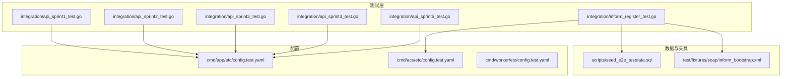
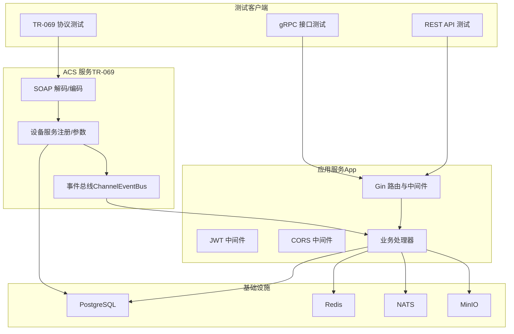
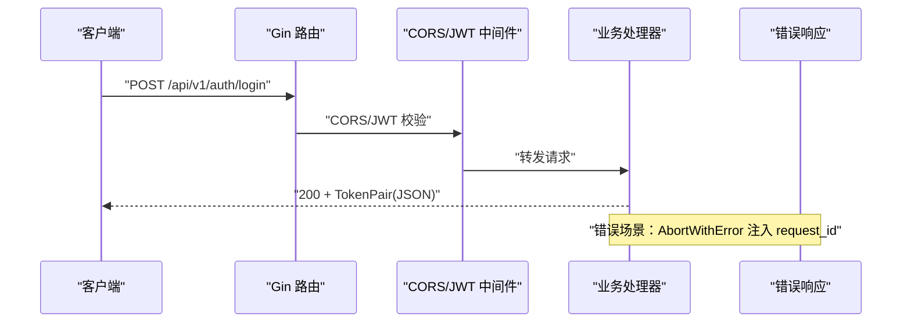
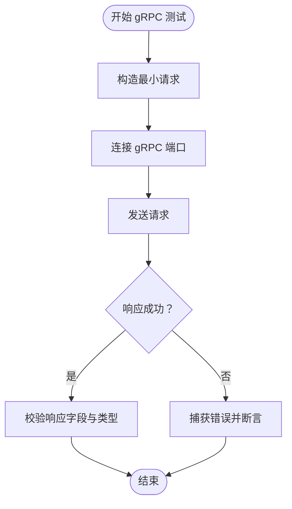
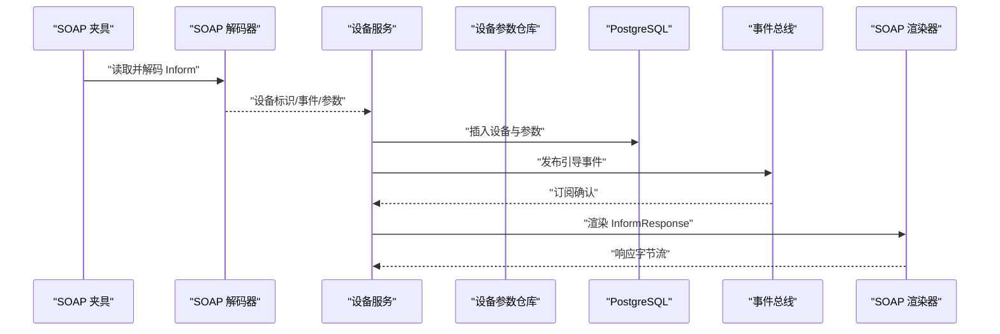
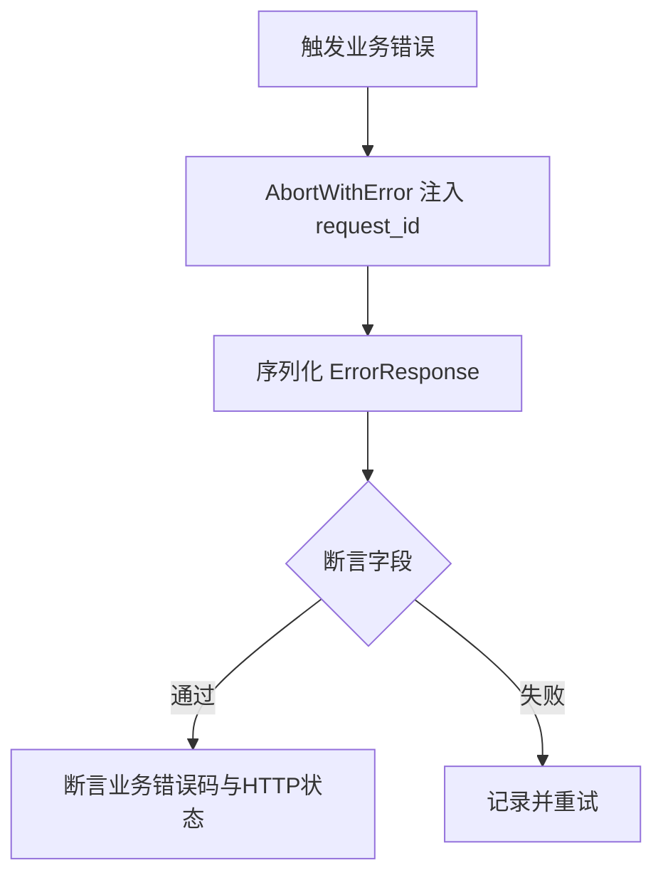
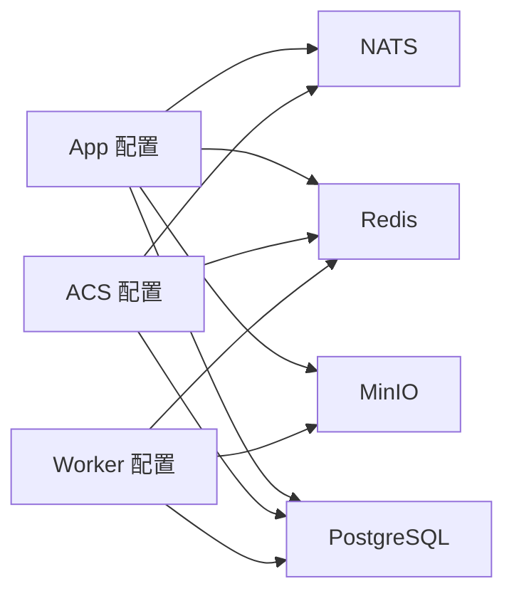

# 集成测试

<cite>
**本文档引用的文件**
- [api_sprint1_test.go](file://omcgo/test/integration/api_sprint1_test.go)
- [api_sprint2_test.go](file://omcgo/test/integration/api_sprint2_test.go)
- [api_sprint3_test.go](file://omcgo/test/integration/api_sprint3_test.go)
- [api_sprint4_test.go](file://omcgo/test/integration/api_sprint4_test.go)
- [api_sprint5_test.go](file://omcgo/test/integration/api_sprint5_test.go)
- [inform_register_test.go](file://omcgo/test/integration/inform_register_test.go)
- [config.test.yaml（app）](file://omcgo/cmd/app/etc/config.test.yaml)
- [config.test.yaml（acs）](file://omcgo/cmd/acs/etc/config.test.yaml)
- [config.test.yaml（worker）](file://omcgo/cmd/worker/etc/config.test.yaml)
- [seed_e2e_testdata.sql](file://omcgo/scripts/seed_e2e_testdata.sql)
- [inform_bootstrap.xml](file://omcgo/test/fixtures/soap/inform_bootstrap.xml)
</cite>

## 目录
1. [简介](#简介)
2. [项目结构](#项目结构)
3. [核心组件](#核心组件)
4. [架构总览](#架构总览)
5. [详细组件分析](#详细组件分析)
6. [依赖分析](#依赖分析)
7. [性能考虑](#性能考虑)
8. [故障排查指南](#故障排查指南)
9. [结论](#结论)
10. [附录](#附录)

## 简介
本文件面向 Baicells OMC 项目的集成测试，系统化阐述 REST API、gRPC 接口与 TR-069 协议的测试策略与实施要点。内容涵盖测试数据准备与数据库隔离策略、外部依赖与服务交互的模拟方式、具体 API 测试示例（请求构造、响应验证、状态码检查、错误处理）、测试环境配置与测试数据管理（测试数据库初始化、测试账户管理、配置隔离），以及集成测试最佳实践（测试顺序、依赖管理、测试清理）。

## 项目结构
集成测试主要分布在 omcgo/test/integration 目录下，按业务阶段划分为多个测试文件；同时通过测试夹具（fixtures）与 SQL 初始化脚本提供真实数据与协议样例。

**图表来源**
- [api_sprint1_test.go:1-170](file://omcgo/test/integration/api_sprint1_test.go#L1-L170)
- [api_sprint2_test.go:1-115](file://omcgo/test/integration/api_sprint2_test.go#L1-L115)
- [api_sprint3_test.go:1-98](file://omcgo/test/integration/api_sprint3_test.go#L1-L98)
- [api_sprint4_test.go:1-191](file://omcgo/test/integration/api_sprint4_test.go#L1-L191)
- [api_sprint5_test.go:1-183](file://omcgo/test/integration/api_sprint5_test.go#L1-L183)
- [inform_register_test.go:1-120](file://omcgo/test/integration/inform_register_test.go#L1-L120)
- [config.test.yaml（app）:1-91](file://omcgo/cmd/app/etc/config.test.yaml#L1-L91)
- [config.test.yaml（acs）:1-70](file://omcgo/cmd/acs/etc/config.test.yaml#L1-L70)
- [config.test.yaml（worker）:1-63](file://omcgo/cmd/worker/etc/config.test.yaml#L1-L63)
- [seed_e2e_testdata.sql:1-722](file://omcgo/scripts/seed_e2e_testdata.sql#L1-L722)
- [inform_bootstrap.xml:1-51](file://omcgo/test/fixtures/soap/inform_bootstrap.xml#L1-L51)

**章节来源**
- [api_sprint1_test.go:1-170](file://omcgo/test/integration/api_sprint1_test.go#L1-L170)
- [api_sprint2_test.go:1-115](file://omcgo/test/integration/api_sprint2_test.go#L1-L115)
- [api_sprint3_test.go:1-98](file://omcgo/test/integration/api_sprint3_test.go#L1-L98)
- [api_sprint4_test.go:1-191](file://omcgo/test/integration/api_sprint4_test.go#L1-L191)
- [api_sprint5_test.go:1-183](file://omcgo/test/integration/api_sprint5_test.go#L1-L183)
- [inform_register_test.go:1-120](file://omcgo/test/integration/inform_register_test.go#L1-L120)
- [config.test.yaml（app）:1-91](file://omcgo/cmd/app/etc/config.test.yaml#L1-L91)
- [config.test.yaml（acs）:1-70](file://omcgo/cmd/acs/etc/config.test.yaml#L1-L70)
- [config.test.yaml（worker）:1-63](file://omcgo/cmd/worker/etc/config.test.yaml#L1-L63)
- [seed_e2e_testdata.sql:1-722](file://omcgo/scripts/seed_e2e_testdata.sql#L1-L722)
- [inform_bootstrap.xml:1-51](file://omcgo/test/fixtures/soap/inform_bootstrap.xml#L1-L51)

## 核心组件
- REST API 集成测试：覆盖认证登录、用户信息、设备列表、告警与统计、仪表盘汇总、错误响应格式、CORS 行为、分页默认值、健康检查等。
- gRPC 接口测试：通过应用服务配置中的 gRPC 端口进行端到端连通性与消息序列化校验。
- TR-069 协议测试：基于 SOAP Inform 报文解析、设备注册、参数持久化、事件总线发布订阅、SOAP 响应渲染等完整链路验证。
- 错误码域与状态映射：统一业务错误码范围、HTTP 状态映射、请求 ID 注入与错误响应结构一致性。
- 数据与夹具：使用固定 UUID 的种子数据与 SOAP 夹具，确保跨模块验证可重复且可追溯。

**章节来源**
- [api_sprint1_test.go:18-34](file://omcgo/test/integration/api_sprint1_test.go#L18-L34)
- [api_sprint4_test.go:130-191](file://omcgo/test/integration/api_sprint4_test.go#L130-L191)
- [api_sprint5_test.go:101-183](file://omcgo/test/integration/api_sprint5_test.go#L101-L183)
- [inform_register_test.go:21-120](file://omcgo/test/integration/inform_register_test.go#L21-L120)

## 架构总览
集成测试围绕“应用服务（App）—ACS 服务（TR-069）—数据库（PostgreSQL）—缓存/消息中间件（Redis/NATS）—对象存储（MinIO）”构建端到端验证路径。测试通过 Gin 路由与中间件在内存中快速验证 API 行为，同时通过真实数据库与设备服务链路验证 TR-069 注册流程。

**图表来源**
- [config.test.yaml（app）:1-91](file://omcgo/cmd/app/etc/config.test.yaml#L1-L91)
- [config.test.yaml（acs）:1-70](file://omcgo/cmd/acs/etc/config.test.yaml#L1-L70)
- [inform_register_test.go:46-119](file://omcgo/test/integration/inform_register_test.go#L46-L119)

## 详细组件分析

### REST API 集成测试策略
- 登录与鉴权：验证 TokenPair 字段结构、登录请求体字段绑定、刷新请求体结构、JWT TTL 与类型。
- 资源访问：设备列表、活动告警、告警统计、仪表盘汇总等接口的分页默认值、JSON 结构一致性。
- CORS：预检与实际请求的 Origin 白名单控制、凭证允许、最大缓存时间。
- 健康检查：/healthz 返回结构与状态码。
- 错误处理：统一错误响应包含请求 ID、业务错误码传播、HTTP 状态映射、错误码域划分。

**图表来源**
- [api_sprint1_test.go:36-117](file://omcgo/test/integration/api_sprint1_test.go#L36-L117)
- [api_sprint4_test.go:130-191](file://omcgo/test/integration/api_sprint4_test.go#L130-L191)
- [api_sprint5_test.go:145-183](file://omcgo/test/integration/api_sprint5_test.go#L145-L183)

**章节来源**
- [api_sprint1_test.go:36-117](file://omcgo/test/integration/api_sprint1_test.go#L36-L117)
- [api_sprint4_test.go:130-191](file://omcgo/test/integration/api_sprint4_test.go#L130-L191)
- [api_sprint5_test.go:145-183](file://omcgo/test/integration/api_sprint5_test.go#L145-L183)

### gRPC 接口测试策略
- 端口与 TLS：通过应用配置中的 gRPC 端口进行连通性测试；TLS 默认关闭以便本地测试。
- 请求/响应：基于 OpenAPI 定义与 protobuf 描述，构造最小有效请求并验证响应字段存在性与类型。
- 超时与并发：结合会话超时与并发限制配置，验证服务端拒绝策略与错误返回。

**图表来源**
- [config.test.yaml（app）:1-10](file://omcgo/cmd/app/etc/config.test.yaml#L1-L10)

**章节来源**
- [config.test.yaml（app）:1-10](file://omcgo/cmd/app/etc/config.test.yaml#L1-L10)

### TR-069 协议测试策略
- 报文解析：从夹具读取 SOAP Inform，解码为内部结构，校验设备标识、事件类型（BOOTSTRAP）。
- 设备注册：通过设备服务将 Inform 转换为设备记录，写入数据库并设置状态与最后上报时间。
- 参数持久化：解析 ParameterList 并保存至设备参数表。
- 事件总线：发布设备引导事件，订阅端接收并断言主题与载荷。
- 响应渲染：根据模板生成 InformResponse，校验关键字段存在。

**图表来源**
- [inform_register_test.go:46-119](file://omcgo/test/integration/inform_register_test.go#L46-L119)
- [inform_bootstrap.xml:1-51](file://omcgo/test/fixtures/soap/inform_bootstrap.xml#L1-L51)

**章节来源**
- [inform_register_test.go:21-120](file://omcgo/test/integration/inform_register_test.go#L21-L120)
- [inform_bootstrap.xml:1-51](file://omcgo/test/fixtures/soap/inform_bootstrap.xml#L1-L51)

### 错误处理与状态码测试
- 统一错误响应：包含请求 ID、业务错误码、消息与 HTTP 状态。
- 错误码域：按模块划分（设备管理、数据模型、ACS、PM、告警、配置、软件、北向、互操作），断言每个常量落在正确区间。
- HTTP 映射：哨兵错误到标准 HTTP 状态的映射验证。

**图表来源**
- [api_sprint4_test.go:130-191](file://omcgo/test/integration/api_sprint4_test.go#L130-L191)
- [api_sprint5_test.go:101-183](file://omcgo/test/integration/api_sprint5_test.go#L101-L183)

**章节来源**
- [api_sprint4_test.go:130-191](file://omcgo/test/integration/api_sprint4_test.go#L130-L191)
- [api_sprint5_test.go:101-183](file://omcgo/test/integration/api_sprint5_test.go#L101-L183)

## 依赖分析
- 配置隔离：各服务（App、ACS、Worker）拥有独立的测试配置文件，分别定义数据库、缓存、消息队列、对象存储、指标与追踪等参数。
- 数据库依赖：TR-069 注册测试需要 PostgreSQL 连接字符串（OMCGO_TEST_DB_DSN），并提供清理与初始化脚本。
- 外部依赖：Redis、NATS、MinIO 在测试配置中声明，用于缓存、事件总线与文件存储。

**图表来源**
- [config.test.yaml（app）:1-91](file://omcgo/cmd/app/etc/config.test.yaml#L1-L91)
- [config.test.yaml（acs）:1-70](file://omcgo/cmd/acs/etc/config.test.yaml#L1-L70)
- [config.test.yaml（worker）:1-63](file://omcgo/cmd/worker/etc/config.test.yaml#L1-L63)

**章节来源**
- [config.test.yaml（app）:1-91](file://omcgo/cmd/app/etc/config.test.yaml#L1-L91)
- [config.test.yaml（acs）:1-70](file://omcgo/cmd/acs/etc/config.test.yaml#L1-L70)
- [config.test.yaml（worker）:1-63](file://omcgo/cmd/worker/etc/config.test.yaml#L1-L63)

## 性能考虑
- 并发与超时：ACS 会话超时与最大并发限制影响高负载下的吞吐与稳定性，建议在压力测试中逐步提升并发并观察错误率与延迟。
- 数据库连接池：合理设置最大连接数与空闲时间，避免连接耗尽或资源泄漏。
- 缓存与事件：Redis 与 NATS 的连接池大小与重连策略需与流量匹配，防止阻塞与丢消息。
- 文件上传/下载：MinIO 的桶与路径配置需与实际部署一致，避免路径不匹配导致的额外错误开销。

## 故障排查指南
- 环境变量未设置：当 OMCGO_TEST_DB_DSN 未配置时，集成测试将跳过（例如设备注册测试）。请在运行前设置正确的数据库连接串。
- 数据库初始化：先执行数据库迁移，再导入种子数据，确保外键依赖顺序正确。
- CORS 问题：若前端 Origin 未在白名单中，将导致跨域失败；可通过可配置的 AllowOrigins 逐项验证。
- 错误响应：统一错误响应必须包含请求 ID，便于定位与审计；业务错误码需符合模块域范围。
- TR-069 报文：确保 Inform 报文结构与夹具一致，事件类型与参数列表完整。

**章节来源**
- [inform_register_test.go:26-30](file://omcgo/test/integration/inform_register_test.go#L26-L30)
- [api_sprint5_test.go:14-77](file://omcgo/test/integration/api_sprint5_test.go#L14-L77)
- [api_sprint4_test.go:130-191](file://omcgo/test/integration/api_sprint4_test.go#L130-L191)
- [seed_e2e_testdata.sql:1-7](file://omcgo/scripts/seed_e2e_testdata.sql#L1-L7)

## 结论
本集成测试体系以“配置隔离 + 数据种子 + 协议夹具”为核心，覆盖 REST API、gRPC 与 TR-069 的关键路径，配合统一错误处理与 CORS 校验，形成可重复、可观测、可扩展的测试基线。建议在持续集成中固定数据库与外部依赖的可用性，并通过种子数据保证跨模块验证的一致性。

## 附录

### 测试数据准备与数据库隔离
- 种子数据：使用固定 UUID 的 SQL 脚本一次性初始化多阶段测试所需的数据集，包含设备、告警、模板、固件、升级任务、分组、PM/KPI/MR、审计日志、规则阈值、系统日志、消息日志、备份与运维等。
- 清理策略：测试前后清理对应测试数据，避免相互污染；TR-069 注册测试在开始与结束均执行删除，确保幂等。
- 隔离策略：不同服务使用独立的测试配置文件，数据库连接串与桶名隔离，避免命名冲突。

**章节来源**
- [seed_e2e_testdata.sql:1-722](file://omcgo/scripts/seed_e2e_testdata.sql#L1-L722)
- [inform_register_test.go:40-43](file://omcgo/test/integration/inform_register_test.go#L40-L43)
- [inform_register_test.go:116-119](file://omcgo/test/integration/inform_register_test.go#L116-L119)

### 测试环境配置与测试账户管理
- 配置隔离：App/ACS/Worker 各自的 config.test.yaml 提供独立的主机、端口、数据库、缓存、消息、对象存储、指标与日志配置。
- 测试账户：通过种子数据与管理员账户进行认证与授权验证，确保后续资源访问测试具备合法身份。

**章节来源**
- [config.test.yaml（app）:1-91](file://omcgo/cmd/app/etc/config.test.yaml#L1-L91)
- [config.test.yaml（acs）:1-70](file://omcgo/cmd/acs/etc/config.test.yaml#L1-L70)
- [config.test.yaml（worker）:1-63](file://omcgo/cmd/worker/etc/config.test.yaml#L1-L63)
- [seed_e2e_testdata.sql:414-420](file://omcgo/scripts/seed_e2e_testdata.sql#L414-L420)

### API 测试示例（步骤与断言）
- 登录响应格式：校验 TokenPair 字段（access_token、refresh_token、expires_at、token_type）与类型。
- 登录请求体：校验用户名与密码字段绑定与反序列化。
- 刷新请求体：校验 refresh_token 字段绑定。
- CORS 行为：预检与实际请求的 Origin 白名单、凭证允许、缓存时间。
- 健康检查：/healthz 返回结构与状态码。
- 错误响应：统一结构包含请求 ID、业务错误码与消息，HTTP 状态映射正确。
- 错误码域：断言各模块错误码落入指定范围。

**章节来源**
- [api_sprint1_test.go:36-117](file://omcgo/test/integration/api_sprint1_test.go#L36-L117)
- [api_sprint4_test.go:130-191](file://omcgo/test/integration/api_sprint4_test.go#L130-L191)
- [api_sprint5_test.go:101-183](file://omcgo/test/integration/api_sprint5_test.go#L101-L183)

### TR-069 协议测试示例（步骤与断言）
- 报文解析：从夹具读取并解码 Inform，断言设备标识与事件类型。
- 设备注册：断言注册后的状态、载体、最后上报时间等字段。
- 参数持久化：断言参数条目非空。
- 事件总线：断言事件主题与载荷，订阅端收到事件。
- 响应渲染：断言响应模板渲染出的关键字段。

**章节来源**
- [inform_register_test.go:46-119](file://omcgo/test/integration/inform_register_test.go#L46-L119)
- [inform_bootstrap.xml:1-51](file://omcgo/test/fixtures/soap/inform_bootstrap.xml#L1-L51)

### 最佳实践
- 测试顺序：先验证 API 与错误处理，再验证 TR-069 协议链路，最后验证 gRPC 与外部依赖。
- 依赖管理：通过独立配置文件隔离服务依赖，确保测试可独立运行。
- 测试清理：在测试开始与结束清理数据库与事件总线状态，保证幂等性。
- 可观测性：统一注入请求 ID，便于日志与追踪关联；对关键路径增加断言与注释说明。