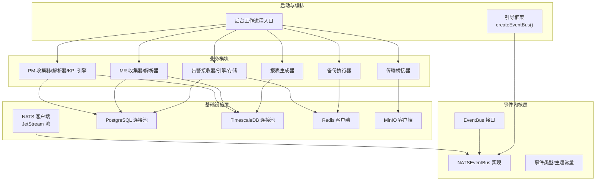
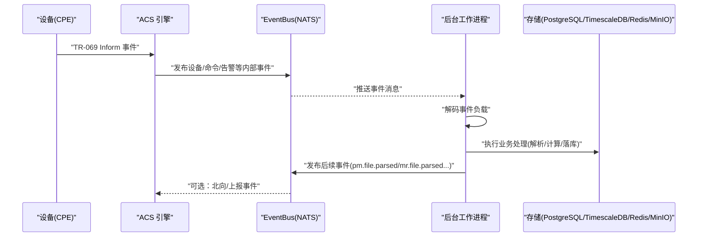
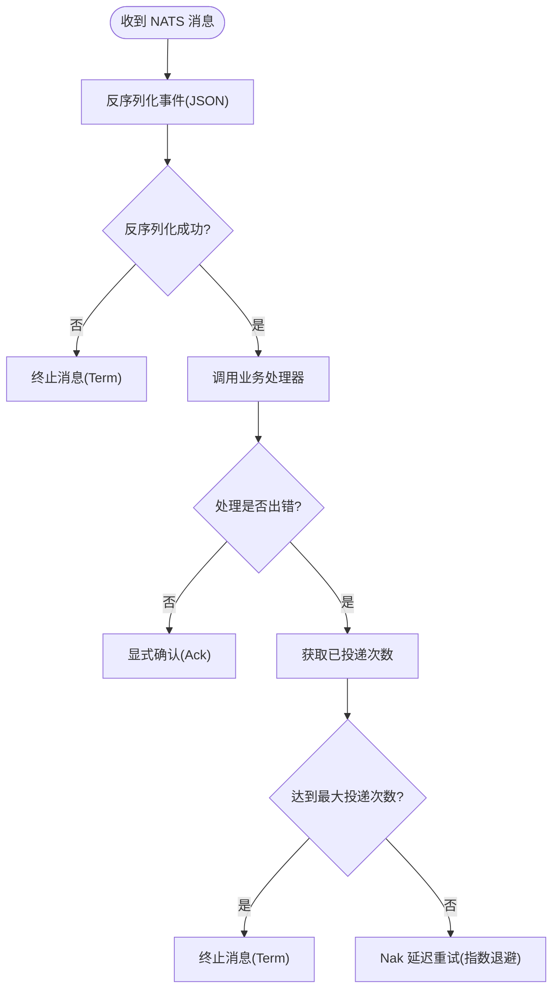
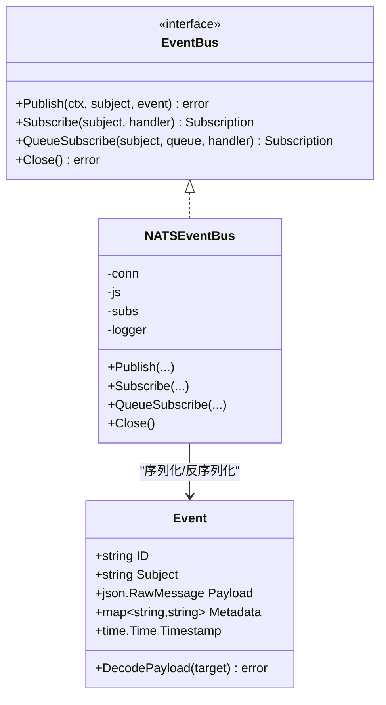
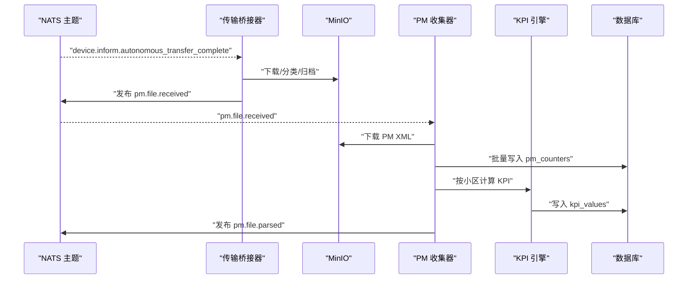
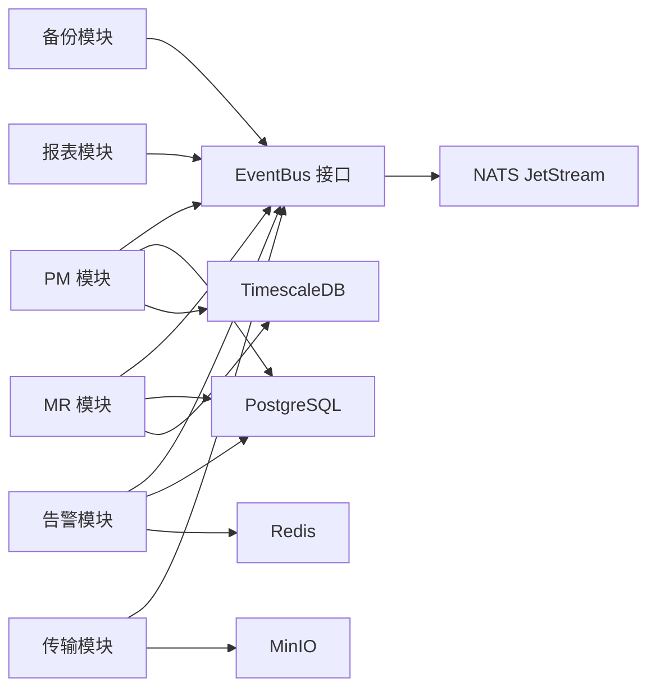

# 事件驱动架构

<cite>
**本文引用的文件**
- [nats_bus.go](file://omcgo/internal/core/event/nats_bus.go)
- [types.go](file://omcgo/internal/core/event/types.go)
- [bus.go](file://omcgo/internal/core/event/bus.go)
- [subjects.go](file://omcgo/internal/core/event/subjects.go)
- [nats.go](file://omcgo/internal/core/components/nats/nats.go)
- [bootstrap.go](file://omcgo/internal/core/bootstrap/bootstrap.go)
- [main.go](file://omcgo/cmd/worker/main.go)
- [collector.go](file://omcgo/internal/pm/collector/collector.go)
- [receiver.go](file://omcgo/internal/alarm/receiver.go)
- [events.go](file://omcgo/pkg/tr069/events.go)
- [pm-kpi-flow.md](file://omcgo/docs/design/pm-kpi-flow.md)
- [phase3-completion-report.md](file://omcgo/docs/reports/phase3-completion-report.md)
- [metrics.go](file://omcgo/internal/core/components/monitor/metrics.go)
- [tracer.go](file://omcgo/internal/core/components/tracer.go)
- [19-observability.md](file://omcgo/docs/detailed-design/19-observability.md)
</cite>

## 目录
1. [简介](#简介)
2. [项目结构](#项目结构)
3. [核心组件](#核心组件)
4. [架构总览](#架构总览)
5. [详细组件分析](#详细组件分析)
6. [依赖分析](#依赖分析)
7. [性能考虑](#性能考虑)
8. [故障排查指南](#故障排查指南)
9. [结论](#结论)
10. [附录](#附录)

## 简介
本文件面向 Baicells OMC 项目的事件驱动架构，围绕基于 NATS 的消息驱动设计进行系统化说明。内容涵盖事件总线实现、事件发布订阅模式与异步处理机制，事件类型定义、序列化与反序列化流程，后台工作进程通过 NATS 消费者处理 PM 文件解析、MR 文件解析、KPI 计算、告警关联分析等任务，事件持久化策略与重试机制，以及事件驱动架构在解耦、可扩展性与容错方面的优势。同时提供最佳实践、性能优化建议与监控调试方法。

## 项目结构
OMC 项目采用三层分层与多模块组合的组织方式：
- 基础设施层：NATS 客户端、JetStream 流管理、数据库连接池、缓存、对象存储等
- 事件内核层：事件总线抽象、NATS 实现、通道实现、事件类型与主题常量
- 业务模块层：PM/MR/告警/备份/报表等子系统，均以事件为纽带协同工作
- 启动与编排：统一的引导框架负责连接建立、事件总线创建与服务生命周期管理
- 后台工作进程：独立二进制，订阅各类事件并执行异步处理

**图表来源**
- [bootstrap.go:199-200](file://omcgo/internal/core/bootstrap/bootstrap.go#L199-L200)
- [nats_bus.go:26-32](file://omcgo/internal/core/event/nats_bus.go#L26-L32)
- [main.go:70-144](file://omcgo/cmd/worker/main.go#L70-L144)

**章节来源**
- [bootstrap.go:64-138](file://omcgo/internal/core/bootstrap/bootstrap.go#L64-L138)
- [main.go:28-144](file://omcgo/cmd/worker/main.go#L28-L144)

## 核心组件
- 事件总线接口与实现
  - EventBus 接口定义了发布、订阅、队列订阅与关闭能力
  - NATSEventBus 基于 NATS JetStream 实现，支持显式确认、持久化队列组、指数退避重试与最大投递次数控制
- 事件类型与主题
  - Event 事件载体包含唯一 ID、主题、负载、元数据与时间戳
  - 主题常量覆盖设备、命令、PM、MR、告警、软固件升级、备份、报表、北向等场景
- NATS 客户端与流管理
  - 统一连接与 JetStream 上下文，确保 JetStream 流存在性
  - 默认工作队列策略、文件存储、72 小时最大保留时间
- 引导框架
  - 在应用/ACS/Worker 三类入口中无条件创建 NATSEventBus，并注入各业务模块

**章节来源**
- [bus.go:5-20](file://omcgo/internal/core/event/bus.go#L5-L20)
- [nats_bus.go:16-32](file://omcgo/internal/core/event/nats_bus.go#L16-L32)
- [types.go:11-40](file://omcgo/internal/core/event/types.go#L11-L40)
- [subjects.go:3-101](file://omcgo/internal/core/event/subjects.go#L3-L101)
- [nats.go:75-97](file://omcgo/internal/core/components/nats/nats.go#L75-L97)
- [bootstrap.go:199-200](file://omcgo/internal/core/bootstrap/bootstrap.go#L199-L200)

## 架构总览
事件驱动架构以 NATS JetStream 为核心，实现跨进程、跨模块的异步解耦协作。设备侧 TR-069 Inform 事件经 ACS 引擎转换为内部事件，随后通过 EventBus 发布到 NATS。后台工作进程作为消费者，订阅相应主题并执行具体业务逻辑（PM/MR 解析、KPI 计算、告警处理、备份与报表生成等）。所有事件均采用 JSON 序列化，负载为任意结构化数据，便于扩展与演进。

**图表来源**
- [pm-kpi-flow.md:636-695](file://omcgo/docs/design/pm-kpi-flow.md#L636-L695)
- [receiver.go:51-85](file://omcgo/internal/alarm/receiver.go#L51-L85)
- [collector.go:129-148](file://omcgo/internal/pm/collector/collector.go#L129-L148)

## 详细组件分析

### 事件总线与消息路由
- 发布流程
  - 事件封装：设置主题、生成唯一 ID、当前时间戳，负载 JSON 序列化
  - 发布到 NATS JetStream：按主题投递，由 NATS 保证投递与持久化
- 订阅与消费
  - 普通订阅：广播给所有订阅者
  - 队列订阅：Durable 持久化队列组内轮询或首个可用消费者处理，实现水平扩展
- 错误处理与重试
  - 反序列化失败：立即终止消息，避免无限重试
  - 业务处理失败：指数退避重试（1s、2s、4s、8s…），达到最大投递次数后终止
- 关闭与资源回收
  - 统一注销所有订阅，释放资源

**图表来源**
- [nats_bus.go:93-127](file://omcgo/internal/core/event/nats_bus.go#L93-L127)

**章节来源**
- [nats_bus.go:34-78](file://omcgo/internal/core/event/nats_bus.go#L34-L78)
- [nats_bus.go:93-127](file://omcgo/internal/core/event/nats_bus.go#L93-L127)

### 事件类型与序列化
- 事件载体
  - 字段：ID、Subject、Payload、Metadata、Timestamp
  - 负载为 json.RawMessage，支持任意结构化数据
- 工具方法
  - NewEvent：生成新事件并序列化负载
  - DecodePayload：将负载反序列化到目标结构
- 主题命名
  - 设备/命令/PM/MR/告警/软固件/备份/报表/北向等场景均有明确主题常量

**图表来源**
- [types.go:11-40](file://omcgo/internal/core/event/types.go#L11-L40)
- [bus.go:5-20](file://omcgo/internal/core/event/bus.go#L5-L20)
- [nats_bus.go:16-32](file://omcgo/internal/core/event/nats_bus.go#L16-L32)

**章节来源**
- [types.go:23-40](file://omcgo/internal/core/event/types.go#L23-L40)
- [subjects.go:3-101](file://omcgo/internal/core/event/subjects.go#L3-L101)

### 后台工作进程与消费者
后台工作进程作为 NATS 消费者，注册多个订阅者以处理不同类型的事件：
- PM 收集器：监听 PM 文件接收事件，下载 XML、流式解析、批量写入计数器、计算 KPI、更新文件元数据并发布“已解析”事件
- MR 收集器：监听 MR 文件接收事件，分类与解析，写入存储并发布“已解析”事件
- 告警接收器：监听设备告警事件，提取并交由告警引擎处理，维护活跃/历史状态
- 传输桥接器：根据 Inform 事件分类文件类型，下载并归档到 MinIO，发布后续事件
- 备份执行器：监听备份任务事件，调度命令队列与连接请求客户端执行备份
- 报表生成器：监听报表生成事件，按定义生成并落盘

**图表来源**
- [pm-kpi-flow.md:168-181](file://omcgo/docs/design/pm-kpi-flow.md#L168-L181)
- [collector.go:129-148](file://omcgo/internal/pm/collector/collector.go#L129-L148)
- [main.go:70-144](file://omcgo/cmd/worker/main.go#L70-L144)

**章节来源**
- [main.go:70-144](file://omcgo/cmd/worker/main.go#L70-L144)
- [collector.go:129-148](file://omcgo/internal/pm/collector/collector.go#L129-L148)
- [receiver.go:51-85](file://omcgo/internal/alarm/receiver.go#L51-L85)

### 事件持久化与重试策略
- JetStream 流策略
  - 工作队列策略、文件存储、72 小时最大保留时间，满足短期重试与持久化需求
- 消息确认与重试
  - 显式确认（Ack）用于成功处理
  - 指数退避重试（1s、2s、4s、8s…），最大投递次数限制（默认 5 次）
  - 反序列化失败直接终止（Term），避免无效消息循环
- 队列组与水平扩展
  - 使用 Durable 队列组，同一主题下的多个消费者实例实现负载均衡

**章节来源**
- [nats.go:75-97](file://omcgo/internal/core/components/nats/nats.go#L75-L97)
- [nats_bus.go:14-14](file://omcgo/internal/core/event/nats_bus.go#L14-L14)
- [nats_bus.go:64-78](file://omcgo/internal/core/event/nats_bus.go#L64-L78)
- [nats_bus.go:93-127](file://omcgo/internal/core/event/nats_bus.go#L93-L127)

### 设备事件与 TR-069 语义映射
- TR-069 Inform 事件码与内部主题映射
  - 例如：BOOT/PERIODIC/TRANSFER COMPLETE 等映射为 device.inform.* 主题
  - 厂商自定义事件（如 M Reboot）映射为设备重启完成等主题
- 事件提取与处理
  - ACS 引擎根据 Inform 事件列表提取关键事件，转换为内部事件并发布

**章节来源**
- [events.go:6-85](file://omcgo/pkg/tr069/events.go#L6-L85)
- [pm-kpi-flow.md:648-652](file://omcgo/docs/design/pm-kpi-flow.md#L648-L652)

## 依赖分析
- 组件耦合
  - 业务模块通过 EventBus 与基础设施解耦，仅依赖事件主题与负载结构
  - 引导框架集中创建 EventBus，确保三类进程一致的事件总线行为
- 外部依赖
  - NATS JetStream：消息总线与持久化
  - PostgreSQL/TimescaleDB：结构化与时序数据存储
  - Redis：缓存与活跃告警状态
  - MinIO：原始文件归档与访问
- 循环依赖
  - 事件总线与业务模块之间为单向依赖，无循环引用迹象

**图表来源**
- [main.go:70-144](file://omcgo/cmd/worker/main.go#L70-L144)
- [bootstrap.go:199-200](file://omcgo/internal/core/bootstrap/bootstrap.go#L199-L200)

**章节来源**
- [main.go:70-144](file://omcgo/cmd/worker/main.go#L70-L144)
- [bootstrap.go:199-200](file://omcgo/internal/core/bootstrap/bootstrap.go#L199-L200)

## 性能考虑
- 消息吞吐与延迟
  - NATS JetStream 的显式确认与持久化保证消息可靠投递，适合高吞吐场景
  - 指数退避重试降低风暴效应，避免雪崩
- 存储写入优化
  - PM 解析采用流式 XML 解析与批量写入（pgx.CopyFrom），减少内存占用与 I/O 次数
  - TimescaleDB 超表与连续聚合视图提升时序查询与聚合性能
- 并发与扩展
  - 队列组订阅支持多实例横向扩展，结合指数退避实现弹性伸缩
- 资源隔离
  - 不同业务模块独立订阅，避免相互阻塞

**章节来源**
- [pm-kpi-flow.md:183-214](file://omcgo/docs/design/pm-kpi-flow.md#L183-L214)
- [pm-kpi-flow.md:464-480](file://omcgo/docs/design/pm-kpi-flow.md#L464-L480)

## 故障排查指南
- NATS 连接与健康检查
  - NATS 客户端提供健康检查方法，可在运维层面快速判断连接状态
  - 启动时确保 JetStream 流存在，必要时自动创建
- 事件处理失败定位
  - 查看日志中的主题、投递次数与错误堆栈
  - 反序列化失败会直接终止消息，检查事件负载格式一致性
  - 达到最大投递次数后终止，需人工介入修复或死信处理
- 监控与可观测性
  - Prometheus 指标：NATS 发布/消费总量等
  - OpenTelemetry 追踪：关键路径 Span（如 pm.parse_file、alarm.process）
  - Grafana 面板与告警规则（规划中）

**章节来源**
- [nats.go:99-105](file://omcgo/internal/core/components/nats/nats.go#L99-L105)
- [nats_bus.go:93-127](file://omcgo/internal/core/event/nats_bus.go#L93-L127)
- [metrics.go:12-18](file://omcgo/internal/core/components/monitor/metrics.go#L12-L18)
- [tracer.go:15-54](file://omcgo/internal/core/components/tracer.go#L15-L54)
- [19-observability.md:104-164](file://omcgo/docs/detailed-design/19-observability.md#L104-L164)

## 结论
OMC 项目采用统一的事件驱动架构，以 NATS JetStream 为核心实现跨模块、跨进程的异步解耦。通过标准化事件载体与主题命名、严格的序列化与反序列化流程、可靠的持久化与重试策略，系统在可扩展性、容错能力与性能方面取得良好平衡。后台工作进程以消费者角色承接 PM/MR/KPI、告警、备份与报表等任务，形成清晰的数据流水线。配合 Prometheus 与 OpenTelemetry 的可观测性建设，为线上问题定位与容量规划提供坚实支撑。

## 附录
- 事件处理最佳实践
  - 保持事件负载简洁且可演进，使用元数据承载上下文
  - 为关键路径添加追踪 Span，便于端到端性能分析
  - 对高吞吐事件采用队列组订阅并合理设置并发实例数
  - 定期审查 JetStream 流配置与保留策略，匹配业务 SLA
- 端到端场景验证
  - PM 管线：上传 PM XML → NATS → Worker 解析 → TimescaleDB → KPI 计算 → API 查询
  - 告警管线：CPE Inform ALARM → 告警提取 → 去重与生命周期管理 → 存储 → API 查询
  - MR 管线：上传 MRO XML → NATS → Worker 解析 → 存储 → API 查询

**章节来源**
- [phase3-completion-report.md:152-165](file://omcgo/docs/reports/phase3-completion-report.md#L152-L165)