# 分层架构设计

<cite>
**本文档引用的文件**
- [go.mod](file://omcgo/go.mod)
- [consts.go](file://omcgo/global/consts.go)
- [errors.go](file://omcgo/global/errors.go)
- [main.go](file://omcgo/cmd/app/main.go)
- [main.go](file://omcgo/cmd/acs/main.go)
- [main.go](file://omcgo/cmd/worker/main.go)
- [bootstrap.go](file://omcgo/internal/core/bootstrap/bootstrap.go)
- [router.go](file://omcgo/cmd/app/router/router.go)
- [config.go](file://omcgo/internal/core/appconfig/config.go)
- [types.go](file://omcgo/pkg/tr069/types.go)
- [envelope.go](file://omcgo/pkg/soap/envelope.go)
- [cors.go](file://omcgo/internal/core/middleware/cors.go)
- [errors.go](file://omcgo/internal/core/errors/errors.go)
- [registry.go](file://omcgo/internal/core/carrier/registry.go)
</cite>

## 目录
1. [简介](#简介)
2. [项目结构](#项目结构)
3. [核心组件](#核心组件)
4. [架构概览](#架构概览)
5. [详细组件分析](#详细组件分析)
6. [依赖分析](#依赖分析)
7. [性能考虑](#性能考虑)
8. [故障排除指南](#故障排除指南)
9. [结论](#结论)

## 简介

Baicells OMC项目采用清晰的四层架构设计，旨在实现业务逻辑与基础设施的解耦，提高系统的可维护性和可扩展性。该架构通过表现层、业务逻辑层、数据访问层和基础设施层的明确分工，确保了各层之间的职责分离和依赖控制。

## 项目结构

项目采用基于功能模块的组织方式，主要分为以下层次：

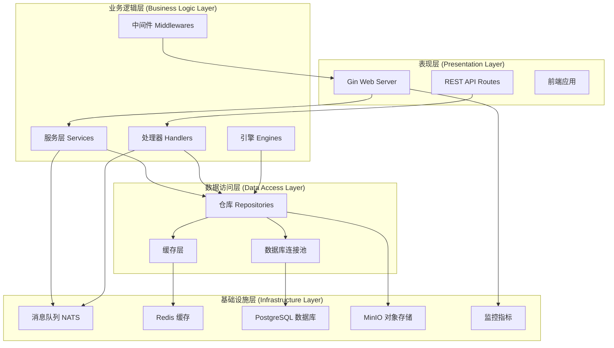

**图表来源**
- [main.go:17-75](file://omcgo/cmd/app/main.go#L17-L75)
- [router.go:46-349](file://omcgo/cmd/app/router/router.go#L46-L349)
- [bootstrap.go:34-49](file://omcgo/internal/core/bootstrap/bootstrap.go#L34-L49)

**章节来源**
- [main.go:1-92](file://omcgo/cmd/app/main.go#L1-L92)
- [main.go:1-93](file://omcgo/cmd/acs/main.go#L1-L93)
- [main.go:1-161](file://omcgo/cmd/worker/main.go#L1-L161)

## 核心组件

### 基础设施启动器 (Bootstrap)

基础设施启动器负责初始化所有外部依赖和服务连接：

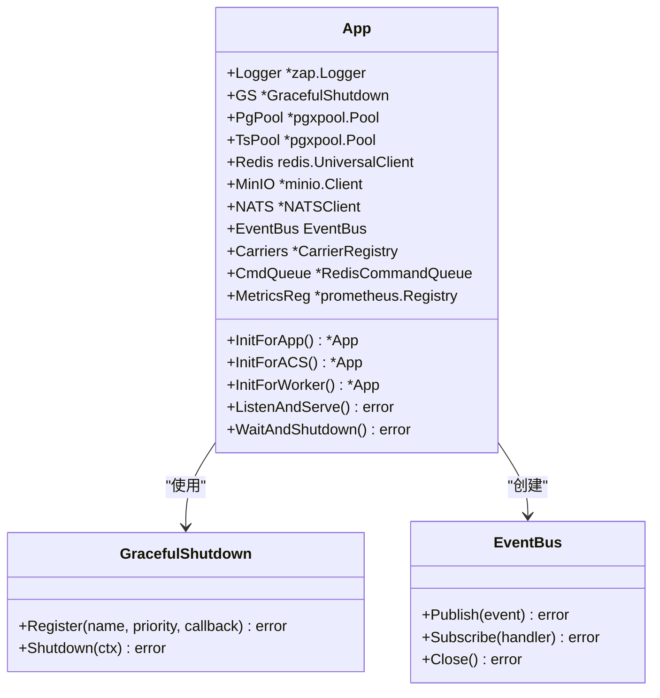

**图表来源**
- [bootstrap.go:34-49](file://omcgo/internal/core/bootstrap/bootstrap.go#L34-L49)
- [bootstrap.go:64-138](file://omcgo/internal/core/bootstrap/bootstrap.go#L64-L138)

### 配置管理系统

配置系统采用分层配置结构，支持多种部署环境：

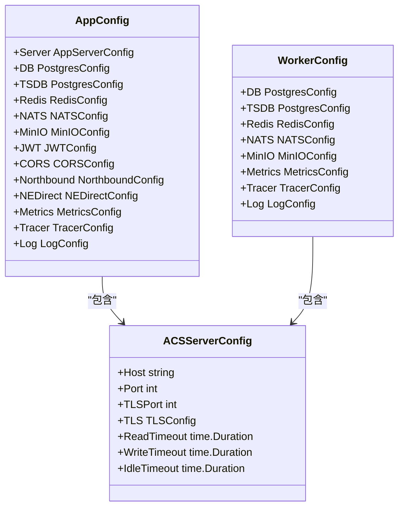

**图表来源**
- [config.go:32-46](file://omcgo/internal/core/appconfig/config.go#L32-L46)
- [config.go:80-90](file://omcgo/internal/core/appconfig/config.go#L80-L90)
- [config.go:92-101](file://omcgo/internal/core/appconfig/config.go#L92-L101)

**章节来源**
- [bootstrap.go:1-293](file://omcgo/internal/core/bootstrap/bootstrap.go#L1-L293)
- [config.go:1-260](file://omcgo/internal/core/appconfig/config.go#L1-L260)

## 架构概览

系统采用微服务架构，包含三个主要服务进程：

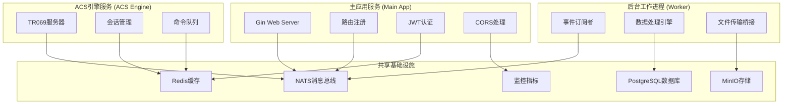

**图表来源**
- [main.go:52-75](file://omcgo/cmd/app/main.go#L52-L75)
- [main.go:52-76](file://omcgo/cmd/acs/main.go#L52-L76)
- [main.go:70-144](file://omcgo/cmd/worker/main.go#L70-L144)

## 详细组件分析

### 表现层 (Presentation Layer)

表现层主要由Gin Web框架实现，提供REST API接口和统一的错误处理机制：

#### 中间件设计模式

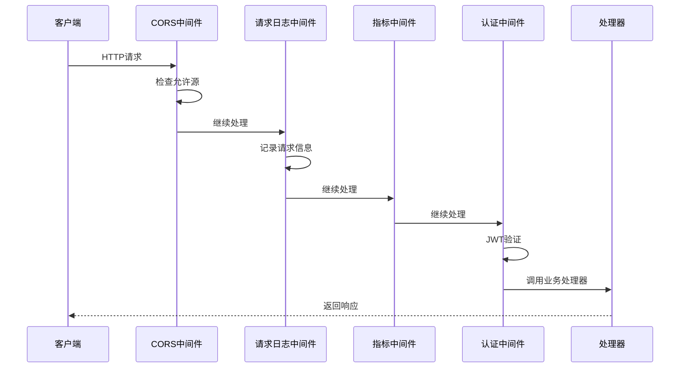

**图表来源**
- [router.go:149-178](file://omcgo/cmd/app/router/router.go#L149-L178)
- [cors.go:14-38](file://omcgo/internal/core/middleware/cors.go#L14-L38)

#### 统一错误处理机制

系统实现了统一的错误处理和响应格式：

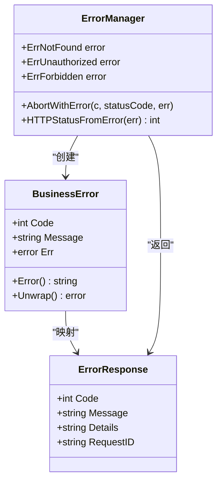

**图表来源**
- [errors.go:35-64](file://omcgo/internal/core/errors/errors.go#L35-L64)
- [errors.go:66-88](file://omcgo/internal/core/errors/errors.go#L66-L88)

**章节来源**
- [router.go:149-178](file://omcgo/cmd/app/router/router.go#L149-L178)
- [cors.go:1-39](file://omcgo/internal/core/middleware/cors.go#L1-L39)
- [errors.go:1-111](file://omcgo/internal/core/errors/errors.go#L1-L111)

### 业务逻辑层 (Business Logic Layer)

业务逻辑层包含服务层、处理器和各种业务引擎：

#### 服务层架构

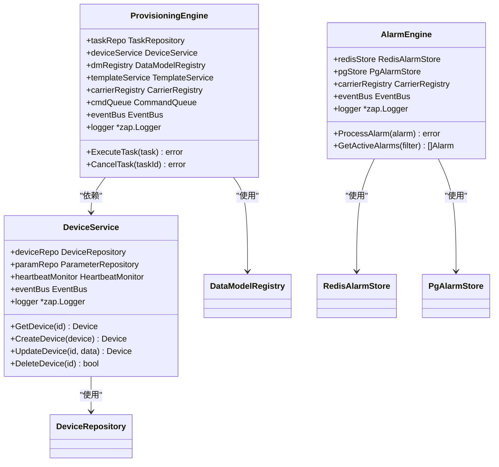

**图表来源**
- [router.go:68-100](file://omcgo/cmd/app/router/router.go#L68-L100)
- [router.go:132-142](file://omcgo/cmd/app/router/router.go#L132-L142)

#### 依赖注入机制

系统采用构造函数注入的方式实现依赖管理：

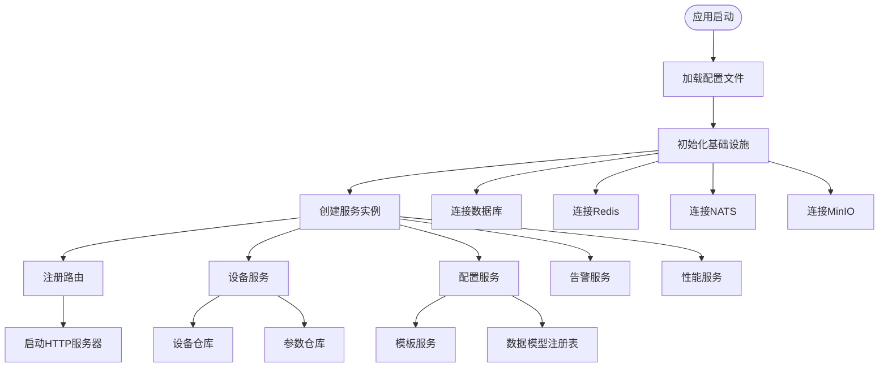

**图表来源**
- [main.go:45-75](file://omcgo/cmd/app/main.go#L45-L75)
- [bootstrap.go:64-138](file://omcgo/internal/core/bootstrap/bootstrap.go#L64-L138)

**章节来源**
- [router.go:68-100](file://omcgo/cmd/app/router/router.go#L68-L100)
- [main.go:45-75](file://omcgo/cmd/app/main.go#L45-L75)

### 数据访问层 (Data Access Layer)

数据访问层提供了统一的仓库模式抽象：

#### 仓库模式实现

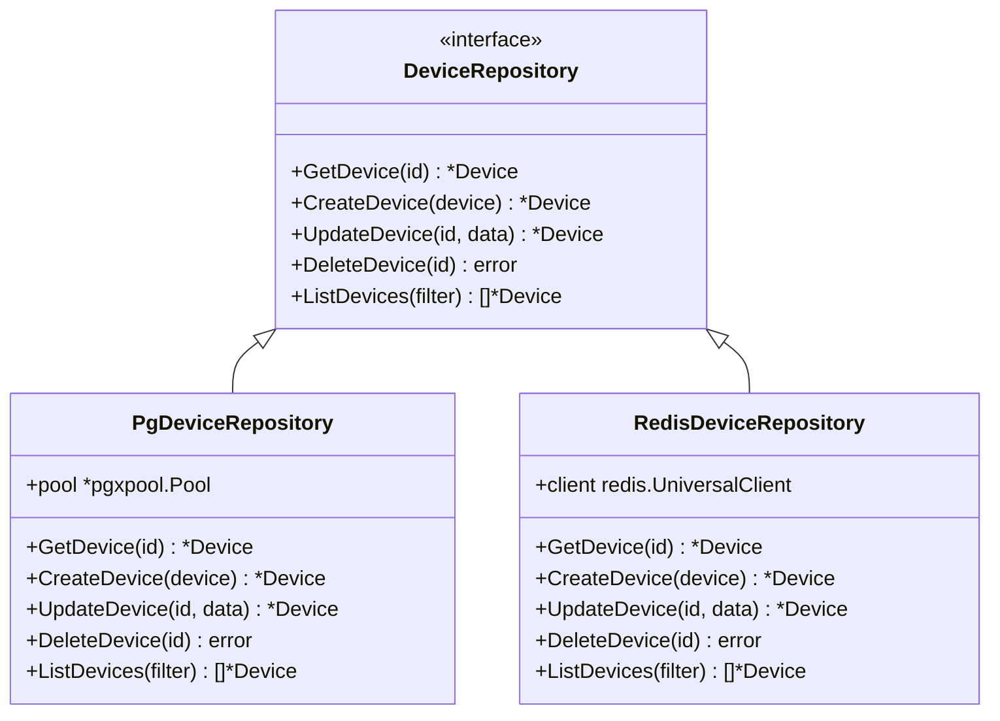

**图表来源**
- [router.go:60-61](file://omcgo/cmd/app/router/router.go#L60-L61)
- [router.go:132-134](file://omcgo/cmd/app/router/router.go#L132-L134)

### 基础设施层 (Infrastructure Layer)

基础设施层提供了系统运行所需的核心服务：

#### 消息总线架构

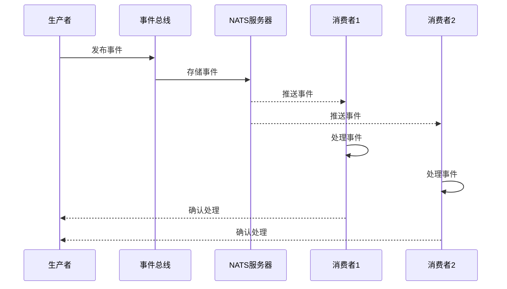

**图表来源**
- [bootstrap.go:199-202](file://omcgo/internal/core/bootstrap/bootstrap.go#L199-L202)
- [main.go:70-144](file://omcgo/cmd/worker/main.go#L70-L144)

**章节来源**
- [bootstrap.go:1-293](file://omcgo/internal/core/bootstrap/bootstrap.go#L1-L293)
- [main.go:70-144](file://omcgo/cmd/worker/main.go#L70-L144)

### 共享层 (Shared Layer)

共享层包含了跨服务使用的通用组件：

#### 常量和错误码定义

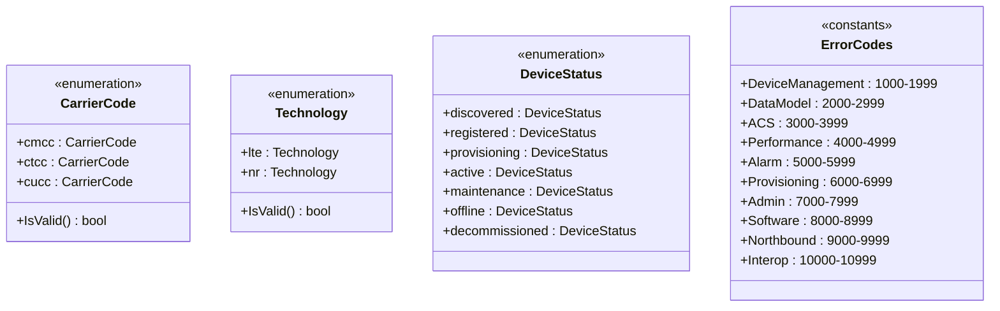

**图表来源**
- [consts.go:3-95](file://omcgo/global/consts.go#L3-L95)
- [errors.go:3-135](file://omcgo/global/errors.go#L3-L135)

#### 公共库层 (pkg/)

公共库层提供了独立且可复用的工具包：

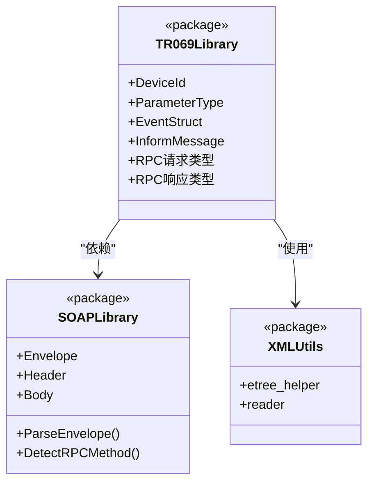

**图表来源**
- [types.go:1-211](file://omcgo/pkg/tr069/types.go#L1-L211)
- [envelope.go:1-143](file://omcgo/pkg/soap/envelope.go#L1-L143)

**章节来源**
- [consts.go:1-95](file://omcgo/global/consts.go#L1-L95)
- [errors.go:1-135](file://omcgo/global/errors.go#L1-L135)
- [types.go:1-211](file://omcgo/pkg/tr069/types.go#L1-L211)
- [envelope.go:1-143](file://omcgo/pkg/soap/envelope.go#L1-L143)

## 依赖分析

系统采用了清晰的依赖层次结构：

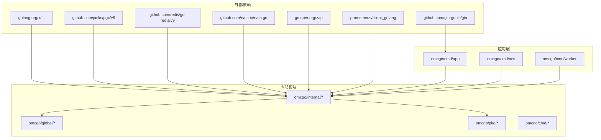

**图表来源**
- [go.mod:5-29](file://omcgo/go.mod#L5-L29)

**章节来源**
- [go.mod:1-121](file://omcgo/go.mod#L1-L121)

## 性能考虑

系统在设计时充分考虑了性能优化：

### 连接池管理
- PostgreSQL使用连接池避免频繁建立连接
- Redis使用连接池提高缓存访问性能
- TimescaleDB专门用于时间序列数据存储

### 异步处理
- NATS消息总线支持异步事件处理
- 后台工作进程独立处理耗时任务
- 文件传输采用异步队列机制

### 缓存策略
- Redis缓存热点数据
- 数据模型注册表支持缓存
- 会话状态存储在Redis中

## 故障排除指南

### 常见问题诊断

#### 启动失败排查
1. 检查配置文件路径和权限
2. 验证数据库连接参数
3. 确认Redis服务可用性
4. 检查NATS连接状态

#### 运行时错误处理
- 使用统一的错误响应格式
- 记录详细的错误日志
- 实施优雅关闭机制

**章节来源**
- [bootstrap.go:268-292](file://omcgo/internal/core/bootstrap/bootstrap.go#L268-L292)
- [errors.go:66-88](file://omcgo/internal/core/errors/errors.go#L66-L88)

## 结论

Baicells OMC项目的分层架构设计实现了良好的关注点分离，通过明确的层次划分和依赖管理，为系统的可维护性、可扩展性和可靠性提供了坚实基础。共享层的设计确保了代码复用，而微服务架构则为未来的功能扩展和部署灵活性奠定了基础。

该架构特别适合大规模物联网设备管理场景，能够有效处理设备连接、数据采集、业务逻辑处理和多租户支持等复杂需求。通过持续的架构演进和最佳实践应用，系统将能够适应不断变化的业务需求和技术挑战。