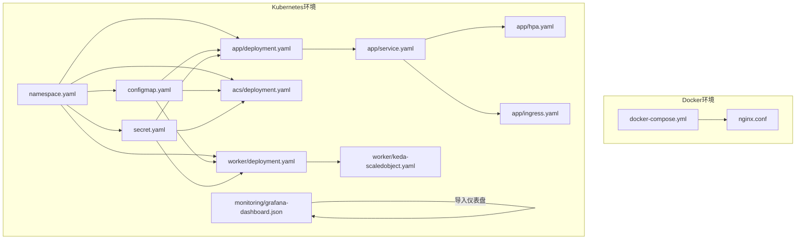
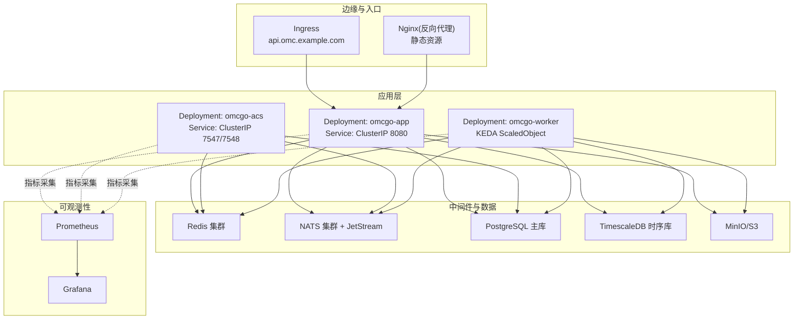
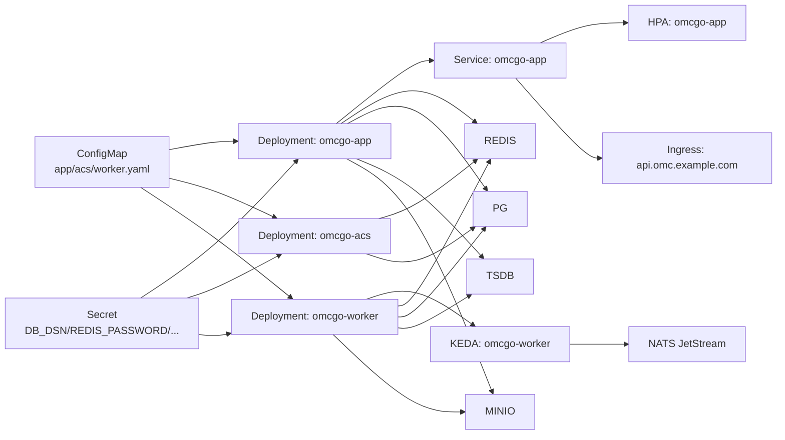

# 基础设施架构

<cite>
**本文档引用的文件**
- [docker-compose.yml](file://omcgo/deployments/docker/docker-compose.yml)
- [namespace.yaml](file://omcgo/deployments/k8s/namespace.yaml)
- [configmap.yaml](file://omcgo/deployments/k8s/configmap.yaml)
- [secret.yaml](file://omcgo/deployments/k8s/secret.yaml)
- [infra/README.md](file://omcgo/deployments/k8s/infra/README.md)
- [app/deployment.yaml](file://omcgo/deployments/k8s/app/deployment.yaml)
- [app/service.yaml](file://omcgo/deployments/k8s/app/service.yaml)
- [app/hpa.yaml](file://omcgo/deployments/k8s/app/hpa.yaml)
- [app/ingress.yaml](file://omcgo/deployments/k8s/app/ingress.yaml)
- [acs/deployment.yaml](file://omcgo/deployments/k8s/acs/deployment.yaml)
- [worker/deployment.yaml](file://omcgo/deployments/k8s/worker/deployment.yaml)
- [keda-scaledobject.yaml](file://omcgo/deployments/k8s/worker/keda-scaledobject.yaml)
- [grafana-dashboard.json](file://omcgo/deployments/monitoring/grafana-dashboard.json)
- [config.dev.yaml（acs）](file://omcgo/cmd/acs/etc/config.dev.yaml)
- [config.dev.yaml（app）](file://omcgo/cmd/app/etc/config.dev.yaml)
</cite>

## 目录
1. [简介](#简介)
2. [项目结构](#项目结构)
3. [核心组件](#核心组件)
4. [架构总览](#架构总览)
5. [详细组件分析](#详细组件分析)
6. [依赖关系分析](#依赖关系分析)
7. [性能考虑](#性能考虑)
8. [故障排查指南](#故障排查指南)
9. [结论](#结论)
10. [附录](#附录)

## 简介
本文件面向Baicells OMC项目的基础设施架构，系统性阐述容器化与Kubernetes编排策略、核心中间件与数据库部署、监控告警体系、高可用与灾备设计、扩展与性能调优建议，以及安全与网络策略。内容基于仓库中现有的Docker Compose与Kubernetes部署清单、配置模板与监控仪表盘进行归纳总结。

## 项目结构
OMC项目的基础设施相关代码主要集中在以下位置：
- Docker Compose：用于本地开发与测试环境的一键拉起
- Kubernetes部署：包含命名空间、配置、密钥、应用Deployment、Service、HPA、Ingress等
- 监控：Grafana仪表盘JSON定义
- 组件配置：各服务在K8s中的配置模板与开发环境配置样例

图表来源
- [docker-compose.yml:1-194](file://omcgo/deployments/docker/docker-compose.yml#L1-L194)
- [namespace.yaml:1-7](file://omcgo/deployments/k8s/namespace.yaml#L1-L7)
- [configmap.yaml:1-153](file://omcgo/deployments/k8s/configmap.yaml#L1-L153)
- [secret.yaml:1-15](file://omcgo/deployments/k8s/secret.yaml#L1-L15)
- [app/deployment.yaml:1-103](file://omcgo/deployments/k8s/app/deployment.yaml#L1-L103)
- [app/service.yaml:1-17](file://omcgo/deployments/k8s/app/service.yaml#L1-L17)
- [app/hpa.yaml:1-33](file://omcgo/deployments/k8s/app/hpa.yaml#L1-L33)
- [app/ingress.yaml:1-27](file://omcgo/deployments/k8s/app/ingress.yaml#L1-L27)
- [acs/deployment.yaml:1-86](file://omcgo/deployments/k8s/acs/deployment.yaml#L1-L86)
- [worker/deployment.yaml:1-93](file://omcgo/deployments/k8s/worker/deployment.yaml#L1-L93)
- [keda-scaledobject.yaml:1-22](file://omcgo/deployments/k8s/worker/keda-scaledobject.yaml#L1-L22)
- [grafana-dashboard.json:1-142](file://omcgo/deployments/monitoring/grafana-dashboard.json#L1-L142)

章节来源
- [docker-compose.yml:1-194](file://omcgo/deployments/docker/docker-compose.yml#L1-L194)
- [namespace.yaml:1-7](file://omcgo/deployments/k8s/namespace.yaml#L1-L7)
- [configmap.yaml:1-153](file://omcgo/deployments/k8s/configmap.yaml#L1-L153)
- [secret.yaml:1-15](file://omcgo/deployments/k8s/secret.yaml#L1-L15)

## 核心组件
- 应用服务（App）：提供REST/gRPC服务与前端静态资源托管，具备水平伸缩能力
- ACS服务：TR-069 ACS服务器，处理设备接入与会话管理
- Worker：后台任务处理，基于NATS JetStream实现事件驱动的弹性伸缩
- 数据库：PostgreSQL（TimescaleDB扩展用于时序数据）
- 缓存：Redis（集群模式，用于会话、命令队列、缓存与限流）
- 消息队列：NATS JetStream（事件流与消费者组）
- 对象存储：MinIO（或兼容S3），用于PM/MR文件、固件、日志等
- 监控：Prometheus抓取指标，Grafana可视化，告警通过Alertmanager（未在仓库中直接出现，但监控建议明确）

章节来源
- [configmap.yaml:7-153](file://omcgo/deployments/k8s/configmap.yaml#L7-L153)
- [infra/README.md:1-58](file://omcgo/deployments/k8s/infra/README.md#L1-L58)

## 架构总览
下图展示了OMC在Kubernetes中的整体架构：应用层（App/ACS）通过Service暴露，前端由Ingress统一入口；Worker通过KEDA与NATS JetStream实现事件驱动的自动伸缩；后端依赖PostgreSQL（TimescaleDB）、Redis、MinIO与NATS。

图表来源
- [app/ingress.yaml:1-27](file://omcgo/deployments/k8s/app/ingress.yaml#L1-L27)
- [app/service.yaml:1-17](file://omcgo/deployments/k8s/app/service.yaml#L1-L17)
- [app/deployment.yaml:1-103](file://omcgo/deployments/k8s/app/deployment.yaml#L1-L103)
- [acs/deployment.yaml:1-86](file://omcgo/deployments/k8s/acs/deployment.yaml#L1-L86)
- [worker/deployment.yaml:1-93](file://omcgo/deployments/k8s/worker/deployment.yaml#L1-L93)
- [keda-scaledobject.yaml:1-22](file://omcgo/deployments/k8s/worker/keda-scaledobject.yaml#L1-L22)
- [configmap.yaml:15-50](file://omcgo/deployments/k8s/configmap.yaml#L15-L50)
- [grafana-dashboard.json:1-142](file://omcgo/deployments/monitoring/grafana-dashboard.json#L1-L142)

## 详细组件分析

### 容器化与镜像设计
- 开发环境（Docker Compose）
  - 提供PostgreSQL、Redis、NATS JetStream、MinIO与迁移脚本的快速部署
  - 通过卷挂载日志目录到宿主机，便于开发调试
  - 各服务通过环境变量注入连接参数与日志配置
- 生产环境（Kubernetes）
  - 应用镜像分别为omcgo/app、omcgo/acs、omcgo/worker
  - 使用ConfigMap集中管理配置，Secret管理敏感信息
  - 通过探针保障健康检查与存活状态

章节来源
- [docker-compose.yml:19-194](file://omcgo/deployments/docker/docker-compose.yml#L19-L194)
- [configmap.yaml:1-153](file://omcgo/deployments/k8s/configmap.yaml#L1-L153)
- [secret.yaml:1-15](file://omcgo/deployments/k8s/secret.yaml#L1-L15)

### Kubernetes编排与服务编排
- 命名空间与资源组织
  - 使用独立命名空间隔离OMC组件
  - ConfigMap与Secret分别承载配置与密钥
- 应用编排（App）
  - Deployment：副本数2，带就绪/存活探针
  - Service：ClusterIP暴露8080端口
  - HPA：基于CPU使用率自动伸缩（最小2，最大5）
  - Ingress：Nginx入口，TLS终止，设置请求体大小与超时
- ACS编排
  - Deployment：副本数2，暴露7547/7548端口，含指标端口
  - 探针与资源限制/请求
- Worker编排
  - Deployment：副本数2，指标端口
  - KEDA ScaledObject：基于NATS JetStream消费积压自动扩缩

章节来源
- [namespace.yaml:1-7](file://omcgo/deployments/k8s/namespace.yaml#L1-L7)
- [app/deployment.yaml:1-103](file://omcgo/deployments/k8s/app/deployment.yaml#L1-L103)
- [app/service.yaml:1-17](file://omcgo/deployments/k8s/app/service.yaml#L1-L17)
- [app/hpa.yaml:1-33](file://omcgo/deployments/k8s/app/hpa.yaml#L1-L33)
- [app/ingress.yaml:1-27](file://omcgo/deployments/k8s/app/ingress.yaml#L1-L27)
- [acs/deployment.yaml:1-86](file://omcgo/deployments/k8s/acs/deployment.yaml#L1-L86)
- [worker/deployment.yaml:1-93](file://omcgo/deployments/k8s/worker/deployment.yaml#L1-L93)
- [keda-scaledobject.yaml:1-22](file://omcgo/deployments/k8s/worker/keda-scaledobject.yaml#L1-L22)

### 核心基础设施组件

#### PostgreSQL（主库）
- 版本与特性：PostgreSQL 16+，TimescaleDB扩展用于时序数据
- 高可用：推荐Patroni三节点集群或云托管（RDS/Cloud SQL）
- 连接池与健康检查：通过ConfigMap配置连接池参数与健康检查周期
- 备份策略：建议pg_basebackup每日+WAL归档至S3/MinIO

章节来源
- [infra/README.md:6-13](file://omcgo/deployments/k8s/infra/README.md#L6-L13)
- [configmap.yaml:15-28](file://omcgo/deployments/k8s/configmap.yaml#L15-L28)

#### TimescaleDB（时序库）
- 配置要点：背景工作进程数量、数据保留策略、压缩策略
- 建议保留期：PM原始90天、聚合2年；告警历史1年；压缩chunk超过7天

章节来源
- [infra/README.md:15-23](file://omcgo/deployments/k8s/infra/README.md#L15-L23)

#### Redis（缓存）
- 集群规模：6节点（3主3从）或云托管
- 内存策略：maxmemory=8GB，maxmemory-policy=allkeys-lru
- 持久化：AOF每秒同步
- 用途：会话状态、命令队列、数据模型缓存、限流

章节来源
- [infra/README.md:25-31](file://omcgo/deployments/k8s/infra/README.md#L25-L31)
- [configmap.yaml:29-34](file://omcgo/deployments/k8s/configmap.yaml#L29-L34)

#### NATS JetStream（消息队列）
- 集群规模：3节点，启用JetStream
- 存储配置：内存与文件存储上限
- 流与消费者：单个omcgo流，omcgo.>主题，按消费者组持久化拉取

章节来源
- [infra/README.md:33-39](file://omcgo/deployments/k8s/infra/README.md#L33-L39)
- [configmap.yaml:35-38](file://omcgo/deployments/k8s/configmap.yaml#L35-L38)

#### MinIO（对象存储）
- 部署模式：分布式（4+节点）或S3兼容存储
- 桶划分：pm-files、mr-files、firmware、config-backup、logs
- 生命周期：30天转冷存储，365天删除；固件桶启用版本控制

章节来源
- [infra/README.md:41-47](file://omcgo/deployments/k8s/infra/README.md#L41-L47)
- [configmap.yaml:39-49](file://omcgo/deployments/k8s/configmap.yaml#L39-L49)

### 监控与告警
- 指标采集：通过Pod注解prometheus.io/*暴露指标端点
- 可视化：Grafana仪表盘包含ACS会话、设备总数、活动告警、请求速率、延迟、队列深度、CPU/内存、Go运行时等面板
- 告警建议：基于仓库中的生产配置说明，建议针对ACS会话占比、错误率、重启次数、消费者积压等阈值进行告警

章节来源
- [app/deployment.yaml:19-22](file://omcgo/deployments/k8s/app/deployment.yaml#L19-L22)
- [acs/deployment.yaml:19-22](file://omcgo/deployments/k8s/acs/deployment.yaml#L19-L22)
- [worker/deployment.yaml:19-22](file://omcgo/deployments/k8s/worker/deployment.yaml#L19-L22)
- [grafana-dashboard.json:1-142](file://omcgo/deployments/monitoring/grafana-dashboard.json#L1-L142)
- [infra/README.md:49-58](file://omcgo/deployments/k8s/infra/README.md#L49-L58)

### 高可用与灾备
- 服务冗余：应用与ACS均采用多副本Deployment，配合HPA/KEDA实现弹性
- 数据库：推荐三节点Patroni集群，同步流复制与自动故障转移
- 备份：主库pg_basebackup+WAL归档，TimescaleDB按主题保留与压缩
- 对象存储：MinIO分布式部署或S3，开启生命周期与版本控制

章节来源
- [infra/README.md:6-13](file://omcgo/deployments/k8s/infra/README.md#L6-L13)
- [infra/README.md:15-23](file://omcgo/deployments/k8s/infra/README.md#L15-L23)
- [infra/README.md:41-47](file://omcgo/deployments/k8s/infra/README.md#L41-L47)

### 扩展与性能调优
- CPU/内存：根据业务峰值设定requests/limits，避免资源抢占
- HPA：以CPU利用率为主，结合行为策略平滑扩缩
- KEDA：基于NATS JetStream积压阈值触发，合理设置冷却窗口与激活阈值
- 连接池：依据并发与QPS调整PostgreSQL/Redis连接池参数
- 缓存策略：Redis使用LRU，结合AOF提升可靠性

章节来源
- [app/hpa.yaml:13-32](file://omcgo/deployments/k8s/app/hpa.yaml#L13-L32)
- [keda-scaledobject.yaml:9-21](file://omcgo/deployments/k8s/worker/keda-scaledobject.yaml#L9-L21)
- [configmap.yaml:15-34](file://omcgo/deployments/k8s/configmap.yaml#L15-L34)
- [infra/README.md:25-31](file://omcgo/deployments/k8s/infra/README.md#L25-L31)

### 安全与网络策略
- 密钥管理：使用Kubernetes Secret存放数据库、Redis、MinIO、JWT、NATS等敏感信息
- 网络访问：Ingress统一入口并启用TLS；应用间通信默认ClusterIP，避免对外暴露
- 连接安全：PostgreSQL/TimescaleDB连接建议启用SSL；NATS可配置认证与TLS
- 配置注入：通过ConfigMap集中管理非敏感配置，避免硬编码

章节来源
- [secret.yaml:1-15](file://omcgo/deployments/k8s/secret.yaml#L1-L15)
- [configmap.yaml:1-153](file://omcgo/deployments/k8s/configmap.yaml#L1-L153)
- [app/ingress.yaml:23-26](file://omcgo/deployments/k8s/app/ingress.yaml#L23-L26)

## 依赖关系分析

图表来源
- [configmap.yaml:7-153](file://omcgo/deployments/k8s/configmap.yaml#L7-L153)
- [secret.yaml:1-15](file://omcgo/deployments/k8s/secret.yaml#L1-L15)
- [app/deployment.yaml:1-103](file://omcgo/deployments/k8s/app/deployment.yaml#L1-L103)
- [acs/deployment.yaml:1-86](file://omcgo/deployments/k8s/acs/deployment.yaml#L1-L86)
- [worker/deployment.yaml:1-93](file://omcgo/deployments/k8s/worker/deployment.yaml#L1-L93)
- [app/service.yaml:1-17](file://omcgo/deployments/k8s/app/service.yaml#L1-L17)
- [app/hpa.yaml:1-33](file://omcgo/deployments/k8s/app/hpa.yaml#L1-L33)
- [app/ingress.yaml:1-27](file://omcgo/deployments/k8s/app/ingress.yaml#L1-L27)
- [keda-scaledobject.yaml:1-22](file://omcgo/deployments/k8s/worker/keda-scaledobject.yaml#L1-L22)

## 性能考虑
- 指标采集：确保所有关键Pod标注prometheus.io注解，以便Prometheus稳定抓取
- 资源配额：根据峰值QPS与并发会话数设置requests/limits，避免突发导致的OOM或节流
- 连接池：PostgreSQL/Redis连接池参数需与副本数、HPA/KEDA目标值匹配
- NATS：合理设置JetStream存储上限与消费者组，避免积压放大
- 存储：TimescaleDB压缩与保留策略降低I/O压力；MinIO分层存储减少热数据成本

## 故障排查指南
- 健康检查失败
  - 检查就绪/存活探针路径与端口是否与服务一致
  - 查看Pod事件与日志，定位启动阶段异常
- NATS积压
  - 通过KEDA扩增Worker副本，或检查消费者组配置
  - 关注Grafana“NATS JetStream队列深度”面板
- 数据库连接问题
  - 核对DB_DSN与SSL配置，确认连接池参数与最大连接数
- MinIO不可用
  - 检查端点、访问密钥与桶权限，确认生命周期策略未误删对象
- Ingress访问异常
  - 校验域名解析、TLS证书与超时配置

章节来源
- [app/deployment.yaml:42-55](file://omcgo/deployments/k8s/app/deployment.yaml#L42-L55)
- [acs/deployment.yaml:45-58](file://omcgo/deployments/k8s/acs/deployment.yaml#L45-L58)
- [worker/deployment.yaml:39-50](file://omcgo/deployments/k8s/worker/deployment.yaml#L39-L50)
- [grafana-dashboard.json:81-86](file://omcgo/deployments/monitoring/grafana-dashboard.json#L81-L86)

## 结论
本架构以Kubernetes为核心，结合ConfigMap/Secret、HPA/KEDA与Ingress，实现了应用的弹性伸缩与统一入口；后端采用PostgreSQL/TimescaleDB、Redis、NATS JetStream与MinIO，满足设备接入、时序数据、缓存与对象存储需求。通过Prometheus/Grafana实现可观测性，并给出高可用与灾备建议。建议在生产环境中按infra/README.md的生产配置说明进一步加固安全与可靠性。

## 附录
- 开发环境配置示例
  - ACS服务开发配置：包含服务器、会话、限流、Redis、NATS、数据库、指标、链路追踪与日志轮转
  - App服务开发配置：包含服务器、数据库、时序库、Redis、NATS、MinIO、JWT、CORS、指标、链路追踪与日志轮转

章节来源
- [config.dev.yaml（acs）:1-70](file://omcgo/cmd/acs/etc/config.dev.yaml#L1-L70)
- [config.dev.yaml（app）:1-91](file://omcgo/cmd/app/etc/config.dev.yaml#L1-L91)