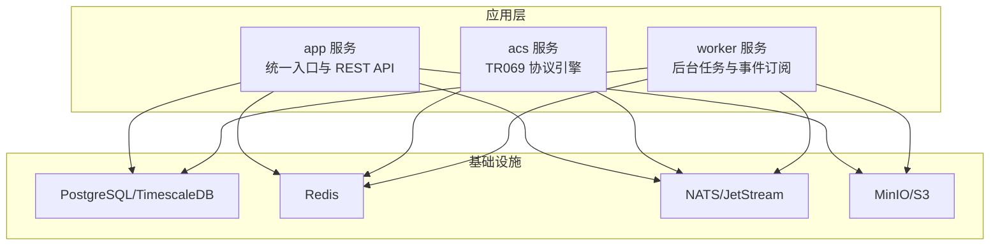
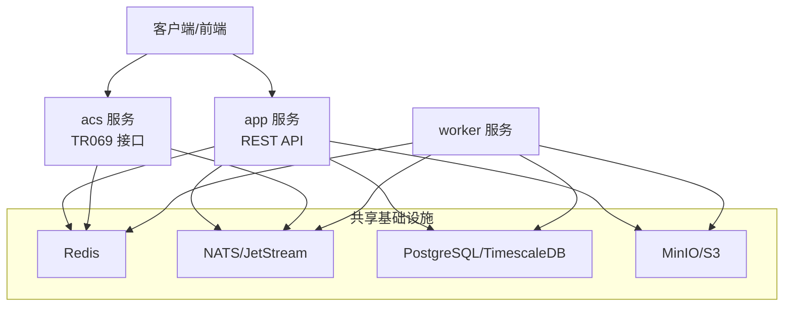
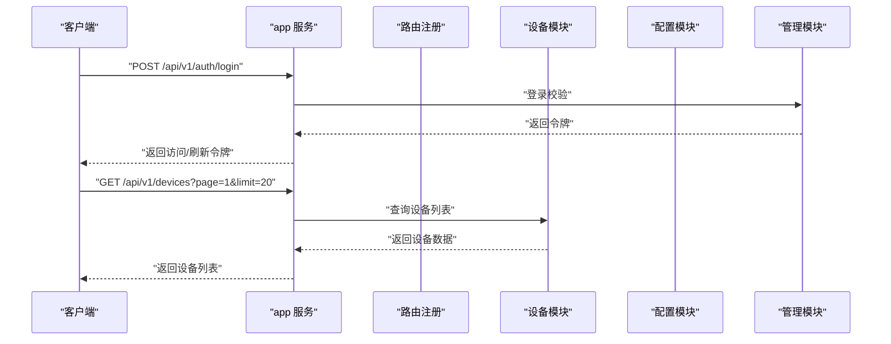
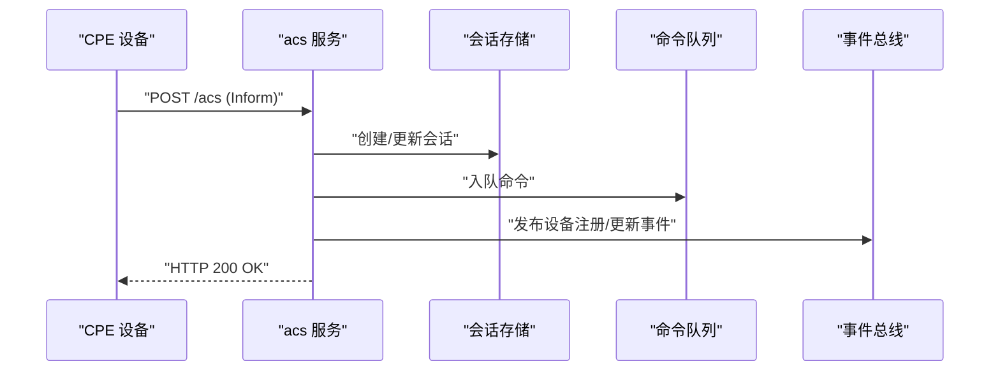
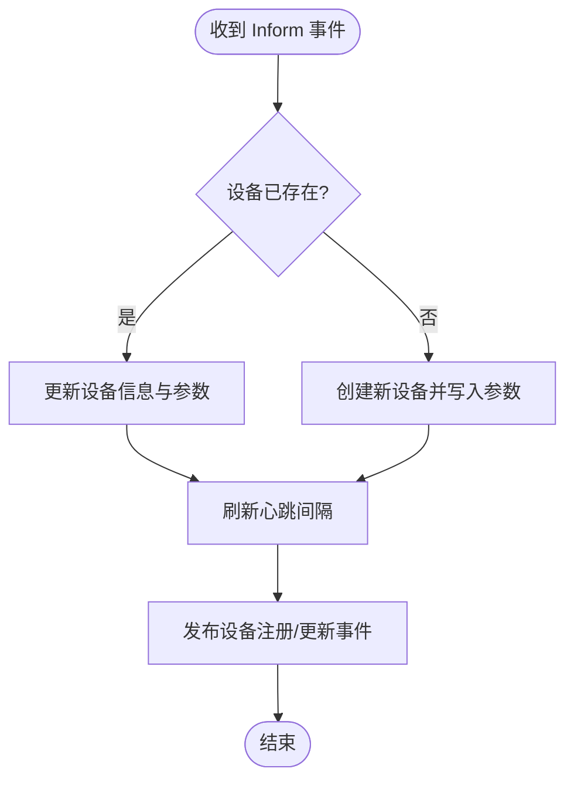
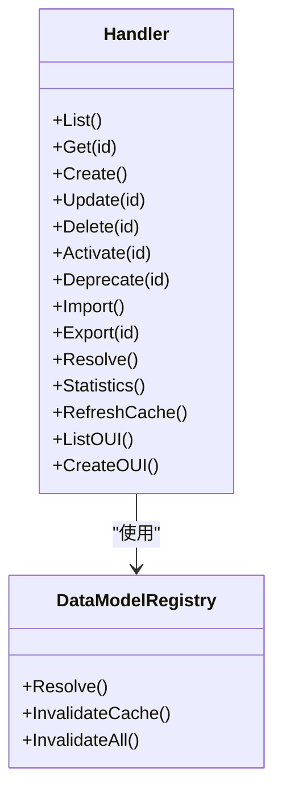
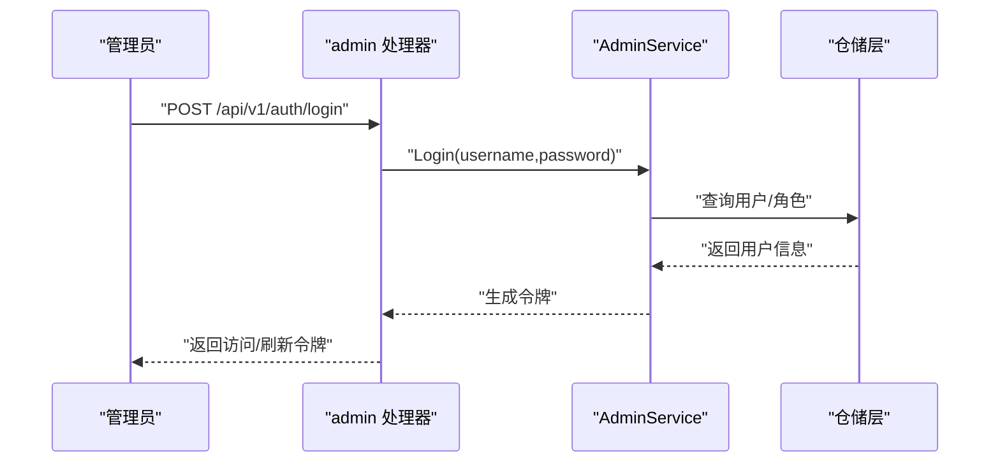
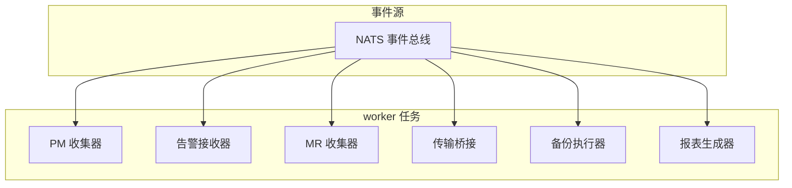
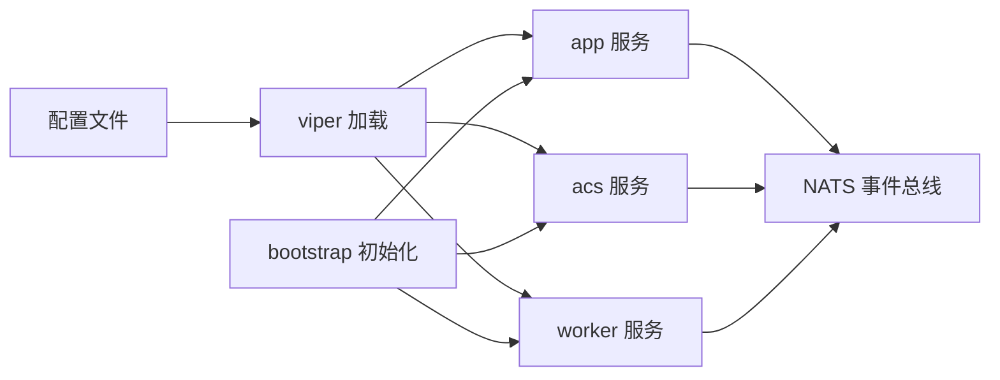
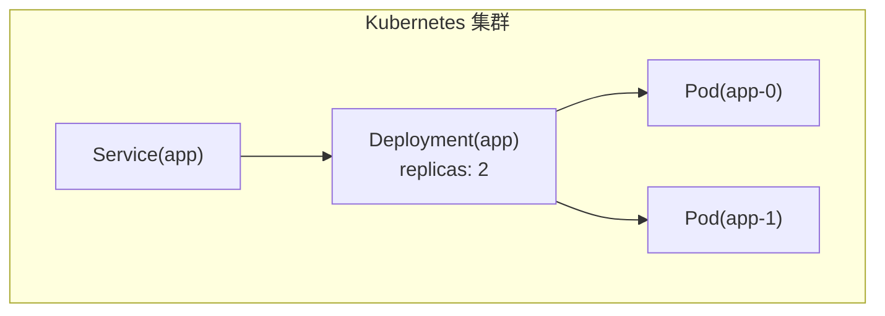

# 微服务架构

<cite>
**本文档引用的文件**
- [omcgo/cmd/app/main.go](file://omcgo/cmd/app/main.go)
- [omcgo/cmd/acs/main.go](file://omcgo/cmd/acs/main.go)
- [omcgo/cmd/worker/main.go](file://omcgo/cmd/worker/main.go)
- [omcgo/cmd/app/etc/config.dev.yaml](file://omcgo/cmd/app/etc/config.dev.yaml)
- [omcgo/cmd/acs/etc/config.dev.yaml](file://omcgo/cmd/acs/etc/config.dev.yaml)
- [omcgo/cmd/worker/etc/config.dev.yaml](file://omcgo/cmd/worker/etc/config.dev.yaml)
- [omcgo/internal/core/bootstrap/bootstrap.go](file://omcgo/internal/core/bootstrap/bootstrap.go)
- [omcgo/internal/core/appconfig/config.go](file://omcgo/internal/core/appconfig/config.go)
- [omcgo/cmd/app/router/router.go](file://omcgo/cmd/app/router/router.go)
- [omcgo/internal/acs/server.go](file://omcgo/internal/acs/server.go)
- [omcgo/internal/device/service.go](file://omcgo/internal/device/service.go)
- [omcgo/internal/config/datamodel/handler.go](file://omcgo/internal/config/datamodel/handler.go)
- [omcgo/internal/admin/handler.go](file://omcgo/internal/admin/handler.go)
- [omcgo/deployments/docker/docker-compose.yml](file://omcgo/deployments/docker/docker-compose.yml)
- [omcgo/deployments/k8s/app/deployment.yaml](file://omcgo/deployments/k8s/app/deployment.yaml)
</cite>

## 目录
1. [简介](#简介)
2. [项目结构](#项目结构)
3. [核心组件](#核心组件)
4. [架构总览](#架构总览)
5. [详细组件分析](#详细组件分析)
6. [依赖关系分析](#依赖关系分析)
7. [性能考虑](#性能考虑)
8. [故障排查指南](#故障排查指南)
9. [结论](#结论)
10. [附录](#附录)

## 简介
本项目为 Baicells OMC（操作维护中心）的微服务化重构，采用 go-zero 生态与模块化设计，围绕 TR069 南向接入与北向数据处理构建。整体采用 monorepo 组织方式，通过多个独立可运行的服务实现职责分离：app 服务作为统一入口与 REST API 提供者；acs 服务处理 TR069 协议与设备会话；device 服务管理设备生命周期与参数；config 服务处理数据模型与模板；monitor 服务负责可观测性；admin 服务提供 RBAC 管理；worker 服务处理后台任务与事件驱动的数据处理。

## 项目结构
项目采用 monorepo 结构，核心位于 omcgo 目录，包含：
- cmd/*：各微服务入口程序与配置
- internal/*：按领域划分的业务模块（device、config、admin、pm、mr、alarm、provision、report、backup 等）
- deployments：容器化与编排配置（docker-compose、k8s）
- docs：架构与设计文档
- migrations：数据库迁移脚本

图表来源
- [omcgo/cmd/app/main.go:17-75](file://omcgo/cmd/app/main.go#L17-L75)
- [omcgo/cmd/acs/main.go:33-76](file://omcgo/cmd/acs/main.go#L33-L76)
- [omcgo/cmd/worker/main.go:44-68](file://omcgo/cmd/worker/main.go#L44-L68)

章节来源
- [omcgo/cmd/app/main.go:1-92](file://omcgo/cmd/app/main.go#L1-L92)
- [omcgo/cmd/acs/main.go:1-93](file://omcgo/cmd/acs/main.go#L1-L93)
- [omcgo/cmd/worker/main.go:1-161](file://omcgo/cmd/worker/main.go#L1-L161)

## 核心组件
- app 服务：基于 Gin 的 REST API 服务器，聚合所有业务模块路由，提供认证、审计、CORS、Prometheus 指标等中间件。
- acs 服务：TR069 ACS 引擎，处理设备 Inform/Response 流程、会话管理、速率限制、命令队列与事件发布。
- device 服务：设备生命周期管理、状态机、心跳监控、参数存储与事件发布。
- config 服务：数据模型注册表、导入导出、模板管理、基线配置。
- admin 服务：RBAC 用户/角色/权限管理、审计日志、JWT 登录刷新。
- worker 服务：事件驱动的后台任务执行器，包括 PM/MR/KPI、告警、MR、备份、报表等。
- monitor 服务：Prometheus 指标端点、健康检查、系统信息。
- infra 层：统一的启动引导、连接池、事件总线、优雅停机、日志与链路追踪。

章节来源
- [omcgo/cmd/app/router/router.go:46-349](file://omcgo/cmd/app/router/router.go#L46-L349)
- [omcgo/internal/acs/server.go:18-136](file://omcgo/internal/acs/server.go#L18-L136)
- [omcgo/internal/device/service.go:16-417](file://omcgo/internal/device/service.go#L16-L417)
- [omcgo/internal/config/datamodel/handler.go:12-371](file://omcgo/internal/config/datamodel/handler.go#L12-L371)
- [omcgo/internal/admin/handler.go:13-418](file://omcgo/internal/admin/handler.go#L13-L418)
- [omcgo/internal/core/bootstrap/bootstrap.go:34-293](file://omcgo/internal/core/bootstrap/bootstrap.go#L34-L293)

## 架构总览
微服务通过统一的启动引导模块初始化基础设施连接，并在 app 服务中集中注册路由与中间件。acs 服务独立于 app 服务运行，直接暴露 TR069 接口。worker 服务通过 NATS 订阅事件，异步处理数据落库与计算。

图表来源
- [omcgo/internal/core/bootstrap/bootstrap.go:64-138](file://omcgo/internal/core/bootstrap/bootstrap.go#L64-L138)
- [omcgo/cmd/app/router/router.go:149-178](file://omcgo/cmd/app/router/router.go#L149-L178)
- [omcgo/cmd/acs/main.go:45-76](file://omcgo/cmd/acs/main.go#L45-L76)
- [omcgo/cmd/worker/main.go:56-68](file://omcgo/cmd/worker/main.go#L56-L68)

## 详细组件分析

### app 服务：统一入口与 REST API
- 启动流程：加载配置 → 初始化基础设施 → 创建 Gin 引擎 → 注册中间件与路由 → 启动 HTTP 与指标服务。
- 中间件：CORS、请求日志、Prometheus 指标、JWT 认证、审计日志、统一 404 处理。
- 路由组织：按模块分组（设备、配置、工单、性能、告警、MR、软件、报表、备份、MML、拓扑、系统等），部分路由需要管理员权限。
- 安全：JWT 登录/刷新、基于角色的权限控制、审计日志记录。

图表来源
- [omcgo/cmd/app/main.go:33-75](file://omcgo/cmd/app/main.go#L33-L75)
- [omcgo/cmd/app/router/router.go:149-178](file://omcgo/cmd/app/router/router.go#L149-L178)
- [omcgo/internal/admin/handler.go:65-97](file://omcgo/internal/admin/handler.go#L65-L97)
- [omcgo/internal/device/service.go:242-244](file://omcgo/internal/device/service.go#L242-L244)

章节来源
- [omcgo/cmd/app/main.go:17-75](file://omcgo/cmd/app/main.go#L17-L75)
- [omcgo/cmd/app/router/router.go:46-349](file://omcgo/cmd/app/router/router.go#L46-L349)
- [omcgo/internal/admin/handler.go:27-63](file://omcgo/internal/admin/handler.go#L27-L63)

### acs 服务：TR069 协议引擎
- 职责：接收 TR069 Inform 请求，建立/维护设备会话，执行速率限制与准入控制，发布事件到 NATS。
- 关键组件：会话存储（Redis）、命令队列（Redis）、事件总线（NATS）、鉴权器、RPC 分发器、指标。
- 启动：初始化依赖 → 创建 HTTP 服务器（/acs 与 /healthz）→ 后台清理 goroutine。

图表来源
- [omcgo/internal/acs/server.go:39-88](file://omcgo/internal/acs/server.go#L39-L88)
- [omcgo/cmd/acs/main.go:53-76](file://omcgo/cmd/acs/main.go#L53-L76)

章节来源
- [omcgo/internal/acs/server.go:18-136](file://omcgo/internal/acs/server.go#L18-L136)
- [omcgo/cmd/acs/main.go:33-76](file://omcgo/cmd/acs/main.go#L33-L76)

### device 服务：设备管理与状态机
- 职责：设备注册/更新、参数存储、心跳监控、状态转换、事件发布（设备注册/状态变更）。
- 数据模型：设备、参数、分组、站点、拓扑节点/边。
- 与 acs 的协作：通过事件总线接收 Inform 事件，触发设备注册/更新。

图表来源
- [omcgo/internal/device/service.go:42-202](file://omcgo/internal/device/service.go#L42-L202)

章节来源
- [omcgo/internal/device/service.go:16-417](file://omcgo/internal/device/service.go#L16-L417)

### config 服务：数据模型与模板
- 数据模型：支持多运营商/多制式/多 OUI/产品类别的参数树，支持激活/弃用与缓存刷新。
- 模板：配置模板的增删改查与导入导出。
- 基线：配置基线的创建与下发任务管理。

图表来源
- [omcgo/internal/config/datamodel/handler.go:12-371](file://omcgo/internal/config/datamodel/handler.go#L12-L371)

章节来源
- [omcgo/internal/config/datamodel/handler.go:12-371](file://omcgo/internal/config/datamodel/handler.go#L12-L371)

### admin 服务：RBAC 管理
- 功能：用户/角色/权限管理、登录/刷新、锁定/解锁、审计日志查询。
- 权限：基于角色的细粒度权限控制，支持审计中间件记录操作。

图表来源
- [omcgo/internal/admin/handler.go:65-97](file://omcgo/internal/admin/handler.go#L65-L97)

章节来源
- [omcgo/internal/admin/handler.go:13-418](file://omcgo/internal/admin/handler.go#L13-L418)

### worker 服务：后台任务与事件驱动
- 订阅事件：PM 文件采集与 KPI 计算、告警聚合、MR 数据采集、文件传输桥接、备份任务执行、报表生成。
- 存储：PostgreSQL（结构化数据）、TimescaleDB（时序数据）、MinIO（对象存储）。
- 扩展：通过 NATS 订阅扩展新的后台任务。

图表来源
- [omcgo/cmd/worker/main.go:70-144](file://omcgo/cmd/worker/main.go#L70-L144)

章节来源
- [omcgo/cmd/worker/main.go:44-144](file://omcgo/cmd/worker/main.go#L44-L144)

## 依赖关系分析
- 配置管理：各服务通过 viper 加载 YAML 配置，并支持环境变量覆盖，便于容器化部署。
- 基础设施：统一通过 bootstrap 初始化连接池与客户端，确保资源复用与优雅停机。
- 事件驱动：NATS 作为事件总线，app/acs 服务发布领域事件，worker 服务订阅处理。
- 通信机制：
  - REST API：app 服务提供统一 REST 接口，使用 JWT 认证与权限控制。
  - gRPC：未在现有代码中发现显式的 gRPC 实现，建议后续在跨服务调用或高吞吐场景引入。

图表来源
- [omcgo/internal/core/appconfig/config.go:215-260](file://omcgo/internal/core/appconfig/config.go#L215-L260)
- [omcgo/internal/core/bootstrap/bootstrap.go:64-138](file://omcgo/internal/core/bootstrap/bootstrap.go#L64-L138)

章节来源
- [omcgo/internal/core/appconfig/config.go:12-260](file://omcgo/internal/core/appconfig/config.go#L12-L260)
- [omcgo/internal/core/bootstrap/bootstrap.go:34-293](file://omcgo/internal/core/bootstrap/bootstrap.go#L34-L293)

## 性能考虑
- 连接池：PostgreSQL/TimescaleDB 与 Redis 使用连接池配置，合理设置最大连接数与空闲超时。
- 指标与探针：每个服务均提供 /metrics 指标端点与 /healthz 健康检查，便于 Prometheus 抓取与 Kubernetes 探针。
- 事件驱动：后台任务通过 NATS 异步处理，避免阻塞主请求路径。
- 缓存：数据模型注册表支持缓存与失效，减少重复解析成本。
- 速率限制：acs 服务内置 per-device 速率限制与清理策略，防止突发流量冲击。

## 故障排查指南
- 启动失败：检查配置文件路径与环境变量是否正确，确认基础设施（PG/Redis/NATS/MinIO）连通性。
- 认证问题：核对 JWT 密钥与过期时间配置，确认 /api/v1/auth/login 返回状态。
- TR069 无法接入：检查 acs 服务端口与 /acs 路由，查看会话存储与命令队列状态。
- 后台任务异常：查看 worker 服务日志与 NATS 订阅状态，确认事件是否正常发布与消费。
- 指标缺失：确认 /metrics 端口与探针配置，检查 Prometheus 抓取目标。

章节来源
- [omcgo/cmd/app/etc/config.dev.yaml:78-91](file://omcgo/cmd/app/etc/config.dev.yaml#L78-L91)
- [omcgo/cmd/acs/etc/config.dev.yaml:57-70](file://omcgo/cmd/acs/etc/config.dev.yaml#L57-L70)
- [omcgo/cmd/worker/etc/config.dev.yaml:50-63](file://omcgo/cmd/worker/etc/config.dev.yaml#L50-L63)

## 结论
本项目以 go-zero 为基础，结合 NATS 事件总线与统一启动引导，实现了清晰的微服务边界与职责分离。app 服务作为统一入口，acs 服务专注 TR069 南向接入，device 与 config 模块支撑设备与参数治理，admin 提供管理能力，worker 通过事件驱动处理后台任务。建议后续在跨服务调用场景引入 gRPC，并完善服务发现与自动扩缩容策略。

## 附录

### 服务拆分原则与边界
- 南向接入边界：acs 服务独立运行，仅暴露 TR069 接口，避免与业务路由耦合。
- 业务域边界：设备、配置、工单、性能、告警、MR、报表、备份、MML、拓扑等模块按领域划分，路由与仓储隔离。
- 管理边界：admin 模块提供统一的 RBAC 与审计能力，app 服务通过中间件强制鉴权与权限校验。

### 服务发现、负载均衡与故障处理
- 服务发现：当前通过静态配置与 docker-compose/k8s 服务名访问；建议引入服务注册与发现（如 Consul/Nacos）与 DNS 解析。
- 负载均衡：app 服务在 k8s 中通过 Deployment 多副本实现水平扩展，配合就绪/存活探针。
- 故障处理：bootstrap 提供统一的优雅停机与资源关闭顺序，各服务通过 /healthz 与 /metrics 自检。

### 部署架构与扩缩容策略
- Docker Compose：一键拉起 PostgreSQL、Redis、NATS、MinIO 与各服务实例，适合开发与测试。
- Kubernetes：app 服务多副本部署，暴露 /metrics 与 /healthz；acs 与 worker 独立部署，按需扩缩容；通过 ConfigMap/Secret 管理配置与密钥。

图表来源
- [omcgo/deployments/k8s/app/deployment.yaml:10-55](file://omcgo/deployments/k8s/app/deployment.yaml#L10-L55)

章节来源
- [omcgo/deployments/docker/docker-compose.yml:19-194](file://omcgo/deployments/docker/docker-compose.yml#L19-L194)
- [omcgo/deployments/k8s/app/deployment.yaml:1-103](file://omcgo/deployments/k8s/app/deployment.yaml#L1-L103)