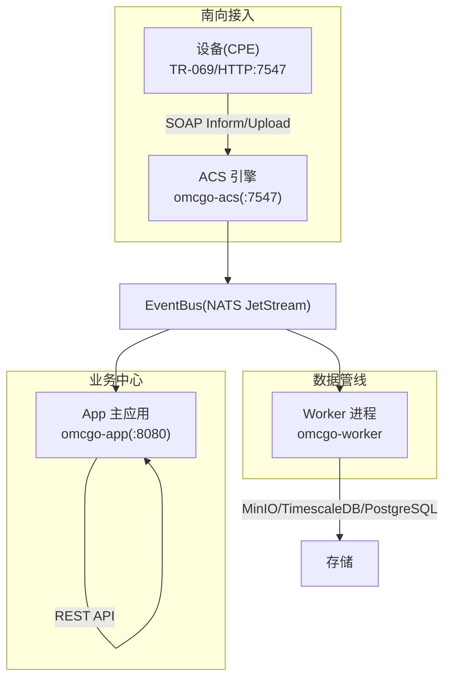
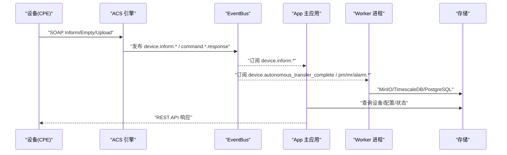
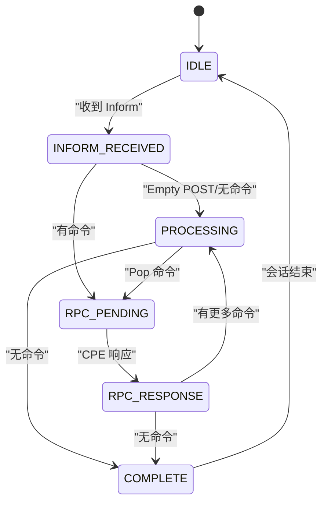
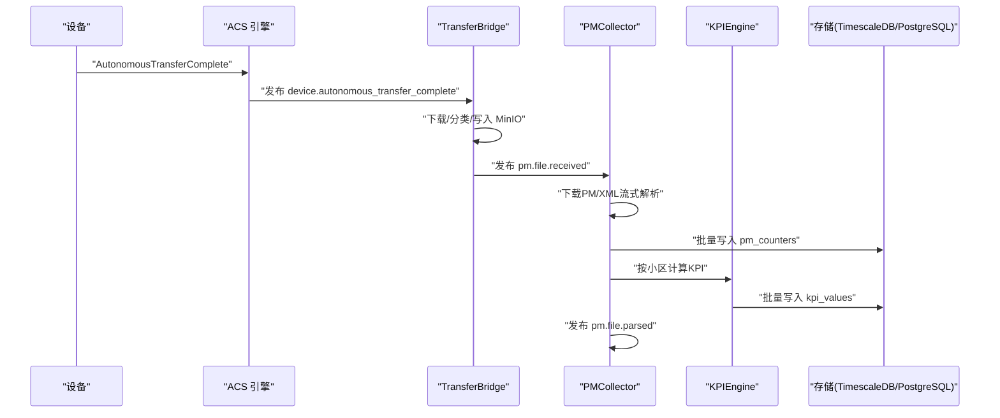
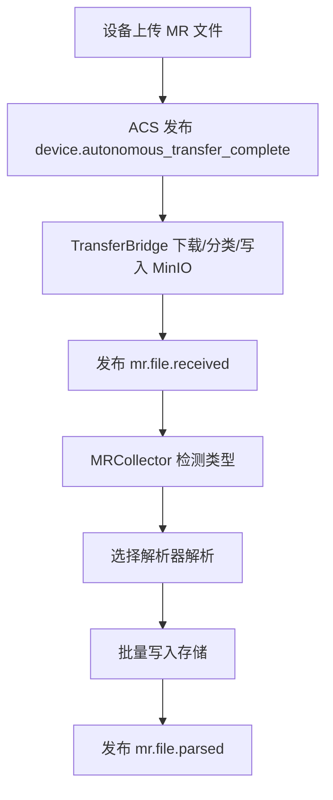
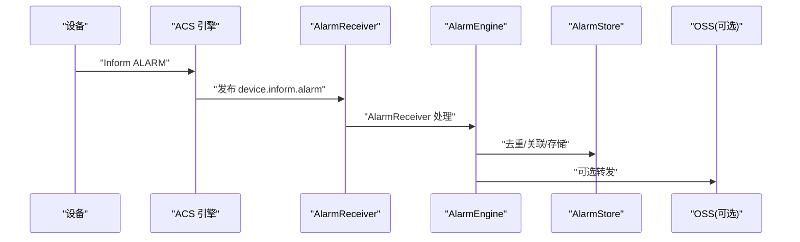
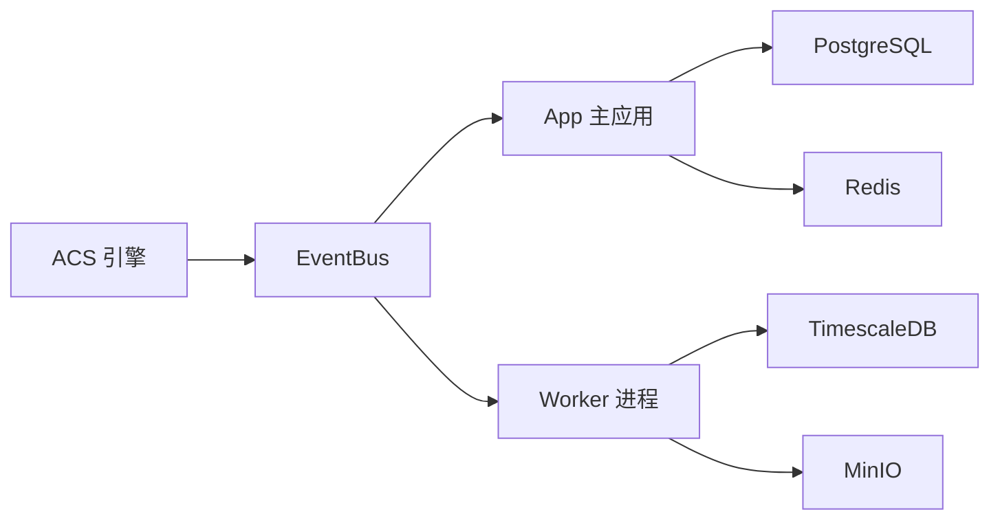

# 数据流设计

<cite>
**本文引用的文件**
- [pm-kpi-flow.md](file://omcgo/docs/design/pm-kpi-flow.md)
- [acs-service-flow.md](file://omcgo/docs/design/acs-service-flow.md)
- [inform-handler-migration-evaluation.md](file://omcgo/docs/design/inform-handler-migration-evaluation.md)
- [12-alarm-management.md](file://omcgo/docs/detailed-design/12-alarm-management.md)
- [13-measurement-reports.md](file://omcgo/docs/detailed-design/13-measurement-reports.md)
- [session-design.md](file://omcgo/docs/design/session-design.md)
- [inform_handler.go](file://omcgo/internal/device/inform_handler.go)
- [handler.go](file://omcgo/internal/pm/handler.go)
- [handler.go](file://omcgo/internal/mr/handler.go)
- [handler.go](file://omcgo/internal/alarm/handler.go)
- [bridge.go](file://omcgo/internal/transfer/bridge.go)
- [collector.go](file://omcgo/internal/pm/collector/collector.go)
- [engine.go](file://omcgo/internal/pm/kpi/engine.go)
- [receiver.go](file://omcgo/internal/alarm/receiver.go)
- [errors.go](file://omcgo/internal/core/errors/errors.go)
</cite>

## 目录
1. [简介](#简介)
2. [项目结构](#项目结构)
3. [核心组件](#核心组件)
4. [架构总览](#架构总览)
5. [详细组件分析](#详细组件分析)
6. [依赖分析](#依赖分析)
7. [性能考虑](#性能考虑)
8. [故障排查指南](#故障排查指南)
9. [结论](#结论)
10. [附录](#附录)

## 简介
本文件面向 Baicells OMC 项目的“数据流设计”，围绕三大核心数据域（设备 Inform、PM/KPI、MR、告警）梳理从设备 TR-069 消息到业务处理再到数据存储的完整链路。重点覆盖：
- 设备 Inform 消息的处理流程（消息解析、会话建立、参数提取、状态更新）
- PM 数据流（文件上传、流式解析、KPI 计算、阈值检查与存储）
- MR 数据处理（测量报告解析、质量指标计算、优化建议生成）
- 告警数据流（设备状态变化检测、规则匹配、告警通知）
- 数据流监控与性能优化策略，以及数据一致性与错误处理机制

## 项目结构
OMC 采用多进程架构：ACS 引擎（omcgo-acs）负责 TR-069 南向接入，App（omcgo-app）承载设备管理与业务逻辑，Worker（omcgo-worker）负责 PM/MR/KPI/告警等重 I/O 数据管线。三者通过 EventBus（NATS JetStream）进行事件编排。

图表来源
- [acs-service-flow.md:11-21](file://omcgo/docs/design/acs-service-flow.md#L11-L21)
- [acs-service-flow.md:23-29](file://omcgo/docs/design/acs-service-flow.md#L23-L29)

章节来源
- [acs-service-flow.md:1-777](file://omcgo/docs/design/acs-service-flow.md#L1-L777)

## 核心组件
- ACS 引擎：TR-069 协议处理、会话管理、命令队列、事件发布
- App 主应用：设备管理、配置、自动开站、REST API
- Worker 进程：PM/MR 文件解析、KPI 计算、告警处理、数据存储
- EventBus：事件总线（NATS JetStream），支撑跨进程事件编排
- 存储层：MinIO（对象存储）、TimescaleDB（时序数据库）、PostgreSQL（关系数据库）

章节来源
- [acs-service-flow.md:7-30](file://omcgo/docs/design/acs-service-flow.md#L7-L30)
- [pm-kpi-flow.md:25-39](file://omcgo/docs/design/pm-kpi-flow.md#L25-L39)

## 架构总览
OMC 的数据流采用“事件驱动 + 异步处理”的流水线模式，设备侧通过 TR-069 与 ACS 交互，ACS 将设备事件转化为内部事件，App/Worker 订阅并处理，最终落库并提供 REST API 查询。

图表来源
- [acs-service-flow.md:312-366](file://omcgo/docs/design/acs-service-flow.md#L312-L366)
- [pm-kpi-flow.md:633-695](file://omcgo/docs/design/pm-kpi-flow.md#L633-L695)

章节来源
- [acs-service-flow.md:368-760](file://omcgo/docs/design/acs-service-flow.md#L368-L760)

## 详细组件分析

### 设备 Inform 消息处理流程
- 会话建立与状态机：ACS 接收 Inform 后创建/更新会话，绑定连接映射，发布 Inform 事件；Empty POST 检查命令队列；RPC 响应后继续或完成会话。
- 事件发布：根据 EventCode 发布 device.inform.bootstrap/periodic/value_change 等事件。
- App 侧 InformHandler：订阅 device.inform.* 事件，完成设备注册/更新，并通过 device.registered 事件保障自动开站的因果时序。

图表来源
- [session-design.md:85-119](file://omcgo/docs/design/session-design.md#L85-L119)

章节来源
- [session-design.md:70-151](file://omcgo/docs/design/session-design.md#L70-L151)
- [acs-service-flow.md:129-163](file://omcgo/docs/design/acs-service-flow.md#L129-L163)
- [inform-handler-migration-evaluation.md:15-91](file://omcgo/docs/design/inform-handler-migration-evaluation.md#L15-L91)

### PM/KPI 数据流（文件上传—解析—KPI 计算—存储）
- 文件采集触发：设备可主动上传 PM 文件（AutonomousTransferComplete），或通过 Upload 命令触发。ACS 接收后发布 device.autonomous_transfer_complete。
- TransferBridge：下载文件、分类（PM/MR/Log）、写入 MinIO，并发布 pm.file.received/mr.file.received。
- PMCollector：从 MinIO 下载 PM 文件，流式解析 XML，批量写入 pm_counters，计算 KPI 并写入 kpi_values，发布 pm.file.parsed。
- REST API：提供计数器、聚合、KPI、任务、文件下载等查询接口。

图表来源
- [pm-kpi-flow.md:43-60](file://omcgo/docs/design/pm-kpi-flow.md#L43-L60)
- [pm-kpi-flow.md:120-181](file://omcgo/docs/design/pm-kpi-flow.md#L120-L181)
- [pm-kpi-flow.md:162-250](file://omcgo/docs/design/pm-kpi-flow.md#L162-L250)

章节来源
- [pm-kpi-flow.md:1-737](file://omcgo/docs/design/pm-kpi-flow.md#L1-L737)
- [handler.go:35-49](file://omcgo/internal/pm/handler.go#L35-L49)

### MR 数据处理流程
- 文件接收：设备上传 MR 文件后，ACS 发布 device.autonomous_transfer_complete，TransferBridge 下载并分类为 MR，发布 mr.file.received。
- MRCollector：检测 MR 类型（MRO/MRS/MRE），选择对应解析器，解析后批量写入存储，发布 mr.file.parsed。
- API：提供 MR 文件列表、下载、解析数据查询、指标与映射管理、导出等接口。

图表来源
- [13-measurement-reports.md:16-26](file://omcgo/docs/detailed-design/13-measurement-reports.md#L16-L26)
- [bridge.go:123-206](file://omcgo/internal/transfer/bridge.go#L123-L206)
- [collector.go:76-181](file://omcgo/internal/mr/collector/collector.go#L76-L181)

章节来源
- [13-measurement-reports.md:1-167](file://omcgo/docs/detailed-design/13-measurement-reports.md#L1-L167)
- [handler.go:32-47](file://omcgo/internal/mr/handler.go#L32-L47)

### 告警数据流
- 设备状态变化：设备通过 Inform ALARM 事件上报，ACS 发布 device.inform.alarm。
- AlarmReceiver：订阅设备告警事件，提取参数，交由 AlarmEngine 去重、关联、抑制与生命周期管理。
- 存储：活跃告警存 Redis，历史告警存 TimescaleDB 超表；可选转发至 OSS。
- API：提供活跃/历史告警查询、确认、清除、统计等接口。

图表来源
- [12-alarm-management.md:16-26](file://omcgo/docs/detailed-design/12-alarm-management.md#L16-L26)
- [receiver.go:51-85](file://omcgo/internal/alarm/receiver.go#L51-L85)

章节来源
- [12-alarm-management.md:1-221](file://omcgo/docs/detailed-design/12-alarm-management.md#L1-L221)
- [handler.go:26-36](file://omcgo/internal/alarm/handler.go#L26-L36)

## 依赖分析
- 组件耦合与职责边界
  - App：设备管理、配置、自动开站、REST API；订阅 device.inform.* 与 device.registered，实时性强。
  - Worker：PM/MR/KPI/告警等重 I/O 任务；通过 Queue Group 支持水平扩展。
  - ACS：TR-069 南向接入；高并发会话管理与命令下发。
- 事件级联与因果时序
  - device.inform.bootstrap → InformHandler 注册设备 → device.registered → ProvisioningEngine 自动开站，消除竞态。
- 外部依赖
  - NATS JetStream（事件总线）、Redis（会话/命令队列/活跃告警）、MinIO（对象存储）、TimescaleDB/PostgreSQL（时序与关系数据）。

图表来源
- [acs-service-flow.md:166-224](file://omcgo/docs/design/acs-service-flow.md#L166-L224)
- [inform-handler-migration-evaluation.md:181-212](file://omcgo/docs/design/inform-handler-migration-evaluation.md#L181-L212)

章节来源
- [acs-service-flow.md:368-760](file://omcgo/docs/design/acs-service-flow.md#L368-L760)
- [inform-handler-migration-evaluation.md:17-136](file://omcgo/docs/design/inform-handler-migration-evaluation.md#L17-L136)

## 性能考虑
- 流式解析与批量写入
  - PM XML 采用流式 Decoder，避免全量加载内存；计数器批量写入 TimescaleDB，显著提升吞吐。
- 存储优化
  - TimescaleDB 超表按天分块、压缩与保留策略；连续聚合物化视图加速查询。
- 并发与扩展
  - NATS Queue Group 支持 Worker 水平扩展；Redis 命令队列支持优先级与过期清理。
- 会话与限流
  - 设备级令牌桶 + 全局准入控制 + 会话收割器，保障 ACS 高并发稳定性。

章节来源
- [pm-kpi-flow.md:703-713](file://omcgo/docs/design/pm-kpi-flow.md#L703-L713)
- [session-design.md:326-384](file://omcgo/docs/design/session-design.md#L326-L384)

## 故障排查指南
- 常见错误与处理
  - 输入参数错误：返回 400，携带业务错误码与详情。
  - 资源不存在：返回 404。
  - 未授权/禁止：返回 401/403。
  - 超时/服务不可用：返回 504/503。
  - 内部错误：返回 500。
- PM/KPI 相关
  - PM 文件解析失败：检查 MinIO 路径、文件格式与权限；查看 PMCollector 日志。
  - KPI 计算缺失：检查计数器查询窗口、公式依赖与计数器缺失情况。
- MR 相关
  - MR 类型识别失败：检查文件命名与 FileType；确认解析器支持。
- 告警相关
  - 告警去重/关联异常：检查 Redis 哈希与活跃告警表；核对严重级别映射。
- 会话与命令
  - 会话超时/未找到：检查 Redis 会话 TTL 与连接映射；确认 Empty POST 路径。
  - 命令队列堆积：检查优先级与过期策略；核对命令下发与响应。

章节来源
- [errors.go:11-110](file://omcgo/internal/core/errors/errors.go#L11-L110)
- [pm-kpi-flow.md:699-713](file://omcgo/docs/design/pm-kpi-flow.md#L699-L713)
- [session-design.md:559-567](file://omcgo/docs/design/session-design.md#L559-L567)

## 结论
OMC 的数据流设计以事件驱动为核心，结合 ACS 的 TR-069 南向接入与 App/Worker 的职责分离，实现了从设备消息到业务处理再到数据存储的高效闭环。通过 NATS 事件总线、流式解析、批量写入与 TimescaleDB 优化，系统在高并发与大数据量场景下具备良好的可扩展性与稳定性。同时，完善的错误处理与监控体系为运维与故障排查提供了坚实基础。

## 附录
- 关键文件索引
  - PM/KPI：pm-kpi-flow.md、collector.go、engine.go、handler.go
  - MR：13-measurement-reports.md、collector.go、handler.go
  - 告警：12-alarm-management.md、receiver.go、handler.go
  - 会话与 ACS：session-design.md、acs-service-flow.md、inform_handler.go
  - 错误处理：errors.go