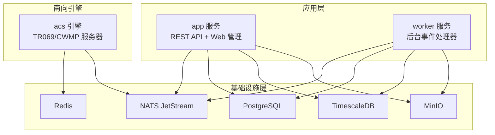
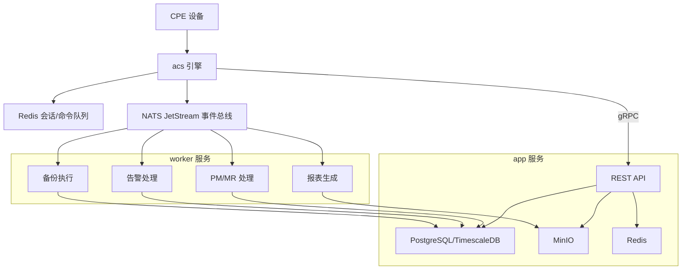
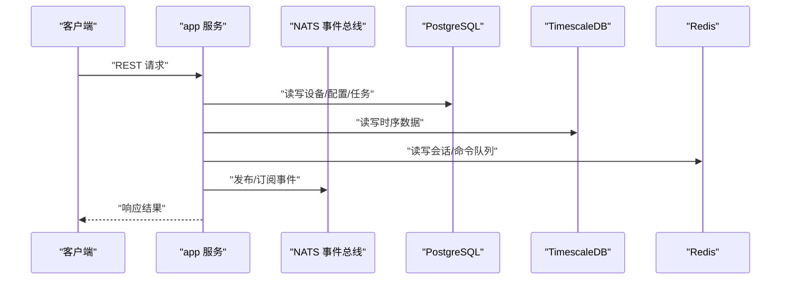
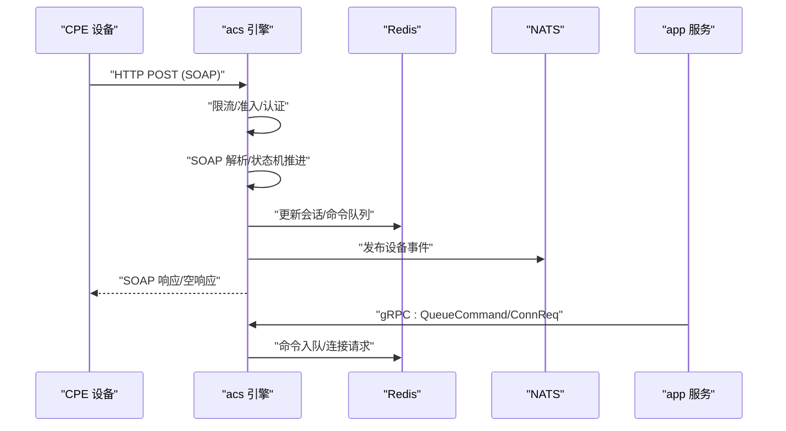
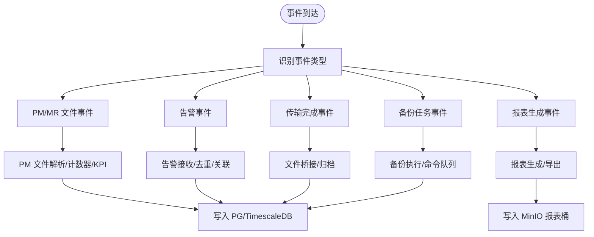
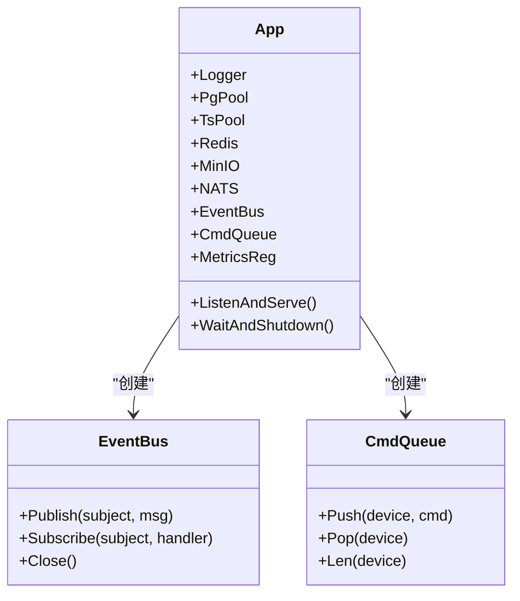
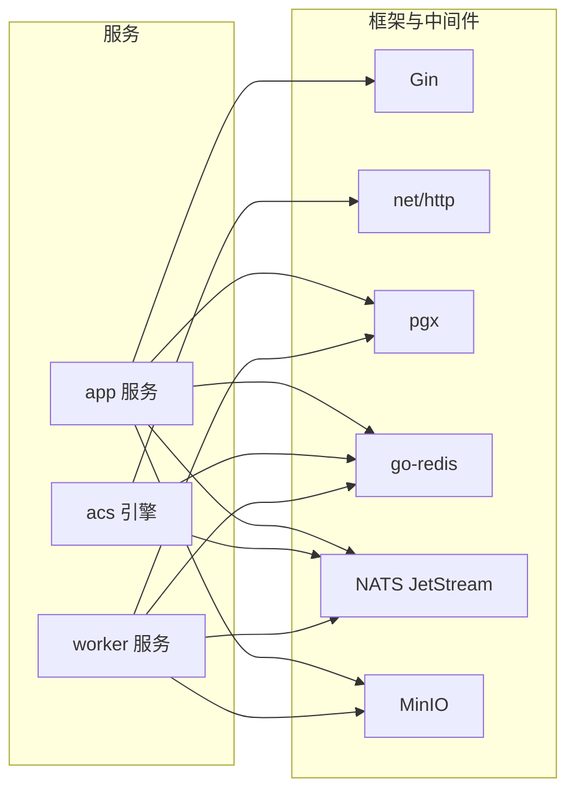

# 系统架构

<cite>
**本文引用的文件**
- [omcgo/cmd/app/main.go](file://omcgo/cmd/app/main.go)
- [omcgo/cmd/acs/main.go](file://omcgo/cmd/acs/main.go)
- [omcgo/cmd/worker/main.go](file://omcgo/cmd/worker/main.go)
- [omcgo/internal/core/bootstrap/bootstrap.go](file://omcgo/internal/core/bootstrap/bootstrap.go)
- [omcgo/deployments/docker/docker-compose.yml](file://omcgo/deployments/docker/docker-compose.yml)
- [omcgo/deployments/k8s/namespace.yaml](file://omcgo/deployments/k8s/namespace.yaml)
- [omcgo/cmd/app/etc/config.dev.yaml](file://omcgo/cmd/app/etc/config.dev.yaml)
- [omcgo/cmd/acs/etc/config.dev.yaml](file://omcgo/cmd/acs/etc/config.dev.yaml)
- [omcgo/cmd/worker/etc/config.dev.yaml](file://omcgo/cmd/worker/etc/config.dev.yaml)
- [omcgo/docs/architecture/framework-comparison.md](file://omcgo/docs/architecture/framework-comparison.md)
- [omcgo/docs/architecture/interface-topology.md](file://omcgo/docs/architecture/interface-topology.md)
- [omcgo/docs/detailed-design/02-infrastructure-layer.md](file://omcgo/docs/detailed-design/02-infrastructure-layer.md)
- [omcgo/docs/detailed-design/06-tr069-protocol-library.md](file://omcgo/docs/detailed-design/06-tr069-protocol-library.md)
- [omcgo/docs/detailed-design/07-acs-engine.md](file://omcgo/docs/detailed-design/07-acs-engine.md)
</cite>

## 目录
1. [简介](#简介)
2. [项目结构](#项目结构)
3. [核心组件](#核心组件)
4. [架构总览](#架构总览)
5. [详细组件分析](#详细组件分析)
6. [依赖分析](#依赖分析)
7. [性能考虑](#性能考虑)
8. [故障排查指南](#故障排查指南)
9. [结论](#结论)
10. [附录](#附录)

## 简介
本文件为 Baicells OMC 项目的系统架构文档，聚焦于整体架构设计、微服务与事件驱动模式、分层架构实现，以及 app 服务、acs 服务、worker 服务之间的协作关系。文档还阐述了从设备 TR069 消息处理到业务逻辑再到数据存储的完整数据流，并说明基础设施架构（容器化与 Kubernetes 编排、监控告警等）。最后给出技术决策与权衡考虑、系统边界与外部集成点。

## 项目结构
OMC 后端采用“模块化单体 + 独立 ACS 引擎”的混合架构：app 与 worker 以模块化单体形式运行，acs 作为独立进程独立部署，通过 gRPC 与 app 交互。基础设施层统一管理数据库、缓存、消息中间件与对象存储，提供统一的健康检查与优雅关闭能力。

图表来源
- [omcgo/cmd/app/main.go:17-75](file://omcgo/cmd/app/main.go#L17-L75)
- [omcgo/cmd/acs/main.go:33-76](file://omcgo/cmd/acs/main.go#L33-L76)
- [omcgo/cmd/worker/main.go:44-68](file://omcgo/cmd/worker/main.go#L44-L68)
- [omcgo/internal/core/bootstrap/bootstrap.go:64-138](file://omcgo/internal/core/bootstrap/bootstrap.go#L64-L138)

章节来源
- [omcgo/cmd/app/main.go:17-75](file://omcgo/cmd/app/main.go#L17-L75)
- [omcgo/cmd/acs/main.go:33-76](file://omcgo/cmd/acs/main.go#L33-L76)
- [omcgo/cmd/worker/main.go:44-68](file://omcgo/cmd/worker/main.go#L44-L68)
- [omcgo/internal/core/bootstrap/bootstrap.go:64-138](file://omcgo/internal/core/bootstrap/bootstrap.go#L64-L138)

## 核心组件
- app 服务：提供 REST API、设备管理与 F02-F10 模块入口，基于 Gin 框架，统一接入基础设施层。
- acs 引擎：独立进程，负责 TR069/CWMP 协议处理、会话状态机、命令队列与连接请求，通过 gRPC 与 app 交互。
- worker 服务：后台事件处理器，订阅 NATS 事件，处理 PM/MR 文件解析、KPI 计算、告警关联、报表生成、备份执行等。
- 基础设施层：统一连接 PostgreSQL/TimescaleDB、Redis、NATS JetStream、MinIO，提供健康检查与优雅关闭。
- 配置与部署：三套服务分别提供独立配置文件，docker-compose 用于本地开发，K8s YAML 描述命名空间与资源编排。

章节来源
- [omcgo/cmd/app/etc/config.dev.yaml:1-91](file://omcgo/cmd/app/etc/config.dev.yaml#L1-L91)
- [omcgo/cmd/acs/etc/config.dev.yaml:1-70](file://omcgo/cmd/acs/etc/config.dev.yaml#L1-L70)
- [omcgo/cmd/worker/etc/config.dev.yaml:1-63](file://omcgo/cmd/worker/etc/config.dev.yaml#L1-L63)
- [omcgo/deployments/docker/docker-compose.yml:19-194](file://omcgo/deployments/docker/docker-compose.yml#L19-L194)
- [omcgo/deployments/k8s/namespace.yaml:1-7](file://omcgo/deployments/k8s/namespace.yaml#L1-L7)

## 架构总览
系统采用“模块化单体 + 独立 ACS 引擎”的混合架构，既满足 TR069 协议对 SOAP/XML 的强约束，又通过 NATS 事件总线实现模块间松耦合。app 与 worker 通过基础设施层共享数据库与对象存储，acs 通过 gRPC 与 app 协同完成设备命令下发与状态同步。

图表来源
- [omcgo/docs/architecture/interface-topology.md:46-105](file://omcgo/docs/architecture/interface-topology.md#L46-L105)
- [omcgo/docs/detailed-design/07-acs-engine.md:27-37](file://omcgo/docs/detailed-design/07-acs-engine.md#L27-L37)
- [omcgo/docs/detailed-design/02-infrastructure-layer.md:25-27](file://omcgo/docs/detailed-design/02-infrastructure-layer.md#L25-L27)

章节来源
- [omcgo/docs/architecture/interface-topology.md:46-105](file://omcgo/docs/architecture/interface-topology.md#L46-L105)
- [omcgo/docs/detailed-design/07-acs-engine.md:27-37](file://omcgo/docs/detailed-design/07-acs-engine.md#L27-L37)
- [omcgo/docs/detailed-design/02-infrastructure-layer.md:25-27](file://omcgo/docs/detailed-design/02-infrastructure-layer.md#L25-L27)

## 详细组件分析

### app 服务（REST API 与管理面）
- 职责：提供设备管理、配置管理、性能/告警/MR 查询、报表与备份等 F02-F10 模块的 REST API；作为统一入口协调业务逻辑。
- 启动流程：加载配置 → 初始化基础设施（PG/Timescale/Redis/NATS/MinIO）→ 注册路由 → 启动 HTTP 与 Metrics 服务。
- 依赖：Gin、Cobra、Prometheus、Zap、NATS 事件总线、Redis 命令队列、PostgreSQL/TimescaleDB、MinIO。

图表来源
- [omcgo/cmd/app/main.go:33-75](file://omcgo/cmd/app/main.go#L33-L75)
- [omcgo/internal/core/bootstrap/bootstrap.go:64-91](file://omcgo/internal/core/bootstrap/bootstrap.go#L64-L91)

章节来源
- [omcgo/cmd/app/main.go:33-75](file://omcgo/cmd/app/main.go#L33-L75)
- [omcgo/internal/core/bootstrap/bootstrap.go:64-91](file://omcgo/internal/core/bootstrap/bootstrap.go#L64-L91)

### acs 引擎（TR069 南向协议引擎）
- 职责：独立进程，处理 TR069/CWMP 协议，实现会话状态机、设备认证、命令队列、连接请求、流量控制与指标。
- 交互：通过 gRPC 与 app 交互（命令下发、连接请求、事件流）；通过 Redis 存储会话与命令队列；通过 NATS 发布设备事件。
- 协议库：提供 TR069 类型、SOAP 编解码、XML 流式解析与模板渲染工具。

图表来源
- [omcgo/docs/detailed-design/07-acs-engine.md:137-162](file://omcgo/docs/detailed-design/07-acs-engine.md#L137-L162)
- [omcgo/docs/detailed-design/07-acs-engine.md:164-215](file://omcgo/docs/detailed-design/07-acs-engine.md#L164-L215)
- [omcgo/docs/detailed-design/06-tr069-protocol-library.md:243-314](file://omcgo/docs/detailed-design/06-tr069-protocol-library.md#L243-L314)

章节来源
- [omcgo/cmd/acs/main.go:33-76](file://omcgo/cmd/acs/main.go#L33-L76)
- [omcgo/docs/detailed-design/07-acs-engine.md:137-215](file://omcgo/docs/detailed-design/07-acs-engine.md#L137-L215)
- [omcgo/docs/detailed-design/06-tr069-protocol-library.md:243-314](file://omcgo/docs/detailed-design/06-tr069-protocol-library.md#L243-L314)

### worker 服务（事件驱动后台处理）
- 职责：订阅 NATS 事件，处理 PM/MR 文件解析与 KPI 计算、告警接收与关联、报表生成、备份执行等。
- 事件订阅：PM/MR/告警/传输完成等事件触发相应处理器；通过 MinIO 读取文件，写入 PostgreSQL/TimescaleDB。
- 与 app/acs 的关系：通过事件总线解耦，不直接耦合；必要时通过 app 的 REST API 触发任务。

图表来源
- [omcgo/cmd/worker/main.go:70-144](file://omcgo/cmd/worker/main.go#L70-L144)

章节来源
- [omcgo/cmd/worker/main.go:70-144](file://omcgo/cmd/worker/main.go#L70-L144)

### 基础设施层（统一连接与治理）
- 职责：统一管理数据库、缓存、消息中间件与对象存储；提供健康检查与优雅关闭。
- NATS JetStream：定义 DEVICE/COMMAND/PM/MR/ALARM/OSS 等 Stream，保障事件可靠投递。
- 连接池与重连：PostgreSQL/TimescaleDB、Redis、MinIO、NATS 均具备健康检查与指数退避重连策略。

图表来源
- [omcgo/internal/core/bootstrap/bootstrap.go:34-49](file://omcgo/internal/core/bootstrap/bootstrap.go#L34-L49)
- [omcgo/internal/core/bootstrap/bootstrap.go:199-202](file://omcgo/internal/core/bootstrap/bootstrap.go#L199-L202)
- [omcgo/internal/core/bootstrap/bootstrap.go:213-215](file://omcgo/internal/core/bootstrap/bootstrap.go#L213-L215)

章节来源
- [omcgo/docs/detailed-design/02-infrastructure-layer.md:10-27](file://omcgo/docs/detailed-design/02-infrastructure-layer.md#L10-L27)
- [omcgo/docs/detailed-design/02-infrastructure-layer.md:110-120](file://omcgo/docs/detailed-design/02-infrastructure-layer.md#L110-L120)
- [omcgo/internal/core/bootstrap/bootstrap.go:199-215](file://omcgo/internal/core/bootstrap/bootstrap.go#L199-L215)

## 依赖分析
- 技术栈与选型：采用“gin + net/http + pgx + go-redis + NATS”手工组装的模块化单体架构，满足 TR069 SOAP/XML 协议与有状态会话需求；go-zero 微服务虽具备服务治理与代码生成优势，但不支持 SOAP/XML，不适合 ACS 引擎。
- 服务边界：app 与 worker 为模块化单体，acs 为独立进程；通过 NATS 事件总线与 gRPC 协同。
- 外部集成：PostgreSQL/TimescaleDB 用于结构化与时序数据；Redis 用于会话与命令队列；MinIO 用于文件存储；NATS JetStream 用于事件总线。

图表来源
- [omcgo/docs/architecture/framework-comparison.md:9-16](file://omcgo/docs/architecture/framework-comparison.md#L9-L16)
- [omcgo/docs/architecture/framework-comparison.md:153-171](file://omcgo/docs/architecture/framework-comparison.md#L153-L171)

章节来源
- [omcgo/docs/architecture/framework-comparison.md:9-16](file://omcgo/docs/architecture/framework-comparison.md#L9-L16)
- [omcgo/docs/architecture/framework-comparison.md:153-171](file://omcgo/docs/architecture/framework-comparison.md#L153-L171)

## 性能考虑
- 连接池参数：根据 10 万/100 万规模建议配置 PostgreSQL 与 Redis 连接池大小、生命周期与健康检查间隔。
- NATS JetStream：WorkQueue 策略与副本数保障事件可靠投递；Stream 按主题划分，降低争用。
- 限流与准入：设备级限流与全局并发准入控制，防止突发 Inform 冲击；acs 引擎内部限流与 Redis TTL 协调。
- 时序数据：TimescaleDB 作为 PostgreSQL 扩展，透明处理超表与连续聚合，提升 PM/KPI 查询性能。

章节来源
- [omcgo/docs/detailed-design/02-infrastructure-layer.md:200-230](file://omcgo/docs/detailed-design/02-infrastructure-layer.md#L200-L230)
- [omcgo/docs/detailed-design/07-acs-engine.md:283-308](file://omcgo/docs/detailed-design/07-acs-engine.md#L283-L308)

## 故障排查指南
- 健康检查：通过统一健康检查器检查数据库、缓存、消息中间件与对象存储状态。
- 优雅关闭：统一的关闭钩子顺序（HTTP 服务 → NATS 消费者 → Redis → 数据库 → MinIO），避免数据丢失。
- 日志与指标：服务启动时记录配置与组件初始化信息；Prometheus 指标端点暴露运行时指标。
- 常见问题：
  - NATS Stream 未创建：确保启动时执行 EnsureStreams。
  - MinIO Bucket 不存在：确保启动时执行 EnsureBuckets。
  - Redis 会话/命令队列异常：检查 TTL 与键命名空间一致性。
  - acs 限流/并发超限：调整设备级限流参数与最大并发会话数。

章节来源
- [omcgo/internal/core/bootstrap/bootstrap.go:171-197](file://omcgo/internal/core/bootstrap/bootstrap.go#L171-L197)
- [omcgo/internal/core/bootstrap/bootstrap.go:246-292](file://omcgo/internal/core/bootstrap/bootstrap.go#L246-L292)
- [omcgo/docs/detailed-design/02-infrastructure-layer.md:150-194](file://omcgo/docs/detailed-design/02-infrastructure-layer.md#L150-L194)

## 结论
OMC 项目采用“模块化单体 + 独立 ACS 引擎”的混合架构，在满足 TR069 协议对 SOAP/XML 的强约束前提下，通过 NATS 事件总线实现模块间解耦。app 与 worker 通过基础设施层共享数据库与对象存储，acs 通过 gRPC 与 app 协同。该架构在当前 10 万级规模下具备部署简单、调试方便、延迟低的优势；随着规模增长，可在模块化单体基础上渐进拆分服务。

## 附录

### 系统边界与外部集成点
- 南向接口（TR069）：CPE 与 acs 引擎之间通过 SOAP/XML 传输，支持多种 RPC 方法与事件上报。
- 北向接口（OSS）：app 服务提供性能/配置/告警数据的推送与同步接口。
- 网元直连（F07）：移动规范定义的直连通道，绕过 TR069 协议层。
- 外部系统：PostgreSQL/TimescaleDB、Redis、MinIO、NATS JetStream。

章节来源
- [omcgo/docs/architecture/interface-topology.md:46-168](file://omcgo/docs/architecture/interface-topology.md#L46-L168)

### 部署与编排
- Docker Compose：本地开发一键启动数据库、缓存、消息中间件与对象存储，三套服务独立容器。
- Kubernetes：命名空间与资源清单，支持部署、HPA、Ingress、ConfigMap/Secret 等。

章节来源
- [omcgo/deployments/docker/docker-compose.yml:19-194](file://omcgo/deployments/docker/docker-compose.yml#L19-L194)
- [omcgo/deployments/k8s/namespace.yaml:1-7](file://omcgo/deployments/k8s/namespace.yaml#L1-L7)