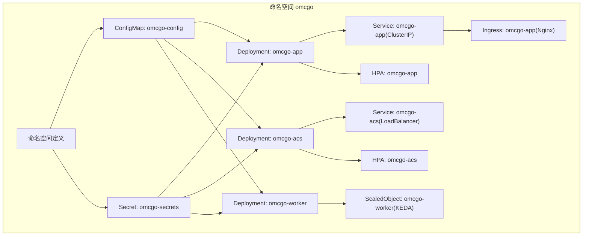
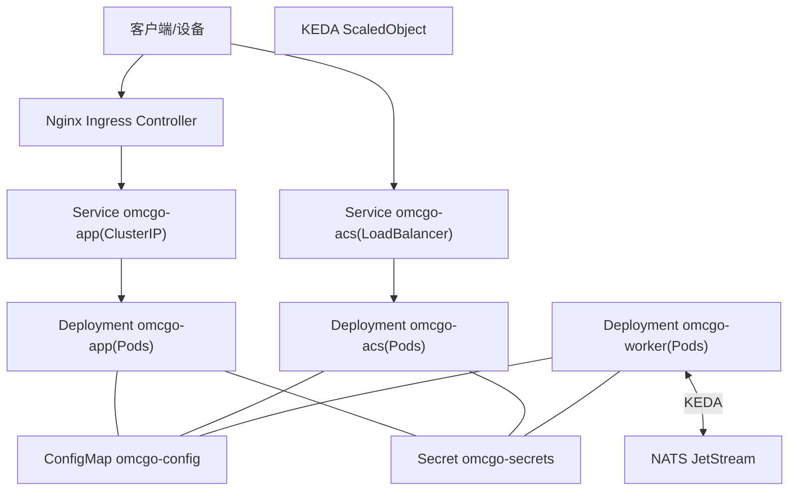
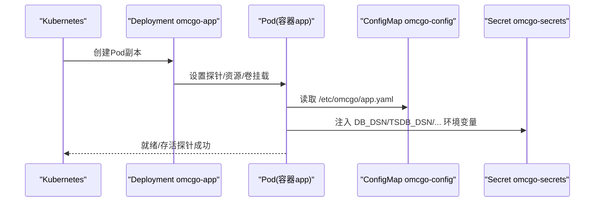
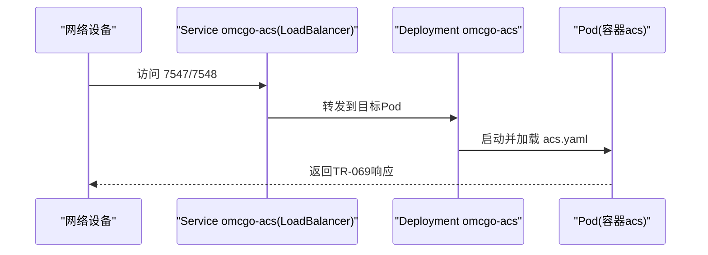
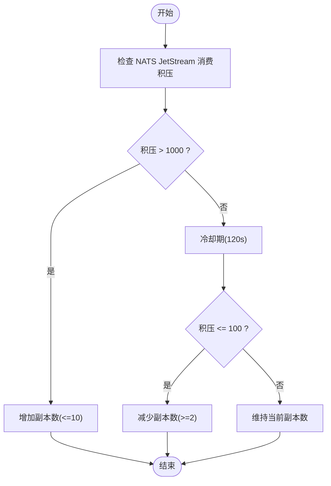
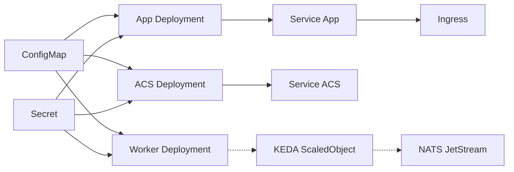

# Kubernetes配置

<cite>
**本文引用的文件**
- [omcgo/deployments/k8s/namespace.yaml](file://omcgo/deployments/k8s/namespace.yaml)
- [omcgo/deployments/k8s/configmap.yaml](file://omcgo/deployments/k8s/configmap.yaml)
- [omcgo/deployments/k8s/secret.yaml](file://omcgo/deployments/k8s/secret.yaml)
- [omcgo/deployments/k8s/app/deployment.yaml](file://omcgo/deployments/k8s/app/deployment.yaml)
- [omcgo/deployments/k8s/app/service.yaml](file://omcgo/deployments/k8s/app/service.yaml)
- [omcgo/deployments/k8s/app/ingress.yaml](file://omcgo/deployments/k8s/app/ingress.yaml)
- [omcgo/deployments/k8s/app/hpa.yaml](file://omcgo/deployments/k8s/app/hpa.yaml)
- [omcgo/deployments/k8s/acs/deployment.yaml](file://omcgo/deployments/k8s/acs/deployment.yaml)
- [omcgo/deployments/k8s/acs/service.yaml](file://omcgo/deployments/k8s/acs/service.yaml)
- [omcgo/deployments/k8s/acs/hpa.yaml](file://omcgo/deployments/k8s/acs/hpa.yaml)
- [omcgo/deployments/k8s/worker/deployment.yaml](file://omcgo/deployments/k8s/worker/deployment.yaml)
- [omcgo/deployments/k8s/worker/keda-scaledobject.yaml](file://omcgo/deployments/k8s/worker/keda-scaledobject.yaml)
- [omcgo/docs/operations/deployment-guide.md](file://omcgo/docs/operations/deployment-guide.md)
- [omcgo/deployments/docker/Dockerfile.acs](file://omcgo/deployments/docker/Dockerfile.acs)
- [omcgo/deployments/docker/Dockerfile.worker](file://omcgo/deployments/docker/Dockerfile.worker)
- [omcgo/deployments/docker/Dockerfile.web](file://omcgo/deployments/docker/Dockerfile.web)
</cite>

## 目录
1. [简介](#简介)
2. [项目结构](#项目结构)
3. [核心组件](#核心组件)
4. [架构总览](#架构总览)
5. [详细组件分析](#详细组件分析)
6. [依赖关系分析](#依赖关系分析)
7. [性能考量](#性能考量)
8. [故障排查指南](#故障排查指南)
9. [结论](#结论)
10. [附录](#附录)

## 简介
本文件面向Baicells OMC项目的Kubernetes部署，围绕命名空间隔离、资源配置、应用部署、服务发现与负载均衡、Ingress路由、HPA与KEDA自动扩缩容、ConfigMap与Secret配置管理、集群资源规划与性能调优、以及生产环境安全加固与监控配置进行系统化说明。内容基于仓库中现有的Kubernetes清单与运维文档，确保可操作性与一致性。

## 项目结构
OMC后端采用多组件分层部署：命名空间统一隔离，应用组件分为应用服务器（App）、ACS引擎（TR-069）、工作进程（Worker），并通过Service与Ingress对外暴露；数据库迁移、HPA与KEDA事件驱动扩缩容均以独立清单形式提供；前端静态资源通过Docker镜像方式构建并可由外部网关或Ingress承载。

图表来源
- [omcgo/deployments/k8s/namespace.yaml:1-7](file://omcgo/deployments/k8s/namespace.yaml#L1-L7)
- [omcgo/deployments/k8s/configmap.yaml:1-153](file://omcgo/deployments/k8s/configmap.yaml#L1-L153)
- [omcgo/deployments/k8s/secret.yaml:1-15](file://omcgo/deployments/k8s/secret.yaml#L1-L15)
- [omcgo/deployments/k8s/app/deployment.yaml:1-103](file://omcgo/deployments/k8s/app/deployment.yaml#L1-L103)
- [omcgo/deployments/k8s/app/service.yaml:1-17](file://omcgo/deployments/k8s/app/service.yaml#L1-L17)
- [omcgo/deployments/k8s/app/ingress.yaml:1-27](file://omcgo/deployments/k8s/app/ingress.yaml#L1-L27)
- [omcgo/deployments/k8s/acs/deployment.yaml:1-86](file://omcgo/deployments/k8s/acs/deployment.yaml#L1-L86)
- [omcgo/deployments/k8s/acs/service.yaml:1-21](file://omcgo/deployments/k8s/acs/service.yaml#L1-L21)
- [omcgo/deployments/k8s/acs/hpa.yaml:1-40](file://omcgo/deployments/k8s/acs/hpa.yaml#L1-L40)
- [omcgo/deployments/k8s/worker/deployment.yaml:1-93](file://omcgo/deployments/k8s/worker/deployment.yaml#L1-L93)
- [omcgo/deployments/k8s/worker/keda-scaledobject.yaml:1-22](file://omcgo/deployments/k8s/worker/keda-scaledobject.yaml#L1-L22)
- [omcgo/deployments/k8s/app/hpa.yaml:1-33](file://omcgo/deployments/k8s/app/hpa.yaml#L1-L33)

章节来源
- [omcgo/deployments/k8s/namespace.yaml:1-7](file://omcgo/deployments/k8s/namespace.yaml#L1-L7)
- [omcgo/deployments/k8s/configmap.yaml:1-153](file://omcgo/deployments/k8s/configmap.yaml#L1-L153)
- [omcgo/deployments/k8s/secret.yaml:1-15](file://omcgo/deployments/k8s/secret.yaml#L1-L15)

## 核心组件
- 命名空间：统一隔离OMC后端组件，避免资源冲突，便于权限与配额控制。
- 配置管理：通过ConfigMap集中存放应用、ACS、Worker三类配置模板，支持运行时热更新。
- 密钥管理：通过Secret存放数据库、Redis、MinIO、JWT、NATS等敏感信息，以键值形式注入容器环境变量。
- 应用部署：App、ACS、Worker分别以Deployment控制器管理，含探针、资源请求/限制、卷挂载等。
- 服务发现与负载均衡：App使用ClusterIP，ACS使用LoadBalancer；Ingress通过Nginx暴露API入口。
- 自动扩缩容：App使用HPA按CPU利用率扩缩；ACS使用HPA结合自定义指标与CPU利用率；Worker使用KEDA基于NATS JetStream消费积压触发扩缩。
- 监控与可观测：所有Pod通过注解暴露指标端点，配合Prometheus/Grafana与告警策略。

章节来源
- [omcgo/deployments/k8s/app/deployment.yaml:1-103](file://omcgo/deployments/k8s/app/deployment.yaml#L1-L103)
- [omcgo/deployments/k8s/acs/deployment.yaml:1-86](file://omcgo/deployments/k8s/acs/deployment.yaml#L1-L86)
- [omcgo/deployments/k8s/worker/deployment.yaml:1-93](file://omcgo/deployments/k8s/worker/deployment.yaml#L1-L93)
- [omcgo/deployments/k8s/app/service.yaml:1-17](file://omcgo/deployments/k8s/app/service.yaml#L1-L17)
- [omcgo/deployments/k8s/acs/service.yaml:1-21](file://omcgo/deployments/k8s/acs/service.yaml#L1-L21)
- [omcgo/deployments/k8s/app/ingress.yaml:1-27](file://omcgo/deployments/k8s/app/ingress.yaml#L1-L27)
- [omcgo/deployments/k8s/app/hpa.yaml:1-33](file://omcgo/deployments/k8s/app/hpa.yaml#L1-L33)
- [omcgo/deployments/k8s/acs/hpa.yaml:1-40](file://omcgo/deployments/k8s/acs/hpa.yaml#L1-L40)
- [omcgo/deployments/k8s/worker/keda-scaledobject.yaml:1-22](file://omcgo/deployments/k8s/worker/keda-scaledobject.yaml#L1-L22)

## 架构总览
下图展示OMC后端在Kubernetes中的整体交互：应用服务器与ACS引擎通过Service暴露，App经Ingress接入；Worker通过KEDA基于消息队列积压动态扩缩；所有组件共享ConfigMap与Secret，实现配置与密钥的统一管理。

图表来源
- [omcgo/deployments/k8s/app/ingress.yaml:1-27](file://omcgo/deployments/k8s/app/ingress.yaml#L1-L27)
- [omcgo/deployments/k8s/app/service.yaml:1-17](file://omcgo/deployments/k8s/app/service.yaml#L1-L17)
- [omcgo/deployments/k8s/acs/service.yaml:1-21](file://omcgo/deployments/k8s/acs/service.yaml#L1-L21)
- [omcgo/deployments/k8s/worker/keda-scaledobject.yaml:1-22](file://omcgo/deployments/k8s/worker/keda-scaledobject.yaml#L1-L22)
- [omcgo/deployments/k8s/configmap.yaml:1-153](file://omcgo/deployments/k8s/configmap.yaml#L1-L153)
- [omcgo/deployments/k8s/secret.yaml:1-15](file://omcgo/deployments/k8s/secret.yaml#L1-L15)

## 详细组件分析

### 命名空间与资源隔离
- 命名空间：创建名为omcgo的命名空间，并设置part-of标签，便于统一管理与识别。
- 资源归属：ConfigMap、Secret、各Deployment、Service、HPA、Ingress等均位于该命名空间内，形成强隔离边界。
- 最佳实践：建议配合ResourceQuota与LimitRange对CPU/内存进行总量与单Pod限额约束，避免资源争抢。

章节来源
- [omcgo/deployments/k8s/namespace.yaml:1-7](file://omcgo/deployments/k8s/namespace.yaml#L1-L7)

### 配置与密钥管理（ConfigMap 与 Secret）
- ConfigMap：集中存放应用、ACS、Worker三类配置模板，包含数据库DSN、Redis地址、NATS地址、MinIO桶名、JWT密钥、指标端口、日志级别等。通过卷挂载到容器路径，启动参数指向对应配置文件。
- Secret：存放数据库、TimescaleDB、Redis、MinIO、JWT、NATS等敏感信息，以键值形式注入容器环境变量，避免硬编码。
- 安全建议：定期轮换密钥；最小权限原则；仅在需要时挂载必要配置项；避免将敏感信息写入镜像或ConfigMap。

章节来源
- [omcgo/deployments/k8s/configmap.yaml:1-153](file://omcgo/deployments/k8s/configmap.yaml#L1-L153)
- [omcgo/deployments/k8s/secret.yaml:1-15](file://omcgo/deployments/k8s/secret.yaml#L1-L15)

### 应用服务器（App）部署
- 控制器与副本：Deployment，副本数为2，标签选择器匹配Pod标签。
- 探针：HTTP就绪/存活探针，访问健康检查端点，延迟与周期合理设置，避免误判。
- 资源：requests/limits分别为CPU 1核/4核、内存1Gi/4Gi，满足业务峰值需求。
- 挂载与注入：挂载ConfigMap至/etc/omcgo，读取app.yaml；从Secret注入DB_DSN、TSDB_DSN、Redis密码、MinIO凭据、JWT密钥、NATS地址。
- 指标暴露：通过注解暴露metrics端口，供Prometheus抓取。

图表来源
- [omcgo/deployments/k8s/app/deployment.yaml:1-103](file://omcgo/deployments/k8s/app/deployment.yaml#L1-L103)
- [omcgo/deployments/k8s/configmap.yaml:1-153](file://omcgo/deployments/k8s/configmap.yaml#L1-L153)
- [omcgo/deployments/k8s/secret.yaml:1-15](file://omcgo/deployments/k8s/secret.yaml#L1-L15)

章节来源
- [omcgo/deployments/k8s/app/deployment.yaml:1-103](file://omcgo/deployments/k8s/app/deployment.yaml#L1-L103)

### ACS引擎（TR-069）部署
- 控制器与副本：Deployment，副本数为2，面向设备侧提供HTTP/HTTPS端口。
- 探针与指标：就绪/存活探针访问健康端点；指标端口暴露。
- 资源：requests/limits分别为CPU 500m/2核、内存512Mi/2Gi，适配会话并发与消息处理。
- 外部暴露：Service类型为LoadBalancer，便于设备直连；同时可通过HPA按会话数与CPU利用率扩缩。

图表来源
- [omcgo/deployments/k8s/acs/deployment.yaml:1-86](file://omcgo/deployments/k8s/acs/deployment.yaml#L1-L86)
- [omcgo/deployments/k8s/acs/service.yaml:1-21](file://omcgo/deployments/k8s/acs/service.yaml#L1-L21)

章节来源
- [omcgo/deployments/k8s/acs/deployment.yaml:1-86](file://omcgo/deployments/k8s/acs/deployment.yaml#L1-L86)
- [omcgo/deployments/k8s/acs/service.yaml:1-21](file://omcgo/deployments/k8s/acs/service.yaml#L1-L21)

### 工作进程（Worker）部署
- 控制器与副本：Deployment，副本数为2，专注后台任务（如PM/MR/KPI处理）。
- 探针与指标：就绪/存活探针访问metrics端口；指标端口暴露。
- 资源：requests/limits分别为CPU 500m/2核、内存512Mi/2Gi，满足批处理场景。
- 扩缩容：通过KEDA ScaledObject基于NATS JetStream消费积压（lagThreshold）触发扩缩，范围2-10。

图表来源
- [omcgo/deployments/k8s/worker/keda-scaledobject.yaml:1-22](file://omcgo/deployments/k8s/worker/keda-scaledobject.yaml#L1-L22)

章节来源
- [omcgo/deployments/k8s/worker/deployment.yaml:1-93](file://omcgo/deployments/k8s/worker/deployment.yaml#L1-L93)
- [omcgo/deployments/k8s/worker/keda-scaledobject.yaml:1-22](file://omcgo/deployments/k8s/worker/keda-scaledobject.yaml#L1-L22)

### 服务发现与负载均衡
- App服务：ClusterIP，内部访问，配合Ingress对外暴露。
- ACS服务：LoadBalancer，直接面向设备，便于公网可达。
- 负载均衡算法：Kubernetes Service默认轮询；如需更细粒度控制，可在Ingress或上游LB层面配置。
- 端口映射：App 8080；ACS 7547/7548；Worker 指标端口9091。

章节来源
- [omcgo/deployments/k8s/app/service.yaml:1-17](file://omcgo/deployments/k8s/app/service.yaml#L1-L17)
- [omcgo/deployments/k8s/acs/service.yaml:1-21](file://omcgo/deployments/k8s/acs/service.yaml#L1-L21)

### Ingress路由配置
- IngressClass：nginx，使用Nginx Ingress Controller。
- 主机与路径：host为api.omc.example.com，根路径“/”转发至Service omcgo-app:8080。
- TLS：引用omcgo-tls Secret，实现HTTPS终止。
- 超时与缓冲：设置代理体大小与读写超时，适配大文件上传/下载。
- 建议：结合cert-manager自动签发证书；在生产环境启用WAF与速率限制。

章节来源
- [omcgo/deployments/k8s/app/ingress.yaml:1-27](file://omcgo/deployments/k8s/app/ingress.yaml#L1-L27)

### 水平Pod自动扩缩容（HPA）
- App（HPA）：基于CPU利用率（平均使用率70%），副本范围2-5；具备缩放稳定窗口与步进策略，避免频繁抖动。
- ACS（HPA）：复合指标，包含自定义“acs_active_sessions”平均值目标（每实例2000会话）与CPU利用率，副本范围2-20；针对高并发场景优化。
- 行为策略：明确缩放窗口与步长，兼顾快速响应与稳定性。

章节来源
- [omcgo/deployments/k8s/app/hpa.yaml:1-33](file://omcgo/deployments/k8s/app/hpa.yaml#L1-L33)
- [omcgo/deployments/k8s/acs/hpa.yaml:1-40](file://omcgo/deployments/k8s/acs/hpa.yaml#L1-L40)

### 事件驱动扩缩容（KEDA）
- 触发器：nats-jetstream，监控指定账户、流与消费者，以消费积压作为扩缩依据。
- 阈值：lagThreshold=1000，activationLagThreshold=100，避免轻微积压导致频繁扩缩。
- 副本范围：minReplicaCount=2，maxReplicaCount=10，结合业务峰值设定上限。
- 适用场景：Worker处理异步任务，消息积压明显时自动扩容，空闲时回收资源。

章节来源
- [omcgo/deployments/k8s/worker/keda-scaledobject.yaml:1-22](file://omcgo/deployments/k8s/worker/keda-scaledobject.yaml#L1-L22)

### 镜像与构建
- ACS镜像：基于Alpine，包含证书与时区；暴露7547/7548/9090端口；入口命令加载prod配置。
- Worker镜像：同上，暴露9092端口；入口命令加载prod配置。
- Web镜像：前端构建产物复制至Nginx，暴露80端口，可作为静态站点或反向代理基础。

章节来源
- [omcgo/deployments/docker/Dockerfile.acs:1-29](file://omcgo/deployments/docker/Dockerfile.acs#L1-L29)
- [omcgo/deployments/docker/Dockerfile.worker:1-29](file://omcgo/deployments/docker/Dockerfile.worker#L1-L29)
- [omcgo/deployments/docker/Dockerfile.web:1-12](file://omcgo/deployments/docker/Dockerfile.web#L1-L12)

## 依赖关系分析
- 组件耦合：App与ACS均依赖ConfigMap与Secret；Worker通过KEDA与NATS耦合；Ingress依赖Nginx Ingress Controller与TLS Secret。
- 外部依赖：PostgreSQL/TimescaleDB、Redis、NATS、MinIO；这些服务需在集群内或外提供稳定可达的服务名与端口。
- 循环依赖：当前清单未见循环依赖；建议在扩展时保持“配置/密钥→应用”的单向依赖。

图表来源
- [omcgo/deployments/k8s/configmap.yaml:1-153](file://omcgo/deployments/k8s/configmap.yaml#L1-L153)
- [omcgo/deployments/k8s/secret.yaml:1-15](file://omcgo/deployments/k8s/secret.yaml#L1-L15)
- [omcgo/deployments/k8s/app/deployment.yaml:1-103](file://omcgo/deployments/k8s/app/deployment.yaml#L1-L103)
- [omcgo/deployments/k8s/acs/deployment.yaml:1-86](file://omcgo/deployments/k8s/acs/deployment.yaml#L1-L86)
- [omcgo/deployments/k8s/worker/deployment.yaml:1-93](file://omcgo/deployments/k8s/worker/deployment.yaml#L1-L93)
- [omcgo/deployments/k8s/app/service.yaml:1-17](file://omcgo/deployments/k8s/app/service.yaml#L1-L17)
- [omcgo/deployments/k8s/acs/service.yaml:1-21](file://omcgo/deployments/k8s/acs/service.yaml#L1-L21)
- [omcgo/deployments/k8s/app/ingress.yaml:1-27](file://omcgo/deployments/k8s/app/ingress.yaml#L1-L27)
- [omcgo/deployments/k8s/worker/keda-scaledobject.yaml:1-22](file://omcgo/deployments/k8s/worker/keda-scaledobject.yaml#L1-L22)

## 性能考量
- 资源规划：参考容量规划表，按设备规模估算所需副本数；优先保证数据库连接池、Redis内存与NATS队列深度不成为瓶颈。
- 探针与健康检查：合理设置初始延迟与探测周期，避免探针风暴；对慢启动服务适当延长超时。
- 指标采集：开启指标端口并纳入Prometheus抓取；结合Grafana仪表盘监控关键指标。
- 网络与I/O：Ingress超时与缓冲参数已针对大文件场景优化；建议对数据库与对象存储进行网络隔离与带宽保障。
- 扩缩容策略：HPA与KEDA阈值应结合历史流量与SLA设定，避免过度扩缩造成抖动。

章节来源
- [omcgo/docs/operations/deployment-guide.md:128-169](file://omcgo/docs/operations/deployment-guide.md#L128-L169)

## 故障排查指南
- ACS无法接收Informs
  - 检查ACS Service外部IP是否分配；确认设备可达性；查看ACS日志；验证Redis会话存储连通性。
- 高延迟
  - 检查数据库连接池使用率；监控NATS队列深度；审查Redis内存与淘汰策略；根据会话数扩容ACS。
- Worker不处理任务
  - 使用NATS CLI检查消费者状态；查看Worker日志；确认NATS连接与JetStream可用性。
- 健康检查失败
  - 查看探针返回码与超时；确认容器内健康端点可达；检查资源限制是否过低导致OOM/频繁重启。

章节来源
- [omcgo/docs/operations/deployment-guide.md:186-207](file://omcgo/docs/operations/deployment-guide.md#L186-L207)

## 结论
本部署方案通过命名空间隔离、ConfigMap/Secret统一配置与密钥管理、HPA与KEDA双通道扩缩容、以及Ingress统一入口，实现了OMC后端在Kubernetes上的可运维、可扩展与可观测。建议在生产环境中进一步完善证书自动化、网络策略、RBAC与审计日志，并持续优化扩缩容阈值与资源配额以匹配实际业务峰值。

## 附录
- 部署步骤概览
  - 创建命名空间与密钥；应用ConfigMap；执行数据库迁移；依次部署ACS、App、Worker；验证健康与指标。
- TLS配置
  - ACS设备端TLS与API入口TLS分别处理；建议使用cert-manager自动签发与续期。
- 监控与告警
  - 指标端点已标注；导入Grafana仪表盘；建立关键告警规则，覆盖会话负载、错误率、队列积压与连接池使用率。

章节来源
- [omcgo/docs/operations/deployment-guide.md:34-107](file://omcgo/docs/operations/deployment-guide.md#L34-L107)