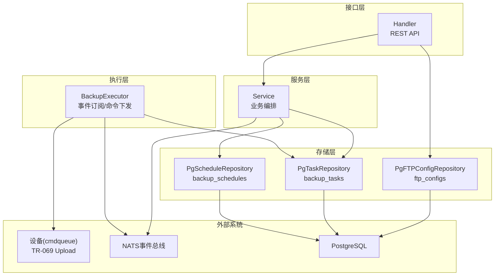
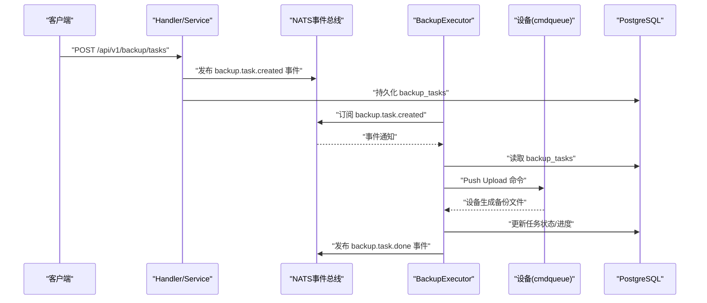
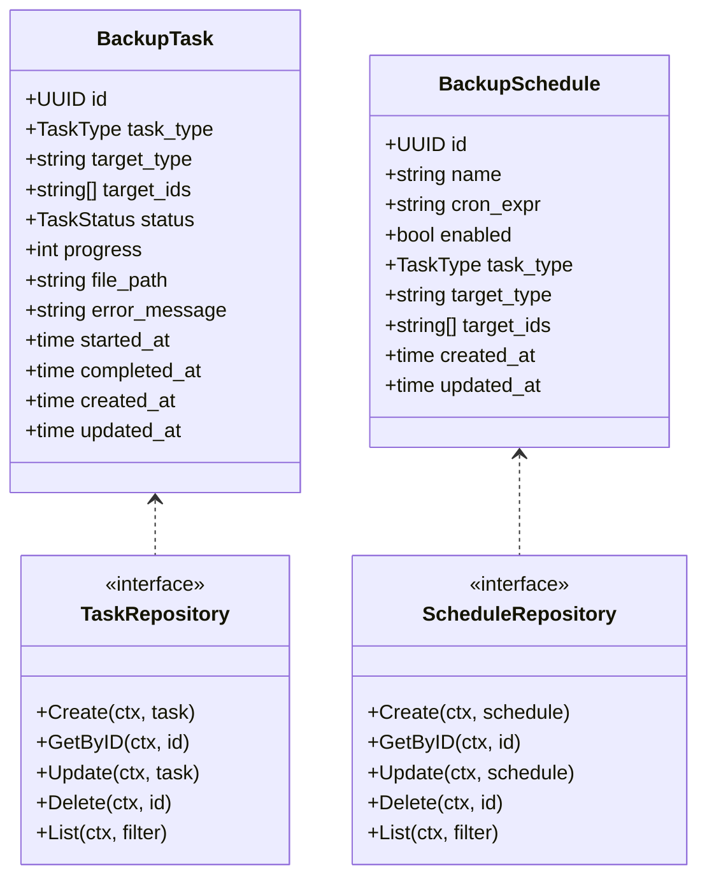
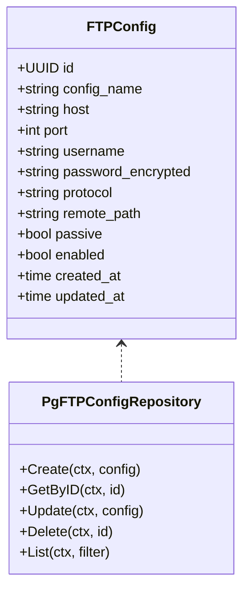
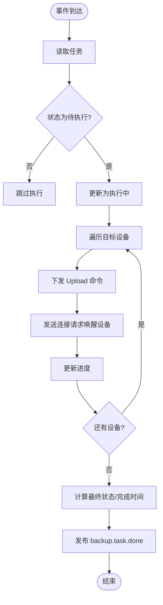
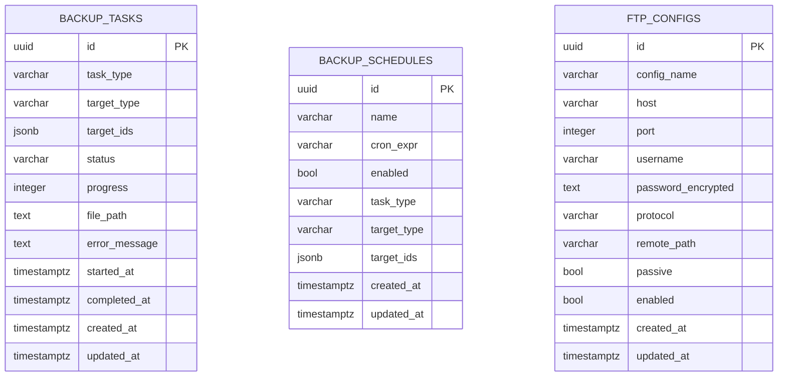
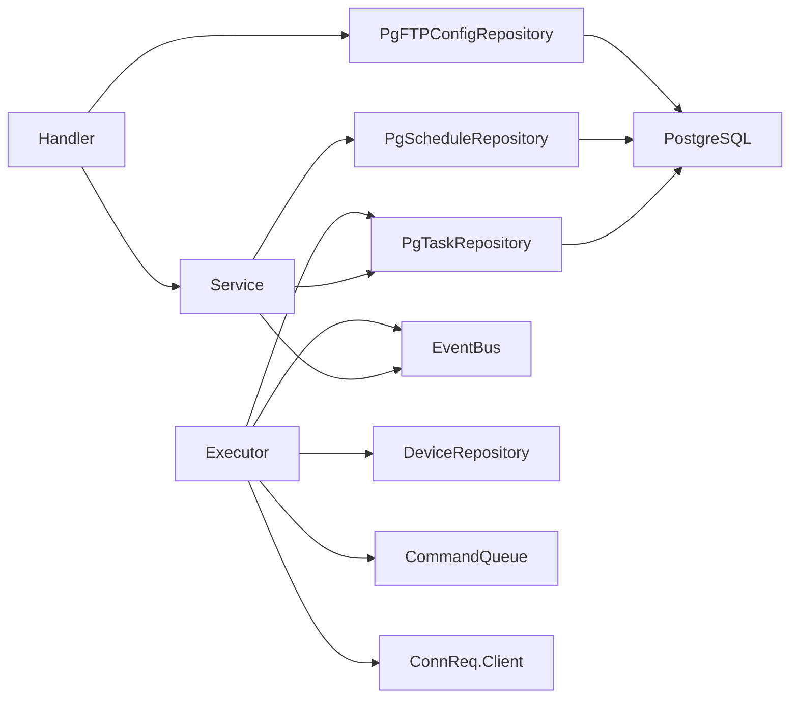

# 备份恢复

<cite>
**本文引用的文件**
- [omcgo/internal/backup/handler.go](file://omcgo/internal/backup/handler.go)
- [omcgo/internal/backup/service.go](file://omcgo/internal/backup/service.go)
- [omcgo/internal/backup/repository.go](file://omcgo/internal/backup/repository.go)
- [omcgo/internal/backup/model.go](file://omcgo/internal/backup/model.go)
- [omcgo/internal/backup/executor.go](file://omcgo/internal/backup/executor.go)
- [omcgo/internal/backup/ftp_model.go](file://omcgo/internal/backup/ftp_model.go)
- [omcgo/internal/backup/pg_repository.go](file://omcgo/internal/backup/pg_repository.go)
- [omcgo/internal/backup/ftp_pg_repository.go](file://omcgo/internal/backup/ftp_pg_repository.go)
- [omcgo/migrations/000022_create_backup_tables.up.sql](file://omcgo/migrations/000022_create_backup_tables.up.sql)
- [omcgo/migrations/000028_create_ftp_configs.up.sql](file://omcgo/migrations/000028_create_ftp_configs.up.sql)
- [omcgo/cmd/worker/etc/config.dev.yaml](file://omcgo/cmd/worker/etc/config.dev.yaml)
- [omcgo/docs/design/database-migration.md](file://omcgo/docs/design/database-migration.md)
- [omcmb/design/04-modules/06-backup-restore/01-backup-overview.md](file://omcmb/design/04-modules/06-backup-restore/01-backup-overview.md)
- [omcmb/design/04-modules/06-backup-restore/02-create-backup-task.md](file://omcmb/design/04-modules/06-backup-restore/02-create-backup-task.md)
- [omcmb/design/04-modules/06-backup-restore/04-ftp-config.md](file://omcmb/design/04-modules/06-backup-restore/04-ftp-config.md)
</cite>

## 目录
1. [简介](#简介)
2. [项目结构](#项目结构)
3. [核心组件](#核心组件)
4. [架构总览](#架构总览)
5. [详细组件分析](#详细组件分析)
6. [依赖分析](#依赖分析)
7. [性能考虑](#性能考虑)
8. [故障排查指南](#故障排查指南)
9. [结论](#结论)
10. [附录](#附录)

## 简介
本文件面向 Baicells OMC 项目的备份与恢复策略，结合代码库中的备份模块实现与前端设计文档，系统化阐述数据库与配置备份方案、FTP 自动备份配置、恢复流程、验证与完整性检查、灾难恢复计划、自动化实现（定时任务、监控与告警）、备份数据加密与访问控制，以及测试验证流程与最佳实践。需要特别说明的是：当前代码库实现聚焦于“设备配置备份”（通过 TR-069 Upload 命令触发设备侧备份文件生成），并未包含数据库的 PostgreSQL 逻辑/物理/增量备份实现。因此，本文将严格区分“设备配置备份”与“数据库备份”，并在相应章节明确标注。

## 项目结构
备份相关能力主要分布在以下层次：
- 接口层：REST API 路由与请求/响应定义
- 服务层：业务编排与事件发布
- 执行层：事件订阅与设备命令下发
- 存储层：PostgreSQL 表结构与仓库实现
- 前端设计：备份任务创建、FTP 配置与界面交互
- 运维文档：数据库迁移与部署流程

图表来源
- [omcgo/internal/backup/handler.go:30-53](file://omcgo/internal/backup/handler.go#L30-L53)
- [omcgo/internal/backup/service.go:15-31](file://omcgo/internal/backup/service.go#L15-L31)
- [omcgo/internal/backup/executor.go:18-46](file://omcgo/internal/backup/executor.go#L18-L46)
- [omcgo/internal/backup/pg_repository.go:32-46](file://omcgo/internal/backup/pg_repository.go#L32-L46)
- [omcgo/internal/backup/ftp_pg_repository.go:24-38](file://omcgo/internal/backup/ftp_pg_repository.go#L24-L38)

章节来源
- [omcgo/internal/backup/handler.go:30-53](file://omcgo/internal/backup/handler.go#L30-L53)
- [omcgo/internal/backup/service.go:15-31](file://omcgo/internal/backup/service.go#L15-L31)
- [omcgo/internal/backup/executor.go:18-46](file://omcgo/internal/backup/executor.go#L18-L46)
- [omcgo/internal/backup/pg_repository.go:32-46](file://omcgo/internal/backup/pg_repository.go#L32-L46)
- [omcgo/internal/backup/ftp_pg_repository.go:24-38](file://omcgo/internal/backup/ftp_pg_repository.go#L24-L38)

## 核心组件
- 备份任务模型与状态机：定义任务类型（全量/增量/配置仅）、目标类型、状态（待执行/执行中/已完成/失败/已取消）与进度。
- 备份调度模型：基于 Cron 表达式的周期任务，支持启用/禁用。
- FTP 配置模型：主机、端口、协议（FTP/SFTP）、远程路径、被动模式、启用状态与加密密码字段。
- Handler：注册 REST 路由，提供任务/调度/FTP 配置的 CRUD 与测试连接。
- Service：创建任务并发布事件，创建/更新/删除/查询调度。
- Executor：订阅事件，拉取任务，遍历目标设备，下发 TR-069 Upload 命令，更新任务状态并发布完成事件。
- 仓库实现：PostgreSQL 读写 backup_tasks、backup_schedules、ftp_configs 表，含索引与触发器。

章节来源
- [omcgo/internal/backup/model.go:10-71](file://omcgo/internal/backup/model.go#L10-L71)
- [omcgo/internal/backup/handler.go:30-53](file://omcgo/internal/backup/handler.go#L30-L53)
- [omcgo/internal/backup/service.go:33-159](file://omcgo/internal/backup/service.go#L33-L159)
- [omcgo/internal/backup/executor.go:18-178](file://omcgo/internal/backup/executor.go#L18-L178)
- [omcgo/internal/backup/pg_repository.go:32-461](file://omcgo/internal/backup/pg_repository.go#L32-L461)
- [omcgo/internal/backup/ftp_model.go:10-31](file://omcgo/internal/backup/ftp_model.go#L10-L31)

## 架构总览
备份流程以事件驱动为核心：创建备份任务后，服务层发布事件；执行器订阅事件并拉取任务，逐台设备下发 TR-069 Upload 命令，设备侧生成配置备份文件；完成后更新任务状态并发布完成事件。FTP 配置用于备份文件的远端传输（当前接口预留，具体传输逻辑未在代码中实现）。

图表来源
- [omcgo/internal/backup/service.go:33-63](file://omcgo/internal/backup/service.go#L33-L63)
- [omcgo/internal/backup/executor.go:48-178](file://omcgo/internal/backup/executor.go#L48-L178)
- [omcgo/internal/backup/pg_repository.go:48-117](file://omcgo/internal/backup/pg_repository.go#L48-L117)

章节来源
- [omcgo/internal/backup/service.go:33-63](file://omcgo/internal/backup/service.go#L33-L63)
- [omcgo/internal/backup/executor.go:48-178](file://omcgo/internal/backup/executor.go#L48-L178)
- [omcgo/internal/backup/pg_repository.go:48-117](file://omcgo/internal/backup/pg_repository.go#L48-L117)

## 详细组件分析

### 任务与调度模型
- 任务类型：全量、增量、配置仅
- 任务状态：待执行、执行中、已完成、失败、已取消
- 调度：名称、Cron 表达式、启用状态、任务类型、目标类型与目标集合

图表来源
- [omcgo/internal/backup/model.go:30-71](file://omcgo/internal/backup/model.go#L30-L71)
- [omcgo/internal/backup/repository.go:10-27](file://omcgo/internal/backup/repository.go#L10-L27)

章节来源
- [omcgo/internal/backup/model.go:10-71](file://omcgo/internal/backup/model.go#L10-L71)
- [omcgo/internal/backup/repository.go:10-27](file://omcgo/internal/backup/repository.go#L10-L27)

### FTP 配置模型与接口
- FTP 配置字段：名称、主机、端口、用户名、加密密码、协议（FTP/SFTP）、远程路径、被动模式、启用状态
- Handler 提供 FTP 配置的增删改查与测试连接接口（测试连接当前返回占位消息）

图表来源
- [omcgo/internal/backup/ftp_model.go:10-31](file://omcgo/internal/backup/ftp_model.go#L10-L31)
- [omcgo/internal/backup/ftp_pg_repository.go:24-38](file://omcgo/internal/backup/ftp_pg_repository.go#L24-L38)

章节来源
- [omcgo/internal/backup/ftp_model.go:10-31](file://omcgo/internal/backup/ftp_model.go#L10-L31)
- [omcgo/internal/backup/ftp_pg_repository.go:24-38](file://omcgo/internal/backup/ftp_pg_repository.go#L24-L38)
- [omcgo/internal/backup/handler.go:450-468](file://omcgo/internal/backup/handler.go#L450-L468)

### Handler 与路由
- 任务：列出、创建、获取、删除、取消
- 调度：列出、创建、更新、删除
- FTP 配置：列出、创建、更新、删除、测试连接

章节来源
- [omcgo/internal/backup/handler.go:30-53](file://omcgo/internal/backup/handler.go#L30-L53)
- [omcgo/internal/backup/handler.go:88-187](file://omcgo/internal/backup/handler.go#L88-L187)
- [omcgo/internal/backup/handler.go:191-292](file://omcgo/internal/backup/handler.go#L191-L292)
- [omcgo/internal/backup/handler.go:324-468](file://omcgo/internal/backup/handler.go#L324-L468)

### Service 业务编排
- 创建任务：设置初始状态与进度，持久化后发布事件
- 取消任务：仅允许待执行/执行中任务取消
- 调度管理：创建/更新/删除/查询

章节来源
- [omcgo/internal/backup/service.go:33-159](file://omcgo/internal/backup/service.go#L33-L159)

### Executor 事件执行
- 订阅 backup.task.created 事件
- 校验任务状态，更新为执行中
- 遍历目标设备，下发 Upload 命令并唤醒设备
- 更新任务进度与状态，发布 backup.task.done

图表来源
- [omcgo/internal/backup/executor.go:67-178](file://omcgo/internal/backup/executor.go#L67-L178)

章节来源
- [omcgo/internal/backup/executor.go:48-178](file://omcgo/internal/backup/executor.go#L48-L178)

### 数据模型与表结构
- backup_tasks：任务主表，含 JSONB 存储目标集合，带状态/类型/时间索引
- backup_schedules：调度表，含启用状态索引
- ftp_configs：FTP 配置表，含启用状态索引与更新时间触发器

图表来源
- [omcgo/migrations/000022_create_backup_tables.up.sql:1-41](file://omcgo/migrations/000022_create_backup_tables.up.sql#L1-L41)
- [omcgo/migrations/000028_create_ftp_configs.up.sql:1-19](file://omcgo/migrations/000028_create_ftp_configs.up.sql#L1-L19)

章节来源
- [omcgo/migrations/000022_create_backup_tables.up.sql:1-41](file://omcgo/migrations/000022_create_backup_tables.up.sql#L1-L41)
- [omcgo/migrations/000028_create_ftp_configs.up.sql:1-19](file://omcgo/migrations/000028_create_ftp_configs.up.sql#L1-L19)

## 依赖分析
- Handler 依赖 Service 与 FTP 仓库
- Service 依赖 Task/Schedule 仓库与事件总线
- Executor 依赖 Task 仓库、设备仓库、命令队列、连接请求客户端与事件总线
- 仓库实现依赖 PostgreSQL 连接池与 SQL 构建库
- 前端设计文档定义了备份任务创建、FTP 配置与界面交互

图表来源
- [omcgo/internal/backup/handler.go:14-28](file://omcgo/internal/backup/handler.go#L14-L28)
- [omcgo/internal/backup/service.go:15-31](file://omcgo/internal/backup/service.go#L15-L31)
- [omcgo/internal/backup/executor.go:18-46](file://omcgo/internal/backup/executor.go#L18-L46)
- [omcgo/internal/backup/pg_repository.go:32-46](file://omcgo/internal/backup/pg_repository.go#L32-L46)
- [omcgo/internal/backup/ftp_pg_repository.go:24-38](file://omcgo/internal/backup/ftp_pg_repository.go#L24-L38)

章节来源
- [omcgo/internal/backup/handler.go:14-28](file://omcgo/internal/backup/handler.go#L14-L28)
- [omcgo/internal/backup/service.go:15-31](file://omcgo/internal/backup/service.go#L15-L31)
- [omcgo/internal/backup/executor.go:18-46](file://omcgo/internal/backup/executor.go#L18-L46)
- [omcgo/internal/backup/pg_repository.go:32-46](file://omcgo/internal/backup/pg_repository.go#L32-L46)
- [omcgo/internal/backup/ftp_pg_repository.go:24-38](file://omcgo/internal/backup/ftp_pg_repository.go#L24-L38)

## 性能考虑
- 数据库层面：backup_tasks 与 backup_schedules 表建立多字段索引，提升查询与过滤效率；使用 JSONB 存储目标集合，便于灵活扩展。
- 事件驱动：通过 NATS 异步解耦任务创建与执行，避免阻塞 API 响应。
- 任务并发：Executor 逐设备下发命令，建议根据设备规模与网络状况合理设置并发与重试策略。
- 存储与传输：FTP 配置支持被动模式与协议选择，建议优先使用加密协议以降低传输风险。

[本节为通用性能讨论，不直接分析具体文件]

## 故障排查指南
- 任务状态异常
  - 仅待执行/执行中任务可取消；若状态非预期，需检查事件是否正确发布与消费。
- 设备未响应
  - 检查命令队列是否成功推送 Upload 命令；确认设备连接请求 URL 可用。
- FTP 配置测试
  - 当前测试连接接口返回占位消息，建议在后续版本中实现实际连接测试与错误码返回。
- 数据库一致性
  - 使用迁移文档提供的回滚与版本查看能力进行诊断与修复。

章节来源
- [omcgo/internal/backup/service.go:70-91](file://omcgo/internal/backup/service.go#L70-L91)
- [omcgo/internal/backup/executor.go:114-137](file://omcgo/internal/backup/executor.go#L114-L137)
- [omcgo/internal/backup/handler.go:450-468](file://omcgo/internal/backup/handler.go#L450-L468)
- [omcgo/docs/design/database-migration.md:167-174](file://omcgo/docs/design/database-migration.md#L167-L174)

## 结论
当前代码库实现了以事件驱动为核心的“设备配置备份”能力，覆盖任务生命周期管理、调度与 FTP 配置管理，并通过 TR-069 Upload 命令触发设备侧备份文件生成。对于数据库层面的 PostgreSQL 逻辑/物理/增量备份策略，代码库未提供直接实现，需另行规划与落地。建议在现有基础上补充数据库备份方案、传输加密与完整性校验、灾难恢复演练与自动化监控告警，以形成完整的备份恢复体系。

[本节为总结性内容，不直接分析具体文件]

## 附录

### 备份恢复策略（面向设备配置）
- 备份类型
  - 全量：完整配置导出
  - 增量：差异配置导出（如适用）
  - 配置仅：仅备份配置文件，不包含其他数据
- 备份频率
  - 周期备份：基于 Cron 表达式配置（日/周/月）
  - 手动备份：即时触发
- 存储位置
  - 设备侧：由设备生成并存储
  - 远端传输：通过 FTP/SFTP 配置上传至远端（当前接口预留）
- 传输安全
  - 建议使用 SFTP 协议，避免明文传输
  - 密码字段加密存储
- 恢复流程
  - 从备份文件恢复到设备（通过 TR-069 Upload 命令触发）
  - 支持出厂恢复与指定备份恢复
- 验证与完整性
  - 任务完成后检查任务状态与进度
  - 建议增加备份文件校验与完整性检查（当前未实现）
- 自动化
  - 通过调度任务实现周期备份
  - 事件驱动执行，减少人工干预
- 加密与访问控制
  - 密码加密存储
  - FTP 配置启用状态与最小权限原则
- 测试与最佳实践
  - 前端设计文档提供了备份任务创建与 FTP 配置界面规范
  - 建议定期进行备份恢复演练，验证任务与设备交互

章节来源
- [omcgo/internal/backup/model.go:21-28](file://omcgo/internal/backup/model.go#L21-L28)
- [omcgo/internal/backup/handler.go:216-242](file://omcgo/internal/backup/handler.go#L216-L242)
- [omcgo/internal/backup/handler.go:324-384](file://omcgo/internal/backup/handler.go#L324-L384)
- [omcgo/internal/backup/handler.go:450-468](file://omcgo/internal/backup/handler.go#L450-L468)
- [omcgo/internal/backup/executor.go:114-137](file://omcgo/internal/backup/executor.go#L114-L137)
- [omcmb/design/04-modules/06-backup-restore/01-backup-overview.md:138-155](file://omcmb/design/04-modules/06-backup-restore/01-backup-overview.md#L138-L155)
- [omcmb/design/04-modules/06-backup-restore/02-create-backup-task.md:110-121](file://omcmb/design/04-modules/06-backup-restore/02-create-backup-task.md#L110-L121)
- [omcmb/design/04-modules/06-backup-restore/04-ftp-config.md:155-199](file://omcmb/design/04-modules/06-backup-restore/04-ftp-config.md#L155-L199)

### 数据库备份方案（当前未实现，建议）
- 逻辑备份（pg_dump）
  - 全库/按模式/按表导出
  - 压缩与并行度优化
- 物理备份（基础备份）
  - 基于文件系统快照或复制
  - 需配合 WAL 归档
- 增量备份
  - 基于时间点或 LSN 的增量归档
- 备份保留与轮转
  - 基于时间/数量的清理策略
- 传输与加密
  - 远程传输加密（SFTP/HTTPS）
  - 本地加密存储
- 验证与完整性
  - 校验和/哈希值
  - 定期恢复演练
- 自动化与监控
  - 定时任务与失败告警
  - 备份链路监控与健康检查
- 灾难恢复
  - RTO/RPO 目标设定
  - 多地容灾与故障切换
  - 业务连续性保障

[本节为概念性建议，不直接分析具体文件]