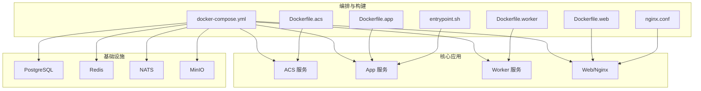
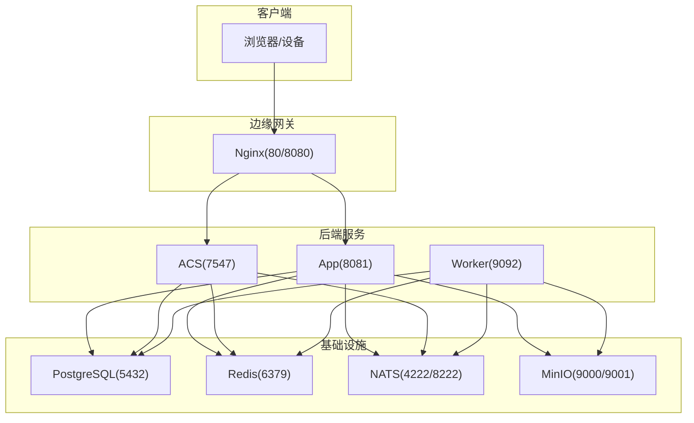
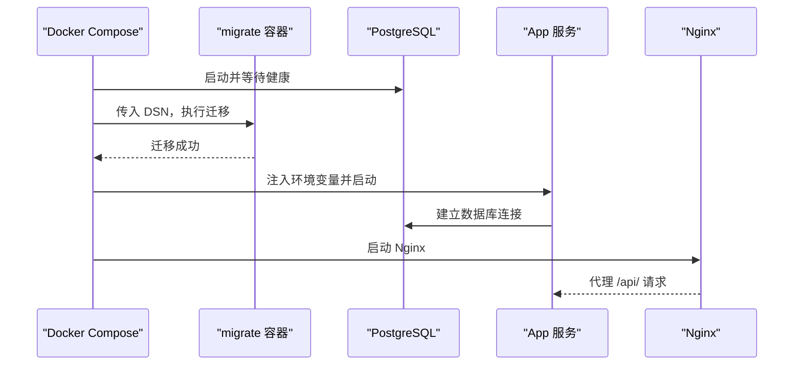
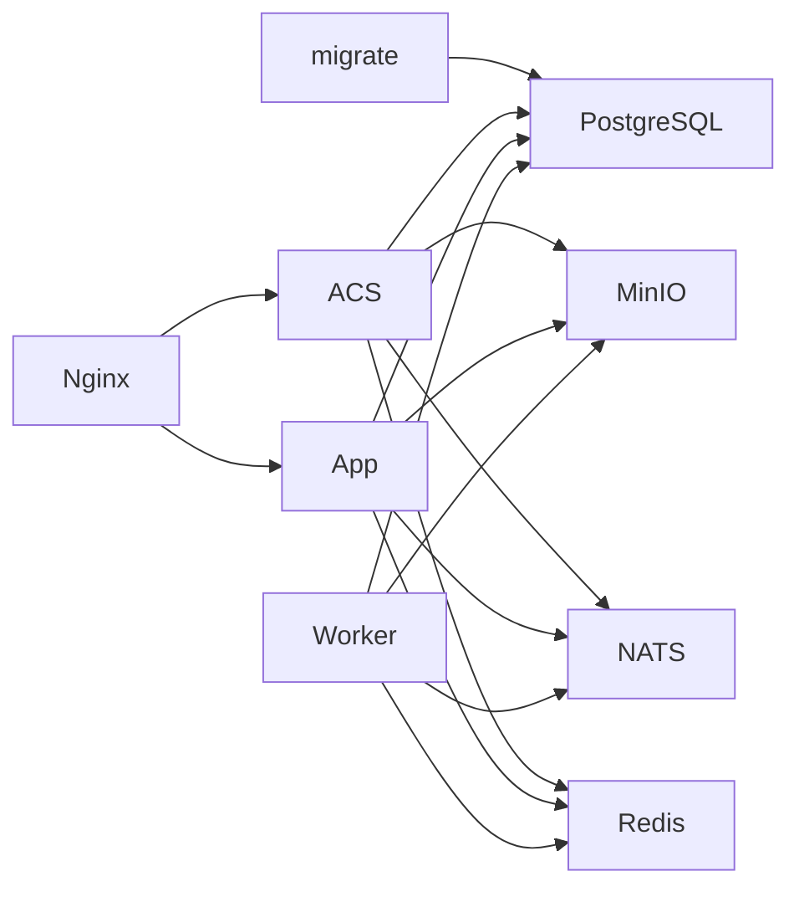

# 容器化部署

<cite>
**本文引用的文件**
- [docker-compose.yml](file://omcgo/deployments/docker/docker-compose.yml)
- [Dockerfile.acs](file://omcgo/deployments/docker/Dockerfile.acs)
- [Dockerfile.web](file://omcgo/deployments/docker/Dockerfile.web)
- [Dockerfile.worker](file://omcgo/deployments/docker/Dockerfile.worker)
- [entrypoint.sh](file://omcgo/deployments/docker/entrypoint.sh)
- [nginx.conf](file://omcgo/deployments/docker/nginx.conf)
- [acs 生产配置](file://omcgo/cmd/acs/etc/config.prod.yaml)
- [app 生产配置](file://omcgo/cmd/app/etc/config.prod.yaml)
- [worker 生产配置](file://omcgo/cmd/worker/etc/config.prod.yaml)
</cite>

## 目录
1. [简介](#简介)
2. [项目结构](#项目结构)
3. [核心组件](#核心组件)
4. [架构总览](#架构总览)
5. [详细组件分析](#详细组件分析)
6. [依赖关系分析](#依赖关系分析)
7. [性能考虑](#性能考虑)
8. [故障排查指南](#故障排查指南)
9. [结论](#结论)
10. [附录](#附录)

## 简介
本文件面向 Baicells OMC 项目的容器化部署，聚焦于 Docker Compose 编排配置与三类核心应用容器（ACS 服务、App 服务、Worker 服务）的构建与运行参数，并覆盖基础设施服务（PostgreSQL、Redis、NATS、MinIO）的容器配置与数据持久化策略。同时提供日志管理方案、最佳实践建议以及常见部署问题的排查思路。

## 项目结构
- 部署层位于 deployments/docker，包含编排文件、镜像构建文件与前端 Nginx 配置。
- 核心应用配置位于 cmd/*/etc 下的生产配置文件，用于控制各服务的运行参数与外部依赖连接。
- Web 前端代码位于 omcmb/webcode，通过 Nginx 在容器内提供静态资源与 API 网关能力。

图表来源
- [docker-compose.yml:19-194](file://omcgo/deployments/docker/docker-compose.yml#L19-L194)
- [Dockerfile.acs:1-29](file://omcgo/deployments/docker/Dockerfile.acs#L1-L29)
- [Dockerfile.web:1-12](file://omcgo/deployments/docker/Dockerfile.web#L1-L12)
- [Dockerfile.worker:1-29](file://omcgo/deployments/docker/Dockerfile.worker#L1-L29)
- [nginx.conf:1-58](file://omcgo/deployments/docker/nginx.conf#L1-L58)
- [entrypoint.sh:1-6](file://omcgo/deployments/docker/entrypoint.sh#L1-L6)

章节来源
- [docker-compose.yml:1-194](file://omcgo/deployments/docker/docker-compose.yml#L1-L194)

## 核心组件
- 应用容器
  - ACS 服务：监听 7547/TCP（TR-069），暴露 9090/Metrics。
  - App 服务：监听 8081/TCP，暴露 9091/Metrics，提供 REST API 与 gRPC 端口。
  - Worker 服务：监听 9092/Metrics，执行后台任务。
- 基础设施容器
  - PostgreSQL：端口映射 5432，持久化卷 pgdata。
  - Redis：端口映射 6379，持久化卷 redisdata。
  - NATS：端口映射 4222/8222，持久化卷 natsdata。
  - MinIO：端口映射 9000/9001，持久化卷 miniodata。
- 网关与前端
  - Nginx：端口 80/8080，代理 /api/ 到 App，代理 TR-069 到 ACS；提供静态前端资源。

章节来源
- [docker-compose.yml:19-194](file://omcgo/deployments/docker/docker-compose.yml#L19-L194)
- [nginx.conf:1-58](file://omcgo/deployments/docker/nginx.conf#L1-L58)

## 架构总览
下图展示容器间依赖与通信路径，突出数据库、缓存、消息队列与对象存储的连接关系，以及网关如何统一接入 API 与 TR-069 流量。

图表来源
- [docker-compose.yml:19-194](file://omcgo/deployments/docker/docker-compose.yml#L19-L194)
- [nginx.conf:1-58](file://omcgo/deployments/docker/nginx.conf#L1-L58)

## 详细组件分析

### Docker Compose 编排配置
- 日志与卷
  - 主机侧挂载 /data/logs/omcgo，容器内日志输出至 /var/log/omcgo/*.log，便于宿主机查看与轮转。
  - 数据持久化卷：pgdata、redisdata、natsdata、miniodata。
- 健康检查
  - PostgreSQL：使用 pg_isready 检查。
  - Redis：redis-cli ping。
  - NATS：访问 /healthz。
  - MinIO：访问 /minio/health/live。
- 启动顺序
  - migrate 依赖 postgres 健康后执行。
  - 三大应用在 migrate 成功后启动，并等待 redis/nats 健康。
- 网关与前端
  - Nginx 依赖 app 与 acs 启动。

章节来源
- [docker-compose.yml:1-194](file://omcgo/deployments/docker/docker-compose.yml#L1-L194)

### ACS 服务容器（Dockerfile.acs）
- 多阶段构建：Go 构建产物复制至精简 alpine 镜像。
- 配置与端口
  - 默认暴露 7547/7548（TR-069）、9090（Metrics）。
  - 通过 /etc/omcgo/acs.yaml 加载生产配置。
- 环境变量
  - OMCGO_SERVER_HOST/PORT、OMCGO_METRICS_PORT、OMCGO_LOG_* 等由 compose 注入。
  - 外部依赖地址：OMCGO_DB_DSN、OMCGO_REDIS_ADDRS、OMCGO_NATS_URL。

章节来源
- [Dockerfile.acs:1-29](file://omcgo/deployments/docker/Dockerfile.acs#L1-L29)
- [acs 生产配置:1-70](file://omcgo/cmd/acs/etc/config.prod.yaml#L1-L70)
- [docker-compose.yml:92-117](file://omcgo/deployments/docker/docker-compose.yml#L92-L117)

### App 服务容器（Dockerfile.app）
- 多阶段构建：Go 构建产物复制至精简 alpine 镜像。
- 配置与端口
  - 默认暴露 8081（REST）、9091（Metrics）、8444（TLS）、50051（gRPC）。
  - 通过 /etc/omcgo/app.yaml 加载生产配置。
- 环境变量
  - OMCGO_SERVER_HOST/PORT、OMCGO_TSDB_DSN、OMCGO_METRICS_PORT、OMCGO_LOG_* 等由 compose 注入。
  - 外部依赖地址：OMCGO_DB_DSN、OMCGO_TSDB_DSN、OMCGO_REDIS_ADDRS、OMCGO_NATS_URL、OMCGO_MINIO_*。

章节来源
- [Dockerfile.acs:1-29](file://omcgo/deployments/docker/Dockerfile.acs#L1-L29)
- [app 生产配置:1-91](file://omcgo/cmd/app/etc/config.prod.yaml#L1-L91)
- [docker-compose.yml:118-148](file://omcgo/deployments/docker/docker-compose.yml#L118-L148)

### Worker 服务容器（Dockerfile.worker）
- 多阶段构建：Go 构建产物复制至精简 alpine 镜像。
- 配置与端口
  - 默认暴露 9092（Metrics）。
  - 通过 /etc/omcgo/worker.yaml 加载生产配置。
- 环境变量
  - OMCGO_METRICS_PORT、OMCGO_LOG_* 等由 compose 注入。
  - 外部依赖地址：OMCGO_DB_DSN、OMCGO_TSDB_DSN、OMCGO_REDIS_ADDRS、OMCGO_NATS_URL、OMCGO_MINIO_*。

章节来源
- [Dockerfile.worker:1-29](file://omcgo/deployments/docker/Dockerfile.worker#L1-L29)
- [worker 生产配置:1-63](file://omcgo/cmd/worker/etc/config.prod.yaml#L1-L63)
- [docker-compose.yml:149-176](file://omcgo/deployments/docker/docker-compose.yml#L149-L176)

### 基础设施服务（PostgreSQL、Redis、NATS、MinIO）
- PostgreSQL
  - 用户/密码/库名：omcgo/omcgo123/omcgo。
  - 端口映射：5432。
  - 持久化：pgdata。
  - 健康检查：pg_isready。
- Redis
  - 端口映射：6379。
  - 启动参数：启用 AOF。
  - 持久化：redisdata。
  - 健康检查：redis-cli ping。
- NATS
  - 端口映射：4222/8222。
  - 启动参数：开启 JetStream，HTTP 端口 8222。
  - 持久化：natsdata。
  - 健康检查：/healthz。
- MinIO
  - 端口映射：9000/9001。
  - 环境变量：MINIO_ROOT_USER/MINIO_ROOT_PASSWORD。
  - 启动命令：server /data --console-address ":9001"。
  - 持久化：miniodata。
  - 健康检查：/minio/health/live。

章节来源
- [docker-compose.yml:20-78](file://omcgo/deployments/docker/docker-compose.yml#L20-L78)

### 网关与前端（Nginx）
- 端口
  - 80：SPA 前端 + API 代理。
  - 8080：TR-069 CWMP 网关。
- 代理规则
  - /api/ 代理到 App 服务。
  - TR-069 请求代理到 ACS 的 /acs 路径，保持长连接特性。
- 健康检查
  - /healthz 代理到 ACS 的 /healthz。

章节来源
- [docker-compose.yml:177-187](file://omcgo/deployments/docker/docker-compose.yml#L177-L187)
- [nginx.conf:1-58](file://omcgo/deployments/docker/nginx.conf#L1-L58)

### 日志管理方案
- 输出目标
  - stdout：便于容器日志收集。
  - 文件：/var/log/omcgo/{acs,app,worker}.log。
- 轮转策略
  - 最大文件大小：20MB。
  - 最大保留天数：7 天。
  - 最大备份数：100。
  - 压缩：启用。
  - 使用本地时间戳。
- 宿主机挂载
  - /data/logs/omcgo 映射到宿主机，便于系统级日志轮转与运维。

章节来源
- [docker-compose.yml:3-17](file://omcgo/deployments/docker/docker-compose.yml#L3-L17)
- [acs 生产配置:57-70](file://omcgo/cmd/acs/etc/config.prod.yaml#L57-L70)
- [app 生产配置:78-91](file://omcgo/cmd/app/etc/config.prod.yaml#L78-L91)
- [worker 生产配置:50-63](file://omcgo/cmd/worker/etc/config.prod.yaml#L50-L63)

### 启动流程时序（以 App 为例）

图表来源
- [docker-compose.yml:80-91](file://omcgo/deployments/docker/docker-compose.yml#L80-L91)
- [docker-compose.yml:118-148](file://omcgo/deployments/docker/docker-compose.yml#L118-L148)
- [docker-compose.yml:177-187](file://omcgo/deployments/docker/docker-compose.yml#L177-L187)

## 依赖关系分析
- 组件耦合
  - App/ACS/Worker 共享 Redis、NATS、PostgreSQL、MinIO。
  - Nginx 作为统一入口，依赖 App 与 ACS。
- 启动依赖链
  - migrate → postgres 健康
  - acs/app/worker → migrate 成功 + redis 健康 + nats 健康
  - web → app/acs

图表来源
- [docker-compose.yml:80-176](file://omcgo/deployments/docker/docker-compose.yml#L80-L176)

章节来源
- [docker-compose.yml:80-176](file://omcgo/deployments/docker/docker-compose.yml#L80-L176)

## 性能考虑
- 连接池与超时
  - 数据库连接池大小与生命周期在各服务配置中设置，需结合实例规格与负载调优。
- 缓存与消息
  - Redis 与 NATS 的健康检查与可用性直接影响服务稳定性，建议独立扩缩容。
- 对象存储
  - MinIO 的桶命名与并发上传需结合业务规模评估。
- 网关
  - Nginx 的代理超时与长连接设置已针对 TR-069 场景优化，避免上游超时中断。

章节来源
- [app 生产配置:11-25](file://omcgo/cmd/app/etc/config.prod.yaml#L11-L25)
- [acs 生产配置:41-47](file://omcgo/cmd/acs/etc/config.prod.yaml#L41-L47)
- [worker 生产配置:1-7](file://omcgo/cmd/worker/etc/config.prod.yaml#L1-L7)
- [nginx.conf:41-47](file://omcgo/deployments/docker/nginx.conf#L41-L47)

## 故障排查指南
- 健康检查失败
  - PostgreSQL：确认用户/密码/库名一致且网络可达。
  - Redis：确认 AOF 已启用且卷挂载正常。
  - NATS：确认 JetStream 存储目录与 HTTP 端口开放。
  - MinIO：确认凭证正确且卷挂载正常。
- 迁移未完成
  - migrate 仅在 postgres 健康后执行；若失败，检查 DSN 与权限。
- 服务无法启动
  - 检查环境变量是否完整注入（DSN、Redis/NATS/MinIO 地址）。
  - 查看容器日志与宿主机 /data/logs/omcgo 下对应日志文件。
- 网关异常
  - Nginx 代理 /api/ 或 TR-069 到 App/ACS 的路径是否正确。
  - /healthz 是否可访问。

章节来源
- [docker-compose.yml:30-78](file://omcgo/deployments/docker/docker-compose.yml#L30-L78)
- [docker-compose.yml:80-91](file://omcgo/deployments/docker/docker-compose.yml#L80-L91)
- [nginx.conf:10-56](file://omcgo/deployments/docker/nginx.conf#L10-L56)

## 结论
该容器化方案通过 Compose 将核心应用与基础设施解耦，借助健康检查与有序启动确保系统稳定。多阶段构建减小镜像体积，统一的日志与持久化策略便于运维。建议在生产环境中进一步完善资源限制、网络隔离与密钥管理策略。

## 附录

### 端口与卷一览
- 端口映射
  - PostgreSQL: 5432
  - Redis: 6379
  - NATS: 4222/8222
  - MinIO: 9000/9001
  - App: 8081/9091/8444/50051
  - ACS: 9090/7547/7548
  - Worker: 9092
  - Nginx: 80/8080
- 持久化卷
  - pgdata、redisdata、natsdata、miniodata
- 日志挂载
  - /data/logs/omcgo/{acs,app,worker} -> /var/log/omcgo

章节来源
- [docker-compose.yml:26-78](file://omcgo/deployments/docker/docker-compose.yml#L26-L78)
- [docker-compose.yml:108-168](file://omcgo/deployments/docker/docker-compose.yml#L108-L168)