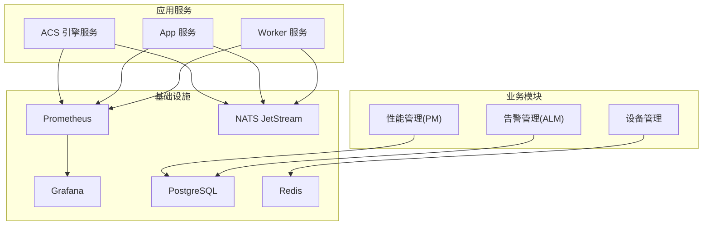
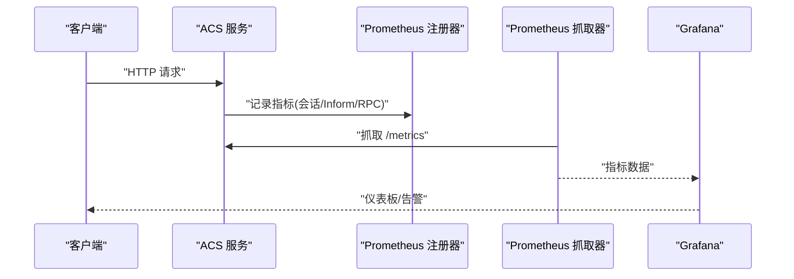
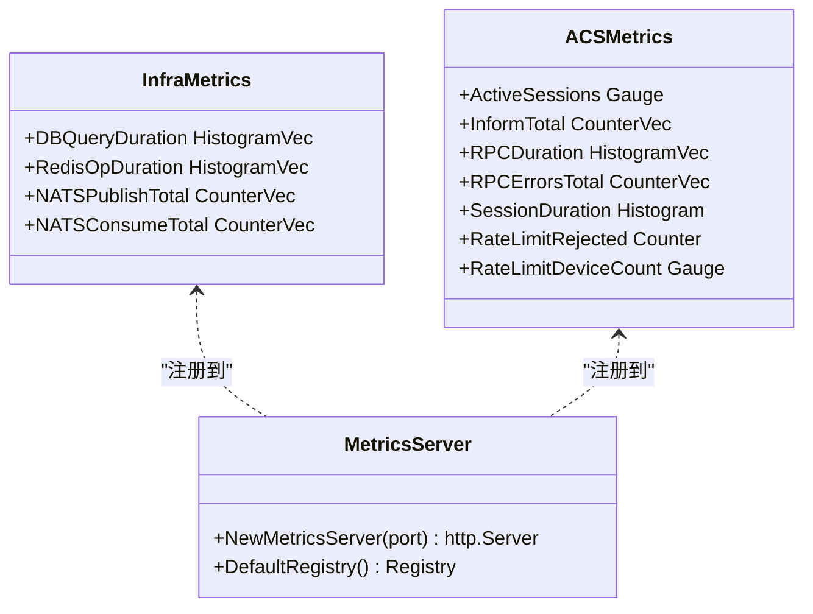
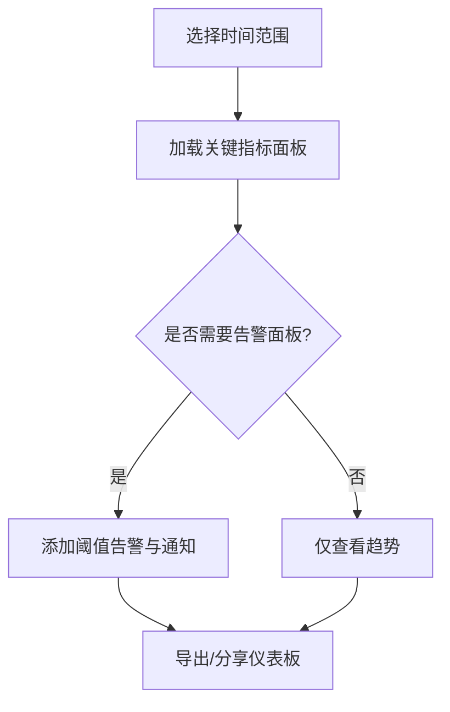
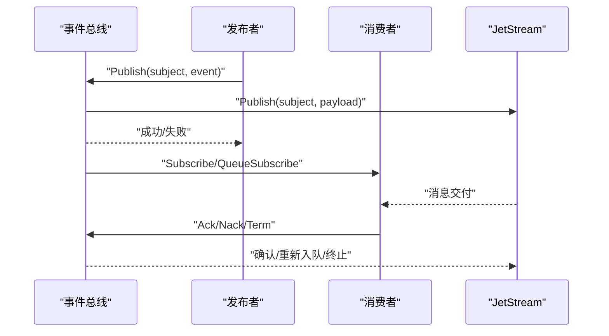
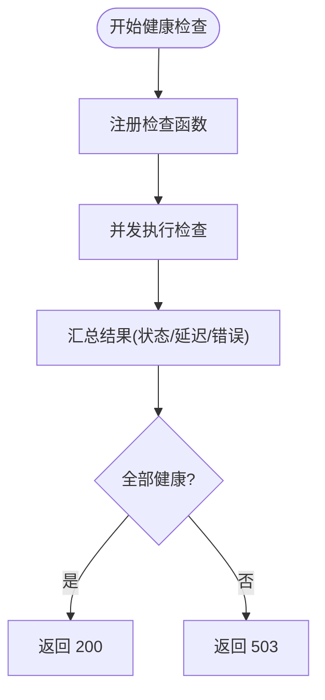
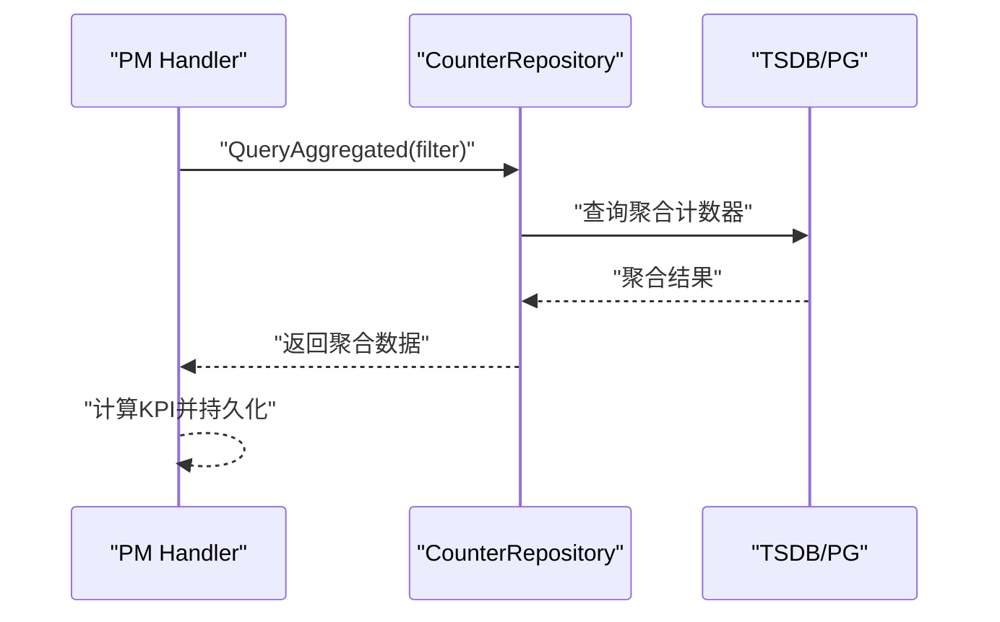
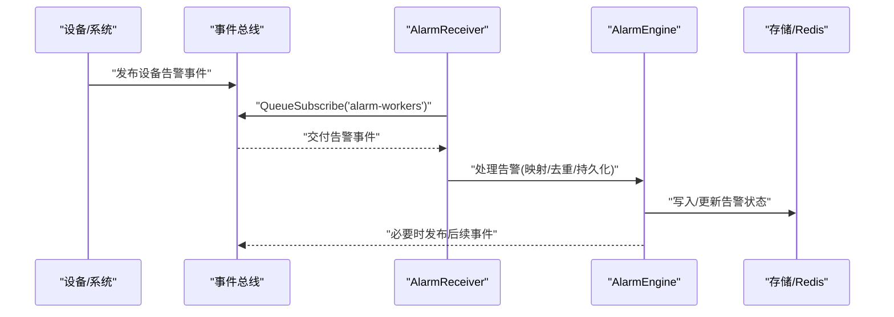
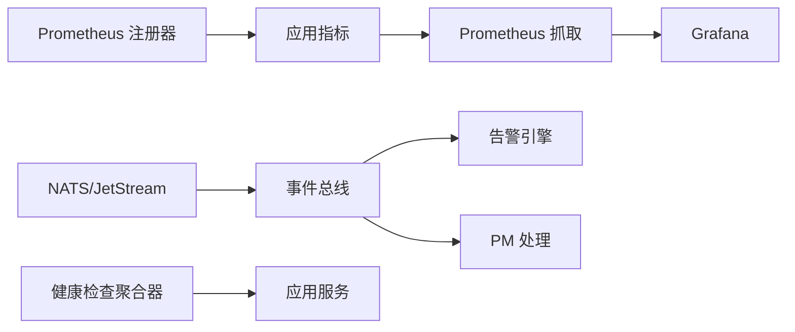

# 监控告警

<cite>
**本文引用的文件**
- [metrics.go](file://omcgo/internal/core/components/monitor/metrics.go)
- [grafana-dashboard.json](file://omcgo/deployments/monitoring/grafana-dashboard.json)
- [nats.go](file://omcgo/internal/core/components/nats/nats.go)
- [nats_bus.go](file://omcgo/internal/core/event/nats_bus.go)
- [health.go](file://omcgo/internal/core/components/health.go)
- [metrics.go](file://omcgo/internal/acs/metrics.go)
- [config.dev.yaml（acs）](file://omcgo/cmd/acs/etc/config.dev.yaml)
- [config.dev.yaml（app）](file://omcgo/cmd/app/etc/config.dev.yaml)
- [deployment.yaml（acs）](file://omcgo/deployments/k8s/acs/deployment.yaml)
- [threshold_handler.go](file://omcgo/internal/pm/threshold_handler.go)
- [receiver.go](file://omcgo/internal/alarm/receiver.go)
- [engine.go](file://omcgo/internal/alarm/engine.go)
- [repository.go](file://omcgo/internal/pm/counter/repository.go)
- [08-infrastructure.md](file://omcgo/docs/go-zero-design/08-infrastructure.md)
</cite>

## 目录
1. [简介](#简介)
2. [项目结构](#项目结构)
3. [核心组件](#核心组件)
4. [架构总览](#架构总览)
5. [详细组件分析](#详细组件分析)
6. [依赖关系分析](#依赖关系分析)
7. [性能考量](#性能考量)
8. [故障排查指南](#故障排查指南)
9. [结论](#结论)
10. [附录](#附录)

## 简介
本文件面向 Baicells OMC 项目的监控与告警体系，围绕以下目标展开：
- Prometheus 指标采集与暴露：覆盖基础设施、应用组件、业务指标，明确指标命名、标签与暴露端点。
- Grafana 仪表板：基于现有仪表板 JSON 的关键指标可视化、告警面板配置思路与历史趋势分析建议。
- NATS 消息系统监控：消息队列深度、消费者状态、错误率与重试策略的可观测性。
- 应用健康检查：存活/就绪探针、启动延迟与健康聚合器的使用。
- 业务指标监控：设备连接数、请求响应时间、错误率统计与阈值配置。
- 告警规则：阈值设定、告警级别、通知渠道与规则管理。
- 长期存储与查询优化：Prometheus 存储、查询优化与成本控制建议。

## 项目结构
OMC 后端采用多进程/多模块架构，监控与可观测性贯穿基础设施层、应用层与业务层：
- 基础设施层：Prometheus、Grafana、Jaeger、Loki、NATS/JetStream、PostgreSQL/Redis 等。
- 应用层：各服务进程（如 acs、app、worker）分别注册指标并暴露 /metrics。
- 业务层：设备管理、性能管理（PM）、告警管理、MR 等模块通过事件总线与指标协同工作。

图表来源
- [08-infrastructure.md:31-36](file://omcgo/docs/go-zero-design/08-infrastructure.md#L31-L36)
- [deployment.yaml（acs）:20-22](file://omcgo/deployments/k8s/acs/deployment.yaml#L20-L22)

章节来源
- [08-infrastructure.md:31-36](file://omcgo/docs/go-zero-design/08-infrastructure.md#L31-L36)

## 核心组件
- Prometheus 指标注册与暴露：基础设施与应用均通过统一注册器注册指标，并在独立端口暴露 /metrics。
- NATS/JetStream 客户端与事件总线：提供发布/订阅、队列分组、确认与重试机制。
- 健康检查聚合器：并发执行多组件健康检查，输出统一健康状态。
- 业务指标：ACS 引擎会话、Inform、RPC、速率限制等；PM 计数器与 KPI 阈值；告警事件处理。

章节来源
- [metrics.go:21-57](file://omcgo/internal/core/components/monitor/metrics.go#L21-L57)
- [metrics.go:17-62](file://omcgo/internal/acs/metrics.go#L17-L62)
- [nats.go:38-73](file://omcgo/internal/core/components/nats/nats.go#L38-L73)
- [nats_bus.go:34-46](file://omcgo/internal/core/event/nats_bus.go#L34-L46)
- [health.go:42-74](file://omcgo/internal/core/components/health.go#L42-L74)

## 架构总览
下图展示监控与告警在系统中的位置与交互：

图表来源
- [metrics.go:17-62](file://omcgo/internal/acs/metrics.go#L17-L62)
- [metrics.go:65-76](file://omcgo/internal/core/components/monitor/metrics.go#L65-L76)
- [grafana-dashboard.json:10-142](file://omcgo/deployments/monitoring/grafana-dashboard.json#L10-L142)

## 详细组件分析

### Prometheus 指标采集与暴露
- 指标注册器：每个组件可使用默认注册器或自定义注册器，注册 Go 运行时与进程指标。
- 暴露端点：统一在 /metrics 暴露，支持健康检查 /healthz。
- 指标类型与用途：
  - 基础设施：数据库查询耗时、Redis 操作耗时、NATS 发布/消费计数。
  - 应用：ACS 活跃会话、Inform 总量、RPC 耗时与错误、会话时长、速率限制拒绝与设备数。
- 暴露端口：
  - acs 服务：9091（容器端口与注解）
  - app 服务：9091（配置中定义）

图表来源
- [metrics.go:13-57](file://omcgo/internal/core/components/monitor/metrics.go#L13-L57)
- [metrics.go:6-14](file://omcgo/internal/acs/metrics.go#L6-L14)
- [metrics.go:65-85](file://omcgo/internal/core/components/monitor/metrics.go#L65-L85)

章节来源
- [metrics.go:21-57](file://omcgo/internal/core/components/monitor/metrics.go#L21-L57)
- [metrics.go:17-62](file://omcgo/internal/acs/metrics.go#L17-L62)
- [config.dev.yaml（acs）:49-51](file://omcgo/cmd/acs/etc/config.dev.yaml#L49-L51)
- [config.dev.yaml（app）:70-72](file://omcgo/cmd/app/etc/config.dev.yaml#L70-L72)
- [deployment.yaml（acs）:20-22](file://omcgo/deployments/k8s/acs/deployment.yaml#L20-L22)

### Grafana 仪表板设计
- 面板组成：关键指标统计（会话数、设备数、告警数、Pod 数）、请求速率与时序、NATS JetStream 队列深度、CPU/内存、Go 运行时指标。
- 查询示例：Inform 请求速率、RPC 耗时分位数、按组件的请求速率、NATS 消费者待处理数、Pod 级 CPU/内存、Go Goroutines/GC。
- 建议：结合业务阈值设置告警规则，使用模板变量与时间范围联动，增强可读性与可维护性。

图表来源
- [grafana-dashboard.json:10-142](file://omcgo/deployments/monitoring/grafana-dashboard.json#L10-L142)

章节来源
- [grafana-dashboard.json:10-142](file://omcgo/deployments/monitoring/grafana-dashboard.json#L10-L142)

### NATS 消息系统监控
- 连接与 JetStream：建立连接后获取 JetStream 上下文，确保默认流存在。
- 事件总线：发布/订阅/队列订阅，显式确认，失败时指数退避重试，达到最大投递次数后终止。
- 监控关注点：队列深度（消费者待处理数）、连接状态、发布/消费计数、重试与终止事件。

图表来源
- [nats_bus.go:34-78](file://omcgo/internal/core/event/nats_bus.go#L34-L78)
- [nats.go:76-97](file://omcgo/internal/core/components/nats/nats.go#L76-L97)

章节来源
- [nats.go:38-112](file://omcgo/internal/core/components/nats/nats.go#L38-L112)
- [nats_bus.go:34-127](file://omcgo/internal/core/event/nats_bus.go#L34-L127)

### 应用健康检查机制
- 组件健康检查聚合器：并发注册多个组件检查函数，统一返回健康状态、延迟与错误信息。
- 服务端点：/healthz 返回 200/503，供探针使用。
- 探针配置：Kubernetes 中为 acs 服务配置就绪/存活探针，指向 /healthz。

图表来源
- [health.go:42-92](file://omcgo/internal/core/components/health.go#L42-L92)
- [deployment.yaml（acs）:45-58](file://omcgo/deployments/k8s/acs/deployment.yaml#L45-L58)

章节来源
- [health.go:42-92](file://omcgo/internal/core/components/health.go#L42-L92)
- [deployment.yaml（acs）:45-58](file://omcgo/deployments/k8s/acs/deployment.yaml#L45-L58)

### 业务指标监控
- 设备连接数：ACS 活跃会话指标用于反映当前活动设备数量。
- 请求响应时间：RPC 耗时直方图与 Inform 请求速率，支持分位数分析。
- 错误率统计：RPC 错误计数器，结合速率计算错误率。
- PM 指标：计数器聚合查询接口，支持按时间桶聚合与 KPI 计算。
- KPI 阈值：阈值管理 API 支持增删改查与启用/禁用，便于配置告警阈值。

图表来源
- [repository.go:22-42](file://omcgo/internal/pm/counter/repository.go#L22-L42)
- [threshold_handler.go:44-74](file://omcgo/internal/pm/threshold_handler.go#L44-L74)

章节来源
- [metrics.go:17-62](file://omcgo/internal/acs/metrics.go#L17-L62)
- [repository.go:22-42](file://omcgo/internal/pm/counter/repository.go#L22-L42)
- [threshold_handler.go:92-125](file://omcgo/internal/pm/threshold_handler.go#L92-L125)

### 告警规则配置
- 告警接收与处理：设备告警事件通过事件总线订阅，进入告警引擎进行严重性映射、去重与生命周期管理。
- 规则管理：提供 REST API 对告警规则进行创建、更新、删除与启用/禁用。
- 告警级别与通知：规则中定义条件与动作，支持按运营商/制式筛选，严重性可映射。

图表来源
- [receiver.go:37-49](file://omcgo/internal/alarm/receiver.go#L37-L49)
- [engine.go:41-56](file://omcgo/internal/alarm/engine.go#L41-L56)
- [nats_bus.go:64-78](file://omcgo/internal/core/event/nats_bus.go#L64-L78)

章节来源
- [receiver.go:37-49](file://omcgo/internal/alarm/receiver.go#L37-L49)
- [engine.go:41-56](file://omcgo/internal/alarm/engine.go#L41-L56)
- [threshold_handler.go:105-137](file://omcgo/internal/pm/threshold_handler.go#L105-L137)

## 依赖关系分析
- 指标依赖：各组件通过统一注册器注册指标，Prometheus 从各服务的 /metrics 抓取。
- NATS 依赖：事件总线依赖 NATS/JetStream，消费者通过队列订阅实现水平扩展。
- 健康检查依赖：健康聚合器依赖各组件提供的检查函数，统一输出健康状态。
- 业务依赖：PM 模块依赖 TSDB/PG 存储计数器与聚合结果；告警模块依赖事件总线与存储。

图表来源
- [metrics.go:65-85](file://omcgo/internal/core/components/monitor/metrics.go#L65-L85)
- [nats_bus.go:25-32](file://omcgo/internal/core/event/nats_bus.go#L25-L32)
- [health.go:24-32](file://omcgo/internal/core/components/health.go#L24-L32)

章节来源
- [metrics.go:65-85](file://omcgo/internal/core/components/monitor/metrics.go#L65-L85)
- [nats_bus.go:25-32](file://omcgo/internal/core/event/nats_bus.go#L25-L32)
- [health.go:24-32](file://omcgo/internal/core/components/health.go#L24-L32)

## 性能考量
- 指标维度与标签：避免高基数标签（如设备 ID），优先使用稳定标签（方法名、状态、主题）。
- 直方图与摘要：合理设置桶，避免过多桶导致内存与查询开销上升。
- 采样与降采样：对高频指标进行降采样或聚合，减少存储压力。
- NATS 队列与重试：根据负载调整队列大小与重试策略，避免堆积与抖动。
- 健康检查并发：健康检查并发执行，注意避免对下游造成额外压力。

## 故障排查指南
- 指标未暴露：检查 /metrics 端口与路径、注册器是否正确注册、Kubernetes 注解是否生效。
- NATS 连接异常：确认连接 URL、重连参数、JetStream 上下文获取是否成功。
- 事件处理失败：查看重试次数与退避策略，定位解析错误与处理错误。
- 健康检查失败：检查 /healthz 端点、探针配置与组件内部健康检查函数。
- 业务指标异常：核对 PM 计数器聚合查询参数与时间窗口，检查阈值配置。

章节来源
- [metrics.go:65-76](file://omcgo/internal/core/components/monitor/metrics.go#L65-L76)
- [nats.go:57-73](file://omcgo/internal/core/components/nats/nats.go#L57-L73)
- [nats_bus.go:93-127](file://omcgo/internal/core/event/nats_bus.go#L93-L127)
- [health.go:42-92](file://omcgo/internal/core/components/health.go#L42-L92)
- [repository.go:11-20](file://omcgo/internal/pm/counter/repository.go#L11-L20)

## 结论
OMC 项目的监控与告警体系以 Prometheus 为核心，结合 Grafana 可视化、NATS/JetStream 事件总线与健康检查聚合器，实现了对基础设施、应用与业务的全面可观测。通过标准化的指标命名与标签、完善的告警规则管理与阈值配置，能够有效支撑运维与质量保障需求。建议持续优化指标维度、查询性能与告警策略，确保在高负载场景下的稳定性与可维护性。

## 附录
- 指标清单与标签参考：见“核心组件”与“业务指标监控”章节。
- 仪表板模板：基于现有 Grafana JSON 进行二次开发，增加告警面板与阈值联动。
- 告警规则模板：基于阈值管理 API 与告警引擎，形成可复用的规则模板库。