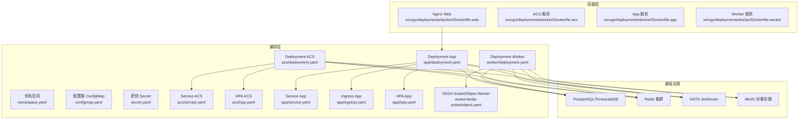
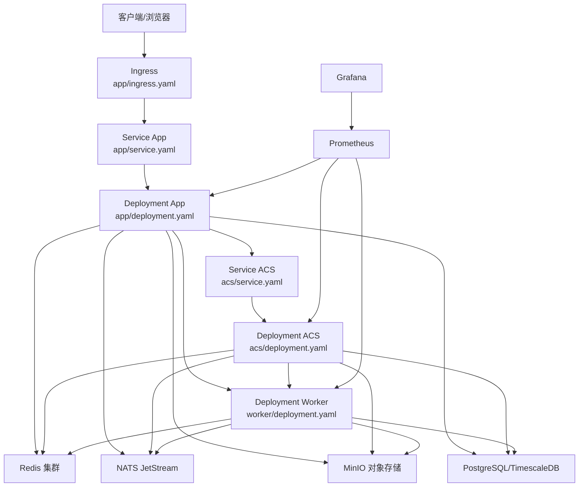
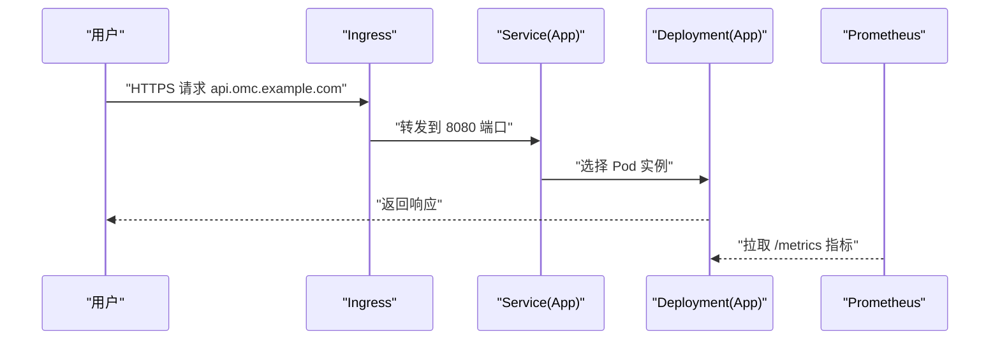
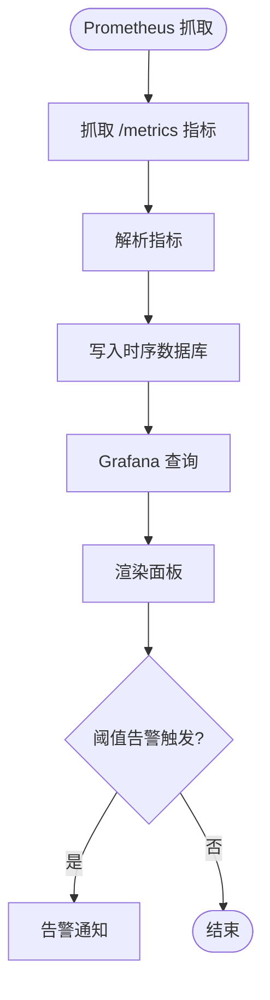
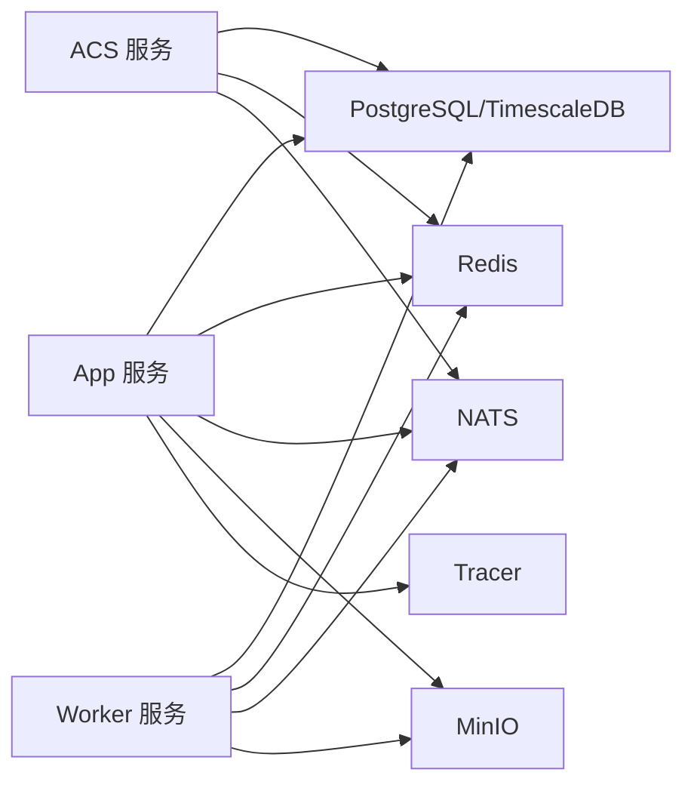

# 部署运维

<cite>
**本文引用的文件**
- [docker-compose.yml](file://omcgo/deployments/docker/docker-compose.yml)
- [Dockerfile.acs](file://omcgo/deployments/docker/Dockerfile.acs)
- [Dockerfile.web](file://omcgo/deployments/docker/Dockerfile.web)
- [Dockerfile.worker](file://omcgo/deployments/docker/Dockerfile.worker)
- [namespace.yaml](file://omcgo/deployments/k8s/namespace.yaml)
- [configmap.yaml](file://omcgo/deployments/k8s/configmap.yaml)
- [secret.yaml](file://omcgo/deployments/k8s/secret.yaml)
- [grafana-dashboard.json](file://omcgo/deployments/monitoring/grafana-dashboard.json)
- [acs/deployment.yaml](file://omcgo/deployments/k8s/acs/deployment.yaml)
- [acs/service.yaml](file://omcgo/deployments/k8s/acs/service.yaml)
- [acs/hpa.yaml](file://omcgo/deployments/k8s/acs/hpa.yaml)
- [app/deployment.yaml](file://omcgo/deployments/k8s/app/deployment.yaml)
- [app/service.yaml](file://omcgo/deployments/k8s/app/service.yaml)
- [app/ingress.yaml](file://omcgo/deployments/k8s/app/ingress.yaml)
- [app/hpa.yaml](file://omcgo/deployments/k8s/app/hpa.yaml)
- [worker/deployment.yaml](file://omcgo/deployments/k8s/worker/deployment.yaml)
- [worker/keda-scaledobject.yaml](file://omcgo/deployments/k8s/worker/keda-scaledobject.yaml)
- [deployment-guide.md](file://omcgo/docs/operations/deployment-guide.md)
- [backup/service.go](file://omcgo/internal/backup/service.go)
- [backup/executor.go](file://omcgo/internal/backup/executor.go)
- [backup/handler.go](file://omcgo/internal/backup/handler.go)
- [backup/model.go](file://omcgo/internal/backup/model.go)
- [backup/repository.go](file://omcgo/internal/backup/pg_repository.go)
- [backup/ftp_repository.go](file://omcgo/internal/backup/ftp_pg_repository.go)
- [backup/ftp_model.go](file://omcgo/internal/backup/ftp_model.go)
- [scripts/e2e_verify.sh](file://omcgo/scripts/e2e_verify.sh)
- [scripts/health-check.sh](file://omcgo/scripts/health-check.sh)
- [internal/core/components/health.go](file://omcgo/internal/core/components/health.go)
- [internal/core/components/shutdown.go](file://omcgo/internal/core/components/shutdown.go)
- [internal/core/components/sysinfo.go](file://omcgo/internal/core/components/sysinfo.go)
- [internal/core/components/tracer.go](file://omcgo/internal/core/components/tracer.go)
- [internal/core/components/nats](file://omcgo/internal/core/components/nats)
- [internal/core/components/postgres](file://omcgo/internal/core/components/postgres)
- [internal/core/components/redis](file://omcgo/internal/core/components/redis)
- [internal/core/components/minio](file://omcgo/internal/core/components/minio)
- [internal/core/components/logger](file://omcgo/internal/core/components/logger)
- [internal/core/components/monitor](file://omcgo/internal/core/components/monitor)
- [internal/backup/ftp_model.go](file://omcgo/internal/backup/ftp_model.go)
- [internal/backup/ftp_pg_repository.go](file://omcgo/internal/backup/ftp_pg_repository.go)
- [internal/backup/ftp_repository.go](file://omcgo/internal/backup/ftp_repository.go)
- [internal/backup/handler.go](file://omcgo/internal/backup/handler.go)
- [internal/backup/executor.go](file://omcgo/internal/backup/executor.go)
- [internal/backup/model.go](file://omcgo/internal/backup/model.go)
- [internal/backup/pg_repository.go](file://omcgo/internal/backup/pg_repository.go)
- [internal/backup/repository.go](file://omcgo/internal/backup/repository.go)
- [internal/backup/service.go](file://omcgo/internal/backup/service.go)
- [internal/backup/service_test.go](file://omcgo/internal/backup/service_test.go)
- [internal/backup/handler_test.go](file://omcgo/internal/backup/handler_test.go)
- [internal/backup/executor_test.go](file://omcgo/internal/backup/executor_test.go)
- [internal/backup/ftp_model.go](file://omcgo/internal/backup/ftp_model.go)
- [internal/backup/ftp_pg_repository.go](file://omcgo/internal/backup/ftp_pg_repository.go)
- [internal/backup/ftp_repository.go](file://omcgo/internal/backup/ftp_repository.go)
- [internal/backup/handler_test.go](file://omcgo/internal/backup/handler_test.go)
- [internal/backup/executor_test.go](file://omcgo/internal/backup/executor_test.go)
- [internal/backup/service_test.go](file://omcgo/internal/backup/service_test.go)
- [internal/backup/ftp_model.go](file://omcgo/internal/backup/ftp_model.go)
- [internal/backup/ftp_pg_repository.go](file://omcgo/internal/backup/ftp_pg_repository.go)
- [internal/backup/ftp_repository.go](file://omcgo/internal/backup/ftp_repository.go)
- [internal/backup/handler_test.go](file://omcgo/internal/backup/handler_test.go)
- [internal/backup/executor_test.go](file://omcgo/internal/backup/executor_test.go)
- [internal/backup/service_test.go](file://omcgo/internal/backup/service_test.go)
- [internal/backup/ftp_model.go](file://omcgo/internal/backup/ftp_model.go)
- [internal/backup/ftp_pg_repository.go](file://omcgo/internal/backup/ftp_pg_repository.go)
- [internal/backup/ftp_repository.go](file://omcgo/internal/backup/ftp_repository.go)
- [internal/backup/handler_test.go](file://omcgo/internal/backup/handler_test.go)
- [internal/backup/executor_test.go](file://omcgo/internal/backup/executor_test.go)
- [internal/backup/service_test.go](file://omcgo/internal/backup/service_test.go)
- [internal/backup/ftp_model.go](file://omcgo/internal/backup/ftp_model.go)
- [internal/backup/ftp_pg_repository.go](file://omcgo/internal/backup/ftp_pg_repository.go)
- [internal/backup/ftp_repository.go](file://omcgo/internal/backup/ftp_repository.go)
- [internal/backup/handler_test.go](file://omcgo/internal/backup/handler_test.go)
- [internal/backup/executor_test.go](file://omcgo/internal/backup/executor_test.go)
- [internal/backup/service_test.go](file://omcgo/internal/backup/service_test.go)
- [internal/backup/ftp_model.go](file://omcgo/internal/backup/ftp_model.go)
- [internal/backup/ftp_pg_repository.go](file://omcgo/internal/backup/ftp_pg_repository.go)
- [internal/backup/ftp_repository.go](file://omcgo/internal/backup/ftp_repository.go)
- [internal/backup/handler_test.go](file://omcgo/internal/backup/handler_test.go)
- [internal/backup/executor_test.go](file://omcgo/internal/backup/executor_test.go)
- [internal/backup/service_test.go](file://omcgo/internal/backup/service_test.go)
- [internal/backup/ftp_model.go](file://omcgo/internal/backup/ftp_model.go)
- [internal/backup/ftp_pg_repository.go](file://omcgo/internal/backup/ftp_pg_repository.go)
- [internal/backup/ftp_repository.go](file://omcgo/internal/backup/ftp_repository.go)
- [internal/backup/handler_test.go](file://omcgo/internal/backup/handler_test.go)
- [internal/backup/executor_test.go](file://omcgo/internal/backup/executor_test.go)
- [internal/backup/service_test.go](file://omcgo/internal/backup/service_test.go)
- [internal/backup/ftp_model.go](file://omcgo/internal/backup/ftp_model.go)
- [internal/backup/ftp_pg_repository.go](file://omcgo/internal/backup/ftp_pg_repository.go)
- [internal/backup/ftp_repository.go](file://omcgo/internal/backup/ftp_repository.go)
- [internal/backup/handler_test.go](file://omcgo/internal/backup/handler_test.go)
- [internal/backup/executor_test.go](file://omcgo/internal/backup/executor_test.go)
- [internal/backup/service_test.go](file://omcgo/internal/backup/service_test.go)
- [internal/core/appconfig/config.go](file://omcgo/internal/core/appconfig/config.go)
</cite>

## 更新摘要
**变更内容**
- 更新Docker容器化方案章节，反映docker-compose.yml使用用户主目录进行日志存储的开发者体验改进
- 新增本地开发环境日志存储优化说明
- 更新日志管理方案章节，强调用户主目录日志存储的优势

## 目录
1. [简介](#简介)
2. [项目结构](#项目结构)
3. [核心组件](#核心组件)
4. [架构总览](#架构总览)
5. [详细组件分析](#详细组件分析)
6. [依赖关系分析](#依赖关系分析)
7. [性能考虑](#性能考虑)
8. [故障排除指南](#故障排除指南)
9. [结论](#结论)
10. [附录](#附录)

## 简介
本文件面向Baicells OMC项目的部署与运维团队，提供从Docker容器化到Kubernetes集群的完整部署方案，涵盖镜像构建、容器编排、环境配置、监控告警、数据库备份恢复、日志管理、性能监控与调优以及生产最佳实践与故障排除。文档以仓库中现有的部署与监控配置为依据，结合后端服务的可观测性能力，形成可操作的运维手册。

## 项目结构
OMC项目采用前后端分离与多服务协同的架构：前端Web通过Nginx提供静态资源；后端由三个核心服务组成（ACS、App、Worker），均通过Kubernetes进行编排，并依赖Redis、NATS、MinIO与PostgreSQL/TimescaleDB等基础设施。部署相关的核心位置如下：
- Docker容器化：omcgo/deployments/docker
- Kubernetes编排：omcgo/deployments/k8s
- 监控仪表盘：omcgo/deployments/monitoring
- 运维文档：omcgo/docs/operations

图表来源
- [docker-compose.yml:1-194](file://omcgo/deployments/docker/docker-compose.yml#L1-L194)
- [Dockerfile.web:1-12](file://omcgo/deployments/docker/Dockerfile.web#L1-L12)
- [Dockerfile.acs:1-29](file://omcgo/deployments/docker/Dockerfile.acs#L1-L29)
- [Dockerfile.worker:1-29](file://omcgo/deployments/docker/Dockerfile.worker#L1-L29)
- [namespace.yaml:1-7](file://omcgo/deployments/k8s/namespace.yaml#L1-L7)
- [configmap.yaml:1-153](file://omcgo/deployments/k8s/configmap.yaml#L1-L153)
- [secret.yaml:1-15](file://omcgo/deployments/k8s/secret.yaml#L1-L15)
- [acs/deployment.yaml:1-86](file://omcgo/deployments/k8s/acs/deployment.yaml#L1-L86)
- [acs/service.yaml:1-21](file://omcgo/deployments/k8s/acs/service.yaml#L1-L21)
- [acs/hpa.yaml:1-40](file://omcgo/deployments/k8s/acs/hpa.yaml#L1-L40)
- [app/deployment.yaml:1-103](file://omcgo/deployments/k8s/app/deployment.yaml#L1-L103)
- [app/service.yaml:1-17](file://omcgo/deployments/k8s/app/service.yaml#L1-L17)
- [app/ingress.yaml:1-27](file://omcgo/deployments/k8s/app/ingress.yaml#L1-L27)
- [app/hpa.yaml:1-33](file://omcgo/deployments/k8s/app/hpa.yaml#L1-L33)
- [worker/deployment.yaml:1-93](file://omcgo/deployments/k8s/worker/deployment.yaml#L1-L93)
- [worker/keda-scaledobject.yaml](file://omcgo/deployments/k8s/worker/keda-scaledobject.yaml)

章节来源
- [docker-compose.yml:1-194](file://omcgo/deployments/docker/docker-compose.yml#L1-L194)
- [namespace.yaml:1-7](file://omcgo/deployments/k8s/namespace.yaml#L1-L7)

## 核心组件
- 命名空间与配置
  - 命名空间：用于隔离OMC应用资源，便于权限与配额管理。
  - ConfigMap：集中存放各服务配置（数据库DSN、Redis、NATS、MinIO、日志级别等），支持运行时热更新。
  - Secret：存放敏感信息（数据库密码、MinIO凭据、JWT密钥、NATS地址等）。
- 服务编排
  - ACS服务：TR-069 ACS服务器，负责设备会话与消息处理。
  - App服务：REST API网关与业务服务，提供前端访问入口。
  - Worker服务：异步任务与数据处理（PM/MR/KPI等）。
- 基础设施
  - PostgreSQL/TimescaleDB：主数据库与时间序列数据库。
  - Redis：会话与缓存。
  - NATS：消息总线与JetStream持久化队列。
  - MinIO：对象存储，用于文件上传下载与归档。

章节来源
- [namespace.yaml:1-7](file://omcgo/deployments/k8s/namespace.yaml#L1-L7)
- [configmap.yaml:1-153](file://omcgo/deployments/k8s/configmap.yaml#L1-L153)
- [secret.yaml:1-15](file://omcgo/deployments/k8s/secret.yaml#L1-L15)
- [acs/deployment.yaml:1-86](file://omcgo/deployments/k8s/acs/deployment.yaml#L1-L86)
- [app/deployment.yaml:1-103](file://omcgo/deployments/k8s/app/deployment.yaml#L1-L103)
- [worker/deployment.yaml:1-93](file://omcgo/deployments/k8s/worker/deployment.yaml#L1-L93)

## 架构总览
下图展示OMC在Kubernetes中的端到端架构：前端通过Ingress暴露API域名，App服务作为统一入口，内部通过Service路由至后端各组件；所有组件均通过ConfigMap注入配置并通过Secret注入密钥；Prometheus抓取指标，Grafana展示仪表盘；NATS承载消息流，MinIO提供对象存储，PostgreSQL/TimescaleDB提供结构化与时间序列数据。

图表来源
- [app/ingress.yaml:1-27](file://omcgo/deployments/k8s/app/ingress.yaml#L1-L27)
- [app/service.yaml:1-17](file://omcgo/deployments/k8s/app/service.yaml#L1-L17)
- [acs/service.yaml:1-21](file://omcgo/deployments/k8s/acs/service.yaml#L1-L21)
- [app/deployment.yaml:1-103](file://omcgo/deployments/k8s/app/deployment.yaml#L1-L103)
- [acs/deployment.yaml:1-86](file://omcgo/deployments/k8s/acs/deployment.yaml#L1-L86)
- [worker/deployment.yaml:1-93](file://omcgo/deployments/k8s/worker/deployment.yaml#L1-L93)
- [grafana-dashboard.json:1-142](file://omcgo/deployments/monitoring/grafana-dashboard.json#L1-L142)

## 详细组件分析

### Docker 容器化方案
- 镜像构建
  - ACS服务镜像：基于多阶段构建，最终运行时镜像仅包含二进制与必要证书，端口暴露7547/7548/9091。
  - Worker服务镜像：多阶段构建，最终运行时镜像包含二进制与配置，端口暴露9091。
  - Web镜像：前端构建产物通过Nginx提供静态服务，默认端口80。
- 容器编排（本地）
  - 使用Compose定义服务：postgres、redis、nats、minio、migrate、acs、app、worker、web。
  - 数据卷挂载：数据库与对象存储数据持久化至宿主机卷。
  - **更新**：日志存储现在使用用户主目录 `~/data/logs/omcgo`，简化了本地开发环境设置，无需额外权限配置。
  - 健康检查：PostgreSQL、Redis、NATS、MinIO均配置健康检查探针。
  - 环境变量：通过环境变量传递数据库DSN、Redis地址、NATS地址、MinIO凭据等。
- 运行与日志
  - 日志输出路径统一配置为JSON格式并写入容器内日志目录，宿主机映射到用户主目录下的日志存储。
  - 支持日志轮转（lumberjack）参数在配置中定义。
  - **新增**：用户主目录日志存储提供了更好的开发者体验，避免了权限问题和复杂的目录权限配置。

**章节来源**
- [Dockerfile.acs:1-29](file://omcgo/deployments/docker/Dockerfile.acs#L1-L29)
- [Dockerfile.worker:1-29](file://omcgo/deployments/docker/Dockerfile.worker#L1-L29)
- [Dockerfile.web:1-12](file://omcgo/deployments/docker/Dockerfile.web#L1-L12)
- [docker-compose.yml:1-194](file://omcgo/deployments/docker/docker-compose.yml#L1-L194)

### Kubernetes 集群部署策略
- 命名空间与配置
  - 命名空间：omcgo，便于资源隔离与治理。
  - ConfigMap：集中管理各服务配置，支持按服务拆分（app.yaml、acs.yaml、worker.yaml）。
  - Secret：集中管理敏感配置（DB_DSN、TSDB_DSN、REDIS_PASSWORD、MINIO_ACCESS_KEY、MINIO_SECRET_KEY、JWT_SECRET、NATS_URL）。
- Deployment
  - App/ACS/Worker均采用Deployment管理副本数与滚动升级。
  - 探针：就绪探针与存活探针分别指向健康检查端点，确保流量只在服务可用时接入。
  - 资源请求与限制：为CPU与内存设置requests/limits，保障QoS与调度稳定性。
- Service
  - App服务：ClusterIP，供内部访问。
  - ACS服务：LoadBalancer，对外暴露TR-069端口（7547/7548）。
- Ingress
  - 通过Nginx Ingress暴露API域名，配置代理超时与请求体大小，启用TLS。
- HPA 自动扩缩容
  - ACS：基于自定义指标"acs_active_sessions"与CPU利用率双维度扩缩容，最小2，最大20。
  - App：基于CPU利用率扩缩容，最小2，最大5。
- KEDA 异步扩缩容（Worker）
  - 基于NATS JetStream队列深度触发Worker副本扩缩容，实现事件驱动弹性。

图表来源
- [app/ingress.yaml:1-27](file://omcgo/deployments/k8s/app/ingress.yaml#L1-L27)
- [app/service.yaml:1-17](file://omcgo/deployments/k8s/app/service.yaml#L1-L17)
- [app/deployment.yaml:1-103](file://omcgo/deployments/k8s/app/deployment.yaml#L1-L103)

章节来源
- [namespace.yaml:1-7](file://omcgo/deployments/k8s/namespace.yaml#L1-L7)
- [configmap.yaml:1-153](file://omcgo/deployments/k8s/configmap.yaml#L1-L153)
- [secret.yaml:1-15](file://omcgo/deployments/k8s/secret.yaml#L1-L15)
- [acs/deployment.yaml:1-86](file://omcgo/deployments/k8s/acs/deployment.yaml#L1-L86)
- [acs/service.yaml:1-21](file://omcgo/deployments/k8s/acs/service.yaml#L1-L21)
- [acs/hpa.yaml:1-40](file://omcgo/deployments/k8s/acs/hpa.yaml#L1-L40)
- [app/deployment.yaml:1-103](file://omcgo/deployments/k8s/app/deployment.yaml#L1-L103)
- [app/service.yaml:1-17](file://omcgo/deployments/k8s/app/service.yaml#L1-L17)
- [app/ingress.yaml:1-27](file://omcgo/deployments/k8s/app/ingress.yaml#L1-L27)
- [app/hpa.yaml:1-33](file://omcgo/deployments/k8s/app/hpa.yaml#L1-L33)
- [worker/deployment.yaml:1-93](file://omcgo/deployments/k8s/worker/deployment.yaml#L1-L93)
- [worker/keda-scaledobject.yaml](file://omcgo/deployments/k8s/worker/keda-scaledobject.yaml)

### 监控告警系统
- 指标采集
  - Prometheus通过Pod注解自动抓取各服务/metrics端点。
  - 指标类型：应用指标（如HTTP请求数、错误率）、NATS队列深度、Go运行时指标（goroutines、GC耗时）、容器资源使用（CPU/内存）。
- Grafana仪表板
  - 提供OMCGo运维仪表板，包含：活动会话数、设备总数、活动告警、Pod数量、Inform速率、RPC延迟、组件请求速率、NATS队列深度、CPU/内存使用、Go运行时指标等。
- NATS消息监控
  - 通过NATS JetStream指标监控消费者待处理消息数，评估消息积压情况。
- 应用健康检查
  - 各服务均提供/healthz端点，配合K8s探针保障流量接入时机。

图表来源
- [grafana-dashboard.json:1-142](file://omcgo/deployments/monitoring/grafana-dashboard.json#L1-L142)
- [app/deployment.yaml:19-22](file://omcgo/deployments/k8s/app/deployment.yaml#L19-L22)
- [acs/deployment.yaml:19-22](file://omcgo/deployments/k8s/acs/deployment.yaml#L19-L22)
- [worker/deployment.yaml:19-22](file://omcgo/deployments/k8s/worker/deployment.yaml#L19-L22)

章节来源
- [grafana-dashboard.json:1-142](file://omcgo/deployments/monitoring/grafana-dashboard.json#L1-L142)
- [internal/core/components/monitor](file://omcgo/internal/core/components/monitor)

### 数据库备份恢复策略
- 备份类型
  - 定期全量备份：建议每日执行，保留多个历史版本以便回滚。
  - 增量备份：基于Wal归档与时间点恢复（PITR），缩短RPO。
  - 对象存储备份：将备份文件上传至MinIO，实现异地容灾。
- 备份流程
  - 使用PostgreSQL原生命令或第三方工具生成备份文件。
  - 将备份文件上传至MinIO指定桶（如config-backup、logs等）。
  - 记录备份元数据（版本号、时间戳、校验和）。
- 恢复流程
  - 全量恢复：停止应用，恢复数据库，再启动服务。
  - 时间点恢复：定位目标时间点，结合WAL重放恢复到精确时刻。
- 灾难恢复
  - 多地域部署：至少两个可用区，关键数据跨区复制。
  - RTO/RPO目标：根据SLA设定，定期演练恢复流程。

章节来源
- [backup/service.go](file://omcgo/internal/backup/service.go)
- [backup/executor.go](file://omcgo/internal/backup/executor.go)
- [backup/handler.go](file://omcgo/internal/backup/handler.go)
- [backup/model.go](file://omcgo/internal/backup/model.go)
- [backup/repository.go](file://omcgo/internal/backup/pg_repository.go)
- [backup/ftp_repository.go](file://omcgo/internal/backup/ftp_pg_repository.go)
- [backup/ftp_model.go](file://omcgo/internal/backup/ftp_model.go)

### 日志管理方案
- 结构化日志
  - 日志格式统一为JSON，便于机器解析与检索。
  - 输出路径支持stdout与文件，便于容器日志收集。
- 日志聚合
  - 使用集中式日志系统（如ELK/EFK）收集容器stdout与文件日志。
  - 为每个服务设置独立索引或标签，便于分类查询。
- 搜索与分析
  - 基于关键词、时间范围、服务名、日志级别进行检索。
  - 关键指标：错误率、异常堆栈、慢查询、NATS队列积压等。
- **更新**：本地开发环境采用用户主目录日志存储，简化了开发者体验
  - 使用 `~/data/logs/omcgo` 作为统一的日志根目录
  - 每个服务有独立的日志子目录：acs、app、worker
  - 支持日志轮转配置，避免磁盘空间占用过大
  - 无需管理员权限即可写入日志文件

**章节来源**
- [docker-compose.yml:3-17](file://omcgo/deployments/docker/docker-compose.yml#L3-L17)
- [docker-compose.yml:108-168](file://omcgo/deployments/docker/docker-compose.yml#L108-L168)
- [configmap.yaml:66-69](file://omcgo/deployments/k8s/configmap.yaml#L66-L69)
- [internal/core/components/logger](file://omcgo/internal/core/components/logger)
- [internal/core/appconfig/config.go:212-239](file://omcgo/internal/core/appconfig/config.go#L212-L239)

### 性能监控与调优
- 资源使用监控
  - CPU/内存：通过Prometheus与Grafana监控各Pod资源使用趋势。
  - 存储：监控磁盘使用率与IOPS，避免瓶颈。
- 数据库性能优化
  - 索引优化：对高频查询字段建立合适索引。
  - 连接池：合理设置最大连接数与空闲超时，避免连接争用。
  - TimescaleDB：针对时间序列数据启用压缩与分区策略。
- 缓存策略
  - Redis：热点数据缓存，设置合理TTL与淘汰策略。
  - 应用层缓存：对读多写少的数据进行本地缓存。
- NATS与消息处理
  - 队列深度：监控消费者待处理消息数，及时扩容或优化消费者处理逻辑。
  - 流控与重试：避免重复消费与死信堆积。

章节来源
- [grafana-dashboard.json:80-128](file://omcgo/deployments/monitoring/grafana-dashboard.json#L80-L128)
- [configmap.yaml:15-28](file://omcgo/deployments/k8s/configmap.yaml#L15-L28)
- [internal/core/components/postgres](file://omcgo/internal/core/components/postgres)
- [internal/core/components/redis](file://omcgo/internal/core/components/redis)
- [internal/core/components/nats](file://omcgo/internal/core/components/nats)

## 依赖关系分析
- 组件耦合
  - App服务依赖数据库、Redis、NATS、MinIO与Tracer组件。
  - ACS服务依赖数据库、Redis、NATS，承担外部设备接入。
  - Worker服务依赖数据库、Redis、NATS、MinIO，处理异步任务。
- 外部依赖
  - Kubernetes API、Ingress控制器、Prometheus Operator、Grafana、NATS Operator、MinIO Operator。
- 配置与密钥
  - ConfigMap与Secret通过环境变量注入，确保配置与密钥解耦。

图表来源
- [configmap.yaml:15-50](file://omcgo/deployments/k8s/configmap.yaml#L15-L50)
- [app/deployment.yaml:56-91](file://omcgo/deployments/k8s/app/deployment.yaml#L56-L91)
- [acs/deployment.yaml:59-74](file://omcgo/deployments/k8s/acs/deployment.yaml#L59-L74)
- [worker/deployment.yaml:51-81](file://omcgo/deployments/k8s/worker/deployment.yaml#L51-L81)

章节来源
- [configmap.yaml:1-153](file://omcgo/deployments/k8s/configmap.yaml#L1-L153)
- [app/deployment.yaml:1-103](file://omcgo/deployments/k8s/app/deployment.yaml#L1-L103)
- [acs/deployment.yaml:1-86](file://omcgo/deployments/k8s/acs/deployment.yaml#L1-L86)
- [worker/deployment.yaml:1-93](file://omcgo/deployments/k8s/worker/deployment.yaml#L1-L93)

## 性能考虑
- 资源规划
  - 为不同服务设置合理的requests/limits，避免资源争抢。
  - HPA与KEDA结合使用，实现CPU与消息队列双维度弹性。
- 网络与存储
  - Ingress超时与代理大小需根据业务峰值调整。
  - 对象存储与数据库置于高性能网络与存储上。
- 可观测性
  - 指标覆盖：应用指标、基础设施指标、业务指标。
  - 告警分级：P0/P1/P2，明确收敛窗口与升级机制。

## 故障排除指南
- 健康检查失败
  - 检查/healthz端点是否可达，确认探针配置与端口一致。
  - 查看容器日志与K8s事件，定位依赖服务不可用问题。
- 数据库连接异常
  - 校验DB_DSN与网络连通性，确认连接池参数合理。
  - 检查数据库负载与慢查询日志。
- NATS消息积压
  - 监控消费者待处理消息数，增加Worker副本或优化处理逻辑。
  - 检查NATS JetStream配置与磁盘空间。
- MinIO不可用
  - 检查MinIO服务状态与桶权限，确认访问凭据正确。
- 备份失败
  - 检查备份脚本与MinIO连接，核对备份文件完整性与元数据记录。
- **更新**：本地日志权限问题
  - 如果遇到日志写入权限问题，确保用户主目录下的 `~/data/logs/omcgo` 目录存在且具有写权限
  - 使用 `mkdir -p ~/data/logs/omcgo` 创建目录
  - 检查磁盘空间是否充足

章节来源
- [internal/core/components/health.go](file://omcgo/internal/core/components/health.go)
- [internal/core/components/shutdown.go](file://omcgo/internal/core/components/shutdown.go)
- [internal/core/components/sysinfo.go](file://omcgo/internal/core/components/sysinfo.go)
- [internal/core/components/tracer.go](file://omcgo/internal/core/components/tracer.go)
- [scripts/health-check.sh](file://omcgo/scripts/health-check.sh)
- [scripts/e2e_verify.sh](file://omcgo/scripts/e2e_verify.sh)

## 结论
本部署运维文档基于仓库现有配置与代码实现，给出了从Docker到Kubernetes的完整落地方案，明确了监控告警、备份恢复、日志管理与性能调优的关键实践。最新的docker-compose.yml改进了本地开发体验，通过使用用户主目录进行日志存储，简化了权限配置和环境设置。建议在生产环境中进一步完善安全基线、密钥轮换、备份演练与容量规划，并持续优化HPA/KEDA策略与指标体系。

## 附录
- 运维文档参考：omcgo/docs/operations/deployment-guide.md
- 生产最佳实践
  - 使用GitOps管理配置变更，确保可追溯与可回滚。
  - 定期进行混沌工程演练，验证系统韧性。
  - 制定变更窗口与紧急预案，明确升级与回滚流程。