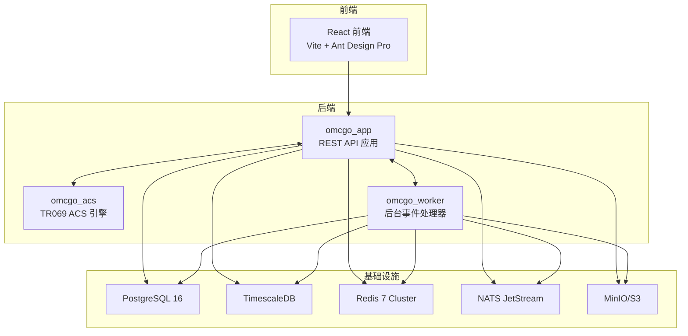
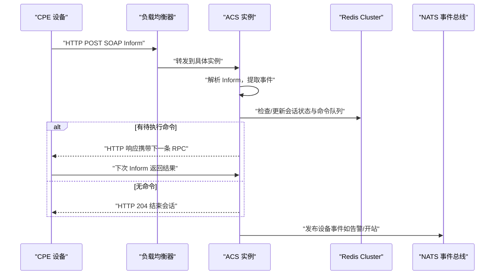
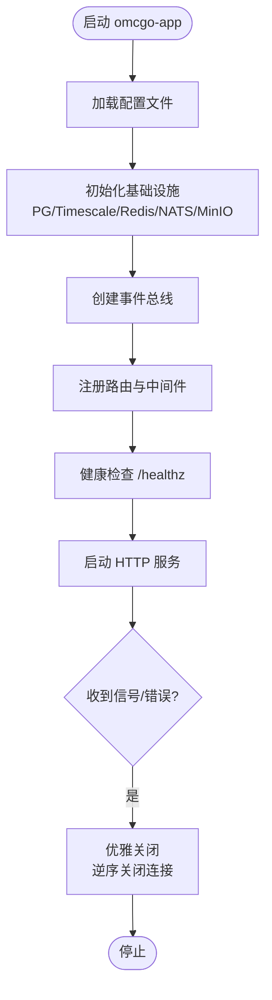
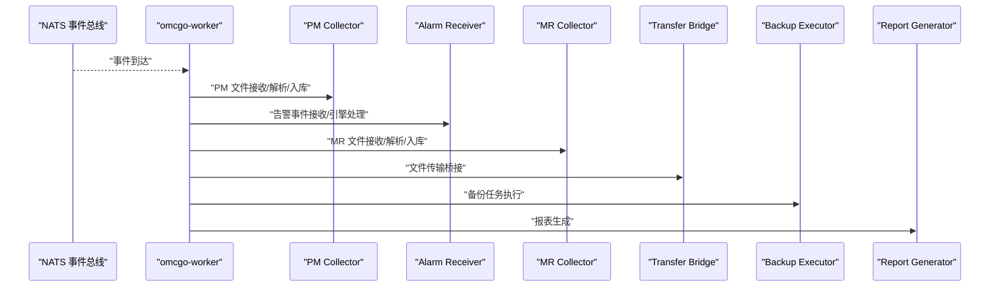
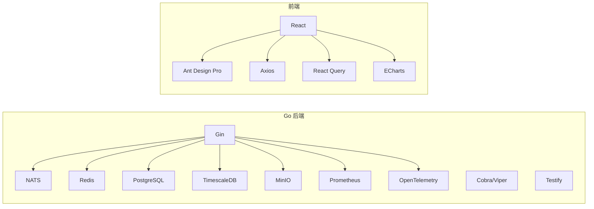

# 项目概述

<cite>
**本文档引用的文件**
- [omcgo/docs/README.md](file://omcgo/docs/README.md)
- [omcgo/docs/architecture/system-overview.md](file://omcgo/docs/architecture/system-overview.md)
- [omcgo/docs/architecture/backend-design.md](file://omcgo/docs/architecture/backend-design.md)
- [omcgo/docs/features/06-omc-core-functions.md](file://omcgo/docs/features/06-omc-core-functions.md)
- [omcgo/docs/development-plan.md](file://omcgo/docs/development-plan.md)
- [omcgo/go.mod](file://omcgo/go.mod)
- [omcgo/cmd/app/main.go](file://omcgo/cmd/app/main.go)
- [omcgo/cmd/acs/main.go](file://omcgo/cmd/acs/main.go)
- [omcgo/cmd/worker/main.go](file://omcgo/cmd/worker/main.go)
- [omcgo/cmd/app/router/router.go](file://omcgo/cmd/app/router/router.go)
- [omcgo/internal/core/bootstrap/bootstrap.go](file://omcgo/internal/core/bootstrap/bootstrap.go)
- [omcgo/internal/core/carrier/carrier.go](file://omcgo/internal/core/carrier/carrier.go)
- [omcmb/webcode/package.json](file://omcmb/webcode/package.json)
- [omcmb/webcode/src/main.tsx](file://omcmb/webcode/src/main.tsx)
</cite>

## 目录
1. [简介](#简介)
2. [项目结构](#项目结构)
3. [核心组件](#核心组件)
4. [架构总览](#架构总览)
5. [详细组件分析](#详细组件分析)
6. [依赖分析](#依赖分析)
7. [性能考虑](#性能考虑)
8. [故障排除指南](#故障排除指南)
9. [结论](#结论)
10. [附录](#附录)

## 简介
Baicells OMC（Operations, Management and Control）是一个面向小基站/皮基站/微基站的移动网络运维管理系统，基于TR069/CWMP协议构建，支持中国移动、中国电信、中国联通三大运营商的LTE（4G）与5G NR（SA）制式。系统提供完整的网元管理层（EML）能力，覆盖设备管理、配置管理、性能管理（PM/KPI）、告警管理、测量报告（MR）、自动开站、软件管理、拓扑管理、北向/OSS接口、网元直连（移动专有）等核心功能域。

项目采用“模块化单体 + 独立ACS引擎”的混合架构：核心应用（omcgo-app）承载REST API与F02-F10模块，TR069 ACS引擎（omcgo-acs）独立部署，后台工作进程（omcgo-worker）负责PM/MR/KPI处理与事件驱动流水线。整体设计兼顾初期10万级规模与未来100万级扩展潜力，通过NATS/JetStream实现事件驱动、Redis实现会话与缓存、PostgreSQL/TimescaleDB支撑结构化与时序数据、MinIO提供对象存储。

## 项目结构
项目采用前后端分离与多进程部署的组织方式：
- 后端（Go）：omcgo/cmd/ 下的三个入口进程分别对应ACS引擎、主应用与后台工作进程；内部模块按功能域划分（config、pm、alarm、mr、device、provision、northbound、nedirect、admin等）。
- 前端（React）：omcmb/webcode/ 使用Vite+TypeScript+Ant Design Pro，提供可视化仪表盘与业务操作界面。
- 文档与规范：omcgo/docs/ 提供架构、设计、功能域与开发计划等文档；omcgo/ 规范/ 目录收录三大运营商55份技术规范。

图表来源
- [omcgo/cmd/app/main.go:17-75](file://omcgo/cmd/app/main.go#L17-L75)
- [omcgo/cmd/acs/main.go:33-76](file://omcgo/cmd/acs/main.go#L33-L76)
- [omcgo/cmd/worker/main.go:44-68](file://omcgo/cmd/worker/main.go#L44-L68)
- [omcgo/internal/core/bootstrap/bootstrap.go:64-138](file://omcgo/internal/core/bootstrap/bootstrap.go#L64-L138)

章节来源
- [omcgo/docs/README.md:1-111](file://omcgo/docs/README.md#L1-L111)
- [omcgo/docs/architecture/backend-design.md:20-77](file://omcgo/docs/architecture/backend-design.md#L20-L77)

## 核心组件
- TR069 ACS 引擎（omcgo-acs）：独立进程，处理CPE连接、SOAP/XML编解码、会话状态机、命令队列与认证，支撑大规模并发（10万→100万级）。
- 主应用（omcgo-app）：基于Gin的REST API服务，集成F02-F10功能域路由、鉴权、审计、中间件与可观测性。
- 后台工作进程（omcgo-worker）：订阅NATS事件，处理PM/MR/KPI、告警、文件传输、备份与报表生成等后台任务。
- 基础设施层：PostgreSQL/TimescaleDB、Redis、NATS、MinIO，提供数据持久化、时序分析、缓存与消息传递。
- 前端（React）：Ant Design Pro组件库、React Query、Axios、ECharts等，提供设备管理、告警、性能、MR、报表等可视化界面。

章节来源
- [omcgo/cmd/app/router/router.go:45-349](file://omcgo/cmd/app/router/router.go#L45-L349)
- [omcgo/internal/core/bootstrap/bootstrap.go:34-49](file://omcgo/internal/core/bootstrap/bootstrap.go#L34-L49)

## 架构总览
系统定位与角色：
- OMC位于网元管理层（EML），承担设备发现、配置下发、状态监控、告警处理、软件管理等职责。
- 在TR069架构中，OMC扮演ACS（自动配置服务器）角色，管理CPE设备。

系统核心角色与职责
- ACS：OMC系统，负责设备会话、命令队列与事件分发
- CPE：被管理的基站设备

支持的设备类型与制式
- 设备类型：皮基站、扩展型皮基站、微基站、飞基站、社会化基站
- 制式：TD-LTE（4G）、5G NR（SA）

运营商差异概览
- 中国移动：规范最完整，覆盖全链路，网元直连为独有规范
- 中国电信：实用导向，接口版本持续演进，共建共享场景规范完善
- 中国联通：专注5G NR SA，北向接口最完整，规范体系最规范

功能域全景
- 核心：F01（南向接口）、F02（数据模型）、F06（OMC-R核心）
- 高：F03（性能管理）、F04（告警管理）、F05（测量报告）
- 中：F09（自动开站）、F07（网元直连）、F08（北向接口）
- 辅助：F10（互操作测试）

章节来源
- [omcgo/docs/architecture/system-overview.md:7-103](file://omcgo/docs/architecture/system-overview.md#L7-L103)
- [omcgo/docs/features/06-omc-core-functions.md:7-144](file://omcgo/docs/features/06-omc-core-functions.md#L7-L144)

## 详细组件分析

### TR069 ACS 引擎（omcgo-acs）
- 连接模型：负载均衡器 + 一致性哈希（按设备SN）→ 多ACS实例（goroutine/会话）→ Redis Cluster（会话状态+命令队列）
- 会话状态机：IDLE → INFORM_RECEIVED → PROCESSING → RPC_PENDING → RPC_RESPONSE → COMPLETE
- SOAP/XML处理策略：发送方向使用预编译模板，接收方向使用流式Decoder；参数值列表使用etree动态遍历
- 容量计算：10万基站（Inform周期300s）并发约500；100万基站约5000并发，2-3实例即可
- 实例核心结构：HTTP服务器、会话存储、命令队列、事件总线、设备认证、SOAP编解码、RPC处理器、限流与指标

图表来源
- [omcgo/docs/architecture/backend-design.md:240-287](file://omcgo/docs/architecture/backend-design.md#L240-L287)
- [omcgo/cmd/acs/main.go:33-76](file://omcgo/cmd/acs/main.go#L33-L76)

章节来源
- [omcgo/cmd/acs/main.go:17-93](file://omcgo/cmd/acs/main.go#L17-L93)
- [omcgo/docs/architecture/backend-design.md:238-356](file://omcgo/docs/architecture/backend-design.md#L238-L356)

### 主应用（omcgo-app）REST API
- 启动流程：加载配置、初始化基础设施（PG/Timescale/Redis/NATS/MinIO）、创建事件总线、注册路由与中间件
- 路由组织：公共路由（登录等）与受保护路由（JWT鉴权、运营商绑定、审计日志）
- 功能域路由：设备管理、数据模型与配置、性能管理、告警管理、测量报告、软件管理、拓扑管理、备份、文件管理、MML控制台、配置基线、许可证、运维工具、报表、北向/OSS等
- 中间件：CORS、请求日志、Prometheus指标、Panic恢复

图表来源
- [omcgo/cmd/app/main.go:33-75](file://omcgo/cmd/app/main.go#L33-L75)
- [omcgo/internal/core/bootstrap/bootstrap.go:64-138](file://omcgo/internal/core/bootstrap/bootstrap.go#L64-L138)
- [omcgo/cmd/app/router/router.go:149-178](file://omcgo/cmd/app/router/router.go#L149-L178)

章节来源
- [omcgo/cmd/app/main.go:17-92](file://omcgo/cmd/app/main.go#L17-L92)
- [omcgo/cmd/app/router/router.go:45-349](file://omcgo/cmd/app/router/router.go#L45-L349)
- [omcgo/internal/core/bootstrap/bootstrap.go:217-293](file://omcgo/internal/core/bootstrap/bootstrap.go#L217-L293)

### 后台工作进程（omcgo-worker）
- 订阅事件：PM文件接收/解析、告警事件、MR文件接收/解析、文件传输桥接、备份执行、报表生成
- 组件职责：PM计数器与KPI引擎、告警引擎、MR解析存储、Transfer Bridge（设备仓库+MinIO桶）、备份执行器、报表生成器
- 事件总线：NATS JetStream，支持队列订阅与幂等处理

图表来源
- [omcgo/cmd/worker/main.go:70-144](file://omcgo/cmd/worker/main.go#L70-L144)

章节来源
- [omcgo/cmd/worker/main.go:28-161](file://omcgo/cmd/worker/main.go#L28-L161)

### 基础设施层与数据存储
- PostgreSQL 16：设备、配置、拓扑、用户、审计、模板、任务等结构化数据
- TimescaleDB：PM计数器与时序KPI、历史告警等时序数据
- Redis 7 Cluster：TR069会话状态、命令队列、活跃告警、数据模型缓存、限流计数器
- NATS JetStream：进程内事件总线与持久化消息，支持多实例部署
- MinIO：PM/MR原始文件、固件、配置备份、日志等对象存储

章节来源
- [omcgo/docs/architecture/backend-design.md:526-647](file://omcgo/docs/architecture/backend-design.md#L526-L647)

### 前端架构（React）
- 技术栈：React 19、TypeScript、Vite、Ant Design Pro、React Router、React Query、Axios、ECharts
- 目录结构：src/components、pages、hooks、services、store、theme、i18n等
- 主入口：src/main.tsx 加载全局样式与应用根节点

章节来源
- [omcmb/webcode/package.json:1-47](file://omcmb/webcode/package.json#L1-L47)
- [omcmb/webcode/src/main.tsx:1-21](file://omcmb/webcode/src/main.tsx#L1-L21)

## 依赖分析
- 技术栈选择（Go后端）：Gin（REST API）、NATS（消息）、Redis（缓存/队列）、PostgreSQL/TimescaleDB（数据）、MinIO（对象存储）、Prometheus/OpenTelemetry（可观测性）、Cobra/Viper（CLI/配置）、Ginkgo/Testify（测试）
- 依赖管理：go.mod 明确核心依赖版本，确保一致性与可复现构建
- 前端依赖：Ant Design Pro、React Query、Axios、ECharts、Day.js 等，支撑丰富的可视化与交互体验

图表来源
- [omcgo/go.mod:5-29](file://omcgo/go.mod#L5-L29)
- [omcmb/webcode/package.json:14-31](file://omcmb/webcode/package.json#L14-L31)

章节来源
- [omcgo/go.mod:1-121](file://omcgo/go.mod#L1-L121)
- [omcmb/webcode/package.json:1-47](file://omcmb/webcode/package.json#L1-L47)

## 性能考虑
- 并发与扩展：ACS引擎采用goroutine管理会话，Redis会话状态与命令队列支持高并发；10万级并发约500，100万级约5000，2-3实例可满足
- 存储分层：结构化数据用PostgreSQL，时序数据用TimescaleDB，对象存储用MinIO；缓存用Redis，降低数据库压力
- 事件驱动：NATS JetStream实现后台任务解耦与弹性伸缩，避免阻塞主应用
- 限流与准入：设备级限流器与全局准入控制，防止突发洪峰
- 指标与可观测性：Prometheus指标与OpenTelemetry链路追踪，便于性能分析与问题定位

## 故障排除指南
- 健康检查：/healthz 公共端点用于快速判断服务状态
- 日志：zap结构化日志，支持多输出路径（可通过环境变量配置）
- 优雅关闭：统一的GracefulShutdown编排，按依赖逆序关闭，确保资源释放
- 配置：通过Viper加载YAML配置，支持环境变量覆盖，便于容器化部署与调试
- 事件总线：NATS连接失败或Stream未就绪时，日志会记录警告，需检查NATS集群状态与Stream定义

章节来源
- [omcgo/cmd/app/router/router.go:165-169](file://omcgo/cmd/app/router/router.go#L165-L169)
- [omcgo/internal/core/bootstrap/bootstrap.go:244-293](file://omcgo/internal/core/bootstrap/bootstrap.go#L244-L293)

## 结论
Baicells OMC项目以TR069为核心，构建了覆盖设备管理、配置管理、性能监控、告警管理、测量报告、自动开站、软件管理、拓扑管理、北向/OSS接口与网元直连的完整移动网络运维体系。通过模块化单体与独立ACS引擎的混合架构，结合事件驱动与分层设计，系统在保证初期可落地的同时，预留了向100万级规模扩展的能力。前后端分离与成熟的开源技术栈（Go+React）确保了开发效率与可维护性。

## 附录
- 业务应用场景与目标用户
  - 场景：小基站/皮基站/微基站的集中化运维，支持多运营商、多制式
  - 用户：移动网络运维工程师、网管系统管理员、OSS系统集成方
- 发展历程与当前阶段
  - 已完成四个阶段：基础建设（Phase 1）、核心功能（Phase 2）、数据管线（Phase 3）、北向与规模化（Phase 4）
  - 当前状态：生产就绪系统，完成10万级验证与生产加固
- 未来规划
  - 持续优化事件驱动流水线与存储分层
  - 增强北向/OSS对接能力与报表分析
  - 探索多集群部署与跨区域数据治理

章节来源
- [omcgo/docs/development-plan.md:28-64](file://omcgo/docs/development-plan.md#L28-L64)
- [omcgo/docs/architecture/system-overview.md:70-103](file://omcgo/docs/architecture/system-overview.md#L70-L103)