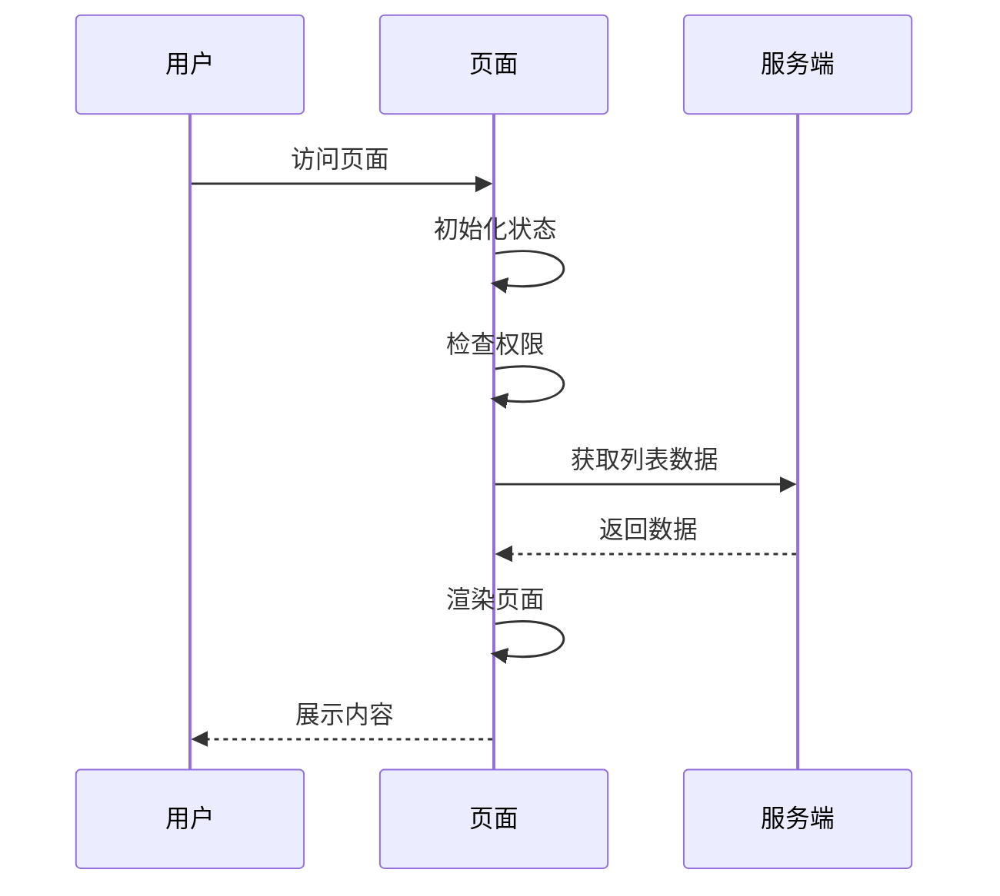

# 前端页面功能接口梳理模板

## 文档信息

| 项目 | 内容 |
|------|------|
| 页面名称 | [页面名称] |
| 页面路径 | [路由路径，如：/user/list] |
| 文档版本 | v1.0 |
| 创建日期 | [YYYY-MM-DD] |
| 最后更新 | [YYYY-MM-DD] |
| 负责人 | [姓名] |
| 相关后端开发 | [姓名] |

---

## 一、页面概述

### 1.1 页面描述
<!-- 简要描述页面的主要功能和业务目标 -->


### 1.2 业务场景
<!-- 描述页面在业务流程中的位置和使用场景 -->


## 二、功能模块

### 2.1 功能结构图

```
页面
├── 模块A
│   ├── 功能A-1
│   └── 功能A-2
├── 模块B
│   ├── 功能B-1
│   └── 功能B-2
└── 模块C
    └── 功能C-1
```

### 2.2 功能清单

| 编号 | 模块 | 功能名称 | 功能描述 | 优先级 | 状态 |
|------|------|----------|----------|--------|------|
| F001 | [模块名] | [功能名] | [详细描述] | P0/P1/P2 | 开发中/已完成 |
| F002 | | | | | |
| F003 | | | | | |

---

## 三、接口清单

### 3.1 接口汇总表

| 编号 | 接口名称 | 请求方法 | 接口路径 | 所属功能 | 是否需要Token |
|------|----------|----------|----------|----------|---------------|
| API-001 | [接口名称] | GET/POST/PUT/DELETE | /api/xxx | F001 | 是/否 |
| API-002 | | | | | |
| API-003 | | | | | |

### 3.2 接口时序图

```
┌────────┐     ┌────────┐     ┌────────┐
│ 前端   │     │ 网关   │     │ 后端   │
└───┬────┘     └───┬────┘     └───┬────┘
    │              │              │
    │  1. 请求1    │              │
    │─────────────>│              │
    │              │  2. 转发     │
    │              │─────────────>│
    │              │  3. 响应     │
    │              │<─────────────│
    │  4. 返回     │              │
    │<─────────────│              │
    │              │              │
```

---

## 四、接口详细说明

### API-001: [接口名称]

#### 基本信息

| 项目 | 内容 |
|------|------|
| 接口编号 | API-001 |
| 接口名称 | [名称] |
| 请求方法 | GET/POST/PUT/DELETE |
| 接口地址 | /api/v1/xxx |
| Content-Type | application/json |
| 认证方式 | Bearer Token / 无 |

#### 请求参数

**Query Parameters / Path Parameters:**

| 参数名 | 类型 | 必填 | 说明 | 示例值 |
|--------|------|------|------|--------|
| id | number | 是 | 用户ID | 1001 |
| name | string | 否 | 用户名 | test |

**Request Body:**

```json
{
  "field1": "value1",    // 字段说明
  "field2": "value2",    // 字段说明
  "field3": {
    "nestedField": "value"  // 嵌套字段说明
  }
}
```

#### 响应结果

**成功响应 (200):**

```json
{
  "code": 0,
  "message": "success",
  "data": {
    "id": 1001,
    "name": "示例数据",
    "createTime": "2024-01-01 12:00:00"
  }
}
```

**错误响应:**

| 状态码 | code | message | 说明 |
|--------|------|---------|------|
| 400 | 40001 | 参数错误 | 缺少必填参数 |
| 401 | 40101 | 未授权 | Token无效或过期 |
| 500 | 50001 | 服务器错误 | 内部错误 |

#### 调用时机
<!-- 描述在什么场景下调用此接口 -->


#### 相关功能
- F001: [功能名称]

---

### API-002: [接口名称]

#### 基本信息

| 项目 | 内容 |
|------|------|
| 接口编号 | API-002 |
| 接口名称 | [名称] |
| 请求方法 | POST |
| 接口地址 | /api/v1/xxx |
| Content-Type | application/json |
| 认证方式 | Bearer Token |

#### 请求参数

| 参数名 | 类型 | 必填 | 说明 | 示例值 |
|--------|------|------|------|--------|
| | | | | |

**Request Body:**

```json
{

}
```

#### 响应结果

```json
{
  "code": 0,
  "message": "success",
  "data": null
}
```

---

## 五、数据结构定义

### 5.1 实体定义

#### User 用户实体

| 字段名 | 类型 | 说明 | 必填 | 备注 |
|--------|------|------|------|------|
| id | number | 用户ID | 是 | 主键 |
| username | string | 用户名 | 是 | 唯一，4-20字符 |
| email | string | 邮箱 | 是 | 邮箱格式 |
| phone | string | 手机号 | 否 | 11位数字 |
| status | number | 状态 | 是 | 0-禁用，1-启用 |
| createTime | string | 创建时间 | 是 | 格式：YYYY-MM-DD HH:mm:ss |
| updateTime | string | 更新时间 | 否 | 格式：YYYY-MM-DD HH:mm:ss |

### 5.2 枚举定义

#### 用户状态 (UserStatus)

| 值 | 名称 | 说明 |
|----|------|------|
| 0 | DISABLED | 禁用 |
| 1 | ENABLED | 启用 |
| 2 | PENDING | 待审核 |

#### 订单状态 (OrderStatus)

| 值 | 名称 | 说明 |
|----|------|------|
| | | |

### 5.3 特殊展示规则

| 字段语义 | 展示形式 | 展示规则 | 场景区分 |
|---------|---------|---------|---------|
| 在线状态 | 彩色图标 | 连接正常→绿色图标；断开→红色图标；同步中→蓝色旋转图标；同步失败→橙色图标 | — |

### 5.4 通用响应结构

```typescript
interface ApiResponse<T> {
  code: number;       // 状态码：0-成功，非0-失败
  message: string;    // 提示信息
  data: T;            // 响应数据
  timestamp: number;  // 时间戳
}
```

### 5.5 分页请求/响应结构

**分页请求:**

```typescript
interface PageRequest {
  pageNum: number;    // 页码，从1开始
  pageSize: number;   // 每页条数，默认10
  sortField?: string; // 排序字段
  sortOrder?: 'asc' | 'desc'; // 排序方式
}
```

**分页响应:**

```typescript
interface PageResponse<T> {
  list: T[];          // 数据列表
  total: number;      // 总条数
  pageNum: number;    // 当前页码
  pageSize: number;   // 每页条数
  pages: number;      // 总页数
}
```

---

## 六、页面状态管理

### 6.1 状态结构

```typescript
interface PageState {
  // 列表数据
  list: ListItem[];
  // 加载状态
  loading: boolean;
  // 分页信息
  pagination: {
    current: number;
    pageSize: number;
    total: number;
  };
  // 筛选条件
  filters: {
    keyword: string;
    status: number | null;
    dateRange: [string, string] | null;
  };
  // 选中的数据
  selectedIds: number[];
}
```

### 6.2 状态流转

```
初始化 ──> 加载中 ──> 加载成功 ──> 展示数据
              │
              └──> 加载失败 ──> 展示错误 ──> 重试
```

---

## 七、交互流程

### 7.1 页面加载流程



### 7.2 操作流程

#### 新增操作

1. 点击「新增」按钮
2. 打开新增表单弹窗
3. 填写表单信息
4. 点击「确认」提交
5. 调用新增接口
6. 根据结果提示并刷新列表

#### 编辑操作

1. 点击列表项「编辑」按钮
2. 调用详情接口获取数据
3. 打开编辑表单弹窗（回填数据）
4. 修改表单信息
5. 点击「确认」提交
6. 调用更新接口
7. 根据结果提示并刷新列表

#### 删除操作

1. 点击列表项「删除」按钮
2. 弹出确认提示框
3. 用户确认删除
4. 调用删除接口
5. 根据结果提示并刷新列表

---

## 八、异常处理

### 8.1 错误码处理

| 错误码 | 处理方式 | 提示信息 |
|--------|----------|----------|
| 401 | 跳转登录页 | 登录已过期，请重新登录 |
| 403 | 显示无权限页 | 您没有权限访问此页面 |
| 404 | 显示404页面 | 页面不存在 |
| 500 | 显示错误提示 | 服务器异常，请稍后重试 |
| NETWORK_ERROR | 显示错误提示 | 网络连接失败，请检查网络 |

### 8.2 异常场景处理

| 场景 | 处理方式 |
|------|----------|
| 网络超时 | 显示超时提示，提供重试按钮 |
| 数据为空 | 显示空状态占位图 |
| 接口返回空数据 | 显示空状态占位图 |
| 表单校验失败 | 高亮错误字段，显示错误提示 |

---

## 九、性能要求

### 9.1 加载性能

| 指标 | 要求 |
|------|------|
| 首屏加载时间 | < 3s |
| 接口响应时间 | < 500ms |
| 列表渲染时间 | < 200ms |

### 9.2 优化策略

- [ ] 列表分页加载
- [ ] 图片懒加载
- [ ] 接口数据缓存
- [ ] 防抖/节流处理
- [ ] 虚拟列表（大数据量）

---

## 十、测试用例

### 10.1 功能测试

| 编号 | 测试场景 | 操作步骤 | 预期结果 |
|------|----------|----------|----------|
| TC001 | 列表加载 | 1. 访问页面 | 正确显示列表数据 |
| TC002 | 条件搜索 | 1. 输入搜索条件 2. 点击搜索 | 显示符合条件的数据 |
| TC003 | 新增数据 | 1. 点击新增 2. 填写表单 3. 提交 | 新增成功，列表刷新 |
| TC004 | 编辑数据 | 1. 点击编辑 2. 修改表单 3. 提交 | 修改成功，列表刷新 |
| TC005 | 删除数据 | 1. 点击删除 2. 确认 | 删除成功，列表刷新 |

### 10.2 边界测试

| 编号 | 测试场景 | 预期结果 |
|------|----------|----------|
| BT001 | 超长文本输入 | 自动截断或提示超出限制 |
| BT002 | 特殊字符输入 | 正确处理或过滤 |
| BT003 | 并发操作 | 数据一致性保证 |

---

## 十一、附录

### 11.1 相关文档

- [API文档地址]
- [设计稿地址]
- [需求文档地址]

### 11.2 变更记录

| 版本 | 日期 | 修改人 | 修改内容 |
|------|------|--------|----------|
| v1.0 | YYYY-MM-DD | [姓名] | 初始版本 |

---

## 使用说明

1. **填写文档信息**：完善页面基本信息和负责人
2. **梳理功能模块**：列出页面所有功能点
3. **整理接口清单**：汇总所有需要的接口
4. **详细定义接口**：填写每个接口的请求和响应
5. **定义数据结构**：统一数据模型和枚举
6. **描述交互流程**：说明用户操作流程
7. **异常处理**：规划错误场景处理方式
8. **测试用例**：编写功能测试用例

---

> **提示**：本模板使用 Markdown 格式编写，建议使用支持 Markdown 的编辑器查看和编辑。