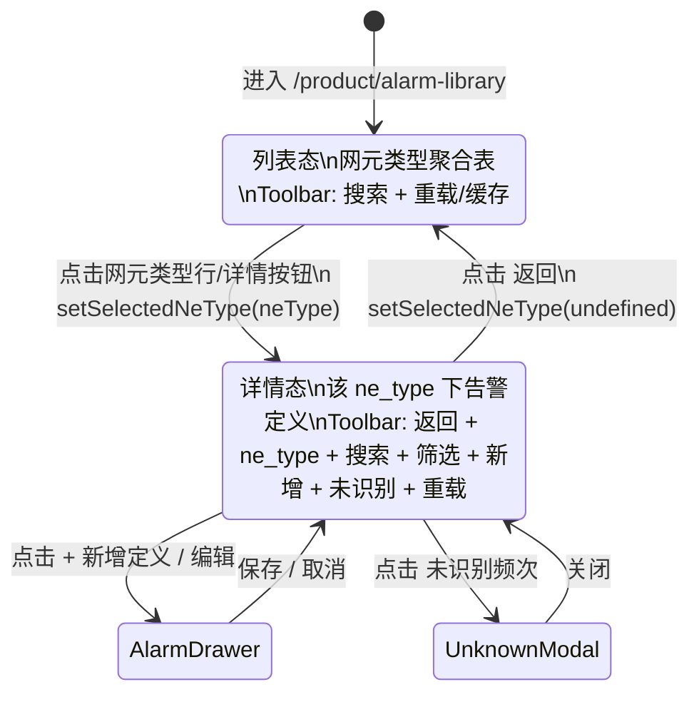

# 告警库页面重设计 — drill-down 主从导航(2026-05-29)

> 用户需求:`/product/alarm-library` 改成与 `/product/param-model` 一致的 drill-down 主从结构。
> 本文档为 **审核前的设计方案**,不动代码,等用户拍板后再进 `/dev-pipeline`。
> 参考实施:T-0178(param-model 已落地 14 commit,可作 UI/后端模式参照)。

---

## 1. 现状

### 1.1 现有 UI(单层扁平表)

```
┌───────────────────────────────────────────────────────────────────────────────┐
│ [搜索] [网元类型▼] [严重级别▼] [识别状态▼] [未识别频次] [重载XML] [刷新缓存] [+新增定义] │
├──┬───────┬───────┬───────┬───────┬───────┬──────┬───────┤
│ id│ 中文名 │ 英文名 │ 网元类型│ 严重级别│ 事件类型│ UI可见│ 操作   │
├──┼───────┼───────┼───────┼───────┼───────┼──────┼───────┤
│..│ ...   │ ...   │ BLQ   │ ...   │ ...   │ ✓    │ 👁 🗑  │  ← N 行 alarm definition(平铺)
└──┴───────┴───────┴───────┴───────┴───────┴──────┴───────┘
```

**问题**:
- 一个 ne_type 下可能有几十/几百个告警定义,扁平表难浏览
- 网元类型筛选与表中"网元类型"列重复 — UX 冗余
- "新增定义"按钮在顶部,但用户操作习惯是"先选 ne_type,再加定义"
- 操作图标 `EyeOutlined`(查看/编辑双职责)与 param-model 的 `EditOutlined` 分离不一致

### 1.2 后端数据模型

- 表 `alarm_definitions`(单表),含列 `ne_type VARCHAR`
- 现有 API `GET /alarm-definitions?ne_type=&keyword=&severity_code=&page=&page_size=`
- 已支持按 ne_type 筛选,但**无 ne_type 聚合 API**(无法一次性拿到 ne_type 清单 + 各组统计)

---

## 2. 目标新结构

### 2.1 总体导航(参考 param-model 二层 drill-down)

```
列表态(/product/alarm-library):
  ┌──────────────────────────────────────────────────────┐
  │ [搜索: ne_type 名称]  [重载 XML] [刷新缓存]         │ ← 顶部 toolbar 单行
  └──────────────────────────────────────────────────────┘
  ┌──────────────────────────────────────────────────────┐
  │ 网元类型表:点击行 → 进二级页面                       │
  └──────────────────────────────────────────────────────┘

详情态(同 URL,前端 state 切换):
  ┌──────────────────────────────────────────────────────┐
  │ [← 返回] BLQ 的告警定义  [搜索: identifier/名称]      │
  │                      [+ 新增定义] [重载 XML] [刷新缓存] │
  └──────────────────────────────────────────────────────┘
  ┌──────────────────────────────────────────────────────┐
  │ 告警定义表(只显该 ne_type 下的)                     │
  └──────────────────────────────────────────────────────┘
```

### 2.2 列表态(NeTypesTab)— ASCII 布局

```
┌────────────────────────────────────────────────────────────────────────────────────────────┐
│ [搜索 ne_type ▌                  ]                       [⬇ 重载 XML] [↻ 刷新缓存]        │
└────────────────────────────────────────────────────────────────────────────────────────────┘
┌──────────────┬──────────┬──────────┬─────────────────────────────────┬────────────┬──────────┐
│ 网元类型     │ 加载源   │ 告警总数 │ 严重级别分布                    │ 已识别/未识别 │ 操作     │
├──────────────┼──────────┼──────────┼─────────────────────────────────┼────────────┼──────────┤
│ BLQ         →│ BLQ.xml │   142    │ ●46 ●38 ●35 ●23(致命/严重/一般/警告)│  140 / 2   │ 📋 详情  │
│ BTS         →│ BTS.xml │    87    │ ●12 ●22 ●30 ●23                │   87 / 0   │ 📋 详情  │
│ MLN         →│ MLN.xml │   215    │ ●68 ●55 ●50 ●42                │  211 / 4   │ 📋 详情  │
│ ENB_DEFAULT →│ENB_*.xml│    96    │ ●20 ●30 ●26 ●20                │   95 / 1   │ 📋 详情  │
│ ... 共 9 行(每个 ne_type 一行)                                                          │
└──────────────┴──────────┴──────────┴─────────────────────────────────┴────────────┴──────────┘
```

加载源列与 param-model 列表保持视觉一致;若多个 XML 文件归到同一 ne_type,展示首个(API 已 GROUP BY 自然去重)。

**细节**:
- 网元类型一列:Tag `color="blue"` 突出 + `→` 箭头暗示 drill-down
- 严重级别分布:4 个着色圆点(红/橙/金/蓝)+ 数字 — 直观看出严重度构成
- 已识别 / 未识别 = 后端的 `count(*) - count(is_unknown)` / `count(is_unknown)`,绿色 / 橙色
- 操作列只有一个"详情"按钮(📋 `FileSearchOutlined`),等价于点击网元类型名
- **去掉**:网元类型筛选 / 严重级别筛选(详情态再筛)/ 识别状态筛选(详情态)/ 新增定义按钮(详情态)
- **保留**:重载 XML / 刷新缓存 / 未识别频次(挪到详情态对应 ne_type 上下文)

### 2.3 详情态(DefinitionsTab)— ASCII 布局

```
┌─────────────────────────────────────────────────────────────────────────────────────────┐
│ [← 返回] BLQ 的告警定义        [搜索 identifier/名称 ▌]  [严重级别▼] [识别状态▼]      │
│                                              [⚠ 未识别频次] [+ 新增定义] [⬇ 重载XML]    │
└─────────────────────────────────────────────────────────────────────────────────────────┘
┌──────────────┬───────────┬────────────┬──────────┬────────┬──────┬────────────┐
│ identifier   │ 中文名     │ 英文名     │ 严重级别  │ 事件类型│ UI可见│ 操作       │
├──────────────┼───────────┼────────────┼──────────┼────────┼──────┼────────────┤
│ [Tag] 12001 │ 链路中断   │ Link down  │ ●致命     │ ...    │ ✓    │ ✏️ ✓ 🗑   │
│ [Tag] 12002 │ 温度过高   │ Over temp  │ ●严重     │ ...    │ ✓    │ ✏️ ✓ 🗑   │
│ ... (该 ne_type 下所有定义,分页 20/页)                                          │
└──────────────┴───────────┴────────────┴──────────┴────────┴──────┴────────────┘
```

**细节**:
- 顶部 toolbar 第二行(以 antd `Space wrap` 自动折行)
- 左侧:返回 + 当前 ne_type 名(Text strong)
- 中间:搜索 + 严重级别 + 识别状态(原 ne_type 筛选已去掉)
- 右侧:未识别频次(过滤为当前 ne_type)+ **新增定义**(默认填 ne_type)+ 重载 XML
- 操作列三个图标(与 param-model 风格统一):
  - `EditOutlined` ✏️ — 编辑(打开 AlarmDefinitionDrawer,与现有一致)
  - `EyeOutlined` ✓ — 查看(只读模式打开 Drawer)— 可选,若 Drawer 已合一可省
  - `DeleteOutlined` 🗑 — 删除(Popconfirm + 红色 danger)
- 网元类型列去掉(toolbar 已显示)

### 2.4 操作图标统一规范(对齐 param-model)

| 动作 | 图标 | antd 名 | 按钮属性 |
|------|------|---------|---------|
| 编辑 | ✏️ | `EditOutlined` | `size="small"` |
| 查看 | 👁 | `EyeOutlined` | `size="small"`(可选) |
| 删除 | 🗑 | `DeleteOutlined` | `size="small" danger`,内置不可删时置灰 + Tooltip |
| 新增 | + | `PlusOutlined` | `type="primary"`,详情态 toolbar 右侧 |
| 重载 XML | ⬇ | `CloudDownloadOutlined` | `danger`(destructive) |
| 刷新缓存 | ↻ | `ReloadOutlined` | 默认 |
| 详情 | 📋 | `FileSearchOutlined` | 列表态行操作,等价于点击行 |
| 未识别频次 | ⚠ | `WarningOutlined` | 详情态 toolbar |

---

## 3. 后端改动

### 3.1 新增 API:ne_type 聚合

**端点**:`GET /api/v1/alarm-definitions/ne-types?keyword=`

**响应**:
```json
{
  "ret": 1,
  "msg": "ok",
  "data": {
    "items": [
      {
        "ne_type": "BLQ",
        "total": 142,
        "severity_breakdown": {
          "critical": 46,
          "major": 38,
          "minor": 35,
          "warning": 23
        },
        "known_count": 140,
        "unknown_count": 2,
        "loaded_from": "BLQ.xml"
      }
    ],
    "total": 9
  }
}
```

**实现思路**:
- 单条 SQL `GROUP BY ne_type` 聚合:
  ```sql
  SELECT
    ne_type,
    COUNT(*) AS total,
    COUNT(*) FILTER (WHERE severity_code IN (1, 31001)) AS critical,
    COUNT(*) FILTER (WHERE severity_code IN (2, 31002)) AS major,
    COUNT(*) FILTER (WHERE severity_code IN (3, 31003)) AS minor,
    COUNT(*) FILTER (WHERE severity_code IN (4, 31004)) AS warning,
    COUNT(*) FILTER (WHERE is_unknown = false) AS known_count,
    COUNT(*) FILTER (WHERE is_unknown = true) AS unknown_count
  FROM alarm_definitions
  WHERE ne_type ILIKE $1
  GROUP BY ne_type
  ORDER BY ne_type;
  ```
- 单条 SQL,无 N+1 查询;9 行 ne_type 量级,响应 < 50ms
- `loaded_from` **决策 4 = 加**:走 migration 加 `loaded_from VARCHAR(256)` 列 + Loader.batchUpsertAlarms 改写填值(写 `filepath.Base(xmlPath)`,如 `BLQ.xml`)

### 3.2 现有 API 复用

- `GET /alarm-definitions?ne_type=BLQ&keyword=&severity_code=&page=&page_size=` — 二级页面直接复用
- `POST /alarm-definitions` — 新增定义,前端默认填 ne_type
- `PUT /alarm-definitions/:identifier` — 编辑
- `DELETE /alarm-definitions/:identifier` — 删除(单条)
- `GET /alarm-definitions/unknown-stats?productId=&days=` — 未识别频次(可按 ne_type 过滤,待评估)
- `POST /alarm-definitions/import-directory` — 重载 XML(两态都暴露,与现状一致)
- `POST /alarm-definitions/cache/refresh` — 刷新缓存

### 3.3 后端工作量

| 项 | 工作量 |
|----|--------|
| migration `000216_alarm_definitions_add_loaded_from.sql`(ALTER TABLE + Loader 改写) | 0.3d |
| Loader.batchUpsertAlarms 写 `loaded_from = filepath.Base(xmlPath)`(空字段兼容) | 0.1d |
| `GET /alarm-definitions/ne-types` handler + service + repo SQL(SELECT MIN(loaded_from)) | 0.3d |
| 单测(SQL filter + 严重级别映射 + 排序 + loaded_from 字段填值) | 0.3d |
| E2E `GET /ne-types` 加 1 条 assert(loaded_from 非空 + 命中预期) | 0.1d |
| **合计** | **1.1d** |

---

## 4. 前端改动

### 4.1 文件结构(对齐 param-model)

```
omcmb/webcode/src/pages/product/alarm-library/
├── index.tsx                  ← 主页面,管 selectedNeType state,switch 列表/详情
├── NeTypesTab.tsx             ← 新增(列表态)
├── DefinitionsTab.tsx         ← 新增(详情态,实质是把现有 index.tsx 精简)
├── AlarmDefinitionDrawer.tsx  ← 不变
└── UnknownStatsModal.tsx      ← 不变(可选:加 ne_type 过滤参数)
```

### 4.2 API / Hook / Types(frontend-core)

```
omcmb/frontend-core/src/types/alarmDefinition.ts
  + AlarmDefinitionNeType: { neType, total, severityBreakdown, knownCount, unknownCount, loadedFrom? }
  + AlarmDefinitionNeTypeListResponse

omcmb/frontend-core/src/services/api/alarmDefinitionApi.ts
  + listNeTypes(keyword?: string): Promise<AlarmDefinitionNeTypeListResponse>

omcmb/frontend-core/src/hooks/api/useAlarmDefinitions.ts
  + useAlarmDefinitionNeTypes(keyword?: string)

omcmb/frontend-core/src/mock/services/alarmDefinitionService.ts
  + mock listNeTypes(由 mock data 聚合)
```

### 4.3 index.tsx 改造(参考 param-model/index.tsx)

```typescript
export default function AlarmLibraryPage() {
  const [selectedNeType, setSelectedNeType] = useState<string | undefined>();
  const [keyword, setKeyword] = useState('');
  const inDetail = Boolean(selectedNeType);

  return (
    <div style={{ padding: 16 }}>
      <Card size="small" style={{ marginBottom: 12 }}>
        <Space style={{ width: '100%', justifyContent: 'space-between' }}>
          {inDetail ? (
            <Space>
              <Button icon={<ArrowLeftOutlined />} onClick={() => setSelectedNeType(undefined)}>
                返回
              </Button>
              <Text strong>{selectedNeType} 的告警定义</Text>
            </Space>
          ) : (
            <Input.Search placeholder="搜索网元类型..." />
          )}
          <Space>
            {/* 列表态 + 详情态共享:重载 XML / 刷新缓存 */}
            {/* 详情态额外:+ 新增定义 / 未识别频次 */}
          </Space>
        </Space>
      </Card>

      {inDetail
        ? <DefinitionsTab neType={selectedNeType!} />
        : <NeTypesTab keyword={keyword} onSelect={setSelectedNeType} />}
    </div>
  );
}
```

### 4.4 NeTypesTab — 关键列定义

```typescript
const columns = [
  {
    title: '网元类型',
    dataIndex: 'neType',
    width: 160,
    render: (v, row) => (
      <Button type="link" onClick={() => onSelect(v)}>
        <Tag color="blue">{v}</Tag>
      </Button>
    ),
  },
  { title: '告警总数', dataIndex: 'total', width: 110, render: v => <b>{v}</b> },
  {
    title: '严重级别分布',
    width: 280,
    render: (_, row) => (
      <Space size={8}>
        <SeverityDot color="red"    count={row.severityBreakdown.critical} title="致命" />
        <SeverityDot color="orange" count={row.severityBreakdown.major}    title="严重" />
        <SeverityDot color="gold"   count={row.severityBreakdown.minor}    title="一般" />
        <SeverityDot color="blue"   count={row.severityBreakdown.warning}  title="警告" />
      </Space>
    ),
  },
  {
    title: '已识别 / 未识别',
    width: 150,
    render: (_, row) => (
      <Space>
        <Tag color="success">{row.knownCount}</Tag>
        <Tag color={row.unknownCount > 0 ? 'warning' : 'default'}>{row.unknownCount}</Tag>
      </Space>
    ),
  },
  {
    title: '操作',
    width: 100,
    render: (_, row) => (
      <Button size="small" icon={<FileSearchOutlined />} onClick={() => onSelect(row.neType)}>
        详情
      </Button>
    ),
  },
];
```

### 4.5 DefinitionsTab — 现有 index.tsx 精简

- 入参:`neType: string`
- 内部 filter 强制 `ne_type=props.neType`,不可改
- 去掉网元类型筛选 + 网元类型列
- 保留:搜索 / 严重级别筛选 / 识别状态筛选 / 未识别频次(自动带 ne_type 上下文)/ 新增 / 重载 / 缓存
- 表格列与现有一致,去掉 `neType` 列
- 操作列改为 `EditOutlined + DeleteOutlined`(去 `EyeOutlined`,Drawer 通过新加的"只读"toggle 内部控制)

### 4.6 前端工作量

| 项 | 工作量 |
|----|--------|
| frontend-core types + API + hook + mock | 0.3d |
| NeTypesTab(含 SeverityDot 小组件) | 0.5d |
| DefinitionsTab(由现有 index.tsx 精简) | 0.4d |
| index.tsx 主从切换 + toolbar 单行 | 0.3d |
| 三皮肤(webcode/webcode-v2/v3)typecheck 验证 | 0.2d |
| 单测(NeTypesTab 列渲染 + index 切换逻辑) | 0.3d |
| **合计** | **2.0d** |

---

## 5. UI 示意图(Mermaid 状态机)



---

## 6. 工期总览(决策 4 = 加 + 决策 3 URL 同步)

| 阶段 | 工作量 |
|------|--------|
| 后端聚合 API + migration 加 loaded_from 列 + Loader 改写 | 1.1d |
| 前端 3 文件改造 + Hook/Types + URL 同步(`useSearchParams`) | 2.2d |
| E2E(列表→详情→新增→删除流 + URL F5 持久化断言) | 0.3d |
| 文档(本设计 + CLAUDE.md §5.4 alarm-library 段)| 0.2d |
| **合计** | **3.8d** |

可按 M 估算(>3d <5d),sprint 内单 task 处理。

---

## 7. 非目标(明示不做)

- 不改 alarm_definitions 表 schema(`loaded_from` 列暂不加,可留 follow-up)
- 不引入 ne_type 树形结构(平铺 9 个即可,不需要 group)
- 不做 ne_type 维度的 RBAC(沿用现有 super_admin)
- 不动 AlarmDefinitionDrawer 内部 form(只在外部传 `defaultNeType`)
- 不做未识别频次按 ne_type 维度的二次聚合(沿用全局,详情态调用时传 ne_type 过滤)

---

## 8. 风险

| 风险 | 缓解 |
|------|------|
| 三皮肤 typecheck 需同步,webcode-v2/v3 可能有自己版本 alarm-library 页 | 单 grep 检查;若有则同步改 / 不动 |
| AlarmDefinitionDrawer 与 EyeOutlined 双职责(查看 + 编辑),改 EditOutlined 后需确认默认编辑模式不会让用户误改 | Drawer 可加"取消"按钮显式退出 |
| ne_type 聚合 API 9 行规模小,但严重级别映射写错会让红/橙颜色错 | 单测覆盖映射表 |
| 移除"网元类型"筛选后,从外部带 ?neType=X 进入想直接看某 ne_type 的用户路径丢失 | URL 用 hash `#BLQ` 或 query `?ne_type=BLQ` 让 index 启动期自动 drill 进详情(可选,P1 不做) |

---

## 9. 用户决策(2026-05-29 已拍板)

| # | 决策项 | 拍板结果 | 实施影响 |
|---|--------|---------|---------|
| 1 | 严重级别分布显示 | ✅ **4 色圆点 + 数字**(本方案默认) | 已写入 §2.2,前端需做 SeverityDot 小组件 |
| 2 | 未识别频次按钮位置 | ✅ **详情态 toolbar 右侧**(本方案默认) | UnknownStatsModal 调用时传 `neType=props.neType` 作过滤 |
| 3 | URL 导航 | ✅ **URL 同步 + 详情态保留"返回"按钮** | 用 `useSearchParams` 把 selectedNeType ↔ `?ne_type=BLQ` 同步,F5 刷新仍在详情态;新增 0.2d 工期 |
| 4 | `loaded_from` 列 | ✅ **加**(走 migration + Loader 改写)| §2.2 ASCII 已加;§3.1 SQL `MIN(loaded_from)` 聚合;§3.3 工期 +0.5d → 后端 1.1d |
| 5 | 新增定义 ne_type 是否可改 | ✅ **预填且锁定** | Drawer 加 `defaultNeType?: string` + `lockNeType?: boolean` 入参,锁定时 Form.Item disabled |
| 6 | EyeOutlined 是否保留 | ✅ **去掉**(Edit 含查看) | DefinitionsTab 操作列只剩 ✏️ + 🗑;AlarmDefinitionDrawer 内部保留"取消"按钮显式退出避免误改 |

### 决策 4 详细说明(待用户澄清)

**问题原文**:"列表态(NeTypesTab)的网元类型表中,要不要加一列显示这个 ne_type 的告警定义加载自哪个 XML 文件?"

**示例展示效果**:

不加列(当前方案):
```
│ 网元类型 │ 告警总数 │ 严重级别分布     │ 已识别/未识别 │ 操作  │
│ BLQ    →│   142   │ ●46●38●35●23    │  140 / 2     │ 📋   │
```

加列(对齐 param-model 列表的"加载源"):
```
│ 网元类型 │ 加载源   │ 告警总数 │ 严重级别分布     │ 已识别/未识别 │ 操作 │
│ BLQ    →│ BLQ.xml │   142   │ ●46●38●35●23    │ 140 / 2     │ 📋  │
```

**两种选择的差别**:

| 维度 | 加 `loaded_from` 列 | 不加 |
|------|-----|-----|
| 后端工作 | +迁移加列(`ALTER TABLE alarm_definitions ADD COLUMN loaded_from`)+ Loader 改写填值 + 聚合 API SELECT 这一列 | 0 |
| 前端工作 | 列表多 1 列 + 解析 | 0 |
| 工期 | **+0.5d** | 0 |
| 用户价值 | 多数情况(BLQ↔BLQ.xml)信息冗余;极少数 ne_type 与文件名不同名时有用 | 用户从 ne_type 名能推断 99% 情况 |
| 后期演化 | 如果将来要支持"上传自定义 alarm XML"(类似 T-0178)时这一列必须有 | 那时再加 migration 也来得及 |

**我的推荐**:**先不加**,工期 3.1d 不变。后续如果业务侧反馈"需要看哪个 XML 提供的"再走单独 follow-up 任务。

**等你回复 "决策 4 = 不加"(或 "决策 4 = 加")之后,我就**:
1. 锁死 §9 表格
2. 起 PRD `docs/project/prd/F04-alarm-library-redesign.md`
3. 入 backlog 拿 T-NNNN(估算 M = 3.1d 或 3.6d)
4. self-triage 进 sprint
5. `/dev-pipeline pick T-NNNN`

---

### 决策 4 详细说明(已澄清)

用户拍板 **加 `loaded_from` 列**。理由:与 param-model 列表风格统一,且为未来"上传自定义 alarm XML"留好数据通路。

实施改动:
- migration `000216_alarm_definitions_add_loaded_from.sql`:`ALTER TABLE alarm_definitions ADD COLUMN loaded_from VARCHAR(256)`(允许 NULL,历史数据不回填,Loader 重载后自动填)
- Loader `batchUpsertAlarms` 写 `loaded_from = filepath.Base(xmlPath)`(如 `BLQ.xml`)
- ne-types 聚合 API SELECT `MIN(loaded_from)` 作为该 ne_type 代表(若多个 XML 归一 ne_type,展示首个)
- 前端列表多 1 列,Tag 着色与 param-model 一致

---

**版本历史**:
- 2026-05-29 v1.0 初稿
- 2026-05-29 v1.1 5/6 决策锁定;决策 4 待澄清
- 2026-05-29 v1.2 6/6 决策全锁定(决策 4 = 加);工期 3.1d → **3.8d**;可走 PRD + backlog + dev-pipeline
