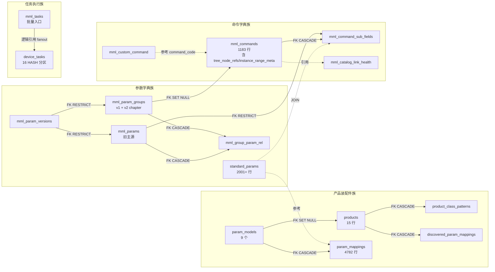

# MML 控制台（/mml/console）全栈架构分析

> 日期：2026-05-21
> 范围：前端组件 + Zustand 状态 + 7 个后端 API + service/repo SQL + 14 张 DB 表 + ER 关系
> 目的：为后续维护 / 新人 onboarding / 设计变更 提供完整的全栈索引

---

## 0. 导论

MML 控制台是 OMC-R 中**面向运维操作的批量命令下发台**，承担"勾选设备 → 选择命令 → 配置参数 → 下发执行"四步交互。底层架构：

- **前端三栏布局**：`DeviceTree`（设备选择）+ `CommandTree`（命令树）+ `RightPanel`（控制面板）
- **后端 7 个 HTTP API**：命令树查询 / 子字段查询 / MML 渲染 / MML 解析 / 旧执行通道 / R-9.2 结构化执行 / R-8.5 兼容性
- **数据层 14 张表**：分 3 族 —— 参数字典族 / 命令字典族 / 任务执行族

---

## 1. 前端架构

### 1.1 路由 + 入口

| 维度 | 内容 |
|---|---|
| 路由 | `webcode/src/router/routes.tsx:289` — `/mml/console` lazy load |
| 入口 | `omcmb/webcode/src/pages/mml/Console/index.tsx:8` `MMLConsole` |
| 保护 | `withSuspense(MMLConsole)` + ErrorBoundary |

### 1.2 组件树（含 LOC）

```
MMLConsole (index.tsx)
├─ StepBar (25 LOC)                          ─ 4 步进度条
├─ DeviceTree (335 LOC)                      ─ 左栏：搜索 + 产品类型筛选 + 设备列表
│   └─ BatchSnModal (190 LOC)                ─ 批量 SN 输入弹窗
├─ CommandTree (641 LOC)                     ─ 中栏：命令树 + R-8.5 ⚠️ 装饰 + Customized 模板
│   └─ AddTemplateModal (~200 LOC)           ─ 自定义命令新建/编辑
└─ RightPanel (245 LOC)                      ─ 右栏：操作面板 + 参数路径指定 Tab
    ├─ TerminalPanel (214 LOC)               ─ 终端输出显示（执行后结果回显）
    ├─ InstanceArityInput (168 LOC)          ─ R-4 多实例 {i}/{j}/{k} 输入 + R-4.1.1 范围校验
    ├─ ActiveSubView (per operationType):
    │   ├─ SubFieldChecklist (118 LOC)       ─ LST：勾选要查询的 sub_field
    │   ├─ SubFieldInputList (94 LOC)        ─ MOD/ADD：sub_field + 值输入
    │   └─ InstancePicker (191 LOC)          ─ RMV：现有实例选择器
    ├─ ConsoleActionBar (109 LOC)            ─ 执行按钮 + 摘要 + LST 全选 toggle
    └─ ParameterPathCommand (247 LOC)        ─ 副 Tab：路径直接编辑（专家模式）
```

总计 ~2940 LOC，CommandTree 占 22%。

### 1.3 Zustand Store（`frontend-core/src/store/mmlConsoleStore.ts`）

| 字段 | 类型 | 用途 |
|---|---|---|
| `selectedDeviceSns` | `string[]` | 已选设备 SN 列表（从 DeviceTree 镜像）|
| `statements` | `Statement[]` | 当前 Console 命令缓冲区 |
| `mmlText` | `string` | MML 文本（renderStatementsLocal 计算）|
| `activeStatementUid` | `string \| null` | 当前焦点 statement |
| `lang` | `'zh-CN' \| 'en-US'` | UI 语言 |
| `parseErrors` | `ParseError[]` | parse mutation 错误 |
| `syncSource` | `'ui' \| 'text' \| 'none'` | 双向同步源标记（防循环订阅） |
| `productClassFilter` | `string` | R-8.5 当前选中产品类型（DeviceTree 镜像）|
| `parsePending` / `parseDebounceTimer` | — | parse 防抖控制 |

**Actions**：18 个，含 `setSelectedDeviceSns` / `setProductClassFilter` / `replaceStatement` / `setValue` / `setRmvIndices` / `setInstanceSelectors` / `setMmlTextDebounced` 等。

**订阅关系**：DeviceTree 写设备 → ConsoleActionBar 读数；CommandTree 写 statement → RightPanel 读渲染；Console 单向镜像 `productClassFilter` → CommandTree 订阅。

### 1.4 API 调用清单（前端视角）

| 来源 | Hook / Method | HTTP | 触发时机 |
|---|---|---|---|
| `useGroupTree` | mmlApi.buildGroupTree | `GET /mml/group-tree` | 首屏，staleTime 30min |
| `useCommandSubFields` | mmlApi.getCommandSubFields | `GET /mml/commands/:id/sub-fields` | 选中命令时，staleTime 30min |
| `useCommandCompatibility` | mmlApi.getCommandCompatibility | `GET /mml/console/command-compatibility?product_class=` | 产品类型变化，staleTime 5min |
| `useRenderMML` | mmlApi.renderMML | `POST /mml/render` | 复杂模板兜底（一般走本地 renderStatementLocal）|
| `useParseMML` | mmlApi.parseMML | `POST /mml/parse` | MML textbox 改 300ms 防抖 |
| `useExecuteStatements` | mmlApi.executeStatements | `POST /mml/execute-statements` | 旧通道（v2.4 D37 已下线 MmlEditor 后基本不用）|
| `useExecuteStatementsStructured` | mmlApi.executeStatementsStructured | `POST /mml/console/execute-statements-structured` | R-9.2 主通道 |

**自定义模板（Customized）**：mmlApi.getTemplates / createTemplate / updateTemplate / deleteTemplate / cloneTemplate → REST `/mml/templates*`

**附带依赖**：deviceApi.getList（左栏设备列表）+ `useDictionary('product_type')`（产品类型下拉字典）+ userStore（admin 角色判断）

---

## 2. 后端 7 个 API 详细流程

### 2.1 `GET /mml/group-tree`

| 维度 | 内容 |
|---|---|
| 注册 | `console_handler.go:67` GetGroupTree |
| Query | `root` / `lang` / `format` |
| 返回 | `200 { tree: GroupTreeNode[] }` |
| Service | `console_service.go:52` BuildGroupTree（透传 repo）|
| Repo | `group_tree_repository.go:368-406` PgGroupTreeRepository.BuildTree |
| 关键 SQL | `SELECT g.*, c.* FROM mml_param_groups g LEFT JOIN mml_commands c ON c.group_id=g.id WHERE g.path IS NOT NULL [AND g.path <@ $1::ltree] AND g.group_code [NOT] LIKE 'chapter:%' ORDER BY g.path, g.display_order, c.operation_type, c.logical_code, c.command_code` |
| 读表 | `mml_param_groups`, `mml_commands` |

注：v1/v2 模式由 `v2Mode` flag 控制 `chapter:%` 过滤方向。

### 2.2 `GET /mml/commands/:id/sub-fields`

| 维度 | 内容 |
|---|---|
| 注册 | `console_handler.go:68` GetCommandSubFields |
| Path | `:id` UUID |
| Query | `lang` |
| 返回 | `200 { sub_fields: SubFieldDTO[] }` |
| Service | `console_service.go:108` GetCommandSubFields（按 lang 派生顶级字段）|
| Repo | `admin_repository.go:244-265` ListSubFieldsEnriched |
| 关键 SQL | `SELECT csf.*, sp.standard_path AS tr069_path, COALESCE(sp.data_type,'string') AS value_type, COALESCE(sp.access,'READ_ONLY') AS access_type, (sp.entry_type='object') AS is_object, COALESCE(sp.change_applies,'Immediate') AS change_applies, '{}'::jsonb AS constraint_text_i18n FROM mml_command_sub_fields csf JOIN standard_params sp ON sp.id=csf.standard_path_id WHERE csf.command_id=$1 ORDER BY csf.sort_order, csf.mml_code` |
| 读表 | `mml_command_sub_fields`, `standard_params` |

注：`constraint_text_i18n` 当前硬编码 `'{}'`（R-4.2.1 已 deferred 为 P2 可选）。

### 2.3 `POST /mml/render`

| 维度 | 内容 |
|---|---|
| 注册 | `console_handler.go:69` PostRender |
| Body | `{ command_id, operation_type, selected_sub_field_ids, values, rmv_instance_index }` |
| 返回 | `200 { mml_string: "LST DEVICE_INFO ..." }` / `404 ErrCommandNotFound` |
| Service | `console_service.go:148` RenderMML |
| Repo | `commandRepo.GetByID` + `subFieldRepo.ListByCommand` |
| 关键 SQL | `SELECT * FROM mml_commands WHERE id=$1`<br/>`SELECT * FROM mml_command_sub_fields WHERE command_id=$1` |
| 读表 | `mml_commands`, `mml_command_sub_fields` |

注：本端点很少被前端调用（store 默认走本地 `renderStatementsLocal`），仅复杂模板时兜底。

### 2.4 `POST /mml/parse`

| 维度 | 内容 |
|---|---|
| 注册 | `console_handler.go:70` PostParse |
| Body | `{ mml_string, lang }` |
| 返回 | **始终 200** `{ statements, parse_errors }`（单条失败不中断）|
| Service | `console_service.go:192` ParseMML（注入自身作 CommandLookup）|
| Repo | 反查 `commandRepo.GetByCode(command_code)` |
| 关键 SQL | `SELECT * FROM mml_commands WHERE command_code=$1` |
| 读表 | `mml_commands` |

### 2.5 `POST /mml/execute-statements`

| 维度 | 内容 |
|---|---|
| 注册 | `console_handler.go:71` PostExecuteStatements |
| Body | `{ statements, device_sns, task_name, creator, executor, execute_type }` |
| 返回 | `201 MMLTask` / `400 ErrInvalidRequest` / `404 ErrCommandNotFound` / `422 ErrProductClassUnresolved` |
| Service | `console_executor.go:77` ExecuteStatements |
| 编译链 | BuildStatementCommands → buildStatementCommandEntries（**R-4.3** 支持 ADD with values 拆 2 行）→ taskCreator.CreateAndFanoutTask |
| 关键 SQL | INSERT INTO mml_tasks (...); 后续 fanout 写 device_tasks |
| 读/写 | 读 mml_commands / mml_command_sub_fields；写 mml_tasks（fanout 写 device_tasks）|

### 2.6 `POST /mml/console/execute-statements-structured`（R-9.2 主通道）

| 维度 | 内容 |
|---|---|
| 注册 | `console_handler.go:72` PostExecuteStatementsStructured |
| Body | 同上但 paths/values 是结构化 standardPath 数组（前端已 statementToStructured 转换）|
| 返回 | `201 MMLTask` / `422 ErrUnknownPaths { unknown_paths, command_id }` |
| Service | StructuredToStatement → ExecuteStatements 复用主链路 |
| 后端翻译 | fanout 时按设备 product_class → Translator standardPath→privatePath（discovered → default → passthrough）|
| 关键 SQL | 同 #2.5 + ParamRegistry 查 param_mappings/discovered_param_mappings |
| 读/写 | 同 #2.5 + 读 param_mappings, discovered_param_mappings, products, product_class_patterns |

### 2.7 `GET /mml/console/command-compatibility`（R-8.5）

| 维度 | 内容 |
|---|---|
| 注册 | `console_handler.go:73` GetCommandCompatibility |
| Query | `product_class` 必填 |
| 返回 | `200 { product_class, product_id, param_model_id, unsupported_command_ids: UUID[] }` / `404 ErrProductClassNotFound` / `503 service nil` |
| Service | `command_compatibility.go:165` CompatibilityService.GetCommandCompatibility |
| 链路 | ProductRegistry.MatchProductClass → ParamRegistry.GetByParamModel → ListAllCommandPaths → ComputeCommandCompatibility |
| 关键 SQL | `SELECT id, COALESCE(NULLIF(tree_node_refs,'[]'::jsonb), to_jsonb(target_paths), '[]'::jsonb) AS paths FROM mml_commands` |
| 读表 | `mml_commands`, `products`, `product_class_patterns`, `param_models`, `param_mappings` |

---

## 3. DB Schema + 表关系

### 3.1 14 张表概览（按族）

| 族 | 表 | 角色 | 当前规模（dev DB） |
|---|---|---|---|
| **参数字典** | `mml_param_versions` | 版本管理 | 1 行 |
| | `mml_param_groups` | 参数树分组（LTREE）| 18 chapter + N v1 group |
| | `mml_params` | 参数定义（旧主源）| - |
| | `mml_group_param_rel` | 多对多桥接 | - |
| | `standard_params` | OMC 统一标准参数字典 | 2001+ 行 |
| **产品装配** | `products` | 产品装配件 | 15 行 |
| | `product_class_patterns` | productClass 正则路由 | 多条 |
| | `param_models` | 参数模型 | 9 个 |
| | `param_mappings` | 默认 standardPath↔privatePath | 4782 行 |
| | `discovered_param_mappings` | 设备发现映射 | 按 (productID, swVersion) |
| **命令字典** | `mml_commands` | 命令叶子（含 tree_node_refs + instance_range_meta）| 1183 行（含 v1+v2）|
| | `mml_command_sub_fields` | 命令子字段绑定（FK standard_params）| 789+ 行 |
| | `mml_custom_command` | 用户自定义命令模板 | - |
| | `mml_catalog_link_health` | 标准参数树关联失败追踪 | 当前 0 |
| **任务执行** | `mml_tasks` | MML 批量任务入口 | - |
| | `device_tasks` | 设备级任务（16 HASH 分区）| - |

### 3.2 关键列与外键

#### `mml_param_groups`（migration 000022 / 000090 / 000095）

- PK: `id`
- UNIQUE: `(param_version, group_code)`
- 关键列：`group_code`, `group_name_zh`, `path LTREE`, `chapter_code`, `family_code`, `source`, `catalog_protected`
- FK 指向：`mml_param_versions(version_code)` ON DELETE RESTRICT
- 被指向：`mml_commands.group_id`

#### `mml_commands`（migration 000007 / 000090 / 000095 / 000149）

- PK: `id`
- UNIQUE: `command_code`
- 关键列：`command_code`, `rpc_method`, `operation_type`, `group_id`, `target_object`, `target_paths JSONB`, **`tree_node_refs JSONB`（v2 R-2.5）**, **`instance_range_meta JSONB`（v2 R-4.1.1）**, `source`, `catalog_protected`
- FK 指向：`mml_param_groups(id)` ON DELETE SET NULL
- 被指向：`mml_command_sub_fields.command_id`

#### `mml_command_sub_fields`（migration 000095）

- PK: `id`
- UNIQUE: `(command_id, mml_code)`, `(command_id, param_id)`（实际 v2 后改为 `standard_path_id`）
- 关键列：`command_id`, `standard_path_id`, `mml_code`, `label_i18n`, `default_selected`, `is_required`, `sort_order`
- FK 指向：`mml_commands(id)` ON DELETE CASCADE, `standard_params(id)` ON DELETE RESTRICT
- 触发器：`trg_mml_sub_fields_target_paths` AFTER INSERT/UPDATE/DELETE → 重算 `mml_commands.target_paths`

#### `standard_params`（migration 000058）

- PK: `id`
- UNIQUE: `standard_path`
- 关键列：`standard_path`, `entry_type ('object' | 'parameter')`, `access`, `data_type`, `change_applies`, `min_value`, `max_value`
- 触发器：`trigger_standard_params_updated_at`

#### `products`（migration 000057 / 000058）

- PK: `id`; UNIQUE: `product_name`
- FK 指向：`param_models(id)` ON DELETE SET NULL（000058 加）
- 被指向：`product_class_patterns.product_id`, `discovered_param_mappings.product_id`

#### `product_class_patterns`（migration 000057）

- PK: `id`
- 关键列：`product_id`, `product_class`（正则）, `sort_order`（全局优先级）
- FK：`products(id)` ON DELETE CASCADE

#### `param_models` + `param_mappings`（migration 000058）

- `param_models` UNIQUE: `name`
- `param_mappings` UNIQUE: `(param_model_id, standard_path)`；FK CASCADE 删 model 删 mappings
- 关键列：`standard_path` / `private_path` / `entry_type` / `access` / `data_type` / `is_storable` / `is_active`

#### `discovered_param_mappings`（migration 000058）

- UNIQUE: `(product_id, software_version, standard_path)`
- FK：`products(id)` ON DELETE CASCADE
- 用途：设备 FileType=11 上传 XML 后 IntersectService 写入

#### `mml_tasks`（migration 000007 / 000020 / 000023）

- PK: `id`
- 关键列：`task_name`, `device_sns JSONB`, `commands JSONB`, `executor`, `parent_task_id`, `status`, `results JSONB`
- FK 指向：`mml_scripts(id)` ON DELETE SET NULL

#### `device_tasks`（migration 000024，16 HASH 分区）

- PK: `(id, device_sn)`（复合主键，强制分区）
- 关键列：`device_sn`（分区键）, `method`, `params JSONB`, `priority`, `cwmp_id`, `status`, `result JSONB`, **`parent_task_id`（关联 mml_tasks，无硬 FK 因分区限制）**, `command_index`, `device_index`
- 索引：`idx_device_tasks_pending (device_sn, status, priority, created_at) WHERE status='pending'`（ACS 调度热点）

#### `mml_custom_command`（migration 000014 / 000020 / 000026）

- PK: `id`
- 关键列：`command_name`, `command_code`, `operation_type`, **`command_scope ('private' | 'public')`**, `parameters JSONB`, **`owner_user_id`**（R-5.2 私有目录层）, `creator`
- CHECK 约束：command_scope ∈ {private, public}; operation_type ∈ {LST, MOD, ADD, RMV}

#### `mml_catalog_link_health`（migration 000149）

- 关键列：standard_path, failure_reason（A/B/C/D 分类）, command_id, resolved_at
- 用途：R-2.5 standard tree 关联失败跟踪；catalog Loader v2 启动期写入

### 3.3 表关系 ER 图



---

## 4. 关键场景的端到端数据流

### 4.1 用户首次进入 /mml/console

```
浏览器 GET /mml/console
   │
   ▼ React Router → withSuspense(MMLConsole) → 渲染骨架
   │
   ▼ 并行 API 调用：
   ├─ GET /system/dict/product_type     (字典 — 用于产品类型下拉)
   ├─ GET /device/list?page=1&product_type=<default>
   ├─ GET /mml/group-tree?lang=zh-CN    (命令树)
   │
   ▼ 字典加载完后 DeviceTree.useEffect 自动选首项 product_type
   │
   ▼ productClassFilter 镜像到 store → CommandTree 触发：
   GET /mml/console/command-compatibility?product_class=<X>
   │
   ▼ 三栏 ready：
   - DeviceTree 显示该产品下设备列表（分页）
   - CommandTree 显示命令树（v1 group 或 chapter:* 节点，看 MML_V2_SCHEMA flag）+ ⚠️ 警告装饰
   - RightPanel 显示"选择命令"空态
```

### 4.2 用户勾选设备 + 点命令 + 填值 + 提交执行

```
1. 用户在 DeviceTree 勾选设备
   ├─ useDeviceSelection.toggleDevice() → setSelectedDevices
   └─ Console.useEffect 同步 store.selectedDeviceSns

2. 用户在 CommandTree 点击命令叶子（如 MOD DEVICE_INFO）
   ├─ CommandTree.handleNodeSelect → 异步加载 sub-fields
   │   GET /mml/commands/<id>/sub-fields?lang=zh-CN
   │     → 后端 SQL: JOIN mml_command_sub_fields csf, standard_params sp
   ├─ store.replaceStatement(new Statement{ commandId, op='MOD', subFields, ... })
   ├─ syncSource='ui', store.mmlText = renderStatementsLocal(...)
   └─ RightPanel 监听 activeStatement → 渲染 SubFieldInputList

3. 用户在 SubFieldInputList 填值
   ├─ 触发 store.setValue(uid, mml_code, value)
   └─ store 重算 mmlText

4. 用户点击 ConsoleActionBar 执行按钮
   ├─ 校验 selectedDeviceSns.length > 0 + statements.length > 0
   ├─ useExecuteStatementsStructured.mutateAsync({
   │    statements: [statementToStructured(stmt)],
   │    deviceSns,
   │    executeType: 'immediate',
   │  })
   ├─ POST /mml/console/execute-statements-structured
   │  ↓ 后端：
   │  ConsoleService.ExecuteStructured →
   │    StructuredToStatement (paths/values 反构) →
   │    BuildStatementCommands → buildStatementCommandEntries
   │      (ADD with values 时返 2 entries; R-4.3)
   │  taskCreator.CreateAndFanoutTask:
   │    INSERT INTO mml_tasks (...)
   │    fanouter.buildDeviceTaskRequests:
   │      for each device:
   │        ParamRegistry.GetByProduct → standardPath → privatePath 翻译
   │        INSERT INTO device_tasks (method, params, ...)
   │  返回 MMLTask { id, status: 'pending' }
   └─ 前端 toast 成功，可跳转 /mml/task-records 查看
```

### 4.3 切换 product_class 时

```
1. DeviceTree 产品类型下拉变化
   ├─ onFilterChange(newType)
   ├─ setProductTypeFilter(newType) → useState
   ├─ setSelectedDevices([])              # R-8.3 单一性
   ├─ setCurrentPage(1)
   └─ fetchDevices(1, undefined, newType) → GET /device/list?product_type=newType

2. Console.useEffect 检测 dev.productTypeFilter 变化
   └─ store.setProductClassFilter(newType)

3. CommandTree 监听 store.productClassFilter
   ├─ useCommandCompatibility(newType) 重 fetch
   │   GET /mml/console/command-compatibility?product_class=newType
   │     → 后端 SQL: SELECT id, COALESCE(tree_node_refs, target_paths) FROM mml_commands
   │       ProductRegistry.MatchProductClass → product
   │       ParamRegistry.GetByParamModel → supportedPaths
   │       ComputeCommandCompatibility → unsupportedCommandIds
   └─ select 转 Set<string> → 装饰命令叶子 ⚠️
```

### 4.4 R-4.3 ADD 复合流程（spec §R-4.3）

```
1. 用户选 ADD 命令含 {i}（如 PLMNList.{i}.）+ 在 SubFieldInputList 填初始值
2. 提交 → execute-statements-structured
3. 后端 buildStatementCommandEntries 检测 ADD with values:
   ├─ entry[0]: { rpc_method: AddObject, parameters.object_name }
   └─ entry[1]: { rpc_method: SetParameterValues,
                  param_refs.Tr069Path 含字面 ".{NEW}.",
                  parameters: { mml_code: value, ... },
                  compound_phase: "spv_after_add" }
4. sequential=true（len(commands)>1） → fanout 只入队 entry[0]
5. ACS 派发 AddObject → CPE 返回 <InstanceNumber>5</InstanceNumber>
6. acs/handler.go MarkTaskCompleted 写 device_tasks.result.instance_number=5
7. Sequencer.OnTaskCompleted(prevTask=AddObject task):
   ├─ buildNextRequest 检测 prevTask.Method=AddObject + nextCmd 是 SPV
   ├─ extractInstanceNumber(prevTask.Result) → 5
   ├─ substituteNewInstance 替换 entry[1] 的 .{NEW}. → .5.
   └─ enqueue 新 device_task
8. ACS 派发 SetParameterValues 写入初始值
9. 链完成
```

---

## 5. 设计亮点与不变量

### 5.1 关键设计亮点

| # | 亮点 | 体现 |
|---|---|---|
| 1 | **三栏单向数据流** | DeviceTree 自有 useState；Store 是 CommandTree/RightPanel 的单源；防双向纠缠 |
| 2 | **本地 + 服务端双渲染** | 默认走 `renderStatementsLocal()` 零网络；复杂模板兜底 POST /render |
| 3 | **结构化通道（R-9.2）** | 前端 statementToStructured → standardPath 直传；后端按 product_class 翻译；前端零 TR-069 翻译逻辑 |
| 4 | **React Query 缓存分层** | group-tree 30min（低频）/ sub-fields 30min（命中即用）/ command-compatibility 5min（按 productClass key） |
| 5 | **Sequencer 链式入队** | R-4.3 ADD 复合零 schema 改动复用现有机制；result.instance_number 已被 ACS handler 持久化 |
| 6 | **device_tasks HASH 分区** | 16 分区 by device_sn；`idx_device_tasks_pending (device_sn, status, priority, created_at) WHERE status='pending'` 让 ACS 调度高效 |
| 7 | **触发器派生 target_paths** | `trg_mml_sub_fields_target_paths` 自动维护 mml_commands.target_paths JSONB，避免应用层一致性维护 |
| 8 | **v1/v2 catalog 双轨 + feature flag** | `MML_V2_SCHEMA` env 切换；group_code 前缀 `chapter:%` 物理隔离 |

### 5.2 关键不变量

| 不变量 | 体现 |
|---|---|
| `mml_commands.command_code` 全局唯一 | parser unique-check + DB UNIQUE 约束 |
| `mml_param_groups.path` LTREE 深度（v2 仅一段） | catalog Loader 启动期 normalizeChapterLTreePath panic 校验 |
| 71 中文命令名跨章节互不相同 | Python parser 启动期 unique-check |
| `mml_command_sub_fields` 二元唯一 | `(command_id, mml_code)` + `(command_id, param_id)` 双 UNIQUE 索引 |
| device_tasks 1 行 = 1 RPC | 用户 2026-05-20 决策；R-4.3 复合不破此约束（用 commands 数组多行 + Sequencer 链）|
| 1 statement → 1 或 2 commands | R-4.3 ADD with values 例外；其他 op 仍 1:1 |

### 5.3 双 v1 / v2 catalog 状态（dev DB 实测）

| 维度 | v1 catalog | v2 catalog |
|---|---|---|
| 启用条件 | `MML_V2_SCHEMA=false`（默认）| `MML_V2_SCHEMA=true` |
| `mml_param_groups.group_code` | object 路径形式 | `chapter:SA..SR` |
| `mml_commands.command_code` | 缩写形式（如 `ADD_PLMN`）| `<OP>:<TR-181 path>`（如 `ADD:Device.Services.FAPService.{i}.PLMNList.{i}.*`）|
| `mml_commands.target_paths` | TEXT[] | 空（被 tree_node_refs 替代）|
| `mml_commands.tree_node_refs` | 空 | JSONB array of standardPath |
| `mml_commands.instance_range_meta` | 空 | JSONB array per `{i}` layer |
| `mml_commands.target_object` | 缩写如 `PLMN` | **当前 v2 Loader 空**（实施 gap）|

---

## 6. 已知 Gap / 待办

| Gap | 严重度 | 备注 |
|---|---|---|
| v2 catalog Loader 未填 `target_object` | P1 | 切 v2 后 ADD 命令 ConsoleService 直接 reject |
| R-4.2.1 类型约束校验 | P2（已 deferred）| spec 同步降级；后端 ParamModel MappingValidator 已 400 兜底 |
| R-6 admin 热重载 API | P2 | 当前需重启 app 进程才能 reload catalog |
| `constraint_text_i18n` 硬编码 `'{}'` | P2 | 与 R-4.2.1 绑定；待 P2 重启时一同解 |

---

## 附录 A：文件索引（核心 30 个文件）

### 前端
- `omcmb/webcode/src/pages/mml/Console/index.tsx`
- `omcmb/webcode/src/pages/mml/Console/components/DeviceTree.tsx`
- `omcmb/webcode/src/pages/mml/Console/components/CommandTree.tsx`
- `omcmb/webcode/src/pages/mml/Console/components/RightPanel.tsx`
- `omcmb/webcode/src/pages/mml/Console/components/SubFieldChecklist.tsx`
- `omcmb/webcode/src/pages/mml/Console/components/SubFieldInputList.tsx`
- `omcmb/webcode/src/pages/mml/Console/components/InstancePicker.tsx`
- `omcmb/webcode/src/pages/mml/Console/components/InstanceArityInput.tsx`
- `omcmb/webcode/src/pages/mml/Console/components/instanceRangeValidation.ts`
- `omcmb/webcode/src/pages/mml/Console/components/ConsoleActionBar.tsx`
- `omcmb/webcode/src/pages/mml/Console/components/TerminalPanel.tsx`
- `omcmb/webcode/src/pages/mml/Console/components/ParameterPathCommand.tsx`
- `omcmb/webcode/src/pages/mml/Console/components/AddTemplateModal.tsx`
- `omcmb/webcode/src/pages/mml/Console/hooks/useDeviceSelection.ts`
- `omcmb/frontend-core/src/store/mmlConsoleStore.ts`
- `omcmb/frontend-core/src/services/api/mmlApi.ts`
- `omcmb/frontend-core/src/hooks/api/useMmlConsole.ts`
- `omcmb/frontend-core/src/types/mmlConsole.ts`

### 后端
- `omcgo/internal/mml/console_handler.go`
- `omcgo/internal/mml/console_service.go`
- `omcgo/internal/mml/console_executor.go`
- `omcgo/internal/mml/console_structured.go`
- `omcgo/internal/mml/console_validate.go`
- `omcgo/internal/mml/group_tree_repository.go`
- `omcgo/internal/mml/admin_repository.go`
- `omcgo/internal/mml/fanout.go`
- `omcgo/internal/mml/sequencer.go`
- `omcgo/internal/mml/command_compatibility.go`
- `omcgo/internal/mml/result_aggregator.go`
- `omcgo/internal/mml/mml_parser.go` / `mml_renderer.go`
- `omcgo/internal/config/parammodel/translator.go`
- `omcgo/internal/config/parammodel/registry.go`
- `omcgo/internal/product/registry.go`

### Migration
- `omcgo/migrations/000007_system_infra.sql` — mml_commands / mml_tasks 雏形
- `omcgo/migrations/000022_mml_param_library.sql` — mml_param_groups / mml_params
- `omcgo/migrations/000024_device_tasks_hash_partition.sql` — device_tasks 分区表
- `omcgo/migrations/000057_products.sql` — products + product_class_patterns
- `omcgo/migrations/000058_param_dictionary.sql` — param_models / param_mappings / standard_params
- `omcgo/migrations/000090_mml_schema_rebuild.sql` — mml_* 大重构
- `omcgo/migrations/000095_mml_command_catalog_v2.sql` — mml_command_sub_fields + source/catalog_protected
- `omcgo/migrations/000149_mml_catalog_v2_columns.sql` — tree_node_refs + instance_range_meta + mml_catalog_link_health

---

**总览**：MML Console 全栈代码量 ~5000 LOC（前 2940 + 后 1500 + tests 600），DB 涉及 14 表 ~8000 行数据。架构相对成熟，剩余 gap 集中在 catalog Loader v2 target_object 与少量 P2 工程债。
