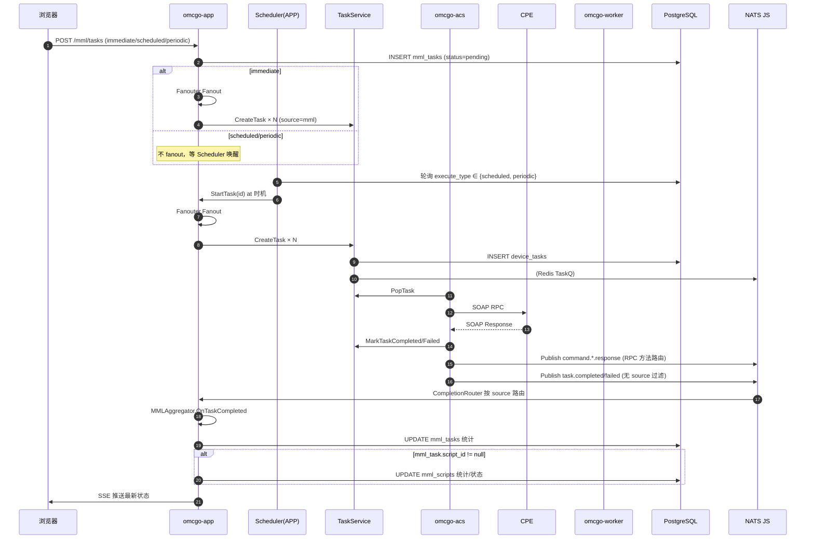

# MML 任务全链路处理方案（设计稿 v0.2）

> **版本**：2026-04-24
> **状态**：✅ 已确认，可进入 P1 实施
> **输入**：[docs/design/to-do-list.md](to-do-list.md)「关于 MML 任务的处理流程」
> **关联文档**：[docs/消息队列全流程流转说明书.md](../消息队列全流程流转说明书.md)
> **变更日志**：
> - v0.2（2026-04-24）：Q1–Q6 + 详情页/审计决策闭环；新增 C11 历史执行 API、C12 SSE 粒度预留；simplify mml_scripts 只存 `last_run_status`/`last_run_at`
> - v0.1（2026-04-24）：初稿，待用户评审

---

## 0. 文档目的

1. **完善需求**：把 to-do-list 粗颗粒描述展开为可验收的功能/非功能要求。
2. **差距分析**：对照当前代码现状，标出「已实现 / 部分实现 / 缺失」。
3. **目标架构**：给出 MML 任务从"添加脚本任务"到"结果回流 UI"的端到端处理方案。
4. **分阶段实施**：把改动拆成最小独立合入的 Phase，便于评审与灰度。
5. **提交确认**：我不会在确认前动手改动。

---

## 1. 需求完善（Refined Requirements）

### 1.1 业务场景

用户在 `/mml/script` 页面点击「+新增」，填入设备 SN 与命令/脚本文件，**按"立即 / 定时 / 周期"三种执行方式**提交后，系统应：

1. 在 `mml_scripts` 表落一条脚本记录（任务模板），或在 `mml_tasks` 表落一条任务记录（执行实例）。<br/>
   —— 待确认：**脚本/任务语义分离**见 §1.5。
2. 把任务**一次性或按时**拆分（fanout）为 `device_tasks`（设备 × 命令 笛卡尔积）。
3. `device_tasks` 通过 **统一 TaskService** 写入 PG + Redis TaskQ，由 ACS Pop 拉起、渲染 SOAP RPC 下发 CPE。
4. CPE 回 SOAP Response → ACS 按 **RPC 方法**（响应类型）发到相应 `command.*.response` NATS 主题，并调用 `MarkTaskCompleted / MarkTaskFailed` 更新 `device_tasks` 终态。
5. `TaskService.notifyCompletion` 发布 **`task.completed` / `task.failed`** 事件，APP 端 `CompletionEventBridge` 按 `source` 路由到对应聚合器（MML → `ResultAggregator`）。
6. 聚合器统计 success/failed 数，写回 `mml_tasks` 及（必要时）`mml_scripts` 的 `status / progress / result`，并经 SSE Hub 推送到浏览器实时更新页面。

### 1.2 功能性需求（Functional）

| 编号 | 需求 | 验收指标 |
|------|------|---------|
| **F1** | 支持三种执行方式：immediate / scheduled / periodic | 页面提交后，immediate 应在秒级内 fanout；scheduled 应在 `scheduled_at` 到达时 fanout；periodic 在窗口内按 `period_time` 周期触发 |
| **F2** | mml_task → device_tasks 分解一次且幂等 | 同一 mml_task 重复触发（比如定时器重启）不产生重复 device_tasks |
| **F3** | device_tasks 下发入口唯一走 TaskService | `grep` 不到绕过 TaskService 直写 Redis/PG 的路径 |
| **F4** | ACS 响应按 RPC 方法投递 NATS 主题 | `command.get_parameters.response` 等 9 个响应 Subject 都有流 + 订阅者 |
| **F5** | device_tasks 终态回流到 task 来源 | source=mml 的任务完成后 mml_tasks / mml_scripts 数据随之更新 |
| **F6** | 支持多上游（source）扩展 | 新增 source=backup / config / provision 不需要修改 CompletionEventBridge 核心逻辑 |
| **F7** | 浏览器实时可见执行状态 | SSE 能在 ≤2 秒内推送最新进度 / 终态 |

### 1.3 非功能性需求（Non-Functional）

| 维度 | 要求 |
|------|------|
| 可靠性 | NATS JetStream At-Least-Once + `task.completed/failed` Durable Consumer；崩溃后可重放 72h 内事件 |
| 幂等性 | fanout、scheduler、聚合器均需对重复事件幂等 |
| 可扩展性 | 新接上游只需：`TaskSource` 常量 + 对应 `Aggregator` 实现 + `CompletionRouter` 注册 |
| 可观测性 | Prometheus 暴露：任务按 source 的总量 / 成功数 / 失败数 / 进行中数；所有状态流转打结构化日志 |
| 故障处理 | 设备离线、任务超时、聚合器异常均有明确策略（见 §4.6） |

### 1.4 非目标（Out of Scope）

- 跨会话串联的复杂工作流编排（交由 provision 域）
- 脚本内容语法校验 / 语义分析（前端已有 # 注释 + 空行处理即可）
- TR-069 RPC 方法本身的能力扩展

### 1.5 概念澄清：mml_scripts vs mml_tasks vs device_tasks

| 表 | 语义 | 生命周期 | 关联 |
|-----|------|---------|------|
| `mml_scripts` | **脚本模板**（可复用的命令序列） | 手动创建/编辑/归档；可被多次执行 | 被 `mml_tasks.script_id` 引用（可空） |
| `mml_tasks` | **一次执行实例**（带任务名 / 执行策略 / 统计结果） | 从 pending → running → completed/failed；不再可改 | fanout 出 N 个 `device_tasks` |
| `device_tasks` | **单设备单命令的 RPC 下发单元** | pending → sent → completed/failed/expired | 被 ACS 实际下发；`source` + `source_id` 回指上游 |

**本方案**：script_id 可为空（直接创建任务），也可不为空（从脚本模板创建任务并在完成后回写 mml_scripts 统计）。

---

## 2. 当前实现现状（As-Is）

基于代码实测：

| 环节 | 文件 | 状态 | 备注 |
|------|------|:----:|------|
| Fanout 分解 | [mml/fanout.go](omcgo/internal/mml/fanout.go) | ✅ | 仅 immediate 触发；source 硬编码 `mml` |
| 调度器（scheduled/periodic） | — | ❌ | **完全缺失**。scheduled_at / period_time 有字段无消费方 |
| TaskService 统一入口 | [task/service.go](omcgo/internal/task/service.go) | ✅ | CreateTask + Redis + PG 双写 |
| ACS Pop & 下发 | [acs/handler.go](omcgo/internal/acs/handler.go) | ✅ | — |
| ACS 响应 → NATS | [acs/handler.go publishRPCResponseEvent](omcgo/internal/acs/handler.go) | ✅ | 9 个 `command.*.response` 主题按 RPC 方法分发 |
| 任务终态发布 | [task/service.go notifyCompletion](omcgo/internal/task/service.go) | ⚠️ | 硬编码 `if source == "mml" && source_id != ""` 才发布 |
| CompletionEventBridge | [task/event_bridge.go](omcgo/internal/task/event_bridge.go) | ⚠️ | 非泛型，假定下游只有 `ResultAggregator` |
| MML ResultAggregator | [mml/result_aggregator.go](omcgo/internal/mml/result_aggregator.go) | ⚠️ | 只更新 `mml_tasks`，**不更新 `mml_scripts`** |
| SSE 推送 | [events/hub.go](omcgo/internal/events/hub.go) | ✅ | 经 aggregator 触发 |

**三大缺失**：
1. **调度器**（F1）
2. **脚本态回流**（F5 一半：task 有但 script 无）
3. **多上游扩展机制**（F6：硬编码 MML 无法接其它 source）

---

## 3. 目标架构（To-Be）

### 3.1 总体流程



### 3.2 核心抽象

```
┌──────────────────────────────────────────────┐
│ TaskService (internal/task)                   │
│  · CreateTask (source, source_id 可为任意值)  │  ← 泛化
│  · MarkTaskCompleted / Failed                 │
│  · notifyCompletion (无 source 过滤)          │  ← 去除 MML 硬编码
└──────────────────┬───────────────────────────┘
                   │ publishes task.completed / task.failed
                   ▼
┌──────────────────────────────────────────────┐
│ CompletionRouter (internal/task)              │
│  · Register(source, CompletionHandler)        │  ← 新增：注册中心
│  · dispatch(Task) → handler                   │
└──────────────────┬───────────────────────────┘
                   │
        ┌──────────┼──────────┐
        ▼          ▼          ▼
    MMLAggregator  BackupAggr  ...（未来）
```

### 3.3 关键改动清单

| 变更 | 位置 | 类型 | 说明 |
|------|------|------|------|
| **C1 调度器** | 新文件 `internal/mml/scheduler.go` | 新增 | `robfig/cron/v3` 每 30s 扫 `mml_tasks WHERE execute_type IN ('scheduled','periodic') AND status='pending'`，按时触发 `StartTask` |
| **C2 去除 MML 过滤** | `task/service.go:notifyCompletion` | 修改 | 所有 source 都发 `task.completed/failed`，但仅 `source_id != ""` 才发（避免匿名任务噪音）|
| **C3 CompletionRouter** | 新文件 `internal/task/completion_router.go` | 新增 | 接口 `CompletionHandler{ OnTaskCompleted(ctx, *Task) }`；bridge 订阅 NATS 后经 router 分发 |
| **C4 CompletionBridge 改造** | `task/event_bridge.go` | 修改 | 用 router 代替硬编码 `aggregator` 字段；装配阶段注册各源 handler |
| **C5 MMLAggregator 扩展** | `mml/result_aggregator.go` | 修改 | 增加 `updateScriptIfNeeded(task)`：`mml_tasks.script_id != nil` 时写 `mml_scripts.last_run_status` + `last_run_at`（具体每次执行详情由 `mml_tasks` 独立持有） |
| **C6 Fanouter 接受任意 source** | `mml/fanout.go` | 小改 | 已硬编码 `TaskSourceMML`，保留现状；但 TaskRequest 已支持传参，未来接入新源时无需改 Fanouter |
| **C7 ACS 响应补全** | `acs/handler.go` | 小改 | 补充 `command.factory_reset.response` / `command.set_attrs.response` 等剩余缺失主题的发布（若有）|
| **C8 Scheduler 幂等** | `mml/scheduler.go` | 新增 | 用 PG 行锁（`SELECT ... FOR UPDATE SKIP LOCKED`）+ 状态迁移 `pending → running` 单步防并发重复触发 |
| **C9 Periodic 窗口管理** | `mml/scheduler.go` | 新增 | `period_start`/`period_end` 过期后自动置 `completed`；每次触发生成新的子 mml_task_instance（待确认，见 §6 Q1）|
| **C10 指标** | 全链路插桩 | 新增 | Prometheus counter: `mml_task_total{source, status}`; histogram: `mml_task_duration_seconds` |
| **C11 历史执行 API** | `mml/handler.go` + service | 新增 | `GET /api/v1/mml/scripts/:id/runs` 返回该脚本关联的 `mml_tasks` 分页列表；前端脚本详情页拉取渲染"历史执行列表" |
| **C12 SSE 预留 device_task 口** | `mml/result_aggregator.go` | 新增（接口留空） | 定义 `sseGranularity` 枚举（`task` / `device_task`，当前只实现 `task` 级节流推送），device_task 级实现延后 |

### 3.4 数据库变更

**无需新增表**。建议增列（小改）：

| 表 | 列 | 目的 |
|-----|----|------|
| `mml_tasks` | `next_trigger_at TIMESTAMPTZ`（可选） | 周期任务下一次触发时刻，Scheduler 索引扫描用 + 详情页展示 |
| `mml_scripts` | `last_run_at TIMESTAMPTZ` | 脚本最近一次执行时刻 |
| `mml_scripts` | `last_run_status VARCHAR(20)` | 脚本最近一次执行的终态（completed / failed / partial）；per-execution 详情查 `mml_tasks` |

迁移：`000030_mml_task_scheduler_fields.sql`（DDL）。

### 3.5 NATS Subject 矩阵（确认无新增）

| Subject | 发布 | 订阅 |
|---------|------|------|
| `task.completed` / `task.failed` | TaskService（全 source） | CompletionRouter 在 APP |
| `command.*.response` | ACS（按 RPC 方法） | 各业务订阅（不变） |
| `device.inform.*` | ACS（按 eventCode） | device-mgr-* 等（不变） |

### 3.6 Redis Key（无新增）

所有 key 仍从 `redisx.Keys` 构造。Scheduler 不使用 Redis，全部依赖 PG 行锁。

---

## 4. 分阶段实施

| Phase | 目标 | 对应变更 | 工作量估算 | 可回退性 |
|:-----:|------|---------|:---------:|:-------:|
| **P1** | CompletionRouter 抽象 + MMLAggregator 扩展到 mml_scripts | C2 · C3 · C4 · C5 | 2 天 | 高（不改外部契约） |
| **P2** | Scheduler：scheduled 即时生效 | C1 · C8 | 1.5 天 | 高（独立组件，关掉 cron 即可） |
| **P3** | Scheduler：periodic 完整支持 | C9 | 1.5 天 | 中（涉及生成子任务/幂等） |
| **P4** | 指标 + 审计 + 文档同步 | C10 + 文档 | 1 天 | — |

**每个 Phase 独立 PR，独立上线**。顺序可微调，但 P1 是 P2/P3 的前置（Scheduler 依赖的 fanout 路径需稳定）。

### 4.1 Phase 1 细节

- 新增文件：`internal/task/completion_router.go` + unit test
- 新增迁移 `000030_mml_task_scheduler_fields.sql`：`mml_scripts.last_run_status`、`mml_scripts.last_run_at`（`mml_tasks.next_trigger_at` 放到 P2 一起上）
- 修改：
  - `task/service.go` 删 `source == "mml"` 过滤分支
  - `task/event_bridge.go` 改为持有 `CompletionRouter`，订阅后调 `router.Dispatch(task)`
  - `mml/result_aggregator.go`：
    - `OnTaskCompleted` 末尾追加：若 `mml_task.script_id != nil` 时，`UPDATE mml_scripts SET last_run_status=?, last_run_at=NOW() WHERE id=?`（按 mml_task 终态映射 completed/failed/partial）
    - 推送封装：用 `SSEGranularity` 枚举，当前固定 task 级 + 节流，内部预留 `push(granularity, payload)` 通道
  - `cmd/app/provider/modules.go` 装配 router 并注册 `TaskSourceMML → mmlAggregator`
- 不改前端

### 4.2 Phase 2 细节

- 新增文件：`internal/mml/scheduler.go`
- 采用：`robfig/cron/v3` + PG 行锁
- 关键逻辑：
  ```go
  // 每 30s 触发
  q := "SELECT id FROM mml_tasks
        WHERE status='pending'
          AND execute_type='scheduled'
          AND scheduled_at <= NOW()
        FOR UPDATE SKIP LOCKED LIMIT 100"
  ```
- 对每个扫出 id 调 `service.StartTask(ctx, id)`（已存在）
- 启动装配：`cmd/app/main.go` 注入 cron runner

### 4.3 Phase 3 细节（periodic 已确定走方案 A）

- Scheduler 按 `period_time`（HH:MM:SS）每日匹配一次命中窗口的时刻
- 命中后从**模板 mml_task**克隆出一个**子实例 mml_task**（`parent_task_id` 或等价字段指向模板；`execute_type=immediate` 方便与普通任务复用 fanout）
- 子实例独立跑 fanout → device_tasks → 完成/失败
- 当 `NOW() > period_end` 时模板任务置 `completed`，不再生成新子实例
- 子实例的终态经 `MMLAggregator` 回写 `mml_scripts.last_run_status`/`last_run_at`
- 历史执行列表 API（C11）实现：`SELECT * FROM mml_tasks WHERE script_id=? ORDER BY created_at DESC`（模板 + 子实例都在此查询下可见，前端用 `parent_task_id` 区分）

### 4.4 Phase 4 细节

- 插入 Prometheus 指标（C10）：`mml_task_total{source,status}` / `mml_task_duration_seconds` / `completion_no_handler_total`
- 新增 API `GET /api/v1/mml/scripts/:id/runs`（C11）—— 脚本详情页"历史执行"tab 用
- 前端脚本详情页（ScriptTask）补：
  - `next_trigger_at` 字段（periodic/scheduled 任务）
  - "历史执行"折叠面板，按 `created_at` 倒序分页显示子实例
- `SSEGranularity` 接口（C12）文档化；暂不提供 device_task 级实现
- 同步更新：`docs/消息队列全流程流转说明书.md` §4.2.8、`CLAUDE.md` 任务模块速览

---

## 5. 风险与缓解

| 风险 | 影响 | 缓解 |
|------|------|------|
| Scheduler 漏触发（应用重启） | scheduled_at 已过的任务错过窗口 | 启动时扫描 `scheduled_at <= NOW() AND status='pending'` 一次性补触发 |
| Scheduler 重复触发（多副本） | 同一任务 fanout 两次 | PG `SELECT ... FOR UPDATE SKIP LOCKED` 原子转状态 pending → running |
| CompletionRouter 注册漏配 | 新 source 的任务 silent fail | 未匹配时记 warn 日志 + Prometheus counter `completion_no_handler_total` |
| 周期任务历史积累 | mml_tasks 表膨胀 | 配合定期归档（超过 7 天且 completed 的挪到历史表，独立 Phase） |
| MML 脚本更新时聚合覆盖 | 脚本正在执行时用户改脚本 | 用乐观锁 `version` 字段或仅允许 status=active 时修改（UI 已做限制，后端兜底） |

---

## 6. 已确认决策（2026-04-24 review 闭环）

| 编号 | 决策 | 说明 |
|:----:|------|------|
| **Q1** | periodic 每次触发生成**新 mml_task 子实例**（方案 A） | 保留原任务为"模板行"，子实例继承大部分字段，互不覆盖；历史可追溯 |
| **Q2** | scheduled 窗口错过时 **启动时一次性补触发** | Scheduler 冷启动阶段扫 `scheduled_at < NOW() AND status='pending'` 全部入队，随后进入常规 30s 轮询 |
| **Q3/Q4** | `mml_scripts` 只记 **`last_run_status` + `last_run_at`** 两个字段 | 每次执行的详情（success_count/failed_count/duration 等）已由 `mml_tasks` 独立持有；脚本不累计、不分桶 |
| **Q5** | **不做 UI 取消**，后端 `cancelScript` API 保留供未来调用 | — |
| **Q6** | **mml_task 级推送 + 节流**（每秒 1 条上限），预留 device_task 级扩展口 | 见 C12；当前不实现 device_task 级，但 Aggregator 接口保留 `granularity` 参数位，避免未来改动爆炸 |
| **详情页增量** | 列表/详情页新增两项展示：<br/>① `next_trigger_at`（下次触发时间，periodic/scheduled 任务用）<br/>② 历史执行列表（通过 C11 新 API `GET /mml/scripts/:id/runs` 拉取） | 任务列表页不动；脚本详情页补 tab |
| **审计日志** | 本次**不**新增专门审计日志 | 依赖现有 Zap 结构化日志 + Prometheus 指标（C10）做可观测性 |

---

## 7. 验收标准

### 7.1 P1 验收

- `curl POST /api/v1/mml/tasks` 创建一个 `script_id` 非空、10 个设备的任务
- 模拟 ACS MarkTaskCompleted 5 条、MarkTaskFailed 5 条
- 查 PG：
  - `mml_tasks.success_count=5, failed_count=5, status=completed`
  - `mml_scripts.last_run_status='partial'`（5 成功 5 失败视为 partial）、`last_run_at` 为最新时间戳
- `grep -r '"mml"' internal/task/service.go` 未见 `source == TaskSourceMML` 过滤硬编码
- 单元测试：CompletionRouter 未注册时 `dispatch` 记 warn + metrics 不崩

### 7.2 P2 验收

- 创建 `scheduled_at=NOW()+2min` 的任务
- 到点（±30s 容忍）fanout 自动发生
- 应用重启（任务仍 pending，scheduled_at 已过）：启动后 30s 内补触发
- 同一任务重复尝试：始终只有 1 次 fanout（验证 `FOR UPDATE SKIP LOCKED`）

### 7.3 P3 验收

- 创建 periodic 任务：period_start=今天 9:00，period_end=明天 9:00，period_time=14:30:00
- 今天 14:30 生成第 1 个**子 mml_task 实例**（`parent_task_id` 指向模板，`execute_type=immediate`），明天 14:30 生成第 2 个，共 2 次
- period_end 之后模板任务自动置 `completed`，不再触发
- 每次子实例完成后 `mml_scripts.last_run_status` 被最新值覆盖

### 7.4 P4 验收

- Prometheus `mml_task_total{source="mml",status="completed"}` 计数随任务完成递增
- `GET /api/v1/mml/scripts/:id/runs` 返回该脚本所有 mml_tasks（模板 + 子实例）按 `created_at desc` 分页
- 前端脚本详情页显示 `next_trigger_at`（scheduled/periodic）+ 历史执行列表
- 浏览器 SSE 事件频率 ≤ 1 条/秒（mml_task 级节流）

### 7.5 回归验收

- 现有 immediate 流程不变（E2E 全绿）
- 其它 source 的任务（api / scheduler / future backup / config）不受影响：完成事件经 CompletionRouter 走 warn 路径（未注册 handler 时）或 silent（后续接入时注册）

---

## 8. 确认状态

2026-04-24 已与用户确认：

- ✅ 整体四阶段方案可接受
- ✅ §6 所有决策已确定（Q1–Q6 + 详情页增量 + 审计日志）
- ✅ mml_scripts 只持有 `last_run_status` / `last_run_at`
- ✅ 前端增量：`next_trigger_at` + 历史执行列表
- ✅ 本次不加审计日志
- ✅ 工期 ~6 人日可接受

**下一步**：进入 **P1 实施**（CompletionRouter 抽象 + MMLAggregator 扩展 mml_scripts + 迁移 000030）。
