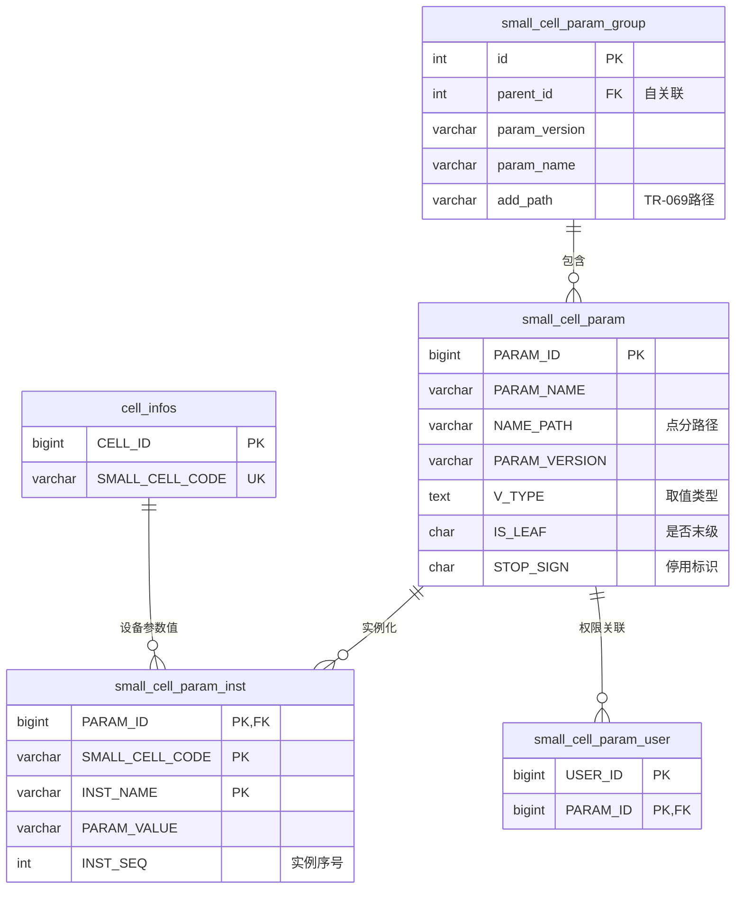

# small_cell 数据库设计文档

> **数据库类型**: MySQL  
> **数据库名称**: small_cell  
> **表总数**: 631 个表  
> **分析日期**: 2026-04-27  
> **文档版本**: v1.0

---

## 目录

1. [系统架构概览](#1-系统架构概览)
2. [模块划分](#2-模块划分)
3. [核心模块详细设计](#3-核心模块详细设计)
   - 3.1 [设备管理模块](#31-设备管理模块)
   - 3.2 [参数管理模块（重点）](#32-参数管理模块重点)
   - 3.3 [告警管理模块](#33-告警管理模块)
   - 3.4 [配置管理模块](#34-配置管理模块)
   - 3.5 [任务管理模块](#35-任务管理模块)
   - 3.6 [用户权限模块](#36-用户权限模块)
   - 3.7 [统计分析模块](#37-统计分析模块)
4. [表关联关系图](#4-表关联关系图)
5. [设计质量评估](#5-设计质量评估)
6. [优化建议](#6-优化建议)

---

## 1. 系统架构概览

### 1.1 系统定位

`small_cell` 是小基站（Small Cell）网管系统的核心数据库，管理：
- 小基站设备（皮基站/微基站）
- 设备参数配置
- 告警与性能监控
- 批量任务执行
- 用户权限管理

### 1.2 数据库特征

| 特征 | 说明 |
|------|------|
| 表数量 | 631 个表（含历史表、临时表） |
| 数据量 | 参数表 8193 行，参数分组 1992 行 |
| 外键约束 | 部分使用（通过索引模拟） |
| 审计字段 | 部分表有 `create_time`/`update_time` |
| 软删除 | 使用 `STOP_SIGN` 字段（0-使用中，1-停用） |

---

## 2. 模块划分

根据表名前缀和功能，系统划分为以下模块：

| 模块 | 表数量估算 | 核心表 |
|------|-----------|--------|
| **参数管理** | ~10 | `small_cell_param`, `small_cell_param_group`, `small_cell_param_inst`, `small_cell_param_user` |
| **设备管理** | ~50 | `cell_infos`, `cell_param_re_cell_infos_column`, `small_cell_code` |
| **告警管理** | ~60 | `alarm_infos`, `alarm_rule_info`, `alarm_statistic_*` |
| **配置管理** | ~40 | `batch_configuration_param`, `backup_*` |
| **任务管理** | ~30 | `backup_restore_*`, `bios_upgrade_task`, `ca_upgrade_task` |
| **用户权限** | ~20 | `sys_user`, `sys_role`, `sys_user_role` |
| **统计分析** | ~30 | `statistics_*` |
| **接入控制** | ~20 | `access_*` |
| **证书管理** | ~10 | `cert_*` |
| **其他** | ~361 | 各类业务表 |

---

## 3. 核心模块详细设计

### 3.1 设备管理模块

#### 3.1.1 核心表

**cell_infos（小站信息表）**
```
主键: CELL_ID (bigint)
核心字段:
  - SMALL_CELL_CODE: 小站代码（唯一标识）
  - CELL_NAME: 小站名称
  - STATUS: 状态
  - CREATE_TIME: 创建时间
  - UPDATE_TIME: 更新时间

索引:
  - PRIMARY KEY (CELL_ID)
  - UNIQUE KEY (SMALL_CELL_CODE)
```

**cell_param_re_cell_infos_column（小站参数与小区关联表）**
```
作用: 多对多关联表，连接小站和参数实例
核心字段:
  - CELL_ID: 小区ID
  - PARAM_ID: 参数ID
  - PARAM_VALUE: 参数值
```

#### 3.1.2 设备管理流程

```
设备注册 → cell_infos 入库 → 关联参数模板 → 初始化参数实例 (small_cell_param_inst)
```

---

### 3.2 参数管理模块（重点）⭐

这是系统最核心的模块，管理小基站的所有可配置参数。

#### 3.2.1 表结构概览

参数管理模块由 **5 个核心表** 组成：

| 表名 | 中文名 | 行数 | 作用 |
|------|--------|------|------|
| `small_cell_param` | 小站系统参数表 | 8193 | 参数定义（模板） |
| `small_cell_param_group` | 小站参数分组表 | 1992 | 参数分组（目录树） |
| `small_cell_param_inst` | 小站参数实例表 | 0 | 设备参数实例（每个设备一份） |
| `small_cell_param_user` | 参数-用户关联表 | 0 | 参数修改权限控制 |
| `small_cell_param_aux_itfn` | 参数辅助接口表 | - | 参数辅助功能 |

#### 3.2.2 small_cell_param（参数定义表）

**表注释**: 小站系统参数表

**核心字段**:

| 字段名 | 类型 | 可空 | 键 | 注释 |
|--------|------|------|-----|------|
| `PARAM_ID` | bigint | NO | PRI | 参数ID（主键，通过解析程序生成） |
| `PARAM_NAME` | varchar(255) | NO | | 参数英文名称 |
| `NAME_PATH` | varchar(255) | NO | MUL | 参数路径（如 `Device.WiFi.Radio.1.`） |
| `DFT_VALUE` | varchar(4000) | YES | | 参数默认值 |
| `V_TYPE` | text | YES | | 取值类型（描述与取值相关的所有信息，字符串形式） |
| `V_WRITABLE` | varchar(10) | YES | | 0-不可操作，1-可操作 |
| `V_LST` | char(2) | YES | | 是否立即显示（Y是，N否） |
| `V_MOD` | char(2) | YES | | 是否可以修改（Y是，N否） |
| `V_ADD` | char(2) | YES | | 是否可以添加（Y是，N否） |
| `V_RMV` | char(2) | YES | | 是否可以删除（Y是，N否） |
| `IS_LEAF` | char(1) | YES | | 是否末级（Y是，N否） |
| `DISP_ORD` | decimal(8,0) | YES | | 显示顺序（默认0） |
| `STOP_SIGN` | char(1) | NO | | 0：使用中，1：停用 |
| `MEMO` | text | YES | | 描述 |
| `V_DYNAMIC` | char(2) | YES | | 参数是否动态生效（设置后是否需要重启） |
| `PARAM_VERSION` | varchar(45) | NO | | **参数版本**（对应多个软件版本号） |
| `MIB_DN` | varchar(100) | YES | | MIB DN 标识 |
| `PARAM_NAME_EN` | varchar(255) | YES | | 参数英文名称 |
| `MOBILE_SUPPORT` | char(4) | YES | | 移动版支持配置（Y支持，N不支持） |
| `BROADBAND_SUPPORT` | char(4) | YES | | 宽带版支持配置（Y支持，N不支持） |
| `JS_REGEX` | varchar(500) | YES | | JavaScript 正则表达式（用于前端校验） |
| `TITLE_CN` | varchar(1000) | YES | | 中文标题 |
| `TITLE_EN` | varchar(1000) | YES | | 英文标题 |
| `PLATFORM_SUPPORT` | varchar(5) | YES | | 平台支持 |
| `CN_EXPLANATION` | varchar(1000) | YES | | 参数中文解释说明 |
| `EN_EXPLANATION` | varchar(1000) | YES | | 参数英文解释说明 |
| `SOFTWARE_VERSION` | varchar(100) | YES | | 基站软件版本号 |
| `second_confirm` | char(1) | YES | | 是否需要二次确认 |
| `confirm_en` | varchar(1000) | YES | | 英文确认提示 |
| `confirm_cn` | varchar(1000) | YES | | 中文确认提示 |

**索引**:
```sql
PRIMARY KEY (PARAM_ID)
UNIQUE KEY PATHVERSION (NAME_PATH, PARAM_VERSION)  -- 路径+版本唯一
```

**统计**: 行数≈8193, 数据大小=3584KB, 索引大小=1552KB

**设计特点**:
1. **版本管理**: `PARAM_VERSION` 字段支持多版本参数共存
2. **路径树形结构**: `NAME_PATH` 字段使用点分路径（如 `Device.WiFi.Radio.1.`）
3. **权限控制**: `V_WRITABLE`, `V_MOD`, `V_ADD`, `V_RMV` 四个字段控制操作权限
4. **多平台支持**: `MOBILE_SUPPORT`, `BROADBAND_SUPPORT`, `PLATFORM_SUPPORT`
5. **动态生效标识**: `V_DYNAMIC` 标识参数是否需要重启才能生效
6. **前端校验**: `JS_REGEX` 存储正则表达式供前端验证

#### 3.2.3 small_cell_param_group（参数分组表）

**表注释**: 小站参数分组表

**核心字段**:

| 字段名 | 类型 | 可空 | 键 | 注释 |
|--------|------|------|-----|------|
| `id` | int | NO | PRI | 分组ID（主键） |
| `param_name` | varchar(60) | YES | | 参数名称 |
| `keyword` | varchar(50) | YES | | 关键字 |
| `v_lst` | varchar(2) | YES | | 是否立即显示（默认N） |
| `v_mod` | varchar(2) | YES | | 是否可以修改（默认N） |
| `v_add` | varchar(2) | YES | | 是否可以添加（默认N） |
| `v_rmv` | varchar(2) | YES | | 是否可以删除（默认N） |
| `parent_id` | int | NO | | **父分组ID**（自关联，构建树形结构） |
| `param_version` | varchar(45) | YES | | 参数版本（与 small_cell_param 表对应） |
| `add_path` | varchar(200) | YES | | AddObject/DeleteObject 下发的参数路径 |
| `param_name_en` | varchar(60) | YES | | 英文名称 |
| `mobile_support` | char(4) | YES | | 移动版支持（Y支持，N不支持） |
| `broadband_support` | char(4) | YES | | 宽带版支持（Y支持，N不支持） |
| `platform_support` | varchar(5) | YES | | 平台支持 |
| `cell_number` | int | YES | | 小区数量（默认1） |
| `cell_index_location` | int | YES | | 小区索引位置（默认0） |
| `second_confirm` | char(1) | YES | | 是否需要二次确认 |
| `confirm_en` | varchar(1000) | YES | | 英文确认提示 |
| `confirm_cn` | varchar(1000) | YES | | 中文确认提示 |
| `dis_order` | tinyint unsigned | YES | | 显示顺序（默认1） |

**索引**:
```sql
PRIMARY KEY (id)
UNIQUE KEY id (id)
```

**统计**: 行数≈1992, 数据大小=368KB, 索引大小=48KB

**设计特点**:
1. **树形结构**: 通过 `parent_id` 自关联实现参数分组树
2. **版本对齐**: `param_version` 与 `small_cell_param.PARAM_VERSION` 对应
3. **动态对象管理**: `add_path` 字段存储 TR-069 AddObject/DeleteObject 的路径
4. **多小区支持**: `cell_number` 和 `cell_index_location` 支持多小区场景

#### 3.2.4 small_cell_param_inst（参数实例表）

**表注释**: 小站参数实例表

**核心字段**:

| 字段名 | 类型 | 可空 | 键 | 注释 |
|--------|------|------|-----|------|
| `PARAM_ID` | bigint | NO | PRI | 参数ID（外键 → small_cell_param.PARAM_ID） |
| `SMALL_CELL_CODE` | varchar(50) | NO | PRI | 小站代码（外键） |
| `INST_NAME` | varchar(255) | NO | PRI | 实例名称路径 |
| `INST_SEQ` | int | YES | | 实例序列号（多个参数值时从1开始，默认0） |
| `INST_VAL` | varchar(4000) | YES | | 当前实例值 |
| `INST_TIME` | datetime | YES | | 实例化时间 |
| `INST_FLG` | char(1) | YES | | 是否已实例化（0-是，1-未实例化） |
| `PARAM_VALUE` | varchar(4000) | YES | | 参数值 |
| `UPD_TIME` | datetime | YES | | 更新时间 |
| `UPD_USER` | varchar(200) | YES | | 更新用户 |

**索引**:
```sql
PRIMARY KEY (PARAM_ID, SMALL_CELL_CODE, INST_NAME)
KEY FK_Reference_12 (SMALL_CELL_CODE)
KEY FK_Reference_19 (PARAM_ID)
UNIQUE KEY unique_fk (PARAM_ID, SMALL_CELL_CODE, INST_NAME)
```

**统计**: 行数≈0（当前无数据）

**设计特点**:
1. **复合主键**: (PARAM_ID, SMALL_CELL_CODE, INST_NAME) 唯一标识一个参数实例
2. **多实例支持**: `INST_SEQ` 支持同一参数的多个实例值
3. **版本隔离**: 每个设备独立的参数值，互不影响

#### 3.2.5 small_cell_param_user（参数-用户关联表）

**表注释**: 小站系统参数-用户关联

**核心字段**:

| 字段名 | 类型 | 可空 | 键 | 注释 |
|--------|------|------|-----|------|
| `USER_ID` | bigint | NO | PRI | 用户ID |
| `PARAM_ID` | bigint | NO | PRI | 参数ID（外键 → small_cell_param.PARAM_ID） |
| `UPD_TIME` | datetime | YES | | 更新时间 |
| `UPD_USER` | varchar(200) | YES | | 更新用户 |

**索引**:
```sql
PRIMARY KEY (USER_ID, PARAM_ID)
KEY FK_Reference_8 (PARAM_ID)
```

**统计**: 行数≈0（当前无数据）

**作用**: 控制哪些用户可以修改哪些参数（细粒度权限）

#### 3.2.6 参数模块关联关系



#### 3.2.7 参数管理核心流程

**1. 参数模板加载流程**:
```
XML参数模型文件 → 解析程序 → small_cell_param (8193条)
                                ↓
                        small_cell_param_group (1992条)
```

**2. 设备参数初始化流程**:
```
设备注册 → 选择参数模板 (PARAM_VERSION)
              ↓
        复制模板到 small_cell_param_inst
              ↓
        设置默认值 (DFT_VALUE)
```

**3. 参数修改流程**:
```
用户修改参数 → 校验权限 (small_cell_param_user)
                  ↓
            校验规则 (JS_REGEX, V_TYPE)
                  ↓
            更新 small_cell_param_inst.PARAM_VALUE
                  ↓
            下发到设备 (TR-069 SetParameterValues)
```

**4. 参数版本管理**:
```
PARAM_VERSION 字段作用:
  - 同一参数路径 (NAME_PATH) 可以有多个版本
  - 唯一索引: (NAME_PATH, PARAM_VERSION)
  - 不同软件版本使用不同的参数版本
  - 示例: 
      NAME_PATH='Device.WiFi.Radio.1.', PARAM_VERSION='QB1.0'
      NAME_PATH='Device.WiFi.Radio.1.', PARAM_VERSION='CA2.0'
```

#### 3.2.8 参数表设计亮点与问题

**✅ 设计亮点**:
1. **模板-实例分离**: 参数定义与设备实例值分离，支持多设备复用
2. **版本管理**: 支持多版本参数共存，适配不同软件版本
3. **树形结构**: `NAME_PATH` 点分路径 + `IS_LEAF` 标识，支持树形展示
4. **权限细粒度**: 每个参数可配置可修改/可添加/可删除权限
5. **多平台支持**: 移动版/宽带版/平台支持标识

**⚠️ 设计问题**:
1. **缺少显式外键**: `small_cell_param_inst` 的 `PARAM_ID` 和 `SMALL_CELL_CODE` 没有物理外键约束
2. **分组-参数关系隐含**: `small_cell_param_group` 和 `small_cell_param` 之间通过 `NAME_PATH` 前缀匹配关联，无显式外键
3. **V_TYPE 字段非结构化**: 取值类型存储为 text 字符串，需应用层解析（建议改用 JSON）
4. **无审计字段**: 缺少 `created_at`, `created_by` 字段
5. **软删除不统一**: `STOP_SIGN` 仅在 param 表，分组表无对应字段

---

### 3.3 告警管理模块

#### 3.3.1 核心表

| 表名 | 作用 | 行数 |
|------|------|------|
| `alarm_infos` | 告警信息表 | - |
| `alarm_infos_his` | 告警历史表 | - |
| `alarm_rule_info` | 告警规则表 | - |
| `alarm_serverity` | 告警级别表 | - |
| `alarm_statistic_*` | 告警统计表（多维度） | - |
| `alarm_email_*` | 邮件告警配置 | - |

#### 3.3.2 告警流程

```
设备上报告警 → alarm_infos 入库
                    ↓
            匹配告警规则 (alarm_rule_info)
                    ↓
            触发通知 (邮件/短信/北向接口)
                    ↓
            统计表更新 (alarm_statistic_*)
```

---

### 3.4 配置管理模块

#### 3.4.1 核心表

| 表名 | 作用 |
|------|------|
| `batch_configuration_param` | 批量配置参数 |
| `backup_period_main_mapping` | 定期备份主任务 |
| `backup_restore_main_task` | 备份恢复主任务 |
| `backup_restore_sub_task` | 备份恢复子任务 |

#### 3.4.2 备份恢复流程

```
创建备份任务 → backup_restore_main_task
                    ↓
            拆分子任务 (backup_restore_sub_task)
                    ↓
            执行备份 (TR-069 Upload)
                    ↓
            状态更新 → 完成/失败
```

---

### 3.5 任务管理模块

#### 3.5.1 任务类型

| 任务类型 | 表名 | 说明 |
|---------|------|------|
| BIOS升级 | `bios_upgrade_task` | BIOS固件升级 |
| CA升级 | `ca_upgrade_task` | CA证书升级 |
| 配置备份 | `backup_restore_*` | 配置备份与恢复 |
| 批量配置 | `batch_config_file_task` | 批量参数配置 |

---

### 3.6 用户权限模块

#### 3.6.1 核心表

| 表名 | 作用 |
|------|------|
| `sys_user` | 用户表 |
| `sys_role` | 角色表 |
| `sys_user_role` | 用户角色关联 |
| `sys_menu` | 菜单表 |
| `sys_role_menu` | 角色菜单关联 |

---

### 3.7 统计分析模块

#### 3.7.1 统计维度

| 统计表 | 统计维度 | 时间粒度 |
|--------|---------|---------|
| `statistics_cpe_status_by_device_group` | 设备组CPE状态 | - |
| `statistics_enb_available_by_day` | 小站可用分钟数 | 天 |
| `statistics_enb_status` | 小站状态统计 | - |
| `alarm_statistic_*` | 告警统计（活跃/清除/增量） | 天/月 |

---

## 4. 表关联关系图

### 4.1 核心关联关系

```
设备管理模块
  ├─ cell_infos (设备信息)
  │    ├─ 1:N → small_cell_param_inst (参数实例)
  │    ├─ 1:N → alarm_infos (告警记录)
  │    └─ 1:N → statistics_enb_status (状态统计)
  │
参数管理模块
  ├─ small_cell_param_group (参数分组)
  │    └─ parent_id 自关联 (树形结构)
  │
  ├─ small_cell_param (参数定义)
  │    ├─ 通过 NAME_PATH 前缀匹配 → small_cell_param_group
  │    ├─ 1:N → small_cell_param_inst (参数实例)
  │    └─ M:N → sys_user (通过 small_cell_param_user)
  │
  └─ small_cell_param_inst (参数实例)
       ├─ FK → small_cell_param.PARAM_ID
       └─ FK → cell_infos.SMALL_CELL_CODE
```

### 4.2 隐式关联关系（无物理外键）

| 关联 | 关联方式 | 说明 |
|------|---------|------|
| `small_cell_param_group` ↔ `small_cell_param` | `NAME_PATH` 前缀匹配 | 分组路径是参数路径的前缀 |
| `small_cell_param_inst` ↔ `cell_infos` | `SMALL_CELL_CODE` 字段 | 无物理外键约束 |
| `alarm_infos` ↔ `cell_infos` | `CELL_ID` 字段 | 无物理外键约束 |
| `backup_restore_main_task` ↔ `cell_infos` | `SMALL_CELL_CODE` 字段 | 无物理外键约束 |

---

## 5. 设计质量评估

### 5.1 范式化程度

| 模块 | 范式级别 | 说明 |
|------|---------|------|
| 参数管理 | 3NF | 模板-实例分离，设计合理 |
| 设备管理 | 3NF | 基本满足第三范式 |
| 告警管理 | 2NF | 统计表存在冗余（按天/月汇总） |
| 统计分析 | 1NF | 反范式设计，空间换时间 |

### 5.2 索引设计评估

**✅ 优点**:
- 主键索引完整
- 唯一索引合理（如 `PATHVERSION`）
- 外键字段有索引（`FK_Reference_*`）

**⚠️ 问题**:
- 部分高频查询字段缺少索引（如 `STOP_SIGN`, `PARAM_VERSION`）
- 统计表缺少时间范围索引

### 5.3 数据类型评估

**✅ 合理**:
- `PARAM_ID` 使用 bigint（支持大量参数）
- `PARAM_VALUE` 使用 varchar(4000)（足够存储参数值）

**⚠️ 建议优化**:
- `V_TYPE` 使用 text 但实际是结构化数据，建议改用 JSON
- `CHAR(1)` 字段（如 `IS_LEAF`, `STOP_SIGN`）可用 TINYINT 替代
- 时间字段混用 `datetime` 和 `timestamp`

### 5.4 审计字段覆盖

| 表 | created_at | updated_at | created_by | updated_by |
|----|-----------|-----------|-----------|-----------|
| `small_cell_param` | ❌ | ❌ | ❌ | ❌ |
| `small_cell_param_group` | ❌ | ❌ | ❌ | ❌ |
| `small_cell_param_inst` | ❌ | ✅ (UPD_TIME) | ❌ | ✅ (UPD_USER) |
| `cell_infos` | ✅ | ✅ | - | - |

**问题**: 核心参数表缺少审计字段，无法追溯参数变更历史

---

## 6. 优化建议

### 6.1 高优先级

#### 1. 添加显式外键约束

```sql
-- small_cell_param_inst 表
ALTER TABLE small_cell_param_inst
  ADD CONSTRAINT fk_param_inst_param 
  FOREIGN KEY (PARAM_ID) REFERENCES small_cell_param(PARAM_ID);

ALTER TABLE small_cell_param_inst
  ADD CONSTRAINT fk_param_inst_cell 
  FOREIGN KEY (SMALL_CELL_CODE) REFERENCES cell_infos(SMALL_CELL_CODE);

-- small_cell_param_user 表
ALTER TABLE small_cell_param_user
  ADD CONSTRAINT fk_param_user_param 
  FOREIGN KEY (PARAM_ID) REFERENCES small_cell_param(PARAM_ID);
```

#### 2. 参数分组-参数关系显式化

**当前问题**: 通过 `NAME_PATH` 前缀匹配关联，查询效率低

**建议方案**: 添加关联表

```sql
CREATE TABLE small_cell_group_param_rel (
    id BIGINT AUTO_INCREMENT PRIMARY KEY,
    group_id INT NOT NULL,
    param_id BIGINT NOT NULL,
    param_version VARCHAR(45) NOT NULL,
    UNIQUE KEY uk_group_param_version (group_id, param_id, param_version),
    FOREIGN KEY (group_id) REFERENCES small_cell_param_group(id),
    FOREIGN KEY (param_id) REFERENCES small_cell_param(PARAM_ID)
);
```

#### 3. V_TYPE 字段结构化

**当前格式** (示例):
```
{"type":"enum","values":["0","1"],"labels":["关闭","开启"]}
```

**建议**: 改用 JSON 类型 + 生成列

```sql
ALTER TABLE small_cell_param
  MODIFY COLUMN V_TYPE JSON,
  ADD COLUMN V_TYPE_ENUM VARCHAR(20) GENERATED ALWAYS AS (JSON_UNQUOTE(JSON_EXTRACT(V_TYPE, '$.type'))) STORED;
```

#### 4. 添加审计字段

```sql
ALTER TABLE small_cell_param
  ADD COLUMN created_at DATETIME DEFAULT CURRENT_TIMESTAMP,
  ADD COLUMN updated_at DATETIME DEFAULT CURRENT_TIMESTAMP ON UPDATE CURRENT_TIMESTAMP,
  ADD COLUMN created_by VARCHAR(200),
  ADD COLUMN updated_by VARCHAR(200);

ALTER TABLE small_cell_param_group
  ADD COLUMN created_at DATETIME DEFAULT CURRENT_TIMESTAMP,
  ADD COLUMN updated_at DATETIME DEFAULT CURRENT_TIMESTAMP ON UPDATE CURRENT_TIMESTAMP;
```

### 6.2 中优先级

#### 5. 软删除统一

```sql
-- 为分组表添加软删除标识
ALTER TABLE small_cell_param_group
  ADD COLUMN STOP_SIGN CHAR(1) DEFAULT '0' COMMENT '0:使用中 1:停用';
```

#### 6. 索引优化

```sql
-- 参数表高频查询索引
CREATE INDEX idx_param_version ON small_cell_param(PARAM_VERSION);
CREATE INDEX idx_param_stop_sign ON small_cell_param(STOP_SIGN);
CREATE INDEX idx_param_leaf_version ON small_cell_param(IS_LEAF, PARAM_VERSION);

-- 实例表查询优化
CREATE INDEX idx_param_inst_cell ON small_cell_param_inst(SMALL_CELL_CODE, INST_FLG);
```

#### 7. 分区表（针对大表）

```sql
-- 告警历史表按月分区
ALTER TABLE alarm_infos_his
  PARTITION BY RANGE (YEAR(create_time) * 100 + MONTH(create_time)) (
    PARTITION p202601 VALUES LESS THAN (202602),
    PARTITION p202602 VALUES LESS THAN (202603),
    ...
  );
```

### 6.3 低优先级

#### 8. 参数版本管理增强

```sql
-- 添加参数版本元数据表
CREATE TABLE small_cell_param_version_meta (
    id INT AUTO_INCREMENT PRIMARY KEY,
    version VARCHAR(45) UNIQUE NOT NULL,
    software_versions VARCHAR(500) COMMENT '对应的软件版本列表',
    created_at DATETIME DEFAULT CURRENT_TIMESTAMP,
    description VARCHAR(1000)
);
```

#### 9. 参数变更历史

```sql
CREATE TABLE small_cell_param_history (
    id BIGINT AUTO_INCREMENT PRIMARY KEY,
    param_id BIGINT NOT NULL,
    old_value VARCHAR(4000),
    new_value VARCHAR(4000),
    changed_by VARCHAR(200),
    changed_at DATETIME DEFAULT CURRENT_TIMESTAMP,
    FOREIGN KEY (param_id) REFERENCES small_cell_param(PARAM_ID)
);
```

#### 10. 迁移到 PostgreSQL（长期）

考虑迁移到 PostgreSQL 以获得：
- JSONB 类型（替代 V_TYPE text）
- LTREE 扩展（替代 NAME_PATH 前缀匹配）
- 数组类型（替代逗号分隔的多值字段）
- 更强大的索引（GIN, GiST）

---

## 附录 A: 参数模块 SQL 脚本

### A.1 查询参数树（含分组）

```sql
-- 查询某个版本下的参数树
SELECT 
    g.id AS group_id,
    g.param_name AS group_name,
    g.parent_id,
    p.PARAM_ID,
    p.PARAM_NAME,
    p.NAME_PATH,
    p.DFT_VALUE,
    p.IS_LEAF,
    p.DISP_ORD
FROM small_cell_param_group g
LEFT JOIN small_cell_param p 
  ON p.NAME_PATH LIKE CONCAT(g.param_name, '%')
  AND p.PARAM_VERSION = g.param_version
  AND p.STOP_SIGN = '0'
WHERE g.param_version = 'QB1.0'
ORDER BY g.dis_order, p.DISP_ORD;
```

### A.2 查询设备参数实例

```sql
-- 查询某个设备的所有参数实例
SELECT 
    p.PARAM_ID,
    p.PARAM_NAME,
    p.NAME_PATH,
    p.DFT_VALUE AS default_value,
    i.PARAM_VALUE AS current_value,
    i.INST_NAME,
    i.INST_SEQ,
    i.UPD_TIME,
    i.UPD_USER
FROM small_cell_param p
LEFT JOIN small_cell_param_inst i 
  ON p.PARAM_ID = i.PARAM_ID 
  AND i.SMALL_CELL_CODE = 'DEVICE001'
  AND i.INST_FLG = '0'
WHERE p.PARAM_VERSION = 'QB1.0'
  AND p.STOP_SIGN = '0'
  AND p.IS_LEAF = 'Y'
ORDER BY p.NAME_PATH, i.INST_SEQ;
```

### A.3 查询参数修改权限

```sql
-- 查询用户对某个参数的修改权限
SELECT 
    u.USER_ID,
    u.USERNAME,
    p.PARAM_ID,
    p.PARAM_NAME,
    p.V_WRITABLE,
    p.V_MOD,
    CASE WHEN up.USER_ID IS NOT NULL THEN 'Y' ELSE 'N' END AS has_permission
FROM sys_user u
CROSS JOIN small_cell_param p
LEFT JOIN small_cell_param_user up 
  ON u.USER_ID = up.USER_ID 
  AND p.PARAM_ID = up.PARAM_ID
WHERE p.PARAM_ID = 12345;
```

---

## 附录 B: 术语表

| 术语 | 说明 |
|------|------|
| Small Cell | 小基站（皮基站/微基站） |
| PARAM_VERSION | 参数版本，对应多个软件版本号 |
| NAME_PATH | 参数路径，使用点分层级（如 `Device.WiFi.Radio.1.`） |
| V_TYPE | 取值类型，描述参数的取值范围、类型等 |
| INST_FLG | 实例化标识（0-已实例化，1-未实例化） |
| STOP_SIGN | 停用标识（0-使用中，1-停用） |
| TR-069 | 宽带论坛制定的 CPE WAN 管理协议 |
| AddObject/DeleteObject | TR-069 RPC 方法，用于动态创建/删除参数实例 |

---

*— 文档结束 —*
