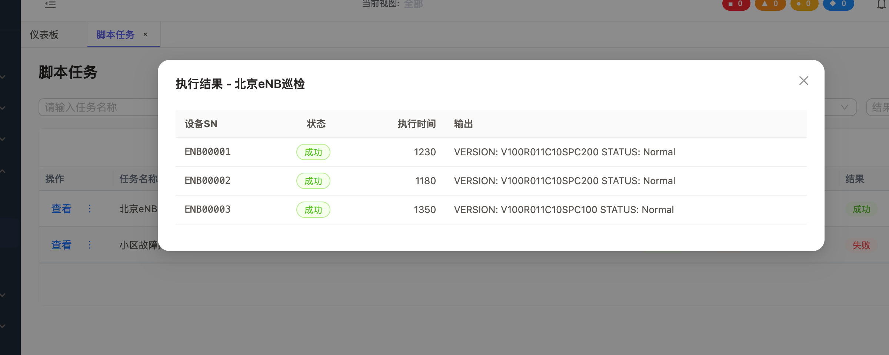

# MML管理
1、mml/script 页面的两个标签页“脚本任务”和“任务记录”  拆分为两个独立的页面，在“MML管理”菜单下级增加“任务记录”菜单
2、common.collapse  是不是确实多语言
3、 脚本任务页面：+/- 折叠功能，改为“查看” 功能，查看采用弹框展示执行的详细信息，UI图：
4、任务记录列表：操作下的文字“信息” 改为“查看”，应该读取 mml_tasks 表的数据，调整列表中的显示字段和字段名称
5、脚本任务列表：确认读取的是 mml_scripts 表中的字段， 筛选框中“请输入任务名称“ 就是错误的，应该是”请输入脚本名称“，依次根据表结构调整列表中的显示字段和字段名称以及筛选条件
6、确保前后端代码实现，变量定义符合功能语义