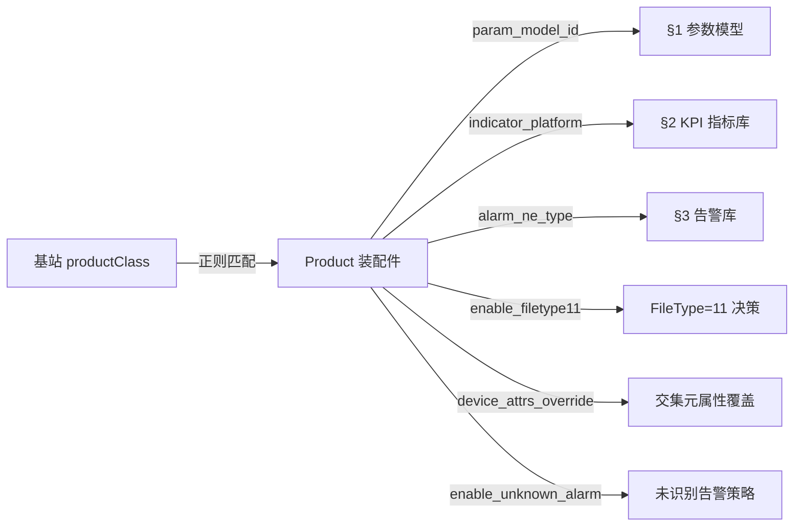
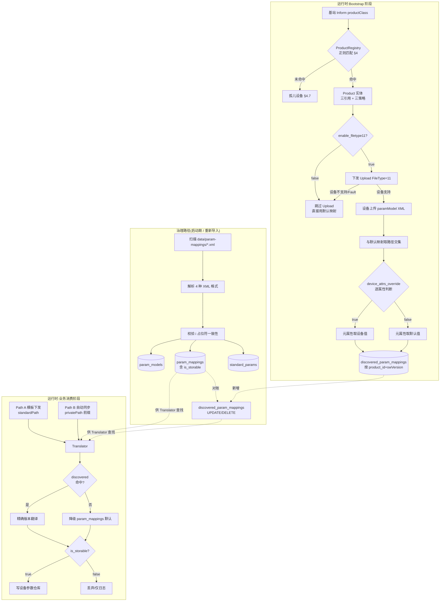
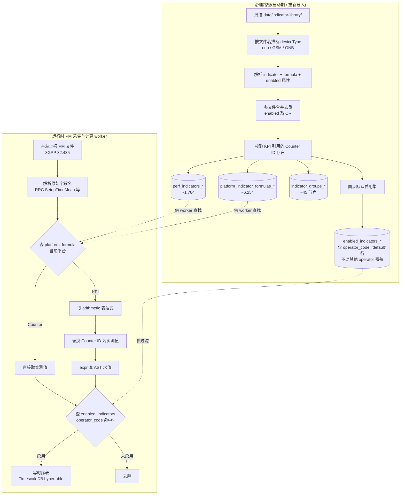
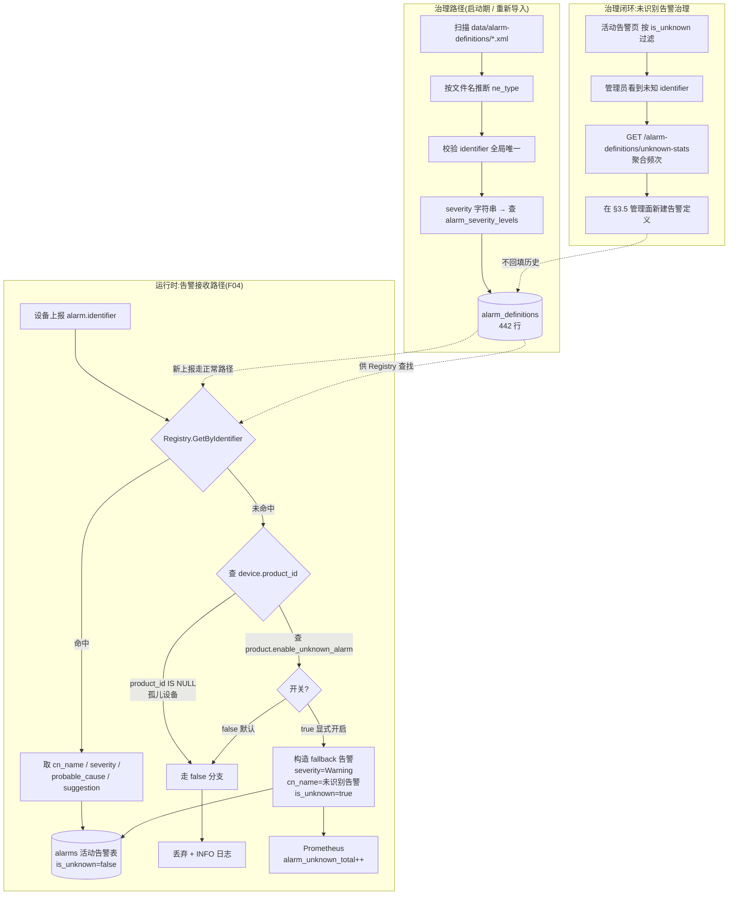

# 参数模型 / KPI 指标库 / 告警库 — 整合设计方案

> 三个领域作为单一功能整体开发：共享"平台化数据字典"基础模式（XML 源文件 → 启动加载 → DB → 双层缓存 → REST API → React UI），实现层各自独立。**产品（Product）** 是把三域装配成一个完整业务身份的"装配件"，是阅读全文的第一线索（详见 §0.5）。
>
> 文档版本：2026-05-07（v3 — 重组：前置 §0.5 产品装配件、补三大业务流程图、按域归并验证/决策记录、删占位章节）

---

## 0. 总览

### 0.1 三个领域定位

| 领域 | 数据本质 | 文件数 | 主要消费者 |
|------|---------|-------|-----------|
| **参数模型** | TR-069 标准路径 ↔ 私有路径映射 + 路由 | 9 产品 + 2 路由 + 1 标准 | provision / sync / interop / device |
| **KPI 指标库** | Counter / KPI 定义 + 平台公式 + 功能集树 | 8 ENB + 1 GSM + 1 GNB | pm 性能管理 / worker |
| **告警库** | 告警标识 → 名称 / 严重级 / 原因 / 建议 | 7 网元类型 | alarm 告警接收路径 |

### 0.2 共同特征 — "为什么是一个功能"

1. **平台化数据字典** — 各领域源数据按 platform 或 device-type 切成多个 XML
2. **启动期加载** — 进程启动时一次性扫描 XML 目录，写入 DB（upsert + 对账）
3. **运行时只读** — 业务代码消费已加载的字典，不修改
4. **后台管理面** — UI 提供导入 / 浏览 / 编辑 / 失效缓存
5. **多实例一致性** — 通过 Redis cache_version 计数器 + L1 sync.Map 失效

### 0.3 三者差异 — "为什么实现各自独立"

| 关注点 | 参数模型 | KPI 指标库 | 告警库 |
|-------|---------|-----------|-------|
| 路由匹配 | productClass 正则 → paramModel + productName | 无（按 platform 直接） | 无（按 ne_type 直接） |
| 双向翻译 | standardPath ↔ privatePath | 无 | 无 |
| 设备交集 | 上报模型 ∩ 默认模型 | 无 | 无 |
| 降级策略 | discovered → default 自动降级 | 无 | 无 |
| 公式系统 | 无 | KPI 公式展开（Counter ID → 原始字段名） | 无 |
| 设备类型分表 | 单套表 | ENB / GSM / GNB **三套独立表** | 单表（用 ne_type 区分） |
| 数据规模 | 4,781 默认映射 + 29 patterns + 2,001 标准 | 1,764 指标 + 6,254 平台公式 | 442 告警 |

> 三者共享基础设施（XML 扫描、缓存失效协议、启动钩子）抽到 `internal/core/dictloader/`，业务实体（ParamModel / Indicator / AlarmDefinition）保持独立。

### 0.4 整体目录结构

```
omcgo/
├── data/                                    # XML 源文件（随代码提交）
│   ├── param-mappings/                      # 9 产品 + 1 标准 + 1 products.xml
│   ├── indicator-library/
│   │   ├── enb/  (8 个平台 XML — BAIBLQ 已合并到 BLQ)
│   │   ├── GSM.xml
│   │   └── GNB.xml
│   └── alarm-definitions/                   # 7 网元 XML
├── internal/
│   ├── core/dictloader/                     # 共享基础设施（4 文件）
│   ├── config/parammodel/                   # 参数模型（9 文件）
│   ├── pm/indicator/                        # KPI 指标库（10 文件）
│   ├── alarm/definition/                    # 告警库（7 文件）
│   └── product/                             # 产品装配件（7 文件）
└── migrations/000NNN_dict_libraries.sql     # 19 张表（含 products + product_class_patterns）
```

### 0.5 产品作为装配件 — 前置阅读

> **为什么先讲产品？** 三个底层字典（参数 / KPI / 告警）各自独立，但运行时**所有路由都从「产品」开始**：基站上报 productClass → 匹配出 product → 拿到三个字典的引用。如果没有这层装配件，§1-§3 任何一处的"参见 §4"都会让读者迷失。

**装配关系**：



**关键概念预览**（详见 §4）：

| 概念 | 一句话 |
|------|--------|
| `products` 表 | 15 个产品聚合，持有三引用 + 三策略开关 |
| `product_class_patterns` 表 | 27 条 productClass 正则，**全局** sort_order 排序，首次命中即返回 |
| 三引用 | `param_model_id`（参数路径） + `indicator_device_type/platform`（KPI 平台） + `alarm_ne_type`（告警网元类型） |
| 三策略 | `enable_filetype11`（是否拉设备实际参数集）+ `device_attrs_override`（哪些元属性以设备为准）+ `enable_unknown_alarm`（未知 identifier 是否入活动告警表） |
| 孤儿设备 | productClass 不命中任何正则的设备；治理流程 §4.7 |

**阅读顺序建议**：先快速浏览 §4.1-§4.3 建立"产品"心智模型 → 再读 §1-§3 各域细节 → 回头读 §4.4 之后的实现 → §5-§7 实现机制 → §8-§12 验证/风险/扩展。

---

## 1. 参数模型（ParamModel）

### 1.0 业务流程图

> 参数模型有两条主流程：**(A) 治理路径**（XML 启动加载）和 **(B) 运行时路径**（Bootstrap 阶段交集 + 业务消费阶段翻译）。下图按时间轴串起来。



**关键决策点说明**：

| 决策点 | 受控字段 | 默认 | 说明 |
|--------|---------|------|------|
| 是否拉设备实际参数集 | `products.enable_filetype11` | true | false 时全程走默认映射；详见 §1.10 |
| 元属性以谁为准 | `products.device_attrs_override` JSONB | 5 个属性全 false（即全用默认） | data_type 业务上禁用；详见 §1.8 |
| 自动同步是否落库 | `param_mappings.is_storable`（XML store 属性） | true | false 的参数仍翻译，但 sync 不写库；详见 §1.11 Path B |
| 重新导入 XML 时旧 discovered 怎么办 | 对账 SQL | private_path 锚点，UPDATE / DELETE | 详见 §1.9 |

### 1.1 背景

旧 `data_model_definitions` 存储 TR-069 参数树（JSONB 大对象），按 carrier/tech/oui/product_class/scope 三级回退解析。该设计缺失**标准路径 ↔ 私有路径映射**能力——不同厂商使用不同私有路径，OMC 需要统一标准路径做跨产品管理。

**移除 Carrier 维度的理由**：参数路径是硬件/固件属性，不是运营商属性。同一款 Baicells QRTB 设备无论部署在哪家运营商，私有路径完全相同（由芯片 + 固件决定）。新方案：
- **参数模型路由**仅依据 productClass（硬件型号），不含 carrier
- **运营商差异**留给上层处理（配置模板、Carrier 适配器）

**核心运行时流程**：

```
启动：加载 XML → 每个产品类型的默认参数模型
基站连接：productClass → 正则匹配 → 确定 paramModel + softwareVersion
基站上传参数模型 → 与默认模型取交集 → 按 (paramModel, softwareVersion) 存入 discovered_param_mappings
参数操作：standardPath → 查 privatePath → TR-069 消息使用 privatePath
```

### 1.2 数据库 Schema

#### 1.2.1 `param_models` — 产品参数模型（9 行）

存储参数模型的顶层定义，由 XML 文件导入生成。一个参数模型可服务多个产品子型号；多个原始平台经整合后可共享同一参数模型（如 BAIBLQ / BLX 复用 BLQ；详见 §1.7 整合规则）。

| 列 | 类型 | 说明 |
|----|------|------|
| id | UUID PK | |
| name | VARCHAR(64) UNIQUE | "RTS" / "QRTB" / "BaiBNQ" 等 |
| total_entries | INT | 对象 + 参数总数 |
| total_objects | INT | 对象数 |
| total_params | INT | 参数数 |
| description | TEXT | |
| is_active | BOOLEAN DEFAULT true | |
| loaded_from | VARCHAR(256) | XML 文件名 |
| created_at / updated_at | TIMESTAMPTZ | |

#### 1.2.2 `param_mappings` — 默认映射（XML 导入，~4,781 行）

每个参数模型下标准路径与私有路径的双向映射。**仅存放 XML 默认映射**，不含设备上报的交集结果。

| 列 | 类型 | 说明 |
|----|------|------|
| id | UUID PK | |
| param_model_id | UUID FK → param_models | CASCADE 删除 |
| standard_path | TEXT NOT NULL | 标准路径 |
| private_path | TEXT NOT NULL | 产品私有路径 |
| entry_type | VARCHAR(8) CHECK ('object','parameter') | |
| access | VARCHAR(16) | READ_ONLY / READ_WRITE |
| data_type | VARCHAR(16) | STRING / INT / U_INT / BOOLEAN / DATE_TIME |
| change_applies | VARCHAR(16) | Immediate / OnReboot |
| min_value / max_value | BIGINT | |
| **is_storable** | **BOOLEAN NOT NULL DEFAULT true** | **该参数是否纳入 OMC 自动同步与持久化；XML `store` 属性决定，缺省视为 true。false 时 sync 不写库（详见 §1.11 Path B）** |
| is_active | BOOLEAN DEFAULT true | |
| created_at / updated_at | TIMESTAMPTZ | |

**索引**：
- 唯一：`(param_model_id, standard_path)`
- 反查：`(param_model_id, private_path) WHERE is_active`

> `is_storable` 是 paramModel 维度的固有属性（属于"该参数有没有持久化价值"），不暴露为产品级覆盖；如需差异化，在 XML 离线工具里按 paramModel 维护。data_type 类业务上几乎不变；同理 is_storable 也建议谨慎调整。

#### 1.2.3 `discovered_param_mappings` — 设备发现的映射（交集结果）

存储基站上报参数模型与默认模型取交集后的结果。**主键改为 `(product_id, software_version, standard_path)`**——按产品隔离，不再按 paramModel。原因：同一 paramModel 可能被多个产品共享（如 paramModel=BLQ 被 QRTB 系列 / BAIBLQ / BLX 三个产品引用），但每个产品的 `enable_filetype11` 和 `device_attrs_override` 配置可能不同，必须分开存储交集结果（详见 §4.2.1）。FileType=11 不支持或被关闭时此表无记录，Translator 自动降级到 `param_mappings`。

| 列 | 类型 | 说明 |
|----|------|------|
| id | UUID PK | |
| product_id | UUID FK → products | CASCADE 删除（产品删除时一并清理交集数据） |
| software_version | VARCHAR(64) NOT NULL | 与 `devices.firmware_version` 同源 |
| standard_path / private_path / entry_type / access / data_type / change_applies / min_value / max_value | 同 `param_mappings` | 部分元属性按 product.device_attrs_override 决定取设备上传值还是默认映射值 |
| **is_storable** | **BOOLEAN NOT NULL DEFAULT true** | **从默认映射继承（不参与设备覆盖）；交集时复制 `param_mappings.is_storable` 当前值** |
| is_active | BOOLEAN DEFAULT true | |
| created_at / updated_at | TIMESTAMPTZ | |

**索引**：
- 唯一：`(product_id, software_version, standard_path)`
- 双向查找：`(product_id, software_version, private_path) WHERE is_active`

> **存储冗余说明**：同一 paramModel 被 N 个产品引用时，discovered 数据会按 product 重复存储 N 份。例如 paramModel=BLQ 被 4 个产品引用 → 同一 swVersion 设备会有 4 份独立的 discovered 记录（每个产品各自按其属性覆盖配置生成）。冗余微小（~5,000 行 × 4 ≈ 20,000 行级别），换来语义清晰。

> **softwareVersion 来源**：TR-069 会话内从当前 Inform 取；非会话场景从 `devices.firmware_version` 读。空值时跳过写入（信息不足则降级到默认映射）。

> **product_id 来源**：基站 Bootstrap → ProductRegistry 路由 → 写入 device.product_id；交集流程从该字段取产品身份。

> **Translator 查找优先级**：`discovered_param_mappings`（精确版本）→ `param_mappings`（默认）降级。

> **关于旧 routing 表**：旧设计的 `product_name_routing` + `param_model_routing` 已整体整合进 §4 的 `products` + `product_class_patterns`。运行时从两步正则遍历简化为一次匹配 + 一次主键查询。本节不再列旧表 schema，详见 §4。

#### 1.2.4 `standard_params` — 标准参数树（2,001 行）

OMC 统一的标准参数路径，独立于厂商实现。用于配置模板、KPI 定义等跨产品场景。

| 列 | 类型 | 说明 |
|----|------|------|
| id | UUID PK | |
| standard_path | TEXT NOT NULL UNIQUE | |
| entry_type | VARCHAR(8) | object / parameter |
| access / data_type / change_applies | VARCHAR(16) | |
| min_value / max_value | BIGINT | |
| created_at / updated_at | TIMESTAMPTZ | |

#### 1.2.5 既有表的变化（参数模型相关）

| 表 | 变化 |
|----|------|
| `oui_registry` | 保留不变 |
| `parameter_discovery_log` | 新增 `param_model_id UUID`（nullable，FK CASCADE SET NULL） |
| `devices.param_model_id` | 新增（nullable，FK CASCADE SET NULL） |
| `data_model_definitions` | Phase 5 删除 |
| `data_model_import_log` | Phase 5 删除 |
| `devices.data_model_id` 列 | Phase 5 删除 |

> `devices.product_id` 由 §4 持有，不在此处重复列出。

### 1.3 路由匹配规则（productClass → product）

27 条 productClass 正则规则迁移至 §4.1 的 `product_class_patterns` 表，按 sort_order 升序遍历，**首次命中返回 product_id**（而非旧设计的两步路由）。正则形态分三类：

**A. 精确匹配**（无通配符）—— 第三方厂商固定字符串
- 例：`CHINA_TELECOM` / `FDD-LTE-Enterprise` / `femto_au` / `HM-TCELL-*-2100` / `LTE-FDD_N1` 等

**B. 锚定路径匹配**（`^...$`）—— 已知 Baicells 子型号
- 例：`^FAP/MLN/SC$` / `^FAP/MLQ/SC$` / `^FAP/PGSM$`

**C. 通配符模式匹配**（`\w+`）—— 芯片型号 + 射频模式组合
- 例：`FAP/\w+(BS31)\w+/CA` / `FAP/\w+(BS81)\w+/(DC|SC)`
- **兜底**：`FAP` —— 任何含 "FAP" 的字符串

#### 匹配顺序（关键约束）

正则是子串匹配，**`FAP` 兜底规则会命中所有包含 "FAP" 的字符串**。如果它排在前面，所有 Baicells 产品都会被错误识别。

排序机制：
1. 离线生成 `products.xml` 时按正则特异性排序（锚点 `^$` > 通配符 `\w+` > 纯字符串）
2. 加载器按 XML 元素位置依次赋 `sort_order = 1, 2, 3...`
3. 运行时 `ORDER BY sort_order ASC` 遍历，首次命中即返回 `product_id`

#### 1 产品多正则

QRTB 系列（CA / DC / SC 三种射频模式）= 1 个产品，对应 3 条 productClass 正则；MLN 系列同理。`product_class_patterns` 表多对一关联到 `products`。详见 §4.1。

### 1.4 Go 后端架构

#### 包结构 `internal/config/parammodel/`

```
internal/config/parammodel/
├── model.go         # 领域类型
├── repository.go    # 接口定义
├── pg_repository.go # PostgreSQL 实现
├── handler.go       # HTTP 端点（Gin）
├── registry.go      # 路由解析 + 映射缓存
├── translator.go    # standardPath ↔ privatePath 翻译
├── loader.go        # XML 文件加载
├── intersect.go     # 基站模型与默认模型交集
└── cache.go         # Redis L2 缓存
```

#### 核心类型

| 类型 | 用途 |
|------|------|
| `ParamModel` | 对应 `param_models` |
| `ParamMapping` | 对应 `param_mappings` 和 `discovered_param_mappings`（合并 struct，`SoftwareVersion *string` 为 nil 表示默认映射） |
| `ProductNameRoute` | 对应 `product_name_routing` |
| `ParamModelRoute` | 对应 `param_model_routing` |
| `StandardParam` | 对应 `standard_params` |
| `TranslationResult` | `{Original, Translated, Found, Mapping}` |

### 1.5 Registry 解析流程（与 §4 ProductRegistry 协作）

```
基站 Inform → productClass = "FAP/pBS7430/DC"

  Step 1: 产品路由（由 §4 ProductRegistry 处理）
    → 按 sort_order ASC 遍历 product_class_patterns
    → 首次 regexp.MatchString 命中 → 得到 product_id
    → 查 products 表 → 返回 Product 实体（含 paramModelID / indicatorPlatform / alarmNeType 三引用）
    → 未命中任何正则 → 返回 nil（孤儿设备，由 §4.7 处理）

  Step 2: 加载映射（ParamModelRegistry，按 productId 取映射集）
    → GetTranslator(product.ID, softwareVersion)
    → 查 discovered 缓存 WHERE product_id = ?（L1 sync.Map → L2 Redis → DB discovered_param_mappings）
    → 未命中则按 product.ParamModelID 查 default 缓存（L1 → L2 → DB param_mappings）
    → 返回双向映射（standardToPrivate + privateToStandard）
```

**职责拆分**：
- §4 `ProductRegistry`：负责 productClass → product 的正则匹配（一次匹配，一次主键查询）
- §1.4 `ParamRegistry`（精简）：仅负责"按 productId/paramModelID 取参数映射"，不再做 productClass 路由
- KPI / 告警的 Registry 同样由 ProductRegistry 提供"哪个平台 / ne_type"信息后再加载

### 1.6 Translator 翻译

```
TranslateToPrivate(ctx, productId, softwareVersion, standardPath) → TranslationResult
TranslateToStandard(ctx, productId, softwareVersion, privatePath) → TranslationResult
```

- O(1) 查找（map 查询），ACS 运行时使用
- API 签名以 **productId** 为入参（非 paramModelId），原因：discovered 表已按产品隔离（详见 §1.2.3）；同一 paramModel 被多个产品共享时，不同产品的 device_attrs_override 配置可能不同，必须按产品取
- 内部查找流程：
  1. 先查 `discovered_param_mappings` WHERE `product_id = ? AND software_version = ?`（精确）
  2. 未命中则降级到 `param_mappings` WHERE `param_model_id = ?`（通过 product → paramModelId 内部 lookup 得到默认映射）
- SetParameterValues：模板用 standardPath 定义 → 翻译为 privatePath 下发
- GetParameterValues 响应：privatePath → 翻译回 standardPath 存储

### 1.7 XML 加载器

启动时从 `data/param-mappings/` 加载：

1. 扫描 `*.xml` 文件
2. 解析四种格式（产品映射 / 产品名路由 / 模型路由 / 标准树）
3. 校验 `{i}` 占位符一致性（不通过的映射拒绝导入）
4. Upsert 语义：每个 XML 在事务中处理（删旧 → 批量插入新）
5. 加载完毕对账 `discovered_param_mappings`（见 §1.9）
6. 预热 L1 缓存

#### `{i}` 占位符校验规则

standardPath 与 privatePath 的 `{i}` 出现次数**必须相等**（运行时翻译需要按位置填实例号）。

```
✓ private="Device.Services.FAPService.{i}.X_COM_LICENSE."
  standard="Device.Services.FAPService.{i}.LICENSE."        （各 1 个 {i}）

✗ private="Device.FAP.MaxTxPower"                           （0 个 {i}）
  standard="Device.Services.FAPService.{i}.CellConfig.{i}.RF.TxPower"  （2 个 {i}）
```

#### 四种 XML 格式

**格式 A — 产品参数映射**（`BLQ.xml` / `MLN.xml` 等，9 个文件，详见 §1.7.1 整合规则）

```xml
<?xml version="1.0" ?>
<parameterModel paramModel="BLQ" totalEntries="754">
    <objects>
        <object name="Device.Services.FAPService.{i}.FAPControl.LTE.X_COM_LICENSE."
                standardPath="Device.Services.FAPService.{i}.FAPControl.LTE.LICENSE."
                access="READ_ONLY" changeApplies="Immediate"/>
    </objects>
    <parameters>
        <param name="Device.DeviceInfo.CPI_Id"
               standardPath="Device.DeviceInfo.SAS.CpiId"
               access="READ_WRITE" type="STRING" max="256"
               changeApplies="Immediate"
               store="true"/>
        <!-- store 属性可选；缺省视为 true。设为 false 表示该参数不纳入自动同步存储 -->
        <param name="Device.DeviceInfo.X_Vendor_BuildTimestamp"
               standardPath="Device.DeviceInfo.X_Vendor_BuildTimestamp"
               access="READ_ONLY" type="STRING" max="64"
               changeApplies="Immediate"
               store="false"/>
    </parameters>
</parameterModel>
```

写入：`param_models`（1 行）+ `param_mappings`（N 行，`is_storable = (store != "false")`）

**格式 B & C 已合并** — 旧的 `product-name-routing.xml` + `param-model-routing.xml` 整合为新的 `products.xml`，详见 §4.5 XML 格式。新格式按"产品"组织，每个产品包含三字典引用 + N 条 productClass 正则。

**格式 D — 标准参数树**（`standard-model.xml`）

```xml
<standardModel totalPaths="2001">
    <objects>
        <object standardPath="Device.FaultMgmt.CurrentAlarm." access="READ_ONLY" changeApplies="Immediate"/>
    </objects>
    <parameters>
        <param standardPath="Device.DeviceInfo.SerialNumber"
               access="READ_ONLY" type="STRING" max="64"
               changeApplies="Immediate"/>
    </parameters>
</standardModel>
```

**多产品同名标准路径合并策略**：

| 字段 | 策略 | 理由 |
|------|------|------|
| `type` | 多数票 | 反映主流模型 |
| `access` | 最宽松（READ_WRITE 优先） | 避免误拦合法写入 |
| `changeApplies` | 多数票 | |
| `min` / `max` | 仅当所有产品都指定时保留最宽范围 | 避免部分数据假约束 |

写入：`standard_params`

> **数据来源说明**：XML 文件由独立离线脚本生成（脚本不在主仓库追踪），生成产物随代码提交。具体外部数据源连接信息属于离线工具配置，不在本设计文档范围。

#### 1.7.1 平台整合规则（9 paramModel 的由来）

历史上 OMC 涉及十余个 4G/5G 平台，多个平台在 TR-069 参数层面**完全复用同一套**或**已弃用**。整理后保留 9 个独立 paramModel，整合规则如下：

| paramModel | 包含的运行时平台 | 复用/合并依据 |
|-----------|----------------|-------------|
| **BLQ** | BAIBLQ / BLX / 436Q (QRTB) / NEU430 | `MethodExecuteHandler` 的 `getPlatformTypeString()` 把这四类统一映射到 "436Q" 这一套；BLQ 是其规范命名 |
| **BM** | BM / Intel_CR (CR-B4860) | TR069 层面 BM 独立，但 KPI 层面 BM 与 Intel_CR 1083 条指标 formula 完全一致；TR069 沿用 BM |
| **MLN** | MLN_CA / MLN_DC / MLN_SC | 三个射频模式共享同一参数集 |
| **MLQ** | MLQ | 独立 |
| **BSC** | BSC（含 BTS 的 KPI 上报） | BTS 挂在 BSC 下，TR069 各自独立但 KPI 由 BSC 统一上报 |
| **BTS** | BTS | TR069 参数独立 |
| **BaiBNQ** | BaiBNQ（5G） | 独立；GNB 设备 |
| **ENB_DEFAULT_098** | 第三方厂商默认（华为 TCELL / 京信 / 等 12 个 productClass） | 第三方设备共用此 098 默认参数集 |
| **ENB_DEFAULT_181** | 第三方厂商默认（大唐 / CICT 等 3 个 productClass） | 第三方设备共用此 181 默认参数集 |

**已剔除的历史平台**（不再支持，不生成 XML）：
- 弃用：NB_IOT / NEU430 / Nova430 / Nova430i / QATB
- 旧硬件：RTS（Intel） / QAFA（QA_V4）/ QAFB（QA_V3）/ QATA / DXDF / CHINA_TELECOM / PM-B4860 / CR-B4860（CR 系列）

> 注：旧 KPI 平台名 `BaiBNX` 与 TR069 paramModel `BaiBNQ` 是同一 5G 产品的不同命名，本设计统一为 `BaiBNQ`（GNB.xml 的 platform 属性同步改名）。

> 整合依据来源于代码 `MethodExecuteHandler.ParamMappingCache.java` `getPlatformTypeString()` + 数据库 `rela_platform_indicator_formula` 平台对比，具体细节参见离线整理文档《平台类型与指标映射关系整理》。

### 1.8 交集逻辑

基站首次连接时上报完整参数模型 + 元属性（access / data_type / change_applies / min / max），与系统预定义的默认模型取**路径交集**，并按产品配置决定**元属性**取设备值还是默认值。

```
基站上传参数模型 XML → 解析 privatePath + 设备上报的元属性
ProductRegistry → 当前 device 对应 product
默认 paramModel = product.paramModelID → param_mappings 反向索引

对每条 privatePath 都存在于设备上传集的条目，构造 discovered 记录：
  - standard_path / private_path / entry_type = 取默认映射值（永远）
  - 对 5 个元属性 (access / data_type / change_applies / min_value / max_value)：
      若 product.device_attrs_override[属性] = true → 取设备上传值
      否则                                         → 取默认映射值

以 (product_id, software_version) 为键写入 discovered_param_mappings
写入完成主动 DEL Redis 键 parammodel:discovered:{productId}:{swVersion}
```

**说明**：
- `device_attrs_override` 默认全 false → 所有元属性取默认值，行为与不开属性覆盖时相同
- `data_type` 业务上几乎不变更，UI 上显示但禁用（不可勾选），即使 JSONB 里手工写了 true 也建议拒绝；详见 §11 决策记录

### 1.9 重新导入 XML 时的对账策略

重新导入 XML 替换 `param_mappings`。`discovered_param_mappings` 中的已有数据可能与新默认映射不一致，需要对账。**以 `private_path`（设备固件真实路径，不因 XML 更新而变）为锚点**：

| 场景 | 条件 | 动作 |
|------|------|------|
| 映射不变 | private_path 仍存在，standard_path 和元数据未变 | 不动 |
| 标准路径/元数据变了 | private_path 仍存在，但 standard_path 或元数据变了 | UPDATE |
| 映射被删除 | private_path 不再存在于新默认映射 | DELETE |

**对账 SQL（关键算法骨架）**：

```sql
-- DELETE：private_path 在新默认映射中已不存在
DELETE FROM discovered_param_mappings d
USING products pr
WHERE d.product_id = pr.id
  AND NOT EXISTS (
    SELECT 1 FROM param_mappings p
    WHERE p.param_model_id = pr.param_model_id
      AND p.private_path = d.private_path
  );

-- UPDATE：private_path 仍在，但 standard_path 或元数据变了
-- 注意：仅刷新该产品 device_attrs_override = false 的属性（用默认映射值的那部分）
UPDATE discovered_param_mappings d
SET standard_path = p.standard_path,
    access = CASE WHEN (pr.device_attrs_override->>'access')::boolean THEN d.access ELSE p.access END,
    /* min_value / max_value / change_applies 同理 */
    is_storable = p.is_storable,   -- 始终跟随默认映射（不参与设备覆盖）
    updated_at = now()
FROM param_mappings p, products pr
WHERE d.product_id = pr.id
  AND p.param_model_id = pr.param_model_id
  AND d.private_path = p.private_path
  AND (d.standard_path IS DISTINCT FROM p.standard_path OR d.is_storable IS DISTINCT FROM p.is_storable OR ...);
```

> 对账逻辑变更：UPDATE 时按 `device_attrs_override` 决定每个元属性是保留设备上传值还是刷新为新默认值。被覆盖的属性（设置为 true）始终保留 discovered 中的设备值；未被覆盖的属性才接受默认映射的更新。

**设备固件升级**：自然覆盖，无需特殊处理。新 SoftwareVersion → Bootstrap → 重新触发 Upload(FileType=11) → 新版本交集结果写入。旧版本 discovered 映射**不删除**（可能有其他同型号设备仍在旧固件）。

### 1.10 FileType=11 启用判断与降级

```
基站 Bootstrap → ProductRegistry 路由 → 得到 product
  ↓
检查 product.enable_filetype11
  │
  ├─ false（管理员关闭）
  │    → 不下发 Upload(FileType=11)
  │    → discovery_log 标记 skipped（reason=disabled_by_product_config）
  │    → Translator 查无 discovered → 自动降级到默认映射
  │
  └─ true（默认值）
       → 下发 Upload(FileType=11)
         ├─ 设备支持 → 上传参数模型 XML
         │             → 按 §1.8 交集（含 device_attrs_override 元属性覆盖逻辑）
         │             → 写 discovered_param_mappings WHERE product_id = ?
         │             → discovery_log 标记 completed
         │
         └─ 设备不支持（SOAP Fault / TransferComplete Fault）
              → 直接使用 param_mappings 默认映射
              → discovery_log 标记 completed（used_default=true）
              → Translator 查无 discovered → 自动降级到默认映射
```

**关闭 enable_filetype11 时的现有 discovered 数据保留策略**：

修改 `enable_filetype11` 配置只影响**新设备/新上传行为**，**不会自动失效已存在的 discovered 数据**。这意味着：
- 关闭前已上传的设备，其 discovered 记录继续被 Translator 使用（新接入的同型号同 swVersion 设备也会复用）
- 如果管理员希望立即失效，使用 §4.9 提供的 `[立即重置该产品的 discovered 数据]` 按钮（DELETE WHERE product_id = ?）
- 这种"配置变更不破坏数据"的设计避免了误关开关导致的运行时雪崩

### 1.11 三条消费路径的改造

#### Path A：模板自动配置（Translator 集成）

模板的 `Parameters` JSON key 统一为 standardPath（现有模板需迁移）。

| 环节 | 改动 |
|------|------|
| `provision/orchestrator.go` `BuildProvisioningSteps` | SPV 步骤生成时，将模板参数 key 翻译为 privatePath |
| `provision/orchestrator.go` `extractParameterNames` | GPV 步骤提取参数名时翻译为 privatePath |
| 模板存储 | `Parameters` JSON key 统一 standardPath |

#### Path B：自动同步（GPN 完全省略）

`param_mappings` 已含全部参数路径，不需要 GPN 向设备"发现"。

| 环节 | 旧 | 新 |
|------|-----|-----|
| DataModel 获取 | `dmRegistry.ResolveForDevice` 三级回退 | `paramRegistry.ResolveParamModel(dev.ProductClass)` 正则路由 |
| 同步计划 | `NewParameterTreeIterator(dm)` 遍历 JSONB | 从 `ParamMapping` 列表提取去重 privatePath 前缀（**仅 `is_storable=true` 的条目参与；详见下方"is_storable 过滤"**） |
| 多实例发现 | GPN 分层 + `{N}` 实例号展开 | **删除**——直接 GPV 对象前缀，设备自动返回所有实例 |
| 参数值读取 | GPV 按精确路径 | GPV 按对象前缀，一次取整个子树 |
| 参数存储 | 原样存 privatePath | `TranslateToStandard` → 以 standardPath 存；落库前再按 `is_storable` 过滤一次（GPV 子树会带回不可存条目，丢弃即可） |

**`is_storable` 过滤策略**：
- 同步计划生成时：仅取 `is_storable=true` 的 privatePath 计算前缀集合（避免为纯不可存参数发起多余 GPV）
- 接收 GPV 响应时：按精确路径反查 `param_mappings.is_storable`；false 的条目**不写入设备参数仓库**，但仍可保留在响应日志里供排查
- Translator 与 Path A（模板下发）**不受影响**：模板用谁的 standardPath 就翻译谁的 privatePath，是否存储仅约束"自动同步是否落库"

**删除的旧代码**：`ParameterTreeIterator` / GPN 分层调度 / `SyncPlan.Phase1GPNs` 等。

#### Path C/D：模型上传与降级

| 环节 | 改动 |
|------|------|
| `provision/engine.go` HandleBootstrap | Path C 失败后降级"使用默认 paramModel"，不再走 Path D(fail) |
| `provision/model_upload.go` | 新增 `HandleUploadFailed()`：标记 discovery_log 为 completed（used_default=true），关联默认 param_model_id |
| `engine.go` 事件订阅 | 订阅 `command.upload.response` 与 `device.inform.transfer_complete`，匹配 model-upload CommandKey 时触发降级 |

### 1.12 消费者更新清单

| 文件 | 旧 | 新 |
|------|-----|-----|
| `provision/engine.go` | `dmRegistry.ResolveForDevice(dev)` | `paramRegistry.ResolveParamModel + GetParamModel` |
| `provision/model_upload.go` | `dmImporter.ImportFromXMLForCPE(...)` | `intersect.IntersectCPEModel(...)` → `discovered_param_mappings` |
| `provision/sync.go` | JSONB 树遍历 + GPN 分层 | ParamMapping 列表 + GPV 前缀 + Translator 存储 |
| `device/device_param_handler.go` | `NewParameterValidator(dm)` | `GetParamModel` + 新 mapping-based validator |
| `interop/runner.go` | `dataModelReg.ResolveForDevice` | `paramRegistry.GetParamModel` |
| `interop/validator.go` | 校验 ParameterTree | 校验 ParamMapping metadata |

### 1.13 REST API

#### 1.13.1 参数模型管理

```
GET    /api/v1/param-models                        # 列表（含统计）
GET    /api/v1/param-models/:name                  # 详情
POST   /api/v1/param-models/import                 # 上传 XML 导入（**唯一新建途径**，不开放手动空建）
POST   /api/v1/param-models/import-directory       # 从服务器目录加载
PUT    /api/v1/param-models/:name                  # 更新元信息（description / is_active）
GET    /api/v1/param-models/:name/export           # 导出 XML
DELETE /api/v1/param-models/:name                  # 删除模型及全部映射
POST   /api/v1/param-models/:name/reload           # 从原始 XML 重新加载
```

#### 1.13.2 默认映射 / 设备发现映射

```
# 默认映射（XML 导入）
GET    /api/v1/param-models/:name/mappings              # 列表（分页/搜索；响应含 is_storable）
POST   /api/v1/param-models/:name/mappings              # 手动创建（含 is_storable，未传时默认 true）
PUT    /api/v1/param-models/:name/mappings/:id          # 更新（含切换 is_storable）
DELETE /api/v1/param-models/:name/mappings/:id          # 删除

# 设备发现的交集映射
GET    /api/v1/products/:id/discovered?swVersion=xxx           # 按产品查（discovered 已按 product_id 隔离）
GET    /api/v1/products/:id/discovered/versions                 # 列出该产品已有的 swVersion
DELETE /api/v1/products/:id/discovered?swVersion=xxx            # 删除指定版本（清空则用 §4.4 重置端点）
```

#### 1.13.3 标准参数 / 翻译 / 缓存

> productClass 路由相关 API 已迁移至 §4.4 /api/v1/products

```
# 标准参数树（GET 任意角色，写操作仅 super_admin）
GET    /api/v1/param-models/standard               # 列表（搜索/过滤）
GET    /api/v1/param-models/standard/:path
POST   /api/v1/param-models/standard               # 新增标准路径（super_admin）
PUT    /api/v1/param-models/standard/:path         # 编辑（super_admin）
DELETE /api/v1/param-models/standard/:path         # 删除（super_admin，被引用时拒绝）

# 翻译（调试/工具）
POST   /api/v1/param-models/translate
       { productId, softwareVersion, direction, paths[] }   # 按 productId 翻译（discovered 已按产品隔离）
       → { results: [{original, translated, found, source: "discovered"|"default"}] }

# 缓存
POST   /api/v1/param-models/cache/refresh
```

### 1.14 Redis Key

```
parammodel:mapping:{paramModelId}:default              # 默认映射 (TTL 24h)
parammodel:discovered:{productId}:{softwareVersion}    # 交集映射 (TTL 24h，按产品隔离)
parammodel:cache_version                               # 跨实例失效计数器（持久化，无 TTL）

# productClass 路由缓存归属新 product 模块，详见 §4.6
```

### 1.15 配置

`internal/core/appconfig/config.go` 新增：

```go
type ParamModelConfig struct {
    Enabled            bool          // 功能开关
    XMLDirectory       string        // 默认 "data/param-mappings/"
    AutoLoadOnStartup  bool          // 默认 true
    DefaultCacheTTL    time.Duration // 默认 24h
    DiscoveredCacheTTL time.Duration // 默认 24h
    RoutingCacheTTL    time.Duration // 默认 1h
    LoadConcurrency    int           // 默认 4
}
```

### 1.16 前端设计

路由 `/product/param-model`（位于新增的"产品管理"一级菜单下，详见 §7.3 菜单接入），Ant Design Tabs：

| Tab | 内容 |
|-----|------|
| 参数模型 | **顶部工具栏**：「导入 XML」/「从服务器加载」/「刷新缓存」。**表格**（Name / 总条目 / 对象 / 参数 / 加载来源 / is_active / 操作）。**操作列**：编辑（弹窗改 description / is_active）/ 重新加载（reload，从原始 XML 刷新）/ 导出 XML / 删除（二次确认，连带 mappings + discovered 全部 CASCADE）。点击行展开映射详情抽屉，抽屉内分子 Tab：「默认映射」「设备映射」（按 swVersion 分组） |
| 默认映射抽屉 | **顶部**：「新增映射」按钮 + 关键字搜索 + 「仅显示不可存」过滤。**表格**（standardPath / privatePath / type / access / changeApplies / min/max / **storable** / 操作）。**操作列**：编辑（弹窗改字段，含 `{i}` 占位符校验 + storable 切换）/ 删除（二次确认） |
| 设备映射抽屉 | 按 swVersion 分组的下拉选择 + 表格只读展示 + 「删除该版本」按钮（清掉某个 swVersion 的全部交集，不影响默认映射） |
| 标准参数树 | Ant Tree 组件，从 standard_params 构建层级树 + 关键字搜索。**super_admin 可见**：节点右侧「+ 新增子节点」/「编辑」/「删除」按钮（删除前校验未被任何 paramModel 引用，被引用时弹窗提示拒绝） |
| OUI 注册表 | 沿用现有功能 |

> **Tab 数量从 5 减到 3**：原"产品名路由"和"参数模型路由"两个 Tab 已删除，所有 productClass 路由管理统一搬到 §4 产品页（`/product/products`）。本页仅承担"参数路径定义"的纯粹职责。

#### 文件清单

```
omcmb/webcode/src/pages/product/ParamModel/
├── index.tsx                # Tabs 主页（3 Tab）
├── ParamModelPanel.tsx
├── MappingDrawer.tsx
├── StandardTreePanel.tsx
└── OUIPanel.tsx             # 迁移自旧 DataModelManagement/

omcmb/frontend-core/src/services/api/paramModelApi.ts
omcmb/frontend-core/src/hooks/api/useParamModels.ts
```

---

## 2. KPI 指标库（IndicatorLib）

### 2.0 业务流程图

> KPI 指标库有两条主流程：**(A) 治理路径**（XML 启动加载 + 默认启用集刷新）和 **(B) 运行时路径**（PM worker 公式展开 + 计算）。



**关键决策点说明**：

| 决策点 | 受控字段 | 默认 | 说明 |
|--------|---------|------|------|
| 是否默认启用某指标 | `indicator.enabled` XML 属性 | true | 缺省视为 true；多文件 OR 合并；详见 §2.6 |
| 运营商是否覆盖默认 | `enabled_indicators_*.operator_code` | "default" | 运营商按 operator_code 覆盖；loader 重导入仅刷新 default 行 |
| 同一指标在不同平台 | `platform_indicator_formulas_*.platform_name` + `formula` | 按平台展开 | 例 BLQ vs MLN 的 RRC.SuccConnEstab 字段名可能不同 |
| Counter 引用 KPI 不存在 | 启动校验 | 记 ERROR 但允许加载 | 旧数据有 97 个孤儿 KPI ID 历史包袱；UI 标红展示 |

### 2.1 背景

KPI 指标库是 PM 性能管理子系统的元数据基础，定义"采集什么 / 怎么聚合 / 用什么公式计算"。源数据从旧 MySQL 系统导出 → 转换为 XML → 作为本系统唯一真相源。XML 文件由离线脚本生成，跟代码一起提交。

**核心概念**：

- **指标（Indicator）** = 性能测量单元，分 Counter（原始计数器）和 KPI（由 Counter 通过算术公式计算得出）
- **功能集（Indicator Group）** = 指标的分组容器，树形结构
- **平台公式（Platform Formula）** = 同一指标在不同硬件平台下的展开公式（Counter 是该平台 PM 文件中的原始字段名；KPI 是 Counter 替换后的完整表达式）
- **设备类型（Device Type）** = ENB（4G）/ GSM（2G）/ GNB（5G），三套**完全独立**的指标集 + 功能集树 + 数据库表

### 2.2 三种设备类型对比

| 维度 | ENB | GSM | GNB |
|------|-----|-----|-----|
| 指标表 | `perf_indicators_enb` | `perf_indicators_gsm` | `perf_indicators_gnb` |
| 功能集表 | `indicator_groups_enb` | `indicator_groups_gsm` | `indicator_groups_gnb` |
| 平台公式表 | `platform_indicator_formulas_enb` | `platform_indicator_formulas_gsm` | `platform_indicator_formulas_gnb` |
| 启用表 | `enabled_indicators_enb` | `enabled_indicators_gsm` | `enabled_indicators_gnb` |
| Counter 数 | 1,333 | 45 | 217 |
| KPI 数 | 76 | 28 | 65 |
| 总数 | 1,409 | 73 | 282 |
| 功能集节点 | 22 | 8 | 15 |
| 平台数 | 8（保留，BAIBLQ 已合并入 BLQ） | 1（BSC） | 1（BaiBNQ） |
| 默认启用 | 263（XML enabled 属性决定，缺省 true） | 53（同 ENB 规则） | 282（XML 全部 enabled=true） |
| `indicator_level` 字段 | 有 | 有 | **无** |

> **默认启用列表的来源**：每个 indicator 在 XML 中携带 `enabled="true|false"` 属性（缺省视为 true）；loader 加载时按 `(operator_code='default', indicator_id)` upsert 到对应 device 的 `enabled_indicators_*` 表。运营商可在管理面页面（§2.9 启用配置 Tab）按运营商代码覆盖默认启用集，但 default 行始终由 XML 真相源刷新。

> **设计抉择**：三套独立表 vs 单表 + device_type 列。
> 选择独立表的原因：(1) 指标 ID 命名空间互不重叠（`C00...` ENB / `CGSM...` GSM / `C01...` GNB）；(2) GNB 没有 `indicator_level` 字段，强行合并需要 nullable 列；(3) 三套数据演进节奏可能不同。Java 类比：相当于三个独立 Entity，没有公共抽象父类。

### 2.3 数据库 Schema

> **2026-05-07 决策 D1=A 命名对齐说明**（实施计划 §6 决策表 D1=A，T-0098-P1-05 docs 落地）：
>
> 本节使用的目标名（左列）在生产 schema 中以历史命名（右列）实际落地。**保留现状**，迁移 `000035_indicator_management.sql` 沿用以下别名；后续 Loader / Registry / API 代码以历史命名为准。本节其余规格（列、唯一约束、索引、行数）仍以左列描述为契约。
>
> | 设计目标名（本节使用） | 生产实际表名（已落地，迁移 000035） |
> |---|---|
> | `indicator_units` | `indicator_unit`（单数） |
> | `platform_indicator_formulas_enb` | `rela_platform_indicator_formula_enb` |
> | `platform_indicator_formulas_gsm` | `rela_platform_indicator_formula_gsm` |
> | `platform_indicator_formulas_gnb` | `rela_platform_indicator_formula_gnb` |
> | `enabled_indicators_enb` | `enabled_pm_indicators_enb` |
> | `enabled_indicators_gsm` | `enabled_pm_indicators_gsm` |
> | `enabled_indicators_gnb` | `enabled_pm_indicators_gnb` |
>
> 决议依据：实际落地表已在 17 张迁移产物 + `internal/pm/indicator/` 15 个 Go 文件中广泛引用；重命名将链式触发 PM worker / loader / handler / repo 大规模 churn，价值低于风险。设计文档采纳"按现实回写"，不写 `000060_kpi_rename.sql`。

#### 2.3.1 共享：`indicator_units` — 单位字典（27 行）

| 列 | 类型 | 说明 |
|----|------|------|
| id | UUID PK | |
| code | VARCHAR(32) UNIQUE | "ms" / "%" / "number" / ... |
| cn_name / en_name | VARCHAR(64) | |
| created_at | TIMESTAMPTZ | |

#### 2.3.2 ENB 四件套

`perf_indicators_enb` — ENB 指标定义（1,409 行，8 个平台 XML 取并集去重）

| 列 | 类型 | 说明 |
|----|------|------|
| id | VARCHAR(16) PK | "C000000001" / "K900010001" |
| en_name | VARCHAR(128) | 英文展示名 |
| report_key | VARCHAR(128) | 上报标识（OMC ↔ 基站映射） |
| cn_name | VARCHAR(128) | |
| is_built_in | BOOLEAN | 1 内置 / 0 自定义 |
| is_counter | BOOLEAN | 1 Counter / 0 KPI |
| data_type | VARCHAR(16) | 整数 / 实数（KPI 时可空） |
| unit_id | UUID FK → indicator_units | |
| statis_type | VARCHAR(16) | sum / avg / max / pct |
| arithmetic | TEXT | Counter 时为自身 ID；KPI 时为公式表达式 |
| indicator_level | VARCHAR(8) | device / plmn / both |
| group_id | UUID FK → indicator_groups_enb | |
| created_at / updated_at | TIMESTAMPTZ | |

`indicator_groups_enb` — 功能集树（22 节点）

| 列 | 类型 | 说明 |
|----|------|------|
| id | UUID PK | |
| parent_id | UUID FK → self | NULL 为根 |
| name | VARCHAR(64) | "PDCP" / "ERAB" 等 |
| sort_order | INT | |
| created_at / updated_at | TIMESTAMPTZ | |

`platform_indicator_formulas_enb` — 平台公式（~10,092 行）

| 列 | 类型 | 说明 |
|----|------|------|
| id | UUID PK | |
| platform_name | VARCHAR(32) | "BLQ" / "MLN" 等，多数与 paramModel 同名（注：KPI 平台空间与 paramModel 略有差异——KPI 保留 BLX / ALL 作为独立公式集；BAIBLQ 已合并入 BLQ；TR069 多个 paramModel 共享 BLQ） |
| indicator_id | VARCHAR(16) FK → perf_indicators_enb | |
| formula | TEXT | 该平台下的展开公式 |
| created_at / updated_at | TIMESTAMPTZ | |

唯一约束：`(platform_name, indicator_id)`

`enabled_indicators_enb` — 启用配置（默认 263 行，**操作员维度**；行数随 XML 中 `enabled="true"` 数量浮动）

| 列 | 类型 | 说明 |
|----|------|------|
| id | UUID PK | |
| operator_code | VARCHAR(32) | "default"（XML 真相源；其他运营商行可覆盖） |
| indicator_id | VARCHAR(16) FK → perf_indicators_enb | |
| enabled_at | TIMESTAMPTZ | |

唯一约束：`(operator_code, indicator_id)`

> **写入语义**：仅"启用"才会有行；"禁用"=不存在该行。loader 重导入时，先按 `operator_code='default'` 删除无新 enabled=true 命中的旧行，再 upsert 新启用集，**绝不动其他 operator_code 的覆盖行**。


#### 2.3.3 GSM 四件套

结构与 ENB 完全平行。数据规模：73 + 8 + 73 + 53。仅 BSC 平台。`enabled_indicators_gsm` 默认 53 行同样由 XML `enabled` 属性决定（缺省 true）。

#### 2.3.4 GNB 四件套

结构与 ENB 平行，**但 `perf_indicators_gnb` 无 `indicator_level` 列**。数据规模：282 + 15 + 282 + 282（XML 全部 `enabled="true"`，因此默认全量启用）。仅 BaiBNQ 平台（与 TR069 paramModel 同名，旧 KPI 命名 BaiBNX 已统一为 BaiBNQ）。如未来需要默认禁用某些指标，在 XML 中改 `enabled="false"` 即可，无需改代码。

### 2.4 Go 后端架构

#### 包结构 `internal/pm/indicator/`

```
internal/pm/indicator/
├── model.go              # 三种设备类型 + 共享类型（Unit / IndicatorGroup）
├── repository.go         # 接口定义
├── pg_repository_enb.go  # PostgreSQL 实现：ENB
├── pg_repository_gsm.go  # PostgreSQL 实现：GSM
├── pg_repository_gnb.go  # PostgreSQL 实现：GNB
├── handler.go            # HTTP 端点
├── registry.go           # 内存索引：indicator_id → IndicatorDef，formula 缓存
├── loader.go             # XML 加载（17 个文件）
├── formula.go            # KPI 公式展开 + 校验
└── cache.go              # Redis 缓存
```

#### 核心类型

| 类型 | 用途 |
|------|------|
| `ENBIndicator` / `GSMIndicator` / `GNBIndicator` | 三种设备指标定义（GNB 比另两种少 indicator_level） |
| `IndicatorGroup` | 功能集树节点（共享） |
| `PlatformFormula` | 平台公式（device_type 通过 Repository 区分） |
| `EnabledIndicator` | 启用配置 |
| `Unit` | 单位字典 |
| `FormulaEvaluation` | 公式评估结果（PM 计算时使用） |

> 三种 Indicator 类型字段大量重叠，但保持独立类型而非合并到一个 struct + nullable 字段，原因：表面相似下的语义微差容易引发 bug（如 GNB 的 indicator_level 该不该有）。

### 2.5 公式系统

公式展开两阶段：

**阶段 1 — 解析（启动 / 导入时）**

```
KPI.arithmetic = "(C000000012/C000000005)*100"
  → 提取 Counter ID 集合 {C000000012, C000000005}
  → 校验：每个 ID 必须存在于 perf_indicators_enb 且 is_counter=1
  → 校验失败 → 拒绝导入并标记错误
```

> 已知数据问题（来自 KPI 实施计划）：旧 ENB 公式表存在 97 个 KPI ID 引用了指标表中不存在的定义。转换脚本以指标表为准，跳过这些行。新系统启动时若发现引用错误，记 ERROR 日志但允许加载（保留兼容性），UI 上标红展示。

**阶段 2 — 计算（PM 收集时，由 worker 调用）**

```
Counter 数据 → 平台公式查 PM 文件原始字段名 → 取实测值
KPI 数据 → arithmetic 中的 Counter ID 替换为对应实测值 → 表达式求值
```

公式语法：`+` `-` `*` `/` `(` `)` 与数字字面量。AST 用现成 expr 库（如 antonmedv/expr），不自实现解析器。

### 2.6 XML 加载器

启动时扫描 `data/indicator-library/`：

```
data/indicator-library/
├── enb/   (8 个平台 XML，indicatorCount 之和 = 5,899 → platform_indicator_formulas_enb 行数)
│   ├── ALL.xml                  # 68（通用指标）
│   ├── BLQ.xml                  # 1095（= BLQ 原 676 + BAIBLQ 独有 419 的并集；BAIBLQ.xml 已合并入此）
│   ├── BLX.xml                  # 757（独立保留；与 BLQ 共享 paramModel 但 KPI 独立）
│   ├── BM.xml                   # 1036（= Intel_CR 的指标集）
│   ├── ENB_DEFAULT_098.xml      # 406
│   ├── ENB_DEFAULT_181.xml      # 406
│   ├── MLN.xml                  # 1163
│   └── MLQ.xml                  # 968
├── GSM.xml                       # 73（platform=BSC）
└── GNB.xml                       # 282（platform=BaiBNQ）
```

#### XML 格式

```xml
<?xml version="1.0" encoding="UTF-8"?>
<indicatorModel platform="BLQ" indicatorCount="676">
    <indicators>
        <!-- Counter，enabled 默认 true，写出来更直观；省略也视为 true -->
        <indicator id="C000000001" enName="RRC.SetupTimeMean" reportKey="RRC.SetupTimeMean"
                   cnName="RRC连接平均建立时长"
                   isBuildIn="1" isCounter="1"
                   dataType="整数" unitId="ms" statisType="avg"
                   arithmetic="C000000001"
                   indicatorLevel="device"
                   formula="RRC.SetupTimeMean"
                   enabled="true"/>
        <!-- 显式禁用 — 例如默认不上报的内部计数器 -->
        <indicator id="C000000999" enName="Internal.DebugCounter" reportKey="Internal.DebugCounter"
                   cnName="内部调试计数器"
                   isBuildIn="1" isCounter="1"
                   dataType="整数" unitId="number" statisType="sum"
                   arithmetic="C000000999"
                   indicatorLevel="device"
                   formula="Internal.DebugCounter"
                   enabled="false"/>
        <!-- KPI -->
        <indicator id="K900010001" enName="KPI.RRCSetupSuccessRate" reportKey="KPI.RRCSetupSuccessRate"
                   cnName="RRC连接建立成功率"
                   isBuildIn="1" isCounter="0"
                   unitId="%" statisType="pct"
                   arithmetic="(C000000012/C000000005)*100"
                   indicatorLevel="device"
                   formula="RRC.SuccConnEstab/(RRC.AttConnEstab)*100"
                   enabled="true"/>
    </indicators>
</indicatorModel>
```

GNB 文件**省略 `indicatorLevel`** 属性，根元素带 `deviceType="GNB"`。

#### 加载流程

1. 扫描目录，按文件路径推断 device_type（`enb/*.xml` → ENB；`GSM.xml` → GSM；`GNB.xml` → GNB）
2. 解析 XML → 指标 + 公式（含 `enabled` 属性，缺省 true）
3. **多文件合并去重**：同一 indicator_id 在多个 ENB 平台 XML 中重复出现 → 保留单条 indicator 定义，每个出现位置生成一条 platform_formula（按 platform_name 区分）；**`enabled` 取多文件 OR**（任一文件标记启用即视为默认启用），避免某平台单独禁用整体被关掉
4. 校验：indicator 字段完整性、KPI 引用的 Counter ID 存在性
5. Upsert 写入对应 device_type 的四件套表（事务）
6. **同步默认启用集**到 `enabled_indicators_<deviceType>`：在事务内 `WHERE operator_code='default'` 仅删除"上次启用 → 本次未启用"的差集，再 upsert 新启用集；**完全不动其他 operator_code 行**，保留运营商覆盖配置
7. 触发缓存失效

#### 已剔除的历史平台（不生成 XML、不导入）

- 已弃用：`NB_IOT` / `NEU430` / `Nova430` / `Nova430i` / `QATB`
- 旧硬件下线：`Intel`(RTS) / `QA_V3`(QAFB) / `QA_V4`(QAFA) / `QATA` / `Intel_CR`(CR-B4860) / `DXDF`
- KPI 完全等价合并：`Intel_CR` 的指标集与 `BM` 完全一致（1083 条 formula 全部一致），统一以 BM 入库
- KPI 同源合并：`BAIBLQ`（1066 指标）与 `BLQ`（676 指标）共有 647 条 formula 完全一致 → 取并集 1095 条统一入 `BLQ` 平台；BAIBLQ 不再独立

整合后 8 个 ENB 平台为：`ALL` / `BLQ`（= 旧 436Q/QRTB + BAIBLQ 并集，1095 指标）/ `BLX` / `BM` / `ENB_DEFAULT_098` / `ENB_DEFAULT_181` / `MLN` / `MLQ`。

> 与 §1.7.1 paramModel 整合规则一致；KPI 平台数（8）与 paramModel 数（9）不完全相等：KPI 保留 `BLX` / `ALL` 作为独立公式集，TR069 层面 BLX 复用 BLQ 这一套参数路径；paramModel 多出 BTS / BSC / BaiBNQ 三个，分别对应 GSM / 5G 设备。

### 2.7 REST API

```
# 指标定义
GET    /api/v1/indicators?deviceType=enb&platform=BLQ      # 列表（含过滤）
GET    /api/v1/indicators/:id?deviceType=enb               # 详情
POST   /api/v1/indicators?deviceType=enb                   # 新建（自定义指标）
PUT    /api/v1/indicators/:id?deviceType=enb               # 更新
DELETE /api/v1/indicators/:id?deviceType=enb               # 删除
POST   /api/v1/indicators/import                            # 上传 XML
POST   /api/v1/indicators/import-directory                  # 从目录加载

# 功能集树
GET    /api/v1/indicator-groups?deviceType=enb
POST   /api/v1/indicator-groups?deviceType=enb
PUT    /api/v1/indicator-groups/:id?deviceType=enb         # 含改名/移动
DELETE /api/v1/indicator-groups/:id?deviceType=enb

# 平台公式
GET    /api/v1/indicators/:id/formulas?deviceType=enb       # 该指标全部平台公式
GET    /api/v1/indicators/:id/formulas/:platform?deviceType=enb
POST   /api/v1/indicators/:id/formulas?deviceType=enb       # 新增/更新（按 (indicatorId, platform) upsert）
DELETE /api/v1/indicators/:id/formulas/:platform?deviceType=enb   # 某平台不再适用此指标

# 启用配置
GET    /api/v1/enabled-indicators?deviceType=enb&operatorCode=default
PUT    /api/v1/enabled-indicators?deviceType=enb&operatorCode=default   # 批量更新

# 单位
GET    /api/v1/indicator-units
POST   /api/v1/indicator-units
PUT    /api/v1/indicator-units/:id                          # 改名 / 改显示
DELETE /api/v1/indicator-units/:id                          # 被引用时拒绝

# 缓存
POST   /api/v1/indicators/cache/refresh
```

### 2.8 Redis Key

```
indicator:def:{deviceType}:{indicatorId}              # 单条指标定义 (TTL 6h)
indicator:formula:{deviceType}:{platform}             # 某平台全量公式 (TTL 6h)
indicator:group:{deviceType}                          # 功能集树 (TTL 6h)
indicator:enabled:{deviceType}:{operatorCode}         # 启用列表 (TTL 6h)
indicator:cache_version                               # 跨实例失效计数器
```

### 2.9 前端设计

路由 `/product/kpi-library`（位于新增的"产品管理"一级菜单下，详见 §7.3 菜单接入），Ant Design Tabs：

> **与现有 `/performance/kpi-standard` 的角色区分**：
> - `/performance/kpi-standard`（KPI 标准） = **业务用户视角** — 看哪些 KPI 可用、查询、配置阈值、加入仪表盘
> - `/product/kpi-library`（KPI 指标库） = **超级管理员视角** — 维护指标库本身（导入 XML、编辑 Counter / KPI 定义、查公式跨平台展开、改功能集树）
>
> 两者读同一套表，但前者是**消费**，后者是**治理**。前者按 `enabled_indicators_*` 过滤展示给运营商，后者绕过启用过滤，看全量定义。


| Tab | 内容 |
|-----|------|
| ENB 指标 | **左侧**：功能集树（来自 indicator_groups_enb），节点右键菜单：「+ 新增子节点」/「重命名」/「移动到...」/「删除」（删除前校验无指标引用）。**右侧**：指标列表（按 group_id 过滤），顶部工具栏：「导入 XML」/「+ 新建指标」/ 平台筛选下拉（影响公式列展示）/ 关键字搜索。**操作列**：「编辑」/「删除」（KPI 公式被其他 KPI 引用时拒绝）。**点击行**打开详情抽屉：基本信息（可编辑）+ 全平台公式表格（每行 platform / formula / 操作；操作含「编辑公式」/「删除该平台公式」+ 表格底部「+ 新增平台公式」） |
| GSM 指标 | 结构同 ENB，单平台 BSC |
| GNB 指标 | 结构同 ENB，单平台 BaiBNQ，**无 indicator_level 列** |
| 启用配置 | 按运营商代码 + 设备类型过滤，左侧全量指标树，右侧已启用列表，复选框批量勾选启用/禁用，底部「保存」批量提交 |
| 单位管理 | 表格（code / cn_name / en_name / 操作）+ 顶部「+ 新增单位」按钮 + 操作列「编辑」/「删除」（单位被指标引用时拒绝） |

#### 文件清单

```
omcmb/webcode/src/pages/product/IndicatorLibrary/
├── index.tsx
├── ENBPanel.tsx
├── GSMPanel.tsx
├── GNBPanel.tsx
├── EnabledPanel.tsx
├── UnitPanel.tsx
└── IndicatorDrawer.tsx       # 共享详情抽屉

omcmb/frontend-core/src/services/api/indicatorApi.ts
omcmb/frontend-core/src/hooks/api/useIndicators.ts
```

### 2.10 配置

```go
type IndicatorConfig struct {
    Enabled           bool          // 功能开关
    XMLDirectory      string        // 默认 "data/indicator-library/"
    AutoLoadOnStartup bool          // 默认 true
    DefCacheTTL       time.Duration // 默认 6h
    LoadConcurrency   int           // 默认 4
}
```

---

## 3. 告警库（AlarmLibrary）

### 3.0 业务流程图

> 告警库有两条主流程：**(A) 治理路径**（XML 启动加载）和 **(B) 运行时路径**（设备上报告警 → 命中/未命中两支 + 未识别治理闭环）。



**关键决策点说明**：

| 决策点 | 受控字段 | 默认 | 说明 |
|--------|---------|------|------|
| identifier 未命中怎么办 | `products.enable_unknown_alarm` | false | false 丢弃；true 写 fallback；详见 §3.3 |
| 孤儿设备的未知告警 | `device.product_id IS NULL` | 走默认 false 分支 | 先治理孤儿设备，再决定是否开 unknown alarm |
| 告警库后补 identifier 是否回填历史 | 设计原则 | 不回填 | 保留历史现场；新上报开始按正常路径写入 |
| severity 是否允许编辑 | 完全只读 | 4 级行业标准固定值 | 详见 §3.5 + §11 |

### 3.1 背景

告警库是 F04 告警管理子系统的元数据基础，存储 442 条告警定义（identifier → 中英文名 / 严重级 / 原因 / 建议）。基站上报告警时，F04 模块通过 identifier 查告警库取展示信息。

源数据原存于旧 MySQL `alarm_serverity` 表 → 转换为 XML → 作为本系统唯一真相源。

### 3.2 数据库 Schema

#### 3.2.1 `alarm_severity_levels` — 严重级参考表（4 行）

| 列 | 类型 | 说明 |
|---|---|---|
| id | UUID PK | |
| code | INT UNIQUE | 31001-31004 |
| name | VARCHAR(16) UNIQUE | "Critical" / "Major" / "Minor" / "Warning" |
| display_order | INT | |

#### 3.2.2 `alarm_definitions` — 告警定义（442 行）

> **设计抉择**：单表 + ne_type 列 vs 七张独立表。
> 选择单表的原因：(1) 数据规模小（442 行），独立表带来的隔离收益不大；(2) 七种网元类型字段完全相同，没有像 KPI GNB 那样的字段差异；(3) 跨网元类型查询（如"所有 Critical 告警"）在单表上一次查询即可。

| 列 | 类型 | 说明 |
|---|---|---|
| id | UUID PK | |
| identifier | VARCHAR(32) NOT NULL | 告警唯一标识（如 "10001"），全局唯一 |
| ne_type | VARCHAR(16) NOT NULL | ENB / GNB / OMC / EPC / EGW / CPE / UPS |
| cn_name / en_name | VARCHAR(256) | |
| severity_id | UUID FK → alarm_severity_levels | |
| event_type | INT | 事件类型 |
| cn_probable_cause / en_probable_cause | TEXT | |
| cn_suggestion / en_suggestion | TEXT | |
| is_show | BOOLEAN DEFAULT true | 是否前台显示 |
| created_at / updated_at | TIMESTAMPTZ | |

**索引**：
- 唯一：`(identifier)`
- 查询：`(ne_type)` / `(severity_id, is_show)`


### 3.3 Go 后端架构

#### 包结构 `internal/alarm/definition/`

```
internal/alarm/definition/
├── model.go         # AlarmDefinition / SeverityLevel
├── repository.go    # 接口
├── pg_repository.go # PostgreSQL 实现
├── handler.go       # HTTP 端点
├── loader.go        # XML 加载（7 个网元类型）
├── registry.go      # 内存索引：identifier → AlarmDefinition
└── cache.go         # Redis 缓存
```

#### Registry 与告警接收路径的关系

`internal/alarm/`（已存在的 F04 告警管理模块）在接收基站上报告警时：

```
设备上报 alarm.identifier="10001"
  → AlarmDefinition Registry.GetByIdentifier("10001")
  │
  ├─ 命中 → 取出 cn_name / severity / probable_cause / suggestion
  │         → 写入活动告警表 alarms（含展示名 + 严重级）
  │
  └─ 未命中（identifier 不在告警库）
       → 查 device.product_id → product.enable_unknown_alarm（详见 §4.2.1）
         │
         ├─ false（默认；含 product_id IS NULL 的孤儿设备）
         │    → 丢弃，记 INFO 日志（device_id / identifier / ne_type / 时间戳）
         │    → 不写活动告警表；运维通过日志定位"告警库需要补哪些 identifier"
         │
         └─ true（管理员显式开启的产品）
              → 用 fallback 信息构造一条"未识别告警"写入活动告警表：
                  · cn_name = "未识别告警 [{identifier}]"
                  · en_name = "Unknown Alarm [{identifier}]"
                  · severity = Warning（系统硬编码 fallback，不依赖告警库）
                  · ne_type = 取自设备 productClass 路由出的 product.alarm_ne_type
                  · cn/en_probable_cause = "告警库未定义此 identifier，请联系管理员补录"
                  · 内部字段标记 is_unknown=true（用于运维筛选与告警库治理）
              → 写活动告警表；指标 alarm_unknown_total{ne_type=…} +1
```

Registry 通过 `sync.Map` 全量驻留 442 条定义（数据规模小，无内存压力）。Redis 仅作为多实例失效协调，不为单条查询。

**未识别告警的运维闭环**：
- 活动告警页支持按 `is_unknown=true` 过滤，方便管理员一眼看到"哪些 identifier 该补进告警库"
- 一旦告警库补录该 identifier，**不回填**已存在的未知告警记录（保留历史现场），新上报开始按正常路径写入
- 提供端点 `GET /api/v1/alarm-definitions/unknown-stats?productId=xxx` 聚合最近 7 天该产品的未知 identifier 频次 → 治理输入

> `alarms` 表需要预留 `is_unknown BOOLEAN NOT NULL DEFAULT false` 字段（属于 F04 表结构，不在本设计 §3.2 范围内列出 DDL，但 P1 迁移文件需带）。

### 3.4 XML 加载器

启动时扫描 `data/alarm-definitions/`：

```
data/alarm-definitions/
├── ENB.xml   (217 条)
├── GNB.xml   (108 条)
├── OMC.xml   (28 条)
├── EPC.xml   (52 条)
├── EGW.xml   (16 条)
├── CPE.xml   (2 条)
└── UPS.xml   (19 条)
```

#### XML 格式

```xml
<?xml version="1.0" encoding="UTF-8"?>
<alarmModel neType="ENB" totalCount="217">
    <alarms>
        <alarm
            identifier="10001"
            cnName="数字板一般过温"
            enName="RRU Temperture high warning"
            severity="Major"
            eventType="30003"
            cnProbableCause="数字板一般过温"
            enProbableCause="RRU Temperture high warning"
            cnSuggestion="检查板温，降温"
            enSuggestion="check whether the enviroment temperature is normal"
            isShow="Y"
        />
    </alarms>
</alarmModel>
```

#### 加载流程

1. 扫描目录，按文件名推断 ne_type（`ENB.xml` → "ENB"）
2. 解析 XML，校验 `identifier` 跨文件全局唯一
3. severity 字符串 → 查 `alarm_severity_levels` 取 ID
4. Upsert 写入 `alarm_definitions`（按 `identifier` 唯一键）
5. 触发缓存失效

### 3.5 REST API

```
GET    /api/v1/alarm-definitions                    # 列表（支持 ne_type / severity / 关键字过滤）
GET    /api/v1/alarm-definitions/:identifier        # 详情
POST   /api/v1/alarm-definitions                    # 新建
PUT    /api/v1/alarm-definitions/:identifier        # 更新
DELETE /api/v1/alarm-definitions/:identifier        # 删除
POST   /api/v1/alarm-definitions/import             # 上传 XML
POST   /api/v1/alarm-definitions/import-directory   # 从目录加载

GET    /api/v1/alarm-severity-levels                # 严重级参考表（**仅 GET，不开放写**——4 级是行业标准固定值）

# 未识别告警治理（详见 §3.3）
GET    /api/v1/alarm-definitions/unknown-stats      # 聚合最近 N 天 is_unknown=true 的告警频次
       ?productId=xxx&days=7                        # 返回 [{identifier, count, lastSeenAt, neType}]

POST   /api/v1/alarm-definitions/cache/refresh
```

### 3.6 Redis Key

```
alarm:def:{identifier}        # 单条定义 (TTL 12h)
alarm:cache_version           # 跨实例失效计数器
```

### 3.7 前端设计

路由 `/product/alarm-library`（位于新增的"产品管理"一级菜单下，详见 §7.3 菜单接入），单页结构：

> **与现有 `/alarm/library` 的角色区分**：
> - `/alarm/library`（告警知识库） = **业务用户视角** — 运维人员遇到一条告警时，查这条告警是什么意思、可能原因、处置建议
> - `/product/alarm-library`（告警库） = **超级管理员视角** — 维护告警定义本身（导入 XML、批量增删改告警条目、调整严重级映射）
>
> 两者读同一份 `alarm_definitions` 表，前者按 `is_show=true` 过滤、提供查询/收藏/分享，后者绕过 is_show 看全量、提供 CRUD。

- **顶部**：网元类型筛选 / 严重级筛选 / 关键字搜索（identifier / cn_name / en_name 模糊匹配）/「导入 XML」/「+ 新建」/「刷新缓存」
- **表格**：identifier / cn_name / en_name / severity（彩色标签）/ ne_type / event_type / is_show（开关，直接切换前台显示）/ 操作
- **操作列**：「查看」（打开详情抽屉，只读模式）/「编辑」（打开详情抽屉，编辑模式）/「删除」（二次确认）
- **详情抽屉**：完整字段展示 + 编辑（中英文双栏对照）。severity 字段为下拉，从 `/api/v1/alarm-severity-levels` 加载（4 个固定值，**不可新增**）

#### 文件清单

```
omcmb/webcode/src/pages/product/AlarmLibrary/
├── index.tsx
├── DefinitionTable.tsx
└── DefinitionDrawer.tsx

omcmb/frontend-core/src/services/api/alarmDefinitionApi.ts
omcmb/frontend-core/src/hooks/api/useAlarmDefinitions.ts
```

### 3.8 配置

```go
type AlarmDefinitionConfig struct {
    Enabled           bool
    XMLDirectory      string        // 默认 "data/alarm-definitions/"
    AutoLoadOnStartup bool          // 默认 true
    CacheTTL          time.Duration // 默认 12h
}
```

---

## 4. 产品（Product Aggregator）

### 4.1 背景与定位

**产品（Product）**是 OMC 中"业务装配件"的概念，把 §1 参数模型 + §2 KPI 平台 + §3 告警 ne_type 三个独立字典装配成一个完整的"产品身份"。一台基站接入 OMC 时上报 productClass 字符串（来自 TR-069 Inform），系统需要据此判定该基站属于哪种产品，从而拿到三套字典的引用。

**与旧设计的差异**：

| 维度 | 旧设计（旧 routing 表，已删除） | 新设计（§4） |
|------|------------------------|------------|
| 表 | `product_name_routing`（27 行）+ `param_model_routing`（27 行）| `products`（按产品系列聚合，~12 行）+ `product_class_patterns`（27 行） |
| 一个产品对应几条正则 | 1:1（每个 productName 一条 productClass） | 1:N（QRTB 系列含 CA/DC/SC 三条正则共 1 个产品） |
| 运行时路由 | 两次正则遍历（先 productName，再 paramModel） | 一次正则遍历（productClass → product_id），再一次主键查询 |
| 字典引用 | 仅 paramModel；KPI / 告警在代码里硬编码或按命名约定 | 显式三引用（paramModel + indicatorPlatform + alarmNeType） |

**带来的能力**：超级管理员在新建/编辑产品时，可在 UI 上直接装配三套字典并预览统计；运行时路由更简单；新接入设备的产品归属可在产品管理页一眼看清。

### 4.2 数据库 Schema

#### 4.2.1 `products` — 产品（15 行）

| 列 | 类型 | 说明 |
|----|------|------|
| id | UUID PK | |
| product_name | VARCHAR(128) UNIQUE NOT NULL | "QRTB 系列" / "MLN 系列" 等 |
| vendor | VARCHAR(64) | "Baicells" / "华为" / "京信" 等 |
| tech | VARCHAR(8) | "4G" / "5G" / "2G" |
| radio_modes | VARCHAR(64) | 多选，逗号分隔："SC,CA,DC" |
| description | TEXT | |
| param_model_id | UUID FK → param_models | 该产品使用的参数模型 |
| indicator_device_type | VARCHAR(8) NOT NULL | "enb" / "gsm" / "gnb"，与 indicator_platform 联合定位 KPI 表 |
| indicator_platform | VARCHAR(32) NOT NULL | KPI 平台名（软引用，如 "BLQ" / "MLN" / "BSC" / "BaiBNQ"） |
| alarm_ne_type | VARCHAR(16) NOT NULL | 告警 ne_type（软引用 alarm_definitions.ne_type） |
| **enable_filetype11** | **BOOLEAN NOT NULL DEFAULT true** | **该产品 Bootstrap 时是否下发 Upload(FileType=11) 拉取设备实际参数模型** |
| **device_attrs_override** | **JSONB NOT NULL DEFAULT '{}'** | **交集时哪些元属性用设备上传值覆盖默认；JSON 形如 `{"access":true,"min_value":true,"max_value":true,"change_applies":false,"data_type":false}`；data_type 业务上不开放（UI 禁用），即使 JSON 写 true 也建议拒绝** |
| **enable_unknown_alarm** | **BOOLEAN NOT NULL DEFAULT false** | **该产品上报告警时，identifier 不在告警库定义中是否仍写入活动告警表（fallback severity=Warning，标记 is_unknown=true）；详见 §3.3 接收路径** |
| created_at / updated_at | TIMESTAMPTZ | |

**索引**：
- 唯一：`(product_name)`
- 查询：`(param_model_id)` / `(indicator_device_type, indicator_platform)` / `(alarm_ne_type)`

> `indicator_platform` 和 `alarm_ne_type` 用软引用（VARCHAR）而非 FK，因为 KPI 平台和 alarm ne_type 都是字符串维度，跨多个表存在，硬 FK 反而造成依赖混乱。引用完整性由 handler 层校验：保存产品时检查"该 platform 在 platform_indicator_formulas_{deviceType} 中存在记录"、"该 ne_type 在 alarm_definitions 中存在记录"。

#### 4.2.2 `product_class_patterns` — productClass 正则匹配规则（27 行）

| 列 | 类型 | 说明 |
|----|------|------|
| id | UUID PK | |
| product_id | UUID FK → products | CASCADE 删除 |
| product_class | TEXT NOT NULL | productClass 正则表达式 |
| sort_order | INT NOT NULL | **全局**匹配顺序（跨所有产品的所有正则） |
| is_active | BOOLEAN DEFAULT true | |
| created_at / updated_at | TIMESTAMPTZ | |

**索引**：
- 全局排序查询：`(sort_order ASC) WHERE is_active`
- 反查：`(product_id)`

> sort_order 是**全局的**——运行时按全局序遍历，首次命中即返回。这是因为 `FAP` 兜底规则必须最后；某产品的具体正则可能需要排在另一产品的兜底正则之前。

#### 4.2.3 既有表的变化

`devices` 表新增 `product_id UUID`（nullable，FK → products，CASCADE SET NULL）。基站首次连接时根据 productClass 路由到对应 product，写入此列；后续可在 UI 上手动改绑。

### 4.3 Go 后端架构

#### 包结构 `internal/product/`

```
internal/product/
├── model.go         # Product / ProductClassPattern / OrphanDevice
├── repository.go    # 接口定义
├── pg_repository.go # PostgreSQL 实现
├── handler.go       # HTTP 端点
├── registry.go      # productClass → Product 路由（全局正则缓存）
├── loader.go        # XML 加载（products.xml → DB）
└── cache.go         # Redis 缓存
```

#### 核心类型

| 类型 | 用途 |
|------|------|
| `Product` | 对应 products 表；含三引用 |
| `ProductClassPattern` | 对应 product_class_patterns 表 |
| `OrphanDevice` | productClass 不能匹配任何产品的设备视图（对 devices 表过滤的逻辑视图，非物理表） |
| `MatchResult` | productClass 匹配结果：`{Product, MatchedPattern, GlobalOrder}` |

#### 4.3.1 ProductRegistry 路由流程

```
基站 Inform → productClass 字符串

  Step 1: 全局正则匹配
    → 取 product_class_patterns 全集（按 sort_order ASC，缓存于 L1 sync.Map）
    → 遍历 regexp.MatchString → 首次命中 → 得到 product_id + matched_pattern
    → 全部未命中 → 返回 OrphanDevice

  Step 2: 加载 Product 实体
    → GetProductByID(product_id) → L1 → L2 Redis → DB
    → 返回 Product 含 paramModelID / indicatorDeviceType / indicatorPlatform / alarmNeType
```

后续 ParamRegistry / IndicatorRegistry / AlarmDefRegistry 根据 Product 上的引用各自加载字典。

### 4.4 REST API

```
# 产品 CRUD
GET    /api/v1/products                           # 列表（支持 vendor / tech / 关键字过滤；含每产品的 device 数）
GET    /api/v1/products/:id                       # 详情（含 patterns 列表 + 三字典预览统计 + enable_filetype11 + device_attrs_override + enable_unknown_alarm）
POST   /api/v1/products                           # 新建（含 enable_filetype11 / device_attrs_override / enable_unknown_alarm，未传时取默认值 true / {} / false）
PUT    /api/v1/products/:id                       # 更新（含改三引用 / enable_filetype11 / device_attrs_override / enable_unknown_alarm；data_type=true 被拒绝）
DELETE /api/v1/products/:id                       # 删除（被 device 引用时拒绝，返回 409 + 引用清单；CASCADE 删除 product_class_patterns 与 discovered_param_mappings）

# 上传策略 — 重置 discovered（管理员手动加速）
DELETE /api/v1/products/:id/discovered            # 清空该产品所有 swVersion 的 discovered 数据；下次设备 Bootstrap 按当前配置重新触发
                                                   # 响应含影响行数 + 当前绑定设备数

# productClass 正则
POST   /api/v1/products/:id/patterns              # 新增正则（追加至全局尾部 + sort_order = max+1）
PUT    /api/v1/products/:id/patterns/:patternId   # 编辑正则
DELETE /api/v1/products/:id/patterns/:patternId   # 删除
PUT    /api/v1/products/:id/patterns/:patternId/move  # 调整 sort_order（参数 direction: up/down/to:N）

# 路由测试
GET    /api/v1/products/match?productClass=xxx    # 输入 productClass，返回命中的 product + matched_pattern + global_order
GET    /api/v1/products/match-order               # 全局匹配顺序只读视图（sort_order ASC + 所属产品名）

# 孤儿设备
GET    /api/v1/products/orphan-devices            # productClass 无任何匹配的 devices 列表
POST   /api/v1/products/orphan-devices/rematch    # 触发批量重新匹配（新增正则后清理历史孤儿）
PUT    /api/v1/products/orphan-devices/:deviceId/bind  # 手动绑定到指定 product

# 缓存
POST   /api/v1/products/cache/refresh
```

### 4.5 XML 格式

仓库内放置 `omcgo/data/param-mappings/products.xml`（由离线脚本生成，**替代**旧的 `product-name-routing.xml` 和 `param-model-routing.xml`）：

```xml
<?xml version="1.0" encoding="UTF-8"?>
<products totalProducts="15" totalPatterns="29" generatedAt="2026-05-06">

  <product name="QRTB 系列" vendor="Baicells" tech="4G" radioModes="SC,CA,DC">
    <description>Baicells BS31 芯片系列</description>
    <paramModel>BLQ</paramModel>
    <enableFileType11>true</enableFileType11>
    <deviceAttrsOverride access="false" min_value="false" max_value="false"
                         change_applies="false" data_type="false"/>
    <indicator deviceType="enb" platform="BLQ"/>
    <alarm neType="ENB" enableUnknownAlarm="false"/>
    <patterns>
      <pattern globalOrder="5">FAP/\w+(BS31)\w+/CA</pattern>
      <pattern globalOrder="6">FAP/\w+(BS31)\w+/DC</pattern>
      <pattern globalOrder="7">FAP/\w+(BS31)\w+/SC</pattern>
    </patterns>
  </product>

  <!-- ...其余 14 个产品同结构... -->

</products>
```

**新元素说明**：

| 元素 | 默认值（XML 不写或省略时） | 说明 |
|------|------------------------|------|
| `<enableFileType11>` | `true` | 该产品 Bootstrap 时是否下发 `Upload(FileType=11)` 拉取设备实际参数模型 |
| `<deviceAttrsOverride>` | 5 个属性全 false | 交集时哪些元属性用设备上传值覆盖默认；属性间独立选择 |
| `<alarm enableUnknownAlarm="…">` | `false` | identifier 不在告警库时是否仍写活动告警表（详见 §3.3）；属性写 `<alarm>` 元素上而非独立元素，与 `neType` 同源 |

**加载流程**：
1. 解析 XML → 校验每个 product 的三引用都在对应字典中存在（paramModel.name / KPI platform / alarm ne_type）
2. 校验 globalOrder 跨所有 pattern 唯一
3. **校验 `device_attrs_override.data_type` 不为 true**（业务上禁止覆盖类型，UI 禁用，XML 写了视为非法）
4. 事务内：清空 `product_class_patterns` + Upsert `products`（含 enable_filetype11 / device_attrs_override JSONB / enable_unknown_alarm 字段）+ 按 globalOrder 插入新 patterns
5. 触发缓存失效

### 4.6 Redis Key

```
product:def:{productId}                           # 单条产品定义 (TTL 6h)
product:patterns:all                              # 全局 sort_order 排序的 pattern 列表 (TTL 6h)
product:match:{productClass}                      # productClass → product_id 的匹配结果缓存 (TTL 1h)
product:cache_version                             # 跨实例失效计数器
```

`product:match:{productClass}` 缓存高频出现的 productClass 字符串的匹配结果，避免每次 Inform 都遍历 27 条正则。

### 4.7 孤儿设备处理（v1 必做）

**定义**：一台 device 的 productClass 不能命中任何 `product_class_patterns` 正则规则 → 称为孤儿设备。

**产生场景**：
- 新厂商接入但还没在系统中登记产品
- 厂商发布新型号但 productClass 字符串变化，旧正则未覆盖

**处理流程**：
- ACS 路径：基站首次 Inform 时尝试匹配 → 未匹配 → `device.product_id = NULL` + 记日志（INFO 级别，不阻塞接入）
- UI 提醒：产品列表页顶部 banner 显示"⚠ 检测到 N 台孤儿设备 [查看 →]"
- 处置入口：
  1. 进入孤儿设备页 → 看到 device 列表 + 各自的 productClass 字符串
  2. 单台/批量"绑定到指定产品"（直接改 device.product_id）
  3. 或在产品页给某产品新增正则 → 触发"自动重匹配"批量重跑路由

### 4.8 配置

`internal/core/appconfig/config.go` 新增：

```go
type ProductConfig struct {
    Enabled           bool          // 功能开关
    XMLDirectory      string        // 默认 "data/param-mappings/"，与参数模型同目录
    AutoLoadOnStartup bool          // 默认 true
    DefCacheTTL       time.Duration // 默认 6h
    MatchCacheTTL     time.Duration // 默认 1h（productClass → product_id 结果缓存）
}
```

### 4.9 前端设计

#### 路由与菜单

`/product/products`（位于"产品管理"一级菜单第一项，详见 §7.3）

#### 列表页

```
顶部
  ⚠ 检测到 5 台孤儿设备 [查看 →]
  [+ 新建产品] | 搜索产品名 | 厂商 ▾ | 制式 ▾ | 测试 productClass [____] [→]

表格
  | 产品名 | 厂商 | 制式 | TR069 参数模型 | KPI 指标库 | 告警库 | 正则数 | 设备数 | 操作 |

操作列下拉
  - 编辑（弹出编辑抽屉）
  - 复制（基于此产品快建新产品）
  - 查看绑定设备
  - 删除（device 数=0 才允许，否则弹出"无法删除"+ 引用清单）

按钮入口
  - 「全局匹配顺序」浮窗（只读，列出全部 product_class_patterns 按 sort_order ASC 排列）
```

#### 新建/编辑抽屉（核心 UI）

分 4 段填写，每段独立验证 + 实时预览：

**段 1 基本信息**：
- 产品名 *（唯一性校验）/ 厂商 / 制式（4G/5G/2G 单选）/ 射频模式（多选）/ 描述

**段 2 字典引用**（核心）：
- TR069 参数模型 *：单选 paramModel；选中后即时预览（总条目 / 对象 / 参数）+ 跳转链接
- KPI 指标库 *：先选 deviceType，再级联出该 deviceType 下的 platform 列表；选中后预览（指标数 / Counter / KPI）+ 跳转
- 告警库 *：单选 ne_type；选中后预览（告警数 + 严重级分布）+ 跳转

**段 2.1 参数模型上传策略**（紧接段 2，受 enable_filetype11 / device_attrs_override 控制）：

```
☑ 启用 FileType=11 上传
   设备首次连接时下发 Upload(FileType=11) 获取设备实际支持的参数集
   ⓘ 关闭适用于：已知设备不支持 FileType=11、设备实现有 bug、或想省 RPC 开销
   ⓘ 关闭后已存在的 discovered 数据不会自动失效；如需立即失效，使用下方"重置"按钮

「使用设备上传的属性值覆盖默认」（仅当 FileType=11 启用时生效）：
   ☐ access（访问权限）
   ☐ min_value（最小值）
   ☐ max_value（最大值）
   ☐ change_applies（生效时机）
   ☐ data_type（数据类型）              ⚠ 业务上禁用，UI checkbox 永久 disabled

   ⓘ 未勾选的属性继续使用默认映射的值
   ⓘ 修改本配置后，已存在的 discovered 数据不会自动刷新；下次设备 Bootstrap 时按新配置重算
                                       或使用下方"重置"按钮立即触发刷新

[立即重置该产品的 discovered 数据]
   ⓘ 点击后弹确认对话框，显示：
      - 将清空 N 个 swVersion 共 M 条交集映射
      - 影响 K 台绑定设备
      - 后续行为：FileType=11 启用时，下次设备 Bootstrap 重新触发 Upload；关闭时直接用默认映射
   确认后立即 DELETE WHERE product_id = ?
```

**段 2.2 告警接收策略**（紧接段 2.1，受 enable_unknown_alarm 控制）：

```
☐ 支持未识别的告警（enable_unknown_alarm，默认关闭）
   开启后：当设备上报告警的 identifier 在告警库中未定义时，仍写入活动告警表
            · severity 默认 Warning；cn_name="未识别告警 [{identifier}]"
            · 标记 is_unknown=true，活动告警页可按此过滤
   ⓘ 默认关闭的理由：避免未知告警淹没活动告警表；告警库覆盖率应是治理目标，不应通过宽松通道掩盖
   ⓘ 关闭时：未知 identifier 仅记 INFO 日志，不入活动告警表
   ⓘ 修改本配置仅影响**此后新上报**的告警，已存在的活动告警不会受影响

[查看该产品最近 7 天未识别告警频次]
   → 跳转 GET /api/v1/alarm-definitions/unknown-stats?productId={id}
     列出 (identifier, count, lastSeenAt, ne_type) → 治理输入
```

**段 3 productClass 正则关联**：
- 表格列出该产品的全部 patterns，每行：全局序 / 正则 / 操作（↑↓ 移动 / 编辑 / 删除）
- 「+ 新增正则」按钮（追加到全局尾部，可后续上下移动）
- 「测试匹配」输入框（输入示例 productClass 实时显示是否命中本产品）
- 顶部说明："全局所有产品的正则共用 sort_order，按全局顺序遍历首次命中即返回"
- 底部链接「查看全局匹配顺序」呼出只读视图

#### 全局匹配顺序浮窗（只读）

```
全局 productClass 匹配顺序（共 27 条）
| 全局序 | 正则                  | 所属产品   | 操作 |
| #1     | ^FAP/MLN/SC$         | MLN 系列  | →跳转 |
| #2     | ^FAP/MLN/CA$         | MLN 系列  | →跳转 |
| ...
| #27    | FAP                  | 兜底产品  | →跳转 |

测试匹配 [输入 productClass]  → 命中: #5 (QRTB 系列)
```

只读：调整顺序回到对应产品的编辑抽屉里做。

#### 孤儿设备页

`/product/orphan-devices`（从列表页 banner 进入，也可侧边栏直达）

- 表格列：device_id / productClass 上报值 / 厂商（如能解析）/ 首次出现时间 / 操作
- 操作：单台「绑定到 ▾」或勾选多台「批量绑定」
- 顶部「触发重新匹配」按钮（在新增正则后批量重跑）

#### 文件清单

```
omcmb/webcode/src/pages/product/Products/
├── index.tsx                    # 列表页
├── ProductDrawer.tsx            # 新建/编辑抽屉
├── PatternEditor.tsx            # 段 3 正则编辑组件
├── DictRefSelector.tsx          # 段 2 字典选择 + 预览组件（参数 / KPI / 告警三复用）
├── MatchOrderModal.tsx          # 全局匹配顺序只读浮窗
└── OrphanDevicesPanel.tsx       # 孤儿设备页

omcmb/frontend-core/src/services/api/productApi.ts
omcmb/frontend-core/src/hooks/api/useProducts.ts
```

---

## 5. 共享基础设施 — `internal/core/dictloader/`

### 5.1 抽取范围

仅抽**真正共享的基础设施**，不抽业务实体。

✅ 抽取：
- 目录扫描 + 文件指纹（mtime + size，避免重复加载）
- 启动期 Loader 生命周期钩子
- 缓存失效协议（cache_version + L1 sync.Map 失效 goroutine）
- 加载报告聚合

❌ 不抽：
- 通用 "DataDict" 实体接口（三个域差异过大）
- 通用 CRUD handler（参数类型差异大，AI 生成 handler 比抽象再实例化更快更准）

### 5.2 包结构

```
internal/core/dictloader/
├── scanner.go        # 目录扫描 + 文件指纹
├── lifecycle.go      # Loader 接口 + 启动钩子
├── cache_version.go  # 多实例缓存失效协议
└── report.go         # 加载报告聚合
```

### 5.3 Loader 接口

```go
type Loader interface {
    Name() string                              // "param-model" / "indicator" / "alarm-definition"
    Directory() string                         // 配置项指向的 XML 目录
    LoadOnce(ctx context.Context) (Report, error)
    Reload(ctx context.Context) (Report, error)
}
```

启动时由 provider 框架批量调用：

```
loaders := []Loader{paramLoader, indicatorLoader, alarmLoader}
for _, ld := range loaders {
    go ld.LoadOnce(ctx)   // 并行加载
}
```

### 5.4 缓存失效协议

各域共用相同协议：

```
Redis Key:                                  含义
{domain}:cache_version                      跨实例失效计数器（持久化，无 TTL）
{domain}:{primary_key}                      具体字典项（带 TTL）

写入侧（DB 写完成后）：
  INCR {domain}:cache_version
  DEL {domain}:{primary_key}                按需

读取侧（每实例 30s 轮询 goroutine）：
  GET {domain}:cache_version
  与本地版本不一致 → 清空 L1 sync.Map
```

各域只需调用 `dictloader.NewCacheVersion(redis, domain)` 拿到 helper，不重复实现。

> **轮询而非 Pub/Sub 的理由**：Pub/Sub 要求所有实例同时在线，启动期消息会丢失。轮询更健壮，30s 最终一致性延迟对字典数据完全可接受。

### 5.5 共享配置

`internal/core/appconfig/config.go` 新增：

```go
type DictLoaderConfig struct {
    XMLBaseDir               string        // 默认 "data/"
    AutoLoadOnStartup        bool          // 默认 true
    CacheVersionPollInterval time.Duration // 默认 30s
    LoadConcurrency          int           // 默认 4
}
```

各域独立配置（如参数模型的 `discovered_cache_ttl`）仍放在各自的 `ParamModelConfig` / `IndicatorConfig` / `AlarmDefinitionConfig`。

---

## 6. XML 文件存放约定

仓库内（随代码提交）：

```
omcgo/data/
├── param-mappings/                # 11 文件 = 9 paramModel + 1 standard + 1 products（替代旧 2 routing）
│   ├── BLQ.xml / BM.xml / BSC.xml / BTS.xml / BaiBNQ.xml /
│   ├── ENB_DEFAULT_098.xml / ENB_DEFAULT_181.xml / MLN.xml / MLQ.xml
│   ├── standard-model.xml
│   └── products.xml               # ⭐ 新格式（详见 §4.5），整合旧 product-name-routing.xml + param-model-routing.xml
├── indicator-library/             # 10 文件 = 8 ENB + GSM + GNB（BAIBLQ.xml 已合并入 BLQ.xml）
│   ├── enb/ ALL.xml / BLQ.xml / BLX.xml / BM.xml /
│   │       ENB_DEFAULT_098.xml / ENB_DEFAULT_181.xml / MLN.xml / MLQ.xml
│   ├── GSM.xml
│   └── GNB.xml
└── alarm-definitions/             # 7 文件
    ├── ENB.xml / GNB.xml / OMC.xml / EPC.xml / EGW.xml / CPE.xml / UPS.xml
```

> XML 数据由独立离线脚本从外部数据源（旧 MongoDB / MySQL 系统）生成。脚本不在主仓库追踪，生成产物随代码提交。**外部数据源连接信息属于离线工具配置，不在本设计文档范围内**。

> **关于旧 routing XML 的处理**：`product-name-routing.xml` 和 `param-model-routing.xml` 仍物理保留在 `param-mappings/` 目录中，作为历史参考与回滚保险。**Loader 仅扫描白名单 XML（9 个 paramModel + standard-model.xml + products.xml）**，对这两个旧 routing 文件视而不见、不加载、不报错。如有清理需求，由维护者人工删除，不通过自动机制。

---

## 7. DI 与启动接线

### 7.1 Container 新增字段

`cmd/app/provider/container.go`：

```go
type Container struct {
    // ... 现有字段

    // 共享
    DictLoaderRegistry *dictloader.Registry

    // 参数模型
    ParamRegistry      *parammodel.ParamRegistry
    ParamLoader        *parammodel.Loader
    ParamTranslator    *parammodel.Translator

    // KPI 指标库
    IndicatorRegistry  *indicator.Registry
    IndicatorLoader    *indicator.Loader
    IndicatorFormula   *indicator.FormulaEngine

    // 告警库
    AlarmDefRegistry   *definition.Registry
    AlarmDefLoader     *definition.Loader

    // 产品（装配件）
    ProductRegistry    *product.Registry
    ProductLoader      *product.Loader
}
```

### 7.2 启动顺序

```
provider.config.go:
  1. initDictLoaderShared()   # 共享 cache_version + scanner
  2. initParamModelModule()   # 创建 ParamRegistry + Loader
  3. initIndicatorModule()    # 创建 IndicatorRegistry + Loader
  4. initAlarmDefModule()     # 创建 AlarmDefRegistry + Loader
  5. initProductModule()      # 创建 ProductRegistry + Loader（依赖前 3 个 Registry 用于校验三引用）
  6. registerLoaders()        # 4 个 Loader 注册到 dictloader.Registry
  7. 启动期触发 LoadOnce(ctx) # 并行执行（依赖关系：products.xml 加载需在三个字典加载完后再做引用校验）
  8. 路由注册（router.go）     # 4 个域的 handler
```

### 7.3 前端菜单接入

**4 个管理页**（产品装配件 + 三个底层字典）统一收口到**新增的一级菜单"产品管理"**，与运营业务模块（设备 / 告警 / 性能 / MML 等）物理隔离。

#### 设计意图

| 视角 | 入口 | 用户角色 | 关注点 |
|------|------|---------|-------|
| **业务消费** | 现有"性能 / 告警 / 设备"等一级菜单 | 普通运维 / 运营商用户 | 数据查询、运维操作、看板配置 |
| **平台治理**（本设计） | **新增"产品管理"** 一级菜单 | 超级管理员 / OMC 管理员 | 维护字典本身：导入 XML、增删改基础定义、看跨平台公式展开、调试翻译 |

把"治理界面"独立于"消费界面"是商用网管的常见做法——避免业务用户误触底层定义影响生产，也方便对超级管理员菜单做权限隔离（按角色 / 按运营商分级）。

#### 菜单定义（写入 `omcmb/webcode/src/components/Layout/Sidebar/navConfig.ts`）

```ts
{
  key: 'product',
  label: 'nav.product',
  iconName: 'AppstoreOutlined',
  children: [
    { key: 'product-products',      label: 'nav.product.products',       path: '/product/products' },        // 产品（装配件，第一项）
    { key: 'product-param-model',   label: 'nav.product.paramModel',     path: '/product/param-model' },
    { key: 'product-kpi-library',   label: 'nav.product.kpiLibrary',     path: '/product/kpi-library' },
    { key: 'product-alarm-library', label: 'nav.product.alarmLibrary',   path: '/product/alarm-library' },
  ],
},
```

#### i18n 语料（`omcmb/frontend-core/src/i18n/`）

| key | zh-CN | en-US |
|-----|-------|-------|
| nav.product | 产品管理 | Product Management |
| nav.product.products | 产品 | Products |
| nav.product.paramModel | 参数模型 | Parameter Model |
| nav.product.kpiLibrary | KPI 指标库 | KPI Library |
| nav.product.alarmLibrary | 告警库 | Alarm Library |

#### 与既有相似菜单项的关系（避免误删/误改）

| 既有菜单项 | 路径 | 与本设计的关系 |
|----------|-----|--------------|
| 告警知识库 | `/alarm/library` | 业务用户视角，**保留不动**。本设计在 `/product/alarm-library` 新建管理员视角的告警库 |
| KPI 标准 | `/performance/kpi-standard` | 业务用户视角，**保留不动**。本设计在 `/product/kpi-library` 新建管理员视角的指标库 |
| 数据字典 | `/system/data-dictionary` | 系统级通用字典（如下拉枚举），**与本设计无关，保留不动** |
| 配置管理 | `/config/*` | 一级菜单已被注释隐藏，**不复活**。本设计的参数模型不再放 `/config/` 下 |

#### 权限收口

新一级菜单"产品管理"对应一个内置角色 `super_admin`。普通用户角色（含 `admin` / `operator` / `viewer`）默认不可见。

实现层面（不在本设计实现范围内，仅说明对接点）：
- 现有路由守卫 `PrivateRoute` 已支持基于角色过滤，扩展时把 `nav.product` 整组挂到 `super_admin` 角色之下
- 后端 4 个域的 REST API（§1.13 / §2.7 / §3.5 / §4.4）在 handler 层加 `RequireRole("super_admin")` 中间件

---

## 8. 实施阶段

总体节奏：**三个底层字典域并行推进，产品装配件依赖三者完成后再做**。每个 Phase 内同层级工作并行完成。

### Phase 1 — 数据库 Schema + 共享基础设施 + XML 加载

**目标**：DB 表创建，4 个域 XML 启动时自动加载，行数符合预期。

1. 迁移 `000NNN_dict_libraries.sql`：
   - 参数模型 4 表（旧 6 表减去 2 张已删的 routing 表）
   - 指标库 13 表（3 设备 × 4 表 + 1 单位）
   - 告警库 2 表
   - 产品 2 表（products + product_class_patterns）
   - devices 表加 `product_id` 列
2. `internal/core/dictloader/` — 4 文件
3. 4 个域各自的 `model.go` / `repository.go` / `pg_repository.go` / `loader.go`
4. `appconfig` 新增：DictLoaderConfig + ParamModelConfig + IndicatorConfig + AlarmDefinitionConfig + **ProductConfig**
5. `provider/config.go` 新增 5 个 init 函数 + 启动钩子（产品加载在三个字典之后，做引用校验）
6. **验证**：启动后行数对齐
   - param: 9 paramModel + 4,781 默认映射 + 2,001 标准
   - indicator: 1,409 ENB + 73 GSM + 282 GNB + 27 单位 + 6,254 平台公式（5,899 ENB + 73 GSM + 282 GNB）
   - alarm: 442 + 4 严重级
   - **product: 15 产品 + 29 patterns**

### Phase 2 — 业务层

**目标**：4 个域的 Registry / Translator / Formula / 索引可用，消费者对接新系统。

| 域 | 主要工作 |
|----|---------|
| 参数模型 | ParamRegistry（精简，去掉 productClass 路由）+ Translator + Intersect + 降级 |
| KPI 指标库 | Registry + Formula 引擎 + Counter ID 校验；消费者：pm worker |
| 告警库 | Registry；消费者：F04 告警接收路径 |
| **产品** | **ProductRegistry（productClass → product 路由）+ 引用校验；消费者：provision/engine（取代旧 ParamRegistry 的 routing）+ device.product_id 写入** |

**验证**：单元测试 4 个域核心逻辑通过；集成测试覆盖产品路由、参数路径翻译、KPI 公式展开、告警 identifier 查找。

### Phase 3 — REST API

**目标**：4 个域完整 CRUD + 导入端点。

按 §1.13 / §2.7 / §3.5 / §4.4 实现 handler，统一路由注册。curl 验证产品 CRUD + productClass 测试匹配 + 三字典 CRUD + 导入。

### Phase 4 — 前端

**目标**：4 个独立管理页 + 侧边栏接入。

- `/product/products`（产品装配件，第一项）
- `/product/param-model`（参数模型）
- `/product/kpi-library`（KPI 指标库）
- `/product/alarm-library`（告警库）

4 个页面统一接入新增"产品管理"一级菜单（详见 §7.3），并扩展角色守卫到 `super_admin`。

孤儿设备页 `/product/orphan-devices` v1 必做（详见 §4.7）。

`webcode-v2` / `webcode-v3` 兼容性评估（API/Hook 在 frontend-core）。

### Phase 5 — 清理旧实现

- 迁移：删除 `data_model_definitions` / `data_model_import_log` / `devices.data_model_id`
- 删除 `internal/config/datamodel/` 包
- 旧 KPI / 告警实现下线（如有）
- 清理 Container / provider / Redis Key
- 更新 CLAUDE.md
- `grep -r "datamodel" internal/` 应无业务引用

> **注**：本设计中"旧 routing 表"（`product_name_routing` / `param_model_routing`）从未在生产环境创建过——本设计文档刚写完，方案 B 在写表前就把它们替换为 `products` + `product_class_patterns`。Phase 1 直接建新表，无需 Phase 5 删除。

---

## 9. 关键文件清单

### 后端新增

| 文件 | 行为 |
|------|-----|
| `omcgo/migrations/000NNN_dict_libraries.sql` | 19 张表的 DDL（含 4 参数模型 + 13 指标 + 2 告警 + 2 产品 + devices.product_id 列） |
| `omcgo/internal/core/dictloader/{scanner,lifecycle,cache_version,report}.go` | 共享基础设施（4 文件） |
| `omcgo/internal/config/parammodel/{model,repository,pg_repository,handler,registry,translator,loader,intersect,cache}.go` | 参数模型（9 文件） |
| `omcgo/internal/pm/indicator/{model,repository,pg_repository_enb,pg_repository_gsm,pg_repository_gnb,handler,registry,loader,formula,cache}.go` | KPI 指标库（10 文件） |
| `omcgo/internal/alarm/definition/{model,repository,pg_repository,handler,loader,registry,cache}.go` | 告警库（7 文件） |
| `omcgo/internal/product/{model,repository,pg_repository,handler,registry,loader,cache}.go` | 产品装配件（7 文件） |

### 后端修改

| 文件 | 改动 |
|------|-----|
| `omcgo/internal/core/appconfig/config.go` | 新增 5 个 Config（含 ProductConfig） |
| `omcgo/cmd/app/provider/{config,container,modules,router}.go` | 接线 5 个模块 |
| `omcgo/internal/provision/{engine,model_upload,sync,orchestrator}.go` | 用新 ProductRegistry 路由 + ParamRegistry 取映射 |
| `omcgo/internal/device/device_param_handler.go` | 用新 Validator |
| `omcgo/internal/interop/{runner,validator}.go` | 用新 ParamRegistry |
| `omcgo/internal/alarm/{receiver,...}.go` | 接入 AlarmDef Registry |
| `omcgo/internal/pm/{worker,...}` | 接入 Indicator Registry + Formula |

### 前端新增

```
omcmb/webcode/src/pages/product/Products/                   # 6 文件（含孤儿设备页 + 全局匹配顺序浮窗）
omcmb/webcode/src/pages/product/ParamModel/                 # 5 文件（Tab 5→3 后，少了 2 个 routing 面板）
omcmb/webcode/src/pages/product/IndicatorLibrary/           # 7 文件
omcmb/webcode/src/pages/product/AlarmLibrary/               # 3 文件

omcmb/frontend-core/src/services/api/{productApi,paramModelApi,indicatorApi,alarmDefinitionApi}.ts
omcmb/frontend-core/src/hooks/api/{useProducts,useParamModels,useIndicators,useAlarmDefinitions}.ts
```

### 前端修改

```
omcmb/webcode/src/router/routes.tsx               # 4 个新路由 + 孤儿设备页
omcmb/webcode/src/components/Layout/Sidebar/navConfig.ts  # 新增"产品管理"一级菜单 + 4 个子项
omcmb/frontend-core/src/i18n/zh-CN/nav.ts / en-US/nav.ts   # 5 个新 i18n key（nav.product.*）
```

### XML 数据文件

```
omcgo/data/param-mappings/      (11 XML = 9 paramModel + 1 standard + 1 products
                                  ※ 旧 product-name-routing.xml + param-model-routing.xml 已合并为 products.xml)
omcgo/data/indicator-library/   (10 XML = 8 ENB + GSM + GNB；BAIBLQ.xml 已合并入 BLQ.xml)
omcgo/data/alarm-definitions/   (7 XML)
```

---

## 10. 验证方案

> 按"域 + Phase"两个维度交叉组织：每个域内按 Phase 1→5 推进；P1/P2 是后端契约，P3/P4 是接口与 UI，P5 是清理。

#### 10.1 跨域基础 — 启动加载与引用校验

| 阶段 | 方法 | 通过标准 |
|------|------|---------|
| P1 | 启动后查 DB 行数 | 参数 9 paramModel + 4,781 默认 + 2,001 标准；指标 1,764 唯一指标 + 6,254 平台公式 + 27 单位；告警 442 + 4 严重级；**产品 15 + 29 patterns** |
| P1 | 启动期引用校验 | products.xml 加载时对每条 product 的三引用（paramModel.name / KPI platform / alarm ne_type）做存在性校验，不通过的产品记 ERROR 并跳过 |

#### 10.2 §1 参数模型

| 阶段 | 方法 | 通过标准 |
|------|------|---------|
| P1 | 启动加载 | **`param_mappings.is_storable` 默认值正确**（XML 不写 store 时取 true）；**XML `store="false"` 的条目在 DB 中 is_storable=false** |
| P2 | 单元测试 | 参数翻译 round-trip + discovered → default 降级 |
| P2 | 单元测试 | **enable_filetype11 = false 时跳过 Upload(FileType=11) 流程**；**device_attrs_override 各属性勾选/未勾选时交集结果按规则取设备值或默认值**；**data_type=true 在 API 层被拒绝（HTTP 400）** |
| P2 | 单元测试 | **自动同步跳过 `is_storable=false` 的参数**：构造一个 paramModel 含 5 条参数（其中 1 条 storable=false），sync 后只有 4 条写入设备参数仓库；**对账 SQL 重新导入 XML 切换 storable 时 discovered 行同步刷新** |
| P2 | 集成测试 | provision / sync / interop 消费者全部通过 |
| P3 | curl | **DELETE /api/v1/products/:id/discovered 清空交集；下次设备 Inform 触发重新上传 → 新 discovered 记录写入** |
| P4 | 浏览器手动 | 产品编辑抽屉 §4.9 段 2.1：勾选/取消 device_attrs_override 各项；data_type checkbox 永远 disabled；「立即重置 discovered」按钮弹确认对话框含影响行数 |

#### 10.3 §2 KPI 指标库

| 阶段 | 方法 | 通过标准 |
|------|------|---------|
| P1 | 启动加载 | **`enabled_indicators_<deviceType>` 默认行数 = XML 中 `enabled="true"` 的指标数**；XML 改 `enabled="false"` 重新加载后该行被删；**其他 operator_code 的覆盖行不被动到** |
| P2 | 单元测试 | KPI 公式展开 + Counter ID 校验 |
| P2 | 单元测试 | **多文件合并 enabled OR 规则**：同一 indicator 在 BLQ.xml `enabled="false"` 但在 ALL.xml `enabled="true"` → 默认启用集中存在 |
| P2 | 集成测试 | pm worker 消费者按平台公式正确展开并计算落库 |

#### 10.4 §3 告警库

| 阶段 | 方法 | 通过标准 |
|------|------|---------|
| P2 | 单元测试 | 告警 identifier 查找命中分支 |
| P2 | 单元测试 | **enable_unknown_alarm=false（默认）时未知 identifier 不入活动告警**；**=true 时构造 fallback 记录写入，severity=Warning, is_unknown=true**；**device.product_id IS NULL 的孤儿设备走默认 false 分支** |
| P2 | 集成测试 | F04 告警接收路径接入 Registry 后命中/未命中两支均通过 |
| P3 | curl | `GET /api/v1/alarm-definitions/unknown-stats?productId=xxx&days=7` 返回最近未知 identifier 频次列表 |
| P4 | 浏览器手动 | 产品编辑抽屉 §4.9 段 2.2：勾选 enable_unknown_alarm；活动告警页按 is_unknown 过滤显示未知告警；「查看未识别告警频次」跳转端点正确 |

#### 10.5 §4 产品装配件

| 阶段 | 方法 | 通过标准 |
|------|------|---------|
| P2 | 单元测试 | **产品 productClass 路由（含 FAP 兜底正确排序）** |
| P2 | 集成测试 | **ProductRegistry 作为 routing 入口能取代旧 ParamRegistry 路由功能** |
| P3 | curl | **产品 productClass 测试匹配端点正确返回 + 孤儿设备列表/绑定流程通过** |
| P4 | 浏览器手动 | 新一级菜单"产品管理"出现在侧边栏（仅 super_admin 可见，4 个子项）；产品页：列表 / 新建（三字典预览选择）/ 编辑（patterns 上下移动）/ 测试匹配 / 全局匹配顺序浮窗 / 孤儿设备处理 |
| P4 | 角色权限 | 用 admin / operator / viewer 角色登录看不到"产品管理"菜单；直接访问 `/product/*` 路径被 PrivateRoute 拦截 |

#### 10.6 清理

| 阶段 | 方法 | 通过标准 |
|------|------|---------|
| P5 | grep | `grep -r "datamodel" internal/` 无业务引用；旧 KPI/告警实现关键字无残留 |

---

## 11. 风险与权衡

> 按"域 + 跨域"分组，每条决策在所属域章节有详细说明。

#### 11.1 跨域基础设施

| 风险/取舍 | 决策 | 理由 |
|----------|-----|------|
| 共享基础设施抽多深 | 仅抽设施层（scanner / cache_version / lifecycle）；不抽业务实体接口 | 三个域差异大，强行抽象引入虚假一致性 |
| Pub/Sub vs 30s 轮询失效缓存 | 轮询 | 启动期消息丢失风险高；字典数据低频变更，30s 延迟可接受 |
| 三个管理页放哪 | 新增"产品管理"一级菜单（super_admin 角色），不复用既有 `/alarm/library` / `/performance/kpi-standard` / `/system/data-dictionary` | 业务消费视角与平台治理视角职责完全不同（前者按启用过滤、关注查询；后者全量、关注导入/CRUD）；硬塞进既有菜单会让普通用户误触底层定义。商用网管的常见做法是治理界面与消费界面物理隔离 |
| 单位 / 平台公式 / 标准路径 删除时的处理 | 被引用时拒绝（返回 409 Conflict + 引用清单） | 静默删除会导致参数 / KPI / 公式断链；强制错误反馈让用户先清理引用 |

#### 11.2 §1 参数模型

| 风险/取舍 | 决策 | 理由 |
|----------|-----|------|
| 参数模型本身能否手动新建 | **否，仅 import XML** | 参数模型由产品发布物决定，手建一个空壳意义不大；强制走 XML 流程统一管理 |
| 标准参数树是否允许编辑 | **super_admin 可写，其他用户只读** | 适配未来产品时需要补标准路径；但任何写操作影响所有 paramModel 的翻译，必须收口到最高权限 |
| 强制要求设备上报 SoftwareVersion | 不强制，缺失时降级到默认映射 | ACS 无法强制 CPE，需有兜底 |
| FileType=11 是否系统级开关还是产品级 | **产品级开关 `enable_filetype11`**（默认 true） | 不同产品对 FileType=11 的支持/兼容性差异大；产品级开关粒度合适，避免一刀切 |
| 元属性覆盖配置存储格式 | **JSONB**（`device_attrs_override` 字段） | 未来扩展属性不需迁移；5 个 boolean 列也可行但不灵活 |
| data_type 是否允许覆盖 | **完全禁止**：UI checkbox 永久 disabled + API 层 / loader 层校验为 true 时拒绝 | 类型变更几乎不会发生；允许覆盖反而引入数据一致性 bug 风险 |
| discovered 表键改造 | **从 `(paramModelId, swVersion)` 改为 `(product_id, swVersion)`** | 同一 paramModel 可能被多个产品共享，但每个产品的 enable_filetype11 / device_attrs_override 配置不同；按 product 隔离避免互相覆盖 |
| 关闭 enable_filetype11 时已有 discovered 数据处理 | **保留**（不自动失效）；如需立即清理，管理员使用 §4.9 重置按钮 | "配置变更"和"数据清理"解耦，避免误关开关导致运行时雪崩；显式重置更安全 |
| discovered 刷新策略 | **B 主动重置**（UI 按钮 + REST API），不自动后台批量重跑 | 自动批量影响范围大、运维不可控；管理员主动操作更可预测 |
| "是否存储"开关粒度 | **paramModel/参数维度（XML store 属性）**，不下沉到产品级覆盖 | 是否纳入持久化是参数本身的属性（与产品无关）；产品级覆盖会让同一参数在不同产品行为不一致，徒增混乱；`is_storable` 缺省 true 不影响现有行为 |

#### 11.3 §2 KPI 指标库

| 风险/取舍 | 决策 | 理由 |
|----------|-----|------|
| KPI 三套独立表 vs 单表 + device_type 列 | 独立表 | ID 命名空间分离、GNB 字段差异、演进节奏不同 |
| 公式解析自实现 vs 引第三方库 | 引 antonmedv/expr | 公式语法标准，无定制需求，自实现成本不划算 |
| 旧 ENB 公式表 97 个孤儿 KPI ID | 启动加载时记 ERROR 日志但允许加载，UI 标红 | 保留兼容性，避免阻塞启动；UI 提供修正入口 |
| BLQ 与 BAIBLQ KPI 是否合并 | **合并入 BLQ**（取并集 1095 指标）；BLX 独立保留 | 共有 647 条 formula 完全一致；BAIBLQ 与 BLQ 在 TR069 已是同一 paramModel，合并 KPI 后整体语义更清晰；BLX 虽然 ID 完全是 BAIBLQ 子集但保留独立配置以支持运行时按平台启用差异 |
| KPI 默认启用集来源 | **由 indicator XML `enabled` 属性决定**（缺省 true），loader 只刷新 `operator_code='default'` 行 | 旧设计"默认 263 行"无明确出处易迷失；XML 是真相源符合本方案统一原则；运营商覆盖行不动，避免治理动作互相破坏 |
| 多文件合并时 enabled 取值规则 | **OR 合并**（任一文件 enabled=true 即默认启用） | 一个 indicator 在多平台共存时，部分平台禁用不应影响整体默认启用；如需平台级禁用，另用平台公式表的删除/不启用机制（非本字段范畴） |

#### 11.4 §3 告警库

| 风险/取舍 | 决策 | 理由 |
|----------|-----|------|
| 告警单表 vs 七张独立表 | 单表 | 442 行规模小、字段完全相同、跨网元查询常见 |
| 告警是否保留 device_type 列 | 删除 | 旧系统 device_type 与 ne_type 部分重叠（device_type=0 既是 ENB 又是 OMC，存在歧义），OMC 内部告警识别只用 identifier，ne_type 已足够展示分类。未来北向接口需要时由导出适配层根据 ne_type 反向映射 |
| 严重级表是否允许编辑 | **完全只读** | 4 级（Critical/Major/Minor/Warning + 31001-31004）是行业标准，开放编辑反而引入不一致风险 |
| 未识别告警处理粒度 | **产品级开关 `enable_unknown_alarm`（默认 false）**；不做系统级开关 | 不同厂商/产品对未知 identifier 的处置策略差异大；默认严格丢弃避免淹没活动告警表，宽松模式按需开启；运维可通过 `unknown-stats` 端点持续治理告警库覆盖率 |
| 未识别告警的孤儿设备处理 | **走默认 false 分支**（即丢弃记日志） | 孤儿设备本身已是治理目标（§4.7），叠加未知告警保留只会放大噪声；先把设备绑定到产品，再决定开不开 unknown alarm |
| 未识别告警写入后的回填策略 | **不回填**已存在的未知告警记录 | 历史现场数据应保留，告警库后补不应改写历史；新上报开始按正常路径写入即可 |

#### 11.5 §4 产品装配件

| 风险/取舍 | 决策 | 理由 |
|----------|-----|------|
| 旧 routing 表（产品名 / 参数模型）是保留还是替代 | **方案 B 替代**：用 `products` + `product_class_patterns` 整体替代两张 routing 表 | 旧 routing 半成品的"产品概念"零散成两张表，让"产品"作为一等公民符合业务直觉；运行时由两步遍历减为一次匹配；模型干净，未实现前重构成本最低 |
| 1 个产品对应几条 productClass 正则 | **1 产品多正则**（QRTB 系列含 CA / DC / SC 三条正则共 1 个产品） | 业务上"QRTB 系列"是一个产品概念，CA/DC/SC 仅是射频模式；29 条正则归并为 15 个真正产品，UI 列表更清晰 |
| 产品名是否独立于 product_code | **只保留 product_name**，不引入 product_code 短码 | 当前没有北向接口必须使用短码的需求；future-proofing 不值得引入冗余字段；需要时再加 |
| 删除产品的处置 | **硬删除（device 数=0 才允许）**，不引入软删除/停用 | OMC 当前及未来历史数据都不通过 product_id 关联；硬删除语义清晰；无设备绑定即可安全删除 |
| 孤儿设备处理时机 | **v1 必做**（不延后到 v2） | 产品功能闭环依赖此功能（新产品接入或正则调整后总会出现孤儿）；UI 多一个简单页面，工作量可控 |
| 全局匹配顺序页是否可编辑 | **只读视图** | 跨产品调整 sort_order 容易误编辑；调整顺序回到对应产品的编辑抽屉里做，限定在产品上下文中操作更安全 |
| BAIBLQ 设备的产品归属 | **新增独立产品**，与 QRTB 系列分开（共享同一 KPI 平台 BLQ） | BAIBLQ（V3 硬件 + 436Q 软件）与 QRTB（BS31 芯片）是不同产品形态，仅在 KPI 体系上同源；分开建产品便于设备列表统计 |

---

## 12. 后续可扩展点

- **多语言**：告警 / 指标的中英文已分列存储，未来增加日韩等语言只需扩展列
- **XML 热加载**：当前仅启动时加载，未来可加文件 watcher 触发 Reload
- **跨域引用**：KPI 平台公式的 `platform_name` 可与参数模型的 `param_models.name` 建立软引用，UI 可跳转查看该平台的参数路径
- **审计**：导入 / CRUD 的操作日志接入审计表
- **版本化**：XML 文件加 schema_version 头部，支持向后兼容的格式演进
