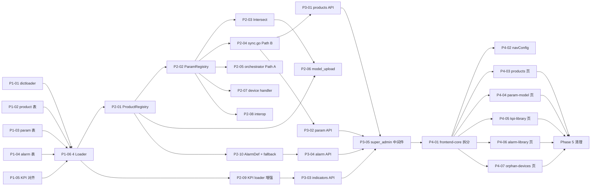

# 参数模型 / KPI 指标库 / 告警库 整合 — 实施计划

> **关联**
> - 设计依据：`docs/design/参数-KPI-告警-整合设计方案.md`（v3，2026-05-07）
> - Backlog 任务：**T-0098**（XL · feat · F02+F03+F04 · in_dev / Owner=TBD）
> - 守护人：项目经理（PgM）+ 后端架构（核心）+ 前端 owner + QA
> - 文档版本：2026-05-07 v1（初稿）

---

## 0. 摘要

### 0.1 范围
本计划把 T-0098 拆为 **5 个 Phase / 33 个子任务**，覆盖：
1. 共享 dictloader 基础设施（§5）
2. 三个底层字典域（参数 §1 / KPI §2 / 告警 §3）
3. 产品装配件（§4，路由入口）
4. 6 个消费者改造（provision/sync · provision/orchestrator · provision/model_upload · device · interop · alarm/receiver · pm/worker）
5. 4 个新管理 UI 页 + 「产品管理」一级菜单 + super_admin 角色收口
6. 旧 datamodel 模块下线

### 0.2 现状 vs 目标 — 一句话

| 域 | 现状 | 目标 | 改造性质 |
|---|---|---|---|
| §1 ParamModel | 旧 `internal/config/datamodel/` 已高度成熟（5,166 LOC + 1,469 测试 LOC，三级回退 + JSONB 参数树） | 全量替换为「standardPath ↔ privatePath 映射表 + product 路由」新范式；Path B 自动同步删除 GPN 阶段 | **范式重写**，旧表 Phase 5 清理 |
| §2 KPI | `internal/pm/indicator/`（15 文件）+ 17 张表（迁移 `000035`）已存在，结构基本对齐设计 | 补 `enabled` XML 属性、多文件 OR 合并、REST 端点、管理 UI | **增量** |
| §3 Alarm | `alarm_libraries`（迁移 `000013`）+ I18N 表已有；接收器无 fallback；无 severity 参考表；无 `is_unknown` | 改造表结构（identifier/severity_id/ne_type/is_unknown）+ Registry + 未识别告警 fallback 路径 | **改造 + 增量** |
| §4 Product | 完全不存在 | 新建 `internal/product/` 包 + 2 张表 + ProductRegistry + 孤儿设备页 | **从零** |
| §5 共享 dictloader | 不存在 | 4 文件抽设施层 | **从零** |
| 前端 | 无 `pages/product/` 目录；`paramModelApi`/`alarmDefinitionApi`/`productApi` 缺失 | 4 页 + 4 API + 4 Hook + 一级菜单 | **从零** |

### 0.3 工作量与时间盒

| Phase | 范围 | 估算（人·sprint） | 依赖 |
|---|---|---|---|
| **P1** Schema + dictloader | 5 迁移 + 4 loader | 1.0 | — |
| **P2** 业务层 | 10 子任务（3 域 + 6 消费者改造） | 2.0 | P1 |
| **P3** REST API | 4 域 handler + super_admin 中间件 | 1.0 | P2 |
| **P4** 前端 | 4 页 + 一级菜单 + API/Hook 拆分 | 2.0 | P3 |
| **P5** 旧 datamodel 清理 | 包删除 + 迁移 + 文档 | 0.5 | P4 |
| **合计** | | **6.5 人·sprint** | |

**墙钟估算**：1 人 8 sprint（16 周）；2 人协作 5 sprint（10 周）。任务按域可三轨并行（参数 / KPI / 告警），P3/P4 内部按 4 个域可四轨并行。

### 0.4 关键路径
```
P1-01 dictloader  ┐
P1-02 product 表  ├→ P1-06 4 Loader → P2-01 ProductRegistry → P2-02 ParamRegistry → P2-04 sync.go (Path B) → E2E
P1-03 param 表    │                                          ├→ P2-05 orchestrator (Path A)
P1-04 alarm 表    │                                          ├→ P2-07 device handler
P1-05 KPI 对齐    ┘                                          └→ P2-08 interop
                                                              └→ P2-10 alarm fallback (并行 ParamRegistry 之后)
```

→ **关键路径 = P1 → P2-01 → P2-02 → P2-04 → P3-02 → P4-04 → P5**（约 4.5 sprint）

---

## 1. Gap 分析（按域）

### 1.1 §1 参数模型 — 范式重写

| 设计目标 | 当前实现 | Gap | 关键文件 |
|---|---|---|---|
| `param_models`（9 行） | `data_model_definitions`（同位但不同范式） | 新建 + 旧表 P5 删 | `migrations/000004_data_models.sql` |
| `param_mappings`（4,781 行 + `is_storable`） | parameter JSONB tree（嵌入 `data_model_definitions`） | 新建 | — |
| `discovered_param_mappings`（按 `product_id` + `swVersion` 主键） | 无独立交集表 | 新建 | — |
| `standard_params`（2,001 行） | 无 | 新建 | — |
| `ParamModel.Translator`（O(1) standardPath ↔ privatePath） | `validator.go`（约束校验） | 新建 | `datamodel/validator.go` 305 LOC |
| `ParamRegistry`（精简，仅 GetTranslator） | `DataModelRegistry`（三级回退 + 三级缓存） | 重写 | `datamodel/registry.go` 437 LOC |
| Path B 同步：删 GPN，从 `ParamMapping` 取前缀，按 `is_storable` 过滤 | `ParameterTreeIterator` 生成 `Phase1GPNs + StaticPrefixes` | 删除 + 重写 | `datamodel/iterator.go` 300 LOC + `provision/sync.go` 482 LOC |
| Path A 模板：`Parameters` JSON key 用 standardPath，下发时翻译 privatePath | 模板直接用 privatePath | 改造 | `provision/orchestrator.go` 106 LOC |
| FileType=11 受 `enable_filetype11` 决策；失败降级默认映射 | `provision/model_upload.go` 已有 200 LOC，无开关 | 加决策分支 | 同上 |
| 交集 + `device_attrs_override` 元属性覆盖 | 无 | 新建 | — |
| 迁移到产品级隔离：`(product_id, swVersion)` 主键 | 旧设计按 `(paramModelId, swVersion)` | 全部新表 | — |

### 1.2 §2 KPI 指标库 — 增量改造

| 设计目标 | 当前实现 | Gap |
|---|---|---|
| `perf_indicators_enb/gsm/gnb` | ✅ 已存在（`000035`） | 无 |
| `indicator_units` | ⚠️ `indicator_unit`（单数） | **决策**：保留现状 + 设计 footnote 对齐 / 重命名（推荐前者） |
| `platform_indicator_formulas_*` | ⚠️ `rela_platform_indicator_formula_*` | 同上 |
| `enabled_indicators_*` | ⚠️ `enabled_pm_indicators_*` | 同上 |
| XML `enabled="true|false"` 属性 | 无 | 新加 — `loader.go` 解析 + 默认 true |
| 多文件合并 `enabled` OR 规则 | 无（去重逻辑已有） | 新加合并语义 |
| Loader 仅刷新 `operator_code='default'` 行 | 无（无运营商覆盖概念） | 新加分桶刷新逻辑 |
| REST `/api/v1/indicators` + `/indicator-groups` + `/formulas` + `/enabled-indicators` + `/indicator-units` | 仅 `/pm/kpi/definitions` 等 | 补全管理面 endpoints |
| 公式引擎：`antonmedv/expr` | ✅ 自实现 `formula_validator.go`（已工作） | **决策**：保留自实现 / 切换 `expr`（推荐保留，省迁移成本） |
| GNB 无 `indicator_level` 字段 | ✅ 已分离（设计与代码一致） | 无 |
| 默认启用集来源于 XML（不再硬编码 263 行） | 当前 263 行从何来需核查 | 改 loader |

### 1.3 §3 告警库 — 改造 + 增量

| 设计目标 | 当前实现 | Gap |
|---|---|---|
| `alarm_definitions(identifier UNIQUE, severity_id FK, ne_type)` | `alarm_libraries(alarm_code, severity SMALLINT)` | 新建表 + DROP 旧表 OR ALTER 重命名（**待决 D2**） |
| `alarm_severity_levels`（4 行 + 31001-31004） | ❌ 无 | 新建 + 种子 |
| `alarms_active.is_unknown` | ❌ 无 | ALTER ADD COLUMN |
| `AlarmDefinition Registry`（`sync.Map` 全量驻留 442 条） | 无独立 registry，查询走 repo | 新建 `internal/alarm/definition/` |
| 接收路径未命中分支 | `receiver.go:76` 直接透写 `alarm_identifier`，无 fallback | 新建分支：查 `device.product_id → product.enable_unknown_alarm` 决定丢弃/写 fallback |
| `unknown-stats` 端点 + 治理闭环 | 无 | 新建 |
| `alarm_library_i18n` 表 | ✅ 已有（设计未提，是增量价值） | 保留 |

### 1.4 §4 产品装配件 — 全部从零

| 设计目标 | 当前实现 | Gap |
|---|---|---|
| `products` 表（15 行 + 三引用 + 三策略） | ❌ | 全新建 |
| `product_class_patterns`（27 行 + 全局 sort_order） | ❌（路由硬编码于 `data_model_definitions` 三级 WHERE） | 全新建 |
| `internal/product/` 包（7 文件） | ❌ | 全新建 |
| `data/param-mappings/products.xml` | ❌ | 离线脚本生成（**待决 D4**） |
| `ProductRegistry.MatchProductClass()` | ❌ | 新建 |
| 孤儿设备处理（v1 必做） | 无概念 | 新建（页面 + API + 自动重匹配） |
| `devices.product_id` 列 | ❌ | ALTER ADD COLUMN |
| `enable_filetype11` / `device_attrs_override` / `enable_unknown_alarm` 三策略 | ❌（设计 v2 引入） | 新建（含 UI 编辑 + 校验 data_type=true 拒绝） |

### 1.5 前端 — 大部分从零

| 设计目标 | 当前实现 | Gap |
|---|---|---|
| `nav.product` 一级菜单 + 4 子项 | navConfig 顶层无 `product`；当前 10 个一级菜单（dashboard/device/alarm/performance/mml/topology/backup/software/log/system） | ALTER `navConfig.ts` + i18n 5 项 + super_admin 角色守卫 |
| `/product/products` 列表 + 抽屉（最复杂） | ❌ | 新建 |
| `/product/param-model`（3 Tabs：参数模型 / 默认映射 / 标准参数树） | ❌ | 新建 |
| `/product/kpi-library`（5 Tabs：ENB/GSM/GNB/启用/单位） | 部分功能在 `KPIStandardReport` 中（业务消费视角） | 新建管理员视角，与 KPIStandardReport 共存 |
| `/product/alarm-library` + 未识别治理 | 部分功能在 `AlarmSupportLibrary` 中（业务消费视角） | 新建管理员视角，与 AlarmSupportLibrary 共存 |
| `/product/orphan-devices` | ❌ | 新建 |
| `paramModelApi.ts` / `alarmDefinitionApi.ts` / `productApi.ts` | ❌（混在 `datamodelApi.ts` / `alarmApi.ts` 中） | 拆分 + 新建 productApi |
| 4 个 `useXxx.ts` Hook | 部分有（`useDataModels` / `useAlarms` / `useIndicator`） | 拆分 + 新建 useProducts |

### 1.6 共享基础设施

| 设计目标 | 当前实现 | Gap |
|---|---|---|
| `internal/core/dictloader/`（4 文件：scanner / lifecycle / cache_version / report） | ❌ | 全新建 |
| `DictLoaderConfig` | ❌ | `appconfig` 加 4 个 Config struct |

---

## 2. 阶段化任务清单

### Phase 1 — Schema + 共享 dictloader + Loader（迁移 `000057`-`000060`）

> **目标**：DB 表创建，4 域 XML 启动期自动加载，行数对齐设计。
> **估算**：1.0 sprint。所有 P1 子任务在**单一 PR** 中合入（中间状态启动会失败）。

| ID | 子任务 | Est | Owner 建议 | 依赖 | 验收 |
|---|---|---|---|---|---|
| **T-0098-P1-01** | 创建 `internal/core/dictloader/`（scanner / lifecycle / cache_version / report） + `DictLoaderConfig` | M | infra | — | 单元测试覆盖；provider 框架可注册 Loader 接口 |
| **T-0098-P1-02** | 迁移 `000057_products.sql` — `products` + `product_class_patterns` + `devices.product_id` 列 | S | F02 | — | up/down 配对；`scripts/check-migrations.sh` 通过 |
| **T-0098-P1-03** | 迁移 `000058_param_dictionary.sql` — `param_models` + `param_mappings`（含 `is_storable`）+ `discovered_param_mappings`（`product_id+swVersion` 主键）+ `standard_params` + 既有表（`devices.param_model_id` / `parameter_discovery_log.param_model_id`） | M | F02 | P1-02 | 同上 + 索引校验 |
| **T-0098-P1-04** | 迁移 `000059_alarm_dictionary.sql` — `alarm_severity_levels` + 4 行种子 + `alarm_definitions` 新建（按设计 schema）+ `alarms_active.is_unknown ADD COLUMN` + 决策 D2 处置旧 `alarm_libraries` | M | F04 | — | 同上；4 行 severity 种子可查 |
| **T-0098-P1-05** | KPI 表名对齐文档（决策 **D1=A 已定**）：保留现状 `indicator_unit` / `rela_platform_indicator_formula_*` / `enabled_pm_indicators_*`；本任务 docs 落地，**不写迁移**（设计 §2.3 顶部已加 D1=A 命名对齐表） | S | F03 | — | 设计 §2.3 footnote 落地；无 schema 变更 |
| **T-0098-P1-06** | 4 个 Loader 实现（`product/loader.go` / `parammodel/loader.go` / `indicator/loader.go`（增量）/ `alarm/definition/loader.go`）+ provider 接线 | L | infra+各域 | P1-01..05 | 启动后 `omcgo-app` 各域行数 = 设计基线 |

**Phase 1 DoD**：
- [ ] 启动后 DB 行数：参数 9+4781+2001 / 指标 1764+6254+27 / 告警 442+4 / 产品 15+29
- [ ] `products.xml` 三引用校验在启动期完成（不通过的 product 跳过 + ERROR 日志）
- [ ] `make migrate-up` 干净环境一次成功
- [ ] `make migrate-down` 全部回滚成功（`000057`-`000060` 的 down section）
- [ ] go build ./... 通过 + 现有测试不被破坏

---

### Phase 2 — 业务层

> **目标**：4 域 Registry / Translator / Formula / 索引可用；6 个消费者切换到新系统。
> **估算**：2.0 sprint。三域可并行（参数 / KPI / 告警），消费者改造按依赖顺序排队。

#### 2.A 三域 Registry（可三轨并行）

| ID | 子任务 | Est | Owner | 依赖 |
|---|---|---|---|---|
| **T-0098-P2-01** | `ProductRegistry`（productClass 全局正则路由 + L1 sync.Map + L2 Redis 缓存 + 引用校验） | M | F02 | P1 |
| **T-0098-P2-02** | ParamModel `Registry` + `Translator`（精简，去掉 productClass routing；按 `productId/paramModelId` 取映射；O(1) 双向翻译；discovered → default 降级） | L | F02 | P2-01 |
| **T-0098-P2-03** | ParamModel `Intersect`（基站上传 paramModel ∩ 默认；按 `device_attrs_override` 决定元属性来源；写 `discovered_param_mappings`） | M | F02 | P2-02 |
| **T-0098-P2-09** | KPI loader `enabled` 属性解析 + 多文件 OR 合并 + `operator_code='default'` 行刷新语义（不动其他 operator） | M | F03 | P1-05 |
| **T-0098-P2-10** | AlarmDefinition Registry + 接收路径未命中 fallback（查 `device.product_id → product.enable_unknown_alarm`，true 写 fallback `severity=Warning, is_unknown=true`，false 丢弃 + INFO 日志 + Prom 指标 `alarm_unknown_total`） | M | F04 | P2-01 |

#### 2.B 6 个消费者改造（参数轨依赖 P2-02）

| ID | 子任务 | Est | Owner | 依赖 |
|---|---|---|---|---|
| **T-0098-P2-04** | `provision/sync.go` 重写 — Path B：删 `Phase1GPNs` 阶段 + 改用 `ParamMapping` 列表去重前缀 + GPV 对象前缀 + Translator 落库 + `is_storable` 过滤 | L | F02 | P2-02 |
| **T-0098-P2-05** | `provision/orchestrator.go` 改造 — Path A：模板 `Parameters` JSON key 改 standardPath，SPV/GPV 步骤生成时翻译为 privatePath | M | F02 | P2-02 |
| **T-0098-P2-06** | `provision/model_upload.go` — `enable_filetype11` 决策（false 跳过 Upload；true 时设备不支持 SOAP Fault → 降级默认映射；调用 `Intersect` 写 discovered） | M | F02 | P2-01 + P2-03 |
| **T-0098-P2-07** | `device/device_param_handler.go` — `dmRegistry` → `paramRegistry`，新 mapping-based validator | S | F02 | P2-02 |
| **T-0098-P2-08** | `interop/runner.go` + `interop/validator.go` — 切到新 ParamRegistry，改校验 ParamMapping 元属性 | S | F10 | P2-02 |
| **T-0098-P2-11** | PM worker 接入 KPI Registry 改进（如适用，`operator_code` 过滤启用集） | S | F03 | P2-09 |

**过渡策略**：feature flag `param_registry.use_new`（默认 false）保护切换期；P2-02 至 P2-08 全部合入后，再切 true 并删 flag。

**Phase 2 DoD**：
- [ ] 4 域单元测试覆盖率 ≥ 80%（含失败路径）
- [ ] Path B 端到端：构造 paramModel 5 条参数（1 条 `is_storable=false`），sync 后 4 条入库
- [ ] AlarmReceiver 端到端：未知 identifier + `enable_unknown_alarm=true` → 活动告警表新增 `is_unknown=true` 行
- [ ] ProductRegistry 端到端：`FAP` 兜底正则在最末，前面正则正确命中
- [ ] `provision/engine_test.go` (1082 LOC) 重构后全部通过
- [ ] feature flag 切 true 后 E2E `bash omcgo/scripts/e2e_verify.sh` 通过

---

### Phase 3 — REST API

> **目标**：4 域完整 CRUD + 导入端点 + super_admin 收口。
> **估算**：1.0 sprint。4 个 handler 可并行。

| ID | 子任务 | Est | Owner | 依赖 |
|---|---|---|---|---|
| **T-0098-P3-01** | `/api/v1/products` 全套（CRUD + patterns 上下移动 + 路由测试 + `unknown-stats` + 孤儿设备 + cache）| L | F02 | P2-01 |
| **T-0098-P3-02** | `/api/v1/param-models` 全套（CRUD + mappings + standard + translate + cache）| M | F02 | P2-02 |
| **T-0098-P3-03** | `/api/v1/indicators` 全套（CRUD + groups + formulas + enabled + units + cache）| M | F03 | P2-09 |
| **T-0098-P3-04** | `/api/v1/alarm-definitions` 全套（CRUD + severity-levels GET 只读 + `unknown-stats` + cache）| S | F04 | P2-10 |
| **T-0098-P3-05** | `RequireRole("super_admin")` 中间件 + 4 路由组接入 + 现有 `PrivateRoute` 角色扩展 | S | infra+admin | P3-01..04 |

**Phase 3 DoD**：
- [ ] 4 个 curl 测试套全部通过（每域 ~20 个 endpoint）
- [ ] `data_type=true` 在 API 层 HTTP 400 拒绝
- [ ] `DELETE /api/v1/products/:id/discovered` 影响行数响应正确
- [ ] `GET /api/v1/products/match?productClass=xxx` 返回命中 + 全局序
- [ ] non-super_admin 角色访问被 403 拦截

---

### Phase 4 — 前端

> **目标**：4 个独立管理页 + 新增"产品管理"一级菜单 + frontend-core API/Hook 拆分。
> **估算**：2.0 sprint。可拆 2 sprint × 2 页面或 4 个页面并行。

| ID | 子任务 | Est | Owner | 依赖 |
|---|---|---|---|---|
| **T-0098-P4-01** | frontend-core：拆出 `paramModelApi.ts` / 新建 `productApi.ts` / 拆出 `alarmDefinitionApi.ts` + 4 个 `useXxx.ts` Hook | M | frontend-core | P3 |
| **T-0098-P4-02** | `navConfig.ts` 加 `nav.product` 一级菜单 + 4 子项；i18n 5 项（zh/en）；super_admin 角色守卫 | S | frontend | P3-05 |
| **T-0098-P4-03** | `/product/products` 页（最复杂）— 列表 + 抽屉 4 段（基本/字典引用/上传策略/正则）+ 全局匹配顺序浮窗 + 测试匹配 | L | frontend | P4-01 |
| **T-0098-P4-04** | `/product/param-model` 页（3 Tabs：参数模型 / 默认映射 / 标准参数树）+ XML 导入 + storable 过滤 | M | frontend | P4-01 |
| **T-0098-P4-05** | `/product/kpi-library` 页（5 Tabs：ENB / GSM / GNB / 启用 / 单位）+ 详情抽屉（含全平台公式 CRUD） | M | frontend | P4-01 |
| **T-0098-P4-06** | `/product/alarm-library` 页（单页 + 详情抽屉）+ 未识别告警频次跳转端点 | S | frontend | P4-01 |
| **T-0098-P4-07** | `/product/orphan-devices` 页 — 列表 + 单台/批量绑定 + 触发重新匹配 | S | frontend | P4-01 |
| **T-0098-P4-08** | `webcode-v2` / `webcode-v3` 兼容性评估（API/Hook 共享，仅看是否因类型/Mock 形态变更崩溃） | S | frontend-core | P4-01 |

**Phase 4 DoD**：
- [ ] super_admin 登录可见"产品管理"菜单；admin/operator/viewer 不可见且 PrivateRoute 拦截
- [ ] 产品页"测试匹配"输入 productClass 实时显示命中
- [ ] 参数模型抽屉支持 storable 切换 + `{i}` 占位符校验
- [ ] KPI 页 ENB Tab 全平台公式表格可编辑某平台
- [ ] 告警页按 `is_unknown=true` 过滤可见未识别告警
- [ ] webcode-v2/v3 编译通过（不强制 UI 完整）

---

### Phase 5 — 旧 datamodel 清理

> **目标**：旧 datamodel 包与表完全下线，无残留引用。
> **估算**：0.5 sprint。

| ID | 子任务 | Est |
|---|---|---|
| **T-0098-P5-01** | 删除 `internal/config/datamodel/` 全包（含 21 文件 + 7 个 test 文件）；删 provision 中残留 iterator 引用 | M |
| **T-0098-P5-02** | 迁移 `000061_drop_datamodel.sql` — DROP `data_model_definitions` + `data_model_import_log` + `devices.data_model_id` 列 | S |
| **T-0098-P5-03** | grep 验证：`grep -r "datamodel" omcgo/internal/` 无业务引用 | S |
| **T-0098-P5-04** | 旧 frontend `datamodelApi.ts` 拆分到 `paramModelApi` 完毕后删除 + 调整所有引用 | S |
| **T-0098-P5-05** | 更新 `CLAUDE.md` + `omcgo/CLAUDE.md` 模块清单（datamodel 移除，新增 product/dictloader/parammodel） | S |
| **T-0098-P5-06** | 旧 `alarm_libraries` / `alarm_library_i18n` 处置（按 D2 决策）DROP / RENAME / 保留 | S |

**Phase 5 DoD**：
- [ ] `grep -r "datamodel" omcgo/internal/ omcmb/` 仅历史文档命中，无业务引用
- [ ] E2E 全量通过（`bash omcgo/scripts/e2e_verify.sh`）
- [ ] CLAUDE.md 模块清单更新完毕

---

## 3. 关键路径与并行策略

### 3.1 依赖 DAG



### 3.2 推荐并行策略

| Sprint | 工作 | 并行度 |
|---|---|---|
| **N+1** | Phase 1 全做（5 迁移 + dictloader + 4 Loader） | 1 owner（迁移内部协调避免编号冲突） |
| **N+2** | P2-01 ProductRegistry + P2-09 KPI loader + P2-10 AlarmDef Registry | **3 轨并行** |
| **N+3** | P2-02 ParamRegistry + P2-03 Intersect | 1 轨（参数轨依赖紧） |
| **N+4** | P2-04 sync.go + P2-05 orchestrator + P2-06 model_upload + P2-07 device + P2-08 interop + P2-11 worker | **6 轨并行**（消费者改造彼此独立） |
| **N+5** | Phase 3：4 handler + super_admin 中间件 | **4 轨并行** |
| **N+6** | Phase 4：P4-01 拆分 + P4-02 nav + P4-03 products + P4-04 param-model | **4 轨并行** |
| **N+7** | Phase 4：P4-05 kpi + P4-06 alarm + P4-07 orphan + P4-08 v2/v3 兼容 | **4 轨并行** |
| **N+8** | Phase 5：清理 + 联调 + E2E 全量 + 文档 | 1 owner |

---

## 4. 风险登记

> 同时同步至 `docs/project/risk-register.md`（建议新建 R-T-0098-* 系列）。

### 4.1 数据迁移风险

| ID | 风险 | 概率 | 影响 | 缓解 |
|---|---|---|---|---|
| **R-T0098-01** | `data_model_definitions` Phase 5 直接 DROP 是否安全 | 低 | 高 | 当前是 dev-only 环境，无生产数据。如已部署到 staging 需先做数据备份 |
| **R-T0098-02** | KPI 表名重命名（D1 决策若选重命名）影响 `pm/worker` + 17 张表 + 触发器 | 中 | 中 | 强烈推荐保留现状；若重命名必须单 PR + 全模块编译验证 |
| **R-T0098-03** | `alarm_libraries` ALTER 与现有 receiver 同步失败 | 中 | 高 | 推荐 DROP + CREATE NEW（数据来自 XML 可重载）；FK 反查跑前确认 |
| **R-T0098-04** | 迁移 `000057-000060` 跨多 PR 时序中间状态 app 无法启动 | 高 | 中 | **强制 P1 单一 PR 合入**；不允许拆 |

### 4.2 代码协调风险

| ID | 风险 | 概率 | 影响 | 缓解 |
|---|---|---|---|---|
| **R-T0098-05** | 6 个消费者改造跨多 PR 中途主干编译失败 | 中 | 高 | feature flag `param_registry.use_new` 保护过渡期 |
| **R-T0098-06** | 删除 `ParameterTreeIterator` 影响 `provision/engine_test.go` 1082 行测试 | 高 | 中 | P2-04 完成时同步重构测试，不留残留 |
| **R-T0098-07** | webcode-v2/v3 因 frontend-core 类型变化崩溃 | 中 | 低 | P4-08 单做兼容性评估；不强制 v2/v3 跟进 UI 完整性 |
| **R-T0098-08** | `provision/engine.go` 663 行 + `sync.go` 482 行重写出隐性 bug | 高 | 高 | 优先级最高的 review；CPE simulator 端到端覆盖 |

### 4.3 进度与流程风险

| ID | 风险 | 概率 | 影响 | 缓解 |
|---|---|---|---|---|
| **R-T0098-09** | Wave 3 硬化期（截止 2026-08-03）冲突，T-0098 是 feat 类型 | 高 | 高 | **必须 PgM 拍板**（决策 D5）；建议 Phase 1-3 在 W3 期间推进（视为补充收敛功能 RC 必要项），P4/P5 在 W3 后 |
| **R-T0098-10** | XL 任务 8-sprint 长链中途人员变动 | 中 | 中 | 每 Phase 末 demo + 文档更新；35+ 子任务粒度便于交接 |
| **R-T0098-11** | products.xml 离线脚本归属不明，阻塞 P1-02 | 中 | 中 | **决策 D4** 必须在 P1 启动前明确 owner |
| **R-T0098-12** | `super_admin` 角色与现有 `admin` 角色权限边界争议 | 低 | 低 | P3-05 前与 admin 模块 owner 对齐；现 PRIVATEROUTE 已支持角色过滤 |

### 4.4 与其他 Backlog 任务冲突

| 任务 | 冲突点 | 处置 |
|---|---|---|
| **T-0095** F03 KPI 指标管理（in_dev / sprint-01，FREEZE 冲突） | KPI 指标库 §2 与 T-0095 范围重叠 | 与 T-0095 owner 对齐；T-0098-P2-09 / P3-03 / P4-05 是否吸收/取代 T-0095 待 PgM 决策 |
| **T-0035** 前端多皮肤（triaged） | webcode-v2/v3 兼容性 | P4-08 协同 |
| **W3.x 系列** 硬化期 | 见 R-T0098-09 | 同上 |

---

## 5. Sprint 分配建议

> **前提**：1.5 人协作（1 全栈 + 0.5 前端）。Wave 3 期间假设 PgM 解冻 P1-P3。

| Sprint | 起止 | 范围 | 完成判定 |
|---|---|---|---|
| **sprint-NN+1** | 待 PgM 排 | Phase 1 全部 | DB 4 域行数对齐设计；启动无 ERROR |
| **sprint-NN+2** | | P2-01 + P2-09 + P2-10 | 三个 Registry 单元测试通过 |
| **sprint-NN+3** | | P2-02 + P2-03 | ParamRegistry + Intersect 单元 + 集成测试通过 |
| **sprint-NN+4** | | P2-04..08 + P2-11 | 6 个消费者改造完毕；feature flag 切 true 后 E2E 通过 |
| **sprint-NN+5** | | Phase 3 全部 | 4 个 curl 测试套通过 |
| **sprint-NN+6** | | P4-01 + P4-02 + P4-03 + P4-04 | 产品页与参数页可演示 |
| **sprint-NN+7** | | P4-05 + P4-06 + P4-07 + P4-08 | KPI / 告警 / 孤儿设备页可演示 |
| **sprint-NN+8** | | Phase 5 + E2E + 文档 | DoD 全部勾选；CLAUDE.md 更新 |

---

## 6. 待决问题（提交 PgM/PM/QA 拍板）

> 这些决策在 P1 启动前必须落定，否则会返工。

| ID | 决策点 | 选项 | 推荐 | 影响范围 |
|---|---|---|---|---|
| **D1** | KPI 表名是否重命名？ | A 保留 `indicator_unit`/`rela_platform_indicator_formula_*`/`enabled_pm_indicators_*`；B 改名为设计中的 `indicator_units`/`platform_indicator_formulas_*`/`enabled_indicators_*` | **A**（省迁移成本，更新设计 footnote） | 影响设计文档与 P1-05 |
| **D2** | `alarm_libraries` 处置 | A ALTER + 重命名列；B DROP + CREATE 新 `alarm_definitions`（XML 重载即恢复）；C 双表共存过渡 | **B**（最干净，依赖 XML 真相源） | 影响 P1-04 + P5-06 |
| **D3** | 公式引擎库 | A 保留自实现 `formula_validator.go`；B 切 `antonmedv/expr` | **A**（已工作，省迁移） | 影响设计文档对齐 |
| **D4** | `products.xml` 离线脚本归属 | A 后端架构同学产出；B 数据团队产出；C 利用现有数据反推生成 | **A**（依赖现有 paramModel/KPI/Alarm 数据，与设计紧耦合） | 阻塞 P1-02 + P1-06 |
| **D5** | Wave 3 硬化期能否启动 | A 全程暂停 P4 截止 2026-08-03；B 仅 Phase 4/5 暂停；C 全速启动（视为 RC 必要项） | **B**（P1-P3 不算新功能，是设计已交付的实现收敛） | 影响 sprint 排期 |
| **D6** | Owner 分配 | TBD | F02 主轨 + F03/F04 分轨 + frontend-core 分轨 + frontend 1.0 | 阻塞排期 |
| **D7** | webcode-v2/v3 是否完整跟进 | A 仅评估编译；B v2 同步页面；C v2/v3 都同步 | **A**（与多皮肤计划解耦） | 影响 P4-08 工作量 |
| **D8** | 迁移 `000057`-`000060` 是否单 PR 合入 | A 单 PR；B 拆 4 PR | **A**（中间状态启动会失败） | 影响 PR 策略 |
| **D9** | feature flag `param_registry.use_new` 保留多久 | A 仅 Phase 2 期间；B 保留到 Phase 5 完成；C 永久作 fallback | **B**（清理完旧 datamodel 同步删 flag） | 影响代码复杂度 |
| **D10** | 是否吸收 T-0095（F03 KPI 指标管理） | A 吸收（关闭 T-0095，工作并入 T-0098 P2-09/P3-03/P4-05）；B 各自独立推进 | **A** 推荐，避免重复工作 | 影响 backlog 状态 |

---

## 7. DoD 与 Release Gate 复合检查

每个 Phase 完工时由 QA + PgM 复检：

### 7.1 Phase 1 DoD
- [ ] `make migrate-up` 干净环境一次成功
- [ ] `make migrate-down` 全部回滚成功
- [ ] DB 4 域行数对齐（参数 9+4781+2001 / 指标 1764+6254+27 / 告警 442+4 / 产品 15+29）
- [ ] `omcgo-app` / `omcgo-acs` / `omcgo-worker` 启动无 ERROR；引用校验通过
- [ ] `bash omcgo/scripts/check-migrations.sh` 通过

### 7.2 Phase 2 DoD
- [ ] `go test ./internal/...` 全部通过；新模块覆盖率 ≥ 80%
- [ ] feature flag `param_registry.use_new=true` 后 E2E 全量通过
- [ ] CPE simulator 端到端：Bootstrap → Upload(FT=11) → Intersect → discovered 写入
- [ ] 6 个消费者全部切到新 Registry（grep `dmRegistry` 仅在 Phase 5 待清理列表）

### 7.3 Phase 3 DoD
- [ ] 4 个 curl 测试套通过（每域 ~20 端点）
- [ ] super_admin 角色 RBAC 测试通过
- [ ] OpenAPI/Swagger 文档同步更新（如项目有此实践）

### 7.4 Phase 4 DoD
- [ ] super_admin 登录后可见"产品管理"一级菜单 + 4 子项 + 孤儿设备
- [ ] 4 个页面 Playwright E2E 通过（关键交互：导入 XML / 编辑抽屉 / 测试匹配）
- [ ] webcode-v2/v3 `npm run build` 通过
- [ ] i18n 中英双语可切换

### 7.5 Phase 5 DoD
- [ ] `grep -r "datamodel" omcgo/internal/` 仅历史文档命中
- [ ] `bash omcgo/scripts/e2e_verify.sh` 全量通过
- [ ] `CLAUDE.md` + `omcgo/CLAUDE.md` 模块清单更新
- [ ] feature flag 删除

### 7.6 Release Gate（接入 `docs/project/release-gate.md`）
本任务进 RC 前需补 Release Gate 章节：
- [ ] 监控：`alarm_unknown_total{ne_type=…}` Prometheus 指标 + Grafana 面板
- [ ] 告警规则：未识别告警速率 > 阈值告警
- [ ] 回滚演练：feature flag 切 false 5 分钟内恢复旧路径

---

## 8. 文件清单（净增/净删，与设计 §9 对齐）

### 8.1 后端净增

```
omcgo/internal/core/dictloader/                # 4 文件
omcgo/internal/product/                         # 7 文件
omcgo/internal/config/parammodel/               # 9 文件（替代 datamodel）
omcgo/internal/alarm/definition/                # 7 文件
omcgo/internal/pm/indicator/loader.go           # 增强（enabled 属性 + OR 合并）
omcgo/internal/pm/indicator/handler.go          # 补全 REST 端点
omcgo/migrations/000057_products.sql
omcgo/migrations/000058_param_dictionary.sql
omcgo/migrations/000059_alarm_dictionary.sql
omcgo/migrations/000060_kpi_rename.sql          # 视 D1 决策
omcgo/migrations/000061_drop_datamodel.sql
```

### 8.2 后端净删（Phase 5）

```
omcgo/internal/config/datamodel/                # 21 文件 + 7 _test.go
omcgo/internal/provision/sync.go                # 重写（不删文件）
omcgo/internal/provision/engine.go              # 部分函数删（ParameterTreeIterator 引用）
```

### 8.3 后端修改

```
omcgo/internal/core/appconfig/config.go         # +5 个 Config struct
omcgo/cmd/app/provider/{config,container,modules,router}.go  # 接线 5 模块
omcgo/internal/provision/{engine,model_upload,sync,orchestrator}.go  # 改 Registry
omcgo/internal/device/device_param_handler.go   # 改 Registry
omcgo/internal/interop/{runner,validator}.go    # 改 Registry
omcgo/internal/alarm/receiver.go                # 加 fallback 分支
omcgo/internal/pm/worker/                       # 接入 enabled 过滤（如需）
```

### 8.4 前端净增

```
omcmb/webcode/src/pages/product/Products/        # 6 文件
omcmb/webcode/src/pages/product/ParamModel/      # 5 文件
omcmb/webcode/src/pages/product/IndicatorLibrary/  # 7 文件
omcmb/webcode/src/pages/product/AlarmLibrary/    # 3 文件
omcmb/webcode/src/pages/product/OrphanDevices/   # 1 文件
omcmb/frontend-core/src/services/api/{productApi,paramModelApi,indicatorApi,alarmDefinitionApi}.ts
omcmb/frontend-core/src/hooks/api/{useProducts,useParamModels,useIndicators,useAlarmDefinitions}.ts
```

### 8.5 前端修改

```
omcmb/webcode/src/router/routes.tsx              # +5 路由
omcmb/webcode/src/components/Layout/Sidebar/navConfig.ts  # +nav.product 一级
omcmb/frontend-core/src/i18n/zh-CN/nav.ts        # +5 key
omcmb/frontend-core/src/i18n/en-US/nav.ts        # +5 key
omcmb/frontend-core/src/services/api/datamodelApi.ts  # Phase 5 删除
omcmb/frontend-core/src/services/api/alarmApi.ts # 拆分 alarm_definition 部分
```

### 8.6 数据 / 文档

```
omcgo/data/param-mappings/products.xml           # 离线脚本生成（D4）
docs/project/risk-register.md                    # 加 R-T0098-01..12
docs/project/backlog.md                          # T-0098 拆 33 子任务
CLAUDE.md / omcgo/CLAUDE.md                      # Phase 5 更新模块清单
```

---

## 9. Backlog 联动

P1 启动前需在 `docs/project/backlog.md` §3 把 T-0098 拆出 33 个子任务（沿用 T-0098-PX-NN 编号），将本计划链接到每行的 Notes 字段。建议在 PgM triage 周一会议前完成。

> **建议命令**：`/dev-pipeline backlog add` 批量登记 33 子任务后，由 PgM 一次性 triage，分配到对应 sprint。

---

## 10. 变更日志

| 日期 | 版本 | 变更 | 作者 |
|---|---|---|---|
| 2026-05-07 | v1 | 初稿。基于设计方案 v3 + 当前代码盘点（datamodel 5166 LOC / indicator 15 文件 / alarm_libraries 已存 / product 不存在）；33 子任务 + 5 Phase + 10 决策待 PgM 拍板 | AI（@xieguiya 复核） |

---

## 11. 附录：与设计文档章节对应

本计划逐 Phase 对照设计 `docs/design/参数-KPI-告警-整合设计方案.md` v3：

| Phase | 设计章节 |
|---|---|
| P1 | §0.4（目录结构）+ §1.2 + §2.3 + §3.2 + §4.2 + §5（dictloader）+ §6（XML 存放）+ §7（DI）|
| P2 | §1.4-§1.12 + §2.4-§2.5 + §3.3-§3.4 + §4.3 |
| P3 | §1.13 + §2.7 + §3.5 + §4.4 |
| P4 | §1.16 + §2.9 + §3.7 + §4.9 + §7.3 |
| P5 | §8 Phase 5 |

各 Phase DoD 对照设计 §10 验证方案表格（按域分组：跨域 / §1 / §2 / §3 / §4 / 清理）。

各风险对照设计 §11 决策表（按域分组：跨域 / §1 / §2 / §3 / §4）。
