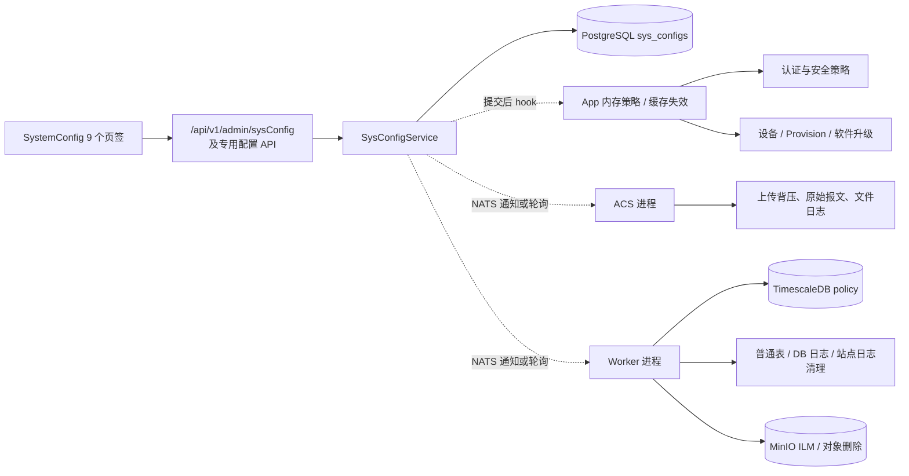

# 系统配置、存储、PM 与日志模块完整 Code Review

> 审查日期：2026-07-20（Asia/Shanghai）
> 审查基线：`cccbb2b3bca9b8c4267e140856d4a2a65881d356`
> 分支状态：`main` 与 `origin/main` 一致
> 审查方式：代码调用链、前端实际页面、PostgreSQL / TimescaleDB、MinIO、Docker、主机磁盘与定向测试交叉核验
> 关系：本文是在首轮运行态摸查 `REVIEW_6fbe307f9_system-config-storage.md` 基础上的完整代码审查，以本文的分级和结论为准。

## 1. 结论摘要

系统配置页面目前包含 9 个页签，已经不只是“若干表单写 `sys_configs`”，而是同时控制：

- 登录与密码安全策略；
- 设备 Inform、离线判定、命名同步、回收与参数同步；
- PM / MR 文件传输、Agent 工具代理；
- TimescaleDB 保留策略、普通表清理任务；
- MinIO ILM、站点日志、原始报文压缩；
- ACS 上传背压；
- 应用、ACS、Worker 文件日志轮转和数据库日志保留。

核心功能基本已接线，当前运行环境中 TimescaleDB 策略、MinIO ILM 和三类每日清理任务均处于成功状态，未发现正在发生的数据丢失。但代码审查确认存在一个必须优先处理的安全组合链，以及多处“页面显示已保存、实际运行未必生效”或“仅打开页面再保存就会改变策略”的一致性问题。

审查共归纳：

| 等级 | 数量 | 含义 |
|---|---:|---|
| P0 / Critical | 2 | 可形成未授权配置读写、敏感配置公开或 Agent 越权链 |
| P1 / High | 7 | 可改变安全策略、导致配置与运行态不一致、产生错误运维判断 |
| P2 / Medium | 6 | 完整性、容量治理、失败可见性和积压恢复能力不足 |
| P3 / Low | 1 | 文档、注释和遗留组件漂移 |

建议暂停把更多功能继续接入通用 `sysConfig` 写接口，先完成授权、敏感字段模型、统一校验/应用结果和配置契约四项治理。

## 2. 架构与真实生效链

这里存在四种不同的“生效”语义：

1. 数据库落库后立即按下一次请求读取；
2. 内存缓存失效后生效，通常为立即或最多 30 秒；
3. 进程每 60 秒轮询后生效；
4. 保存后异步重建 TimescaleDB / MinIO 策略，可能失败。

当前前端统一把 HTTP 2xx 显示为“保存成功”，没有告诉用户属于哪种语义，也没有确认第 4 类外部策略是否真正应用成功。

## 3. Code Review Findings

### [P0-1] 管理配置接口只有登录校验，没有管理员或资源级授权

**证据**

- `omcgo/cmd/app/provider/router.go:714-725` 把所有 `/admin`、`sysConfig` 和 Agent 管理接口挂到 `RequireAPIPermission`。
- `omcgo/internal/admin/middleware.go:195-216` 明确说明该中间件不再检查端点权限，只验证 `userID` 后直接放行。
- 同文件 `144-192` 已有真正执行 `resource/action` 检查的 `RequirePermission`，但上述路由未使用。
- 路由处注释仍写着 “require admin permission”，与实际行为相反。

**影响**

任何已登录账号只要能构造 HTTP 请求，就可以列出、创建、修改或删除系统配置，还能访问同组下的用户、角色、字典、日志、死信等管理接口。前端菜单隐藏不构成服务端授权边界。

**建议**

1. 为 `/admin` 建立明确的 `admin:*` 或按资源拆分的服务端权限；
2. `sysConfig` 至少拆成 `system_config:read`、`system_config:write`、`system_config:secret_read`；
3. 增加 viewer/operator 账号直调接口返回 403 的集成测试；
4. 修正所有“当前只认证”与“require admin permission”互相矛盾的注释。

### [P0-2] 通用配置接口会返回原始敏感值，并允许把任意配置改成匿名公开

**证据**

- `omcgo/internal/admin/sys_config.go:17-27` 的响应模型直接序列化 `Value`。
- `omcgo/internal/admin/sys_config.go:140-174` 允许不带 category 时列出全部配置。
- `CreateSysConfigRequest` 和 `UpdateSysConfigRequest` 暴露 `is_public`，服务在 `316-385` 原样执行。
- `ListPublic` 在 `349-364` 会匿名返回所有 `is_public=true` 的记录。
- Agent Service Token 会明文持久化到 `sys_configs`：`omcgo/internal/agentconfig/service.go:287-329`。
- 专用 Agent API 只返回 `serviceTokenConfigured`，但通用 `sysConfig?category=agent` 会绕过该脱敏模型。
- `AuditLogger` 和 `OperLogger` 都跳过 GET：`omcgo/internal/admin/middleware.go:393-407`、`443-470`，敏感读取没有审计。

**可组合攻击链**

1. 普通已登录账号利用 P0-1 调用通用配置接口；
2. 读取默认密码、未来接入的 Agent Token 等原始值；
3. 或把某条记录更新为 `is_public=true`；
4. 再从匿名公共配置端点读取。

当前运行库没有 `agent` category，因此尚无正在泄露的 Agent Token；这是“当前未触发”，不是设计安全。

**建议**

- 通用接口使用 allowlist DTO，不再返回 secret 类型的 `value`；
- `is_public` 从通用请求模型移除，只允许代码白名单定义公开项；
- Secret 使用加密存储或外部 Secret Manager，至少做到响应永不回显；
- 对敏感配置读取和所有写入建立可追踪审计；
- 增加“普通用户不可读写”“secret 永不回显”“不可把非白名单配置公开”的测试。

### [P1-1] Agent 的强制阻断路径可以被页面清空，防护不是强制策略

**证据**

- 默认阻断认证、Agent 自身和 `sysConfig` 路径：`omcgo/internal/agentconfig/model.go:29-32`。
- 保存时直接用用户输入替换阻断列表：`omcgo/internal/agentconfig/service.go:272-277`。
- `normalizePrefixes` 只去空和去重，不会补回强制前缀：同文件 `493-505`。
- 运行时 `pathBlocked` 只遍历保存后的列表；空列表即全部放行：`omcgo/internal/agentruntime/policy.go:21-39`。
- Agent 工具调用会用当前用户 Claims 生成 JWT 并请求本地 Router：`omcgo/internal/agentruntime/tool_executor.go:160-204`。

**影响**

管理员误删阻断项，或攻击者先利用 P0-1 修改 Agent 配置后，Agent 可调用原本明确禁止的认证、Agent 和系统配置接口。与 P0-1 组合时，用户角色本身也无法阻挡 `/admin` 请求。

**建议**

将策略拆成“代码内不可变 denylist + 用户可追加 denylist”；前端只编辑追加项。后端拒绝删除强制项，并为路径规范化、通配符、大小写和 URL 编码补安全测试。

### [P1-2] 安全页前后端默认值严重漂移，首次保存会静默改变现网策略

**证据**

- 前端默认值位于 `omcmb/webcode/src/pages/system/SystemConfig/SecuritySettings.tsx:28-50`。
- 后端 fail-safe 默认位于 `omcgo/internal/admin/security_policy.go:81-109`。
- 当前运行库 `security` category 只有 `defaultPasswd` 和 `isBrowserAutoRecordPass` 两条记录。
- 页面加载会先 `resetFields()`，再覆盖数据库中存在的键：`omcmb/webcode/src/pages/system/SystemConfig/index.tsx:107-132`。
- 保存时会把整个表单序列化并批量创建缺失键：同文件 `136-160`。

| 策略 | 后端当前缺省 | 前端缺省 | 一次保存后的变化 |
|---|---:|---:|---|
| 账号锁定阈值 | 10 | 8 | 更早锁定 |
| 锁定时长 | 30 分钟 | 2 分钟 | 大幅放宽 |
| IP 锁定时长 | 30 分钟 | 120 分钟 | 大幅收紧 |
| 允许并发登录 | 是 | 否 | 改变登录语义 |
| 密码长度 | 8–32 | 10–23 | 同时收紧最小值、缩小最大值 |
| 密码有效期 / 提前提示 | 90 / 7 天 | 70 / 6 天 | 无提示改变 |

此外，查询错误状态没有参与保存按钮禁用；如果 GET 失败，默认值仍可能被保存。

**建议**

- 后端提供完整、带版本的 effective config DTO，缺失键也返回唯一默认值；
- 前端不要拥有独立业务默认值；
- 查询失败时禁止保存，并明确显示错误；
- 保存前展示 diff，尤其是安全策略；
- 加“空库加载后保存不改变 effective policy”的契约测试。

### [P1-3] 密码策略只按旧状态、单键校验，同一批次可写入自相矛盾的配置

**证据**

- 目前只注册了 `security.defaultPasswd` 一个 validator：`omcgo/internal/admin/security_validators.go:7-31`。
- 注释明确使用保存前旧策略验证同批次默认密码：同文件 `16-18`。
- Batch 校验器按单个 `(category,key)` 执行，没有整个请求的交叉字段视图：`omcgo/internal/admin/sys_config.go:408-425`。
- 多数前端 `InputNumber` 只有控件 min/max，没有 `Form.Item rules`，无法替代服务端约束。

**影响**

一次请求可同时把 `pwdMinLength` 改为 20、保留不足 20 位的默认密码；也可以写入 `min > max`、提醒天数大于有效期、验证码阈值大于锁定阈值等不一致状态。不同消费者随后各自 fallback，页面值和实际值进一步分叉。

**建议**

为每个 category 定义 typed schema 和整批 validator；安全配置校验最终候选状态，而不是逐键旧状态。校验至少覆盖范围、字段关系、未知键和类型。

### [P1-4] 直增改删绕过校验和 Saved Hook，三种写法产生不同运行结果

**证据**

- Handler 同时暴露 POST / PUT / DELETE 与批量接口。
- `Create`、`Update`、`Delete` 在 `omcgo/internal/admin/sys_config.go:316-390` 直接调用 Repository。
- Validators 和 Saved Hooks 只在 `BatchUpsert` 的 `393-405` 执行。
- Repository `Update` 在 value 为空字符串时不更新：同文件 `177-184`。
- Batch 冲突时不更新 `value_type`：同文件 `211-252`。

**影响**

同一项配置通过页面批量保存、API 单条更新或删除，会得到不同的校验、缓存失效和外部策略应用行为。可写入无效 MinIO、TimescaleDB、安全和文件传输配置，且运行进程继续使用旧值。

**建议**

统一所有写入口到同一个 domain command；如果单条 CRUD 无真实调用方则移除。统一处理空值、类型、公开属性、validator、hook 和审计。

### [P1-5] “保存成功”只表示数据库提交，外部策略应用失败会被吞掉

**证据**

- `BatchUpsert` 先提交，再触发无返回值 hook：`omcgo/internal/admin/sys_config.go:393-405`。
- hook panic 被静默 recover，甚至没有日志：同文件 `427-436`。
- PM 应用器遇错只 Warn，不向调用方返回：`omcgo/internal/pm/retention/applier.go:98-119`。
- PM 与告警的 TimescaleDB 策略都采用先 remove、后 add：`omcgo/internal/pm/retention/applier.go:73-95`、`omcgo/internal/alarm/history_retention.go:154-178`。

**影响**

第二步 add 失败时，数据库保存成功但旧 retention policy 已被移除；页面仍提示成功。MinIO 或跨进程通知失败也有类似“desired state 已写、applied state 未确认”的问题。

**建议**

- 对外部系统采用 desired/applied 状态模型，记录 `apply_status`、`applied_at`、`last_error`；
- 可同步确认的操作在 API 中返回应用结果；
- remove/add 使用事务、advisory lock 或安全的 replace 方案；
- hook panic 必须记录堆栈；
- 提供自动重试与状态查询，不把日志当作唯一反馈。

### [P1-6] 设备离线开关无效，且 seed 与页面重新覆盖已经修正的 600 秒默认值

**证据**

- 页面保存 `enbTimeoutEnable`：`omcmb/webcode/src/pages/system/SystemConfig/DeviceSettings.tsx:49-58`。
- 后端离线判定只读取 `enbTimeout`、`cpeTimeout`：`omcgo/internal/device/offline_threshold.go:18-74`，没有读取 enable。
- 后端已将基站默认从 100 秒修为 600 秒：同文件 `41-47`。
- 页面仍默认 100 秒：`DeviceSettings.tsx:18-24`。
- seed 仍写入 `device.enbTimeout=100`：`omcgo/migrations/seed/000001_init_seed.sql:9586`；当前运行库也是 100 秒。
- 注释 `offline_threshold.go:57` 仍写“默认 100 / 600”。

**影响**

复选框是无效控制；用户关闭后离线扫描仍继续。新部署和现有环境又会被 seed 的 100 秒覆盖，从而重新引入频繁误离线风险。

**其他完整性问题**

- 后端支持 CPE Inform 和超时配置，但当前页只展示基站配置；
- 注释称名称同步“四选一”，页面和后端实际只有三种策略。

**建议**

明确 enable 的业务语义并在扫描入口执行；迁移现有 100 秒值而不只是改代码 fallback；统一 seed、前端、注释和运行默认；补 CPE 可管理性或明确由运营商模板管理。

### [P1-7] 系统看板的 CPU、内存、磁盘、会话和设备数是硬编码假数据

**证据**

- 后端 `system/info` DTO 只包含版本、时间、uptime、DB 和缓存状态：`omcmb/frontend-core/src/services/api/systemApi.ts:3-20`。
- 页面在字段不存在时固定显示 CPU 42%、内存 67%、磁盘 58%、会话 8、设备 189/215：`omcmb/webcode/src/pages/system/SystemDashboard/index.tsx:40-51`。

**影响**

磁盘 58% 与本机实际 Data 卷 43% 不一致。用户可能依赖假仪表判断容量风险；设备数、会话数同样会造成错误运维决策。页面还有硬编码服务状态和操作记录，问题不止磁盘一项。

**建议**

未接入真实指标前显示“未采集”，不要显示确定数值；后续从 Prometheus/系统指标接口提供采集时间和数据源。

### [P2-1] 自管理保留/背压/日志表单把“未加载”当成 false 或 0，并吞掉失败

**证据**

- `RetentionBackpressureSection.tsx:94-135` 缺失键默认 false/0，保存异常 catch 为空。
- 同文件 `153-165` 没有 `Form.Item rules`，`InputNumber min/max` 不是服务端校验。
- `LogRetentionSection.tsx` 和 `PmRetentionSection.tsx` 存在同类失败可见性问题。

**影响**

加载失败、旧库缺键、请求尚未完成这三种状态在 UI 中都可能显示为 0/false。用户保存后会把“未知”变成真实配置；网络失败又没有可靠错误提示。

**建议**

建立 loading / error / absent / loaded 四态；错误时不可保存；使用后端 effective DTO；所有保存错误显式展示。

### [P2-2] 背压页面缺少 IO PSI 和最大在途数三个关键控制

**证据**

- 后端支持 `io_some_high_pct`、`io_some_low_pct`、`max_inflight`：`omcgo/internal/acs/upload/backpressure.go:31-49`、`83-113`。
- 页面只展示 enabled、磁盘高/低水位和检查周期：`RetentionBackpressureSection.tsx:37-49`。
- 最新 seed 已包含三个键：`omcgo/migrations/seed/000001_init_seed.sql:9599-9601`，当前旧运行库尚无这些行。
- 后端遇到 low > high 会静默把 low 改成 high，而数据库和页面仍显示原值。

**影响**

运维无法查看或调整实际参与 PM 上传限流的完整策略，页面值也可能与 effective 值不同。

### [P2-3] ACS 文件传输页面会破坏性归一化历史配置

**证据**

- 页面固定 `http://`、8080 和两个路径：`omcmb/webcode/src/pages/system/SystemConfig/TransferSettings.tsx:10-20`。
- 加载后 effect 会把 HTTPS、自定义端口和路径重写为固定值：同文件 `62-75`。
- 后端 Policy 本身支持可选 Base URL 和 Path：`omcgo/internal/acs/transfercfg/policy.go:122-175`。

**影响**

仅打开后保存其他字段，也可能把原有反向代理、HTTPS 或定制路径改掉。该配置被 PM 在线配置、MR、软件升级/UFTE 等多个链路消费，影响面大。

**建议**

如果产品明确只允许 HTTP:8080，应由后端 schema 拒绝其他值并提供一次性迁移；否则页面必须无损往返完整 URL。两种策略不能同时存在。

### [P2-4] 文件日志轮转没有目录总量上限或紧急磁盘水位治理

**证据**

- `log.rotation` 只定义单文件大小、归档天数、不压缩文件数和轮转周期：`omcgo/internal/core/components/logger/rotation.go:29-53`。
- `keep_files` 实际只是“保持不压缩的最新归档个数”，不是目录最多文件数或总容量。
- 当前 `run/logs` 约 256 MiB，其中 app 约 241 MiB。

**影响**

高日志速率下仍可在 `max_age_days` 窗口内积累大量压缩文件；磁盘接近满时没有按目录字节数或水位的应急回收策略。

**建议**

增加 `max_total_size_mb` 或统一日志卷配额，并配磁盘高水位告警；优先接入集中日志采集，应用节点只保留短期缓冲。

### [P2-5] 清理任务有硬性日处理上限，但缺少 backlog 指标和恢复时间估算

**证据**

- PM 普通表：每表每天最多 30 × 5000 = 150,000 行，`omcgo/internal/pm/retention/cleanup_runner.go:103-139`。
- 站点日志：每表每天最多 40 × 500 = 20,000 条，`omcgo/internal/stationlog/retention.go:245-336`。
- 数据库日志：每表每天最多 200 × 5000 = 1,000,000 行，`omcgo/internal/logretention/cleanup_runner.go:18-23`、`77-109`。

**影响**

流入速度超过删除上限时，积压会永久增长；当前只有 Warn 日志，没有过期行数、最大年龄或预计清空天数指标。

**建议**

暴露 `expired_rows_backlog`、`oldest_expired_age`、`cleanup_duration`、`deleted_rows`；按运行时长预算动态继续批处理，而不是只按固定批次数。

### [P2-6] 配置审计是异步尽力而为，读取不审计、失败写入不进入合规审计

**证据**

- `AuditLogger` 只记录成功写入，失败请求直接跳过：`omcgo/internal/admin/middleware.go:393-407`。
- 审计记录使用 goroutine fire-and-forget，并忽略写入错误：同文件 `423-439`。
- GET 不记录，敏感配置读取不可追溯；另一张操作日志虽记录失败写请求，但同样跳过 GET。

**影响**

进程退出、数据库抖动时审计记录可丢失；越权尝试和秘密读取无法形成完整合规证据。

**建议**

关键配置写入使用同事务 outbox 或可靠队列；对 secret read 单独审计；保留失败尝试并标明结果。

### [P3-1] 文档、注释与遗留组件持续漂移

- `omcgo/docs/prd/system/config.md` 仍描述旧的 7 个页签；
- `adminApi.ts` 的注释仍写 7 个页签；
- `PmRetentionSection.tsx` 注释称组件未挂载，实际已经挂载；
- `NotificationSettings.tsx`、`NorthboundSettings.tsx`、`OmcSettings.tsx` 仍留在目录但不在当前页签路由；
- 设备离线默认值与名称同步选项数量的注释已经失真。

建议在修复配置契约时同步删除遗留组件、更新 PRD，并加入 category/key 清单自动校验。

## 4. 九个页签完整功能清单

| 页签 | Category / 专用接口 | 功能与主要消费者 | 生效方式 | 本轮结论 |
|---|---|---|---|---|
| 基础设置 | `basic` | OMC 名称；系统时区；UI/Agent 展示、响应时间和 Worker cron | 缓存或任务读取 | 功能已接线；当前 UTC 是显式配置 |
| 安全设置 | `security` | 默认密码、复杂度、有效期、验证码、账号/IP 锁定、会话锁、浏览器记密、闲置账号、并发登录、登录提示 | SecurityPolicy 缓存 | 前后端默认漂移、批量交叉校验缺失、秘密暴露 |
| 设备设置 | `device` | Inform 自动调整、离线阈值、名称同步、回收、周期参数同步 | 扫描时读取或 policy 缓存 | enable 无效、600 秒修复被 seed 覆盖、CPE UI 不完整 |
| 存储设置 | `storage` | MinIO 公网访问地址；告警历史保留天数 | cache + Timescale hook | 外部应用失败不可见；公网地址需加强 URL 校验 |
| ACS 传输 | `acs_transfer` | 上传/下载 Base URL 与路径、文件上限、升级总并发；PM/MR/软件升级消费 | Policy cache | 页面会破坏性归一化 |
| Agent | 专用 `/admin/agent-config` + `agent` | Agent Studio 连接、Token、Connector、状态、方法/路径策略、超时、响应上限 | 专用 Service + Runtime | Token 受通用接口泄露；强制 denylist 可删除 |
| PM 数据保留 | `pm.retention` | 15 分钟、小时、日、周、月 PM 数据保留 | Timescale policy + 每日普通表清理 | 当前策略成功；应用失败状态不可见 |
| 资源保留与背压 | 4 个 category | ACS 上传磁盘/IO/并发背压、MinIO ILM、站点日志配额、原始报文 gzip | NATS/轮询 + MinIO/Worker | UI 缺 3 个背压键；未加载可被保存为 0 |
| 日志配置 | `log.retention`、`log.rotation` | 8 类 DB 日志保留；app/acs/worker 文件日志大小、周期、压缩和过期 | 每日清理 + 60 秒轮询 | 无目录容量上限；表单错误处理不足 |

### 隐藏或邻接功能

- 通知、北向和旧 OMC 配置组件目前未挂载到九页签；
- UI 定制是单独页面，不属于本页签；
- 系统看板是邻接页面，但因用户重点关注磁盘，本次纳入审查，并确认资源仪表是假数据。

## 5. 存储、PM、日志与磁盘专项结果

### 5.1 TimescaleDB / PM

运行环境已安装 TimescaleDB，查到的主要保留策略：

| 对象 | 保留 / 压缩 | 当前状态 |
|---|---|---|
| `alarms_history` | 365 天 | 最近任务成功 |
| MR | 保留 90 天，7 天后压缩 | 最近任务成功 |
| PM 15 分钟原始粒度 | 保留 30 天，7 天后压缩 | 最近任务成功 |
| PM 小时 | 保留 180 天，14 天后压缩 | 最近任务成功 |
| PM adhoc | 保留 365 天，90 天后压缩 | 最近任务成功 |
| trace | 保留 3 天 | 最近任务成功 |

PM 表目前数据量很小，最大的 `pm_metrics_daily` 约 3.16 MiB，其余多为 KiB 级。没有发现当前容量风险。

### 5.2 普通表清理

2026-07-20 三类 async job 均成功：

- PM 普通表清理：03:00 UTC；
- 站点日志清理：04:00 UTC；
- 数据库日志清理：05:00 UTC；
- 本轮删除数均为 0。

换算到 Asia/Shanghai 分别是 11:00、12:00、13:00。由于系统 `basic.timezoneCode=UTC`，这是正确配置结果，不列为缺陷。

### 5.3 MinIO

- `pm-files` 与 `mr-files` 已启用 60 天原始对象过期规则；
- `pm-files` 当前约 116 KiB / 9 个对象；
- `mr-files` 当前为空；
- 使用认证后的管理连接验证，规则可正常读取。

当前没有对象容量压力。风险集中在“保存后 ILM 应用失败无法从页面确认”，不是当前规则失效。

### 5.4 文件日志与主机磁盘

| 项目 | 当前值 |
|---|---:|
| 主机 Data 卷 | 460 GiB 总量 / 182 GiB 已用 / 250 GiB 可用 / 43% |
| `run/logs` | 约 256 MiB |
| app 日志 | 约 241 MiB |
| worker 日志 | 约 12 MiB |
| nginx 日志 | 约 2.7 MiB |
| acs 日志 | 约 120 KiB |
| Docker build cache | 21.31 GiB，其中约 20.95 GiB 可回收 |
| Docker volumes | 2.616 GiB，其中约 1.365 GiB 可回收 |

磁盘暂不紧张，但 Docker build cache 是当前最明显的可回收项。是否执行 prune 属于破坏性运维动作，本次只审查，不自动清理。

## 6. 已排除、尚未触发与需要持续观察的事项

### 已排除

- **清理任务晚 8 小时**：不是 bug；当前系统时区明确为 UTC。
- **TimescaleDB 策略当前失败**：未发现，最近策略任务均成功。
- **MinIO ILM 当前未安装**：未发现，规则已启用。

### 设计有风险、当前尚未触发

- 当前库没有 `agent` category，暂无现存 Agent Token 可被通用接口读取；
- 当前 PM / MR 数据量很小，清理上限尚未形成积压；
- 当前磁盘 43%，尚未触发背压高水位。

### 环境一致性提醒

当前容器创建时间早于本次最新代码基线，数据库也缺少最新 seed 中三个 IO/并发背压键。因此本文把“源码最新状态”和“当前运行状态”分别记录，不能用当前容器结果证明最新镜像已经部署。

## 7. 缺失的关键测试

| 测试 | 应验证的契约 |
|---|---|
| 管理 API 授权集成测试 | viewer/operator 对管理配置读写全部 403，admin 按资源放行 |
| Secret 响应测试 | 通用列表、详情、公共接口都不返回 Secret 原文 |
| Public allowlist 测试 | 请求无法把非白名单配置设为公开 |
| 安全默认一致性测试 | 空库加载与保存前后 effective policy 完全一致 |
| Security batch schema 测试 | 用最终候选状态验证 min/max、有效期/提示和默认密码 |
| 写入口一致性测试 | 单条和批量写入具有相同校验、hook、审计和空值语义 |
| Saved/applied 状态测试 | Timescale/MinIO 应用失败不能返回无条件成功 |
| Agent policy 安全测试 | 强制 denylist 永远存在，不能由请求移除 |
| 设备 enable 行为测试 | 关闭离线检测后扫描不再判离线 |
| 配置 UI 往返测试 | 加载后不修改直接保存，不得改变任意原值 |
| 缺失/加载失败测试 | 页面禁止把 unknown 保存为 0/false |
| 容量治理测试 | 日志目录总量和清理 backlog 指标按预期触发 |

现有定向单测全部通过，说明已有实现的测试内契约成立；上述问题大多恰好位于当前测试未覆盖的跨层契约与负向授权边界。

## 8. 整改顺序建议

### 阶段 A：立即止血

1. 恢复 `/admin` 服务端 RBAC；
2. 通用接口屏蔽 Secret，移除通用 `is_public` 写能力；
3. 把 Agent 强制 denylist 固化到后端；
4. 系统看板假数据改为“未采集”。

### 阶段 B：统一配置契约

1. 每个 category 建立 typed schema、唯一默认值和整批校验；
2. 统一单条/批量写入口；
3. 前端从 effective DTO 加载，不再维护业务默认；
4. 加载失败禁用保存，保存前展示差异。

### 阶段 C：desired / applied 治理

1. TimescaleDB、MinIO、NATS 热刷新增加应用状态和重试；
2. 为每个页签显示生效方式、最后应用时间和错误；
3. 外部策略重建避免先删后加的空窗。

### 阶段 D：容量与可观测性

1. 接入真实 CPU / 内存 / 磁盘指标；
2. 增加日志目录总量限制；
3. 增加清理 backlog、最老过期数据和预计恢复时长指标；
4. 补齐 IO PSI / max inflight 页面配置。

## 9. 可使用的 Skills

本轮已实际采用：

- `$diagnose`：把问题拆成假设，逐项通过代码、数据库、运行态和测试验证；因此排除了 UTC 调度误报。
- `$zoom-out`：从单个表单向外追到 Handler、Service、Repository、Saved Hook、NATS、Worker、TimescaleDB 和 MinIO 消费者，避免只审页面。

后续整改适合：

- `$tdd` / `superpowers:test-driven-development`：先补授权、Secret、默认一致性和 Agent denylist 的失败测试，再改实现；
- `$to-issues`：把本文 P0/P1/P2 拆成可跟踪 Issue，并明确验收标准和依赖；
- `superpowers:systematic-debugging`：用于处理 external apply、跨进程热刷新等难以稳定复现的问题；
- `superpowers:requesting-code-review`：整改完成后按安全边界和跨层契约再做一次独立复审。

不需要为本次分析额外安装 GitHub、Notion 等外部插件；项目内 vendored skills 已覆盖诊断、拆单和修复流程。

## 10. 验证记录

- `git pull --ff-only`：Already up to date；
- `main`、`origin/main` 与审查 HEAD 均为 `cccbb2b3bca9b8c4267e140856d4a2a65881d356`；
- 后端定向测试：
  - `go test ./internal/admin ./internal/agentconfig ./internal/device ./internal/pm/retention ./internal/alarm ./internal/logretention ./internal/stationlog ./internal/acs/upload ./internal/acs/transfercfg ./internal/core/components/logger ./internal/core/rawarchive`
  - 结果：全部通过；
- 前端：`cd omcmb && npm run typecheck`，通过；
- 前端配置序列化：6 个测试全部通过；
- 页面：实际浏览器逐页检查 9 个页签；
- 运行态：PostgreSQL / TimescaleDB、MinIO、Docker、日志目录和主机磁盘交叉核验。

本文未修改业务代码、未修改数据库配置、未重启容器、未清理 Docker 缓存。
