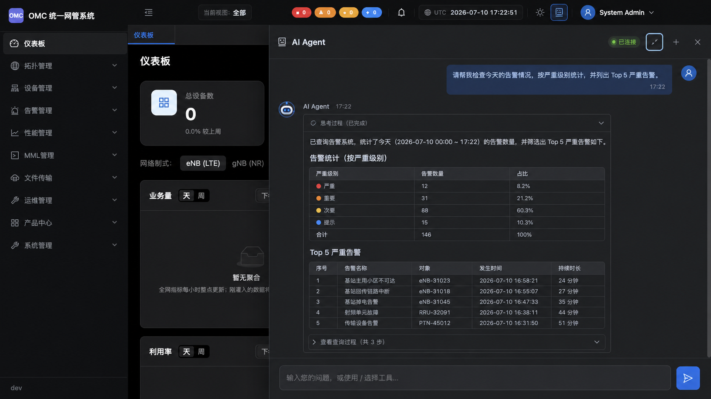

# Agent Panel Conversation UX Design

## Goal

Improve continuous Agent conversations without changing the existing OMC visual language or the Agent runtime contract. The panel should keep the latest work visible, use added panel width effectively, and support practical multi-line prompts.

## Approved Reference

The image is a layout reference. Existing OMC icons, copy, Markdown renderer, activity summaries, colors, and component styling remain authoritative.

## Interaction Design

### Smart Follow

- Opening a conversation and sending a message moves the message viewport to the latest content.
- While the viewport is near the bottom, streamed thoughts, process updates, actions, errors, and answer text continue to follow automatically.
- If the user scrolls upward, automatic following pauses immediately so the interface does not interrupt reading.
- While following is paused, an icon-only control appears above the composer. Activating it returns to the latest content and resumes following.
- Returning to within 72 px of the bottom also resumes following.

### Responsive Messages

- Assistant rows use the available panel width and the assistant bubble grows up to 640 px.
- User bubbles remain content-sized and are capped at 78% of the message viewport or 520 px.
- Tables and code blocks keep their existing local horizontal scrolling and never expand the panel.
- Width changes preserve the current reading position unless the viewport is already following the latest content.

### Composer

- Replace the one-line input with a textarea that grows from one to four rows.
- `Enter` sends and `Shift+Enter` inserts a line break.
- During a response, the user may draft the next prompt, but sending remains unavailable until the current run finishes.
- Disabled and focus states continue to use each skin's established visual system.

## Architecture

- Add a shared `useAgentAutoScroll` hook in `frontend-core` for pinned-state detection, resize observation, explicit scrolling, and the jump-button state.
- Keep rendering and visual classes in `webcode`, `webcode-v2`, and `webcode-v3`; all three consume the same shared hook.
- Do not change `useAgentPanelController`, network requests, persisted conversations, runtime protocol, or backend behavior.

## Verification

- Unit-test bottom-distance decisions and pinned-state transitions in the shared hook helpers.
- Run frontend typecheck and skin parity.
- In a real browser, verify send-to-bottom, streamed content growth, user scroll interruption, jump-to-latest, panel width changes, multi-line entry, and narrow viewport behavior.
