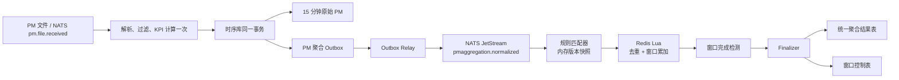

# PM 在线流式聚合设计

**日期：** 2026-07-25
**状态：** 已确认，待实施
**范围：** PM 15 分钟原始指标入库后的小时、日、周、月及自定义维度聚合
**决策：** 全量替换现有数据库扫描式聚合；不兼容、不迁移、不补算旧聚合数据

## 1. 背景与问题

当前 PM 链路已经可以在约 3 分钟内完成 10000 个基站的 15 分钟原始 Counter/KPI 入库。聚合链路却仍采用另一套执行模型：

- 自然桶任务通过 `async_jobs`、cron、启动补跑和稀疏维护任务重新扫描时序库。
- 自定义聚合任务通过 `pm_tasks` worker 再次查询原始或中间聚合表。
- 小时、日、周、月、设备组等层级形成串联扫描，数据量越大，读放大越明显。
- 聚合完成时间不再由本轮 PM 是否全部入库决定，而受 cron、积压、补跑和数据库查询性能影响。
- 同一份 PM 已在解析阶段计算过 KPI，聚合阶段再次拉取大量数据，增加 CPU、I/O、临时空间和锁竞争。

实测在彻底停止聚合任务后，10000 个文件可在约 181 秒内完成，NATS 无积压，临时文件不增长，主机负载显著下降。这说明主要问题不是 PM 文件接收和 15 分钟入库，而是扫描式聚合带来的读放大和任务编排开销。

## 2. 目标与非目标

### 2.1 目标

- PM 文件只解析一次，Counter 和 KPI 只计算一次。
- 15 分钟原始数据与“可供聚合的标准事件”在同一事务内形成，不出现入库成功但事件永久丢失。
- 聚合任务只表达“哪些设备、哪些指标、什么维度、什么粒度、采用什么统计方式”。
- 在线聚合过程中不查询 `pm_measurement_anchors`、`pm_metric_values`、`pm_metrics` 或旧聚合表。
- 全部聚合任务共享同一条事件流和同一套窗口引擎，任务数量增加时不重复读取数据库。
- 任务可以编辑；每次保存生成新的内部版本，从下一个完整窗口生效。
- 新任务和新版本不补算历史数据。
- 在 10000 基站规模下，聚合不拖慢 15 分钟原始 PM 入库。
- 重复消息、乱序消息、组件重启和最终写库重试均不产生重复结果。

### 2.2 非目标

- 不保留旧聚合结果。
- 不迁移旧聚合任务执行状态、水位或历史运行记录。
- 不兼容旧扫描式聚合、启动补跑、迟到重扫和临时聚合执行器。
- 在线链路不提供迟到数据修正、历史重算或回填。
- 本次不改变 PM XML 解析、指标公式计算和 15 分钟稀疏原始存储的业务含义。

## 3. 核心语义

### 3.1 任务与版本

用户看到的是可编辑的逻辑任务 `pm_aggregation_tasks`。每次创建或更新任务时：

1. 在一个主库事务内写入新的 `pm_aggregation_task_versions`。
2. 物化该版本的设备范围、维度键、指标和统计操作。
3. 关闭旧版本的有效期。
4. 把新版本的 `effective_from` 对齐到“保存时刻之后的下一个完整 15 分钟边界”。
5. 逻辑任务的 `current_version_id` 指向新版本。

“版本不可变”仅指已经生成的内部版本记录不原地修改，便于正在运行的窗口保持一致；用户仍然可以随时编辑任务，编辑会生成新版本。旧版本只服务其已经打开的窗口，到期后自动清理。

### 3.2 生效范围

- 新建任务：从下一个完整 15 分钟窗口开始接收事件。
- 更新任务：旧版本完成已开始的窗口，新版本从下一个完整窗口接管。
- 禁用任务：不再打开新窗口，已打开窗口按原版本完成。
- 删除任务：逻辑删除，不再打开新窗口；已打开窗口仍可完成。
- 不读取、不补算 `effective_from` 之前的任何 PM 数据。

### 3.3 窗口关闭

每个任务版本和粒度形成独立窗口。窗口有两种关闭条件：

- **完整关闭：** 该版本快照中的全部预期设备，均已贡献窗口内全部预期 15 分钟时隙。
- **超时关闭：** 到达窗口结束时间加 5 分钟，即使存在缺失也强制完成。

例如小时窗口每个设备预期 4 个时隙，日窗口预期 96 个时隙。完整性按 `(device_id, 15min_slot)` 计算，不能只判断设备是否至少上报一次。

窗口关闭后到达的 PM：

- 仍正常写入 15 分钟原始表。
- 不再进入已关闭聚合窗口。
- 不修正、不重开、不生成新版本结果。
- 增加迟到计数，供运维观察。

## 4. 总体架构



### 4.1 解析与原始入库

保留现有 `collector -> metrics.CopyIngest` 主链路。解析完成后已经具备：

- `source_file_id`
- 设备、制式、产品等身份
- 15 分钟窗口起止时间
- 对象 LDN / 小区
- Counter 和已计算 KPI
- 指标编号、指标类型、统计类型和值

`CopyIngest` 构造一次标准化测量集合，并在同一时序库事务内：

1. 写 `pm_files` 幂等标记。
2. 写 `pm_ingest_batches`。
3. 写 15 分钟稀疏原始值。
4. 写一条 `pm_aggregation_outbox`。
5. 提交事务。

只有事务提交成功才 ACK `pm.file.received`。因此原始数据和聚合事件要么同时存在，要么同时不存在。

### 4.2 Outbox Relay 与 NATS

Relay 按 `FOR UPDATE SKIP LOCKED` 领取未发布 outbox 行，发布到独立 retained stream 的 JetStream subject `pmaggregation.normalized`，收到持久化确认后标记 `published_at`。

- NATS 消息默认保留 40 天，配置可调；保留期不得短于“最长聚合窗口 + 关闭宽限 + 最大计划恢复时间”。
- 消费模式为 durable pull consumer，支持显式 ACK、重投和水平扩展。
- outbox 允许重复发布，消费侧必须幂等。
- outbox 已发布记录短期保留用于排障，定时删除。
- 事件体不引用原始 PM 表，不要求消费方回库取数。
- 同一来源标识已提交后又出现不同内容时明确拒绝，避免已聚合文件被不确定地替换。需要重灌只能按运维流程清理本轮原始数据和未关闭聚合状态后重新发送。

### 4.3 规则匹配器

匹配器在 worker 启动时加载当前和仍有活动窗口的任务版本，并监听任务版本变更事件刷新快照。匹配所需的设备归属和维度键在保存版本时已经物化，运行时不逐消息查询数据库。

一个标准事件只遍历有可能命中的版本索引：

- 按 `technology` 分桶。
- 按 `device_id` 建立倒排索引。
- 再按指标集合求交集。
- 对每个匹配版本计算其小时、日、周、月窗口。

任务数量增长只增加内存匹配和 Redis 累加，不增加原始 PM 数据库扫描。

## 5. 标准事件契约

事件版本从 `schema_version=1` 开始，包含：

```text
event_id
schema_version
source_file_id
ingest_batch_id
device_id
device_oui
device_sn
technology
product_id
window_start
window_end
measurements[]:
  object_ldn
  counter_group
  metrics[]:
    metric_id
    metric_path
    metric_type
    statis_type
    value
```

约束：

- 一份 PM 文件对应一个事件。
- 事件只包含有限数值，NaN/Inf 在进入 outbox 前拒绝。
- `window_start/window_end` 使用 UTC，展示时再按业务时区转换。
- `source_file_id` 是文件级幂等锚点。
- 事件大小超过 NATS 上限时直接让原入库事务失败并告警，不能静默截断。上线前以真实最大 PM 文件验证并配置足够的 NATS `max_payload`。

## 6. 任务与维度物化

### 6.1 主库表

#### `pm_aggregation_tasks`

保存用户可编辑的逻辑任务：

- `id`, `name`, `enabled`, `visibility`, `creator`
- `current_version_id`
- `created_at`, `updated_at`, `deleted_at`

#### `pm_aggregation_task_versions`

保存不可变执行快照：

- `id`, `task_id`, `version_no`
- `effective_from`, `effective_to`
- `technology`, `dimension`
- `granularities`
- `object_ldns`
- `created_by`, `created_at`

#### `pm_aggregation_version_metrics`

每个版本的指标规则：

- `task_version_id`
- `metric_id`, `metric_path`, `metric_type`
- `aggregation_op`：`sum|avg|min|max`

KPI 已在 15 分钟入库前计算，聚合只对 KPI 值执行版本保存时确定的统计操作，不再运行公式引擎。

#### `pm_aggregation_version_members`

每个版本的成员快照：

- `task_version_id`
- `device_id`, `device_sn`
- `dimension_key`, `dimension_name`

`dimension_key` 按任务维度预先确定：

- device：设备 ID
- aggregate_group：任务版本 ID
- device_group：设备组 ID
- product：产品 ID
- band：频段规范键
- network：固定键 `network`

保存任务时一次性查询设备、产品、频段和组关系；运行时不查询这些关系。任务更新或成员变化需要用户保存任务生成新版本，避免窗口中途成员漂移。

### 6.2 时序库表

#### `pm_aggregation_outbox`

- `event_id`, `source_file_id`, `payload`
- `created_at`, `published_at`, `publish_attempts`, `last_error`
- `source_file_id` 唯一

#### `pm_aggregation_windows`

- `task_id`, `task_version_id`, `granularity`
- `window_start`, `window_end`
- `status`：`open|finalizing|published|failed`
- `expected_slots`, `received_slots`, `missing_slots`
- `close_reason`：`complete|timeout`
- `result_count`, `opened_at`, `published_at`, `last_error`

业务唯一键为 `(task_version_id, granularity, window_start)`。

#### `pm_aggregation_results`

统一存储所有维度和粒度的最终结果：

- `time` / `window_start` / `window_end`
- `task_id`, `task_version_id`
- `granularity`
- `dimension`, `dimension_key`, `dimension_name`
- `object_ldn`
- `metric_id`, `metric_path`, `metric_type`
- `aggregation_op`, `metric_value`, `sample_count`
- `complete`, `missing_slots`
- `created_at`

唯一键为：

```text
(task_version_id, granularity, window_start,
 dimension_key, object_ldn, metric_id)
```

最终写入使用 `INSERT ... ON CONFLICT DO NOTHING`，确保 finalizer 重试不重复。

## 7. Redis 窗口状态

Redis 使用独立实例或独立持久化资源，要求：

- `maxmemory-policy noeviction`
- AOF 持久化开启
- 禁止与普通缓存共享会淘汰数据的实例
- 设置内存水位告警，不允许通过淘汰维持服务

每个任务版本窗口使用 hash tag 保证相关键落同一 slot：

```text
pmagg:{version:granularity:window}:meta
pmagg:{version:granularity:window}:seen
pmagg:{version:granularity:window}:acc
pmagg:{version:granularity:window}:devices
pmagg:{version:granularity:window}:finalize-lock
```

### 7.1 幂等与原子累加

Lua 脚本在一个原子操作内完成：

1. 检查 `seen` 中是否已有 `source_file_id`。
2. 已存在则返回 duplicate，不再次累加。
3. 写入 `source_file_id`。
4. 为每个结果键更新 `sum/count/min/max`。
5. 标记 `(device_id, 15min_slot)` 已到达。
6. 更新收到的时隙数和最后事件时间。
7. 返回窗口是否已经完整。

同一文件可能命中多个任务版本和多个粒度，因此文件级幂等键实际作用域为：

```text
task_version_id + granularity + window_start + source_file_id
```

### 7.2 统计操作

统一保存四个基础累加器：

- `sum`
- `count`
- `min`
- `max`

最终值：

- sum：`sum`
- avg：`sum / count`
- min：`min`
- max：`max`

不在聚合层重新计算 KPI 公式，也不从数据库拉取分子分母。需要加权或复合公式的指标必须在 15 分钟 KPI 计算阶段产出可正确上卷的指标，或明确配置其聚合操作；不允许在在线聚合层隐式猜测。

## 8. Finalizer 与一致性

Finalizer 由“完整事件返回”或周期性超时扫描触发：

1. 获取 Redis `finalize-lock`，锁带租约。
2. 在时序库事务内把窗口从 `open/failed` 原子转为 `finalizing`。
3. 从 Redis 读取最终累加器。
4. 批量 COPY 到临时批次或使用批量 INSERT 写 `pm_aggregation_results`。
5. 更新 `pm_aggregation_windows` 为 `published`。
6. 提交事务。
7. 提交成功后删除 Redis 窗口键。

若写库失败：

- 窗口状态写回 `failed` 或由事务回滚保持可重试。
- Redis 数据保留。
- 锁到期后重试。
- 结果唯一键保证重复执行安全。

只有最终结果和窗口 `published` 在同一事务内提交后，窗口才算完成。

## 9. 故障恢复

### 9.1 worker 重启

NATS 未 ACK 消息自动重投；Redis 去重保证不会重复累加。启动后扫描 `open/finalizing/failed` 窗口，继续超时关闭或最终写入。

### 9.2 Redis 进程重启

AOF 恢复窗口状态。若检测到 Redis 窗口状态缺失但数据库窗口仍为 `open`：

1. 删除该窗口可能残留的 Redis 键。
2. 按任务版本的 `effective_from` 和窗口范围创建临时 replay consumer。
3. 从覆盖完整活动窗口的 NATS 保留流中重放该窗口的标准事件。
4. 使用同一 Lua 脚本重建。
5. 重建完成后恢复正常消费。

该过程只重放 NATS，不查询原始 PM 表。

### 9.3 NATS 暂时不可用

原始 PM 入库不被发布动作阻塞；outbox 保留待发布事件。Relay 恢复后继续发送。必须监控最老 outbox 年龄，确保不超过 NATS/业务恢复窗口。

### 9.4 数据库暂时不可用

Finalizer 保留 Redis 数据并重试。原始入库数据库不可用时，现有 `pm.file.received` 重试和 DLQ 语义继续生效。

## 10. 查询与 API

现有报表、查询和导出统一改为读取 `pm_aggregation_results`：

- 15 分钟明细仍读取原始稀疏数据。
- 小时、日、周、月及任务聚合读取统一结果表。
- API 必须返回 `complete`、`missing_slots` 和任务版本，避免把超时关闭的不完整窗口伪装为完整数据。
- 删除旧 adhoc 执行状态、运行进度、重新执行、恢复、历史补算等接口语义。
- 任务保存返回新的 `version_no` 和 `effective_from`，前端明确提示“从下一个完整窗口生效，不补算历史”。

## 11. 删除范围

正式切换时删除或停止装配：

- `internal/pm/aggregator` 下所有数据库扫描式自然桶、组聚合、rollup、watermark、sparse maintenance 和补跑逻辑。
- `internal/pm/adhoc` 下的 worker、executor、scheduler、运行记录和结果写入逻辑；保留并重构任务 CRUD/权限能力。
- `cmd/worker/aggregator.go` 的旧 runner、cron、sweeper 和维护任务装配。
- `cmd/worker/adhoc.go` 的执行 worker 和 continuous scheduler 装配。
- 旧自然桶、设备组桶、adhoc 结果、完成水位和聚合 cron 状态表。
- 生产环境用于临时阻断聚合任务的数据库触发器。

KPI 导出如果仍依赖通用 `async_jobs`，保留其独立 runner；不得因为删除 PM 聚合 runner 而误删导出能力。

## 12. 配置与可观测性

新增配置：

- `PM_AGGREGATION_ENABLED`
- `PM_AGGREGATION_EVENT_RETENTION`，默认 40 天且不得小于最长窗口恢复下限
- `PM_AGGREGATION_CLOSE_GRACE`
- `PM_AGGREGATION_REDIS_URL`
- `PM_AGGREGATION_OUTBOX_BATCH`
- `PM_AGGREGATION_CONSUMER_CONCURRENCY`
- `PM_AGGREGATION_FINALIZE_CONCURRENCY`

核心指标：

- outbox 未发布数量、最老年龄、发布失败数
- NATS pending、ack pending、redelivery、consumer lag
- 每秒匹配事件数、每事件命中版本数
- Redis 活动窗口数、内存、去重数、Lua 耗时、错误数
- 窗口完整关闭数、超时关闭数、缺失时隙数
- 从原始入库提交到聚合结果发布的延迟
- finalizer 成功、失败、重试、锁竞争
- 关闭后迟到事件数

日志必须包含 `source_file_id`、`task_id`、`task_version_id`、`granularity`、`window_start`，但不得记录完整指标载荷。

## 13. 性能预算与验收

### 13.1 原始入库

- 10000 基站单轮从接收 PM 到全部 15 分钟 Counter/KPI 提交不超过 4 分钟。
- 99% 文件处理耗时小于 1 秒。
- NATS `pm.file.received` 最终 pending 为 0，redelivery 无异常增长。
- 时序库临时文件不因在线聚合增长。

### 13.2 在线聚合

- 聚合 worker 对原始 PM 表的读取 SQL 数量为 0。
- 正常情况下，完整窗口在最后一份预期 PM 入库后 60 秒内发布。
- 不完整窗口在 `window_end + 5min` 后 60 秒内发布。
- 重复消息不改变结果。
- Redis 或 worker 重启后，活动窗口可从 AOF 或 NATS 重建。
- 数据库最终写失败后重试只产生一份结果。

## 14. 发布策略

本次采用正式全量切换，不做双写比对和灰度兼容：

1. 开发完成后统一执行构建、全量测试、集成测试、万站压测和故障测试。
2. 全部通过后提交一个功能分支并创建 MR。
3. MR 合并后停止业务。
4. 部署新程序和新配置。
5. 清空旧聚合任务、状态和结果，执行新结构变更；不复制旧数据。
6. 删除临时聚合阻断触发器。
7. 启动 Redis、NATS、应用和 worker。
8. 新建任务，从下一个完整窗口开始观察。

回退只能回退软件版本并重新清空聚合状态，不恢复旧聚合数据，也不重新启用旧扫描链路。
