# OMC 消息队列全流程流转说明书

> **版本**：v1.0（2026-04-23）
> **适用范围**：omcgo/ 后端三大部署单元 —— `omcgo-acs` / `omcgo-app` / `omcgo-worker`
> **读者**：开发、运维、新成员
> **文档定位**：团队标准作业程序（SOP）+ 入职培训材料。以**当前生产代码为唯一事实来源**，历史演进与已下线方案仅在附录作背景提及。

---

## 目录

0. [前言与名词表](#0-前言与名词表)
1. [概述](#1-概述)
2. [架构拓扑](#2-架构拓扑)
3. [核心组件](#3-核心组件)
4. [核心流转路径](#4-核心流转路径)
5. [关键机制](#5-关键机制)
6. [每个队列的订阅与消费代码说明](#6-每个队列的订阅与消费代码说明)
7. [关键配置与参数](#7-关键配置与参数)
8. [监控与运维](#8-监控与运维)
9. [故障处理](#9-故障处理)
10. [附录](#10-附录)

---

## 0. 前言与名词表

| 名词 | 含义 |
|------|------|
| ACS | Auto-Configuration Server，独立进程 `omcgo-acs`，承载 TR-069/CWMP 协议 |
| APP | 主应用进程 `omcgo-app`，对外提供 REST API 与管理面服务 |
| Worker | 后台进程 `omcgo-worker`，承担 PM/MR 文件解析、任务恢复、兜底闭环 |
| NATS JetStream | 具持久化能力的 NATS 子系统，承担主事件总线 |
| Stream | JetStream 中"持久化流"的概念，吸纳一类 Subject 前缀（如 `DEVICE` ← `device.>`） |
| Subject | NATS 主题，点分层级（如 `device.inform.bootstrap`） |
| Queue Group | 同一 Subject 下的消费者负载均衡组，组内每条消息仅一个成员处理 |
| Durable Consumer | 订阅端在 JetStream 侧的持久游标，断线重连后从上次位置继续 |
| TaskQ | Redis Sorted Set 承载的每设备 RPC 命令队列（`acs:taskq:*`） |
| redisx | `internal/core/components/redisx/` —— 全项目 Redis 键与客户端的统一访问层 |
| SSE Hub | 基于 Go channel 的进程内事件中心（`internal/events/hub.go`），面向浏览器 EventSource |

---

## 1. 概述

### 1.1 业务定位

OMC 是面向 10 万级小基站/皮基站/微基站的网管平台。三大部署单元之间的耦合点几乎全部由**消息**承载：

- **ACS ↔ APP**：ACS 收到 CPE 的 SOAP Inform 后，把业务事件（入网/心跳/参数变更/告警）投递给 APP；APP 经业务计算后产生 RPC 下发任务交还给 ACS。
- **APP ↔ Worker**：文件处理（PM/MR/DataModel）、任务恢复、兜底闭环、告警统计等重 IO 工作甩给 Worker 执行，APP 只负责 REST 与状态查询。
- **ACS ↔ Worker**：两端直接耦合很少，主要由 Worker 订阅 ACS 发出的任务终态事件（`task.*`）做业务聚合。

### 1.2 中间件选型

| 层 | 选型 | 为什么 |
|----|------|-------|
| 主事件总线 | **NATS JetStream** | 原生 Go，轻量运维；At-Least-Once + 持久化回放；Subject 通配符契合点分层级业务事件 |
| 每设备命令队列 | **Redis Sorted Set + PostgreSQL 双写** | Score 同时表达优先级与 FIFO；Redis 低延迟，PG 供审计 / 启动恢复 |
| 浏览器推送 | **SSE + 进程内 Hub** | 单向推送场景 SSE 足够，心跳/断线重连由浏览器 EventSource 内置处理 |
| 广播一致性 | **NATS JetStream `sys.>` 流** | Casbin 策略重载走持久化广播，断线 72h 内可回放；Redis Pub/Sub 已全量下线 |

### 1.3 核心价值

- **可靠投递**：NATS JetStream 持久化 72h + 指数退避重试 + `msg.Term()` 死信；Redis TaskQ 双写保证崩溃可恢复。
- **水平伸缩**：QueueGroup 消费者组保证 APP / Worker 多副本部署时每条事件只被处理一次。
- **职责清晰**：业务模块仅通过 `task.Enqueuer`（2 个方法）下发命令；Dispatcher 仅消费 `rpc.Command`（12 个 Handler）；状态机完全封装在 `task.TaskService` 内部。
- **一站式 Key 管理**：所有 Redis 键由 `redisx.Keys` KeyBuilder 构造，字面量在单一文件收口。

---

## 2. 架构拓扑

> **如何阅读本文图**：全部 Mermaid 图均采用**竖向布局**（`flowchart TB` / `sequenceDiagram`），保证窄屏不横向滚动。VSCode 装 `bierner.markdown-mermaid`、GoLand Marketplace 装 `Mermaid` 插件即可预览；GitHub Web 端原生渲染，无需配置。

### 2.1 生产者 / Broker / 消费者三层图

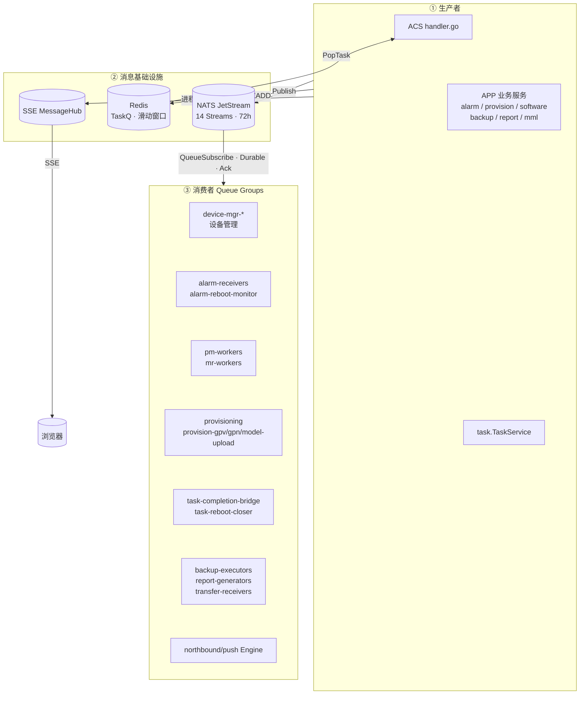

### 2.2 物理部署拓扑

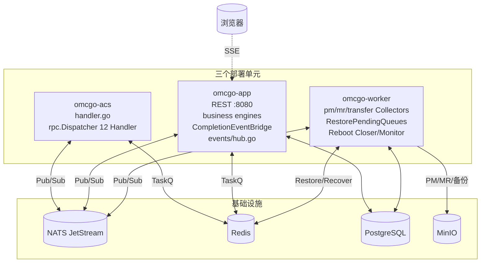

**关键边界**：
- ACS **不直接写业务库**，所有持久化效果通过 NATS 事件交 APP / Worker 完成。
- APP **不持有 NATS 订阅的重 IO**（文件解析、压测数据聚合），交 Worker。
- Worker **不对外暴露 HTTP**，输入口全部是 NATS 订阅 + Redis 任务。

### 2.3 消息层次对照表

| 层 | 机制 | 库 | 跨进程 | 持久化 | 典型场景 | 交付语义 |
|----|------|----|:------:|:------:|---------|---------|
| L1 | NATS JetStream | `nats-io/nats.go` | ✅ | ✅ 文件 | 主事件总线 | At-Least-Once |
| L1 降级 | Channel EventBus | 纯 Go channel | ❌ | ❌ | 单进程 / 无 NATS 部署兜底 | 尽力而为 |
| L2 | Redis TaskQ | `redis/go-redis` | ✅ | ✅ Redis + PG 双写 | 每设备 RPC 下发 + 响应匹配 | Exactly-Once（应用层保证） |
| L3 | Redis ZSET 滑动窗口 | `redis/go-redis` | ✅ | ✅ | 异常重启频次判定 | 幂等 |
| L4 | SSE Hub | Go channel | ❌（单进程）| 可选 | 浏览器推送（MML/通知） | 断线重连回放 |

> **已全量下线**：原 Redis Pub/Sub `casbin:policy:reload` 广播通道于 2026-04-22 迁到 NATS JetStream `sys.casbin.policy.reload`；原 `acs:cmdq:*` 命令队列于 2026-04-23 合入 TaskQ，`internal/acs/cmdqueue` 包已整体删除。当前 Redis **不再承载任何广播语义**。

---

## 3. 核心组件

### 3.1 JetStream Stream 清单（14 条）

所有流统一配置：`RetentionPolicy=WorkQueue`、`Storage=File`、`MaxAge=72h`。源代码 [internal/core/components/nats/nats.go](omcgo/internal/core/components/nats/nats.go)。

| Stream | Subject 模式 | 业务定位 |
|--------|-------------|---------|
| `DEVICE` | `device.>` | 设备入网 / 心跳 / 参数变更 / 告警 / 传输 / 重启事件 |
| `COMMAND` | `command.>` | TR-069 RPC **响应**事件（按 RPC 方法分主题） |
| `TASK` | `task.>` | 设备任务终态（completed / failed），跨进程驱动业务聚合 |
| `PM` | `pm.>` | 性能管理文件（received / parsed） |
| `MR` | `mr.>` | 测量报告文件（received / parsed） |
| `ALARM` | `alarm.>` | 告警生命周期（raised / cleared / acknowledged） |
| `OSS` | `oss.>` | 北向推送（告警 / PM / 配置快照） |
| `PROVISION` | `provision.>` | 自动开站任务状态 |
| `DATAMODEL` | `datamodel.>` | 数据模型 XML 上传 / 接收 |
| `SOFTWARE` | `firmware.>` `upgrade.>` | 固件库与升级生命周期 |
| `BACKUP` | `backup.>` | 配置备份任务 |
| `REPORT` | `report.>` | 报表生成任务 |
| `NEDIRECT` | `nedirect.>` | 网元直连会话事件（当前仅做诊断） |
| `SYS` | `sys.>` | 系统级控制广播（Casbin 策略重载等） |

### 3.2 Subject 命名规则

- **权威来源**：[internal/core/event/subjects.go](omcgo/internal/core/event/subjects.go)，所有常量均带 doc comment 标注发布者/订阅者。
- **层级格式**：`<domain>.<action>.<detail>`，点分三段为基线（如 `device.inform.bootstrap`），层数可按需扩展。
- **语义约束**：
  - `command.*.response` 仅承载**响应事件**，TR-069 RPC **请求**不走 NATS（走 §3.3 TaskQ）。
  - `task.completed` / `task.failed` 仅对 `source=mml` 且携带 `source_id` 的任务发布，避免普通 API 任务占用广播带宽。

全部 Subject 清单见 [§10 附录 A](#a-streamsubjectqueuegroupredis-key-全清单)。

### 3.3 Redis Key 命名与 `redisx.Keys`

所有 Redis 键**唯一**经 [internal/core/components/redisx/keys.go](omcgo/internal/core/components/redisx/keys.go) 的 `KeyBuilder` 构造；`grep -rn '"acs:.*:"' internal/` 只会命中该文件。

| Key 前缀 | 结构 | TTL | 用途 | 构造器 |
|----------|------|-----|------|--------|
| `acs:taskq:{sn}` | ZSET, member=taskID | 无 | 每设备命令队列，Score = `priority × 1e13 + created_at_ns` | `Keys.ACSTaskQueue(sn)` |
| `acs:task:{id}` | Hash, 字段 `data` | 24h | 任务详情 | `Keys.ACSTaskDetail(id)` |
| `acs:cwmp2task:{hash}` | String → taskID | 24h | RPC 响应按 CWMP ID 反查任务 O(1) | `Keys.ACSCWMP2Task(h)` |
| `acs:session:{sn}` | Hash | 5m | TR-069 会话状态机 | `Keys.ACSSession(sn)` |
| `acs:heartbeat:{sn}` | String（时间戳） | 2×inform | 心跳追踪 | `Keys.ACSHeartbeat(sn)` |
| `acs:continuous_wake:{sn}` | String | 动态 | ConnectionRequest 去重 | `Keys.ACSContinuousWake(sn)` |
| `reboot:abnormal:{sn}` | ZSET | 窗口期 | 异常重启滑动窗口 | `Keys.RebootAbnormal(sn)` |
| `alarm:active:{sn}` | Hash | 无 | 活跃告警去重 | `Keys.AlarmActive(sn)` |
| `datamodel:*` | 多种 | 1–24h | 数据模型三级缓存 | `Keys.DataModel*(...)` |
| `provision:sync_plan:{id}` | String | 6h | Provisioning 两阶段 sync 计划 | `Keys.ProvisionSyncPlan(id)` |
| `upload:session:{sn}:{id}` | Hash | 1h | 文件上传会话 | `Keys.UploadSession(sn, id)` |
| `sse:pending:{user}` | List | 24h | SSE 离线消息缓存 | `Keys.SSEPending(user)` |
| `auth:captcha:*` · `auth:failed:*` · `perm:visible_groups:*` | 多种 | — | 认证 / RBAC | 对应 `Keys.Auth*` / `Keys.Perm*` |

> 已彻底消除：`acs:cmdq:*`（历史 cmdqueue 包遗留，代码 0 引用，运维清理见 §8.2）；`casbin:policy:reload`（改走 NATS）。

### 3.4 Queue Group 消费者组清单

| Queue Group | Subject | 部署单元 | 代码位置 |
|-------------|---------|:--------:|---------|
| `device-mgr-bootstrap` | `device.inform.bootstrap` | APP | [device/inform_handler.go](omcgo/internal/device/inform_handler.go) |
| `device-mgr-periodic` | `device.inform.periodic` | APP | inform_handler.go |
| `device-mgr-valuechange` | `device.inform.value_change` | APP | inform_handler.go |
| `device-mgr-reboot` | `device.inform.reboot_complete` | APP | inform_handler.go |
| `alarm-receivers` | `device.inform.alarm` | APP | [alarm/receiver.go](omcgo/internal/alarm/receiver.go) |
| `alarm-reboot-monitor` | `device.reboot.abnormal` | Worker | [alarm/reboot_monitor.go](omcgo/internal/alarm/reboot_monitor.go) |
| `task-reboot-closer` | `device.inform.reboot_complete` | Worker | [task/reboot_closer.go](omcgo/internal/task/reboot_closer.go) |
| `task-completion-bridge` | `task.completed` / `task.failed` | APP | [task/event_bridge.go](omcgo/internal/task/event_bridge.go) |
| `transfer-receivers` | `device.inform.autonomous_transfer_complete` | Worker | [transfer/bridge.go](omcgo/internal/transfer/bridge.go) |
| `provisioning` | `device.registered` | APP | [provision/engine.go](omcgo/internal/provision/engine.go) |
| `provision-gpv` | `command.get_parameters.response` | APP | provision/engine.go |
| `provision-gpn` | `command.get_names.response` | APP | provision/engine.go |
| `provision-model-upload` | `datamodel.file.received` | APP | provision/engine.go |
| `pm-workers` | `pm.file.received` | Worker | [pm/collector/collector.go](omcgo/internal/pm/collector/collector.go) |
| `mr-workers` | `mr.file.received` | Worker | [mr/collector/collector.go](omcgo/internal/mr/collector/collector.go) |
| `backup-executors` | `backup.task.created` | Worker | [backup/executor.go](omcgo/internal/backup/executor.go) |
| `report-generators` | `report.generate.requested` | Worker | [report/generator.go](omcgo/internal/report/generator.go) |

> `device.inform.reboot_complete` 有两个独立 QueueGroup 订阅（`device-mgr-reboot` 做状态恢复，`task-reboot-closer` 做任务兜底）；JetStream 下不同 QueueGroup 各自独立消费同一消息副本，不会互抢。`northbound/push.Engine` 另用普通 `Subscribe` 做第三路 OSS 透传。

### 3.5 TaskQ —— 唯一的 TR-069 RPC 下发通道

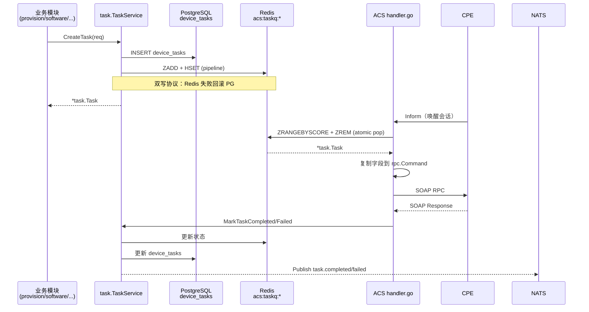

**接口（`internal/task/enqueuer.go`）**：业务模块只看到 2 个方法的窄接口：

```go
type Enqueuer interface {
    CreateTask(ctx context.Context, req *CreateTaskRequest) (*Task, error)
    GetQueueLength(ctx context.Context, deviceSN string) (int64, error)
}
```

生命周期 API（`MarkTaskSent / Completed / Failed / Cancel`）由 `TaskService` 内部或 ACS Dispatcher 调用，**不对业务模块暴露**，防止越权调状态。

---

## 4. 核心流转路径

### 4.1 正常链路全景

分三段看 —— 上行（设备事件入系统）、下行（业务下发 RPC）、回流（终态聚合）：

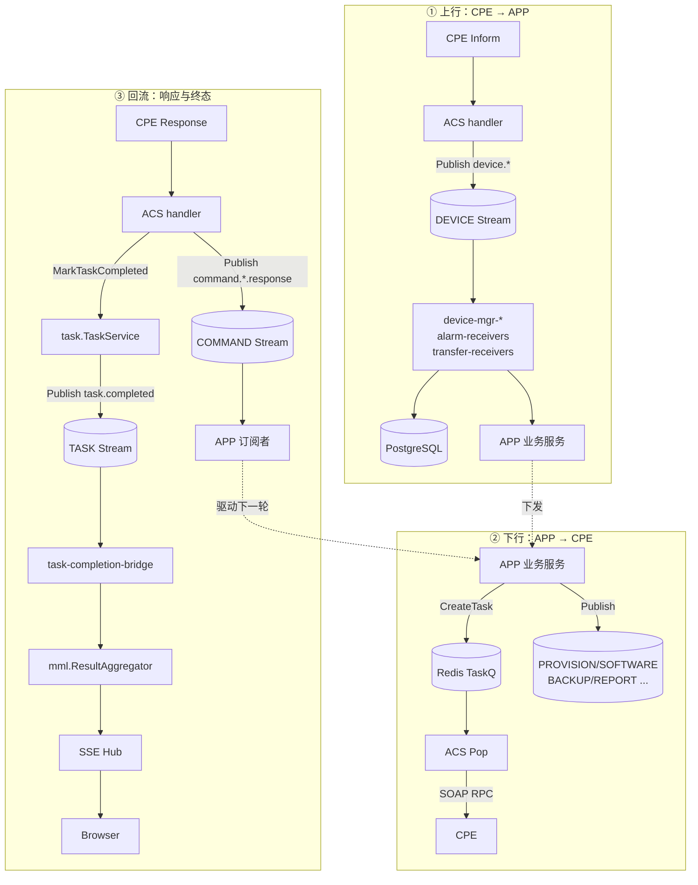

### 4.2 业务场景流转

#### 4.2.1 设备 Inform 处理

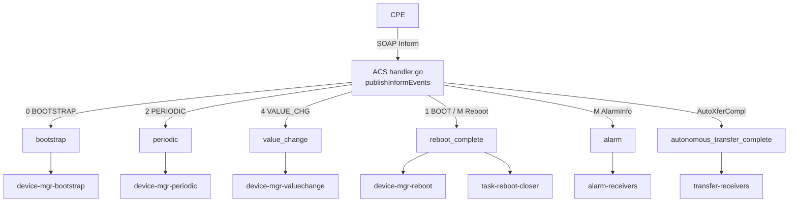

> 子主题节点省略了 `device.inform.` 前缀；全称见 [§10.A.2](#a2-subject-全景)。

**语义边界**：
- `0 BOOTSTRAP`（可能伴随 `1 BOOT`）→ bootstrap → 设备注册 + 自动开站。
- 纯 `1 BOOT` 或 `M Reboot`（无 BOOTSTRAP）→ reboot_complete → 状态恢复 + 重启计数 + OSS 透传，不走开站。
- 两种语义**不混流**，避免重启意外触发重配。

#### 4.2.2 RPC 下发与响应匹配

见 [§3.5 TaskQ 序列图](#35-taskq--唯一的-tr-069-rpc-下发通道)。`cwmp2task` 映射是响应匹配的核心：ACS 发出 RPC 时把 CWMP ID 写入 `acs:cwmp2task:{hash}`，收到响应时反查恢复对应任务。

#### 4.2.3 自主文件上传分发（PM / MR / DataModel）

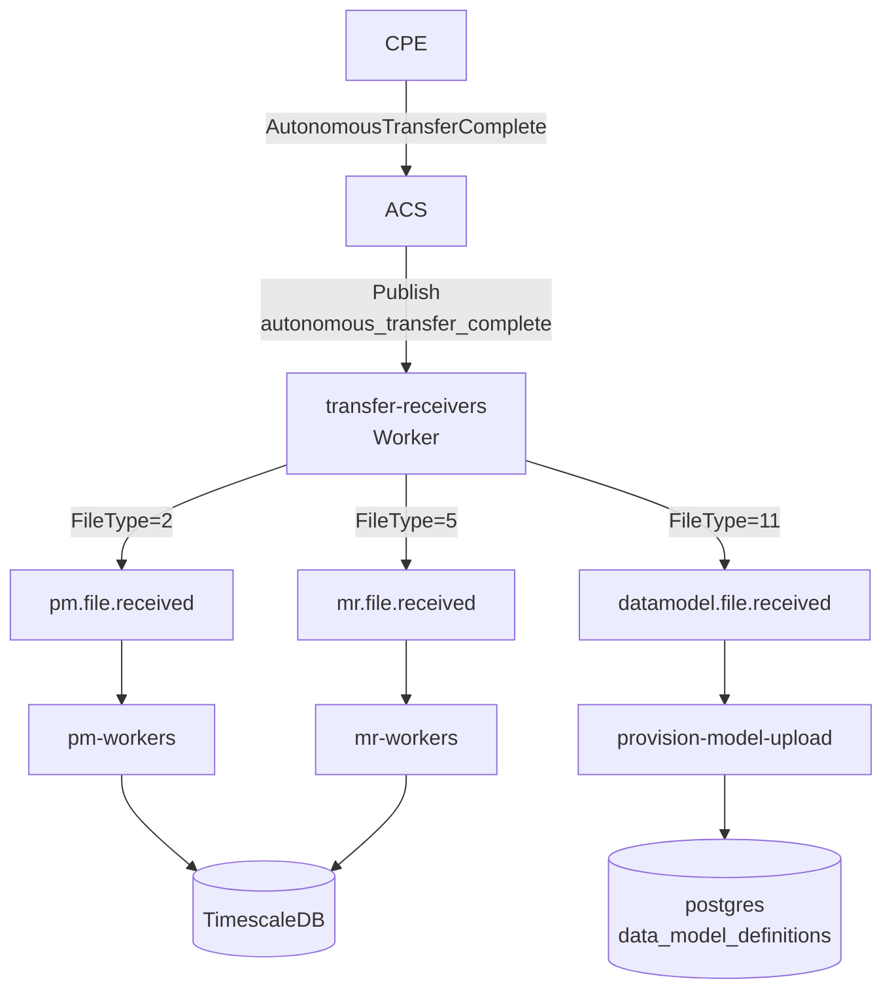

**落地分工**：文件先下载到 MinIO（transfer/bridge.go），然后按 FileType 发相应主题；解析在 Worker 进程异步完成。

#### 4.2.4 自动开站（多轮往返）

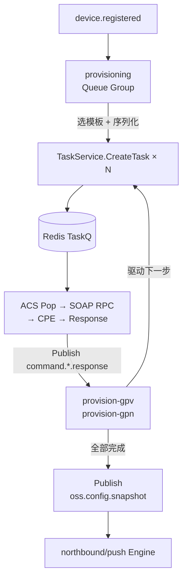

#### 4.2.5 固件升级

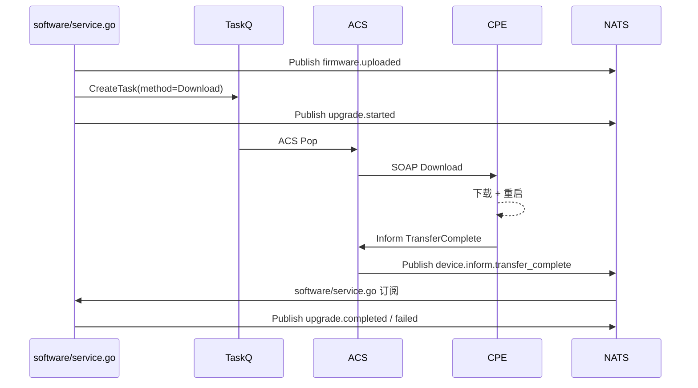

#### 4.2.6 配置备份

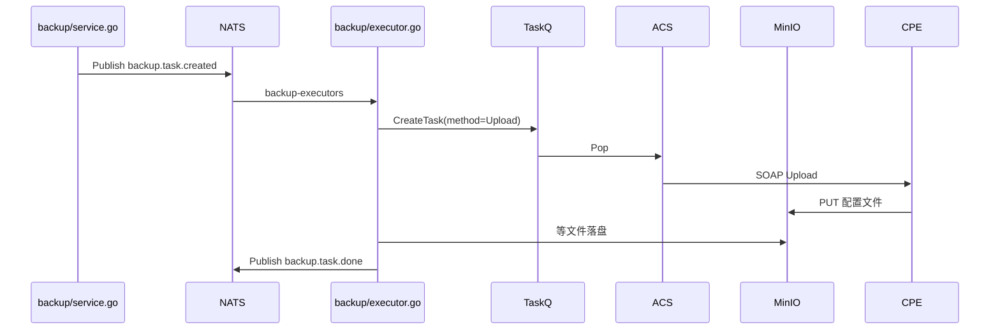

#### 4.2.7 报表生成

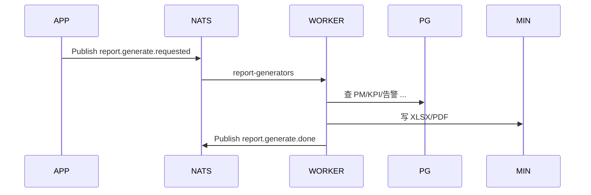

#### 4.2.8 MML 任务扇出与聚合

MML 场景是**三进程协同**的典型案例：APP 发起 → ACS 执行 → APP 聚合。

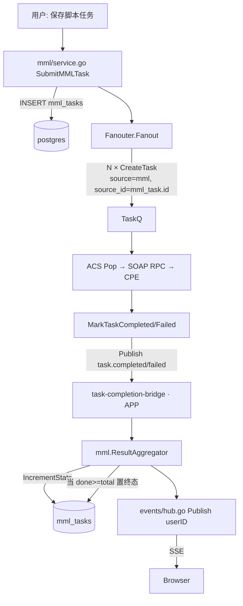

**关键保证**：
- QueueGroup `task-completion-bridge` 保证 APP 多副本下每个终态事件只处理一次。
- `task.TaskService.notifyCompletion` 内部二选一：有 EventBus 则发事件不再调 callback，防止双重计数。
- 发布过滤：只要 `source_id` 非空即发 `task.*`（P1 起，docs/design/mml-task-flow-design-20260424.md）。下游
  `task.CompletionRouter` 按 `task.Source` 分发到各自的聚合器（当前只注册了 MML；provision/backup/...
  未来按需 `router.Register(source, handler)`）。
- **调度器（P2/P3）**：`mml_tasks.execute_type=scheduled/periodic` 的任务不再在创建时立刻 fanout；
  `mml.Scheduler` 以 30s 周期 `SELECT ... FOR UPDATE SKIP LOCKED` 认领到期行：
  - scheduled → 置 running、清 `next_trigger_at`，走同一 fanout 路径
  - periodic → 克隆子实例（`parent_task_id` 指模板）并推进模板 `next_trigger_at`；
    `NOW() > period_end` 时模板自动置 completed
- **历史执行**：`GET /api/v1/mml/scripts/:id/runs` 按 `script_id` 聚合返回所有 mml_tasks
  （模板 + 子实例），前端脚本详情页"历史执行" tab 消费。
- **指标（P4）**：`mml_task_total{source,status}` / `mml_task_duration_seconds{source}` /
  `completion_no_handler_total{source}` 暴露到 Prometheus。

#### 4.2.9 设备重启三种语义

| 情形 | 事件码组合 | 处理 |
|------|-----------|------|
| 首次入网 / 出厂复位 | `0 BOOTSTRAP` (可选 `1 BOOT`) | 走 bootstrap 分支，不走本流 |
| ACS 命令重启 | `1 BOOT` + `M Reboot` | reboot_complete → 任务兜底关闭 Reboot/FactoryReset 任务，不抬告警 |
| 自主 / 异常重启 | `1 BOOT`（无 `M Reboot` 无 BOOTSTRAP） | reboot_complete + `device.reboot.abnormal` → 滑动窗口累计，达阈值抬 `FREQUENT_ABNORMAL_REBOOT` 告警 |

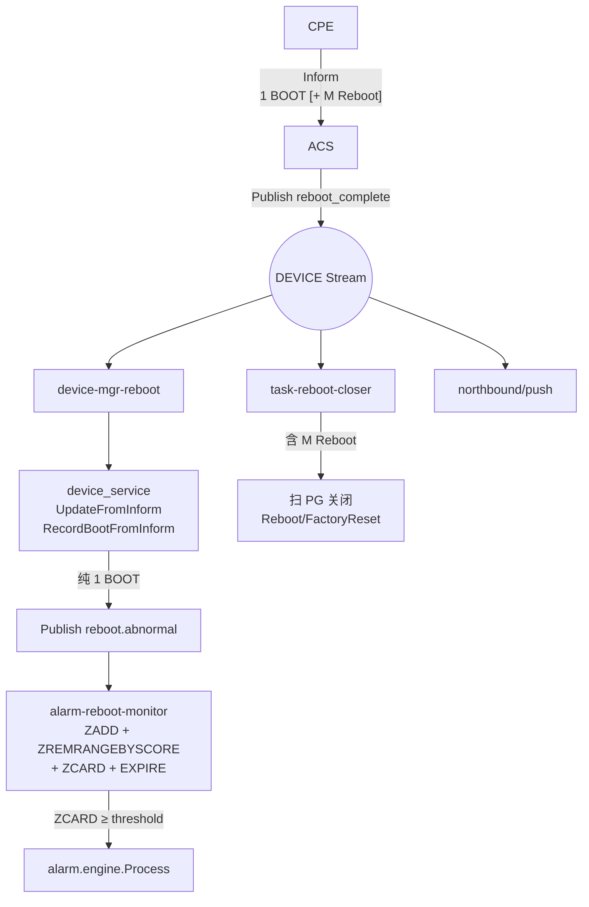

**可调参数**：滑动窗口默认 5 分钟，阈值默认 3 次（`WithRebootWindow` / `WithRebootThreshold`）。

#### 4.2.10 Casbin 策略同步（NATS 广播）

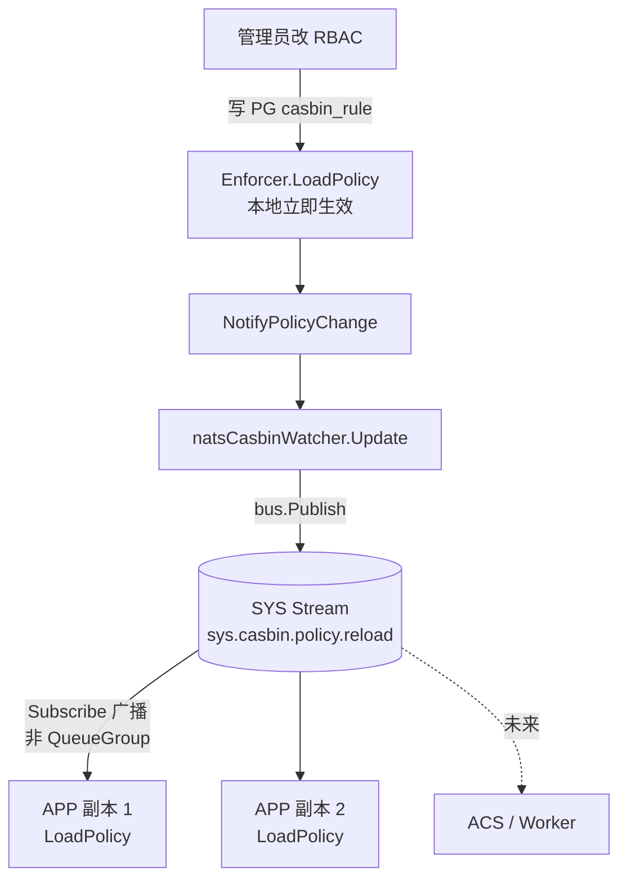

**为何用普通 Subscribe 而非 QueueGroup**：每个副本都需要各自重载自己内存的 Enforcer，广播语义是刚需；QueueGroup 会导致只有一个副本更新。

**降级**：`bus == nil`（单测 / 无 NATS）时 Watcher 退化为 no-op；`StartPeriodicRefresh` 默认 5 min 周期性重载兜底。

#### 4.2.11 SSE 用户推送

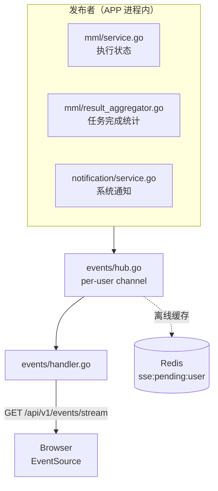

仅 APP 进程参与。ACS / Worker 需推 UI 必须经 NATS 转到 APP 再 Hub 分发。

### 4.3 特殊链路

#### 4.3.1 NATS 消息重试（指数退避 + 死信）

所有 QueueSubscribe 订阅共享同一 wrapHandler（[nats_bus.go:105](omcgo/internal/core/event/nats_bus.go#L105)）：

| 阶段 | 处理 |
|------|------|
| Unmarshal 失败 | `msg.Term()` —— 视为永久错误，不重试 |
| Handler 返回错误 & 投递次数 `< 5` | `msg.NakWithDelay(2^(n-1) s)` —— 1s / 2s / 4s / 8s / 16s 递增 |
| 投递次数 `>= 5` | `msg.Term()` —— 视为死信终止 |
| Handler 成功 | `msg.Ack()` |

**命名说明**：本项目没有显式的 DLQ（死信队列），`msg.Term()` 在 JetStream 语义中直接丢弃消息并记 metrics。业务关键链路（如告警抬升）通过**多订阅者冗余**（alarm + northbound 两路）缓解丢失风险。

#### 4.3.2 Redis 僵死任务恢复

CPE 每次 Inform 时由 ACS 调用 `TaskService.RecoverPendingTasks(sn)`：
- `GetStaleSentTasks(sn, 5m)` 找 `status=sent` 且 `sent_at > 5min` 前的僵死任务。
- `Task.CanRetry()` 判重（`RetryCount < MaxRetries`）通过则重置为 `pending` 重新入队；否则标记 `failed`。

#### 4.3.3 Worker 启动幂等补灌

Worker 启动时（[cmd/worker/bootstrap.go](omcgo/cmd/worker/bootstrap.go)）调用 `TaskService.RestorePendingQueues(ctx, limit)`：
- 扫 PG `device_tasks WHERE status='pending'`。
- 每条对 Redis `ZSCORE acs:taskq:{sn} task.id` 检查成员是否已在队列——**不在才 Push**。
- 重复运行 / 多副本启动幂等，不会重复入队。

#### 4.3.4 Reboot 兜底闭环

`task-reboot-closer`（Worker）订阅 `device.inform.reboot_complete`，当 Inform 中包含 `M Reboot` 时扫 PG 找 `method IN (Reboot, FactoryReset) AND status IN (pending, sent)`，主动 `MarkTaskCompleted`。避免 CPE 重启后遗留"永不应答"的 Reboot 任务。

#### 4.3.5 配置/缓存降级路径

| 条件 | 表现 |
|------|------|
| `cfg.NATS.URL == ""` | `NewEventBus` 返回 `ChannelEventBus`（进程内通配符实现），订阅/发布语义保持，牺牲跨进程 |
| Redis 连接失败 | `TaskService.CreateTask` PG 写成功但 Redis 失败时回滚 PG；`redisx.Retry` 对非关键读操作自动重试 3 次后放弃 |
| `EventBus == nil`（单测） | `TaskService.notifyCompletion` 退回同进程 callback；Casbin Watcher 退化为 no-op |

---

## 5. 关键机制

### 5.1 ACK 机制

| 机制 | 细节 |
|------|------|
| NATS JetStream | `AckExplicit()` + Durable Consumer；Handler 成功 `Ack`，失败 `NakWithDelay`，永久错误 `Term` |
| Redis TaskQ | 无 Ack 概念，原子 `ZRANGEBYSCORE + ZREM` pipeline 保证"消费不重复"；状态机由 `MarkTaskSent/Completed/Failed` 推进 |
| 双写事务 | Redis 失败回滚 PG，保证 PG = Redis 的最终一致 |

### 5.2 幂等性

| 场景 | 幂等手段 |
|------|---------|
| Worker 启动补灌 | `ZSCORE` 判存，已在队列跳过 |
| Inform 重复上报 | `acs:session:{sn}` Hash 去重窗口 |
| 异常重启计数 | `ZADD score=now` 天然去重 + `ZREMRANGEBYSCORE` 剔出窗口外 |
| MML 任务完成事件 | `QueueGroup=task-completion-bridge` 单次处理；`notifyCompletion` 二选一防重复计数 |
| ConnectionRequest | `acs:connreq:pending:{sn}` 30 秒去重 |

### 5.3 优先级与 FIFO

Redis TaskQ Score 编码：`score = priority × 1e13 + created_at_ns`
- 优先级小者优先（priority=0 最高）。
- 同优先级按创建纳秒时间戳 FIFO。
- 特殊优先级 `-1`（2026-04-23 前由 provision/sync.go hack 使用）已迁出，目前仅 0+ 正整数。

### 5.4 延迟投递

OMC 当前**不需要**"业务 N 秒后再投"场景。延迟语义由三种替代方式承担：
- **定时任务调度**：`cron/v3` 承担周期采集/聚合（PM/KPI）。
- **TTL 触发**：Redis Key TTL + 业务在读取时判过期（TaskQ 的 `ExpiresAt`）。
- **NATS NakWithDelay**：失败场景的退避重投，不用于业务延迟。

### 5.5 死信

| 层 | 死信定义 | 后续动作 |
|---|---------|---------|
| NATS | `deliveries >= 5` → `msg.Term()` | 日志 `max deliveries reached` + metrics；业务关键链路靠多订阅者冗余 |
| Redis TaskQ | `ExpiresAt < now` 的任务在 Pop 时跳过并 `MarkTaskFailed(errorCode=expired)` | 发 `task.failed` 事件到 TASK 流；ACS 会话不再占用 |
| SSE | per-user channel 满 | 丢最旧消息；`events/store.go` 持久化离线消息供重连回放 |

### 5.6 异常重试流程

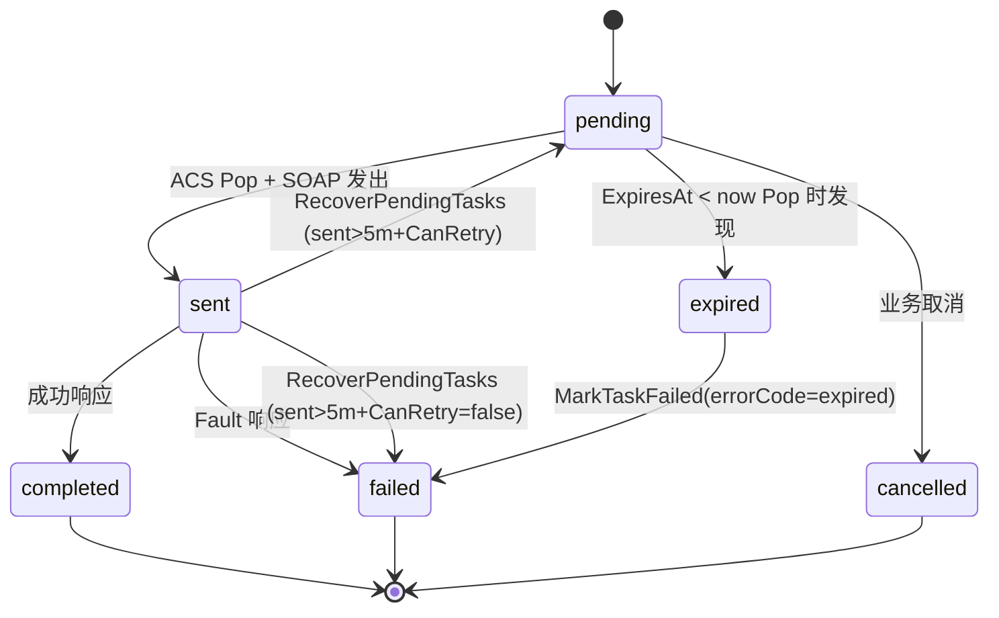

---

## 6. 每个队列的订阅与消费代码说明

> 本节给出每个 Queue Group 的典型订阅代码 + 消费逻辑要点，便于新成员快速定位。

### 6.1 设备 Inform 管理（APP 进程）

**文件**：[internal/device/inform_handler.go](omcgo/internal/device/inform_handler.go)

```go
if _, err := bus.QueueSubscribe(event.SubjectDeviceBootstrap, "device-mgr-bootstrap", h.handleBootstrap); err != nil {
    return err
}
if _, err := bus.QueueSubscribe(event.SubjectDevicePeriodic, "device-mgr-periodic", h.handlePeriodic); err != nil {
    return err
}
if _, err := bus.QueueSubscribe(event.SubjectDeviceValueChange, "device-mgr-valuechange", h.handlePeriodic); err != nil {
    return err
}
if _, err := bus.QueueSubscribe(event.SubjectDeviceRebootComplete, "device-mgr-reboot", h.handleRebootComplete); err != nil {
    return err
}
```

**消费要点**：
- `handleBootstrap`：UPSERT `devices` 表 + 发 `device.registered`（首次入库才发）。
- `handlePeriodic` 同时处理 periodic 与 value_change，两类都更新 `last_inform_at` 与参数快照。
- `handleRebootComplete`：`UpdateFromInform` + `RecordBootFromInform` 原子 `boot_count++`；若纯 `1 BOOT` 则发 `device.reboot.abnormal`。

### 6.2 告警接收（APP 进程）

**文件**：[internal/alarm/receiver.go](omcgo/internal/alarm/receiver.go)

```go
_, err := eventBus.QueueSubscribe(
    event.SubjectDeviceAlarm,
    "alarm-receivers",
    r.handleAlarmInform,
)
```

**消费要点**：解析 `M AlarmInfo` 载荷 → 调用 `alarm.engine.Process` 做去重/关联/生命周期 → 视情况 `Publish alarm.raised/cleared` + `oss.alarm.forward`。

### 6.3 重启频次监控（Worker 进程）

**文件**：[internal/alarm/reboot_monitor.go](omcgo/internal/alarm/reboot_monitor.go)

```go
if _, err := bus.QueueSubscribe(event.SubjectDeviceRebootAbnormal, rebootMonitorQueue, m.handle); err != nil {
    return err
}
```

**消费要点**：一次性管线 `ZADD + ZREMRANGEBYSCORE + ZCARD + EXPIRE`；`ZCARD >= threshold` → 抬 `FREQUENT_ABNORMAL_REBOOT` → 走告警管道。

### 6.4 任务兜底闭环（Worker 进程）

**文件**：[internal/task/reboot_closer.go](omcgo/internal/task/reboot_closer.go)

```go
if _, err := bus.QueueSubscribe(event.SubjectDeviceRebootComplete, rebootCloserQueue, c.handle); err != nil {
    return err
}
```

**消费要点**：只对含 `M Reboot` 的 Inform 处理；扫 PG 找 `method IN (Reboot, FactoryReset) AND status IN (pending, sent)` → `MarkTaskCompleted`。与 `device-mgr-reboot` 共享同一 Subject 但不同 QueueGroup，两者独立消费。

### 6.5 任务终态桥（APP 进程）

**文件**：[internal/task/event_bridge.go](omcgo/internal/task/event_bridge.go)

```go
for _, sub := range []string{event.SubjectTaskCompleted, event.SubjectTaskFailed} {
    if _, err := bus.QueueSubscribe(sub, "task-completion-bridge", b.handle); err != nil {
        return err
    }
}
```

**消费要点**：`DecodePayload(Task)` 还原终态 → 按 `source` 分发到注册的 `TaskCompletionCallback`（当前仅 `mml.ResultAggregator`）。

### 6.6 文件上传分发（Worker 进程）

**文件**：[internal/transfer/bridge.go](omcgo/internal/transfer/bridge.go)

```go
_, err := bus.QueueSubscribe(
    event.SubjectDeviceAutonomousTransferComplete,
    "transfer-receivers",
    b.handleAutonomousTransferComplete,
)
```

**消费要点**：从 CPE 指定 URL 下载文件到 MinIO → 按 `FileType` 发相应主题（`pm.file.received` / `mr.file.received` / `datamodel.file.received`）。

### 6.7 PM / MR 采集（Worker 进程）

**文件**：[internal/pm/collector/collector.go](omcgo/internal/pm/collector/collector.go) · [internal/mr/collector/collector.go](omcgo/internal/mr/collector/collector.go)

```go
_, err := bus.QueueSubscribe(event.SubjectPMFileReceived, "pm-workers", c.handleFileReceived)
_, err := eventBus.QueueSubscribe(event.SubjectMRFileReceived, "mr-workers", c.handleMRFileReceived)
```

**消费要点**：流式解析 XML → 批量写 TimescaleDB hypertable → 发 `pm.file.parsed` / `mr.file.parsed`（目前无订阅者但保留扩展点）。

### 6.8 自动开站（APP 进程）

**文件**：[internal/provision/engine.go](omcgo/internal/provision/engine.go)

```go
bus.QueueSubscribe(event.SubjectDeviceRegistered, "provisioning", func(...) {...})
bus.QueueSubscribe(event.SubjectDataModelFileReceived, "provision-model-upload", ...)
bus.QueueSubscribe(event.SubjectCommandGetParamsResponse, "provision-gpv", ...)
bus.QueueSubscribe(event.SubjectCommandGetNamesResponse, "provision-gpn", ...)
```

**消费要点**：每个 RPC 响应回来驱动下一步；全部步骤完成后 `Publish oss.config.snapshot`。模板选择与参数决策由 `template` / `baseline` 子模块完成。

### 6.9 备份执行（Worker 进程）

**文件**：[internal/backup/executor.go](omcgo/internal/backup/executor.go)

```go
_, err := bus.QueueSubscribe(event.SubjectBackupTaskCreated, "backup-executors", e.handleTaskCreated)
```

**消费要点**：从 `backup.task.created` 载荷里取 `device_sn` 与 `backup_id` → `CreateTask(method=Upload)` 让 CPE 把配置文件 PUT 到 MinIO → 等文件落盘后更新 `backup_tasks` 状态 → 发 `backup.task.done`。

### 6.10 报表生成（Worker 进程）

**文件**：[internal/report/generator.go](omcgo/internal/report/generator.go)

```go
_, err := bus.QueueSubscribe(event.SubjectReportGenerateRequested, "report-generators", g.handleGenerateRequest)
```

**消费要点**：按 `report_type` 查 PG/Timescale 聚合 → 写 XLSX/PDF 到 MinIO → 发 `report.generate.done`（理想接入 SSE Hub 通知用户，待补）。

### 6.11 Casbin 策略广播（全 APP 副本）

**文件**：[internal/admin/casbin_nats.go](omcgo/internal/admin/casbin_nats.go)

```go
// Subscribe（广播，非 QueueGroup）——每个副本都要各自 LoadPolicy
_, err := bus.Subscribe(event.SubjectSysCasbinPolicyReload, func(ctx context.Context, evt event.Event) error {
    return w.enforcer.LoadPolicy()
})
```

**消费要点**：收到通知 → 全量重载 PG 的 `casbin_rule` 表到内存 Enforcer。

---

## 7. 关键配置与参数

### 7.1 NATS

```yaml
nats:
  url: "nats://nats:4222"       # 留空则降级为 ChannelEventBus
  reconnect_wait: 100ms
  max_reconnect: 10
```

装配流程：
1. `main.go → appconfig.Load` 读 YAML。
2. `components.NewInfra → ConnectNATS(cfg.NATS)` 建立连接。
3. `EnsureStreams` 自动注册 §3.1 列出的全部 14 条流（已存在则跳过，不重复创建）。
4. `CreateEventBus` 按 `cfg.NATS.URL` 是否空选择 `NATSEventBus` 或 `ChannelEventBus`。
5. 各业务模块在 bootstrap 阶段调用 `xxx.Subscribe(infra.EventBus)` 注册消费者。

### 7.2 Redis

```yaml
redis:
  type: "single"                # 或 "cluster"
  addrs: ["redis:6379"]
  db: 0
  password: ""
  pool_size: 100
```

三进程配置**必须指向同一 Redis 实例**（dev/prod 已核对），保证 `acs:taskq:*` / `reboot:abnormal:*` 跨进程语义一致。

### 7.3 任务服务装配

| 进程 | 关键代码 | 说明 |
|------|---------|------|
| ACS | [cmd/acs/main.go](omcgo/cmd/acs/main.go) | 创建 `TaskService`；`SetEventBus(infra.EventBus)` 启用终态事件广播 |
| APP | [cmd/app/bootstrap.go](omcgo/cmd/app/bootstrap.go) + [provider/modules.go](omcgo/cmd/app/provider/modules.go) | 创建 `TaskService`；`CompletionEventBridge.Subscribe(EventBus)` 绑定 `ResultAggregator`；不再直连 callback |
| Worker | [cmd/worker/bootstrap.go](omcgo/cmd/worker/bootstrap.go) + [cmd/worker/main.go](omcgo/cmd/worker/main.go) | 创建 `TaskService`；`SetEventBus` 启用广播；启动后立即 `RestorePendingQueues(limit=10000)` |

### 7.4 关键参数一览

| 参数 | 默认 | 位置 | 说明 |
|------|------|------|------|
| JetStream `MaxAge` | 72h | nats.go | 所有 14 条 Stream 统一保留 72h |
| NATS 最大重投次数 | 5 | nats_bus.go `maxDeliveries` | 超出 `msg.Term()` |
| NATS 重试退避 | 1s/2s/4s/8s/16s | nats_bus.go | `NakWithDelay(2^(n-1) s)` |
| TaskQ 任务详情 TTL | 24h | redis_queue.go | `acs:task:{id}` |
| CWMP ID 映射 TTL | 24h | redis_queue.go | `acs:cwmp2task:{hash}` |
| ACS 会话 TTL | 5min | acs/session_store.go | `acs:session:{sn}` |
| Stale sent 阈值 | 5min | task/service.go `RecoverPendingTasks` | `sent_at > 5min` 视为僵死 |
| RestorePending 上限 | 10000 | bootstrap | 每次启动补灌任务数 |
| 异常重启窗口 | 5min | alarm/reboot_monitor.go | `WithRebootWindow` 可改 |
| 异常重启阈值 | 3 | alarm/reboot_monitor.go | `WithRebootThreshold` 可改 |
| Casbin 周期重载 | 5min | admin/casbin.go `StartPeriodicRefresh` | NATS 不可用时兜底 |
| SSE channel buf | 64 | events/hub.go | 满时丢最旧 |

---

## 8. 监控与运维

### 8.1 JetStream 观测

```bash
# 查看全部 Stream
nats stream ls

# 某 Stream 详情（消息数、存储占用、消费者数）
nats stream info DEVICE
nats stream info TASK
nats stream info SYS

# Durable Consumer 进度
nats consumer info TASK task-completion-bridge
nats consumer info DEVICE device-mgr-bootstrap

# 消费速率
nats consumer report DEVICE
```

**健康指标**（Prometheus）：
- `nats_jetstream_stream_messages{stream="DEVICE"}` 持续上升但 consumer lag 不降 → 消费者故障。
- `nats_jetstream_consumer_num_pending` 告警阈值 1000（按业务定）。

### 8.2 Redis TaskQ 观测

```bash
# 设备队列深度
redis-cli ZCARD acs:taskq:<device_sn>

# 队头任务（score 最小者）
redis-cli ZRANGE acs:taskq:<device_sn> 0 0 WITHSCORES

# 任务详情
redis-cli HGET acs:task:<task_id> data

# CWMP ID 反查
redis-cli GET acs:cwmp2task:<cwmp_id_hash>

# 异常重启滑动窗口
redis-cli ZCARD reboot:abnormal:<device_sn>
```

**历史 key 清理**（一次性运维动作，2026-04-23 之后已无代码写入）：

```bash
# 方式 A：单实例
redis-cli --scan --pattern 'acs:cmdq:*' | xargs -r -n 100 redis-cli DEL

# 方式 B：Redis Cluster
for node in $(redis-cli cluster nodes | awk '/master/ {print $2}' | cut -d@ -f1); do
  redis-cli -h "${node%:*}" -p "${node##*:}" --scan --pattern 'acs:cmdq:*' \
    | xargs -r -n 100 redis-cli -h "${node%:*}" -p "${node##*:}" DEL
done
```

### 8.3 任务恢复路径自检

| 场景 | 路径 | 日志关键字 |
|------|------|-----------|
| Worker 启动补灌 | `RestorePendingQueues(ctx, limit)` | `"restore pending task queues done"` + `scanned/pushed/skipped/failed` |
| CPE 重连僵死恢复 | `RecoverPendingTasks(sn)` on Inform | `"task recovered from stale state"` |
| 重启任务兜底 | `task-reboot-closer` 订阅 | `"reboot task auto closed"` |

### 8.4 跨进程一致性清单（CI / Smoke Test）

- [ ] ACS / APP / Worker 配置指向同一 NATS URL + 同一 Redis。
- [ ] 迁移 `000028_device_tasks_rename_source_id.sql` 已应用（为 MML 链路前提）。
- [ ] `nats stream ls` 输出包含 14 条 Stream（`DEVICE` / `COMMAND` / `TASK` / `PM` / `MR` / `ALARM` / `OSS` / `PROVISION` / `DATAMODEL` / `SOFTWARE` / `BACKUP` / `REPORT` / `NEDIRECT` / `SYS`）。
- [ ] `nats consumer ls TASK` 包含 `task-completion-bridge`。
- [ ] `nats stream info SYS` 存在（Casbin 广播依赖）。
- [ ] Worker 启动日志包含 `"restore pending task queues done"`。
- [ ] APP 启动日志包含 `"casbin policy reload listener started"`。

### 8.5 积压与消费速率告警

| 指标 | 告警阈值 | 含义 |
|------|---------|------|
| `acs:taskq:*` ZCARD 最大值 | > 1000 | 某设备命令积压（可能是 CPE 离线或 ACS 侧故障） |
| JetStream `num_pending` for `pm-workers` | > 10000 | PM 文件处理赶不上生产速率 |
| JetStream `num_pending` for `task-completion-bridge` | > 5000 | MML 聚合链路拥堵 |
| `RedisOpDuration` p99 | > 100ms | Redis 响应劣化（见 `redisx.PrometheusHook`） |
| `task.failed` 速率 | > 10/s | 设备/网络异常激增 |

---

## 9. 故障处理

### 9.1 消费者故障恢复

| 现象 | 根因排查 | 恢复动作 |
|------|---------|---------|
| 某 QueueGroup consumer lag 持续上升 | ① 业务模块 panic / deadlock ② 下游 DB 慢查询 ③ 消息处理非幂等造成无限重投 | Kubectl 重启对应进程（JetStream Durable Consumer 保留游标，不丢消息）；检查 Zap 日志 `"handle event"` 错误 |
| `msg.Term()` 突然增多 | 投递次数到 5 → 业务持续报错 | 关注 metrics `nats_jetstream_consumer_num_ack_floor`；根治需修复 handler |
| Redis TaskQ 空但 CPE 无响应 | ACS 端 Pop 后 CPE 长时间未回 Inform | `GET acs:cwmp2task:*` 查是否有未 Ack 映射；等 5min 后自动 recover |

### 9.2 服务宕机

| 场景 | 行为 | 验证 |
|------|------|------|
| ACS 宕机 | APP / Worker 继续产生 NATS 事件，JetStream 缓存 72h；Redis TaskQ 被动累积 | ACS 重启后 CPE 重连 Inform，`RecoverPendingTasks` 回收 sent 僵死任务 |
| APP 宕机 | NATS Durable Consumer 暂停消费；Redis TaskQ 不受影响；REST API 不可用 | APP 重启后 Durable Consumer 从游标续消费；不丢事件 |
| Worker 宕机 | PM/MR 文件堆积在 `pm.file.received` 流；重启任务、告警监控暂停 | Worker 重启后 `RestorePendingQueues` 幂等补灌 + `pm-workers` 从游标续消 |
| NATS 不可用 | 生产失败；`NATSEventBus` 自动重连（最多 10 次）；完全失败则 Publish 返回错误，业务应降级（打日志 + 记失败） | `cfg.NATS.url=""` 单进程部署时退化为 ChannelEventBus |
| Redis 不可用 | `CreateTask` 失败并回滚 PG；业务返回错误；`redisx.Retry` 对非关键读重试 3 次 | Redis 恢复后 Worker 启动补灌重新入队 |
| PostgreSQL 不可用 | `CreateTask` 直接失败（不进 Redis）；告警处理失败 | 依赖 DB 高可用；不使用本地缓存持久化（避免数据漂移） |

### 9.3 关键告警响应 Runbook

1. **TaskQ 积压告警**（某设备 ZCARD > 1000）
   - `redis-cli ZRANGE acs:taskq:<sn> 0 5 WITHSCORES` 看最老任务。
   - `SELECT * FROM device_tasks WHERE device_sn=? ORDER BY created_at DESC LIMIT 10` 核对 PG。
   - 若 CPE 长期离线 → 批量 `MarkTaskFailed(errorCode=device_offline)` 清空；若 CPE 在线但不响应 → 排查 ACS handler 日志。

2. **JetStream consumer lag 告警**
   - `nats consumer report <STREAM>` 看哪些 consumer 滞后。
   - 对应进程 `kubectl logs -f <pod>` 看 handler 错误堆栈。
   - 临时扩容：APP / Worker 多副本 + 同 QueueGroup 自动分担。

3. **Casbin 策略未同步**（某副本权限判定异常）
   - `nats stream info SYS` 确认 Stream 存在。
   - 目标副本 `kubectl logs` 搜 `"casbin policy reload listener started"`。
   - 手动触发：重启该副本，`StartPeriodicRefresh` 也会在 5min 内自愈。

---

## 10. 附录

### A. Stream / Subject / QueueGroup / Redis Key 全清单

#### A.1 Stream

见 [§3.1](#31-jetstream-stream-清单14-条)。

#### A.2 Subject 全景

| Subject | 发布者 | 订阅者（QueueGroup 或普通） |
|---------|--------|-------------------------------|
| `device.inform.bootstrap` | acs/handler.go | `device-mgr-bootstrap` |
| `device.inform.periodic` | acs/handler.go | `device-mgr-periodic` |
| `device.inform.value_change` | acs/handler.go | `device-mgr-valuechange` |
| `device.inform.alarm` | acs/handler.go | `alarm-receivers` |
| `device.inform.transfer_complete` | acs/handler.go | software/service.go |
| `device.inform.autonomous_transfer_complete` | acs/handler.go | `transfer-receivers` |
| `device.inform.reboot_complete` | acs/handler.go | `device-mgr-reboot` · `task-reboot-closer` · northbound/push (Subscribe) |
| `device.reboot.abnormal` | device_service.go | `alarm-reboot-monitor` |
| `device.registered` | device_service.go | `provisioning` |
| `device.inform.connection_request` | acs/handler.go | — |
| `device.connection.lost` | heartbeat.go | —（保留钩子） |
| `command.get_parameters.response` | acs/handler.go | `provision-gpv` |
| `command.get_names.response` | acs/handler.go | `provision-gpn` |
| `command.set_parameters.response` · `command.download.response` · `command.upload.response` · `command.add_object.response` · `command.delete_object.response` · `command.reboot.response` · `command.factory_reset.response` · `command.get_attrs.response` · `command.set_attrs.response` | acs/handler.go | —（保留扩展点） |
| `task.completed` / `task.failed` | task/service.go notifyCompletion | `task-completion-bridge` |
| `pm.file.received` / `pm.file.parsed` | transfer/bridge.go · pm/collector | `pm-workers` |
| `mr.file.received` / `mr.file.parsed` | transfer/bridge.go · mr/collector | `mr-workers` |
| `alarm.raised` / `cleared` / `acknowledged` | alarm/engine.go | northbound/push（Subscribe） |
| `provision.started` / `completed` / `failed` | provision/engine.go | —（§10 Roadmap：接 SSE + 北向） |
| `provision.step.done` | provision/engine.go | provision/engine.go（自驱动） |
| `datamodel.upload.requested` / `completed` / `failed` | provision/model_upload.go | — |
| `datamodel.file.received` | acs/upload/handler.go · transfer/bridge.go | `provision-model-upload` |
| `firmware.uploaded` · `upgrade.started` / `completed` / `failed` | software/service.go | — |
| `backup.task.created` | backup/service.go | `backup-executors` |
| `backup.task.done` | backup/executor.go | —（保留推送钩子） |
| `report.generate.requested` | report/service.go | `report-generators` |
| `report.generate.done` | report/generator.go | —（待接 SSE） |
| `nedirect.register` / `fault` / `session.connect` / `session.disconnect` / `command.sent` | nedirect/service.go | —（当前仅诊断） |
| `oss.alarm.forward` / `oss.pm.export` / `oss.config.snapshot` | alarm · pm · provision | northbound/push.Engine |
| `sys.casbin.policy.reload` | admin/casbin_nats.go | 所有 APP 副本（普通 Subscribe） |

#### A.3 QueueGroup

见 [§3.4](#34-queue-group-消费者组清单)。

#### A.4 Redis Key

见 [§3.3](#33-redis-key-命名与-redisxkeys)。

### B. 代码位置速查

**核心抽象**：
- [core/event/bus.go](omcgo/internal/core/event/bus.go) · [nats_bus.go](omcgo/internal/core/event/nats_bus.go) · [channel_bus.go](omcgo/internal/core/event/channel_bus.go) · [subjects.go](omcgo/internal/core/event/subjects.go) · [types.go](omcgo/internal/core/event/types.go)

**基础设施**：
- [core/components/infra.go](omcgo/internal/core/components/infra.go) · [core/components/nats/nats.go](omcgo/internal/core/components/nats/nats.go)
- [core/components/redisx/](omcgo/internal/core/components/redisx/) —— Redis 统一访问层

**任务系统**：
- [task/service.go](omcgo/internal/task/service.go) —— 协调器
- [task/redis_queue.go](omcgo/internal/task/redis_queue.go) —— Redis 队列实现
- [task/pg_repository.go](omcgo/internal/task/pg_repository.go) —— PG 持久化
- [task/enqueuer.go](omcgo/internal/task/enqueuer.go) —— 业务模块窄接口
- [task/event_bridge.go](omcgo/internal/task/event_bridge.go) —— 跨进程任务终态桥
- [task/reboot_closer.go](omcgo/internal/task/reboot_closer.go) —— Reboot 任务兜底闭环
- [acs/rpc/command.go](omcgo/internal/acs/rpc/command.go) —— Dispatcher 渲染 SOAP 的最小入参 `rpc.Command`

**主要发布者**：acs/handler.go · device/device_service.go · transfer/bridge.go · alarm/engine.go · provision/engine.go · software/service.go · task/service.go · admin/casbin_nats.go

**主要订阅者**：device/inform_handler.go · provision/engine.go · alarm/receiver.go · alarm/reboot_monitor.go · transfer/bridge.go · pm/collector/collector.go · mr/collector/collector.go · software/service.go · backup/executor.go · report/generator.go · northbound/push/engine.go · task/event_bridge.go · task/reboot_closer.go · admin/casbin_nats.go

**SSE 推送**：
- [events/hub.go](omcgo/internal/events/hub.go) · [events/handler.go](omcgo/internal/events/handler.go) · [events/store.go](omcgo/internal/events/store.go)

### C. 术语解惑

| 术语 | 解释 |
|------|------|
| "WorkQueuePolicy" | JetStream 保留策略之一，消费者 Ack 后消息从流中删除，避免重复消费；与 `InterestPolicy` / `LimitsPolicy` 区分 |
| "Durable Consumer" | JetStream 订阅的持久化游标；重连后从上次位置继续，避免重复消费或丢消息 |
| "At-Least-Once" | 至少一次交付；消息在网络分区/重启场景可能被重投，消费者需保证幂等 |
| "Fanout" | 一对多扇出；MML 场景下一个 mml_task 扇出到 N 个 device_tasks |
| "Queue Group" | NATS 内同 Subject 下的消费者负载均衡组；组内每条消息仅一个成员处理 |

### D. 历史背景（简述）

以下机制在当前代码中**已全部下线**，新成员入职只需知道"以前有过"即可，无需深入：

- **BridgeQueue + cmdqueue 包**：历史上 ACS 使用 `acs:cmdq:*` 作为独立命令队列，通过 `BridgeQueue` 适配器桥接到 TaskService。2026-04-23 整体下线，业务模块直连 `task.Enqueuer`，Dispatcher 改用 `rpc.Command`。详见 [BridgeQueue-下线可行性分析-20260423.md](BridgeQueue-下线可行性分析-20260423.md) 与 [消息队列业务流转详细说明-20260422.md §10.1](消息队列业务流转详细说明-20260422.md)。
- **Redis Pub/Sub `casbin:policy:reload`**：2026-04-22 迁到 NATS JetStream `sys.casbin.policy.reload`，Redis 上不再有广播语义。
- **六个 `command.*` 请求型 Subject 常量**：2026-04-22 清理，因为 RPC 请求的唯一下发通道是 Redis TaskQ。

### E. 文档维护原则

1. **事件变更以 [subjects.go](omcgo/internal/core/event/subjects.go) 的 doc comment 为准**，再同步本文。
2. **Redis Key 变更以 [redisx/keys.go](omcgo/internal/core/components/redisx/keys.go) KeyBuilder 为准**。
3. 本文只描述**当前生产代码**，历史演进放 [消息队列业务流转详细说明-20260422.md](消息队列业务流转详细说明-20260422.md) §12 版本变更记录。
4. 新 QueueGroup 加入前须补 [§3.4](#34-queue-group-消费者组清单) 表与 [§6](#6-每个队列的订阅与消费代码说明) 对应小节。

---

*— 以上为当前生产环境的完整消息流转说明。有疑问以 subjects.go / redisx/keys.go / 本文三者一致为准；任一不一致请提 issue 同步修订。*
