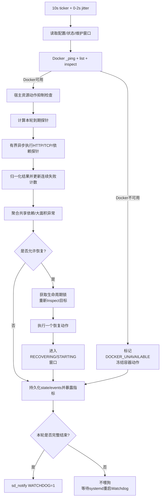

# 0026 Docker Compose Watchdog 开发设计

> 版本：v1.0
> 日期：2026-08-25
> 状态：设计中
> 适用部署：Linux + systemd + Docker Compose
> 不适用范围：Kubernetes（当前生产环境未使用）

---

## Watchdog 简介

本期 Watchdog 是一个运行在宿主机上的守护程序，专门服务于当前 OMC 的 Docker Compose 部署。它不是 Kubernetes，也不是 Prometheus 的替代品；它要补的是“容器还在、进程还在，但业务已经不可用”这类故障的自动发现和有限自愈。

简单说，它主要做四件事：

1. 看 Docker 本身和核心容器是否正常运行，包括 Docker daemon 是否可访问、容器是否退出、是否 OOM、是否反复重启、Docker health 是否异常；
2. 看主要业务进程是否真的可用，包括 `web` 入口、`app`、`acs`、`acs-candidate`、`worker` 的 `/healthz`、`/readyz`、TCP/HTTP 入口，以及后续新增的 `/watchdogz`；
3. 看基础依赖服务是否真的可用，包括 PostgreSQL、Redis、NATS、MinIO 等，必要时通过“创建测试数据、查询、删除”的方式验证读写链路；
4. 看 Watchdog 自己是否还活着，Watchdog 由宿主机 systemd 托管，主循环卡死或进程退出时由 systemd 自动拉起。

Watchdog 发现异常后不会立刻重启。它会按配置的周期持续检测，只有连续失败达到门限后才进入异常判断；同时会先判断是不是多个服务共同依赖出了问题。如果基础依赖本身异常，优先恢复基础依赖；如果基础依赖正常，但业务进程仍然报依赖错误，才认为可能是业务进程连接池、连接状态、内部循环或运行时状态异常，尝试重启对应业务容器。

恢复动作也会受限制：重启期间有启动宽限期，这段时间的失败不累计；恢复后有冷却期，避免刚拉起又被重复重启；短时间内多次恢复仍失败会进入退避或隔离，只告警不继续自动重启，防止重启风暴。

`/healthz`、`/readyz`、`/watchdogz` 的定位如下：`/healthz` 看进程是否活着，`/readyz` 看外部依赖是否可用，`/watchdogz` 是本设计建议新增的内部运行时探针，用来看关键 goroutine、消费者、定时任务、监听器等是否还在正常工作。第一阶段如果服务还没有实现 `/watchdogz`，配置中默认关闭该探针，不会因为接口不存在而误判故障。

需要特别说明的是，Watchdog 不负责治理宿主机资源问题。CPU、内存、磁盘、inode、I/O PSI 等只作为自动恢复前的安全门禁：如果宿主机已经处于明显资源风险，Watchdog 会抑制重启并上报告警，而不是清理磁盘、扩容、杀宿主机进程或修复系统。Prometheus 继续负责指标采集、趋势分析和告警展示；Watchdog 只负责本机、低延迟、有限度的自动恢复闭环。

## 1. 背景

OMC 当前生产交付采用 Linux 宿主机上的 Docker Compose，本期 Watchdog 重点监管四类对象：

- Docker 服务：`docker.service`、`containerd.service` 和 Docker Engine API；
- 主要业务进程：`web`、`app`、`acs`、`acs-candidate`、`worker`；
- 基础依赖服务：`postgres`、`postgres-tsdb`、`redis-core`、`redis-pm`、`nats`、`minio`；
- Watchdog 自身：`omc-watchdog.service` 主循环和 systemd 自愈。

主要业务进程说明：

- `app`：管理面 REST API、gRPC 和部分后台组件；
- `acs`：正式 ACS 实例，承载 TR-069 南向流量；
- `acs-candidate`：发布接力实例，不承载正式 Nginx upstream 流量；
- `worker`：PM/MR、KPI、告警和异步任务消费者；
- `web`：前端静态资源、Nginx入口、管理面反向代理和ACS入口代理。

基础依赖服务包括：

- `postgres`、`postgres-tsdb`；
- `redis-core`、`redis-pm`；
- `nats`、`minio`。

Prometheus、Alertmanager、Grafana、Loki、Tempo、OpenTelemetry Collector、exporters 等组件仍可由现有 Compose restart policy 和监控告警覆盖，但不作为本期 Watchdog 自动恢复目标。

现有 Compose 已为主要常驻容器配置 `restart: unless-stopped`。该策略能够在容器主进程退出、崩溃或 OOMKilled 后由 Docker 重新拉起容器，但不能处理以下故障：

1. 进程仍存在，但 HTTP server、消费者或关键 goroutine 已经卡死；
2. 容器处于 `unhealthy`，但 Docker Compose 不会因为健康检查失败自动重启；
3. 多个业务进程因同一个基础设施故障同时报错，缺少根因聚合和有序恢复；
4. Docker daemon 卡死但没有退出；
5. Watchdog 自身退出或主循环卡死。

因此需要新增宿主机级 `omc-watchdog`，补齐“进程未退出但服务已经失效”和“共享依赖故障有序恢复”两类能力，同时避免简单轮询脚本造成整栈重启风暴。

---

## 2. 设计目标与非目标

### 2.1 设计目标

1. 发现业务进程退出、OOM、崩溃循环、HTTP失活和内部关键循环失活；
2. 区分进程故障、外部依赖故障、宿主资源风险和 Docker daemon 故障，其中宿主资源只用于恢复动作门禁；
3. 对明确、可恢复的故障执行有限、错峰、可审计的自动恢复；
4. 多个业务进程同时异常时聚合共同依赖，优先恢复根因服务；
5. 有状态基础服务采用比无状态服务更保守的恢复策略；
6. Watchdog 自身由 systemd 监管，主循环卡死时可被重新拉起；
7. 与现有 `install.sh`、`svc.sh`、升级、迁移和 GPV handoff 流程协同；
8. 向 Prometheus 暴露状态和恢复结果，但不把 Prometheus 作为自动恢复的唯一控制面。

### 2.2 非目标

1. 不设计 Kubernetes controller、operator 或 probe；
2. 不以重启替代容量治理、磁盘清理、数据库调优和根因修复；
3. 不在第一阶段自动执行数据库主从切换、数据修复或卷迁移；
4. 不因单个日志关键字、单次超时或单个业务指标越线立即重启；
5. 不实现“每隔固定时间重启全栈”的计划任务；
6. 不把 `acs-candidate` 视为已经自动接管正式 ACS 流量的 HA 实例；
7. 不处理宿主机断电、内核不可用、systemd整体不可用等超出本机用户态Watchdog能力范围的故障；
8. 不治理宿主 CPU、内存、磁盘、inode、I/O PSI 等服务器资源问题；这些信号只作为自动恢复前的安全门禁和告警输入；
9. 不对 Prometheus、Alertmanager、Grafana、Loki、Tempo、OpenTelemetry Collector、exporters 等非核心组件做自动恢复。

---

## 3. 现状能力与缺口

### 3.1 Docker 已有的恢复能力

`web`、`app`、`acs`、`acs-candidate`、`worker` 和基础依赖容器普遍采用 `restart: unless-stopped`。

它能够处理：

| 故障 | Docker 能否发现 | Docker 能否恢复 | 说明 |
|---|---:|---:|---|
| 容器主进程正常退出 | 是 | 是 | 非人工停止时重新启动 |
| 容器主进程崩溃 | 是 | 是 | 按 Docker restart policy 拉起 |
| OOMKilled 导致退出 | 是 | 是 | 可从 `State.OOMKilled` 和退出码识别 |
| Docker daemon 重启 | 是 | 是 | `unless-stopped` 容器恢复启动 |
| 进程存在但死锁 | 否 | 否 | PID 仍在，Docker认为容器运行中 |
| Docker health 为 unhealthy | 是 | 否 | Docker记录健康状态，但 Compose不自动重启 |
| 某个 worker 消费者退出 | 否 | 否 | 容器主进程和 metrics server 可能仍正常 |
| 外部依赖不可用 | 否 | 否 | 需要应用探针或直接依赖探测 |

Docker对连续崩溃会做启动退避，但 `unless-stopped` 没有业务级的最大重启次数和人工隔离状态。因此 Watchdog还需要观察 `RestartCount`，识别 crash loop 并升级告警，但不能和 Docker同时重复发起重启。

### 3.2 systemd 已有的恢复能力

交付脚本已把 `containerd` 和 `docker.service` 配置为 `Restart=always`。它们在进程退出时会被 systemd 拉起。

现有 Go 业务进程也已实现 `sd_notify`：

- `READY=1`；
- `WATCHDOG=1`；
- `STOPPING=1`。

但是业务进程当前运行在 Docker 容器中，不由宿主 systemd直接托管，也没有把 `NOTIFY_SOCKET` 和 `WATCHDOG_USEC` 注入容器，因此该逻辑在当前生产部署中是 no-op。它不能替代新的宿主机 Watchdog。

### 3.3 Prometheus 已有的能力

Prometheus当前每15秒抓取一次 `app`、`acs`、`acs-candidate`、`worker` 的 `/metrics`，并已有：

- `up == 0` 的进程不可达告警；
- crash loop 告警；
- goroutine、FD、内存、队列积压、PM处理进度等业务告警。

这些能力继续保留，用于趋势、告警、审计和业务退化观察；Watchdog不重复实现一套时序数据库。

---

## 4. 总体架构

```text
          Linux kernel / systemd
            │                 │
            │                 ├── containerd.service
            │                 └── docker.service
            │
            └── omc-watchdog.service
                      │
                      ├── Docker Engine API（Unix socket）
                      ├── /healthz、/readyz、/watchdogz（Phase 2新增）
                      ├── TCP/HTTP 业务入口探测
                      ├── 宿主资源安全门禁（CPU/内存/磁盘/inode/I/O PSI）
                      ├── 基础服务直接探测
                      ├── 生命周期锁与维护状态
                      └── 恢复执行器
                              │
                              ├── 单容器优雅重启
                              ├── 基础服务有限恢复
                              ├── Docker daemon 可选恢复
                              └── 熔断、隔离、人工接管

       Prometheus  <── watchdog /metrics + 全部业务指标
            │
            └── Alertmanager ──> 邮件 / 企业告警通道
```

### 4.1 部署位置

生产主 Watchdog 建议作为宿主机二进制运行，由 systemd托管，不放入当前 OMC Docker Compose：

```text
/opt/omc/current/bin/omc-watchdog
/etc/omc/watchdog.yaml
/etc/systemd/system/omc-watchdog.service
/opt/omc/run/watchdog/state.json
/opt/omc/run/watchdog/events.jsonl
```

核心原因是：Watchdog要监管 Docker和容器内业务，如果它本身也作为同一个Docker/Compose栈里的普通容器运行，就会和被监管对象落在同一个故障域里。

主要考虑点：

1. Docker daemon 或容器网络故障时，容器内 Watchdog无法可靠工作；
2. 宿主进程可以访问 Docker Unix socket、systemd，并读取必要宿主资源信号作为恢复动作门禁；
3. systemd能够监管 Watchdog自身。

更具体地说，容器化主 Watchdog存在以下问题：

| 风险 | 说明 |
|---|---|
| Docker故障域重合 | Docker daemon卡死、socket不可用或容器网络异常时，容器内Watchdog也会失去控制面 |
| Compose生命周期耦合 | 发布、升级或 `docker compose down/up` 可能把Watchdog一起停掉，正好失去监管 |
| 无法可靠恢复Docker自身 | 容器依赖Docker daemon存活，不能在Docker不可用时检查 `docker.service` 或执行受控恢复 |
| systemd喂狗不完整 | 容器内进程难以作为宿主 systemd `Type=notify` 服务被可靠监管 |
| 宿主资源门禁不完整 | 磁盘、inode、I/O PSI、只读挂载、systemd状态和宿主journal需要宿主视角；这些信号只用于抑制误重启，不用于自动治理宿主机 |
| 权限并未更安全 | 挂载 `/var/run/docker.sock` 后，容器基本具备宿主root级Docker控制能力，隔离收益有限 |
| 状态持久化易丢 | 如果随Compose重建，冷却期、重启预算、隔离状态容易被误清空 |

因此推荐分层：

| 层级 | 运行位置 | 职责 |
|---|---|---|
| `omc-watchdog` 主进程 | 宿主机 systemd | Docker控制面、宿主资源安全门禁、恢复动作、预算和隔离 |
| Prometheus/Alertmanager | Docker Compose | 指标采集、趋势、告警通知 |
| 应用内部 `/healthz`、`/readyz`、`/watchdogz` | 业务容器内 | `/healthz`和`/readyz`当前已有；`/watchdogz`为Phase 2新增内部组件状态 |
| `web` Nginx入口 | 业务容器内 | 暴露前端静态资源、管理面入口和ACS入口代理 |

如果某些环境没有 systemd，或为了开发测试需要容器化Watchdog，可以做“降级模式”，但不作为生产主方案：

1. 不放在被它监管的同一个 Compose project中；
2. 必须挂载 Docker socket、状态目录和只读配置目录；
3. 必须使用独立持久化状态目录，不能随容器删除而丢失；
4. 必须明确不负责Docker daemon和宿主systemd恢复；
5. 必须接受Docker故障时Watchdog也可能失效；
6. 只能用于开发、测试、无systemd环境或辅助观测，不作为最终兜底自愈控制面。

### 4.2 服务发现

Watchdog通过 Docker Compose labels发现服务，不依赖容易变化的容器名：

```text
com.docker.compose.project=omcgo
com.docker.compose.service=<service>
```

支持的服务名至少包括：

```text
web, app, acs, acs-candidate, worker,
postgres, postgres-tsdb, redis-core, redis-pm, nats, minio
```

一次性任务如 `migrate-schema`、`migrate-seed-sql`、`gpv-handoff` 不纳入常驻服务自动拉起。监控栈和exporter默认不纳入Watchdog自动恢复目标。

---

## 5. 探针的能力边界

“探针成功”只证明该探针对应层级正常，不能向上推导整个业务正常。Watchdog在任何自动恢复决策前，必须明确每个信号能证明什么、不能证明什么。

### 5.1 `/healthz`：进程级存活探针

#### 5.1.1 当前实现

`app`、`acs`、`worker` 的 metrics server注册统一 `/healthz`。当前处理器不访问数据库、Redis、NATS或MinIO，进程能调度到该 HTTP handler 时恒定返回：

```http
HTTP/1.1 200 OK
Content-Type: application/json

{"status":"ok"}
```

宿主已映射：

| 服务 | 容器端口 | 宿主地址 |
|---|---:|---|
| app | 9091 | `127.0.0.1:9091/healthz` |
| acs | 9090 | `127.0.0.1:9095/healthz` |
| worker | 9092 | `127.0.0.1:9092/healthz` |
| acs-candidate | 9090 | 未发布宿主端口，由 Watchdog通过 Docker网络IP访问 |

当前业务Compose尚未为 `app`、`acs`、`worker` 声明容器级 `healthcheck`。Phase 1应补齐；运行镜像基于Alpine，可使用镜像内BusyBox `wget`：

```yaml
healthcheck:
  test: ["CMD", "wget", "--spider", "-q", "http://127.0.0.1:<metrics-port>/healthz"]
  interval: 10s
  timeout: 3s
  retries: 3
  start_period: 30s
```

`app`、`acs`、`worker` 分别替换为9091、9090、9092。该healthcheck只把状态写入Docker，Compose不会因为 `unhealthy` 自动重启；实际动作仍由Watchdog状态机决定。

`web` 也应补充容器级 `healthcheck`，但它是Nginx入口，不使用Go进程的 `/healthz` 语义。建议容器内检查 `stub_status`：

```yaml
healthcheck:
  test: ["CMD", "wget", "-q", "-O", "-", "http://127.0.0.1:8090/stub_status"]
  interval: 10s
  timeout: 3s
  retries: 3
  start_period: 30s
```

#### 5.1.2 `/healthz=200` 能证明什么

1. 目标容器网络命名空间仍存在；
2. metrics监听端口已经建立；
3. Go runtime仍能调度至少一个 HTTP handler；
4. 从 Watchdog到目标端口的该条网络路径可达；
5. 进程没有完全退出或完全冻结。

#### 5.1.3 `/healthz=200` 不能证明什么

1. 不能证明 app主业务HTTP端口可以处理请求；
2. 不能证明 ACS仍能接受、认证和处理 TR-069会话；
3. 不能证明 worker的PM/MR/NATS消费者仍在运行；
4. 不能证明 PostgreSQL、Redis、NATS、MinIO正常；
5. 不能证明没有 goroutine泄漏、连接池耗尽或严重业务积压；
6. 不能证明启动期长耗时初始化已经完成；
7. 不能证明业务结果正确。

这是因为 metrics server会在部分重型初始化之前提前启动，目的是避免启动期间完全不可观测。因此“`/healthz=200`”最多解释为“进程级存活通道仍可调度”，不能解释成“业务完全健康”。

#### 5.1.4 `/healthz` 失败门限和动作

默认每10秒探测一次，HTTP总超时2秒：

| 连续结果 | 状态 | 上报 | 自动动作 |
|---|---|---|---|
| 1次失败 | `SUSPECT` | 指标累加，不发告警 | 无 |
| 2次失败 | `SUSPECT` | journald `warning` | 立即补充Docker状态、TCP和宿主资源门禁检查 |
| 3次失败（约30秒） | `PROCESS_UNHEALTHY` | `OMCWatchdogProcessUnhealthy` warning事件 | 满足安全条件时恢复该单个容器 |
| 持续2分钟 | `PROCESS_FAILED` | Prometheus critical告警 | 若仍在预算内继续有界恢复，否则隔离 |
| 超出重启预算 | `QUARANTINED` | `OMCWatchdogTargetQuarantined` critical | 停止自动重启，等待人工处理 |

一次连接失败、HTTP 500或2秒超时统一记为探测失败，但事件中必须保留分类：

```text
connection_refused | timeout | dns_error | http_5xx | invalid_body | network_unreachable
```

如果多个无共同进程关系的 `/healthz` 同时超时，Watchdog不得并发重启多个容器，应先判断宿主CPU、I/O、Docker网络和 Docker daemon。

### 5.2 `/readyz`：外部依赖就绪探针

#### 5.2.1 当前实现

`/readyz` 并发执行进程已注册的基础设施检查器，整体超时默认5秒：

- 全部依赖正常：HTTP 200；
- 任一依赖失败：HTTP 503；
- 响应体包含依赖名、状态、延迟和错误。

实现通过5秒 `context.Context` 通知各checker取消；如果某个checker错误地忽略context并永久阻塞，服务端handler本身无法强行终止该goroutine。Watchdog因此还要使用6秒客户端硬超时，把“服务端未能按契约返回”记录为 `readyz_timeout`，并将其作为探针实现异常上报。

示例：

```json
{
  "status": "unhealthy",
  "components": [
    {"name": "postgres", "status": "healthy", "latency": "1.8ms"},
    {"name": "redis", "status": "unhealthy", "latency": "2.001s", "error": "context deadline exceeded"}
  ]
}
```

#### 5.2.2 `/readyz=200` 能证明什么

1. 当前已注册的依赖检查器全部成功；
2. 本进程到这些依赖的连接路径在探测时刻可用；
3. 对应依赖至少能完成轻量 Ping或健康调用；
4. 当前进程具备开始接受正常业务的基础条件。

#### 5.2.3 `/readyz=200` 不能证明什么

1. 不能证明数据库复杂查询性能正常；
2. 不能证明 Redis/NATS/MinIO没有容量、积压或持久化风险；
3. 不能证明所有业务消费者已注册成功；
4. 不能证明业务入口、权限、协议交互和最终结果正常；
5. 不能证明未注册到 checker的可选组件正常；
6. 不能证明未来几秒内依赖不会抖动。

#### 5.2.4 `/readyz=503` 能证明什么

它只能证明“当前进程执行某个依赖检查失败”。它不能单独证明：

- 根因服务进程已经死亡；
- 应该重启当前业务进程；
- 应该重启根因基础服务；
- 故障一定在服务端而不是网络、DNS、宿主负载或客户端连接池。

因此 `/readyz=503` 永远不是直接重启业务容器的充分条件。

#### 5.2.5 `/readyz` 失败门限和动作

默认每15秒探测一次，总超时6秒，略大于服务端5秒封口：

| 连续结果 | 状态 | 上报 | 自动动作 |
|---|---|---|---|
| 1次503/超时 | `DEPENDENCY_SUSPECT` | 指标记录依赖名 | 无 |
| 连续3次（约45秒） | `DEPENDENCY_DEGRADED` | `OMCWatchdogDependencyDegraded` warning | 直接探测失败依赖，不立即重启业务容器 |
| 持续2分钟 | `DEPENDENCY_FAILED` | 对 app/acs 影响发 critical，对 worker影响发 warning或critical | 进入共享依赖或客户端依赖路径分析 |
| 多个业务进程同时指向同一依赖 | `SHARED_INCIDENT` | 聚合为一条依赖事件 | 只考虑恢复根因服务，不逐个重启业务容器 |

基础服务确认异常并被恢复后，业务进程先获得60～180秒自动重连窗口。若基础服务本体健康但业务 `/readyz` 仍失败，按下一节客户端依赖路径异常处理。

#### 5.2.6 基础服务正常但业务进程仍报依赖异常

如果业务进程 `/readyz` 持续报告 Redis、PostgreSQL、NATS或MinIO异常，但基础服务直接探测和合成读写探针均正常，说明故障更可能在业务进程自己的依赖访问路径上，例如：

1. 进程内连接池耗尽、连接池进入坏状态或长时间未刷新；
2. DNS缓存、连接复用、TLS或认证状态异常；
3. 容器网络局部异常，影响单个业务容器到依赖的路径；
4. 业务进程内依赖checker、客户端SDK或相关goroutine卡死；
5. 发布后配置只在某个业务进程内异常，但基础服务本身正常。

此时不能重启基础服务，应进入 `CLIENT_DEPENDENCY_PATH_FAILED` 判断流程：

```text
1. 业务 /readyz 连续3次失败，提取失败依赖名
2. Watchdog直接探测该基础服务
3. 执行合成读写探针
4. 若基础服务连续2次直接探测成功，判定基础服务本体健康
5. 给业务进程一个自动重连窗口，默认120秒
6. 自动重连窗口内 /readyz 恢复：只记录resolved，不重启
7. 自动重连窗口结束后 /readyz 仍失败：恢复受影响业务进程
8. 重启后进入对应启动宽限、验证窗口、冷却和预算流程
```

如果只有一个业务进程受影响，可以恢复该进程；如果多个业务进程都报同一依赖异常，但基础服务本体健康，应先检查Docker网络、DNS和共享配置，不得同时重启多个业务进程。确认不是Docker网络或宿主资源问题后，再按 `acs → worker → app` 的顺序逐个恢复，每次恢复后等待60～180秒观察其他进程是否自行恢复。

这个场景下的恢复目标是“刷新业务进程内的依赖客户端状态”，不是修复基础服务。因此恢复成功条件以该业务进程 `/readyz` 恢复为主，同时要求 `/healthz`、主入口以及已启用的 `/watchdogz` 正常。

### 5.3 `/watchdogz`：拟新增的进程内部有效性探针

当前代码已经有 `/healthz` 和 `/readyz`，尚未实现 `/watchdogz`。`/watchdogz` 是本设计建议新增的进程内部有效性探针，用于覆盖“HTTP活着但业务内部关键循环已失活”的场景。

它不是替代 `/healthz` 或 `/readyz`：

- `/healthz`：证明进程和metrics HTTP server还活着；
- `/readyz`：证明进程到外部依赖的就绪状态；
- `/watchdogz`：证明进程内部关键循环、消费者、调度器仍在持续运行。

`/watchdogz` 仍放在 metrics端口，并且不得依赖外部基础设施。第一阶段如果暂不实现该接口，Watchdog配置必须将对应 `watchdog_enabled=false`，探测结果记为 `skipped(not_implemented)`，不能因为接口不存在触发重启。Phase 2 增加内部组件心跳后，再启用该探针。

#### 5.3.1 注册模型和通用判定口径

每个进程向内部 `RuntimeHealthRegistry` 注册关键组件：

```go
type RuntimeComponent interface {
    Name() string
    Required() bool
    State() ComponentState
    LastHeartbeat() time.Time
    LastError() error
}
```

`/watchdogz` 不主动访问 PostgreSQL、Redis、NATS、MinIO，不制造业务请求，也不以“最近有没有业务消息”作为健康标准。它只读取进程内组件自己上报的状态和心跳。

每个组件至少暴露以下字段：

| 字段 | 含义 |
|---|---|
| `name` | 组件稳定名称，例如 `pm-collector`、`acs-http-listener` |
| `enabled` | 当前配置下该组件是否启用；未启用组件不参与判定 |
| `required` | 是否主链路必选；必选组件异常会使 `/watchdogz` 返回503 |
| `status` | `starting`、`healthy`、`degraded`、`waiting_dependency`、`stale`、`failed`、`exited`、`stopping` |
| `last_heartbeat` | 最近一次控制循环心跳时间 |
| `stale_after` | 多久没有心跳判定为stale |
| `last_error_class` | 错误分类，只记录类型，不记录敏感内容 |
| `restart_hint` | `none`、`wait_dependency`、`restart_process`、`manual_check` |

状态判定：

| 状态 | HTTP影响 | 判断依据 |
|---|---:|---|
| `starting` | 200 | 组件处于允许启动窗口，不计异常 |
| `healthy` | 200 | 组件控制循环正常上报心跳 |
| `degraded` | 200 | 可选组件异常或能力降级，但主链路仍可运行 |
| `waiting_dependency` | 200 | 组件循环还活着，正在等待外部依赖恢复；根因交给 `/readyz` 和基础服务探针判断 |
| `stale` | 必选组件503，可选组件200 | 超过 `stale_after` 未上报心跳 |
| `failed` | 必选组件503，可选组件200 | 组件捕获到不可自恢复错误或panic |
| `exited` | 必选组件503，可选组件200 | 组件goroutine/runner非预期退出 |
| `stopping` | 503，但Watchdog按 `expected_failure` 处理 | 进程正在优雅退出，不触发新重启 |

组件心跳代表“控制循环仍完成一次周期”，不能简单使用“最后一条业务消息时间”。无业务流量时也必须能健康。

下列表格给出默认profile建议。实际 `enabled`、`required`、`stale_after` 和是否触发自动恢复仍应支持配置覆盖，并随Watchdog配置热加载生效。

#### 5.3.2 `app` 的 `/watchdogz` 检查项

`app` 是管理面REST API和主要控制面入口。它的 `/watchdogz` 重点证明“主HTTP入口和关键后台控制循环还在运行”，外部依赖仍由 `/readyz` 判断。

| 组件 | 默认级别 | 心跳/状态来源 | 默认失效门限 | 故障判断依据 | 故障后处理 |
|---|---|---|---:|---|---|
| `app-main-http-listener` | 必选 | 主HTTP server启动成功、未收到非预期退出错误；外部TCP探针复核 `127.0.0.1:18081` 或容器 `:8081` | 30s或立即failed | listener goroutine退出、端口连续失败、启动后未进入serving | `/watchdogz` 连续失败且TCP复核失败时恢复 `app` |
| `device-status-reconciler` | 必选 | 设备在线/离线状态后台扫描循环每轮心跳 | 120s | goroutine退出、panic、连续超过2个扫描周期未心跳 | 依赖健康时恢复 `app`；依赖失败时归入依赖事件 |
| `alarm-reconciler` | 必选 | 告警状态reconcile循环心跳 | 120s | reconcile循环停止、panic或长期不调度 | 依赖健康时恢复 `app` |
| `alarm-sync-processor` | 必选 | 告警同步事件处理器启动成功，处理循环或空闲tick心跳 | 90s | 订阅处理器退出、panic、长期无空闲心跳 | 优先确认NATS/Redis；依赖健康时恢复 `app` |
| `topology-device-sync` | 条件必选 | 拓扑设备同步服务循环心跳；仅 `topology.device_sync.enabled=true` 时启用 | `max(2×周期, 5m)` | 同步循环退出或超过门限未调度 | 若配置为必选则恢复 `app`，否则只degraded |
| `mml-scheduler` | 条件必选 | MML定时任务scheduler tick心跳 | 90s | scheduler退出、panic、tick停滞 | 依赖健康时恢复 `app` |
| `online-index-pruner` | 可选 | 在线索引裁剪循环心跳 | 120s | pruner退出或长期未执行 | 只上报degraded，默认不重启 |
| `log-rotation-watcher` | 可选 | 日志轮转配置watcher心跳 | 120s | watcher退出或配置刷新循环停滞 | 只上报degraded |

判断依据：

- 如果 `app-main-http-listener` 失败，同时 `/healthz=200`，说明metrics server活着但主入口失活，可以恢复 `app`；
- 如果后台组件显示 `waiting_dependency`，且 `/readyz` 或基础服务探针也失败，不按 `/watchdogz` 重启 `app`；
- 可选组件异常只让 `/watchdogz.status=degraded`，不触发自动恢复。

#### 5.3.3 `acs` / `acs-candidate` 的 `/watchdogz` 检查项

`acs` 和 `acs-candidate` 使用同一套组件定义。区别是正式 `acs` 有宿主端口 `7557`，`acs-candidate` 主要通过容器网络IP探测。

| 组件 | 默认级别 | 心跳/状态来源 | 默认失效门限 | 故障判断依据 | 故障后处理 |
|---|---|---|---:|---|---|
| `acs-http-listener` | 必选 | ACS CWMP HTTP server启动成功、未非预期退出；TCP复核 `:7557` | 30s或立即failed | listener退出、端口连续不可连、启动后未进入serving | 触发对应ACS实例恢复；primary/candidate互斥 |
| `session-reaper` | 必选 | 会话清理/超时管理循环心跳 | 90s | session清理循环退出、panic、心跳过期 | 依赖健康时恢复该ACS实例 |
| `stun-udp-server` | 条件必选 | STUN UDP server serve循环心跳；仅 `stun.enabled=true` 时启用 | 60s或立即failed | UDP server启动失败、serve循环退出 | 若启用STUN则恢复ACS；未启用则skipped |
| `upload-handler` | 条件必选 | 上传handler装配成功，内部panic计数和请求处理保护状态 | 60s | handler未装配、内部保护器进入failed、panic不可恢复 | 依赖健康时恢复ACS |
| `backpressure-watchdog` | 条件必选 | PM上传背压watchdog采样循环心跳 | 90s | 采样循环退出或长期不刷新阈值 | 恢复ACS；若只是MinIO/TSDB不可用则归入依赖事件 |
| `pm-queue-health-sampler` | 可选 | PM队列健康采样循环心跳 | 90s | 采样循环退出或心跳过期 | 只上报degraded；不单独重启 |
| `trace-capture-hook` | 条件可选 | TR069 trace service和白名单缓存循环心跳；仅trace启用时检查 | 120s | trace服务退出、白名单缓存停止且无poll fallback | 默认degraded；按配置可设为必选 |
| `log-rotation-watcher` | 可选 | ACS日志轮转配置watcher心跳 | 120s | watcher退出或配置刷新循环停滞 | 只上报degraded |

判断依据：

- `acs-http-listener` 失败是主链路失效，连续达到门限后可恢复对应ACS容器；
- `stun-udp-server` 只有在STUN配置启用时才参与判定；
- 上传、背压、trace组件遇到 MinIO/TSDB/NATS 不可用时，应上报 `waiting_dependency`，由 `/readyz` 和依赖探针决定根因，不直接重启ACS；
- primary和candidate同时 `/watchdogz` 异常时，先查共享依赖和宿主/Docker状态，不并发恢复两个实例。

#### 5.3.4 `worker` 的 `/watchdogz` 检查项

`worker` 没有主业务HTTP入口，主要价值来自内部消费者和调度器。因此 `worker /watchdogz` 是最重要的内部有效性探针。

| 组件 | 默认级别 | 心跳/状态来源 | 默认失效门限 | 故障判断依据 | 故障后处理 |
|---|---|---|---:|---|---|
| `pm-collector` | 必选 | PM文件NATS订阅成功；处理回调或空闲监控tick心跳 | 90s | 订阅未建立、consumer退出、panic、心跳过期 | 依赖健康且连续失败达到门限后恢复 `worker` |
| `mr-collector` | 必选 | MR文件NATS订阅成功；处理回调或空闲监控tick心跳 | 90s | 订阅未建立、consumer退出、panic、心跳过期 | 依赖健康时恢复 `worker` |
| `event-outbox-relay` | 必选 | 通用事件outbox relay循环心跳 | 60s | relay goroutine退出、panic或长期未轮询 | 依赖健康时恢复 `worker` |
| `device-access-workers` | 条件必选 | reevaluation、policy、GPS probe、outbox dispatcher循环心跳 | 90s | 任一必选consumer退出，或dispatch/recovery/deadline tick长期不执行 | 依赖健康时恢复 `worker` |
| `pm-aggregation-pipeline` | 条件必选 | PM聚合runner、hourly触发器、stream consumer控制循环心跳；仅聚合启用时检查 | 120s | runner退出、cron调度器停止、stream consumer停滞 | 依赖健康时恢复；长窗口任务不能按任务完成时间判死 |
| `backup-scheduler-reaper` | 条件必选 | 周期备份scheduler和task reaper循环心跳 | 120s | scheduler/reaper退出或长期未tick | 按配置决定恢复或degraded |
| `trace-capture-consumer` | 条件可选 | trace capture订阅、sweeper、exporter心跳；仅trace启用时检查 | 120s | capture consumer退出、sweeper长期不运行 | 默认degraded；按配置可设为必选 |
| `retention-cleanup-crons` | 可选 | PM retention、日志清理、字典同步、回收站等cron注册和最近tick | `max(2×周期, 24h)` | cron未注册或超过周期未触发 | 只上报degraded，默认不重启 |
| `tsdb-shadow-dim-sync` | 条件可选 | 主库维度同步到TSDB的周期循环心跳 | 180s | sync runner退出或长期未tick | 默认degraded；若配置为必选则恢复 |
| `pending-queue-restore` | 启动期组件 | 启动期pending任务队列恢复完成/失败状态 | 启动宽限内 | 启动恢复失败只记录错误，不代表主循环失活 | 只告警，不触发重启 |

判断依据：

- PM/MR collector没有业务消息时也必须通过空闲tick更新心跳，不能因为“没文件上传”误判stale；
- NATS断开但consumer retry循环仍在运行时，状态应为 `waiting_dependency`，由 `/readyz` 和NATS直接探针判断根因；
- PM聚合、retention、backup这类长周期任务必须以调度循环心跳判定，不能以“某个小时桶是否完成”作为 `/watchdogz` 失败依据；
- 多个worker内部组件同时 `waiting_dependency`，且 `/readyz` 指向同一依赖时，不重启worker，先处理共享依赖。

#### 5.3.5 故障后的判断矩阵

| `/watchdogz` 结果 | `/readyz` / 依赖探针 | 判断 | Watchdog动作 |
|---|---|---|---|
| 必选组件 `stale/failed/exited` | 依赖健康 | 进程内部关键循环失活 | 连续达到门限后恢复该业务容器 |
| 必选组件 `waiting_dependency` | 对应依赖失败 | 外部依赖故障，不是内部循环死亡 | 进入共享依赖/基础服务分析，不重启业务 |
| 可选组件 `degraded/stale` | 依赖健康 | 非主链路降级 | 上报warning，不自动重启 |
| `/watchdogz` 404 | 配置 `watchdog_enabled=false` | 探针未实现或未启用 | 记为 `skipped(not_implemented)` |
| `/watchdogz` 404 | 配置 `watchdog_enabled=true` | 配置与版本不匹配 | 记为配置/版本错误，默认不立即重启，要求人工修正配置 |
| `/watchdogz` 超时 | `/healthz` 也失败 | metrics端口或进程整体异常 | 按 `/healthz` 进程故障路径处理 |
| `/watchdogz` 503 | 宿主资源critical | 宿主状态不适合恢复 | 冻结恢复，只上报 |
| `/watchdogz` 503 | 正在STARTING/STOPPING/RECOVERING | 预期窗口内失败 | 记为 `expected_failure`，不累加异常 |

#### 5.3.6 响应语义

```json
{
  "status": "unhealthy",
  "phase": "running",
  "components": [
    {
      "name": "pm-consumer",
      "enabled": true,
      "required": true,
      "status": "stale",
      "last_heartbeat": "2026-08-25T10:10:00+08:00",
      "stale_for": "95s",
      "stale_after": "90s",
      "last_error_class": "control_loop_stale",
      "restart_hint": "restart_process"
    }
  ]
}
```

状态定义：

| 状态 | 含义 | HTTP |
|---|---|---:|
| `starting` | 组件尚处于允许的启动窗口 | 200 |
| `healthy` | 必选组件均运行且心跳未过期 | 200 |
| `degraded` | 可选组件异常，主链路仍可用 | 200 |
| `unhealthy` | 必选组件退出、panic或心跳过期 | 503 |
| `stopping` | 正在优雅停止 | 503，但Watchdog不得重启 |

默认内部心跳每10秒更新，连续6个周期未更新（60秒）才判定 stale。不同组件可配置覆盖值，长周期任务必须以控制循环心跳而非任务完成时间判定。

#### 5.3.7 自动恢复条件

`/watchdogz=503` 连续3次、进程不处于启动/停止/维护状态、宿主资源不过载、共享依赖没有同时故障时，可以恢复该业务容器。若配置中 `watchdog_enabled=false`，该探针不参与异常计数和恢复判定。

### 5.4 主业务入口和TCP探针

Watchdog还应直接验证“真正承载业务的 listener是否存在”，避免独立 metrics server掩盖主端口故障：

| 服务 | 探测 |
|---|---|
| web | 宿主 `127.0.0.1:8081/` HTTP GET；容器内 `:8090/stub_status`；可选静态资源探测 |
| app | 宿主 `127.0.0.1:18081` 或容器网络IP `:8081` TCP connect；新增无依赖内部入口探针后再做HTTP验证 |
| acs | 宿主或容器网络 `:7557` TCP connect；只验证accept能力，不发真实Inform |
| worker | 无主业务端口；第一阶段以 `/healthz`、Docker状态和消费进度辅助判断，Phase 2 以 `/watchdogz` 内部组件心跳为主 |

TCP成功只证明端口在监听，不能证明协议处理正确；TCP失败加 `/healthz` 成功，说明主listener与metrics server状态不一致，是业务进程恢复的重要证据。

`web` 是系统访问入口，虽然不是Go进程，也没有 `/readyz` 和 `/watchdogz`，但应纳入主要业务进程恢复范围。推荐探测顺序：

1. Docker状态和容器ID；
2. 宿主 `127.0.0.1:8081/` HTTP GET，验证前端入口可访问；
3. 宿主 `127.0.0.1:8080` TCP connect，验证ACS入口server block仍在监听；
4. 容器网络IP `:8090/stub_status`，验证Nginx worker和stub状态页；
5. 可选静态资源探测，例如 `index.html` 或构建产物manifest，避免只返回默认错误页也被误判成功。

如果 `web` 返回 502/504，但 `app` 或 `acs` 自身探针也失败，根因优先归类到后端业务进程，不应先重启 `web`。只有 `web` 容器非running、Nginx入口自身不可达、stub_status失败或配置加载异常时，才恢复 `web` 容器。

不建议 Watchdog周期性制造真实设备任务、写业务表或上传文件。带副作用的端到端检查由独立E2E/巡检执行，不能作为高频自动重启触发器。基础服务合成读写探针只允许使用专用key或专用表，见下一节。

### 5.5 业务进度和容量指标

以下信号作为“退化、容量或内部停滞”的辅助证据：

- Prometheus `up`；
- goroutine数量、FD使用率、Go heap/GOMEMLIMIT；
- cgroup OOM、CPU throttling、容器内存；
- JetStream consumer backlog、oldest age和backlog slope；
- PM ingest/slot observer最后成功时间；
- MR heartbeat和任务队列年龄；
- API错误率、延迟和ACS会话拒绝；
- 关键消费者内部心跳。

原则：

1. 高CPU、高内存或积压本身通常不触发重启；
2. goroutine/FD/heap持续逼近上限时先告警和限流；
3. “业务进度不增长”必须结合当前确实存在待处理输入，否则空闲期会误判；
4. 只有内部组件明确退出或心跳失效，才可参与自动恢复决策。

### 5.6 基础服务合成读写探针

可以参照已有系统“创建一条测试数据、查询、删除”的方式，但它不能替代轻量探针，也不能高频执行。建议分为两层：

1. 高频轻量探针：Redis `PING`、PostgreSQL `SELECT 1`、MinIO live/ready、NATS `/healthz`，用于快速发现不可达；
2. 低频或按需合成读写探针：写入专用测试数据、读回校验、删除或TTL清理，用于证明依赖具备最小读写能力。

合成读写探针能证明：

1. Watchdog到基础服务的网络链路可达；
2. 探测账号具备必要读写权限；
3. 服务的数据读写路径仍能完成一个最小事务；
4. 部分只读、权限错误、磁盘满、连接池不可写等问题能被发现。

它不能证明：

1. 业务复杂SQL、索引、锁等待和大查询性能正常；
2. 业务数据语义正确；
3. Redis所有DB、所有keyspace或持久化完全正常；
4. PostgreSQL复制、WAL归档、autovacuum和长事务没有风险；
5. 故障一定可以通过重启基础服务解决。

#### Redis 合成探针

Redis使用独立前缀和短TTL，避免残留数据：

```text
key = omc:watchdog:<redis-service>:<host-id>:<probe-id>
value = <random-token>
SET key value EX 60 NX
GET key
DEL key
```

判定规则：

- `SET`失败：写路径不可用；
- `GET`失败或值不一致：读写一致性异常；
- `DEL`失败：清理失败，记录warning；因key带TTL，单次删除失败不直接触发重启；
- 连续3次合成探针失败，且 `PING` 或容器health也失败，才进入Redis恢复候选。

禁止使用 `KEYS`、全库扫描、业务key前缀或无TTL写入。

#### PostgreSQL / TimescaleDB 合成探针

PostgreSQL不应每轮动态 `CREATE TABLE` / `DROP TABLE`，避免锁、DDL噪声和权限扩大。建议在安装或迁移阶段预置专用schema和探针表：

```sql
CREATE SCHEMA IF NOT EXISTS omc_watchdog;

CREATE TABLE IF NOT EXISTS omc_watchdog.probe (
    id text PRIMARY KEY,
    token text NOT NULL,
    updated_at timestamptz NOT NULL DEFAULT now()
);
```

运行期使用低权限账号、短事务、短超时：

```sql
BEGIN;
SET LOCAL statement_timeout = '2s';
SET LOCAL lock_timeout = '500ms';
INSERT INTO omc_watchdog.probe (id, token, updated_at)
VALUES ($1, $2, now())
ON CONFLICT (id) DO UPDATE
SET token = EXCLUDED.token, updated_at = now();
SELECT token FROM omc_watchdog.probe WHERE id = $1;
DELETE FROM omc_watchdog.probe WHERE id = $1;
COMMIT;
```

如果担心频繁 `DELETE` 造成额外WAL和表膨胀，可以改为固定一行 `UPSERT + SELECT`，再由低频清理任务删除超过1天的探针行。默认建议每60秒执行一次；当多个业务 `/readyz` 同时指向PG失败时，可以立即按需执行一次，不必等周期到期。

判定规则：

- 连接失败或认证失败：控制面不可达或账号异常；
- `INSERT/UPDATE`失败：写路径不可用，常见于只读、磁盘满、权限或锁问题；
- `SELECT`失败或token不一致：读路径或事务异常；
- `DELETE`失败：清理异常，记录warning并依赖定期清理兜底；
- 连续3次合成探针失败只产生critical和根因确认；PostgreSQL/TimescaleDB第一阶段仍默认不自动重启，除非显式开启有状态服务自动恢复。

#### 执行约束

1. 合成探针默认60秒一次，不能与10秒主循环同频；
2. `/readyz` 指向同一依赖失败时可以按需立即触发一次；
3. 宿主磁盘、inode、I/O PSI、只读挂载达到critical时跳过合成写入，避免放大故障；
4. 维护、迁移、备份、恢复窗口内跳过或降级为只读探针；
5. 合成探针失败不能单独触发业务容器重启；
6. 恢复动作前必须结合Docker状态、轻量探针、合成探针和安全门禁。

### 5.7 日志信号

Watchdog可以采集最近退出原因、OOM、panic摘要和恢复前后日志位置，但不得仅因单个日志关键字自动重启。

原因：

- 同一错误可能是可重试的瞬时错误；
- 日志文本会随版本和语言变化；
- 日志采集链路可能延迟或丢失；
- 错误日志不等于服务不可用。

日志只作为诊断上下文，不作为唯一控制信号。

---

## 6. Docker Engine API 的能力与边界

### 6.1 Watchdog使用方式

Watchdog通过 `/var/run/docker.sock` 使用 Docker Engine API，不通过解析 `docker ps`、`docker inspect` 命令文本做核心逻辑。

主要调用：

- `/_ping`：Docker daemon可用性；
- Container List/Inspect：发现、状态、健康、OOM和重启次数；
- Container Restart/Stop/Start：单容器恢复；
- Events：监听 die、oom、restart、health_status事件；
- Network Inspect：获取容器IP和网络状态。

Docker events用于加快发现，周期性全量扫描用于防止事件丢失。事件流断开不应让Watchdog停止工作。

### 6.2 Docker API 能证明和处理什么

| 能力 | 能证明/执行的内容 |
|---|---|
| 容器状态 | running、restarting、paused、exited、dead |
| 退出信息 | exit code、finished time、OOMKilled、error |
| 重启信息 | RestartCount、StartedAt，用于识别crash loop |
| Docker health | starting、healthy、unhealthy及最近探测日志 |
| 配置身份 | image ID、labels、restart policy、stop timeout |
| 网络身份 | Compose网络、IP、aliases |
| 恢复动作 | 对明确容器执行start、stop、restart |

只要 Docker daemon和Unix socket仍可响应，即使业务容器网络或Prometheus已经损坏，Watchdog仍可以发现和重启容器。这是使用Docker API而不是依赖Prometheus的主要韧性来源。

### 6.3 Docker API 不能证明和处理什么

1. 不能证明业务逻辑正确；
2. 不能自动判断 `/readyz=503` 的真正根因；
3. 不能知道人工维护意图，除非接入维护状态和生命周期锁；
4. 不能修复宿主磁盘满、只读文件系统、内核死锁和物理网络故障；
5. Docker daemon卡死或Unix socket不可用时，所有容器API动作失效；
6. 不能安全决定是否应该重启 PostgreSQL、NATS或MinIO；
7. 不能保证重启后数据一致，尤其是有状态服务；
8. 访问 Docker socket等价于宿主root级能力，必须严格保护。

### 6.4 Docker daemon故障处理

Docker探测默认每10秒执行，Unix socket连接和响应总超时2秒：

| 连续失败 | 状态 | 动作 |
|---|---|---|
| 1次 | `DOCKER_SUSPECT` | 记录指标，不操作容器 |
| 3次（约30秒） | `DOCKER_UNAVAILABLE` | 发critical事件，冻结全部容器恢复动作，查询systemd状态 |
| docker.service为failed/inactive | `DOCKER_EXITED` | 主要依赖systemd `Restart=always`，Watchdog等待恢复 |
| docker.service为active但API持续60秒不响应 | `DOCKER_HUNG_CANDIDATE` | 可配置执行一次 `systemctl restart docker` |
| 重启后120秒仍不可用 | `DOCKER_QUARANTINED` | 停止自动动作，发critical事件并等待人工接管 |

重启 Docker daemon会影响整机所有容器，因此默认策略建议：

```yaml
docker_daemon:
  restart_when_hung: false
```

现场经过故障演练后才允许开启，并限制为最多1次/30分钟。Docker API不可用期间绝不执行任何基于猜测的 `docker restart` 命令。

---

## 7. 为什么不直接利用 Prometheus 执行自愈

Watchdog仍然向Prometheus暴露指标，Prometheus继续负责看板、趋势、告警路由、容量退化分析和恢复结果审计。但Prometheus不作为自动恢复的唯一决策源，也不由Alertmanager webhook直接执行 `docker restart`。

不直接利用Prometheus执行自愈的原因：

| 原因 | 说明 |
|---|---|
| 同故障域 | Prometheus与业务服务同机、同Docker、同Compose网络，Docker或容器网络故障时可能无法发出恢复指令 |
| 发现链路较慢 | 15秒抓取、规则评估、`for`窗口、Alertmanager分组和重试适合告警降噪，不适合30～60秒内的进程级恢复 |
| 缺少执行上下文 | Prometheus通常不知道维护状态、容器ID变化、Docker是否正在自动拉起、ACS互斥恢复和重启预算 |
| 告警非事务 | Alertmanager会去重、分组、重试，不能保证恢复动作只执行一次 |
| `up` 语义有限 | `up=1`只表示metrics可抓，不证明主入口和关键消费者健康；`up=0`也可能是Prometheus路径故障 |

正确分工：

| 组件 | 职责 |
|---|---|
| Watchdog | 直接、短周期、具备执行上下文的本机恢复控制面 |
| Docker | 容器主进程退出后的基础拉起 |
| systemd | Docker和Watchdog进程监管 |
| Prometheus | 指标、趋势、规则评估和Watchdog结果可观测性 |
| Alertmanager | 人员通知和告警分组 |

Watchdog可选读取Prometheus API作为辅助证据，但Prometheus查询失败不能阻塞核心探测和恢复。

---

## 8. 故障判定状态机

每个目标维护独立状态，并持久化关键计数：

```text
STARTING
   │ 启动窗口结束
   ▼
HEALTHY ──单次失败──> SUSPECT
   ▲                    │
   │ 探测恢复            │ 达到连续失败门限
   │                    ▼
   └────────────── UNHEALTHY
                         │ 安全检查通过且预算允许
                         ▼
                    RECOVERING
                         │
                  ┌──────┴──────┐
                  │             │
                成功           失败
                  │             │
                  ▼             ▼
              COOLDOWN       BACKOFF
                  │             │
                  └──────┬──────┘
                         │ 超出预算
                         ▼
                    QUARANTINED
```

全局还有：

- `MAINTENANCE`：人工或发布流程暂停自动动作；
- `SHARED_INCIDENT`：多个业务服务指向同一根因；
- `HOST_DEGRADED`：宿主资源达到动作抑制门限，只冻结容器恢复和上报，不治理宿主机；
- `DOCKER_UNAVAILABLE`：Docker控制面不可用，冻结容器动作。

状态持久化到 `/opt/omc/run/watchdog/state.json`，使用临时文件 + `fsync` + atomic rename更新。Watchdog重启不能清空重启预算和隔离状态。

---

## 9. Watchdog 内部检测循环与恢复时序

本节定义实现时最核心的循环逻辑：什么时候检测、哪些检测并发跑、哪些步骤必须串行、失败多少次进入恢复、恢复期间的失败如何解释。原则是“探测可以并发，决策必须收敛，恢复必须串行”。

### 9.1 主循环周期与调度原则

Watchdog只有一个全局调度循环，默认每10秒启动一轮扫描。每轮扫描有20秒deadline，并加入0～2秒随机抖动，避免多台机器或多个实例同一时刻集中访问基础服务。

| 参数 | 默认值 | 说明 |
|---|---:|---|
| 全局扫描周期 | 10s | 调度器每10秒计算一次哪些探针到期 |
| 扫描抖动 | 0～2s | 启动下一轮前随机延迟，降低同步抖动 |
| 单轮deadline | 20s | 到期后取消未完成探针，本轮不执行恢复动作 |
| 是否允许扫描重叠 | 否 | 上一轮未结束时不启动新一轮，只记录 `scan_overrun` |
| 普通探针最大并发 | 16 | HTTP、TCP、Docker network轻量探针共享该上限 |
| 依赖探针最大并发 | 4 | Redis、PG、NATS、MinIO轻量探针共享该上限 |
| 合成读写最大并发 | 1 | 避免Watchdog自己给Redis/PG制造额外压力 |
| 恢复动作最大并发 | 1 | 任意时刻最多恢复一个目标 |

一轮扫描内，只读探针可以异步并发执行；状态机计算、动作门禁、Docker恢复动作、状态持久化和 `sd_notify` 必须同步串行。若本轮没有在deadline内完整结束，不向systemd发送 `WATCHDOG=1`，让systemd接管并重启Watchdog本身。

整体流程如下：



流程图节点说明：

| 节点 | 说明 |
|---|---|
| `10s ticker + 0-2s jitter` | 到扫描周期后启动一轮检测；抖动用于避免多实例同时打依赖服务 |
| `读取配置/状态/维护窗口` | 加载热生效后的配置、连续失败计数、冷却/退避/隔离状态和维护模式 |
| `Docker _ping + list + inspect` | 先确认Docker控制面是否可信，并读取容器running、health、RestartCount、OOMKilled等事实 |
| `DOCKER_UNAVAILABLE` | Docker控制面不可用时，Watchdog无法可靠恢复容器，因此冻结容器动作，只上报 |
| `宿主资源动作抑制检查` | 只判断当前是否适合重启容器；CPU/内存/磁盘/inode/I/O PSI critical时冻结动作，不治理宿主机 |
| `计算本轮到期探针` | 按每个探针自己的周期和开关决定本轮要跑哪些检查，未到期或未启用的探针跳过 |
| `有界异步执行HTTP/TCP/依赖探针` | 并发执行只读探针，包括 `/healthz`、`/readyz`、已启用的 `/watchdogz`、TCP和基础服务探测 |
| `归一化结果并更新连续失败计数` | 把结果统一成 success/failure/expected_failure/skipped/suppressed；只有failure增加连续失败 |
| `聚合共享依赖/大面积异常` | 判断是否多个业务服务指向同一个基础依赖，避免批量重启业务容器 |
| `是否允许恢复` | 检查门限、预算、冷却、维护、生命周期锁、宿主资源和Docker状态 |
| `获取生命周期锁/重新Inspect目标` | 动作前再次确认容器身份，避免发布过程中误操作旧容器 |
| `执行一个恢复动作` | 同一轮最多恢复一个目标，防止重启风暴 |
| `RECOVERING/STARTING窗口` | 恢复期间探针失败记为预期失败，不累加新异常 |
| `持久化state/events并暴露指标` | 把状态、预算、隔离、事件和指标落盘/暴露 |
| `sd_notify WATCHDOG=1` | 只有本轮完整结束才喂systemd；主循环卡死则不喂狗，由systemd重启Watchdog |

### 9.2 同步/异步检测模型

多个检测需要混合使用同步和异步，不能简单全同步，也不能无限异步。

| 步骤 | 执行模型 | 原因 |
|---|---|---|
| 读取配置、持久状态、维护窗口 | 同步，每轮一次 | 是后续判断输入，必须先完成 |
| Docker `_ping`、容器list、目标Inspect | 同步前置，每轮一次 | Docker状态不可信时，不能贸然执行容器恢复 |
| 宿主资源动作抑制检查 | 同步前置，每轮一次 | 只判断“此刻能不能安全重启容器”；不清理磁盘、不杀进程、不调整服务器资源 |
| HTTP/TCP/`/healthz`/`/readyz`/`/watchdogz` | 异步，有并发上限 | 都是只读探测，串行会拉长扫描周期 |
| 基础服务轻量探测 | 异步，有独立并发上限 | 与业务探针隔离，避免业务探针过多影响根因确认 |
| 合成读写探针 | 异步，但低频且单并发 | 有轻微写入副作用，必须限流 |
| Docker event stream | 异步旁路 | 只用于加速发现退出/OOM，不替代10秒周期扫描 |
| 根因聚合、状态机计算 | 同步 | 必须基于同一轮快照收敛出一个动作计划 |
| 恢复动作 | 同步串行 | 避免重启风暴、端口互斥和ACS双实例同时动作 |
| 状态持久化、事件记录、喂systemd | 同步收尾 | 只有完整扫描结束才证明Watchdog自身健康 |

状态机只消费“本轮deadline前返回”或“仍在有效TTL内”的探测结果。过期结果不能触发恢复；超时探针按 `failure(timeout)` 记录，若目标处于启动/恢复窗口则转换成 `expected_failure`。

### 9.3 检测点周期、超时、并发与门限

下表是默认实现参数。后续可以按环境压测结果调整，但第一版应先保持保守，避免误恢复。

| 对象/探针 | 默认周期 | 单次超时 | 执行模型 | 连续异常门限 | 达到门限后的处理 |
|---|---:|---:|---|---:|---|
| Docker daemon `_ping` | 10s | 2s | 同步前置 | 3轮 | 进入 `DOCKER_UNAVAILABLE`，冻结全部容器动作 |
| Docker list/inspect | 10s | 2s/目标 | 同步前置 | 3轮 | 同上；保留宿主入口探测原始结果但不重启 |
| 容器运行状态 | 10s | Inspect结果 | 同步前置 | 2轮 | 容器非running超过30秒且Docker策略未恢复时，可 `docker start/restart` |
| Docker health | 10s | Inspect结果 | 同步前置 | 3轮 | 结合进程探针复核；单独unhealthy先告警不立即重启 |
| `web` 管理入口 `127.0.0.1:8081/` | 10s | 3s | 异步 | 3次 | 若app自身健康，恢复 `web` |
| `web` ACS入口 `127.0.0.1:8080` TCP | 10s | 2s | 异步 | 3次 | 若acs自身健康，恢复 `web` |
| `web` 容器内 `:8090/stub_status` | 10s | 2s | 异步 | 3次 | 判定Nginx自身异常，恢复 `web` |
| `app` `/healthz`；`/watchdogz` 在Phase 2启用后参与 | 10s | 2s | 异步 | 3次 | 判定进程或内部关键循环异常，恢复 `app` 候选 |
| `app` 主入口TCP `127.0.0.1:18081` 或容器 `:8081` | 10s | 2s | 异步 | 3次 | 与 `/healthz` 不一致时，判定主listener异常 |
| `app` `/readyz` | 15s | 6s | 异步 | 3次 | 只进入依赖分析；基础服务健康且重连窗口结束后才恢复 `app` |
| `acs` `/healthz`；`/watchdogz` 在Phase 2启用后参与 | 10s | 2s | 异步 | 3次 | 判定ACS进程或内部关键循环异常 |
| `acs` 主入口TCP `127.0.0.1:7557` 或容器 `:7557` | 10s | 2s | 异步 | 3次 | 只验证accept能力，不发真实Inform |
| `acs` `/readyz` | 15s | 6s | 异步 | 3次 | 只进入依赖分析；注意ACS实例恢复互斥 |
| `acs-candidate` 容器网络探针 | 10s | 2s | 异步 | 3次 | 通过容器网络IP探测，不依赖宿主端口映射 |
| `worker` `/healthz`；`/watchdogz` 在Phase 2启用后参与 | 15s | 3s | 异步 | 4次 | 判定worker进程或内部消费者循环异常 |
| `worker` `/readyz` | 15s | 6s | 异步 | 4次 | 只进入依赖分析，默认不直接触发worker重启 |
| Redis轻量探测 `PING` | 10s | 1s | 异步依赖池 | 5次 | 与合成探针共同确认后，redis可进入恢复候选 |
| PostgreSQL/TSDB轻量探测 | 10s | 2s | 异步依赖池 | 5次 | 默认只告警；自动重启需显式开启 |
| NATS/MinIO轻量探测 | 10s | 2s | 异步依赖池 | 5次 | 通过安全门禁后才恢复根因服务 |
| Redis合成 `SET/GET/DEL` | 60s或按需 | 1s | 异步单并发 | 3次 | 用于确认读写路径；key带TTL并清理 |
| PG合成SQL事务 | 60s或按需 | 2s | 异步单并发 | 3次 | 使用专用schema/table、短事务和低权限账号 |
| TSDB合成SQL事务 | 120s或按需 | 2s | 异步单并发 | 3次 | 周期更低，避免影响时序写入 |
| 宿主资源抑制检查 | 10s | 2s | 同步前置 | 1轮critical | 冻结主动恢复，只上报，不治理宿主机 |
| Watchdog自身systemd心跳 | 每轮结束 | 20s deadline | 同步收尾 | 1轮未完成 | 不发送 `WATCHDOG=1`，由systemd重启Watchdog |

“按需”指业务 `/readyz` 明确报告某个依赖失败时，Watchdog可以提前触发对应依赖的轻量探测和合成读写探针，但同一依赖的按需触发最少间隔建议30秒，防止异常时反复写探测数据。

### 9.4 每轮扫描步骤

每轮扫描固定按以下顺序执行，避免“先重启、后发现根因其实是宿主资源或共享依赖”的误动作。

1. 建立本轮context和deadline，若上一轮未结束则跳过本轮并记录 `scan_overrun`。
2. 读取持久状态：包括连续失败次数、最近成功时间、最近恢复时间、重启预算、冷却期、隔离状态和上次容器ID。
3. 读取维护状态：如果维护文件未过期或生命周期锁被发布/迁移流程持有，本轮继续探测，但禁止自动恢复。
4. 同步探测Docker控制面：执行 `_ping`、按Compose label列出容器、Inspect目标容器。
5. 同步执行宿主资源安全门禁：检查磁盘、inode、内存、I/O PSI、Docker root是否只读。达到critical时冻结主动恢复，只上报，不执行宿主机治理动作。
6. 计算到期探针：按每个探针自己的周期和 `next_due` 判断是否执行；恢复窗口内仍可探测，但按窗口规则解释结果。
7. 有界异步执行只读探针：HTTP、TCP、`/healthz`、`/readyz`、已启用的 `/watchdogz`、基础服务轻量探测和到期的合成探针。
8. 归一化结果：每个探针只产生 `success`、`failure`、`expected_failure`、`skipped`、`suppressed` 五类结果。
9. 更新计数：只对 `failure` 增加连续失败；`success` 清零对应探针连续失败；`expected_failure` 不增加也不清零；`suppressed` 记录事件但不触发恢复。
10. 聚合根因：如果两个及以上业务服务在同一分析窗口指向同一依赖，进入 `SHARED_INCIDENT`，暂停业务容器恢复。
11. 计算动作：只有状态达到门限、恢复预算允许、全局并发限制允许且安全门禁通过时，才生成恢复计划。
12. 执行动作：获取生命周期锁，重新Inspect容器ID，确认目标没有在扫描期间被升级或人工替换，再执行一个恢复动作。
13. 持久化和上报：恢复前后都写事件；状态文件先写临时文件并 `fsync`，再atomic rename。
14. 本轮完整结束后，向systemd发送 `WATCHDOG=1`。

### 9.5 异常计数和默认动作

每个检测点独立计数，避免 `/readyz` 依赖失败把 `/healthz` 的进程失败计数污染。

| 结果类型 | 是否增加连续失败 | 是否清零连续失败 | 是否允许触发恢复 |
|---|---:|---:|---:|
| `success` | 否 | 是 | 否 |
| `failure` | 是 | 否 | 达到门限后才允许 |
| `expected_failure` | 否 | 否 | 否 |
| `skipped` | 否 | 否 | 否 |
| `suppressed` | 否 | 否 | 否 |

业务服务的“可重启异常”至少需要满足以下任一组合：

1. `/healthz` 连续失败达到门限；
2. 已启用的 `/watchdogz` 连续失败达到门限；
3. 主TCP/HTTP入口连续失败达到门限，且不是Docker网络、宿主资源或发布维护导致；
4. 容器非running超过30秒，Docker restart policy没有自行恢复；
5. Docker health连续unhealthy，并且 Watchdog自己的 `/healthz` 或主入口复核也失败；
6. `/readyz` 持续失败，但对应基础服务直接探测和合成读写均健康，且业务自动重连窗口结束后仍未恢复。

以下情况默认不触发业务容器重启：

1. `/readyz` 刚达到失败门限但尚未完成根因确认；
2. 只有高CPU、高内存、队列积压或慢查询告警；
3. 只有单条panic日志关键字，但进程探针已恢复；
4. 同时多个业务服务依赖同一基础服务失败；
5. 宿主资源或Docker控制面已经进入critical。

### 9.6 单业务容器恢复时序

以 `app` 为例，`web`、`acs` 和 `worker` 使用各自的启动宽限和冷却时间：

```text
00s  /healthz第1次失败：记录SUSPECT，不动作
10s  /healthz第2次失败：补充Docker、TCP、宿主资源门禁检查
20s  /healthz第3次失败：进入UNHEALTHY，生成恢复候选
21s  安全门禁通过，获取生命周期锁，重新Inspect容器ID
22s  调用Docker Restart，停止超时默认15s
22s  目标进入RECOVERING，记录recovery_attempt=1
22s-112s  app启动宽限90s；此期间healthz/readyz失败记为expected_failure
健康探针连续2次成功  进入VERIFYING
VERIFYING持续30s无关键失败  恢复成功，进入COOLDOWN
COOLDOWN 120s  继续探测和上报，但不再次自动重启
冷却结束  回到HEALTHY
```

默认恢复动作参数：

| 服务 | Docker停止超时 | 启动宽限 | 验证成功条件 | 冷却时间 | 失败后退避 |
|---|---:|---:|---|---:|---|
| web | 30s | 60s | `8081`入口和 `stub_status` 连续2次成功 | 2m | 2m、10m |
| app | 15s | 90s | `/healthz`、主入口、已启用的 `/watchdogz` 连续2次成功 | 2m | 2m、10m |
| acs | 20s | 120s | `/healthz`、ACS TCP、已启用的 `/watchdogz` 连续2次成功 | 3m | 2m、10m |
| worker | 30s | 180s | `/healthz`、已启用的 `/watchdogz` 连续2次成功 | 5m | 5m、15m |

除 `CLIENT_DEPENDENCY_PATH_FAILED` 场景外，`/readyz` 不作为业务容器恢复成功的必要条件。若进程级探针已经恢复但 `/readyz` 仍失败，应转为依赖事件；如果本次恢复原因就是客户端依赖路径异常，则必须要求该业务进程 `/readyz` 恢复。

### 9.7 恢复期间的异常抑制规则

重启动作发起后，Watchdog继续探测目标，但探测结果按阶段解释：

| 阶段 | 时间范围 | 探测失败如何处理 | 是否触发新重启 |
|---|---|---|---:|
| `STOPPING` | Docker restart开始到旧容器停止，最多15～30s | 记录为 `expected_failure: stopping` | 否 |
| `STARTING` | 新容器running后到启动宽限结束 | 记录为 `expected_failure: startup_grace` | 否 |
| `VERIFYING` | 探针开始恢复后的30s | 若偶发失败，回到 `STARTING` 剩余窗口；若窗口耗尽则失败 | 否 |
| `COOLDOWN` | 恢复成功后的2～5分钟 | 失败仍记录为异常，但只标记 `relapse_in_cooldown` | 否 |
| `BACKOFF` | 恢复失败后的退避等待 | 继续探测；若自行恢复则结束退避 | 否 |
| `QUARANTINED` | 超出预算后 | 只探测和告警，不动作 | 否 |

关键点：

1. `STARTING` 和 `RECOVERING` 期间的 `/healthz`、`/readyz`、主入口失败不增加连续失败计数；
2. 容器在启动宽限内再次 `OOMKilled`、快速退出或 `RestartCount` 快速增加，仍记录为恢复失败证据；
3. 冷却期不是“认为正常”，而是“检测照常、动作抑制”，避免短时间内反复重启；
4. 如果冷却期内故障持续到冷却结束，状态可以直接进入 `UNHEALTHY`，但下一次动作仍必须经过预算和退避检查；
5. Watchdog重启后必须从 `state.json` 恢复这些窗口，不能因为Watchdog自身重启就重新获得预算。

### 9.8 恢复失败、重试和隔离

一次恢复尝试失败的判定条件：

1. Docker API返回恢复动作失败；
2. 启动宽限结束后容器仍非running；
3. 启动宽限结束后必选探针未达到连续2次成功；
4. 启动宽限内发生明确OOMKilled或快速崩溃循环；
5. 恢复过程中发现宿主资源critical、Docker daemon失联或生命周期锁被抢占。

失败后的动作：

```text
第1次恢复失败：进入BACKOFF 2m
第2次恢复失败：进入BACKOFF 10m
达到服务重启预算：进入QUARANTINED
人工执行 omc-watchdog recover <service>：可绕过连续失败门限，但不能绕过锁、安全门禁和预算审计
```

重启预算采用滑动窗口。例如 `app=3次/15m` 表示15分钟内最多自动发起3次恢复动作。成功恢复不会立即清空窗口内次数，只会进入冷却；窗口自然滑出后才恢复预算。

### 9.9 共享依赖恢复时序

当多个业务服务 `/readyz` 同时失败并指向同一依赖时，Watchdog不进入“逐个重启业务”的循环，而是进入依赖恢复流程：

```text
00s  app/acs/worker readyz开始报告postgres失败
45s  三个服务均达到DEPENDENCY_DEGRADED，创建共享事件
45s  冻结受影响业务服务的自动重启
45s-60s  直接探测postgres：Docker状态、pg_isready、SELECT 1、recovery状态
60s  若直接探测也失败且安全门禁通过，才考虑恢复postgres
60s-360s  postgres启动/恢复宽限，业务readyz失败记为expected_failure: dependency_recovering
依赖直接探测恢复后  给业务服务60～180秒自动重连窗口
业务readyz恢复  结束共享事件
个别业务仍未恢复  才按app/acs/worker顺序逐个评估业务容器恢复
```

依赖恢复期间，受影响业务服务的 `/readyz` 失败不增加业务异常计数。若某个业务服务同时出现 `/healthz` 或已启用的 `/watchdogz` 失败，仍记录进程异常，但动作要等共享依赖流程完成后再评估，除非该进程已经完全退出且Docker无法恢复。

如果共享依赖事件中，根因基础服务的轻量探测和合成读写连续成功，则不能恢复基础服务。此时事件转为 `CLIENT_DEPENDENCY_PATH_FAILED` 或 `NETWORK_PATH_SUSPECT`：

```text
基础服务健康
  ├─ 只有一个业务进程readyz失败
  │    └─ 等待120秒自动重连，仍失败则恢复该业务进程
  └─ 多个业务进程readyz失败
       ├─ 先查Docker网络、DNS、宿主资源和共享配置
       ├─ 若存在网络/宿主异常：冻结业务重启，只告警
       └─ 若网络和宿主正常：一次只恢复一个业务进程
```

这个分支的默认等待时间：

| 场景 | 等待窗口 | 窗口内失败计数 | 窗口结束动作 |
|---|---:|---|---|
| 单业务进程依赖路径异常 | 120s | `/readyz` 失败记为 `client_reconnect_grace` | 仍失败则重启该业务进程 |
| 多业务进程依赖路径异常 | 180s | 冻结批量业务重启 | 排除网络/宿主问题后逐个恢复 |
| 业务进程重启后依赖仍失败 | 服务启动宽限 + 60s | 不计新异常 | 进入backoff或quarantine |

### 9.10 Docker控制面异常时序

Docker daemon异常时，Watchdog不能可靠执行容器恢复，因此优先冻结动作：

```text
第1轮Docker API失败：记录DOCKER_SUSPECT，继续尝试宿主端口HTTP探测
连续3轮约30s失败：进入DOCKER_UNAVAILABLE，冻结全部容器恢复
若docker.service failed/inactive：等待systemd Restart=always恢复
若docker.service active但API持续超时60s：可选执行一次systemctl restart docker
重启后120s仍不可用：进入DOCKER_QUARANTINED，停止本机自动动作，发critical事件并等待人工接管
```

Docker控制面不可用期间，业务 `/healthz` 失败不能直接累计为进程异常，因为Watchdog无法判断容器网络、端口映射和Docker状态是否可信。此时只保留探测原始结果和 `control_plane_unknown` 事件。

### 9.11 循环伪代码

```go
for ticker.C {
    if previousScanRunning() {
        recordScanOverrun()
        continue
    }

    ctx := context.WithDeadline(time.Now().Add(scanDeadline))

    state := loadPersistentState()
    maintenance := readMaintenanceState()
    dockerSnapshot := probeDockerSynchronously(ctx)
    hostSnapshot := probeHostSynchronously(ctx)

    dueProbes := scheduler.Due(now, targets, state)
    probeResults := runBoundedAsyncProbes(ctx, dueProbes, limits)
    probeResults = normalizeByRecoveryWindow(probeResults, state)

    incidents := correlateDependencies(probeResults, dockerSnapshot, hostSnapshot)
    plan := decideRecovery(state, probeResults, incidents, maintenance, hostSnapshot)

    if plan.Allowed() {
        withLifecycleLock(func() {
            target := reinspectTarget(plan.Target)
            executeOneRecovery(ctx, target, plan)
            markRecovering(target, plan.StartupGrace)
        })
    }

    persistStateAndEvents(state)
    exportMetrics(state)

    if ctx.Err() == nil && scanCompleted() {
        sdnotify("WATCHDOG=1")
    }
}
```

实现时要避免把探针和恢复动作揉在一起。探针只产生事实，状态机负责解释事实，恢复执行器只执行已经通过门禁的计划。

---

## 10. 默认门限与上报策略

### 10.1 业务服务默认值

| 参数 | web | app | acs单实例 | worker |
|---|---:|---:|---:|---:|
| 主探测周期 | 10s | 10s | 10s | 15s |
| 单次HTTP超时 | 3s | 2s | 2s | 3s |
| 连续失败门限 | 3 | 3 | 3 | 4 |
| `/watchdogz` stale | 不适用 | 60s | 60s | 90s |
| 启动宽限 | 60s | 90s | 120s | 180s |
| 验证窗口 | 30s | 30s | 30s | 30s |
| 冷却时间 | 2m | 2m | 3m | 5m |
| 自动恢复预算 | 3次/15m | 3次/15m | 2次/15m | 2次/30m |

`/watchdogz` stale是Phase 2新增内部有效性探针后的默认值。当前代码未实现 `/watchdogz` 时，应在配置中保持 `watchdog_enabled=false`，不参与第一阶段恢复判定。

ACS primary与candidate共用一个全局恢复互斥锁，任何时候最多恢复一个ACS实例。

### 10.2 基础服务默认值

| 服务 | 直接探测 | 连续失败 | 启动宽限 | 最大自动恢复预算 |
|---|---|---:|---:|---:|
| redis-core / redis-pm | `PING` + `SET/GET/DEL`专用key | 轻量探测10s周期连续5次，或合成探针60s周期连续3次 | 60s | 2次/30m |
| nats | `/healthz` + JetStream状态 | 10s周期连续5次 | 5m | 2次/1h |
| minio | live + ready | 10s周期连续5次 | 2m | 2次/1h |
| postgres | `pg_isready` + `SELECT 1` + 合成SQL事务 | 轻量探测10s周期连续5次，或合成探针60s周期连续3次 | 5m | 1次/1h |
| postgres-tsdb | `pg_isready` + `SELECT 1` + 合成SQL事务 | 轻量探测10s周期连续5次，或合成探针120s周期连续3次 | 10m | 1次/1h |

有状态服务的自动恢复开关按服务独立配置，第一阶段建议默认关闭 PostgreSQL、TimescaleDB自动重启，只告警并保留人工确认入口。

### 10.3 宿主资源门限

宿主资源门限不是“服务器治理策略”，而是Watchdog执行容器恢复前的安全门禁。它回答的问题只有一个：当前宿主机状态是否允许Watchdog继续重启业务或基础服务容器。

如果宿主资源已经critical，重启容器通常不能解决根因，还可能放大事故。例如磁盘满时重启PostgreSQL或MinIO可能继续失败，I/O严重阻塞时重启业务进程会制造新的启动风暴。因此Watchdog只做以下动作：

1. 冻结主动容器恢复；
2. 记录事件和指标；
3. 上报告警，等待人工或外部运维系统处理；
4. 宿主资源恢复后，再继续按业务/依赖探针重新判断是否需要恢复容器。

Watchdog不执行以下动作：

- 清理磁盘、删除日志或删除业务文件；
- 扩容磁盘、调整分区或修复文件系统；
- 杀其他宿主进程释放内存；
- 修改内核参数、I/O调度或cgroup资源；
- 重启宿主机。

各信号含义如下：

| 信号 | 含义 | 对Watchdog的作用 |
|---|---|---|
| CPU/load | 宿主机整体CPU是否长期过载 | 判断业务探针超时是否可能由整机过载导致 |
| 内存/OOM | 宿主机可用内存和OOM风险 | 防止容器刚重启又被OOM杀死 |
| 磁盘空间 | 数据盘、Docker root、日志目录剩余空间 | 磁盘满时冻结恢复，避免数据库/对象存储反复失败 |
| inode | 文件系统还能创建多少文件/目录项 | inode耗尽时，即使磁盘空间未满也会导致写文件失败 |
| I/O PSI | Linux Pressure Stall Information，表示进程等待磁盘I/O的压力 | 判断服务超时是否由宿主I/O卡顿导致 |
| Docker root只读 | Docker数据目录是否变成只读或不可写 | 只读时容器恢复高风险，必须停止自动动作 |

默认门限：

| 信号 | warning | critical / 动作抑制 |
|---|---:|---:|
| 数据盘使用率 | >= 85% 持续5m | >= 95% 或可用空间低于安全下限 |
| inode使用率 | >= 85% 持续5m | >= 95% |
| 可用内存 | <= 10% 持续2m | <= 5% 或持续OOM |
| I/O PSI `some avg10` | >= 20% 持续5m | >= 50% 持续2m |
| 每核load1 | >= 1.5 持续10m | >= 3持续5m |
| Docker root目录只读 | 立即critical | 冻结全部恢复动作 |

门限必须结合实际压测基线调整。资源critical时允许Docker自身restart policy处理已经退出的容器，但Watchdog不主动制造额外重启风暴，也不把宿主资源告警当成“需要治理服务器”的执行指令。

### 10.4 告警和事件

Watchdog输出两类信息：

1. 即时事件：journald + `events.jsonl`；
2. Prometheus指标，由现有Prometheus规则产生人员告警。

建议告警：

| 告警 | 严重度 | 条件 |
|---|---|---|
| `OMCWatchdogProcessUnhealthy` | warning | 进程探针达到连续失败门限 |
| `OMCWatchdogProcessFailed` | critical | 进程不可用持续2分钟 |
| `OMCWatchdogDependencyDegraded` | warning | 依赖探针连续失败45秒 |
| `OMCWatchdogSharedDependencyFailed` | critical | 多个主链路进程共同依赖失败2分钟 |
| `OMCWatchdogClientDependencyPathFailed` | warning/critical | 基础服务健康，但业务进程到依赖路径持续失败 |
| `OMCWatchdogRecoveryFailed` | critical | 恢复动作执行失败或观察期未恢复 |
| `OMCWatchdogTargetQuarantined` | critical | 超出恢复预算 |
| `OMCWatchdogDockerUnavailable` | critical | Docker API连续30秒不可用 |
| `OMCWatchdogHostResourceCritical` | critical | 宿主资源越过动作抑制门限 |

恢复成功产生事件和计数，不建议每次都发邮件；可在服务恢复时发送resolved通知。

---

## 11. 多进程大面积报错与共享依赖恢复

### 11.1 根因聚合

Watchdog维护服务依赖图：

```yaml
dependencies:
  app: [postgres, postgres-tsdb, redis-core, redis-pm, nats, minio]
  acs: [postgres, postgres-tsdb, redis-core, nats, minio]
  acs-candidate: [postgres, postgres-tsdb, redis-core, nats, minio]
  worker: [postgres, postgres-tsdb, redis-core, redis-pm, nats, minio]
```

当两个及以上业务进程在同一分析窗口内报告同一组件失败时，创建一个聚合事件：

```text
incident_id: dependency.postgres.unavailable@<timestamp>
affected: app, acs, worker
root_candidate: postgres
```

此时暂停受影响业务容器的自动重启，直接验证根因候选。

### 11.2 直接验证根因服务

| 服务 | 直接检查 |
|---|---|
| PostgreSQL/TSDB | Docker状态、health status、`pg_isready`、2秒 `SELECT 1`、合成SQL事务、是否处于recovery |
| Redis | Docker状态、`PING`、合成 `SET/GET/DEL`、role、内存和持久化错误 |
| NATS | Docker状态、`/healthz`、JetStream状态、恢复中的backlog |
| MinIO | Docker状态、live、ready、数据目录可写和磁盘状态 |

只有“客户端集中失败”和“根因服务自身直接探测也失败”同时成立，才能考虑恢复根因服务。

如果根因服务直接探测全部正常，则基础服务不应被重启。Watchdog应把事件重新归类为：

| 事件类型 | 条件 | 默认动作 |
|---|---|---|
| `CLIENT_DEPENDENCY_PATH_FAILED` | 单个业务进程 `/readyz` 持续失败，基础服务轻量探测和合成读写均正常 | 等待自动重连窗口，仍失败则恢复该业务进程 |
| `NETWORK_PATH_SUSPECT` | 多个业务进程同时失败，基础服务本体正常 | 先查Docker网络、DNS、宿主资源和共享配置，禁止批量重启 |
| `CHECKER_BUG_SUSPECT` | `/readyz` handler超时，但同进程业务和依赖直接探测均正常 | 上报探针实现异常，默认不重启 |

### 11.3 恢复前安全门禁

出现以下任一情况时禁止自动重启基础服务：

1. 当前持有部署、升级、迁移或备份生命周期锁；
2. 数据盘或inode达到critical；
3. 文件系统只读；
4. 宿主持续OOM或严重I/O阻塞；
5. PostgreSQL/TimescaleDB正在crash recovery；
6. NATS JetStream处于允许的长恢复窗口；
7. 同一服务处于启动观察期、冷却期或隔离状态；
8. Docker daemon本身不可用；
9. 服务是外部系统，Watchdog没有控制权限。

### 11.4 有序恢复流程

```text
1. 冻结业务进程自动重启
2. 直接确认根因基础服务
3. 通过安全门禁
4. 获取全局生命周期锁
5. 只恢复一个根因服务
6. 等待该服务度过启动宽限并通过直接探测
7. 给业务进程60～180秒自动重连时间
8. 业务 /readyz 自行恢复：结束事件
9. 个别业务仍未恢复：逐个恢复，禁止并发
10. 超出预算：隔离并通知人工
```

如果第2步直接确认根因基础服务正常，则跳过基础服务恢复，改走客户端依赖路径恢复流程：

```text
1. 记录基础服务本体健康
2. 标记受影响业务进程为CLIENT_DEPENDENCY_PATH_FAILED
3. 等待120秒自动重连窗口
4. 窗口内业务 /readyz 恢复：结束事件
5. 窗口结束仍失败：只恢复受影响业务进程
6. 重启后按业务服务启动宽限和验证窗口确认
7. 仍失败：进入backoff；达到预算后隔离
```

建议的依赖恢复优先级仅用于多个根因同时成立时：

```text
postgres / postgres-tsdb
        ↓
redis-core / redis-pm
        ↓
nats
        ↓
minio
        ↓
acs-candidate → acs-primary → worker → app
```

不是每次故障都按顺序重启全套服务；只处理被确认异常的目标。

### 11.5 为什么不能固定周期重启技术服务

固定周期整栈重启会带来：

- 数据库、NATS、MinIO非正常恢复窗口叠加；
- app、acs、worker同时重连造成连接风暴；
- ACS会话中断和设备重试尖峰；
- worker积压重新恢复，进一步放大数据库压力；
- 真正的磁盘满、OOM、只读文件系统被掩盖；
- 业务短暂恢复后再次失败，形成永久抖动。

允许的是“故障确认后的有限周期重试”，默认退避：立即、2分钟、10分钟；达到服务预算后隔离，不再永久重启。

---

## 12. 服务级恢复策略

### 12.1 app

app恢复必须考虑现有 GPV handoff：

1. 获取 `/opt/omc/run/omc-lifecycle.lock`；
2. 确认不是升级、迁移或人工维护；
3. 尝试现有GPV handoff；
4. 对当前容器ID执行优雅restart，使用Compose配置的30秒停止窗口；
5. 验证 `/healthz`、主TCP listener和已启用的 `/watchdogz`；
6. 再验证 `/readyz`，依赖异常只记录，不重复重启app。

建议给 `svc.sh` 增加明确的 `recover <service>` 接口，复用安全前置动作，同时保证只操作指定服务、不触发迁移任务和整栈重建。

### 12.2 acs与acs-candidate

当前Nginx正式upstream固定指向 `acs-primary`，candidate是发布接力实例，不是自动业务接管实例。

规则：

- primary和candidate独立探测；
- 共用恢复互斥锁；
- 任何时候最多恢复一个实例；
- candidate异常不能触发primary重启；
- primary异常只恢复primary，不能假设candidate已经接管流量；
- 两实例同时异常时优先检查共同依赖；
- 自动流量切换属于独立HA设计，不在Watchdog第一阶段实现。

### 12.3 worker

worker没有主业务HTTP端口，必须组合：

- `/healthz`；
- Phase 2新增的 `/watchdogz` 内部组件心跳；
- Docker状态和OOM；
- 队列确有输入时的消费进度。

单纯backlog升高、CPU高或处理延迟不能触发重启。重启worker会中断当前批次并增加恢复成本。

### 12.4 web

`web` 是前端和Nginx统一入口，挂掉后管理面和ACS入口都可能不可用，因此纳入主要业务进程恢复范围。它的判定方式不同于Go进程：

- 不使用 `/readyz` 判定外部依赖；
- 不使用 `/watchdogz` 判定内部goroutine；
- 主要依赖Docker状态、宿主入口HTTP、ACS入口TCP和Nginx `stub_status`。

恢复规则：

1. `web` 容器非running超过30秒，Docker未自行恢复时，可以恢复 `web`；
2. `127.0.0.1:8081/` 连续3次失败，且 app自身健康时，可以恢复 `web`；
3. `127.0.0.1:8080` TCP连续3次失败，且 acs自身健康时，可以恢复 `web`；
4. `stub_status` 连续3次失败，且容器running时，可以恢复 `web`；
5. 如果 `web` 返回502/504，同时 app或acs自身探针失败，优先恢复后端业务进程，不先重启 `web`；
6. Nginx配置文件挂载错误、证书缺失或配置测试失败时，重启通常不能解决，应告警并进入隔离。

`web` 恢复使用Compose配置的30秒优雅停止窗口。恢复后要求 `8081` 入口和 `stub_status` 连续2次成功，再进入冷却期。

### 12.5 有状态基础服务

#### PostgreSQL / TimescaleDB

- 进程退出由Docker处理；
- health失败先检查磁盘、inode、只读挂载、recovery和SQL；
- 合成读写探针使用专用 `omc_watchdog.probe` 表和低权限账号；
- 合成事务连续失败可确认根因，但第一阶段仍只告警、不自动重启；
- 磁盘、inode、只读挂载异常只作为自动恢复抑制条件，不由Watchdog清理或修复；
- 第一阶段默认不自动重启；
- 开启后最多1次/小时；
- 任何自动动作都要记录数据库是否处于recovery和探测错误；
- 重启后必须等待 `SELECT 1`，不能只看容器running。

#### Redis

- `PING`失败且容器health失败后可有限重启；
- 合成 `SET/GET/DEL` 连续失败可作为恢复前的根因确认；
- 若内存耗尽、AOF/RDB错误或数据目录只读，重启被抑制并上报人工处理；
- core和PM实例分别处理，不能同时重启。

#### NATS

- JetStream大量backlog恢复可能接近数分钟；
- 在5分钟启动宽限内不判定恢复失败；
- 重启前确认不是正常JetStream恢复；
- 自动恢复最多2次/小时。

#### MinIO

- `live`失败表示进程级故障候选；
- `live=200`、`ready!=200`表示暂不能接流量，不立即重启；
- 磁盘满、只读或权限错误时禁止重启，只上报，不自动清理或修复数据目录；
- 自动恢复最多2次/小时。

### 12.6 非核心组件

Prometheus、Alertmanager、Grafana、Loki、Tempo、OpenTelemetry Collector 和 exporters 不纳入本期 Watchdog 自动恢复范围。

这些组件仍可通过现有 Docker `restart: unless-stopped`、Compose healthcheck和Prometheus告警进行观测。后续如果要把某个非核心组件加入Watchdog，必须显式加入配置、门限、预算和验收用例，不能默认扩散到整套Compose服务。

---

## 13. 生命周期锁、人工维护和并发控制

### 13.1 全局锁

新增：

```text
/opt/omc/run/omc-lifecycle.lock
```

`install.sh`、`svc.sh`、升级流程、Watchdog恢复执行器共同使用 `flock`：

- 发布/人工运维持有排他锁；
- Watchdog探测不需要锁；
- Watchdog执行恢复前必须取得排他锁；
- 取得失败只上报 `recovery_suppressed{reason="lifecycle_lock"}`，不得绕过。

### 13.2 维护模式

维护状态由 `watchdogctl maintenance` 写入，必须带过期时间，避免永久遗忘。维护期间：

- 继续探测和记录；
- 不执行自动恢复；
- 对预期内故障降低通知噪声；
- 维护超时自动恢复动作权限。

### 13.3 并发限制

- 同一时刻最多一个恢复动作；
- 5分钟内全局最多两个恢复动作；
- 同一服务启动观察期内不能再次重启；
- ACS两个实例禁止并发恢复；
- 基础服务恢复期间暂停受影响业务服务恢复；
- 每次执行前重新读取容器ID，防止升级后误操作旧容器。

---

## 14. Watchdog 自身可靠性

### 14.1 systemd unit

建议：

```ini
[Unit]
Description=OMC Host Watchdog
After=network-online.target
Wants=network-online.target docker.service

[Service]
Type=notify
NotifyAccess=main
ExecStart=/opt/omc/current/bin/omc-watchdog --config /etc/omc/watchdog.yaml
Restart=always
RestartSec=5s
WatchdogSec=30s
TimeoutStopSec=10s
NoNewPrivileges=true
ProtectHome=true
PrivateTmp=true
ReadWritePaths=/opt/omc/run/watchdog /run/docker.sock

[Install]
WantedBy=multi-user.target
```

Watchdog需要通过Docker socket执行高权限动作。即使使用docker group，该权限也近似root；配置文件、二进制和systemd unit必须仅允许root修改。实际systemd hardening参数需在目标发行版验证，不能因沙箱配置阻断Docker socket或状态目录。

### 14.2 正确的 systemd 喂狗方式

Watchdog主循环必须按以下方式工作：

```text
开始一轮扫描
  → Docker扫描完成
  → HTTP/基础服务探测完成
  → 状态计算完成
  → 需要时执行恢复并更新持久状态
  → 本轮在deadline内完整结束
  → 发送 WATCHDOG=1
```

不能单独启动一个无条件ticker goroutine持续发送 `WATCHDOG=1`。否则主扫描循环已经死锁，喂狗goroutine仍可能存活，systemd无法发现Watchdog失效。

每轮扫描deadline建议20秒，`WatchdogSec=30s`。连续无法完成完整扫描时，Watchdog故意不喂狗，由systemd杀死并重新拉起。

---

## 15. 配置设计

Watchdog配置采用“内置默认profile + 配置文件覆盖”的方式：

- 程序内置当前OMC核心服务默认策略，默认检测 `web`、`app`、`acs`、`acs-candidate`、`worker` 以及 `postgres`、`postgres-tsdb`、`redis-core`、`redis-pm`、`nats`、`minio`；
- 配置文件默认路径为 `/etc/omc/watchdog.yaml`，部署包提供 `/opt/omc/current/etc/watchdog.default.yaml` 作为模板；
- 缺失字段使用内置默认值，现场只需要覆盖周期、超时、连续失败次数、是否检测、是否自动恢复等差异项；
- `default_enabled=true` 时，内置核心目标即使没有写在配置文件里也会被检测；只有显式配置 `enabled=false` 才关闭；
- `default_enabled=false` 只用于特殊裁剪环境，此时只检测配置文件里显式 `enabled=true` 的目标；
- `enabled=false` 表示该目标或探针不检测、不计数、不恢复；
- `recovery_enabled=false` 表示仍检测、仍上报、仍参与根因聚合，但不执行自动恢复；
- 检测开关和恢复开关必须分开，避免“为了禁止重启而把检测也关掉”。
- 单探针开关统一使用 `<probe>_enabled` 命名，例如 `health_enabled`、`ready_enabled`、`watchdog_enabled`、`tcp_enabled`、`docker_health_enabled`、`synthetic_enabled`。

### 15.1 配置项粒度

以下内容必须可配置：

| 类别 | 可配置内容 | 默认策略 |
|---|---|---|
| 全局扫描 | 扫描周期、deadline、抖动、并发上限、全局恢复预算 | 默认10秒扫描，20秒deadline |
| 主要业务服务 | 是否检测、是否自动恢复、HTTP/TCP/内部探针周期、超时、连续失败门限、启动宽限、冷却、退避、预算 | 默认全部检测并允许有限自动恢复 |
| 基础依赖服务 | 是否检测、轻量探针周期、合成读写周期、连续失败门限、启动宽限、恢复预算 | 默认全部检测；PostgreSQL/TSDB自动恢复默认关闭 |
| 单个探针 | `/healthz`、`/readyz`、`/watchdogz`、TCP、Docker health、合成读写是否启用及门限 | 默认启用适用于该服务且已经实现的探针 |
| 恢复策略 | 单服务恢复开关、全局最大动作数、服务级重启预算、ACS互斥组、维护锁路径 | 默认串行恢复且有预算限制 |
| 热加载 | 是否监听配置文件、reload防抖、失败后是否保留旧配置 | 默认开启热加载，失败保留旧配置 |

示例：

```yaml
version: 1

config:
  path: /etc/omc/watchdog.yaml
  default_profile: omc-compose
  default_enabled: true
  hot_reload:
    enabled: true
    watch_file: true
    debounce: 2s
    apply_at_scan_boundary: true
    reject_invalid_config: true

scan:
  interval: 10s
  deadline: 20s
  jitter: 2s
  allow_overlapping_scans: false
  max_probe_concurrency: 16
  max_dependency_probe_concurrency: 4
  max_synthetic_probe_concurrency: 1
  global_max_actions: 2
  global_action_window: 5m

docker:
  socket: /var/run/docker.sock
  timeout: 2s
  compose_project: omcgo
  restart_when_hung: false
  max_daemon_restarts: 1
  daemon_restart_window: 30m

maintenance:
  state_file: /opt/omc/run/watchdog/maintenance.json
  lifecycle_lock: /opt/omc/run/omc-lifecycle.lock

recovery_defaults:
  verify_successes: 2
  verify_window: 30s
  suppress_failures_during_startup: true
  relapse_during_cooldown: record_and_suppress_action
  dependency_reconnect_grace: 120s
  client_dependency_reconnect_grace: 120s
  multi_service_client_path_grace: 180s

targets:
  web:
    enabled: true
    recovery_enabled: true
    class: business-entry
    docker_health_enabled: true
    http_enabled: true
    http_url: http://127.0.0.1:8081/
    tcp_enabled: true
    tcp_probes:
      - 127.0.0.1:8080
    stub_status_enabled: true
    docker_network_probe:
      port: 8090
      path: /stub_status
    http_interval: 10s
    tcp_interval: 10s
    stub_status_interval: 10s
    timeout: 3s
    tcp_timeout: 2s
    stub_status_timeout: 2s
    failure_threshold: 3
    stop_timeout: 30s
    startup_grace: 60s
    verify_successes: 2
    verify_window: 30s
    cooldown: 2m
    backoff: [2m, 10m]
    restart_budget: {count: 3, window: 15m}

  app:
    enabled: true
    recovery_enabled: true
    class: business
    docker_health_enabled: true
    health_enabled: true
    health_url: http://127.0.0.1:9091/healthz
    ready_enabled: true
    ready_url: http://127.0.0.1:9091/readyz
    # 当前代码尚未实现 /watchdogz；Phase 2 增加内部组件心跳后改为 true。
    watchdog_enabled: false
    watchdog_url: http://127.0.0.1:9091/watchdogz
    tcp_enabled: true
    main_tcp_probe: 127.0.0.1:18081
    health_interval: 10s
    watchdog_interval: 10s
    ready_interval: 15s
    tcp_interval: 10s
    timeout: 2s
    ready_timeout: 6s
    failure_threshold: 3
    stop_timeout: 15s
    startup_grace: 90s
    verify_successes: 2
    verify_window: 30s
    cooldown: 2m
    backoff: [2m, 10m]
    restart_budget: {count: 3, window: 15m}
    recovery_hook: app

  acs:
    enabled: true
    recovery_enabled: true
    class: business
    docker_health_enabled: true
    health_enabled: true
    health_url: http://127.0.0.1:9095/healthz
    ready_enabled: true
    ready_url: http://127.0.0.1:9095/readyz
    # 当前代码尚未实现 /watchdogz；Phase 2 增加内部组件心跳后改为 true。
    watchdog_enabled: false
    watchdog_url: http://127.0.0.1:9095/watchdogz
    tcp_enabled: true
    main_tcp_probe: 127.0.0.1:7557
    health_interval: 10s
    watchdog_interval: 10s
    ready_interval: 15s
    tcp_interval: 10s
    timeout: 2s
    ready_timeout: 6s
    failure_threshold: 3
    stop_timeout: 20s
    startup_grace: 120s
    verify_successes: 2
    verify_window: 30s
    cooldown: 3m
    backoff: [2m, 10m]
    restart_budget: {count: 2, window: 15m}
    mutex_group: acs

  acs-candidate:
    enabled: true
    recovery_enabled: true
    class: business
    docker_health_enabled: true
    docker_network_enabled: true
    docker_network_probe:
      port: 9090
      health_path: /healthz
      ready_path: /readyz
      watchdog_path: /watchdogz
    health_enabled: true
    ready_enabled: true
    # 当前代码尚未实现 /watchdogz；Phase 2 增加内部组件心跳后改为 true。
    watchdog_enabled: false
    health_interval: 10s
    watchdog_interval: 10s
    ready_interval: 15s
    timeout: 2s
    ready_timeout: 6s
    failure_threshold: 3
    stop_timeout: 20s
    startup_grace: 120s
    verify_successes: 2
    verify_window: 30s
    cooldown: 3m
    backoff: [2m, 10m]
    restart_budget: {count: 2, window: 15m}
    mutex_group: acs

  worker:
    enabled: true
    recovery_enabled: true
    class: business
    docker_health_enabled: true
    health_enabled: true
    health_url: http://127.0.0.1:9092/healthz
    ready_enabled: true
    ready_url: http://127.0.0.1:9092/readyz
    # 当前代码尚未实现 /watchdogz；Phase 2 增加内部组件心跳后改为 true。
    watchdog_enabled: false
    watchdog_url: http://127.0.0.1:9092/watchdogz
    health_interval: 15s
    watchdog_interval: 15s
    ready_interval: 15s
    timeout: 3s
    ready_timeout: 6s
    failure_threshold: 4
    stop_timeout: 30s
    startup_grace: 180s
    verify_successes: 2
    verify_window: 30s
    cooldown: 5m
    backoff: [5m, 15m]
    restart_budget: {count: 2, window: 30m}

dependency_probes:
  redis-core: {enabled: true, kind: redis, interval: 10s, timeout: 1s, failure_threshold: 5}
  redis-pm: {enabled: true, kind: redis, interval: 10s, timeout: 1s, failure_threshold: 5}
  postgres: {enabled: true, kind: postgres, interval: 10s, timeout: 2s, failure_threshold: 5}
  postgres-tsdb: {enabled: true, kind: postgres, interval: 10s, timeout: 2s, failure_threshold: 5}
  nats: {enabled: true, kind: nats, interval: 10s, timeout: 2s, failure_threshold: 5}
  minio: {enabled: true, kind: minio, interval: 10s, timeout: 2s, failure_threshold: 5}

stateful_recovery:
  postgres: {enabled: false, max_restarts: 1, window: 1h}
  postgres-tsdb: {enabled: false, max_restarts: 1, window: 1h}
  redis-core: {enabled: true, max_restarts: 2, window: 30m}
  redis-pm: {enabled: true, max_restarts: 2, window: 30m}
  nats: {enabled: true, startup_grace: 5m, max_restarts: 2, window: 1h}
  minio: {enabled: true, startup_grace: 2m, max_restarts: 2, window: 1h}

synthetic_probes:
  redis-core:
    enabled: true
    kind: redis
    interval: 60s
    on_demand_min_interval: 30s
    timeout: 1s
    failure_threshold: 3
    key_prefix: omc:watchdog
    ttl: 60s

  redis-pm:
    enabled: true
    kind: redis
    interval: 60s
    on_demand_min_interval: 30s
    timeout: 1s
    failure_threshold: 3
    key_prefix: omc:watchdog
    ttl: 60s

  postgres:
    enabled: true
    kind: postgres
    interval: 60s
    on_demand_min_interval: 30s
    timeout: 2s
    failure_threshold: 3
    schema: omc_watchdog
    table: probe
    statement_timeout: 2s
    lock_timeout: 500ms

  postgres-tsdb:
    enabled: true
    kind: postgres
    interval: 120s
    on_demand_min_interval: 30s
    timeout: 2s
    failure_threshold: 3
    schema: omc_watchdog
    table: probe
    statement_timeout: 2s
    lock_timeout: 500ms
```

### 15.2 热加载规则

配置热加载支持三种触发方式：

1. `watchdogctl reload`：推荐方式，先本地校验配置，再通知Watchdog reload；
2. `SIGHUP`：兼容systemd和传统运维脚本；
3. 文件监听：监听 `/etc/omc/watchdog.yaml` 的 atomic rename 事件，防抖2秒后加载。部署脚本必须写临时文件再rename，不能原地半写。

热加载采用“两阶段提交”：

```text
收到reload信号
  → 读取新配置
  → 合并内置默认profile
  → schema和策略校验
  → 构建新探针计划和服务发现规则
  → 等待当前扫描轮结束
  → 原子替换运行中配置
  → 重算next_due
  → 记录config_reload_success
```

如果新配置校验失败，Watchdog继续使用旧配置，不重启自身、不清空状态，并记录 `config_reload_failed` 事件和指标。

热加载生效边界：

| 配置类型 | 是否热生效 | 生效方式 |
|---|---:|---|
| 探针周期、超时、连续失败门限 | 是 | 下一轮扫描重新计算 `next_due` |
| 目标或单探针 `enabled` | 是 | 下一轮开始停用或启用对应探针 |
| `recovery_enabled`、重启预算、冷却、退避 | 是 | 仅影响后续新恢复动作 |
| 合成读写周期、按需最小间隔 | 是 | 下一次调度生效 |
| 并发上限、scan deadline、scan jitter | 是 | 下一轮扫描生效 |
| 维护文件路径、生命周期锁路径、state目录 | 不建议热生效 | 需要重启Watchdog，避免状态文件分裂 |
| Docker socket、compose project、Watchdog自身监听地址 | 不建议热生效 | 需要重启Watchdog并重新服务发现 |
| systemd `WatchdogSec`、权限和hardening参数 | 否 | 必须修改unit并 `systemctl daemon-reload && restart` |

启用或禁用目标时，需要保护已有状态：

- 禁用目标：停止探测和恢复，保留该目标历史状态和重启预算，不删除事件；
- 重新启用目标：进入一个短暂 `CONFIG_RELOAD_GRACE` 窗口，默认30秒，避免用禁用期间的旧失败计数立刻触发重启；
- 调小失败门限：只影响后续判断，不应在reload当刻立刻执行恢复，必须至少再完成一轮新配置下的探测；
- 调大失败门限：立即按新门限抑制后续恢复；
- 关闭 `recovery_enabled`：立即禁止新恢复动作，但不打断已经执行中的Docker restart。

### 15.3 配置校验与保护边界

配置启动和热加载都必须严格校验。未知服务、非法时长、空URL、重启预算为零、目标端口重复等都应拒绝启动或拒绝reload，避免Watchdog带错误策略运行。

建议校验规则：

| 配置项 | 校验规则 |
|---|---|
| `scan.interval` | 5s～60s，默认10s |
| `scan.deadline` | 必须小于systemd `WatchdogSec`，默认20s |
| HTTP/TCP探针周期 | 不小于5s，且超时必须小于周期 |
| `/readyz`周期 | 不小于10s，默认15s |
| 合成读写周期 | Redis/PG不小于30s，TSDB不小于60s |
| 连续失败门限 | 1～10；若低于3，建议要求 `recovery_enabled=false` 或人工确认 |
| 并发上限 | 必须大于0，合成读写默认保持1 |
| 目标名 | 必须是内置目标或显式扩展目标，不能拼写错误后静默忽略 |
| URL/端口 | 必须解析成功，禁止包含明文凭据 |
| 重启预算 | `count > 0` 且 `window >= 5m` |

配置文件会影响自动恢复行为，必须按高权限文件管理：建议 owner为 `root:root`，权限不高于 `0640`，部署脚本写入后执行 `watchdogctl config validate`，通过后再触发reload。配置变更事件只记录版本、hash和变更摘要，不记录敏感值。

---

## 16. 指标与审计

Watchdog自身暴露仅绑定宿主回环或受信任网段的 `/metrics` 和 `/healthz`：

```text
omc_watchdog_info{version}
omc_watchdog_last_scan_timestamp_seconds
omc_watchdog_scan_duration_seconds
omc_watchdog_scan_success
omc_watchdog_scan_overruns_total
omc_watchdog_config_generation
omc_watchdog_config_reload_total{result}
omc_watchdog_config_last_reload_timestamp_seconds{result}
omc_watchdog_target_config_enabled{service}
omc_watchdog_target_recovery_enabled{service}
omc_watchdog_docker_api_up
omc_watchdog_target_state{service,state}
omc_watchdog_target_healthy{service,probe}
omc_watchdog_probe_failures_total{service,probe,reason}
omc_watchdog_dependency_state{dependency}
omc_watchdog_client_dependency_path_state{service,dependency}
omc_watchdog_restarts_total{service,reason,result}
omc_watchdog_last_restart_timestamp_seconds{service}
omc_watchdog_recovery_suppressed_total{service,reason}
omc_watchdog_target_quarantined{service}
omc_watchdog_maintenance_mode
```

每次恢复事件至少记录：

```json
{
  "time": "2026-08-25T10:20:30+08:00",
  "incident_id": "process.worker.unhealthy@1724552430",
  "service": "worker",
  "container_id": "...",
  "image_id": "...",
  "reason": "watchdogz_stale",
  "consecutive_failures": 4,
  "restart_count_before": 1,
  "oom_killed": false,
  "host_state": "normal",
  "dependency_state": "ready",
  "action": "restart_container",
  "result": "success",
  "recovered_in": "28s"
}
```

事件日志不得记录数据库口令、URL凭据、JWT secret或完整健康响应中的敏感连接串。

---

## 17. CLI 与运维接口

```bash
watchdogctl status
watchdogctl status app
watchdogctl probe app
watchdogctl config validate --file /etc/omc/watchdog.yaml
watchdogctl reload
watchdogctl history --service app --since 24h
watchdogctl maintenance --for 30m --reason "release upgrade"
watchdogctl maintenance off
watchdogctl quarantine app
watchdogctl unquarantine app
watchdogctl recover app --confirm
```

`recover` 是人工显式恢复入口，可以绕过连续失败门限，但不能绕过生命周期锁、容器身份校验和安全日志。

---

## 18. 代码结构建议

```text
omcgo/cmd/watchdog/
├── main.go
└── config.prod.yaml

omcgo/internal/watchdog/
├── config.go              # 配置加载和严格校验
├── config_reload.go       # SIGHUP/fsnotify/watchdogctl reload两阶段热加载
├── scheduler.go           # 10秒扫描、next_due和不重叠控制
├── probe_runner.go        # 有界异步探针执行、deadline取消和结果归一化
├── discovery.go           # Compose label服务发现
├── docker_client.go       # Docker API适配
├── docker_events.go       # 事件流和断线重连
├── http_probe.go          # health/ready/watchdog探针
├── dependency_probe.go    # PG/Redis/NATS/MinIO直接探测
├── host_probe_linux.go    # 宿主资源安全门禁：磁盘、inode、内存、PSI、只读检测
├── state_machine.go       # 单目标状态机
├── correlator.go          # 多进程共享根因聚合
├── policy.go              # 门限、预算和动作抑制
├── recovery.go            # 单目标恢复执行器
├── lifecycle_lock.go      # 与部署脚本共享锁
├── state_store.go         # 持久化预算、隔离和维护状态
├── sdnotify.go            # READY/WATCHDOG/STOPPING
├── metrics.go             # Prometheus指标
├── eventlog.go            # 结构化审计事件
└── server.go              # Watchdog自身health/metrics/CLI socket

omcgo/internal/core/runtimehealth/
├── registry.go            # 业务进程内 RuntimeHealthRegistry
├── component.go           # 组件状态、心跳、stale判定和错误分类
└── handler.go             # /watchdogz HTTP handler
```

Docker API建议使用官方或主流稳定Go客户端，并固定与当前Docker Engine兼容的API版本。恢复执行器不得使用 `sh -c` 拼接服务名。

---

## 19. 测试与验收

### 19.1 单元测试

- 连续失败计数和成功清零；
- 内置默认profile在无配置或缺字段时正确补全；
- 目标级 `enabled=false` 后不检测、不计数、不恢复；
- `recovery_enabled=false` 后继续检测和上报，但不执行自动恢复；
- 配置热加载成功后新周期、门限、开关在下一轮扫描生效；
- 配置热加载失败时保留旧配置，不清空状态和预算；
- 重新启用目标后进入 `CONFIG_RELOAD_GRACE`，不使用旧失败计数立刻恢复；
- 不同探针按各自周期触发，未到期探针不重复执行；
- 上一轮扫描未结束时不启动重叠扫描，只记录 `scan_overrun`；
- 异步探针遵守普通、依赖、合成读写三类并发上限；
- 单轮deadline到期后取消未完成探针，且本轮不执行恢复动作；
- startup grace期间 `expected_failure` 不计异常；
- verifying窗口、cooldown和backoff；
- cooldown期间持续失败不重复触发恢复；
- 滑动窗口重启预算；
- Watchdog重启后预算不丢失；
- 多服务共同依赖聚合；
- `/readyz` 失败不立即重启业务服务，基础服务健康且重连窗口耗尽后才允许恢复对应业务进程；
- Redis合成 `SET/GET/DEL` 成功、失败和删除失败分类；
- PostgreSQL合成事务成功、写失败、读不一致和锁超时分类；
- `/watchdogz` 必选组件 stale/failed/exited 时返回503；
- `/watchdogz` 可选组件 degraded 时返回200并标记degraded；
- `/watchdogz` 组件 `waiting_dependency` 时不触发内部故障恢复；
- 当前版本未实现 `/watchdogz` 且 `watchdog_enabled=false` 时，Watchdog不探测、不计数；
- 宿主critical抑制恢复；
- 生命周期锁和维护模式；
- ACS互斥恢复；
- 恢复动作串行执行，同时只有一个目标进入自动恢复；
- Docker事件重复、乱序和断线重连；
- 容器ID变化后的旧动作取消；
- web入口、ACS入口TCP和stub_status判定；
- web 502/504时优先检查app/acs后端健康，不误重启web。

### 19.2 集成测试

| 故障注入 | 预期结果 |
|---|---|
| `kill -9` 容器主进程 | Docker负责拉起，Watchdog只记录，不重复重启 |
| 容器OOMKilled | Docker拉起，Watchdog上报OOM和crash loop风险 |
| web容器running但 `8081` 连续不可达 | 达到门限后只恢复web |
| web返回502且app `/healthz` 失败 | 优先恢复app，不重启web |
| web `stub_status` 连续失败 | 达到门限后恢复web |
| metrics端口停止响应 | 达到连续门限后只恢复对应容器 |
| `/readyz` 模拟Redis失败 | 不立即重启业务容器，先直接探测Redis |
| Redis本体和合成读写正常，但app `/readyz` 持续失败 | 等待客户端重连窗口后只重启app，不重启Redis |
| PG本体和合成事务正常，但worker `/readyz` 持续失败 | 等待客户端重连窗口后只重启worker，不重启PG |
| 同时让app/acs/worker依赖PG失败 | 聚合为单个PG事件，不重启三个业务容器 |
| app/acs/worker均报PG失败但PG直接探测正常 | 进入网络/客户端路径排查，不批量重启业务 |
| NATS启动恢复4分钟 | 在5分钟宽限内不重启NATS |
| 数据盘达到95% | 发critical，抑制有状态服务重启，不清理磁盘 |
| Watchdog主循环阻塞 | 30秒内systemd停止等待并重新拉起Watchdog |
| docker.sock不可用 | 冻结容器动作并上报DockerUnavailable |
| 发布流程持有生命周期锁 | Watchdog继续探测但不执行恢复 |
| primary和candidate同时异常 | 不并发重启，先查共同依赖 |
| 热加载关闭worker自动恢复 | worker故障继续上报，但不自动重启 |
| 热加载错误配置 | reload失败，旧配置继续生效，状态和预算不丢失 |

### 19.3 生产验收指标

1. 单业务进程彻底卡死后60秒内开始恢复；
2. 容器主进程退出时不与Docker发生重复恢复；
3. 单依赖故障不会造成业务容器重启风暴；
4. 所有自动动作具备完整事件记录；
5. 超出预算后能稳定进入隔离，而不是永久循环；
6. Watchdog主循环故障30～60秒内被systemd重新拉起；
7. 发布、迁移和人工维护期间无误重启。

---

## 20. 分阶段实施

### Phase 1：基础进程恢复

- 新增宿主 `omc-watchdog` 和 systemd unit；
- 接入Docker API、`/healthz`、Docker events；
- 为业务容器增加Compose healthcheck；
- 实现状态机、预算、维护模式和生命周期锁；
- 只自动恢复web、app、acs单实例、acs-candidate、worker；
- `/readyz` 失败只触发根因分析和告警，不立即重启业务或有状态服务；
- `/watchdogz` 未实现前默认 `watchdog_enabled=false`，不作为Phase 1恢复门限；
- 修正现有crash loop告警中的systemd处置文案，使其符合当前Docker Compose部署和Docker `RestartCount` 诊断方式。

### Phase 2：内部有效性与共享依赖

- 增加 `/watchdogz` 和关键组件心跳，并把对应 `watchdog_enabled` 切为true；
- 为 `app`、`acs/acs-candidate`、`worker` 接入 RuntimeHealthRegistry，并按本设计注册必选/可选组件；
- 增加PG、Redis、NATS、MinIO直接探测；
- 实现共享依赖故障聚合；
- 实现基础服务健康但业务依赖路径异常时的业务进程恢复；
- 对Redis、NATS、MinIO开放有限自动恢复；
- PostgreSQL和TimescaleDB仍默认人工确认。

### Phase 3：宿主资源门禁与策略调优

- 接入宿主资源安全门禁和Docker daemon可选恢复；
- 根据生产数据调整门限和恢复预算。

---

## 21. 最终原则

1. `/healthz` 证明进程级存活通道，不证明业务完整正常；
2. `/readyz` 证明当前依赖检查结果，不直接授权重启业务进程；
3. `/watchdogz` 负责证明关键内部控制循环仍在运行；
4. 本期Watchdog只覆盖Docker服务、主要业务进程、基础依赖服务和Watchdog自身；
5. Docker API负责容器事实和执行动作，不负责判断业务根因；
6. Prometheus负责观测和告警，不作为唯一恢复控制面；
7. 多进程同时异常时先找共同依赖，不同时重启业务进程；
8. 有状态服务重启必须通过资源、恢复状态和预算门禁；
9. 一次只恢复一个目标，恢复后等待自动重连；
10. 所有自动恢复都有次数上限、冷却、退避和隔离；
11. Watchdog由systemd监管，自身主循环异常时由systemd重新拉起；
12. 自动重启是故障恢复手段，不是根因修复手段。
