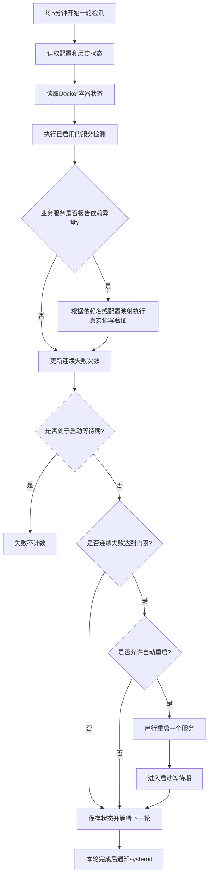

# 0026 Docker Compose Watchdog 开发设计

> 版本：v1.0
> 日期：2026-08-25
> 状态：设计中
> 适用部署：Linux + systemd + Docker Compose
> 不适用范围：Kubernetes（当前生产环境未使用）

---

## 1. Watchdog 简介

本期 Watchdog 只做第一阶段最核心的事情：定期检查 OMC 的主要业务进程和基础依赖服务是否还活着；如果连续多轮检查都失败，就尝试重启对应服务；重启后给服务一段恢复等待时间，在这段时间内检测失败不再重复计数，避免刚重启就被再次重启。

它不是监控平台，也不是容量治理工具。Prometheus 继续负责指标、趋势和告警；Watchdog 只负责本机 Docker Compose 服务的自愈。

如果业务服务报告基础依赖异常，Watchdog 不直接重启基础服务，而是先对对应基础服务做一次真实最小读写验证：新增一条专用探测数据、查询确认、再删除清理。只有这个验证也连续失败，才认为基础服务本体异常；如果验证成功，则优先认为是业务进程自己的连接池、连接状态或客户端链路异常。

第一阶段只满足四个目标：

1. 主要业务进程或基础依赖服务挂了，连续多轮检查仍失败后，尝试重启；
2. 重启后有启动等待时间，等待时间内的检测失败不算新异常；
3. 默认检测主要业务进程和基础依赖服务，但检测周期、失败次数、是否检测、是否允许自动重启都可配置，并支持热生效；
4. Watchdog 自己也要能被监管，避免 Watchdog 挂了无人发现。

第一阶段不做复杂自愈，不做全栈定时重启，不做服务器资源治理。可以新增 `/watchdogz`，但只用于主要业务进程里的必要业务探测，不扩展成全量 goroutine 巡检。

---

## 2. 检测范围

### 2.1 默认检测的主要业务服务

| 服务 | 作用 | 默认检测方式 |
|---|---|---|
| `web` | 前端入口、Nginx 反向代理、ACS入口代理 | Docker状态、管理入口HTTP、ACS入口TCP、Nginx状态页 |
| `app` | 管理面API和控制面服务 | Docker状态、`/healthz`、`/watchdogz`、主业务端口TCP |
| `acs` | 正式ACS实例，承载TR-069流量 | Docker状态、`/healthz`、`/watchdogz`、ACS端口TCP |
| `acs-candidate` | 发布接力实例 | Docker状态、容器网络内 `/healthz`、`/watchdogz` |
| `worker` | PM/MR、告警、异步任务消费者 | Docker状态、`/healthz`、`/watchdogz` |

说明：

- `/healthz` 只证明进程和HTTP探针通道还活着，不证明业务完全正常；
- `web` 不是 Go 进程，没有 `/healthz`，以 Nginx 入口和 Docker 状态为主；
- `/watchdogz` 只给主要业务进程使用，基础依赖服务不需要实现。

### 2.2 `/watchdogz` 只检查必要业务项

`/watchdogz` 是主要业务进程自己暴露的轻量内部探针，用来补充 `/healthz` 的不足。它只回答一个问题：这个进程里最必要的主业务组件是否还在运行。

它不做这些事情：

- 不访问 PostgreSQL、Redis、NATS、MinIO；
- 不创建测试数据；
- 不检查所有 goroutine；
- 不根据日志关键字直接判定重启；
- 不替代 `/readyz` 做依赖判断。

第一阶段建议只检查下面这些必要项：

| 服务 | `/watchdogz` 必要检查项 | 说明 |
|---|---|---|
| `app` | `main-api`、`core-control-loop` | 管理面主API和核心控制循环仍在运行 |
| `acs` | `cwmp-server`、`session-loop` | ACS主服务和会话处理主循环仍在运行 |
| `acs-candidate` | `cwmp-server`、`session-loop` | 与 `acs` 相同，但通过容器网络访问 |
| `worker` | `worker-supervisor`、`pm-mr-consumer` | worker主调度器和PM/MR消费主循环仍在运行 |

`/watchdogz` 返回规则：

| 结果 | 含义 | Watchdog处理 |
|---|---|---|
| HTTP 200 | 必要项正常 | 该探针成功，清空 `/watchdogz` 连续失败计数 |
| HTTP 503 | 必要项异常 | 记为失败，连续达到门限后可重启该业务进程 |
| 超时或连接失败 | 探针不可达 | 记为失败 |
| 未实现或配置关闭 | 不参与检测 | 不计失败，不触发重启 |

示例响应：

```json
{
  "status": "ok",
  "components": [
    {"name": "main-api", "status": "ok"},
    {"name": "core-control-loop", "status": "ok"}
  ]
}
```

### 2.3 默认检测的基础依赖服务

| 服务 | 默认检测方式 |
|---|---|
| `postgres` | Docker状态、`pg_isready` 或 `SELECT 1` |
| `postgres-tsdb` | Docker状态、`pg_isready` 或 `SELECT 1` |
| `redis-core` | Docker状态、`PING` |
| `redis-pm` | Docker状态、`PING` |
| `nats` | Docker状态、健康接口或TCP端口 |
| `minio` | Docker状态、live/ready健康接口 |

基础依赖服务平时先做轻量检测。当主要业务服务通过 `/readyz` 或依赖检查报告基础服务异常时，Watchdog 需要对对应基础服务执行一次真实读写验证，用专用测试数据完成“新增、查询、删除”，确认基础服务到底是否真实可用。

真实读写验证只在业务服务报告依赖异常时触发，不作为每轮固定写入动作，避免 Watchdog 自己给数据库或 Redis 制造额外压力。

### 2.4 基础服务真实读写验证

真实读写验证使用 Watchdog 专用数据，不使用业务数据。

对应基础服务的确定规则：

1. 优先使用 `/readyz` 返回的失败依赖名，例如 `postgres`、`redis-core`、`nats`；
2. 如果 `/readyz` 只返回整体失败、没有细分依赖名，则按业务服务配置里的 `dependencies` 列表逐个验证；
3. 如果既没有失败依赖名，也没有 `dependencies` 配置，Watchdog 不猜测依赖关系，只记录告警。

连接路径原则：真实读写验证要尽量复用业务进程实际使用的连接地址、端口和认证信息。如果某个依赖只在 Docker 网络内可访问，Watchdog 可以通过配置选择容器网络地址，或通过受控方式在同一 Compose 网络内执行验证，避免只验证宿主机端口而漏掉容器网络问题。

| 基础服务 | 验证方式 | 成功标准 |
|---|---|---|
| `postgres` / `postgres-tsdb` | 向专用表 `INSERT` 一条探测记录，`SELECT` 校验 token，再 `DELETE` 删除 | 三步都成功，且查询到的 token 与写入一致 |
| `redis-core` / `redis-pm` | `SET` 一个带TTL的专用key，`GET` 校验值，再 `DEL` 删除 | 三步都成功，且查询到的值与写入一致 |
| `minio` | 上传一个专用小对象，`GET` 或 `HEAD` 校验，再删除对象 | 对象可写、可读、可删除 |
| `nats` | 使用临时 subject 发布一条探测消息并消费到，再取消订阅 | 能完成发布和消费闭环 |

PostgreSQL / TimescaleDB 建议在安装初始化阶段准备专用表。Watchdog 运行期不每轮建表，只执行新增、查询和删除：

```sql
CREATE SCHEMA IF NOT EXISTS omc_watchdog;

CREATE TABLE IF NOT EXISTS omc_watchdog.probe (
    id text PRIMARY KEY,
    token text NOT NULL,
    updated_at timestamptz NOT NULL DEFAULT now()
);
```

运行期验证语句：

```sql
BEGIN;
SET LOCAL statement_timeout = '2s';
SET LOCAL lock_timeout = '500ms';

INSERT INTO omc_watchdog.probe (id, token, updated_at)
VALUES ($1, $2, now());

SELECT token
FROM omc_watchdog.probe
WHERE id = $1;

DELETE FROM omc_watchdog.probe
WHERE id = $1;

COMMIT;
```

Redis 验证命令：

```text
SET omc:watchdog:<service>:<probe-id> <token> EX 600 NX
GET omc:watchdog:<service>:<probe-id>
DEL omc:watchdog:<service>:<probe-id>
```

MinIO 验证动作：

```text
PUT    omc-watchdog/<host-id>/<probe-id>
GET    omc-watchdog/<host-id>/<probe-id>
DELETE omc-watchdog/<host-id>/<probe-id>
```

NATS 验证动作：

```text
SUB omc.watchdog.probe.<probe-id>
PUB omc.watchdog.probe.<probe-id> <token>
等待收到 <token>
UNSUB omc.watchdog.probe.<probe-id>
```

验证结果使用规则：

1. 真实读写验证失败，说明基础服务本体或最小读写链路确实异常；
2. 真实读写验证成功，但业务服务仍持续报告依赖异常，说明更可能是业务进程自己的连接池、连接状态或客户端链路异常；
3. 真实读写验证也要遵守连续失败门限，默认连续3轮失败后才进入基础服务重启候选；
4. 真实读写验证成功时，不重启基础服务。

---

## 3. 默认检测周期和门限

第一阶段默认采用保守策略，避免因为短暂抖动误重启。

| 参数 | 默认值 | 说明 |
|---|---:|---|
| 全局检测周期 | `5m` | 每5分钟执行一轮检测 |
| 连续失败门限 | `3` | 连续3轮失败后才进入重启候选，约15分钟观察窗口 |
| 单次HTTP超时 | `2s~6s` | 单次探测不能拖慢整轮检测 |
| 单次TCP超时 | `2s` | 只验证端口是否可连接 |
| 默认启动等待时间 | `5m` | 重启后5分钟内失败不累计 |
| 慢启动服务等待时间 | `10m` | `worker`、`postgres`、`postgres-tsdb`、`nats` 等可配置更长 |
| 重启冷却时间 | `15m` | 恢复成功后短时间内不重复自动重启 |
| 单服务重启预算 | `2次/2h` | 超过预算后停止自动重启，只告警 |
| 全局恢复并发 | `1` | 任意时刻只重启一个服务 |

单次探测的超时仍然是秒级，这是为了防止某个HTTP、TCP或SQL检查卡住整轮检测；这不代表 Watchdog 会秒级重启服务。

单个服务如果配置了自己的检测周期，以服务配置为准；没有配置时使用全局检测周期。

---

## 4. 检测循环

Watchdog 主循环每5分钟执行一次，流程如下：

```text
1. 读取最新配置
2. 读取上次状态，包括失败次数、重启等待窗口、冷却窗口和重启预算
3. 通过 Docker API 获取目标容器状态
4. 对已启用服务执行健康检测
5. 如果主要业务服务报告基础依赖异常，根据失败依赖名或 `dependencies` 配置，对对应基础服务执行真实读写验证
6. 更新每个服务的连续失败次数
7. 如果服务处于启动等待期，检测失败记为预期失败，不增加失败次数
8. 如果服务检测成功，清空该服务连续失败次数
9. 如果连续失败达到门限，生成一个重启候选
10. 检查是否允许重启：是否启用恢复、是否在冷却期、是否超预算、是否已有其他服务正在恢复
11. 只选择一个服务执行重启
12. 记录重启事件，并进入启动等待期
13. 保存状态，输出日志和指标
14. 本轮完整结束后通知 systemd：Watchdog 自己仍然健康
```

流程图：



---

## 5. 异常判断和恢复规则

### 5.1 什么情况下重启

一个服务可能有多个检查项。第一阶段按简单规则处理：Docker状态、`/healthz`、`/watchdogz`、HTTP/TCP 入口属于主要检查项；任一已启用的主要检查项连续失败达到门限，就可以进入重启候选。`/readyz` 默认只作为依赖辅助信号，不直接触发业务服务重启。

满足以下条件时，Watchdog 可以尝试重启目标服务：

1. 服务已配置 `enabled=true`；
2. 服务已配置 `recovery_enabled=true`；
3. 连续失败次数达到配置门限，默认3轮；
4. 服务不在启动等待期；
5. 服务不在冷却期；
6. 服务未超过重启预算；
7. 当前没有其他服务正在执行自动重启。

### 5.2 什么情况下不重启

以下情况不自动重启：

1. 单次检测失败；
2. 服务刚重启，仍在启动等待时间内；
3. 服务刚恢复，仍在冷却期；
4. 服务超过重启预算；
5. 配置关闭了检测或关闭了自动恢复；
6. Watchdog 无法确认要操作的 Docker 容器；
7. 正在执行发布、升级、迁移等维护动作。

### 5.3 业务服务报依赖异常时怎么处理

如果业务服务的 `/readyz` 或明确依赖检查结果显示依赖异常，第一阶段按简单规则处理：

1. 先根据失败依赖名或业务服务配置的 `dependencies` 找到对应基础依赖服务；
2. 对该基础服务执行真实读写验证；
3. 如果真实读写验证也连续失败，说明基础服务本体或最小读写链路异常，优先重启基础依赖服务；
4. 如果真实读写验证成功，但业务服务持续报依赖异常，说明可能是业务进程自己的连接池、连接状态或客户端链路异常；
5. 此时只重启受影响的业务服务，不重启基础依赖服务；
6. 多个业务服务同时异常时，不批量重启，仍然一次只恢复一个服务。

`/readyz` 不作为“直接重启业务服务”的唯一依据，它只作为判断依赖问题的辅助信号。

---

## 6. 重启后的等待和计数规则

每个服务都有独立状态。

| 状态 | 含义 | 处理方式 |
|---|---|---|
| `HEALTHY` | 最近检测正常 | 失败计数为0 |
| `SUSPECT` | 出现失败但未达到门限 | 增加失败计数，不重启 |
| `UNHEALTHY` | 连续失败达到门限 | 进入重启候选 |
| `RECOVERING` | 已发起重启，正在等待启动 | 失败不计数 |
| `COOLDOWN` | 刚恢复成功 | 继续检测，但不重复重启 |
| `QUARANTINED` | 超过重启预算 | 只检测和告警，不再自动重启 |

示例：`app` 默认5分钟检测一次，连续3轮失败后重启。

```text
00m  app 检测成功，状态 HEALTHY
05m  第1次失败，状态 SUSPECT，不重启
10m  第2次失败，继续观察，不重启
15m  第3次失败，达到门限，准备重启
15m+ 执行 docker restart app
15m~20m app 处于启动等待期，期间检测失败不计数
20m  app 检测成功，进入冷却期
20m~35m 冷却期内继续检测，但不重复自动重启
35m  冷却结束，恢复正常检测
```

默认启动等待时间：

| 服务类型 | 默认启动等待时间 |
|---|---:|
| `web` | `5m` |
| `app` | `5m` |
| `acs` / `acs-candidate` | `5m` |
| `worker` | `10m` |
| `redis-core` / `redis-pm` | `5m` |
| `postgres` / `postgres-tsdb` | `10m` |
| `nats` | `10m` |
| `minio` | `5m` |

---

## 7. 配置设计

配置文件默认路径：

```text
/etc/omc/watchdog.yaml
```

配置原则：

1. 默认检测主要业务服务和基础依赖服务；
2. 每个服务都可以单独开启或关闭检测；
3. 每个服务都可以单独开启或关闭自动恢复；
4. 检测周期、失败门限、启动等待时间、冷却时间和重启预算都可以配置；
5. 配置支持热加载，修改后不需要重启 Watchdog。
6. `/watchdogz` 的开关和必要组件列表也可以配置，只检查配置中列出的必要组件。
7. 基础服务真实读写验证可以配置开关、触发条件、验证方式和最小触发间隔。

配置样例：

```yaml
version: 1

global:
  scan_interval: 5m
  default_failure_threshold: 3
  default_startup_grace: 5m
  default_cooldown: 15m
  max_parallel_recoveries: 1
  hot_reload: true

dependency_verify:
  enabled: true
  triggers: [readyz_failure]
  min_interval: 2m
  failure_threshold: 3

watchdog_self:
  systemd_notify: true
  health_addr: 127.0.0.1:19100

targets:
  web:
    enabled: true
    recovery_enabled: true
    kind: business
    interval: 5m
    checks:
      docker: true
      http:
        enabled: true
        url: http://127.0.0.1:8081/
        timeout: 3s
      tcp:
        enabled: true
        address: 127.0.0.1:8080
        timeout: 2s
    failure_threshold: 3
    startup_grace: 5m
    cooldown: 15m
    restart_budget:
      count: 2
      window: 2h

  app:
    enabled: true
    recovery_enabled: true
    kind: business
    dependencies: [postgres, redis-core, nats, minio]
    interval: 5m
    checks:
      docker: true
      healthz:
        enabled: true
        url: http://127.0.0.1:9091/healthz
        timeout: 2s
      tcp:
        enabled: true
        address: 127.0.0.1:18081
        timeout: 2s
      watchdogz:
        enabled: true
        url: http://127.0.0.1:9091/watchdogz
        timeout: 2s
        required_components: [main-api, core-control-loop]
      readyz:
        enabled: true
        url: http://127.0.0.1:9091/readyz
        timeout: 6s
        recovery_trigger: false
    failure_threshold: 3
    startup_grace: 5m
    cooldown: 15m
    restart_budget:
      count: 2
      window: 2h

  acs:
    enabled: true
    recovery_enabled: true
    kind: business
    dependencies: [postgres, redis-core]
    interval: 5m
    checks:
      docker: true
      healthz:
        enabled: true
        url: http://127.0.0.1:9095/healthz
        timeout: 2s
      tcp:
        enabled: true
        address: 127.0.0.1:7557
        timeout: 2s
      watchdogz:
        enabled: true
        url: http://127.0.0.1:9095/watchdogz
        timeout: 2s
        required_components: [cwmp-server, session-loop]
    failure_threshold: 3
    startup_grace: 5m
    cooldown: 15m
    restart_budget:
      count: 2
      window: 2h

  worker:
    enabled: true
    recovery_enabled: true
    kind: business
    dependencies: [postgres, postgres-tsdb, redis-pm, nats, minio]
    interval: 5m
    checks:
      docker: true
      healthz:
        enabled: true
        url: http://127.0.0.1:9092/healthz
        timeout: 3s
      watchdogz:
        enabled: true
        url: http://127.0.0.1:9092/watchdogz
        timeout: 3s
        required_components: [worker-supervisor, pm-mr-consumer]
    failure_threshold: 3
    startup_grace: 10m
    cooldown: 15m
    restart_budget:
      count: 2
      window: 2h

  postgres:
    enabled: true
    recovery_enabled: true
    kind: dependency
    interval: 5m
    checks:
      docker: true
      postgres:
        enabled: true
        timeout: 2s
        verify:
          enabled: true
          mode: sql_insert_select_delete
          schema: omc_watchdog
          table: probe
          timeout: 3s
    failure_threshold: 3
    startup_grace: 10m

  redis-core:
    enabled: true
    recovery_enabled: true
    kind: dependency
    interval: 5m
    checks:
      docker: true
      redis:
        enabled: true
        timeout: 1s
        verify:
          enabled: true
          mode: redis_set_get_del
          key_prefix: omc:watchdog
          ttl: 10m
          timeout: 2s
    failure_threshold: 3
    startup_grace: 5m
```

其他服务如 `acs-candidate`、`postgres-tsdb`、`redis-pm`、`nats`、`minio` 按同样方式配置。未写出的核心服务使用程序内置默认配置；如果现场不希望自动重启某个服务，可以把 `recovery_enabled` 改为 `false`；如果要关闭某个服务检测，必须显式配置：

```yaml
targets:
  acs-candidate:
    enabled: false
```

### 7.1 配置项说明

以下说明对应上面的 YAML 样例。

全局配置：

| 配置项 | 含义 |
|---|---|
| `version` | 配置文件版本，便于后续兼容升级 |
| `global.scan_interval` | 全局默认检测周期，例如 `5m` 表示每5分钟检测一轮 |
| `global.default_failure_threshold` | 默认连续失败门限，例如 `3` 表示连续3轮失败后才进入重启候选 |
| `global.default_startup_grace` | 默认启动等待时间，服务重启后这段时间内检测失败不计入新异常 |
| `global.default_cooldown` | 默认冷却时间，服务刚恢复后这段时间内不重复自动重启 |
| `global.max_parallel_recoveries` | 同一时刻最多允许几个自动恢复动作，第一阶段固定建议为 `1` |
| `global.hot_reload` | 是否启用配置热加载 |
| `watchdog_self.systemd_notify` | 是否向 systemd 发送 `READY=1` 和 `WATCHDOG=1` |
| `watchdog_self.health_addr` | Watchdog 自身本地健康接口监听地址 |

基础服务真实验证配置：

| 配置项 | 含义 |
|---|---|
| `dependency_verify.enabled` | 是否开启基础服务真实读写验证；关闭后只做轻量检测 |
| `dependency_verify.triggers` | 触发真实验证的来源；第一阶段默认 `readyz_failure`，表示业务服务 `/readyz` 报依赖异常时触发 |
| `dependency_verify.min_interval` | 同一个基础服务两次真实验证之间的最小间隔，避免短时间内反复写入探测数据 |
| `dependency_verify.failure_threshold` | 真实读写验证连续失败几轮后，才认为基础服务可进入重启候选；默认与服务失败门限一致，为 `3` |

服务级配置：

| 配置项 | 含义 |
|---|---|
| `targets.<service>` | 被检测服务名，例如 `app`、`acs`、`redis-core` |
| `enabled` | 是否检测该服务；为 `false` 时不检测、不计数、不恢复 |
| `recovery_enabled` | 是否允许自动重启；为 `false` 时仍可检测和告警，但不自动恢复 |
| `kind` | 服务类型，`business` 表示主要业务服务，`dependency` 表示基础依赖服务 |
| `dependencies` | 业务服务依赖的基础服务列表；当 `/readyz` 没有返回具体失败依赖名时，Watchdog 按这个列表逐个做真实验证 |
| `interval` | 当前服务自己的检测周期；不配置时使用 `global.scan_interval` |
| `failure_threshold` | 当前服务连续失败几轮后进入重启候选；不配置时使用全局默认值 |
| `startup_grace` | 当前服务重启后的启动等待时间；等待期内失败不累计 |
| `cooldown` | 当前服务恢复后的冷却时间；冷却期内继续检测，但不重复自动重启 |
| `restart_budget.count` | 一个预算窗口内最多允许自动重启几次 |
| `restart_budget.window` | 重启预算窗口，例如 `2h` 表示2小时内最多重启指定次数 |

检查项配置：

| 配置项 | 含义 |
|---|---|
| `checks.docker` | 是否检查 Docker 容器状态，包括容器是否存在、是否 running |
| `checks.http.enabled` | 是否启用 HTTP 检查 |
| `checks.http.url` | HTTP 检查地址，例如 `web` 的管理入口 |
| `checks.healthz.enabled` | 是否启用 `/healthz` 检查 |
| `checks.healthz.url` | `/healthz` 地址，用于判断进程基本存活 |
| `checks.tcp.enabled` | 是否启用 TCP 端口检查 |
| `checks.tcp.address` | TCP 检查地址，例如 `127.0.0.1:7557` |
| `checks.watchdogz.enabled` | 是否启用 `/watchdogz` 检查 |
| `checks.watchdogz.url` | `/watchdogz` 地址，用于检查必要业务组件是否仍在运行 |
| `checks.watchdogz.required_components` | `/watchdogz` 必须返回正常的组件列表，只检查这里列出的必要组件 |
| `checks.readyz.enabled` | 是否启用 `/readyz` 检查 |
| `checks.readyz.url` | `/readyz` 地址，用于辅助判断依赖是否异常 |
| `checks.readyz.recovery_trigger` | 是否允许 `/readyz` 直接触发重启；第一阶段默认 `false` |
| `checks.postgres.enabled` | 是否启用 PostgreSQL 轻量检查 |
| `checks.redis.enabled` | 是否启用 Redis 轻量检查 |
| `checks.<dependency>.verify.enabled` | 是否允许该基础服务执行真实读写验证 |
| `checks.postgres.verify.mode` | PostgreSQL 真实验证方式，第一阶段使用 `sql_insert_select_delete` |
| `checks.postgres.verify.schema` | PostgreSQL 专用探测 schema，默认 `omc_watchdog` |
| `checks.postgres.verify.table` | PostgreSQL 专用探测表，默认 `probe` |
| `checks.redis.verify.mode` | Redis 真实验证方式，第一阶段使用 `redis_set_get_del` |
| `checks.redis.verify.key_prefix` | Redis 探测 key 前缀，例如 `omc:watchdog` |
| `checks.redis.verify.ttl` | Redis 探测 key 的过期时间，即使删除失败也会自动过期 |
| `checks.minio.verify.mode` | MinIO 真实验证方式，第一阶段使用小对象 PUT、GET/HEAD、DELETE |
| `checks.nats.verify.mode` | NATS 真实验证方式，第一阶段使用临时 subject 发布并消费一条探测消息 |
| `timeout` | 单次检查超时时间；超时只影响本轮结果，不代表立即重启 |

配置关闭示例：

```yaml
targets:
  worker:
    enabled: true
    recovery_enabled: false

  acs-candidate:
    enabled: false
```

含义：

- `worker` 仍然检测和告警，但不会自动重启；
- `acs-candidate` 完全不检测，也不会自动重启。

### 7.2 热加载规则

Watchdog 支持以下热加载方式：

1. `watchdogctl reload`；
2. 给 Watchdog 进程发送 `SIGHUP`；
3. 监听 `/etc/omc/watchdog.yaml` 文件变更。

热加载要求：

- 新配置校验通过后，从下一轮检测开始生效；
- 新配置校验失败时，继续使用旧配置；
- 修改检测周期、失败次数、服务开关、恢复开关可热生效；
- 修改 systemd unit、监听地址、Docker socket 路径等基础运行参数，需要重启 Watchdog；
- 关闭某个服务检测后，该服务不再计数、不再恢复；
- 关闭 `recovery_enabled` 后，该服务继续检测和上报，但不自动重启。

---

## 8. Watchdog 自身自检

Watchdog 本身不建议放在同一个 Docker Compose 里启动，第一阶段建议作为宿主机 systemd 服务运行。原因很简单：如果 Docker 或 Compose 流程本身异常，放在容器里的 Watchdog 也可能一起失效。

建议 systemd unit：

```ini
[Unit]
Description=OMC Host Watchdog
After=network-online.target docker.service
Wants=network-online.target docker.service

[Service]
Type=notify
NotifyAccess=main
ExecStart=/opt/omc/current/bin/omc-watchdog --config /etc/omc/watchdog.yaml
Restart=always
RestartSec=10s
WatchdogSec=15m
TimeoutStopSec=10s

[Install]
WantedBy=multi-user.target
```

Watchdog 自检方式：

1. Watchdog 启动成功后向 systemd 发送 `READY=1`；
2. 每一轮检测完整结束后才向 systemd 发送 `WATCHDOG=1`；
3. 如果 Watchdog 主循环卡住，无法完成检测，也就不会继续发送 `WATCHDOG=1`；
4. systemd 超过 `WatchdogSec` 未收到心跳后，自动重启 Watchdog；
5. Watchdog 重启后从本地状态文件恢复失败计数、冷却窗口和重启预算，避免重启后丢状态。

Watchdog 可以额外暴露本地自检接口：

```text
GET http://127.0.0.1:19100/healthz
```

这个接口只用于确认 Watchdog 进程自身还活着。真正判断 Watchdog 主循环是否正常，仍以 systemd `WATCHDOG=1` 为准。

---

## 9. 日志、状态和告警

第一阶段只需要保留必要信息，方便排查和审计：

| 信息 | 说明 |
|---|---|
| 当前服务状态 | `HEALTHY`、`SUSPECT`、`UNHEALTHY`、`RECOVERING`、`COOLDOWN`、`QUARANTINED` |
| 连续失败次数 | 每个服务独立计数 |
| 最近一次失败原因 | Docker退出、HTTP失败、TCP失败、依赖探测失败等 |
| 最近一次重启时间 | 用于冷却和预算判断 |
| 重启结果 | 成功、失败、超时、被配置禁止、超预算 |

状态文件建议：

```text
/opt/omc/run/watchdog/state.json
/opt/omc/run/watchdog/events.jsonl
```

日志写入 journald，同时可以暴露少量 Prometheus 指标：

- `omc_watchdog_target_status`；
- `omc_watchdog_probe_failures_total`；
- `omc_watchdog_restarts_total`；
- `omc_watchdog_recovery_suppressed_total`。

Prometheus 只负责展示和告警，不负责直接执行重启。

---

## 10. 第一阶段验收标准

1. `web`、`app`、`acs`、`acs-candidate`、`worker` 默认会被检测；
2. `postgres`、`postgres-tsdb`、`redis-core`、`redis-pm`、`nats`、`minio` 默认会被检测；
3. 默认5分钟检测一轮；
4. 默认连续3轮失败才尝试重启；
5. 重启后进入启动等待时间，等待期内失败不累计；
6. 同一时刻最多自动重启一个服务；
7. 每个服务都可以配置是否检测、是否自动恢复、检测周期、失败次数和启动等待时间；
8. `app`、`acs`、`acs-candidate`、`worker` 支持 `/watchdogz`，只检查必要业务组件；
9. 业务服务报告基础依赖异常时，Watchdog 会对对应基础服务执行真实新增、查询、删除或等价闭环验证；
10. 基础服务真实验证成功时，不重启基础服务；真实验证连续失败达到门限后，才允许进入基础服务重启候选；
11. 配置热加载成功后下一轮检测生效；
12. 配置热加载失败时旧配置继续生效；
13. Watchdog 进程退出或主循环卡死后，systemd 能自动重启 Watchdog；
14. Watchdog 重启后不丢失冷却期、失败次数和重启预算。

---
